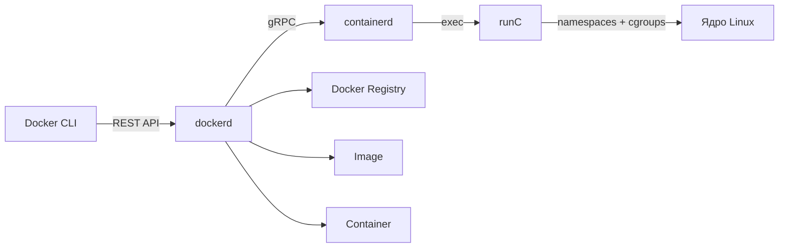
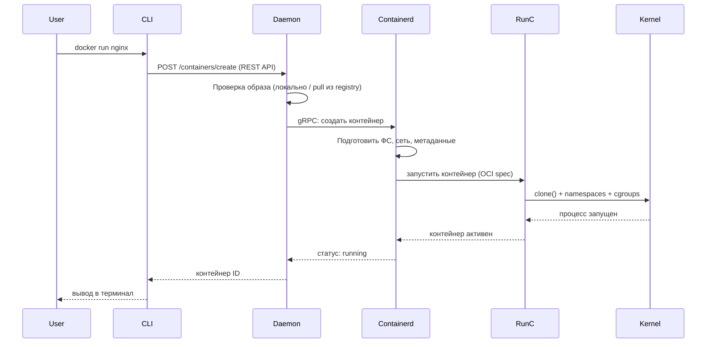

>[!SUMMARY] Главная идея 
>Docker — **удобный враппер** над стандартными примитивами Linux (cgroups + namespaces), упакованный в единый рабочий процесс: `Dockerfile → Image → Registry → Container`.

## Pets vs Cattle (концепция для понимания)
| Подход     | Философия                             | Как лечим                 | Масштабирование            | Docker подходит? |
| ---------- | ------------------------------------- | ------------------------- | -------------------------- | ---------------- |
| **Pets**   | Сервер уникальный, с именем, заботой  | Лечим, чиним, бережём     | Сложно, вручную            | Нет              |
| **Cattle** | Сервер — безликий, заменяемый элемент | Убиваем → запускаем новый | Автоматически, по нагрузке | Да               |

> [!TIP] Правило для контейнеров
>  **Не чини контейнер — пересоздай его.** Если что-то сломалось внутри — это баг в образе, а не в рантайме.

---


### Компоненты

| Компонент                   | За что отвечает                                                                       | Практическое значение               |
| --------------------------- | ------------------------------------------------------------------------------------- | ----------------------------------- |
| **Docker CLI**              | Интерфейс для пользователя (`docker run`, `build`)                                    | То, с чем работаешь в терминале     |
| **dockerd** (Docker daemon) | Принимает команды от CLI, управляет объектами (images, containers, networks, volumes) | «Мозг» Docker, работает как сервис  |
| **containerd**              | Управление жизненным циклом контейнера: pull, create, start, stop, delete             | Промежуточный слой, стандарт OCI    |
| **runC**                    | Низкоуровневый runtime: создаёт процесс в namespaces + cgroups                        | Запускает контейнер на уровне ядра  |
| **Docker Image**            | Read-only шаблон со слоями (union FS)                                                 | Артефакт сборки, хранится в реестре |
| **Docker Container**        | Запущенный экземпляр образа + writable layer                                          | Изолированный процесс приложения    |
| **Docker Registry**         | Хранилище образов (Docker Hub, GitLab Registry, Harbor)                               | Источник truth для образов          |

---

## Что происходит при `docker run` (по шагам)



Как посмотреть этот процесс в действии
```bash
# Включить дебаг-логи демона
sudo journalctl -u docker -f

# Посмотреть, какие процессы создаёт containerd
ps aux | grep containerd

# Найти runC в процессе запуска
strace -f -e trace=clone docker run --rm alpine echo test 2>&1 | grep clone
```

## Docker Engine vs Docker Desktop
|                | **Docker Engine**                 | **Docker Desktop**                            |
| -------------- | --------------------------------- | --------------------------------------------- |
| **Платформа**  | Linux (нативно)                   | Windows, macOS, Linux (опционально)           |
| **Что внутри** | dockerd + CLI + containerd + runC | VM (Linux) + Docker Engine + GUI + Kubernetes |
| **Для кого**   | Продакшен, серверы, CI/CD         | Разработка на десктопе, обучение              |
| **Лицензия**   | Open Source (Apache 2.0)          | Проприетарная (бесплатно для малых команд)    |
| **Ресурсы**    | Минимальные оверхеды              | + оверхед на виртуализацию (на non-Linux)     |
>[!NOTE] Для случая 
>Если  **Linux-сервер** → используй **Docker Engine CE**. Docker Desktop не нужен, только лишние слои абстракции.


## Практика:
```bash
# 1. Посмотри, какие демоны работают
systemctl status docker
ps aux | grep -E 'dockerd|containerd|runc'

# 2. Проверь версию каждого компонента
docker version --format '{{.Server.Components}}'
# Или подробно:
docker version

# 3. Найди, где лежит сокет для API
ls -la /var/run/docker.sock  # CLI общается с daemon через UNIX socket

# 4. Посмотри, как daemon хранит данные
ls -la /var/lib/docker/
# Подсказка: 
#   - images/overlay2/ — слои образов
#   - containers/ — конфиги запущенных контейнеров
#   - volumes/ — данные volumes

# 5. Запусти контейнер и найди его процесс
docker run -d --name test nginx
ps aux | grep nginx  # увидишь процесс, но он в изолированном namespace

# 6. Проверь, какие namespaces использует процесс
PID=$(docker inspect test --format '{{.State.Pid}}')
ls -la /proc/$PID/ns/
# Вывод: net:[...] pid:[...] mnt:[...] — всё изолировано
```

## Источники (официальные)

- [Docker Architecture (официальная док-я)](https://docs.docker.com/get-started/overview/#docker-architecture) — базовая схема
- [OCI Runtime Specification](https://github.com/opencontainers/runtime-spec) — стандарт, по которому работает runC
- [containerd Docs](https://github.com/containerd/containerd/blob/main/docs/getting-started.md) — как использовать напрямую
- [Docker Daemon CLI Flags](https://docs.docker.com/engine/reference/commandline/dockerd/) — тонкая настройка daemon