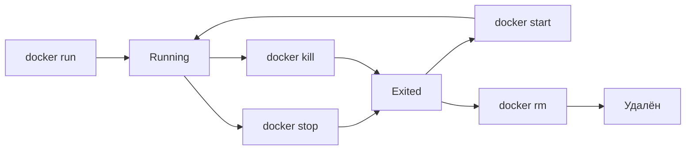

# Docker CLI: Практический Cheat Sheet

>[!SUMMARY] Главное 
>90% работы с Docker — это `run`, `ps`, `exec`, `logs`. Остальное — уточнения.

## Команды управления контейнерами (быстрый доступ)
| Команда           | Что делает                                | Ключевые флаги                            | Пример                                      |
| ----------------- | ----------------------------------------- | ----------------------------------------- | ------------------------------------------- |
| **`docker run`**  | Создает и запускает контейнер             | `-d`, `-p`, `--name`, `-e`, `-v`, `--rm`  | `docker run -d -p 8080:80 --name web nginx` |
| **`docker ps`**   | Показывает запущенные контейнеры          | `-a` (все), `-q` (только ID), `--filter`  | `docker ps -a --filter "status=exited"`     |
| **`docker stop`** | Корректная остановка (SIGTERM → SIGKILL)  | `-t <сек>` (таймаут)                      | `docker stop -t 30 web`                     |
| **`docker kill`** | Принудительная остановка (сигнал)         | `-s <SIGNAL>`                             | `docker kill -s HUP web`                    |
| **`docker rm`**   | Удаляет остановленный контейнер           | `-f` (force), `-v` (удалить volumes)      | `docker rm -v web`                          |
| **`docker exec`** | Запускает команду в запущенном контейнере | `-it` (интерактив), `-u` (user)           | `docker exec -it web bash`                  |
| **`docker logs`** | Показывает логи контейнера                | `-f` (follow), `--tail`, `-t` (timestamp) | `docker logs -f --tail 100 web`             |
>[!TIP] Алиасы 
>`docker container run` ≡ `docker run` — разницы нет, используй короткий вариант.

## Ключевые флаги `docker run` (запомни эти)

```bash
docker run [OPTIONS] IMAGE [COMMAND]

#  Режим запуска
-d, --detach              # фон (вернёт ID контейнера)
--rm                      # автоудаление после остановки (для тестов)

#  Сеть
-p, --publish             # маппинг портов: -p 8080:80 (хост:контейнер)
--network                 # сеть: bridge, host, none, custom

#  Идентификация
--name                    # имя контейнера: --name myapp
--hostname                # hostname внутри контейнера

#  Переменные и секреты
-e, --env                 # env vars: -e DB_HOST=localhost
--env-file                # файл с переменными: --env-file .env

#  Хранилище
-v, --volume              # маппинг volumes: -v ./data:/app/data
--mount                   # альтернативный синтаксис (более явный)

#  Ресурсы
--cpus, --memory          # лимиты: --cpus=1.5 --memory=512m
--restart                 # политика: no, on-failure, always, unless-stopped
```

### Примеры паттернов (копируй и адаптируй)

```bash
#  Веб-сервер с пробросом порта
docker run -d -p 8080:80 --name web --restart unless-stopped nginx:alpine

#  Приложение с env-переменными и volume
docker run -d \
  --name app \
  -e DATABASE_URL=postgres://... \
  -v ./logs:/app/logs \
  --restart on-failure \
  myapp:1.0

#  Одноразовый тестовый контейнер (удалится после выхода)
docker run --rm -it alpine sh

#  Запуск команды в уже работающем контейнере
docker exec -it web nginx -s reload
```




>[!NOTE] Статусы в `docker ps`
>
>- `Up` — работает
>- `Exited (0)` — завершён успешно
>- `Exited (137)` — убит сигналом SIGKILL (128+9)
>- `Created` — создан, но не запущен
>- `Paused` — приостановлен (`docker pause`)

## Работа с образами
| Команда              | Что делает                  | Пример                                   |
| -------------------- | --------------------------- | ---------------------------------------- |
| **`docker images`**  | Список локальных образов    | `docker images --filter "dangling=true"` |
| **`docker pull`**    | Скачать образ               | `docker pull nginx:1.25-alpine`          |
| **`docker rmi`**     | Удалить образ               | `docker rmi nginx:1.25`                  |
| **`docker build`**   | Собрать образ из Dockerfile | `docker build -t myapp:1.0 .`            |
| **`docker history`** | Показать слои образа        | `docker history --no-trunc nginx`        |

```bash
# Очистка кэша (безопасно)
docker image prune          # удалить «висячие» образы
docker image prune -a       # удалить все неиспользуемые образы

# Посмотреть, что занимает место
docker system df -v
```

## Вход в контейнер и отладка

```bash
#  Интерактивный вход (если есть bash/sh)
docker exec -it <container> /bin/bash
docker exec -it <container> sh  # для alpine

#  Запуск команды без интерактива
docker exec <container> ls -la /app

#  Запуск от другого пользователя
docker exec -u root <container> whoami

#  Если bash нет — используй sh или cat
docker exec <container> cat /etc/os-release
```

>[!TIP] Нет `curl` в контейнере? Проверь сеть с хоста:
``` bash
# Найди PID контейнера
PID=$(docker inspect <container> --format '{{.State.Pid}}')

# Выполни команду в его сетевом namespace
nsenter --net=/proc/$PID/ns/net curl -v http://localhost:80
```

## Быстрый чек: проверь себя

```bash
# 1. Запусти контейнер в фоне с пробросом порта
docker run -d -p 9090:80 --name test nginx:alpine

# 2. Убедись, что он работает
docker ps | grep test

# 3. Проверь доступность
curl -I http://localhost:9090  # должен вернуть 200

# 4. Зайди внутрь и посмотри процесс
docker exec -it test ps aux

# 5. Посмотри логи
docker logs -f --tail 20 test

# 6. Останови и удали
docker stop test && docker rm test
```

## Официальные источники (всегда актуальные)

- [Docker CLI Reference](https://docs.docker.com/reference/cli/) — полная справка по всем командам
- [docker run](https://docs.docker.com/reference/cli/docker/container/run/) — все флаги с примерами
- [docker exec](https://docs.docker.com/reference/cli/docker/container/exec/) — детали про интерактивный режим
- [Storage drivers](https://docs.docker.com/storage/storagedriver/select-storage-driver/) — про overlay2 и другие
- [Resource constraints](https://docs.docker.com/config/containers/resource_constraints/) — лимиты CPU/RAM


# Docker CLI Quick Reference
```bash
# Запуск
docker run -d -p 8080:80 --name <name> <image>
 
# Управление
docker ps -a
docker stop <name> && docker rm <name>
docker exec -it <name> sh

# Отладка
docker logs -f <name>
docker inspect <name> | grep -i ip
```

## Паттерны

- Тестовый запуск: `--rm -it`
- Продакшен: `-d --restart unless-stopped`
- С секретами: `--env-file .env --mount type=secret,...`

