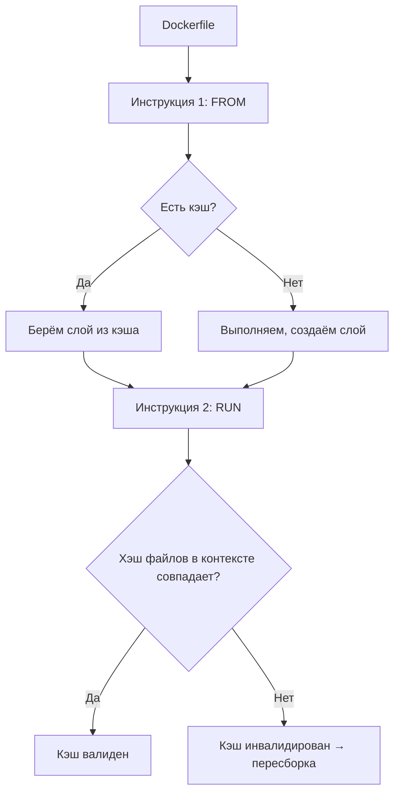

# Docker Layer Cache & Optimization

> [!SUMMARY] Главная идея 
> Каждый `RUN`/`COPY`/`ADD` = новый слой. Слой кэшируется, если **инструкция + хэш файлов в контексте** не изменились. Меняешь один слой → все последующие пересобираются.

## Как работает кэш слоёв

### Визуализация процесса


### Правила инвалидации кэша

| Ситуация                                            | Кэш сохраняется?     | Почему                                                      |
| --------------------------------------------------- | -------------------- | ----------------------------------------------------------- |
| Изменил `COPY requirements.txt`                     | Нет                  | Хэш файла изменился → слой + все последующие пересобираются |
| Изменил `COPY app.py` (после `pip install`)         | Да для `pip install` | Слой с зависимостями не зависит от `app.py`                 |
| Изменил базовый образ (`FROM python:3.11` → `3.12`) | Нет                  | Все слои пересобираются с нуля                              |
| Запустил `docker build --no-cache`                  | Нет                  | Принудительный сброс кэша                                   |
| Изменил `RUN apt-get install curl`                  | Нет                  | Сама инструкция изменилась                                  |

>[!TIP] Как посмотреть, что использует кэш?
>```bash
># Вывод с подробностями о кэше
>docker build --progress=plain -t myapp . 2>&1 | grep -E "CACHED|RUN|COPY"
>
># Пример вывода:
># => [2/5] COPY requirements.txt .  CACHED
># => [3/5] RUN pip install -r requirements.txt  CACHED
># => [4/5] COPY . .  # пересобирается, т.к. app.py изменился
>```

## Стратегии оптимизации кэша

### 1. Порядок инструкций: «часто меняющееся — вниз»
```dockerfile
# ❌ Плохо: при изменении app.py пересобирается pip install
FROM python:3.11-slim
WORKDIR /app
COPY . .  # ← меняется часто
RUN pip install -r requirements.txt  # ← пересобирается каждый раз!

#  Хорошо: зависимости кэшируются, если requirements.txt не менялся
FROM python:3.11-slim
WORKDIR /app
COPY requirements.txt .  # ← меняется редко
RUN pip install -r requirements.txt  # ← кэшируется
COPY . .  # ← меняется часто, но это последний слой
```

### 2. Минимизация количества слоёв
```dockerfile
# Плохо: 4 отдельных слоя (медленно, большой образ)
RUN apt-get update
RUN apt-get install -y curl
RUN apt-get install -y git
RUN rm -rf /var/lib/apt/lists/*

# Хорошо: 1 слой (быстро, компактно)
RUN apt-get update && apt-get install -y --no-install-recommends \
    curl \
    git \
    && rm -rf /var/lib/apt/lists/*
```

>[!NOTE] Почему `--no-install-recommends`? 
>По умолчанию `apt-get install` тянет «рекомендованные» пакеты, которые часто не нужны в контейнере. Это экономит 20-50% размера слоя.

### 3. `.dockerignore` — не тащи лишнее в контекст

```bash
 # .dockerignore (минимальный набор)
.git
__pycache__
*.pyc
*.pyo
*.pyd
.pytest_cache
.coverage
htmlcov
.env
*.md
tests/
docs/
*.log
node_modules/
dist/
build/
```

```bash
# Проверить, что попадает в контекст
# (сравнить размер до и после .dockerignore)
du -sh .  # размер на диске
tar -cf - . | wc -c  # размер контекста для Docker
```

>[!WARNING] Частая ошибка Копирование `node_modules/` или `__pycache__/` в контекст:
>
>- Увеличивает время отправки контекста в daemon
>- Может сломать кэш (хэш файлов изменился)
>- Создаёт конфликты прав доступа

## Оптимизация размера образа

### Выбор базового образа

| Образ                         | Размер      | Когда использовать                                                |
| ----------------------------- | ----------- | ----------------------------------------------------------------- |
| `alpine`                      | ~5 MB       | Минималистичные образы, статические бинарникиx                    |
| `debian:slim` / `ubuntu:slim` | ~30-80 MB   | Баланс размера и совместимости                                    |
| `debian` / `ubuntu` (полные)  | ~100-200 MB | Когда нужны полные пакеты, отладка                                |
| `python:3.11` (полный)        | ~1000 MB    | `x`  Избегать в продакшене                                        |
| `python:3.11-slim`            | ~130 MB     | `+`  Python-приложения в проде                                    |
| `python:3.11-alpine`          | ~50 MB      | `!!` Может быть несовместим с некоторыми пакетами (musl vs glibc) |
```dockerfile
# ✅ Пример: минимальный образ для Python
FROM python:3.11-slim-bookworm

# ❌ Избегай: огромный образ с лишними пакетами
FROM python:3.11
```

### Multi-stage сборка

При multi-stage builds в Dockerfile используется несколько инструкций `FROM` . Каждая инструкция `FROM` может использовать различный базовый образ, и каждая из них запускает новый этап (stage) сборки. Ты можешь выборочно копировать артефакты с одного stage на другой, оставляя в конечном образе только то, что тебе нужно.

```dockerfile
# Этап сборки (тяжёлый, с компилятором)
FROM golang:1.21 AS builder
WORKDIR /src
COPY go.mod go.sum ./
RUN go mod download
COPY . .
RUN CGO_ENABLED=0 GOOS=linux go build -a -installsuffix cgo -o /app/main .

# Этап рантайма (минимальный)
FROM alpine:3.18 AS runtime
# Или даже scratch, если бинарник статический:
# FROM scratch

RUN apk --no-cache add ca-certificates

WORKDIR /app
COPY --from=builder /app/main .

# Запуск от непривилегированного пользователя
USER 1000:1000
EXPOSE 8080
CMD ["/app/main"]
```

| Метрика           | Single-stage                             | Multi-stage              |
| ----------------- | ---------------------------------------- | ------------------------ |
| Размер образа     | ~800 MB                                  | ~15 MB                   |
| Время пуша/пулла  | Долго                                    | Быстро                   |
| Поверхность атаки | Большая (компилятор, отладочные символы) | Минимальная              |
| Воспроизводимость | Зависит от окружения сборки              | Изолирована в Dockerfile |

>[!TIP] Копирование артефактов между stage
>```dockerfile
># Копировать конкретный файл
>COPY --from=builder /app/main /app/main
>
># Копировать с изменением прав
>COPY --from=builder --chown=1000:1000 /app/data /app/data
>
># Использовать именованный stage
>FROM node:18 AS frontend
># ...
>FROM python:3.11-slim AS backend
>COPY --from=frontend /app/dist /app/static
>```

## Продвинутые техники работы со слоями

### 1. BuildKit и кэш между сборками
```dockerfile
# Включить BuildKit (ускоряет сборку, улучшает кэш)
export DOCKER_BUILDKIT=1

# Использовать кэш из предыдущих сборок
docker build --cache-from=type=local,src=/tmp/.buildx-cache \
             --cache-to=type=local,dest=/tmp/.buildx-cache \
             -t myapp:1.0 .

# В CI/CD: кэш в реестре
docker build --cache-from=type=registry,ref=registry.io/myapp:cache \
             --cache-to=type=registry,ref=registry.io/myapp:cache,mode=max \
             -t myapp:1.0 .
```

### 2. Секреты при сборке (без попадания в слои)
```dockerfile
# Dockerfile (требует BUILDKIT=1)
# syntax=docker/dockerfile:1.4

FROM python:3.11-slim
RUN --mount=type=secret,id=pypi,required=true \
    pip install -r requirements.txt --index-url https://pypi.org/simple/
```

```bash
# Сборка с секретом
echo "pypi-token-123" | docker build --secret id=pypi,src=- -t myapp .

# Секрет НЕ попадает в слои образа!
docker history myapp --no-trunc | grep pypi  # ничего не найдёт
```

### 3. Монтирование зависимостей без копирования (BuildKit)
```dockerfile
# Вместо COPY requirements.txt + RUN pip install
RUN --mount=type=bind,source=requirements.txt,target=/tmp/req.txt \
    pip install --no-cache-dir -r /tmp/req.txt 
```

>[!NOTE] Преимущества `--mount=type=bind`
>
>- Файл не копируется в слой → экономия места
>- Кэш зависит только от содержимого файла, а не от времени изменения
>- Удобно для часто меняющихся файлов зависимостей


# Dockerfile Best Practices v1

>[!SUMMARY] Золотые правила
>
>1. **Воспроизводимость**: конкретные теги, зафиксированные версии зависимостей.
>2. **Безопасность**: не от root, без секретов в образах, минимальные capabilities.
>3. **Эффективность**: минимум слоёв, правильный порядок, `.dockerignore`.
>4. **Универсальность**: гибкий `CMD`, понятный `ENTRYPOINT`, документированные `EXPOSE`.

## CMD vs ENTRYPOINT: когда что использовать

### Таблица принятия решения
| Сценарий                            | Рекомендация                                       | Пример                                                     |
| ----------------------------------- | -------------------------------------------------- | ---------------------------------------------------------- |
| **Веб-сервис / фоновое приложение** | Только `CMD` (проще для пользователя)              | `CMD ["/app/start.sh"]`                                    |
| **Консольная утилита**              | `ENTRYPOINT` + `CMD` (дефолтные аргументы)         | `ENTRYPOINT ["s3cmd"]`, `CMD ["--help"]`                   |
| **Сложная логика при старте**       | `ENTRYPOINT` со скриптом + `CMD` с дефолтом        | `ENTRYPOINT ["/docker-entrypoint.sh"]`, `CMD ["postgres"]` |
| **Нужна максимальная гибкость**     | Только `CMD` (легко переопределить в `docker run`) | `CMD ["python", "app.py"]` → `docker run img bash`         |
### Форматы: exec form vs shell form
```bash
# Exec form (JSON array) — РЕКОМЕНДУЕТСЯ
CMD ["/usr/bin/python", "app.py"]
ENTRYPOINT ["/usr/bin/myapp"]

# Почему:
# - Корректная обработка сигналов (SIGTERM дойдёт до приложения)
# - Переменные окружения подгружаются предсказуемо
# - Нет лишней оболочки /bin/sh -c

# ❌ Shell form — только если нужен shell для подстановки
CMD python app.py  # ⚠️ Сигналы могут не дойти, $PATH может не работать
```

### Пример: гибкий ENTRYPOINT для базы данных
```bash
# docker-entrypoint.sh
#!/bin/bash
set -e

# Если первый аргумент — команда БД, запускаем инициализацию
if [ "$1" = 'postgres' ]; then
    chown -R postgres "$PGDATA"
    if [ -z "$(ls -A "$PGDATA")" ]; then
        gosu postgres initdb
    fi
    exec gosu postgres "$@"
fi

# Иначе выполняем переданную команду как есть
exec "$@"
```

```dockerfile
# В Dockerfile
COPY docker-entrypoint.sh /usr/local/bin/
ENTRYPOINT ["docker-entrypoint.sh"]
CMD ["postgres"]  # Дефолт: запустить сервер
```

```bash
# Пользователь может:
docker run mydb                          # → запустит postgres
docker run mydb postgres --help          # → покажет справку
docker run -it mydb bash                 # → откроет shell для отладки
```

> [!TIP] Правило для сервисов 
> Если сомневаешься — используй только `CMD` в exec form. Это даст пользователю максимальную гибкость: `docker run img <любая команда>` переопределит дефолт.


## Управление PATH и окружением

```dockerfile
# Добавь бинарники в PATH, чтобы не писать полные пути в CMD
ENV PATH="/usr/local/nginx/bin:$PATH"

# Теперь можно писать короче:
CMD ["nginx"]  # вместо CMD ["/usr/local/nginx/bin/nginx"]

# Проверка в контейнере:
docker run --rm myapp sh -c 'echo $PATH'
docker run --rm myapp which nginx  # должен найти
```

## Безопасность: запуск не от root
```dockerfile
# Создай пользователя и группу
RUN groupadd -r appuser && useradd -r -g appuser -m appuser

# Скопируй файлы и настрой права
COPY --chown=appuser:appuser . /app

# Переключись на пользователя
USER appuser

# Рабочая директория (должна быть доступна пользователю)
WORKDIR /app
CMD ["python", "app.py"]
```

```bash
# Проверка: от какого пользователя работает процесс
docker run --rm myapp id
# Вывод: uid=1000(appuser) gid=1000(appuser)

# Если нужно выполнить команду от root для отладки:
docker run --user root myapp whoami
# Вывод: root
```


>[!WARNING] Почему это критично? Если контейнер скомпрометирован и запущен от root, злоумышленник может:
>
>- Получить доступ к файлам хоста (через уязвимости ядра)
>- Запустить процессы на хосте
>- Изменить конфигурацию системы
>
>Запуск от непривилегированного пользователя — базовая защита.


## ADD vs COPY: итоговое правило
| Инструкция | Что умеет                                                      | Когда использовать                                                                     |
| ---------- | -------------------------------------------------------------- | -------------------------------------------------------------------------------------- |
| **COPY**   | Копирует файлы из контекста / другого stage                    | **99% случаев**: код, конфиги, зависимости                                             |
| **ADD**    | COPY + авто-распаковка `.tar.*` + скачивание по URL + checksum | Только если нужна распаковка архива **на этапе сборки** или проверка контрольной суммы |

```bash
# + COPY: стандартный случай
COPY requirements.txt .
COPY src/ ./src/
COPY --from=builder /app/dist /app/static

# +  ADD: редкие кейсы
# 1. Распаковка архива (если нельзя сделать в RUN)
ADD archive.tar.gz /opt/  # распакуется в /opt/

# 2. Скачивание с проверкой контрольной суммы (BuildKit)
ADD --checksum=sha256:abc123... \
    https://example.com/file.tar.gz \
    /opt/file.tar.gz

# ❌ Избегай: скачивание в ADD без checksum (не кэшируется, небезопасно)
ADD https://example.com/script.sh /script.sh  # ⚠️ Плохо
```

> [!TIP] Альтернатива для зависимостей: монтирование вместо копирования
>```bash
> # Вместо COPY requirements.txt + RUN pip install
>RUN --mount=type=bind,source=requirements.txt,target=/tmp/req.txt \
>    pip install --no-cache-dir -r /tmp/req.txt
>```
> Файл не попадает в слой → экономия места + более точный кэш.


## Базовые образы: официальные и конкретные
```dockerfile
# + Хорошо: официальный образ с конкретным тегом
FROM nginx:1.25.3-alpine
FROM python:3.11.4-slim-bookworm
FROM node:18.17.0-alpine3.18

# + Лучше: с хэшем для полной воспроизводимости
FROM python@sha256:abc123def456...

# ❌ Плохо: плавающие теги
FROM nginx:latest      # ⚠️ Сегодня 1.25, завтра 1.26 — сборка не воспроизводима
FROM python:3          # ⚠️ Может сломаться при мажорном обновлении
FROM randomuser/nginx  # ⚠️ Неофициальный образ: нет гарантий обновлений и безопасности
```

> [!NOTE] Почему официальные образы?
>
>- Регулярные обновления безопасности
>- Проверка на уязвимости
>- Документация и примеры
>- Поддержка сообщества и вендора
>
Найти официальные образы: [hub.docker.com](https://hub.docker.com/) → ищи «Official Image».

## Секреты: никогда не в образах
```bash
# ❌ НИКОГДА так не делай
ENV DB_PASSWORD=supersecret123
RUN echo "api_key=abc123" >> /app/config.ini
COPY .env /app/.env  # если в контексте — попадёт в слои

# Даже удаление не поможет:
RUN echo "secret" > /tmp/key && rm /tmp/key  # ⚠️ secret останется в слое!
```

### Правильные способы передачи секретов
| Способ                  | Когда использовать                         | Пример                                                  |
| ----------------------- | ------------------------------------------ | ------------------------------------------------------- |
| **ENV при запуске**     | Простые сценарии, не критичные секреты     | `docker run -e DB_PASS=$(vault get pass) myapp`         |
| **Mounted files**       | Файлы с секретами (ключи, сертификаты)     | `docker run -v /host/secret.key:/app/key:ro myapp`      |
| **Docker secrets**      | Swarm mode, оркестрация                    | `echo "secret" \| docker secret create db_pass -`       |
| **--secret при сборке** | Секреты только для сборки (токены реестра) | `docker build --secret id=pypi,src=~/.pypirc .`         |
| **Внешний vault**       | Продакшен, высокая безопасность            | Приложение читает секреты из HashiCorp Vault при старте |

```dockerfile
# Пример: --secret при сборке (BuildKit)
# syntax=docker/dockerfile:1.4
FROM python:3.11-slim
RUN --mount=type=secret,id=pypi \
    pip install -r requirements.txt --index-url https://pypi.org/simple/
```

```bash
# Сборка с секретом (не попадает в образ!)
cat ~/.pypirc | docker build --secret id=pypi,src=- -t myapp .
docker history myapp --no-trunc | grep pypi  # ничего не найдёт
```

#### Структура и кэш
- [ ] Базовый образ с конкретным тегом или хэшем
- [ ] Зависимости копируются и устанавливаются до исходного кода
- [ ] Все `RUN` команды объединены и очищают кэш в том же слое
- [ ] Используется `.dockerignore` (исключены `.git`, `__pycache__`, `node_modules`, `.env`)

#### Безопасность
- [ ] Приложение запускается не от root (`USER 1000` или созданный пользователь)
- [ ] Секреты не зашиты в образ (передаются через env / secrets / mounted files)
- [ ] Используется `--no-install-recommends` (apt) и `--no-cache-dir` (pip/npm)
- [ ] Нет чувствительных данных в `ENV` или файлах, копируемых в образ

#### Рантайм и гибкость
- [ ] `CMD` в exec form (JSON array) для корректной обработки сигналов
- [ ] `ENTRYPOINT` используется осознанно (скрипт инициализации / CLI-утилита)
- [ ] Логи пишутся в stdout/stderr (не в файлы внутри контейнера)
- [ ] Есть `HEALTHCHECK` для продакшена (опционально, но рекомендуется)

#### Оптимизация
- [ ] Образ протестирован на уязвимости (`docker scan`, `trivy`, `grype`)
- [ ] Для компилируемых языков: multi-stage сборка
- [ ] Размер образа адекватен задаче (< 500 MB для веб-приложения, < 50 MB для CLI)
- [ ] Используется минимальный базовый образ (`-slim`, `-alpine`, `scratch`)

#### Документация
- [ ] `EXPOSE` указывает порты приложения (документация, не публикация)
- [ ] `LABEL` добавляет метаданные (версия, автор, описание)
- [ ] `WORKDIR` используется вместо `RUN cd` и относительных путей


---
# Практика: анализ и оптимизация

### 1. Анализ размера слоёв
```bash
# Установить dive (удобный TUI для анализа слоёв)
# https://github.com/wagoodman/dive
wget https://github.com/wagoodman/dive/releases/download/v0.10.0/dive_0.10.0_linux_amd64.deb
sudo apt install ./dive_*.deb

# Проанализировать образ
dive myapp:1.0

# Вывод покажет:
# - Размер каждого слоя
# - Какие файлы добавлены/изменены/удалены
# - «Вастед» байты (удалённые файлы, которые всё ещё занимают место в нижних слоях)
```

### 2. Сравнение стратегий сборки
```bash
# Сценарий 1: без оптимизаций
time docker build -t slow:1.0 -f Dockerfile.slow .

# Сценарий 2: с оптимизацией порядка + .dockerignore
time docker build -t fast:1.0 -f Dockerfile.fast .

# Сравнить размеры
docker images | grep -E "slow|fast"

# Пример результата:
# slow  1.2GB  (много слоёв, нет .dockerignore)
# fast  180MB  (оптимизировано)
```

### 3. Проверка кэша на практике
```bash 
# 1. Первая сборка (кэш пуст)
docker build -t test:1.0 .  # ~60 сек

# 2. Вторая сборка без изменений (всё из кэша)
docker build -t test:1.0 .  # ~2 сек

# 3. Изменим app.py (последний слой)
echo "# new comment" >> app.py
docker build -t test:1.1 .  # ~5 сек (только последний слой)

# 4. Изменим requirements.txt (слой с pip install)
echo "new-package==1.0" >> requirements.txt
docker build -t test:1.2 .  # ~45 сек (пересборка pip install + последующие)
```


## Чеклист оптимизации сборки 

#### Кэш и порядок слоёв
- [ ] Зависимости копируются и устанавливаются до исходного кода
- [ ] Часто меняющиеся файлы (код) — в последних слоях
- [ ] Используется `.dockerignore` для исключения лишнего из контекста
- [ ] Инструкции `RUN` объединены для уменьшения количества слоёв

#### Размер образа
- [ ] Базовый образ минимален (`-slim`, `-alpine`, `scratch`)
- [ ] Удалён кэш пакетов в том же слое, где установка (`rm -rf /var/lib/apt/lists/*`)
- [ ] Используется `--no-install-recommends` для apt, `--no-cache-dir` для pip
- [ ] Для компилируемых языков: multi-stage сборка

#### Безопасность и воспроизводимость
- [ ] Конкретные теги базовых образов (`python:3.11.2-slim`, не `latest`)
- [ ] Версии зависимостей зафиксированы (`requirements.txt`, `package-lock.json`)
- [ ] Секреты не в образах (передаются при запуске или через `--secret`)
- [ ] Образ протестирован на уязвимости (`docker scan`, `trivy`)

#### Производительность в CI/CD
- [ ] Включён BuildKit (`DOCKER_BUILDKIT=1`)
- [ ] Настроен кэш между сборками (`--cache-from` / `--cache-to`)
- [ ] Параллельная сборка для нескольких платформ (`buildx`, `--platform`)


| Тема                            | Ссылки                                                                                                                                         | Что искать                               |
| ------------------------------- | ---------------------------------------------------------------------------------------------------------------------------------------------- | ---------------------------------------- |
| **Build cache**                 | [docs.docker.com/build/cache/](https://docs.docker.com/build/cache/)                                                                           | Управление кэшем, стратегии, CI/CD       |
| **Best practices**              | [docs.docker.com/develop/develop-images/dockerfile_best-practices/](https://docs.docker.com/develop/develop-images/dockerfile_best-practices/) | Полный гайд по оптимизации               |
| **Multi-stage builds**          | [docs.docker.com/build/building/multi-stage/](https://docs.docker.com/build/building/multi-stage/)                                             | Примеры и паттерны                       |
| **BuildKit**                    | [docs.docker.com/build/buildkit/](https://docs.docker.com/build/buildkit/)                                                                     | Новые фичи сборки, секреты, монтирование |
| **.dockerignore**               | [docs.docker.com/build/building/context/#dockerignore-files](https://docs.docker.com/build/building/context/#dockerignore-files)               | Синтаксис и примеры                      |
| **Dive (сторонний инструмент)** | [github.com/wagoodman/dive](https://github.com/wagoodman/dive)                                                                                 | Анализ слоёв образа в TUI                |
