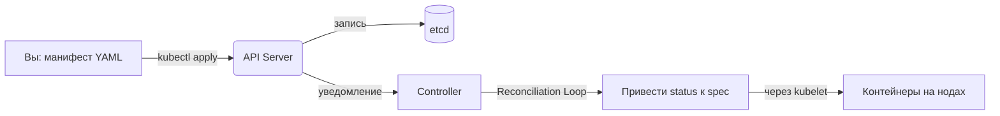

# Объекты Kubernetes — Декларативное управление состоянием

> *📌* Объект K8s = **запись о намерениях**. Вы описываете *желаемое состояние* в поле `spec`, система через контроллеры приводит *фактическое состояние* (`status`) к нему. Всё управляется через декларативные манифесты (YAML/JSON).

---

## Что такое объект Kubernetes

| Аспект | Описание |
|--------|----------|
| **Определение** | Постоянная сущность в системе, представляющая состояние кластера или рабочей нагрузки |
| **Назначение** | Описать: какие приложения запущены, какие ресурсы им нужны, какие политики к ним применяются |
| **Принцип работы** | Вы создаёте объект → K8s читает `spec` → система работает, чтобы `status` соответствовал `spec` |
| **Управление** | Через API Kubernetes (напрямую, через `kubectl` или клиентские библиотеки) |



>💡 **Ключевая идея**: Ненужно говорить системе _«сделай A, потом B, потом C»_.Можно сказать _«я хочу, чтобы было так»_, а K8s сам находит путь к этому состоянию.в

---
## Cтруктура объекта: spec vs status

Практически каждый объект имеет два ключевых поля:

|Поле|Кто заполняет|Назначение|Пример|
|---|---|---|---|
|**`spec`**|👤 Вы (пользователь)|**Желаемое состояние**: что вы хотите получить|`replicas: 3`, `image: nginx:1.25`, `resources.requests.cpu: 500m`|
|**`status`**|🤖 Система K8s|**Фактическое состояние**: что реально происходит сейчас|`availableReplicas: 2`, `conditions: [{type: Ready, status: True}]`|

### 🔄 Как работает Reconciliation Loop (на примере Deployment)
```yaml
# Вы создаёте:
spec:
  replicas: 3
  template: { image: nginx:1.25 }

# Система видит:
status:
  availableReplicas: 1  # ← два пода упали  

# Контроллер Deployment реагирует:
# → создаёт 2 новых пода, чтобы привести status к spec
```

---
## Обязательные поля в манифесте

Любой объект Kubernetes в YAML/JSON должен содержать 4 ключевых поля:

|Поле|Тип|Описание|Пример|
|---|---|---|---|
|**`apiVersion`**|string|Версия API для данного типа объекта|`apps/v1`, `v1` (core), `networking.k8s.io/v1`|
|**`kind`**|string|Тип объекта|`Pod`, `Deployment`, `Service`, `ConfigMap`|
|**`metadata`**|object|Идентификаторы объекта|`name`, `namespace`, `labels`, `annotations`|
|**`spec`**|object|Желаемое состояние (структура зависит от `kind`)|См. справочник API для конкретного типа|
### 📋 Минимальный шаблон объекта
```yaml
apiVersion: <группа>/<версия>  # например: apps/v1
kind: <ТипОбъекта>             # например: Deployment
metadata:
  name: <уникальное-имя>       # обязательно
  namespace: <неймспейс>       # опционально, по умолчанию: default
  labels:                      # опционально, но полезно
    app: my-app
spec:                          # структура зависит от kind
  # ... специфичные поля объекта
```

>📚 **Справочник**: полный формат `spec` для каждого объекта — в [официальной документации API](https://kubernetes.io/docs/reference/kubernetes-api/).

## Пример: Deployment (разбор полей)
```yaml
# deployment.yaml
apiVersion: apps/v1          # 1. Версия API
kind: Deployment             # 2. Тип объекта
metadata:                    # 3. Метаданные
  name: nginx-deployment
  labels:
    app: nginx
spec:                        # 4. Желаемое состояние
  replicas: 2                # → запустить 2 реплики
  selector:                  # → управлять подами с этими лейблами
    matchLabels:
      app: nginx
  template:                  # → шаблон для создания подов
    metadata:
      labels:
        app: nginx
    spec:
      containers:
      - name: nginx
        image: nginx:1.14.2  # ← образ контейнера
        ports:
        - containerPort: 80  # ← порт внутри контейнера
```

### Применение манифеста
```bash
# Создать/обновить объект из файла
kubectl apply -f deployment.yaml

# Применить манифест по URL
kubectl apply -f https://k8s.io/examples/application/deployment.yaml

# Проверить, что создалось
kubectl get deployments
kubectl describe deployment nginx-deployment  # подробности + status
```
>**Совет**:  Используйте `kubectl explain <field>` для быстрой справки по полям:  
`kubectl explain deployment.spec.template.spec.containers`

---
## Валидация полей: client-side vs server-side

Начиная с **Kubernetes 1.25**, API Server поддерживает **серверную валидацию полей** — обнаружение неизвестных или дублирующихся полей в объекте.

### Флаг `--validate` в kubectl

|Значение|Поведение|Когда использовать|
|---|---|---|
|**`strict`** (или `true`)|Ошибка при обнаружении неизвестных полей|По умолчанию, для защиты от опечаток|
|**`warn`**|Предупреждение в логе, но запрос выполняется|Отладка, миграция старых манифестов|
|**`ignore`** (или `false`)|Валидация отключена|Редкие случаи, когда поля добавляются динамически|
```bash
# Примеры использования:
kubectl apply -f deploy.yaml --validate=strict   # по умолчанию
kubectl apply -f deploy.yaml --validate=warn     # показать предупреждения
kubectl apply -f deploy.yaml --validate=ignore   # отключить проверку

# Server-side dry-run: валидация + применение политик admission, без реальных изменений
kubectl apply -f deploy.yaml --dry-run=server -o yaml
```

> **Важно**: если `kubectl` не может подключиться к API Server, он автоматически переключается на **клиентскую валидацию** (менее точную). Начиная с **K8s 1.27**, `server-side validation` доступна во всех стабильных релизах.

---

## Типы объектов: краткий справочник

| Категория           | Объекты                                                                                            | Назначение                                                                 |
| ------------------- | -------------------------------------------------------------------------------------------------- | -------------------------------------------------------------------------- |
| **🧱 Базовые**      | `Pod`, `Node`, `Namespace`                                                                         | Примитивы: контейнер(ы) на ноде, изоляция                                  |
| **🔄 Контроллеры**  | `Deployment`, `StatefulSet`, `DaemonSet`, `Job`, `CronJob`                                         | Управление жизненным циклом подов: масштабирование, обновления, расписание |
| **🌐 Сеть**         | `Service`, `Ingress`, `NetworkPolicy`, `EndpointSlice`                                             | Доступ к приложениям: балансировка, маршрутизация, политики                |
| **💾 Хранение**     | `PersistentVolume` (PV), `PersistentVolumeClaim` (PVC), `StorageClass`                             | Динамическое подключение хранилищ к подам                                  |
| **⚙️ Конфигурация** | `ConfigMap`, `Secret`, `ServiceAccount`                                                            | Внешние конфиги, секреты, права доступа для подов                          |
| **🔐 Безопасность** | `Role`/`ClusterRole`, `RoleBinding`/`ClusterRoleBinding`, `PodSecurityPolicy` (устарел)            | RBAC: кто и что может делать в кластере                                    |
| **🔌 Расширения**   | `CustomResourceDefinition` (CRD), `MutatingWebhookConfiguration`, `ValidatingWebhookConfiguration` | Добавление своих типов ресурсов и логики валидации                         |

> 📌 **Полный список**: `kubectl api-resources` или [официальный справочник](https://kubernetes.io/docs/reference/kubernetes-api/).

## Выводы

1. **Объект = намерение**: вы описываете `spec`, система работает над приведением `status` к нему.
2. **4 обязательных поля**: `apiVersion`, `kind`, `metadata`, `spec` — без них объект не создастся.
3. **Декларативный подход**: `kubectl apply -f` предпочтительнее императивных команд (`kubectl run`, `kubectl expose`) для воспроизводимости.
4. **Валидация**: используйте `--validate=strict` и `--dry-run=server` для безопасного применения изменений.
5. **Справочники**: `kubectl explain` и [официальная документация API](https://kubernetes.io/docs/reference/kubernetes-api/) — ваши главные инструменты при работе с новыми объектами.