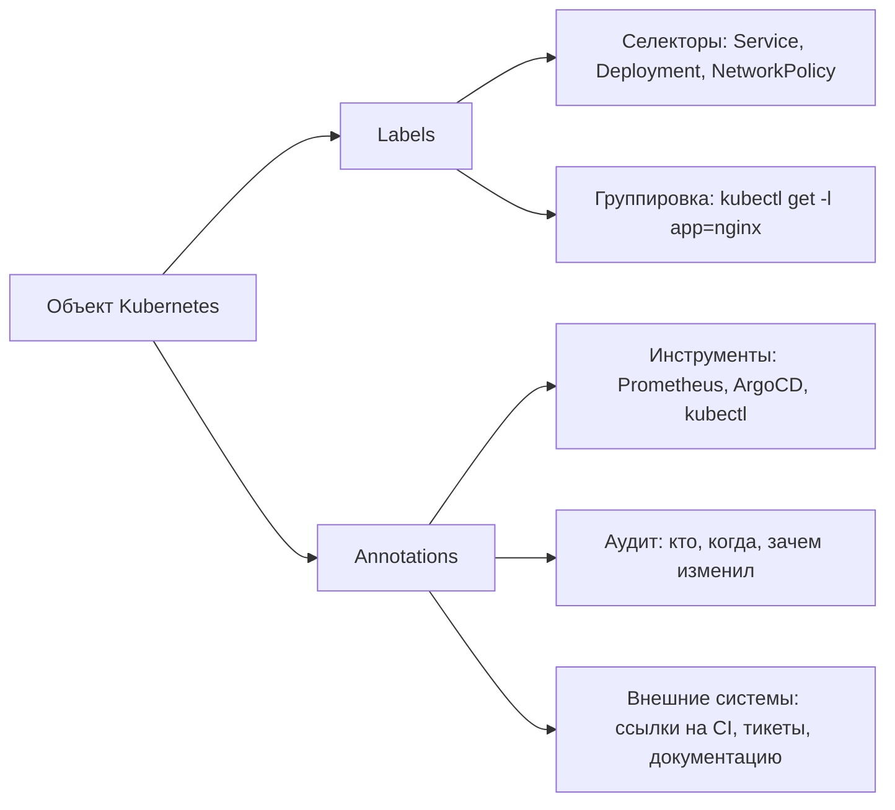

 >Аннотации — это «карман для заметок» в объектах Kubernetes: место для произвольных метаданных, которые не влияют на выбор объектов, но полезны для инструментов, аудита и людей.

# Аннотации (Annotations) в Kubernetes

> 📌 **TL;DR**: **Аннотации** = пары `ключ=значение` для хранения произвольных метаданных об объекте. В отличие от меток, они **не используются для выбора/фильтрации** объектов. Это «карман для заметок»: информация для инструментов, аудита, отладки, внешних систем.

---

## 🔹 Аннотации vs Метки: в чём разница

| Характеристика | **Метки (Labels)** | **Аннотации (Annotations)** |
|---------------|-------------------|---------------------------|
| **Назначение** | Идентификация и группировка объектов | Хранение произвольных метаданных |
| **Используются в селекторах** | ✅ Да (`labelSelector`) | ❌ Нет |
| **Структура значений** | Краткие, строгие (63 символа, `[a-z0-9A-Z.-_]`) | Произвольные (можно большие строки, JSON, URL) |
| **Семантика для ядра K8s** | Минимальная (только группировка) | Минимальная (информация для внешних систем) |
| **Пример** | `app=nginx`, `tier=frontend` | `kubernetes.io/change-cause: "Updated to v2.1"`, `prometheus.io/scrape: "true"` |



> 💡 **Простое правило**: 
> - Если ты хочешь **выбрать** объекты по этому полю → используй **метку**
> - Если ты хочешь **запомнить** что-то об объекте → используй **аннотацию**

---

## 🔹 Когда использовать аннотации: примеры

| Категория | Пример ключа | Пример значения | Зачем |
|-----------|-------------|----------------|-------|
| **🔧 Управление конфигурацией** | `kubernetes.io/change-cause` | `"Updated image to nginx:1.25 by alice"` | Отслеживание истории изменений (`kubectl rollout history`) |
| **🏗️ Сборка и релиз** | `app.kubernetes.io/version` | `"v2.1.0-rc1+build.123"` | Связь объекта с артефактом сборки |
| **🔗 Внешние ссылки** | `ci.example.com/run-url` | `"https://ci.internal/run/456789"` | Быстрый переход из `kubectl describe` в CI/CD |
| **📊 Мониторинг и логирование** | `prometheus.io/scrape` | `"true"` | Подсказка для Prometheus scraper'а |
| **👥 Ответственные** | `team.example.com/owner` | `"platform-team@company.com"` | Кому писать, если что-то сломалось |
| **🛠️ Инструменты развертывания** | `argocd.argoproj.io/tracking` | `"app:my-app;namespace:prod"` | Как ArgoCD отслеживает ресурс |
| **🧪 Отладка и разработка** | `debug.example.com/notes` | `"Temporary override for load testing"` | Контекст для других инженеров |
| **🔐 Безопасность и аудит** | `security.example.com/reviewed-by` | `"jane@example.com,2024-06-05"` | Подтверждение проверки безопасности |

> ⚠️ **Важно**: значения аннотаций — **всегда строки**. Нельзя использовать числа, булевы значения, массивы напрямую:
> ```yaml
> annotations:
>   retry-count: "3"           # ✅ строка
>   enabled: "true"            # ✅ строка, не boolean
>   tags: '["prod","critical"]' # ✅ JSON-строка, если нужно структурировать
> ```

---

## 🔹 Синтаксис и правила именования

Аннотации используют **те же правила**, что и метки (ключи и значения).

### Структура ключа: `[префикс/]имя`

| Часть | Правила | Пример |
|-------|---------|--------|
| **Префикс** *(опционально)* | • Поддомен DNS (RFC 1123)<br>• Макс. 253 символа<br>• Завершается `/` | `app.kubernetes.io/`, `example.com/`, `ci.internal/` |
| **Имя** *(обязательно)* | • Макс. 63 символа<br>• `[a-z0-9A-Z]`, `-`, `_`, `.`<br>• Начинается и заканчивается буквенно-цифровым | `change-cause`, `version`, `owner-email` |
| **Значение** | • Макс. 63 символа (но на практике можно больше)<br>• Любые символы, включая `/`, `:`, `@`<br>• Лучше избегать управляющих символов | `https://hub.docker.com/r/library/nginx`, `alice@company.com` |

### 🚫 Зарезервированные префиксы
```
kubernetes.io/*   → ядро Kubernetes
k8s.io/*          → ядро Kubernetes
```
> ⚠️ Не используй эти префиксы для своих аннотаций — они могут быть перезаписаны или интерпретированы системой.

### ✅ Примеры валидных аннотаций
```yaml
metadata:
  annotations:
    # Стандартные аннотации K8s
    kubernetes.io/change-cause: "kubectl set image deployment/api api=nginx:1.25"
    
    # Свои префиксы (рекомендуется для автоматизации)
    app.kubernetes.io/version: "v2.1.0"
    ci.internal/run-id: "gh-actions-12345"
    
    # Без префикса (личные, для человека)
    owner: "alice@company.com"
    notes: "This pod uses legacy config; plan migration by Q3"
    
    # Структурированные данные как строки
    prometheus.io/scrape: "true"
    prometheus.io/port: "8080"
    prometheus.io/path: "/metrics"
```

### ❌ Примеры невалидных аннотаций
```yaml
annotations:
  My-Key: value              # ❌ заглавные буквы в ключе
  key/with/slashes: value    # ❌ только одна / для разделения префикса и имени
  very-long-key-name-that-exceeds-sixty-three-characters-limit: value  # ❌ >63 символов в имени
```

---

## 🔹 Практика: работа с аннотациями через kubectl

### 👁️ Просмотр аннотаций
```bash
# Показать все аннотации объекта
kubectl describe pod my-pod | grep -A20 'Annotations:'

# Только аннотации в формате JSON
kubectl get pod my-pod -o jsonpath='{.metadata.annotations}'

# Конкретная аннотация
kubectl get pod my-pod -o jsonpath='{.metadata.annotations.kubernetes\.io/change-cause}'

# Список объектов с аннотациями (показать столбец)
kubectl get pods -L app.kubernetes.io/version
```

### ✏️ Добавление и изменение
```bash
# Добавить/изменить аннотацию у одного объекта
kubectl annotate pod my-pod owner="alice@company.com"

# Добавить несколько аннотаций
kubectl annotate pod my-pod \
  ci.internal/run-id="gh-12345" \
  notes="Temporary for load test"

# Удалить аннотацию (добавь "-" в конце ключа)
kubectl annotate pod my-pod owner-

# Переименовать аннотацию (удалить старую + добавить новую)
kubectl annotate pod my-pod old-key- new-key="new-value"

# Применить аннотации ко всем подам по селектору
kubectl annotate pods -l app=nginx prometheus.io/scrape="true"
```

### 🧪 Валидация и отладка
```bash
# Проверить, какие аннотации будут применены (dry-run)
kubectl annotate pod my-pod test="value" --dry-run=server -o yaml

# Увидеть аннотации в выводе get (через --show-annotations, если поддерживается)
kubectl get pod my-pod -o custom-columns=NAME:.metadata.name,ANNOTATIONS:.metadata.annotations

# Экспорт объекта с аннотациями для бэкапа/аудита
kubectl get pod my-pod -o yaml > pod-backup.yaml
```

---

## 🔹 Системные и стандартные аннотации

### 🏷️ Стандартные аннотации Kubernetes
```yaml
# Отслеживание причины изменения (используется rollout history)
kubernetes.io/change-cause: "kubectl set image deployment/api api=v2"

# Запрет автоматического добавления метаданных прокси
kubernetes.io/ingress.class: "nginx"

# Управление поведением контроллеров
scheduler.alpha.kubernetes.io/critical-pod: ""  # устарело, использовать PriorityClass
```

### 🔧 Аннотации популярных инструментов

| Инструмент | Аннотация | Пример значения | Назначение |
|-----------|-----------|----------------|-----------|
| **Prometheus** | `prometheus.io/scrape` | `"true"` | Включить сбор метрик с пода |
| **Prometheus** | `prometheus.io/port` | `"8080"` | Порт для scraping (если не 80) |
| **Prometheus** | `prometheus.io/path` | `"/metrics"` | Путь к endpoint метрик |
| **ArgoCD** | `argocd.argoproj.io/tracking` | `"app:my-app"` | Как ArgoCD отслеживает ресурс |
| **Flux** | `fluxcd.io/checksum` | `"<sha256>"` | Контрольная сумма для синхронизации |
| **ExternalDNS** | `external-dns.alpha.kubernetes.io/hostname` | `"api.example.com"` | Создать DNS-запись для сервиса |
| **Cert-Manager** | `cert-manager.io/cluster-issuer` | `"letsencrypt-prod"` | Какой issuer использовать для TLS |

> 💡 **Совет**: документируй принятые в команде аннотации в файле `ANNOTATIONS_CONVENTION.md` — это упростит онбординг и снизит ошибки.

---

## 🔹 Чек-лист: работа с аннотациями

```bash
# ✅ При создании ресурсов: добавляй полезные аннотации сразу
# (версия, владелец, ссылка на тикет) — это окупится при отладке

# ✅ Используй префиксы для своих аннотаций (example.com/*)
# → избегает конфликтов с системными и инструментами

# ✅ Не храни чувствительные данные в аннотациях
# → они видны всем, у кого есть read-доступ к объекту
# → для секретов используй `Secret` или внешние хранилища

# ✅ Перед массовым изменением: протестируй на одном объекте
kubectl annotate pod test-pod ci.internal/dry-run="true"
# потом:
kubectl annotate pods -l app=my-app ci.internal/deployed-by="argocd"

# ✅ Для аудита: фиксируй изменения через kubernetes.io/change-cause
kubectl annotate deployment/api \
  kubernetes.io/change-cause="Rollback to v1.9 due to memory leak"

# ✅ При написании операторов: читай аннотации для конфигурации поведения
# (но не полагайся на них для критической логики — они могут быть изменены пользователем)

# ✅ Документируй: какие аннотации читает твой инструмент/скрипт
# → в README или в коде как константы
```

> 💡 **Совет для конспекта**:
> 1. Создай файл `00_annotations_catalog.md` с таблицей: «Какие аннотации мы используем в проектах и зачем».
> 2. Добавь блок «Шаблоны аннотаций»: частые комбинации для деплоя, мониторинга, аудита.
> 3. Веди заметку «Инструменты и их аннотации»: какие аннотации требуют Prometheus, ArgoCD, ExternalDNS и т.д.

---

## 🔹 Ключевые выводы

1. **Аннотации ≠ метки**: аннотации не для выбора объектов, а для хранения контекста.
2. **Значения — всегда строки**: даже если логически это число или булево значение.
3. **Используй префиксы**: `example.com/*` для своих аннотаций — избегает конфликтов.
4. **Не храни секреты**: аннотации видны всем с read-доступом; для чувствительных данных — `Secret`.
5. **Документируй стандарты**: команда должна знать, какие аннотации используются и зачем.