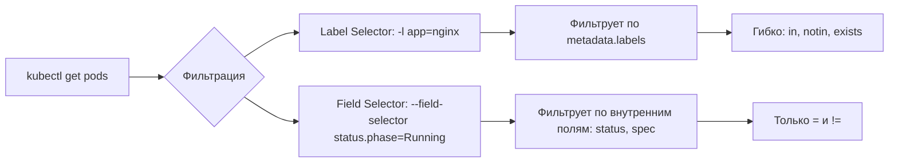

>Селекторы полей (Field Selectors) — это мощный, но часто недооценённый инструмент для точечной фильтрации объектов по их внутренним атрибутам.

# Селекторы полей (Field Selectors) в Kubernetes

> 📌 **TL;DR**: **Field Selector** = фильтр по значениям полей объекта (`status.phase=Running`, `metadata.namespace=prod`). В отличие от меток, работает с **внутренней структурой** объекта, а не с пользовательскими тегами. Поддерживает только операторы равенства (`=`, `!=`).

---

## 🔹 Field Selector vs Label Selector

| Характеристика | **Label Selector** | **Field Selector** |
|---------------|-------------------|-------------------|
| **По чему фильтрует** | Пользовательские метки (`metadata.labels`) | Внутренние поля объекта (`status.phase`, `spec.nodeName`) |
| **Гибкость** | Высокая: `in`, `notin`, `exists`, комбинирование | Низкая: только `=` и `!=` |
| **Производительность** | Оптимизирован (индексируется) | Менее эффективен (линейный поиск по умолчанию) |
| **Когда использовать** | Группировка приложений, версий, сред | Точечная отладка, фильтрация по статусу/ноде/неймспейсу |
| **Пример** | `-l app=nginx,tier=frontend` | `--field-selector status.phase=Running` |



> 💡 **Простое правило**: 
> - Если хочешь фильтровать по **своим тегам** → используй **метки**
> - Если хочешь фильтровать по **статусу, ноде, неймспейсу** → используй **селектор полей**

---

## 🔹 Синтаксис и операторы

### Базовый формат
```bash
--field-selector <поле>=<значение>
--field-selector <поле>!=<значение>
```

### Поддерживаемые операторы
| Оператор | Значение | Пример |
|----------|----------|--------|
| `=` или `==` | Равно | `status.phase=Running` |
| `!=` | Не равно | `metadata.namespace!=default` |

> ⚠️ **Важно**: операторы множеств (`in`, `notin`, `exists`) **не поддерживаются** для селекторов полей.

### Комбинирование условий (логическое И)
```bash
# Запятая = AND
kubectl get pods --field-selector status.phase=Running,spec.nodeName=node-1

# Эквивалентно: статус=Running И нода=node-1
```

> ❌ **Нельзя**: логическое ИЛИ между разными полями.  
> Если нужно `(status=Running) OR (status=Pending)` — используй `labelSelector` или фильтруй на стороне клиента (`grep`, `jq`).

---

## 🔹 Поддерживаемые поля по типам ресурсов

Не все поля можно использовать в селекторах. Список зависит от типа ресурса.

### ✅ Универсальные поля (есть у всех ресурсов)
```bash
metadata.name=<имя>
metadata.namespace=<неймспейс>
```

### 📋 Поддерживаемые поля для популярных ресурсов

| Ресурс | Поддерживаемые поля | Пример использования |
|--------|-------------------|---------------------|
| **`Pod`** | `spec.nodeName`, `spec.restartPolicy`, `spec.serviceAccountName`, `spec.hostNetwork`, `status.phase`, `status.podIP`, `status.nominatedNodeName` | `--field-selector status.phase=Pending` |
| **`Event`** | `involvedObject.kind/name/namespace`, `reason`, `type`, `source`, `reportingComponent` | `--field-selector reason=FailedScheduling` |
| **`Service`** | `spec.type`, `spec.clusterIP` | `--field-selector spec.type=LoadBalancer` |
| **`Node`** | `spec.unschedulable` | `--field-selector spec.unschedulable=false` |
| **`Secret`** | `type` | `--field-selector type=kubernetes.io/tls` |
| **`Namespace`** | `status.phase` | `--field-selector status.phase=Active` |
| **`ReplicaSet` / `ReplicationController`** | `status.replicas` | `--field-selector status.replicas=0` |
| **`Job`** | `status.successful` | `--field-selector status.successful=1` |
| **`CertificateSigningRequest`** | `spec.signerName` | `--field-selector spec.signerName=kubernetes.io/kube-apiserver-client` |

### 🔍 Как узнать поддерживаемые поля для ресурса
```bash
# Посмотреть документацию API для конкретного ресурса
kubectl explain pod | grep -A5 'fieldSelector'

# Или проверить на практике (ошибка покажет доступные поля)
kubectl get pods --field-selector unsupported.field=test 2>&1 | grep "known field selector"
```

> ⚠️ **Если поле не поддерживается** → получишь ошибку:
> ```
> Error from server (BadRequest): "foo.bar" is not a known field selector: only "metadata.name", "metadata.namespace"
> ```

---

## 🔹 Практика: примеры использования

### 🔍 Базовая фильтрация
```bash
# Все запущенные поды
kubectl get pods --field-selector status.phase=Running

# Все поды, кроме запущенных (упавшие, ожидающие, неизвестные)
kubectl get pods --field-selector status.phase!=Running

# Поды на конкретной ноде
kubectl get pods --field-selector spec.nodeName=node-1.prod

# Поды в конкретном неймспейсе (альтернатива -n)
kubectl get pods --field-selector metadata.namespace=production

# Все поды, кроме неймспейса default
kubectl get pods --all-namespaces --field-selector metadata.namespace!=default
```

### 🔗 Комбинация с label selector
```bash
# Запущенные поды с меткой app=nginx
kubectl get pods -l app=nginx --field-selector status.phase=Running

# Pending поды на ноде node-1 с меткой tier=backend
kubectl get pods -l tier=backend --field-selector status.phase=Pending,spec.nodeName=node-1
```

### 🎯 Работа с событиями (Events)
```bash
# События, связанные с конкретным подом
kubectl get events --field-selector involvedObject.name=my-pod,involvedObject.kind=Pod

# События с причиной FailedScheduling
kubectl get events --field-selector reason=FailedScheduling

# События типа Warning во всём кластере
kubectl get events --all-namespaces --field-selector type=Warning
```

### 🧪 Фильтрация сервисов и нод
```bash
# Все сервисы типа LoadBalancer
kubectl get services --field-selector spec.type=LoadBalancer

# Все ноды, которые можно планировать (не cordoned)
kubectl get nodes --field-selector spec.unschedulable=false

# Поды с hostNetwork=true (потенциальный риск безопасности)
kubectl get pods --all-namespaces --field-selector spec.hostNetwork=true
```

---

## 🔹 Селекторы полей для Custom Resources (CRD)

По умолчанию для пользовательских ресурсов поддерживаются только:
```
metadata.name
metadata.namespace
```

### 🔧 Как добавить поддерживаемые поля
Через `selectableFields` в определении CRD:

```yaml
# В CustomResourceDefinition
apiVersion: apiextensions.k8s.io/v1
kind: CustomResourceDefinition
metadata:
  name: myresources.example.com
spec:
  versions:
  - name: v1
    selectableFields:
    - jsonPath: .spec.priority      # ← теперь можно фильтровать по spec.priority
    - jsonPath: .status.state       # ← и по status.state
```

После этого станет доступна фильтрация:
```bash
kubectl get myresources --field-selector spec.priority=high
```

> 📚 Подробнее: [Selectable fields for custom resources](https://kubernetes.io/docs/tasks/extend-kubernetes/custom-resources/custom-resource-definitions/#selectable-fields)

---

## 🔹 Ограничения и особенности

### ⚡ Производительность
- Селекторы полей **менее эффективны**, чем label selectors
- API Server выполняет линейный поиск по объектам (если поле не проиндексировано)
- **Не используй** для фильтрации больших списков в production-скриптах

### 🔐 Безопасность
- Селекторы полей применяются **после** авторизации
- Ты увидишь только те объекты, к которым у тебя есть доступ
- Но: ошибка «объект не найден» может раскрыть существование объекта (information leak)

### 🔄 Динамические поля
- Поля вроде `status.phase` могут меняться между запросами
- Для консистентного снимка используй `--watch` или кэшируй результат

### ❌ Что нельзя делать
```bash
# ❌ Операторы множеств
kubectl get pods --field-selector "status.phase in (Running,Pending)"  # не работает

# ❌ Частичное совпадение / регулярные выражения
kubectl get pods --field-selector "metadata.name~=^test-.*"  # не работает

# ❌ Вложенные поля без полной записи
kubectl get pods --field-selector "status.containerStatuses.ready=true"  # не поддерживается
```

---

## 🔹 Чек-лист: использование field selectors

```bash
# ✅ Перед использованием: проверь, поддерживается ли поле
kubectl get pods --field-selector test.field=value 2>&1 | grep "known field selector"

# ✅ Для отладки: фильтруй по статусу и ноде
kubectl get pods --field-selector status.phase!=Running,spec.nodeName=node-1

# ✅ Комбинируй с label selectors для точной фильтрации
kubectl get pods -l app=my-app --field-selector status.phase=Running

# ✅ Для событий: фильтруй по причине или объекту
kubectl get events --field-selector reason=Failed,involvedObject.kind=Pod

# ✅ В скриптах: экранируй специальные символы в значениях
NODE="node-1.prod"
kubectl get pods --field-selector "spec.nodeName=${NODE}"

# ❌ Не используй для массовой фильтрации в production
# → лучше получить список и отфильтровать на стороне клиента (jq, grep)

# ❌ Не полагайся на field selectors для критической бизнес-логики
# → список поддерживаемых полей может измениться в новой версии K8s
```

> 💡 **Совет для конспекта**:
> 1. Создай файл `00_field_selectors_cheatsheet.md` с таблицей: «Какие поля поддерживаются для каких ресурсов».
> 2. Добавь блок «Частые запросы»: готовые команды для отладки (`status.phase!=Running`, `reason=FailedScheduling` и т.д.).
> 3. Веди заметку «Ограничения»: что нельзя сделать через field selectors, чтобы не тратить время на эксперименты.

---

## 🔹 Ключевые выводы

1. **Field selectors = точечная фильтрация** по внутренним полям объекта, а не по пользовательским меткам.
2. **Только `=` и `!=`**: никаких `in`, `notin`, `exists` — планирую запросы с учётом этого.
3. **Не все поля поддерживаются**: проверяй документацию или тестируй на практике.
4. **Производительность**: для больших списков предпочитай label selectors или клиентскую фильтрацию.
5. **Комбинируй с метками**: `--field-selector` + `-l` дают максимальную гибкость при отладке.
