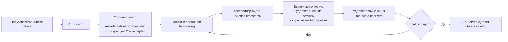

>Финализаторы — это важный механизм управления жизненным циклом ресурсов: они гарантируют, что «уборка» произойдёт до того, как объект исчезнет из кластера.


# Финализаторы (Finalizers) в Kubernetes

> 📌 **Финализатор** = «стоп-кран» для удаления объекта. Пока в `metadata.finalizers` есть хотя бы один ключ — объект не будет удалён физически, даже если получен `DELETE`. Контроллеры выполняют очистку, затем удаляют финализатор → объект удаляется.

---

## 🔹 Что такое финализатор

| Аспект | Описание |
|--------|----------|
| **Определение** | Ключ (строка) в `metadata.finalizers`, указывающий, что перед удалением объекта нужно выполнить определённые действия |
| **Назначение** | Гарантия «чистой» уборки: удаление внешних ресурсов, сброс блокировок, уведомление зависимых систем |
| **Механизм** | Контроллер «подписывается» на финализатор → видит `deletionTimestamp` → выполняет логику → удаляет ключ из `finalizers` |
| **Результат** | Когда `finalizers` пуст → объект удаляется из etcd |



> 💡 **Простая аналогия**: финализатор — как «чек-лист перед увольнением сотрудника». Пока не отмечены все пункты (сдал пропуск, передал дела) — трудовой договор не расторгается.

---

## 🔹 Как работает удаление с финализаторами

### 🔄 Пошаговый процесс

```yaml
# 1. Исходное состояние объекта
apiVersion: v1
kind: PersistentVolume
metadata:
  name: my-pv
  finalizers:
    - kubernetes.io/pv-protection  # ← финализатор
spec:
  # ... спецификация тома

# 2. Пользователь выполняет: kubectl delete pv my-pv
# API Server:
# • Устанавливает deletionTimestamp
# • НЕ удаляет объект, потому что finalizers не пуст
# • Возвращает 202 Accepted

apiVersion: v1
kind: PersistentVolume
metadata:
  name: my-pv
  deletionTimestamp: "2024-06-05T10:00:00Z"  # ← установлено
  finalizers:
    - kubernetes.io/pv-protection            # ← ещё есть
  # объект остаётся в etcd в состоянии "Terminating"

# 3. Контроллер (например, pv-controller) видит:
# • deletionTimestamp установлен
# • есть финализатор, за который он отвечает
# → выполняет логику: проверяет, не используется ли том подом

# 4. Если том свободен → контроллер удаляет финализатор:
metadata:
  deletionTimestamp: "2024-06-05T10:00:00Z"
  finalizers: []  # ← пустой список

# 5. API Server видит пустой finalizers → удаляет объект из etcd
```

### ⚠️ Важные ограничения после начала удаления

| Действие | Возможно? | Комментарий |
|----------|-----------|-------------|
| Удалить финализатор из списка | ✅ Да | Контроллер делает это после очистки |
| Добавить новый финализатор | ❌ Нет | Заблокировано после установки `deletionTimestamp` |
| Изменить `deletionTimestamp` | ❌ Нет | Поле неизменяемо после установки |
| «Отменить» удаление | ❌ Нет | Единственный способ — создать объект заново |

> 💡 **Практика**: если объект «застрял» в `Terminating` — проверь, какой финализатор мешает удалению, и почему контроллер не может его убрать.

---

## 🔹 Типы финализаторов

### 🏷️ Системные финализаторы

| Финализатор | Ресурс | Назначение |
|-------------|--------|-----------|
| `kubernetes.io/pv-protection` | `PersistentVolume` | Запрещает удаление тома, пока он используется подом |
| `kubernetes.io/pvc-protection` | `PersistentVolumeClaim` | Запрещает удаление PVC, пока есть привязанный том |
| `kubernetes.io/foregroundDeletion` | Любой | Для каскадного удаления: сначала зависимые, потом владелец |
| `containerizer` | `Pod` (внутренний) | Гарантирует остановку контейнеров перед удалением пода |

### 🔧 Пользовательские финализаторы

```yaml
# Пример: финализатор для очистки внешнего ресурса
metadata:
  finalizers:
    - example.com/external-dns-cleanup   # ← свой префикс
    - example.com/cloud-lb-removal
```

### 📏 Правила именования пользовательских финализаторов

```
<домен>/<имя>
```

| Часть | Правила | Пример |
|-------|---------|--------|
| **Домен** | • Поддомен DNS (RFC 1123)<br>• Макс. 253 символа | `example.com`, `mycompany.internal` |
| **Имя** | • Макс. 63 символа<br>• `[a-z0-9A-Z]`, `-`, `_`, `.`<br>• Начинается и заканчивается буквенно-цифровым | `external-cleanup`, `db-deregister` |

> ⚠️ **Важно**: 
> - Префиксы `kubernetes.io/*` и `k8s.io/*` зарезервированы для ядра
> - Если не указать домен → финализатор будет отклонён API Server'ом

---

## 🔹 Практика: работа с финализаторами через kubectl

### 👁️ Просмотр финализаторов
```bash
# Посмотреть финализаторы объекта
kubectl get pv my-pv -o jsonpath='{.metadata.finalizers}'
kubectl describe pv my-pv | grep -A5 'Finalizers:'

# Найти все объекты с финализаторами в неймспейсе
kubectl get pods -n my-ns -o json | jq '.items[] | select(.metadata.finalizers != null) | .metadata.name'

# Проверить объекты в состоянии Terminating
kubectl get pods --all-namespaces --field-selector metadata.deletionTimestamp!=null
```

### 🧹 Ручное управление (осторожно!)
```bash
# Удалить финализатор (только если понимаешь последствия!)
kubectl patch pv my-pv --type json -p '[{"op": "remove", "path": "/metadata/finalizers/0"}]'

# Удалить несколько финализаторов (через патч)
kubectl patch pv my-pv --type merge -p '{"metadata":{"finalizers":[]}}'

# Добавить финализатор к существующему объекту (до начала удаления)
kubectl patch pod my-pod --type merge -p '{"metadata":{"finalizers":["example.com/my-cleanup"]}}'
```

### 🔍 Отладка «зависших» объектов
```bash
# 1. Проверить, в каком состоянии объект
kubectl get pv my-pv -o yaml | grep -E 'deletionTimestamp|finalizers'

# 2. Посмотреть события, связанные с объектом
kubectl get events --field-selector involvedObject.name=my-pv,involvedObject.kind=PersistentVolume

# 3. Проверить логи контроллера, отвечающего за финализатор
kubectl logs -n kube-system -l k8s-app=pv-controller | grep my-pv

# 4. Если финализатор «чужой» — найти, какой контроллер за него отвечает
# → проверить документацию оператора/инструмента
```

---

## 🔹 Финализаторы + OwnerReferences + Labels: в чём разница

| Механизм | Назначение | Когда используется |
|----------|-----------|-------------------|
| **🏷️ Финализаторы** | «Не удаляй, пока не выполнена очистка» | Удаление внешних ресурсов, сброс блокировок, каскадная уборка |
| **🔗 OwnerReferences** | «Этот объект принадлежит другому» | Автоматическая сборка мусора: удалил владельца → удалились зависимые |
| **🔖 Labels** | «Сгруппируй объекты по тегам» | Выбор объектов для управления: `Service` → `Pod`, `Deployment` → `ReplicaSet` |

### 🎯 Пример взаимодействия
```yaml
# Job создаёт поды:
# • Добавляет labels: job-name=my-job
# • Добавляет ownerReferences: [ { kind: Job, name: my-job } ]
# • (опционально) добавляет финализатор, если нужна особая очистка

# При удалении Job:
# 1. Если есть финализаторы → ждём их выполнения
# 2. После очистки → владелец удаляется
# 3. Garbage Collector видит ownerReferences → удаляет поды с этой меткой
```

> ⚠️ **Проблема**: если финализатор на зависимом объекте не удаляется → владелец не может быть удалён → цепочка «зависает».  
> **Решение**: проверь финализаторы и ownerReferences у всех объектов в цепочке.

---

## 🔹 Распространённые сценарии использования

### 🗄️ PersistentVolume: защита от случайного удаления
```yaml
# PV используется подом → добавляется финализатор
metadata:
  name: my-pv
  finalizers:
    - kubernetes.io/pv-protection

# Попытка удалить:
kubectl delete pv my-pv
# → PV переходит в Terminating, но не удаляется

# Когда под освобождает том:
# → контроллер удаляет финализатор
# → PV удаляется физически
```

### ☁️ Очистка внешних ресурсов (облачный балансировщик, DNS)
```yaml
# Custom-контроллер управляет сервисом с внешним LB
metadata:
  name: my-service
  finalizers:
    - example.com/cloud-lb-cleanup

# При удалении сервиса:
# 1. Контроллер видит deletionTimestamp
# 2. Вызывает API облачного провайдера: удалить балансировщик
# 3. После успеха → удаляет финализатор
# 4. Сервис удаляется из кластера
```

### 🗄️ База данных: дерегистрация перед удалением
```yaml
# Оператор базы данных использует финализатор
metadata:
  name: my-postgres
  finalizers:
    - postgres.example.com/deregister

# При удалении:
# 1. Контроллер удаляет запись из service discovery
# 2. Делает бэкап метаданных
# 3. Уведомляет другие сервисы о потере инстанса
# 4. Удаляет финализатор → объект удаляется
```

---

## 🔹 Чек-лист: работа с финализаторами

```bash
# ✅ Перед удалением ресурса: проверь, есть ли финализаторы
kubectl get <kind> <name> -o jsonpath='{.metadata.finalizers}'

# ✅ Если объект «застрял» в Terminating:
# 1. Определи, какой финализатор мешает
# 2. Проверь логи контроллера, отвечающего за него
# 3. Убедись, что внешние зависимости освобождены

# ✅ При написании своего контроллера:
# • Используй префикс домена для финализатора: example.com/my-cleanup
# • Обрабатывай удаление асинхронно: не блокируй API Server
# • Добавляй события (Events) о прогрессе очистки

# ✅ Для отладки: используй jsonpath и jq
kubectl get pv -o json | jq '.items[] | select(.metadata.deletionTimestamp != null) | {name: .metadata.name, finalizers: .metadata.finalizers}'

# ❌ Не удаляй финализаторы вручную, если не понимаешь их назначение
# → можно потерять внешние ресурсы, оставить «висячие» ссылки, сломать аудит

# ❌ Не добавляй финализаторы к объектам, которые уже в deletionTimestamp
# → API Server отклонит запрос

# ❌ Не полагайся на финализаторы для критической бизнес-логики
# → они могут быть удалены администратором; дублируй проверки на уровне приложения
```

> 💡 **Совет для конспекта**:
> 1. Создай файл `00_finalizers_inventory.md` с таблицей: «Какие финализаторы используются в наших ресурсах и за что отвечают».
> 2. Добавь блок «Аварийные процедуры»: что делать, если объект застрял в Terminating (проверка, логирование, эскалация).
> 3. Веди заметку «Контроллеры и их финализаторы»: какой контроллер за какой финализатор отвечает — упростит отладку.

---

## 🔹 Ключевые выводы

1. **Финализатор = блокировка удаления**: объект не исчезнет, пока `finalizers` не станет пустым.
2. **Контроллеры управляют финализаторами**: они видят `deletionTimestamp`, выполняют очистку, удаляют свой ключ.
3. **Именуй правильно**: пользовательские финализаторы — только с префиксом домена (`example.com/name`).
4. **Не удаляй вручную без понимания**: финализаторы там не просто так — их удаление может сломать целостность.
5. **Отлаживай цепочки**: если объект не удаляется — проверяй финализаторы и ownerReferences у него и зависимых объектов.
