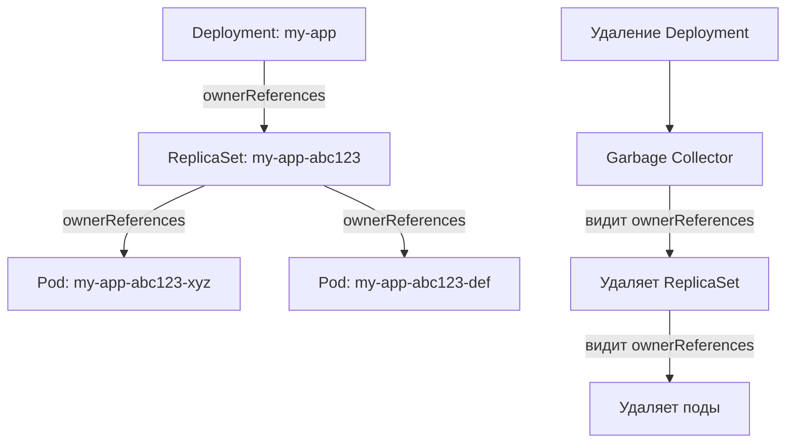

>Владелец и зависимые объекты (Owner References) — это механизм, который связывает ресурсы в Kubernetes для автоматического управления жизненным циклом и «сборки мусора».

# Владелец и зависимые объекты (Owner References) в Kubernetes

> 📌 **OwnerReference** = связь «родитель → потомок». Если владелец удалён → зависимые объекты автоматически удаляются сборщиком мусора (Garbage Collector). Механизм работает вместе с финализаторами и политиками удаления (`cascade`).

---

## 🔹 Что такое Owner Reference

| Аспект | Описание |
|--------|----------|
| **Определение** | Поле `metadata.ownerReferences` в объекте, указывающее на его владельца |
| **Назначение** | Автоматическая «сборка мусора»: удалил владельца → удалились зависимые объекты |
| **Кто устанавливает** | Обычно контроллеры автоматически (Deployment → ReplicaSet → Pod), но можно задать вручную |
| **Ключевые поля** | `apiVersion`, `kind`, `name`, `uid`, `blockOwnerDeletion`, `controller` |



> 💡 **Простая аналогия**: владелец — как «родитель» в семье. Если родитель уезжает навсегда (удалён), дети (зависимые) тоже уезжают с ним — если не указано иное.

---

## 🔹 Структура ownerReferences

```yaml
metadata:
  ownerReferences:
  - apiVersion: apps/v1          # ← API версия владельца
    kind: ReplicaSet             # ← тип владельца
    name: my-app-abc123          # ← имя владельца
    uid: a1b2c3d4-e5f6-7890      # ← UID владельца (уникальный!)
    controller: true             # ← этот владелец — основной контроллер?
    blockOwnerDeletion: true     # ← блокировать удаление владельца, пока я не удалюсь?
```

### 🔑 Ключевые поля

| Поле | Тип | Обязательное | Описание |
|------|-----|-------------|----------|
| `apiVersion` | string | ✅ | API группа и версия владельца (`apps/v1`, `batch/v1`) |
| `kind` | string | ✅ | Тип ресурса-владельца (`ReplicaSet`, `Job`, `Deployment`) |
| `name` | string | ✅ | Имя владельца (в том же неймспейсе) |
| `uid` | string | ✅ | UID владельца — гарантирует уникальность, даже если имя переиспользовано |
| `controller` | boolean | ❌ | `true` если этот владелец — основной контроллер (может быть только один) |
| `blockOwnerDeletion` | boolean | ❌ | `true` если зависимый объект может блокировать удаление владельца (через финализатор) |

> ⚠️ **Важно**: `uid` критичен! Если владелец удалён и создан новый с тем же именем — `uid` будет другим, и связь не восстановится автоматически.

---

## 🔹 Как работает сборка мусора (Garbage Collection)

### 🔄 Базовый сценарий: каскадное удаление

```yaml
# 1. Deployment создаёт ReplicaSet с ownerReferences
apiVersion: apps/v1
kind: ReplicaSet
metadata:
  name: my-app-abc123
  ownerReferences:
  - apiVersion: apps/v1
    kind: Deployment
    name: my-app
    uid: def456...
    controller: true

# 2. Пользователь удаляет Deployment
kubectl delete deployment my-app

# 3. Garbage Collector видит:
# • У владельца (Deployment) нет владельца → он удалён
# • У зависимого (ReplicaSet) есть ownerReferences на удалённого владельца
# → удаляет ReplicaSet

# 4. Цепочка продолжается: поды, созданные ReplicaSet, тоже удаляются
```

### 🛑 Блокировка удаления: `blockOwnerDeletion`

```yaml
# Зависимый объект с blockOwnerDeletion: true
metadata:
  ownerReferences:
  - apiVersion: apps/v1
    kind: Deployment
    name: my-app
    uid: def456...
    blockOwnerDeletion: true  # ← важно!

# При удалении владельца:
# 1. Владелец переходит в Terminating
# 2. Но не удаляется физически, пока зависимый не будет удалён
# 3. Контроллер зависимого объекта выполняет очистку
# 4. Удаляет себя → владелец может быть удалён
```

> 💡 **Зачем нужно**: гарантия, что «дети» будут корректно очищены до удаления «родителя» (например, сброс внешних ресурсов, финализация).

---

## 🔹 Область видимости: неймспейс vs кластер

Правила для ownerReferences зависят от области видимости ресурсов.

### 📊 Таблица совместимости

| Зависимый объект | Владелец | Допустимо? | Комментарий |
|-----------------|----------|-----------|-------------|
| **Namespaced** (Pod, Deployment) | Namespaced, тот же неймспейс | ✅ Да | Стандартный случай |
| **Namespaced** | Namespaced, другой неймспейс | ❌ Нет | Ссылка игнорируется, зависимый может быть удалён |
| **Namespaced** | Cluster-scoped (Node, PV) | ✅ Да | Разрешено, но редко используется |
| **Cluster-scoped** (Node, PV) | Cluster-scoped | ✅ Да | Стандартный случай |
| **Cluster-scoped** | Namespaced (любой) | ❌ Нет (с K8s 1.20+) | Ссылка считается невалидной, событие `OwnerRefInvalidNamespace` |

### 🔍 Как проверить невалидные ссылки
```bash
# Найти события о невалидных ownerReferences
kubectl get events -A --field-selector reason=OwnerRefInvalidNamespace

# Пример вывода:
# Warning  OwnerRefInvalidNamespace  pod/my-pod  ownerReference [...]: 
# cluster-scoped owner "Namespace/default" not allowed for namespaced dependent
```

> ⚠️ **Важно**: начиная с **Kubernetes 1.20**, кластерные ресурсы не могут иметь владельцев с областью видимости неймспейса. Это предотвращает «утечку» ссылок при удалении неймспейса.

---

## 🔹 Взаимодействие с финализаторами

OwnerReferences и финализаторы работают вместе для безопасного удаления.

### 🎯 Сценарий: каскадное удаление с финализацией

```yaml
# Владелец с финализатором и зависимым с blockOwnerDeletion: true
apiVersion: v1
kind: PersistentVolumeClaim
metadata:
  name: my-pvc
  finalizers:
  - kubernetes.io/pvc-protection
  ownerReferences:
  - apiVersion: apps/v1
    kind: Deployment
    name: my-app
    uid: abc123...
    blockOwnerDeletion: true  # ← PVC может блокировать удаление владельца
```

```
Шаги при удалении Deployment:
1. Deployment переходит в Terminating
2. Garbage Collector видит зависимый PVC с blockOwnerDeletion: true
3. Добавляет финализатор к Deployment (если нужно)
4. Ждёт, пока контроллер удалит PVC:
   • PVC проверяет, не используется ли том
   • Если свободен → удаляет свой финализатор → PVC удаляется
5. После удаления всех зависимых → Deployment удаляется физически
```

> 💡 **Практика**: если владелец «застрял» в `Terminating` — проверь:
> 1. Какие финализаторы на нём висят
> 2. Есть ли зависимые объекты с `blockOwnerDeletion: true`
> 3. Почему эти зависимые не удаляются (свои финализаторы, внешние зависимости)

---

## 🔹 Практика: работа с ownerReferences через kubectl

### 👁️ Просмотр связей
```bash
# Посмотреть ownerReferences объекта
kubectl get pod my-pod -o jsonpath='{.metadata.ownerReferences}'
kubectl describe pod my-pod | grep -A10 'Controlled By:'

# Найти все объекты, принадлежащие конкретному владельцу
kubectl get pods --all-namespaces -o json | jq '
  .items[] | 
  select(.metadata.ownerReferences != null) |
  select(.metadata.ownerReferences[].name == "my-replicaset") |
  {name: .metadata.name, namespace: .metadata.namespace}'

# Проверить цепочку владения (рекурсивно)
kubectl get pod my-pod -o json | jq '
  .metadata.ownerReferences // [] | 
  .[] | 
  {kind, name, uid}'
```

### 🔧 Ручное управление (осторожно!)
```bash
# Добавить ownerReferences к объекту (если контроллер не сделал это)
kubectl patch pod my-pod --type merge -p '{
  "metadata": {
    "ownerReferences": [{
      "apiVersion": "apps/v1",
      "kind": "ReplicaSet",
      "name": "my-rs",
      "uid": "abc123...",
      "controller": true,
      "blockOwnerDeletion": false
    }]
  }
}'

# Удалить ownerReferences (отвязать объект от владельца)
kubectl patch pod my-pod --type json -p '[
  {"op": "remove", "path": "/metadata/ownerReferences"}
]'

# Изменить blockOwnerDeletion
kubectl patch pvc my-pvc --type merge -p '{
  "metadata": {
    "ownerReferences": [{
      "apiVersion": "apps/v1",
      "kind": "Deployment",
      "name": "my-app",
      "uid": "def456...",
      "blockOwnerDeletion": false
    }]
  }
}'
```

### 🧹 Отладка проблем с удалением
```bash
# 1. Проверить, есть ли у объекта владелец
kubectl get <kind> <name> -o jsonpath='{.metadata.ownerReferences}'

# 2. Если владелец удалён, но объект остался — проверить Garbage Collector
kubectl get events --field-selector involvedObject.name=<name> | grep -i garbage

# 3. Проверить, не блокирует ли удаление blockOwnerDeletion
kubectl get <kind> <name> -o json | jq '.metadata.ownerReferences[] | {name, blockOwnerDeletion}'

# 4. Посмотреть, какие финализаторы мешают удалению владельца
kubectl get <owner-kind> <owner-name> -o jsonpath='{.metadata.finalizers}'

# 5. Проверить логи контроллера, управляющего зависимым объектом
kubectl logs -n kube-system -l k8s-app=<controller-name> | grep <object-name>
```

---

## 🔹 Политики каскадного удаления

При удалении владельца можно управлять поведением зависимых объектов.

### 🎛️ Три режима удаления

| Режим | Флаг `kubectl` | Поведение | Когда использовать |
|-------|---------------|-----------|-------------------|
| **🗑️ Foreground** | `--cascade=foreground` | Владелец ждёт, пока все зависимые удалятся (через финализаторы) | Когда нужна гарантия полной очистки |
| **🔄 Background** | `--cascade=background` (по умолчанию) | Владелец удаляется сразу, зависимые удаляются асинхронно | Стандартный случай, баланс скорости и надёжности |
| **🪶 Orphan** | `--cascade=orphan` | Зависимые объекты не удаляются, становятся «сиротами» | Когда нужно сохранить данные/ресурсы при удалении владельца |

### 💻 Примеры использования
```bash
# Foreground: ждать полной очистки перед удалением владельца
kubectl delete deployment my-app --cascade=foreground

# Background: удалить владельца, зависимые удалятся позже (по умолчанию)
kubectl delete deployment my-app  # или --cascade=background

# Orphan: удалить владельца, но сохранить поды/ReplicaSet
kubectl delete deployment my-app --cascade=orphan

# Проверить, что поды остались, но без владельца
kubectl get pods -l app=my-app -o jsonpath='{.items[*].metadata.ownerReferences}'
# → пустой вывод: владелец отвязан
```

> 💡 **Совет**: используй `--dry-run=server` для проверки, что будет удалено:
> ```bash
> kubectl delete deployment my-app --cascade=foreground --dry-run=server -v=6
> ```

---

## 🔹 Чек-лист: работа с ownerReferences

```bash
# ✅ При создании ресурсов: позволяй контроллерам управлять ownerReferences
# → не переопределяй вручную, если нет веской причины

# ✅ Перед удалением владельца: проверь цепочку зависимостей
kubectl get <kind> <name> -o json | jq '.metadata.ownerReferences'

# ✅ Если объект не удаляется: проверь финализаторы и blockOwnerDeletion
kubectl get <kind> <name> -o json | jq '{
  finalizers: .metadata.finalizers,
  ownerRefs: .metadata.ownerReferences
}'

# ✅ Для отладки: ищи события о проблемах с ownerReferences
kubectl get events -A --field-selector reason=OwnerRefInvalidNamespace

# ✅ При написании своего контроллера:
# • Устанавливай uid, а не только name (защита от переиспользования имени)
# • Ставь controller: true только для основного контроллера
# • Используй blockOwnerDeletion: true, если нужна гарантия очистки

# ✅ Для массовых операций: тестируй политику удаления на одном объекте
kubectl delete deployment test-app --cascade=foreground --dry-run=server

# ❌ Не удаляй ownerReferences вручную, если не понимаешь последствий
# → объект может стать «сиротой» и никогда не удалиться, или удалиться раньше времени

# ❌ Не создавай циклические ссылки (A → B → A)
# → Garbage Collector не сможет разрешить зависимости, объекты «зависнут»
```

> 💡 **Совет для конспекта**:
> 1. Создай файл `00_owner_refs_diagram.md` со схемой: «Как у нас связаны основные ресурсы (Deployment → RS → Pod)».
> 2. Добавь блок «Аварийные сценарии»: что делать, если объект «осиротел» или «завис» при удалении.
> 3. Веди заметку «Контроллеры и их политики»: какой контроллер какую политику удаления использует по умолчанию.

---

## 🔹 Ключевые выводы

1. **OwnerReference = связь для сборки мусора**: удалил владельца → зависимые удаляются автоматически.
2. **UID важнее имени**: связь строится по `uid`, а не по `name` — защита от переиспользования имён.
3. **`blockOwnerDeletion` = блокировка удаления владельца**: зависимый может задержать удаление, пока не выполнит очистку.
4. **Область видимости имеет значение**: namespaced-объекты не могут владеть кластерными, и наоборот (с ограничениями).
5. **Три политики удаления**: `foreground` (ждать), `background` (по умолчанию), `orphan` (сохранить зависимые).