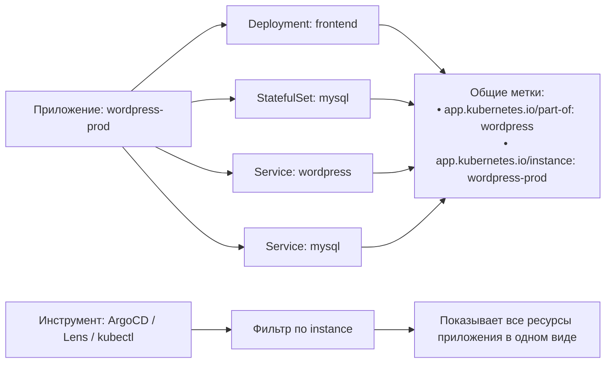

>Рекомендуемые метки (`app.kubernetes.io/*`) — это стандарт де-факто для единообразного описания приложений в Kubernetes. Они позволяют инструментам (Helm, Kustomize, ArgoCD, Dashboard) «понимать» твои ресурсы без дополнительной конфигурации.

# Рекомендуемые метки (Recommended Labels) в Kubernetes

> 📌 Метки с префиксом `app.kubernetes.io/*` — это **стандартный словарь** для описания приложений. Они не обязательны для работы K8s, но критичны для совместимости с инструментами (Helm, Kustomize, ArgoCD, Lens) и для удобства управления.

---

## 🔹 Зачем нужны стандартные метки

| Проблема | Решение через `app.kubernetes.io/*` |
|----------|-----------------------------------|
| 🧩 Разные инструменты используют разные метки | Единый префикс: все понимают `app.kubernetes.io/name` |
| 🔍 Сложно найти все ресурсы одного приложения | Фильтр по `app.kubernetes.io/instance=wordpress-abcxyz` |
| 📊 Нет единого представления в мониторинге/дашбордах | Инструменты автоматически группируют по стандартным меткам |
| 🔄 Сложно управлять несколькими экземплярами одного приложения | Разделение: `name=wordpress` (что) + `instance=wordpress-prod` (какой) |
| 🧭 Неясно, какой компонент за что отвечает | `app.kubernetes.io/component=database` vs `component=frontend` |



> 💡 **Ключевая идея**: стандартные метки — это «паспорт» приложения. Без них каждый инструмент видит ресурсы по-своему. С ними — все говорят на одном языке.

---

## 🔹 Шесть стандартных меток

Все метки имеют префикс `app.kubernetes.io/` — это гарантирует, что они не конфликтуют с пользовательскими метками.

| Ключ | Описание | Пример | Обязательность | Тип |
|------|----------|--------|---------------|-----|
| **`app.kubernetes.io/name`** | Название приложения (логическое, не уникальное) | `mysql`, `wordpress`, `payment-api` | ✅ Рекомендуется | string |
| **`app.kubernetes.io/instance`** | Уникальное имя экземпляра приложения (в рамках неймспейса) | `mysql-prod-1`, `wordpress-staging` | ✅ Рекомендуется | string |
| **`app.kubernetes.io/version`** | Версия приложения (SemVer, хеш, тег образа) | `5.7.21`, `v2.1.0`, `abc123def` | ⚪ Опционально | string |
| **`app.kubernetes.io/component`** | Роль компонента в архитектуре | `database`, `frontend`, `cache`, `worker` | ⚪ Опционально | string |
| **`app.kubernetes.io/part-of`** | Название родительского приложения/экосистемы | `wordpress` (для mysql), `ecommerce-platform` | ⚪ Опционально | string |
| **`app.kubernetes.io/managed-by`** | Инструмент, управляющий развёртыванием | `helm`, `kustomize`, `argocd`, `manual` | ⚪ Опционально | string |

### 🔑 Разбор ключевых концепций

#### `name` vs `instance`
```yaml
# Приложение: WordPress
# Экземпляр: продакшен-сайт компании

metadata:
  labels:
    app.kubernetes.io/name: wordpress        # ← Что это за приложение?
    app.kubernetes.io/instance: wordpress-acme-com  # ← Какой конкретно экземпляр?
```

| Метка | Ответ на вопрос | Примеры значений |
|-------|----------------|-----------------|
| `name` | **Что** развёрнуто? | `mysql`, `redis`, `nginx`, `my-custom-app` |
| `instance` | **Какой именно** экземпляр? | `mysql-prod`, `redis-cache-1`, `my-app-staging` |

> 💡 **Правило**: `instance` должен быть уникальным в рамках неймспейса. Часто формируют как `<name>-<env>-<id>`.

#### `component` и `part-of`: иерархия приложения
```yaml
# MySQL как часть WordPress
metadata:
  labels:
    app.kubernetes.io/name: mysql              # ← Сам компонент
    app.kubernetes.io/component: database      # ← Его роль
    app.kubernetes.io/part-of: wordpress       # ← Часть большего приложения
```

```
wordpress (part-of)
├─ frontend (name=wordpress, component=server)
├─ mysql    (name=mysql,     component=database)
└─ redis    (name=redis,     component=cache)
```

#### `managed-by`: аудит и автоматизация
```yaml
metadata:
  labels:
    app.kubernetes.io/managed-by: helm      # ← Управляется Helm
    # или:
    app.kubernetes.io/managed-by: argocd    # ← GitOps через ArgoCD
    # или:
    app.kubernetes.io/managed-by: manual    # ← Ручное управление (редко)
```

> ⚠️ **Важно**: если используешь Helm/Kustomize/ArgoCD — они **автоматически** добавляют эти метки. Не переопределяй их вручную, если не понимаешь последствий.

---

## 🔹 Примеры применения

### 🧪 Простое приложение без состояния (Stateless)

```yaml
# Deployment
apiVersion: apps/v1
kind: Deployment
metadata:
  name: myservice
  labels:
    app.kubernetes.io/name: myservice
    app.kubernetes.io/instance: myservice-prod
    app.kubernetes.io/version: "v1.2.0"
    app.kubernetes.io/component: server
    app.kubernetes.io/managed-by: kustomize
spec:
  # ... spec

---
# Service
apiVersion: v1
kind: Service
metadata:
  name: myservice
  labels:
    app.kubernetes.io/name: myservice
    app.kubernetes.io/instance: myservice-prod
    app.kubernetes.io/version: "v1.2.0"
    app.kubernetes.io/component: server
    app.kubernetes.io/managed-by: kustomize
spec:
  selector:
    app.kubernetes.io/name: myservice
    app.kubernetes.io/instance: myservice-prod
  # ... spec
```

> ✅ **Зачем**: одинаковые метки на всех ресурсах → один запрос `kubectl get all -l app.kubernetes.io/instance=myservice-prod` покажет всё приложение.

### 🌐 Веб-приложение с базой данных (WordPress + MySQL)

```yaml
# WordPress Deployment
apiVersion: apps/v1
kind: Deployment
metadata:
  name: wordpress
  labels:
    app.kubernetes.io/name: wordpress
    app.kubernetes.io/instance: wordpress-acme
    app.kubernetes.io/version: "6.4.2"
    app.kubernetes.io/component: server
    app.kubernetes.io/part-of: wordpress
    app.kubernetes.io/managed-by: helm
spec:
  # ...

---
# WordPress Service
apiVersion: v1
kind: Service
metadata:
  name: wordpress
  labels:
    app.kubernetes.io/name: wordpress
    app.kubernetes.io/instance: wordpress-acme
    app.kubernetes.io/component: server
    app.kubernetes.io/part-of: wordpress
    app.kubernetes.io/managed-by: helm
spec:
  selector:
    app.kubernetes.io/name: wordpress
    app.kubernetes.io/instance: wordpress-acme
    app.kubernetes.io/component: server
  # ...

---
# MySQL StatefulSet (как часть WordPress)
apiVersion: apps/v1
kind: StatefulSet
metadata:
  name: mysql
  labels:
    app.kubernetes.io/name: mysql              # ← Своё имя
    app.kubernetes.io/instance: mysql-acme
    app.kubernetes.io/version: "8.0.35"
    app.kubernetes.io/component: database      # ← Своя роль
    app.kubernetes.io/part-of: wordpress       # ← Но часть большего приложения!
    app.kubernetes.io/managed-by: helm
spec:
  # ...

---
# MySQL Service
apiVersion: v1
kind: Service
metadata:
  name: mysql
  labels:
    app.kubernetes.io/name: mysql
    app.kubernetes.io/instance: mysql-acme
    app.kubernetes.io/component: database
    app.kubernetes.io/part-of: wordpress
    app.kubernetes.io/managed-by: helm
spec:
  selector:
    app.kubernetes.io/name: mysql
    app.kubernetes.io/instance: mysql-acme
    app.kubernetes.io/component: database
  # ...
```

> ✅ **Зачем**: 
> - `kubectl get all -l app.kubernetes.io/part-of=wordpress` → покажет **всё**: и WordPress, и MySQL
> - `kubectl get all -l app.kubernetes.io/name=mysql` → покажет **только** компоненты MySQL
> - Инструменты мониторинга автоматически строят дашборды по `component`

---

## 🔹 Как инструменты используют стандартные метки

| Инструмент | Как использует `app.kubernetes.io/*` |
|------------|-------------------------------------|
| **🎨 Helm** | Автоматически добавляет все 6 меток к ресурсам; использует `instance` для изоляции релизов |
| **🔧 Kustomize** | Позволяет задавать общие метки через `commonLabels`; совместим со стандартом |
| **🔄 ArgoCD / Flux** | Группирует ресурсы в UI по `part-of`/`instance`; отслеживает изменения по `managed-by` |
| **🖥️ Kubernetes Dashboard / Lens** | Автоматическая группировка приложений в интерфейсе |
| **📊 Prometheus / Grafana** | Метрики автоматически обогащаются метками; дашборды строятся по `component` |
| **🔍 kubectl** | Удобная фильтрация: `kubectl get all -l app.kubernetes.io/instance=my-app` |

### 💻 Пример: фильтрация через kubectl
```bash
# Все ресурсы приложения "wordpress-acme"
kubectl get all -l app.kubernetes.io/instance=wordpress-acme

# Только компоненты "database" во всех приложениях
kubectl get all -l app.kubernetes.io/component=database

# Все ресурсы, управляемые Helm, в неймспейсе production
kubectl get all -n production -l app.kubernetes.io/managed-by=helm

# Комбинация: продакшен-экземпляр + компонент frontend
kubectl get pods -l app.kubernetes.io/part-of=ecommerce,app.kubernetes.io/component=frontend,app.kubernetes.io/instance=ecommerce-prod
```

---

## 🔹 Best Practices: как применять метки

### ✅ Рекомендации

```yaml
# 1. Применяй метки ко ВСЕМ ресурсам приложения (не только к подам)
#    → Deployment, Service, ConfigMap, Secret, PVC, Ingress — все должны иметь одинаковый набор

# 2. Формируй instance по шаблону: <name>-<env>[-<suffix>]
metadata:
  labels:
    app.kubernetes.io/instance: payment-api-prod
    # или:
    app.kubernetes.io/instance: payment-api-staging-eu

# 3. Используй SemVer для version (если применимо)
    app.kubernetes.io/version: "2.1.0"
    # или хеш коммита для canary-сборок:
    app.kubernetes.io/version: "abc123def"

# 4. Для component используй ограниченный набор значений
    app.kubernetes.io/component: frontend   # ✅
    app.kubernetes.io/component: backend    # ✅
    app.kubernetes.io/component: worker     # ✅
    # ❌ Избегай: component: "my-super-custom-thing-v2"

# 5. part-of указывай только если приложение — часть большего целого
    # Отдельное приложение:
    app.kubernetes.io/part-of: <не указывать>
    # Микросервис в экосистеме:
    app.kubernetes.io/part-of: ecommerce-platform

# 6. managed-by ставь автоматически (инструментом), не вручную
    # Если развёртываешь через Helm — он сам добавит:
    app.kubernetes.io/managed-by: Helm
```

### ❌ Частые ошибки

```yaml
# ❌ Разные метки на связанных ресурсах
# Deployment:
labels:
  app: myapp          # ← свой стиль
# Service:
labels:
  app.kubernetes.io/name: myapp  # ← стандарт
# → Инструменты не смогут связать ресурсы!

# ✅ Решение: единый стиль для всех ресурсов приложения

# ❌ instance не уникален в неймспейсе
# Два приложения с одинаковым instance:
# - wordpress: instance=wordpress-prod
# - mysql: instance=wordpress-prod  # ← конфликт!
# → Сложно фильтровать, инструменты путаются

# ✅ Решение: instance должен идентифицировать экземпляр приложения:
# - wordpress: instance=wordpress-prod
# - mysql: instance=mysql-for-wordpress-prod

# ❌ Переопределение меток, добавленных инструментом
# Helm автоматически добавляет:
#   app.kubernetes.io/managed-by: Helm
# Ты вручную меняешь на:
#   app.kubernetes.io/managed-by: manual
# → При следующем helm upgrade возникнет конфликт!

# ✅ Решение: не трогай метки с префиксом app.kubernetes.io, если их добавил инструмент
```

---

## 🔹 Практика: работа со стандартными метками

### 🔍 Просмотр и фильтрация
```bash
# Все ресурсы с стандартными метками в неймспейсе
kubectl get all -n my-ns -l app.kubernetes.io/name

# Группировка по приложению (через part-of)
kubectl get all --all-namespaces -l app.kubernetes.io/part-of=wordpress

# Поиск по версии (например, для аудита устаревых образов)
kubectl get pods -l app.kubernetes.io/version=v1.0.0

# Показать только ресурсы, управляемые ArgoCD
kubectl get all -l app.kubernetes.io/managed-by=argocd
```

### 🏷️ Добавление меток к существующим ресурсам
```bash
# Добавить стандартные метки к объекту (если их нет)
kubectl label deployment my-app \
  app.kubernetes.io/name=my-app \
  app.kubernetes.io/instance=my-app-prod \
  app.kubernetes.io/component=server \
  --overwrite

# Массовое добавление по селектору
kubectl label pods -l app=my-legacy-app \
  app.kubernetes.io/name=my-legacy-app \
  app.kubernetes.io/instance=my-legacy-app-prod \
  app.kubernetes.io/managed-by=manual \
  --overwrite

# ⚠️ Осторожно: --overwrite может сломать логику инструмента!
# Сначала проверь, какие метки уже есть:
kubectl get deployment my-app -o jsonpath='{.metadata.labels}'
```

### 🧪 Валидация манифестов
```bash
# Проверить, что все ресурсы в файле имеют стандартные метки
# (простой скрипт на bash + yq)
for kind in Deployment Service ConfigMap; do
  echo "=== $kind ==="
  yq eval ".metadata.labels | keys" manifest.yaml | grep -q "app.kubernetes.io/name" \
    && echo "✓ Есть name" || echo "✗ Нет name"
done

# Или через kubectl --dry-run
kubectl apply -f manifest.yaml --dry-run=server -o yaml | grep "app.kubernetes.io"
```

---

## 🔹 Чек-лист: использование рекомендуемых меток

```
# ✅ При создании нового приложения: сразу добавляй все 6 меток ко всем ресурсам
# → Это окупится при подключении мониторинга, дашбордов, автоматизации

# ✅ Используй одинаковый набор меток для всех ресурсов одного экземпляра
# → Один фильтр покажет всё приложение

# ✅ Формируй instance по шаблону: <name>-<env>[-<id>]
# → Уникальность + читаемость

# ✅ Не переопределяй метки, добавленные инструментом (Helm, Kustomize, ArgoCD)
# → Проверь документацию инструмента: какие метки он добавляет автоматически

# ✅ Для legacy-приложений: добавь минимум `name` и `instance`
# → Даже частичное соответствие стандарту улучшает управляемость

# ✅ Документируй принятые в команде значения для `component`
# → Например: "Мы используем: frontend, backend, worker, database, cache, proxy"

# ✅ При миграции: сначала добавь метки параллельно старым, потом переведи инструменты

# ❌ Не используй `app.kubernetes.io/*` для пользовательской логики
# → Эти метки зарезервированы для стандарта; для своих нужд используй `mycompany.io/*`

# ❌ Не меняй `instance` после создания приложения
# → Это «идентификатор» экземпляра; изменение сломает связь в инструментах
```

> 💡 **Совет для конспекта**:
> 1. Создай файл `00_labels_convention.md` с принятыми в твоих проектах значениями для `component`, шаблоном для `instance`.
> 2. Добавь блок «Шаблоны манифестов»: базовый YAML с уже заполненными стандартными метками — копируй и заполняй.
> 3. Веди заметку «Инструменты и их метки»: какие метки добавляет Helm/ArgoCD/Kustomize по умолчанию, чтобы не переопределять.

---

## 🔹 Ключевые выводы

1. **Стандартные метки = интероперабельность**: инструменты «понимают» твои ресурсы без донастройки.
2. **`name` ≠ `instance`**: первое — что за приложение, второе — какой конкретный экземпляр.
3. **Применяй ко всем ресурсам**: не только к подам, но и к Service, ConfigMap, PVC — для единой фильтрации.
4. **Не переопределяй метки инструментов**: Helm/ArgoCD сами добавляют `app.kubernetes.io/*` — доверяй им.
5. **Документируй конвенции**: команда должна знать, какие значения допустимы для `component`, как формировать `instance`.