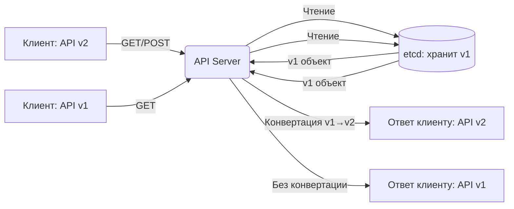

>Версии хранилища (Storage Versions) — важная, но часто упускаемая тема: она связывает то, как ты видишь объект через API, с тем, как он реально хранится в etcd. Критично для администрирования, шифрования и миграций.

# Версии хранилища (Storage Versions) в Kubernetes

> 📌 **TL;DR**: **Storage Version** = версия, в которой объект **фактически хранится** в etcd. API-версии (`v1`, `v1beta1`) — это то, как ты видишь объект через API. K8s автоматически конвертирует между ними. Важно для шифрования, миграций и работы с CRD.

---

## 🔹 Базовые понятия: API версия vs версия хранилища

| Понятие | Что это | Кто видит | Пример |
|---------|---------|-----------|--------|
| **🔌 API версия** | Версия объекта в запросах к API | 👤 Пользователь, `kubectl`, клиенты | `apps/v1/Deployment`, `autoscaling/v2/HorizontalPodAutoscaler` |
| **💾 Storage версия** | Версия, в которой объект сериализован и хранится в etcd | 🤖 API Server, etcd, шифрование | `autoscaling/v1` (даже если клиент работает с `v2`) |
| **🔄 Конвертация** | Автоматическое преобразование между версиями | Прозрачно для пользователя | Запрос в `v2` → чтение из `v1` в etcd → конвертация → ответ в `v2` |



> 💡 **Ключевая идея**: ты работаешь с удобной API-версией, а K8s сам заботится о совместимости с хранилищем. Но для администратора важно понимать, что **на самом деле** лежит в etcd.

---

## 🔹 Зачем это важно: сценарии использования

| Сценарий | Почему важна версия хранилища |
|----------|------------------------------|
| **🔐 Шифрование в покое (Encryption at Rest)** | Ключи шифрования привязаны к конкретной версии хранения; неправильная версия = невозможность расшифровать |
| **🗑️ Устаревание API (Deprecation)** | Старые объекты могут храниться в устаревшей версии; нужно мигрировать перед удалением поддержки |
| **🧩 Пользовательские ресурсы (CRD)** | Ты сам указываешь, какая версия будет хранить данные; ошибка = потеря полей при обновлении |
| **🔍 Аудит и отладка** | Прямой доступ к etcd покажет объекты в версии хранения, а не в той, что ты ожидаешь |
| **📦 Бэкап/восстановление** | При восстановлении из бэкапа важно, чтобы API Server понимал версию хранения |

> ⚠️ **Важно**: версия хранилища — **одна на ресурс** в любой момент времени. Нельзя хранить часть объектов в `v1`, а часть в `v2`.

---

## 🔹 Как работает конвертация версий

### 🔄 Процесс чтения/записи

```
1. Клиент отправляет запрос в версии API v2
2. API Server проверяет: какая версия хранения для этого ресурса? (например, v1)
3. Чтение:
   • Читает объект из etcd в версии v1
   • Конвертирует v1 → v2 (используя встроенные схемы конвертации)
   • Возвращает клиенту объект в версии v2
4. Запись:
   • Принимает объект в версии v2 от клиента
   • Конвертирует v2 → v1 (версия хранения)
   • Сериализует и записывает в etcd в версии v1
```

### 🧩 Пример: HorizontalPodAutoscaler

```yaml
# Клиент создаёт HPA через API v2
apiVersion: autoscaling/v2
kind: HorizontalPodAutoscaler
metadata:
  name: my-hpa
spec:
  metrics:
  - type: Resource
    resource:
      name: cpu
      target:
        type: Utilization
        averageUtilization: 70

# Если версия хранения = autoscaling/v1:
# 1. API Server конвертирует v2 → v1
# 2. Сохраняет в etcd в формате v1 (упрощённая схема)
# 3. При чтении: v1 → v2, клиент видит исходную структуру

# ⚠️ Но: если в v2 есть поле, которого нет в v1 (версии хранения) — оно будет потеряно при сохранении!
```

> 💡 **Практика**: перед использованием новой версии API проверь, какая версия хранения используется для этого ресурса:
> ```bash
> kubectl get apiservices v2.autoscaling.k8s.io -o jsonpath='{.status.conditions[?(@.type=="Available")]}'
> ```

---

## 🔹 Версии хранения для встроенных ресурсов

Для встроенных типов (`Pod`, `Deployment`, `Service` и др.) версия хранения определяется разработчиками Kubernetes и меняется редко.

### 🔍 Как узнать версию хранения для ресурса
```bash
# Способ 1: через API discovery
kubectl get --raw /apis/autoscaling/v2 | jq '.storageVersionHash'

# Способ 2: через прямой запрос к API Server
kubectl get --raw /apis/autoscaling/v2/horizontalpodautoscalers | jq '.items[0].metadata.storageVersionHash'

# Способ 3: посмотреть в коде/документации
# → Обычно версия хранения = самая старая стабильная версия ресурса
```

### 📋 Примеры версий хранения (актуально на K8s 1.30+)

| Ресурс | Типичная версия хранения | Комментарий |
|--------|-------------------------|-------------|
| `Pod`, `Service`, `ConfigMap` | `v1` (core API) | Стабильно с первых версий |
| `Deployment`, `ReplicaSet` | `apps/v1` | С K8s 1.9+ |
| `HorizontalPodAutoscaler` | `autoscaling/v1` | Даже если используешь `v2` в API |
| `Ingress` | `networking.k8s.io/v1` | С K8s 1.19+ |
| `CronJob` | `batch/v1` | С K8s 1.21+ |

> ⚠️ **Важно**: версия хранения может меняться между релизами K8s. Всегда проверяй [официальную документацию](https://kubernetes.io/docs/reference/using-api/#api-versioning) для своей версии.

---

## 🔹 Версии хранения для пользовательских ресурсов (CRD)

Для CRD **ты сам указываешь** версию хранения через поле `storage: true` в определении.

### 📋 Пример CRD с несколькими версиями

```yaml
apiVersion: apiextensions.k8s.io/v1
kind: CustomResourceDefinition
metadata:
  name: crontabs.example.com
spec:
  group: example.com
  names:
    kind: CronTab
    plural: crontabs
  scope: Namespaced
  versions:
  - name: v1beta1
    served: true
    storage: true              # ← ВЕРСИЯ ХРАНЕНИЯ
    schema:
      openAPIV3Schema:
        type: object
        properties:
          spec:
            type: object
            properties:
              host: { type: string }
              port: { type: string }
              # ← НЕТ поля 'time'
  
  - name: v1
    served: true
    storage: false             # ← Только для чтения/записи через API
    schema:
      openAPIV3Schema:
        type: object
        properties:
          spec:
            type: object
            properties:
              host: { type: string }
              port: { type: string }
              time: { type: string }  # ← Новое поле в v1
  
  conversion:
    strategy: None  # ⚠️ Без конвертации поля 'time' будут теряться!
```

### ⚠️ Критичная проблема: потеря полей при смене версии хранения

```
Сценарий:
1. Версия хранения = v1beta1 (нет поля 'time')
2. Клиент создаёт объект через API v1 с полем 'time: "*/5 * * * *"'
3. API Server конвертирует v1 → v1beta1 для хранения
4. Поле 'time' теряется (его нет в схеме v1beta1)
5. При чтении обратно: объект в v1, но 'time' = null

Решение:
• Используй Webhook-конвертацию (conversion.strategy: Webhook)
• Или меняй версию хранения только после миграции всех объектов
```

### 🔧 Как сменить версию хранения для CRD

```yaml
# Шаг 1: Подготовь новую версию с storage: true
versions:
- name: v1
  served: true
  storage: true              # ← Новая версия хранения
  # ... схема с новыми полями
- name: v1beta1
  served: true
  storage: false             # ← Старая версия, только для чтения
  # ... старая схема

# Шаг 2: Обнови CRD
kubectl apply -f crd-updated.yaml

# Шаг 3: Мигрируй существующие объекты (см. раздел ниже)
```

> 💡 **Совет**: всегда используй `conversion.strategy: Webhook` для CRD с несколькими версиями — это гарантирует безопасную конвертацию полей.

---

## 🔹 Влияние на шифрование в покое (Encryption at Rest)

Если включено шифрование секретов или других ресурсов, версия хранения критична.

### 🔐 Как работает шифрование с версиями

```
1. Админ настраивает EncryptionConfiguration:
   - Указывает: шифровать ресурсы типа "secrets" в версии "v1"
   - Предоставляет ключ шифрования

2. При записи:
   • Объект конвертируется в версию хранения (v1)
   • Сериализуется в байты
   • Шифруется ключом
   • Записывается в etcd

3. При чтении:
   • Читается из etcd
   • Расшифровывается ключом
   • Десериализуется из версии хранения (v1)
   • Конвертируется в запрошенную клиентом версию (например, v1)
```

### ⚠️ Проблема: смена ключа шифрования

```
Сценарий:
1. Ключ шифрования #1 использовался для версии хранения v1
2. Админ хочет сменить ключ на #2 (ротация ключей)
3. Но: старые объекты в etcd зашифрованы ключом #1
4. Решение: держать ОБА ключа в конфигурации до тех пор, пока все объекты не будут перечитаны и перешифрованы

Конфигурация:
resources:
- resources:
  - secrets
  providers:
  - aescbc:
      keys:
      - name: key2          # ← Новый ключ (для записи)
        secret: <base64>
      - name: key1          # ← Старый ключ (только для чтения)
        secret: <base64>
  - identity: {}            # ← Fallback (не шифровать)
```

> 💡 **Практика**: после смены ключа запусти «перешифровку»:
> ```bash
> # Перечитать и перезаписать все секреты (триггерит перешифровку новым ключом)
> kubectl get secrets --all-namespaces -o json | jq -c '.items[]' | while read secret; do
>   echo "$secret" | kubectl apply -f -
> done
> ```

---

## 🔹 Миграция между версиями хранения

### 🔄 Когда нужна миграция

| Причина | Что делать |
|---------|-----------|
| **Устаревание версии хранения** | Перевести все объекты на новую версию перед удалением поддержки старой |
| **Смена ключа шифрования** | Перечитать и перезаписать объекты, чтобы они зашифровались новым ключом |
| **Изменение схемы CRD** | Мигрировать объекты через конвертер, чтобы не потерять данные |
| **Оптимизация хранения** | Перейти на более компактную версию (если есть такая опция) |

### 🛠️ Стратегии миграции

#### 1. Автоматическая (через обновление объекта)
```bash
# Простой способ: прочитать и записать объект заново
# Триггерит конвертацию в текущую версию хранения

# Для одного объекта:
kubectl get crontab my-cron -o yaml | kubectl apply -f -

# Для всех объектов типа:
kubectl get crontabs -A -o json | jq -c '.items[]' | while read obj; do
  echo "$obj" | kubectl apply -f -
done
```

#### 2. Через `kubectl convert` (если доступен плагин)
```bash
# Конвертировать манифест из одной версии в другую
kubectl convert -f old.yaml --output-version example.com/v1 | kubectl apply -f -
```

#### 3. Массовая миграция с контролем прогресса
```bash
#!/bin/bash
# migrate-storage-version.sh

RESOURCE="crontabs.example.com"
NAMESPACE="${1:-default}"
LABEL="migrated=$(date +%s)"

# Пометить уже мигрированные объекты
kubectl get $RESOURCE -n $NAMESPACE -l $LABEL --no-headers -o name | wc -l

# Мигрировать немеченые
kubectl get $RESOURCE -n $NAMESPACE -l "!$LABEL" --no-headers -o name | while read obj; do
  kubectl get $obj -n $NAMESPACE -o yaml | \
    kubectl label -f - $LABEL --overwrite | \
    kubectl apply -f -
  echo "✓ Мигрирован: $obj"
done
```

#### 4. Для CRD: использовать `storageVersionMigration` (экспериментально)
```yaml
# В некоторых дистрибутивах (OpenShift, GKE) есть встроенная миграция
apiVersion: apiextensions.k8s.io/v1
kind: CustomResourceDefinition
metadata:
  name: crontabs.example.com
spec:
  # ...
  versions:
  - name: v1
    storage: true
    # ...
  - name: v1beta1
    storage: false
    # ...
  # Экспериментальное поле (не в upstream K8s):
  # storageVersionMigration:
  #   enabled: true
  #   targetVersion: v1
```

### ✅ Чек-лист перед миграцией

```bash
# 1. Проверить, какие объекты ещё в старой версии
kubectl get crontabs -o json | jq '
  .items[] | 
  select(.apiVersion == "example.com/v1beta1") | 
  .metadata.name'

# 2. Протестировать конвертацию на одном объекте
kubectl get crontab test -o yaml > test.yaml
# Отредактировать apiVersion на целевую версию
kubectl apply -f test.yaml --dry-run=server

# 3. Сделать бэкап перед массовой миграцией
kubectl get crontabs -A -o yaml > crontabs-backup-$(date +%F).yaml

# 4. Мигрировать в часы низкой нагрузки
# 5. Проверить, что все объекты доступны после миграции
# 6. Удалить старую версию из CRD только после подтверждения
```

---

## 🔹 Чек-лист: работа с версиями хранения

```bash
# ✅ При создании CRD: явно указывай версию хранения через `storage: true`
# → Только одна версия может иметь этот флаг

# ✅ Для встроенных ресурсов: проверяй версию хранения перед использованием новой версии API
# → Особенно если планируешь шифрование или прямой доступ к etcd

# ✅ При шифровании: держи старый ключ в конфигурации до полной перешифровки объектов
# → Проверяй прогресс через аудит или метрики API Server

# ✅ Перед удалением устаревшей версии API: убедись, что все объекты мигрированы
# → Используй `kubectl get <resource> -o json | jq '.apiVersion'` для аудита

# ✅ Для миграции: используй `apply` после `get` — это триггерит конвертацию в версию хранения
# → Не редактируй напрямую etcd!

# ✅ Документируй: какая версия хранения используется для каждого типа ресурса в твоём кластере
# → Это упростит отладку и планирование обновлений

# ❌ Не меняй `storage: true` на две версии одновременно в CRD
# → API Server отклонит такое обновление

# ❌ Не удаляй версию из CRD, пока есть объекты, хранящиеся в ней
# → Они станут нечитаемыми

# ❌ Не полагайся на автоматическую конвертацию для сложной логики
# → Если поля меняют семантику — пиши Webhook-конвертер
```

> 💡 **Совет для конспекта**:
> 1. Создай файл `00_storage_versions_inventory.md` с таблицей: «Ресурс → Версия хранения → Дата последней миграции».
> 2. Добавь блок «Процедура миграции»: пошаговый чек-лист для твоей команды.
> 3. Веди заметку «Ключи шифрования»: какие ключи активны, для каких версий, когда планируется ротация.

---

## 🔹 Ключевые выводы

1. **Storage version ≠ API version**: первая — как объект хранится, вторая — как ты с ним работаешь.
2. **Одна версия хранения на ресурс**: все объекты одного типа хранятся в одной версии, даже если API поддерживает несколько.
3. **Конвертация прозрачна, но не бесплатна**: потеря полей возможна, если схема версии хранения беднее, чем версия API.
4. **CRD: ты управляешь версией хранения**: указывай `storage: true` осознанно, используй Webhook-конвертацию для сложных случаев.
5. **Шифрование привязано к версии хранения**: ротация ключей требует перечитывания всех объектов.
6. **Миграция — плановая операция**: не удаляй старые версии, пока не убедился, что все объекты перенесены.