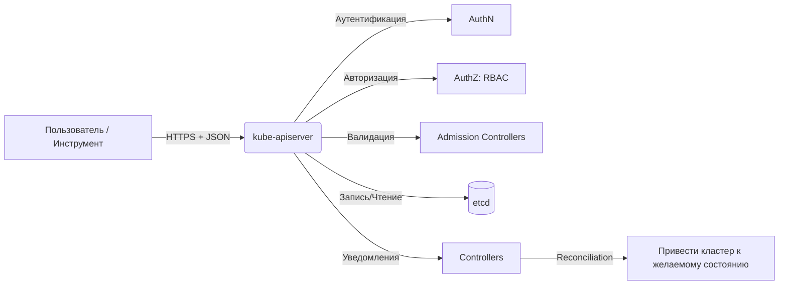

>**Kubernetes API** — фундамент, на котором построено всё взаимодействие с кластером. 
>

# Kubernetes API 

> 📌 Весь Kubernetes управляется через **единый декларативный HTTP API**. `kubectl` — лишь один из клиентов. Понимание архитектуры API (группы, версии, discovery, OpenAPI) критично для отладки, автоматизации и написания операторов.

---

## 🔹 Что такое Kubernetes API

| Аспект | Описание |
|--------|----------|
| **Назначение** | Единый интерфейс для запроса и изменения состояния **всех** объектов кластера |
| **Реализация** | `kube-apiserver` — фронтенд плоскости управления, обрабатывающий HTTPS-запросы |
| **Протокол** | RESTful HTTP API + поддержка Protobuf для внутренней оптимизации |
| **Форматы данных** | JSON (по умолчанию), Protobuf (внутри кластера), YAML (на стороне клиента) |
| **Аутентификация** | Сертификаты, токены, OIDC, webhook-провайдеры |
| **Авторизация** | RBAC, ABAC, Node, Webhook |



> 💡 **Ключевая идея**: **всё в K8s — это объект с `spec` и `status`**, и всё управляется через один API. Даже `kubectl` просто отправляет HTTP-запросы.

---

## 🔹 Способы взаимодействия с API

| Способ | Когда использовать | Пример |
|--------|-------------------|--------|
| **`kubectl`** | Ручное управление, отладка, скрипты | `kubectl get pods`, `kubectl apply -f deploy.yaml` |
| **Прямые REST-запросы** | Низкоуровневая интеграция, кастомные инструменты | `curl -k https://<api>/api/v1/pods -H "Authorization: Bearer <token>"` |
| **Официальные клиентские библиотеки** | Разработка приложений под K8s | Go: `client-go`, Python: `kubernetes-client`, Java: `kubernetes-client` |
| **Динамические клиенты** | Работа с неизвестными заранее ресурсами (операторы, CRD) | Go: `dynamic.Interface`, Python: `DynamicClient` |
| **Server-side apply** | Декларативное управление с отслеживанием владения | `kubectl apply --server-side -f manifest.yaml` |

### 🔍 Пример прямого запроса к API
```bash
# Получить токен из kubeconfig
TOKEN=$(kubectl config view --raw -o jsonpath='{.users[*].user.token}' 2>/dev/null || \
        cat /var/run/secrets/kubernetes.io/serviceaccount/token)

# Запрос списка подов в неймспейсе default
curl -k -H "Authorization: Bearer $TOKEN" \
     -H "Accept: application/json" \
     https://<api-server-endpoint>/api/v1/namespaces/default/pods

# Создать под через прямой POST (упрощённо)
curl -k -X POST \
     -H "Authorization: Bearer $TOKEN" \
     -H "Content-Type: application/json" \
     -d @pod.json \
     https://<api-server-endpoint>/api/v1/namespaces/default/pods
```

> 💡 **Отладка `kubectl`**: добавь `-v=6` для просмотра сырых запросов:
> ```bash
> kubectl get pods -v=6 2>&1 | grep -E 'GET|POST|PUT'
> ```

---

## 🔹 API Discovery: как узнать, что поддерживает кластер

Kubernetes публикует метаданные о доступных ресурсах, чтобы клиенты могли адаптироваться динамически.

### Два механизма обнаружения

| Механизм | Конечная точка | Что возвращает | Когда использовать |
|----------|---------------|----------------|------------------|
| **🔍 Неагрегированное** | `/api`, `/apis`, `/apis/<group>/<version>` | Список групп/версий/ресурсов по отдельности | Простые клиенты, ручная отладка, совместимость со старыми версиями |
| **📦 Агрегированное** *(стабильно с v1.30)* | `/api`, `/apis` с `Accept: application/json;v=v2;g=apidiscovery.k8s.io;as=APIGroupDiscoveryList` | Сводный список всех ресурсов за 1–2 запроса | Эффективное кэширование, автодополнение в `kubectl`, операторы, инструменты управления |

### 🧪 Примеры запросов

```bash
# Неагрегированное: список всех групп API
curl -k -H "Authorization: Bearer $TOKEN" https://<api>/apis

# Неагрегированное: ресурсы в группе apps/v1
curl -k -H "Authorization: Bearer $TOKEN" https://<api>/apis/apps/v1

# Агрегированное: компактный список всех ресурсов
curl -k -H "Authorization: Bearer $TOKEN" \
     -H "Accept: application/json;v=v2;g=apidiscovery.k8s.io;as=APIGroupDiscoveryList" \
     https://<api>/apis

# Через kubectl (абстрагирует детали)
kubectl api-resources           # список всех ресурсов
kubectl api-versions            # список всех версий групп
kubectl explain pod             # справка по полям объекта
```

### 📋 Структура ответа неагрегированного discovery
```json
{
  "kind": "APIGroupList",
  "apiVersion": "v1",
  "groups": [
    {
      "name": "apps",
      "preferredVersion": { "groupVersion": "apps/v1", "version": "v1" },
      "versions": [
        { "groupVersion": "apps/v1", "version": "v1" },
        { "groupVersion": "apps/v1beta1", "version": "v1beta1" }
      ]
    }
  ]
}
```

> 📁 **Офлайн-справочник**: встроенные ресурсы можно посмотреть в репозитории:  
> [`kubernetes/api/openapi-spec`](https://github.com/kubernetes/kubernetes/tree/master/api/openapi-spec)

---

## 🔹 OpenAPI спецификации: документация и валидация

Kubernetes генерирует машиночитаемые спецификации для автогенерации клиентов, валидации манифестов и документирования.

### Сравнение OpenAPI v2 и v3

| Характеристика | **OpenAPI v2** | **OpenAPI v3** |
|---------------|---------------|---------------|
| **Конечная точка** | `/openapi/v2` | `/openapi/v3` |
| **Статус** | ✅ Стабильно | ✅ Стабильно с v1.27 |
| **Полнота схемы** | Частичная: упрощены `oneOf`, `nullable`, `default` | Полная: точное представление всех полей и ограничений |
| **Форматы** | JSON, Protobuf | JSON, Protobuf |
| **Кэширование** | Стандартные HTTP-заголовки | Неизменяемые URL с хешем + `Cache-Control: immutable` |
| **Рекомендация** | Для обратной совместимости | **Предпочтительный вариант** для новых инструментов |

### 🔍 Как получить спецификацию

```bash
# OpenAPI v2 (JSON)
curl -k -H "Authorization: Bearer $TOKEN" \
     https://<api>/openapi/v2 > openapi-v2.json

# OpenAPI v2 (Protobuf, для внутренней оптимизации)
curl -k -H "Authorization: Bearer $TOKEN" \
     -H "Accept: application/com.github.proto-openapi.spec.v2@v1.0+protobuf" \
     https://<api>/openapi/v2 > openapi-v2.pb

# OpenAPI v3: список доступных групп/версий
curl -k -H "Authorization: Bearer $TOKEN" \
     https://<api>/openapi/v3 > openapi-v3-index.json

# OpenAPI v3: спецификация для конкретной группы
curl -k -H "Authorization: Bearer $TOKEN" \
     https://<api>/openapi/v3/apis/apps/v1 > apps-v1-openapi.json
```

### ⚠️ Важное про валидацию
```
Схемы OpenAPI — ориентир, но финальную проверку делает kube-apiserver.
Некоторые ограничения (admission-контроллеры, квоты, политики) применяются только на сервере.

Для точной pre-flight проверки используй:
  kubectl apply --dry-run=server -f manifest.yaml
```

> 💡 **Практика**: используй OpenAPI для генерации клиентов или валидации манифестов в CI:
> ```bash
> # Валидация через kubeval (использует локальную схему)
> kubeval deployment.yaml
> 
> # Или через kubectl --dry-run
> kubectl apply -f deployment.yaml --dry-run=server -o yaml > validated.yaml
> ```

---

## 🔹 Сериализация: JSON vs Protobuf

| Формат | Плюсы | Минусы | Где используется |
|--------|-------|--------|-----------------|
| **JSON** | Человекочитаемый, универсальный, удобен для отладки | Больший размер, медленнее парсинг | `kubectl`, внешние клиенты, конфиги, манифесты |
| **Protobuf** | Компактный (~30% размера), быстрый парсинг, типобезопасный | Требует `.proto`-схем, менее удобен для ручной правки | Внутренняя коммуникация компонентов, высоконагруженные операторы, watch-стримы |

### 🔧 Как запросить Protobuf
```bash
# Для OpenAPI v2
curl -k -H "Accept: application/com.github.proto-openapi.spec.v2@v1.0+protobuf" \
     https://<api>/openapi/v2

# Для обычных API-запросов (требуется поддержка на клиенте)
# Пример через client-go: настройка RESTClient с Content-Type: application/vnd.kubernetes.protobuf
```

> 📦 **Схемы Protobuf (IDL)** лежат в репозитории:  
> [`staging/src/k8s.io/api/`](https://github.com/kubernetes/kubernetes/tree/master/staging/src/k8s.io/api)

---

## 🔹 Группы API и версионирование

### 🏗️ Структура пути к ресурсу
```
# Core API (без группы)
/api/v1/pods
/api/v1/namespaces/<ns>/services

# Named API groups
/apis/<group>/<version>/namespaces/<ns>/<resource>/<name>

# Примеры:
/apis/apps/v1/namespaces/default/deployments/my-app
/apis/networking.k8s.io/v1/ingresses/my-ingress
```

### 📊 Иерархия версионирования

| Уровень | Пример | Назначение |
|---------|--------|-----------|
| **Группа** | `apps`, `rbac.authorization.k8s.io`, `networking.k8s.io` | Логическое объединение связанных ресурсов |
| **Версия** | `v1`, `v1beta1`, `v2alpha1` | Эволюция схемы без поломки клиентов |
| **Ресурс** | `deployments`, `services`, `ingresses` | Тип объекта (во множественном числе) |
| **Объект** | Конкретный экземпляр (`name` + `namespace`) | Уникальный идентификатор |

### 🔄 Прозрачная конвертация версий
```
Сценарий:
1. Объект создан через API: autoscaling/v2beta2/HorizontalPodAutoscaler
2. Версия хранения в etcd: autoscaling/v1
3. Клиент читает через API: autoscaling/v2/HorizontalPodAutoscaler

Что происходит:
• API Server читает объект из etcd в версии v1
• Конвертирует v1 → v2 (используя встроенные схемы конвертации)
• Возвращает клиенту объект в запрошенной версии

Результат: клиент работает с удобной версией, не зная о внутренней структуре хранения.
```

> ⚠️ **Важно**: если в запрошенной версии есть поле, которого нет в версии хранения — оно будет `null` при чтении, пока объект не будет обновлён.

---

## 🔹 Жизненный цикл версий API

```
alpha → beta → GA (v1) → deprecated → removed
```

| Стадия | Гарантии совместимости | Рекомендации |
|--------|----------------------|-------------|
| **alpha** | ❌ Нет обратной совместимости; могут исчезнуть в любом релизе | Только тестирование, не для production; проверяй release notes при обновлении кластера |
| **beta** | ⚠️ Обратная совместимость в рамках beta, но возможны изменения | Можно использовать в prod с готовностью к миграции; планируй переход на GA |
| **GA (v1)** | ✅ Полная обратная совместимость; поддержка на годы | Безопасно для production; предпочтительный выбор |
| **deprecated** | ⚠️ Работает, но помечен на удаление в будущих версиях | Планируй миграцию до удаления; следи за предупреждениями в логах |
| **removed** | ❌ Больше не доступен | Обязательно перейти на замену; объекты в старой версии станут нечитаемыми |

### 🔍 Как отслеживать устаревание
```bash
# Проверить, какие ресурсы устарели в текущем кластере
kubectl api-resources --output=wide | grep -i deprecated

# Просмотреть предупреждения в логах API Server
kubectl logs -n kube-system -l component=kube-apiserver | grep -i deprecated

# Проверить манифесты на использование устаревших версий
# (инструменты: pluto, kubeconform, kubescape)
pluto detect ./manifests --target-version v1.30
```

> 💡 **Политика устаревания**: удаление полей/ресурсов требует:
> 1. Периода депрекейшена (минимум 1 релиз для beta, 2+ для GA)
> 2. Чёткой документации по миграции
> 3. Предупреждений в логах при использовании устаревшего API

---

## 🔹 Расширение API: CRD и Aggregation Layer

Kubernetes позволяет добавлять свои ресурсы и логику без изменения ядра.

### 🔌 CustomResourceDefinitions (CRD)
```yaml
# Пример минимального CRD
apiVersion: apiextensions.k8s.io/v1
kind: CustomResourceDefinition
metadata:
  name: myapps.example.com
spec:
  group: example.com
  versions:
    - name: v1
      served: true
      storage: true
      schema:
        openAPIV3Schema:
          type: object
          properties:
            spec:
              type: object
              properties:
                replicas: { type: integer }
  scope: Namespaced
  names:
    plural: myapps
    singular: myapp
    kind: MyApp
    shortNames: [ma]
```

```bash
# Применить и использовать
kubectl apply -f myapp-crd.yaml
kubectl get crd myapps.example.com

# Создать экземпляр
cat <<EOF | kubectl apply -f -
apiVersion: example.com/v1
kind: MyApp
metadata:
  name: demo
spec:
  replicas: 3
EOF
```

### 🌐 Aggregation Layer
```
Позволяет подключить внешний API-сервер как «расширение» основного API.

Преимущества:
• Наследует аутентификацию/авторизацию основного кластера
• Доступен через тот же endpoint: /apis/custom.example.com/v1/...
• Подходит для сложной логики, которую неудобно реализовывать в webhook'ах

Примеры использования:
• Metrics Server (метрики ресурсов)
• APIService для интеграции с внешними системами
```

### 🔐 Webhooks: валидация и мутация
```yaml
# ValidatingWebhookConfiguration: проверка объектов при создании/обновлении
# MutatingWebhookConfiguration: изменение объектов «на лету» (инъекция полей, дефолтов)

# Пример: запретить создание подов без метки app
apiVersion: admissionregistration.k8s.io/v1
kind: ValidatingWebhookConfiguration
metadata:
  name: require-app-label.example.com
webhooks:
- name: validate.example.com
  rules:
  - apiGroups: [""]
    apiVersions: ["v1"]
    operations: ["CREATE", "UPDATE"]
    resources: ["pods"]
  clientConfig:
    service:
      namespace: admission-system
      name: validation-service
      path: /validate
```

> 💡 **Выбор механизма**:
> - **Простые кастомные ресурсы** → CRD
> - **Сложная бизнес-логика** → CRD + Operator (контроллер)
> - **Валидация/мутация политик** → Webhooks
> - **Интеграция с внешним API** → Aggregation Layer

---

## 🔹 Чек-лист: работа с Kubernetes API

```bash
# 1. Исследовать доступные ресурсы и версии
kubectl api-resources --output=wide
kubectl api-versions
kubectl explain <kind>.<field>  # интерактивная справка

# 2. Прямой доступ к API (для отладки или интеграции)
TOKEN=$(kubectl config view --raw -o jsonpath='{.users[*].user.token}' 2>/dev/null || \
        cat /var/run/secrets/kubernetes.io/serviceaccount/token)
API_SERVER=$(kubectl config view --raw -o jsonpath='{.clusters[*].cluster.server}')

curl -k -H "Authorization: Bearer $TOKEN" \
     -H "Accept: application/json" \
     "$API_SERVER/api/v1/namespaces/default/pods"

# 3. Валидация манифеста перед применением
kubectl apply -f manifest.yaml --dry-run=server -o yaml > validated.yaml
# или через kubeval / kubeconform / pluto

# 4. Отладка: посмотреть сырые запросы kubectl
kubectl get pods -v=6 2>&1 | grep -E 'HTTP|GET|POST'

# 5. Работа с динамическими клиентами (для операторов)
# Go: dynamic.Interface, Python: DynamicClient
# Позволяет работать с ресурсами, неизвестными на момент компиляции

# 6. Проверка, какие версии API поддерживает кластер
kubectl get --raw /apis | jq '.groups[].name'

# 7. Мониторинг использования устаревших версий
# (через аудит или метрики API Server)
kubectl logs -n kube-system -l component=kube-apiserver | grep -c 'deprecated'

# 8. Server-side apply для декларативного управления с отслеживанием владения
kubectl apply --server-side -f manifest.yaml
# → Поле .metadata.managedFields покажет, кто и какие поля управлял
```

> 💡 **Совет для конспекта**:
> 1. Создай файл `00_api_cheatsheet.md` с частыми curl-запросами и флагами `kubectl`.
> 2. Добавь блок «Версии в наших манифестах»: таблица ресурсов и используемых версий (чтобы отслеживать депрекейшены).
> 3. Веди заметку «Расширения нашего кластера»: какие CRD, webhooks, aggregated APIs установлены и зачем.

---

## 🔹 Ключевые выводы

1. **API-first**: всё в K8s управляется через декларативный HTTP API; `kubectl` — лишь клиент.
2. **Discovery + OpenAPI**: кластер сам рассказывает, что поддерживает; используй это для динамических клиентов и валидации.
3. **Версионирование = эволюция без поломки**: прозрачная конвертация между версиями, но следи за депрекейшенами.
4. **Расширяемость — сила**: CRD, операторы, webhooks позволяют адаптировать K8s под любую задачу.
5. **Валидация на сервере**: схемы OpenAPI — ориентир, но финальные проверки (admission, квоты) — только на API Server.
6. **Отладка через `-v=6`**: если `kubectl` ведёт себя странно — посмотри, какие запросы он на самом деле отправляет.