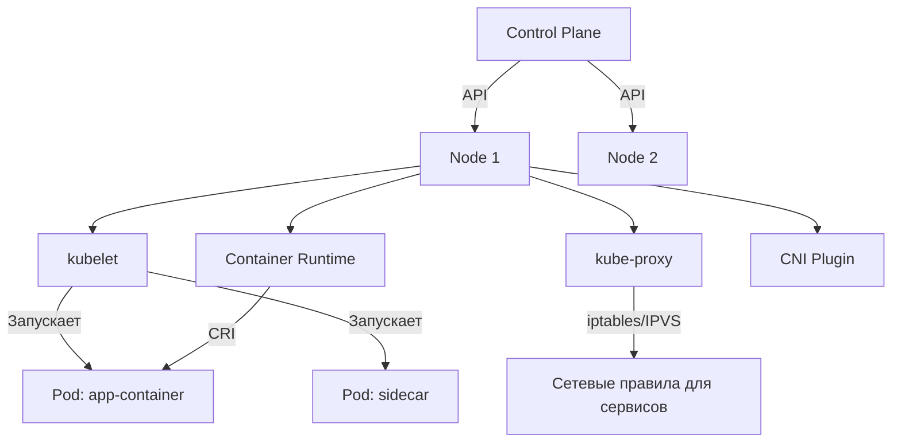

>Узлы (Nodes) — это «рабочие лошадки» кластера, где физически запускаются ваши поды. Понимание их жизненного цикла, регистрации и управления критично для эксплуатации.

# Узлы (Nodes) в Kubernetes

> 📌 **Node** = виртуальная или физическая машина, на которой запускаются поды. Управляется через `kubelet` + `kube-proxy` + runtime. Регистрация: автоматическая (предпочтительно) или ручная. Состояние отслеживается через сердечные ритмы (heartbeats) и контроллер узлов.

---

## 🔹 Что такое узел

| Аспект | Описание |
|--------|----------|
| **Определение** | Машина (ВМ или железо), на которой запускаются поды с контейнерами приложений |
| **Типы** | Виртуальная машина (cloud/on-prem), физический сервер, иногда edge-устройство |
| **Компоненты на ноде** | `kubelet`, `kube-proxy`, Container Runtime (`containerd`/`CRI-O`), сетевые плагины (CNI) |
| **Управление** | Контролируется плоскостью управления (Control Plane), но компоненты работают локально на ноде |



> 💡 **Ключевая идея**: узел — это не просто «сервер», а управляемый агент (`kubelet`), который докладывает в Control Plane и выполняет его команды.

---

## 🔹 Регистрация узлов: два подхода

### 🔄 Саморегистрация (предпочтительный способ)

`kubelet` сам регистрирует ноду при запуске (флаг `--register-node=true` по умолчанию).

#### 🔧 Ключевые флаги kubelet для регистрации

| Флаг | Назначение | Пример / Примечание |
|------|-----------|-------------------|
| `--kubeconfig` | Путь к учетным данным для аутентификации на API Server | `/var/lib/kubelet/kubeconfig` |
| `--cloud-provider` | Интеграция с облачным провайдером для чтения метаданных | `aws`, `gce`, `external` |
| `--register-node` | Включить/выключить саморегистрацию | `true` (по умолчанию) |
| `--register-with-taints` | Зарегистрировать ноду с указанными тейнтами | `key=value:NoSchedule` |
| `--node-ip` | Явно указать IP-адрес узла (для multi-IP или dual-stack) | `192.168.1.10` или `2001:db8::1` |
| `--node-labels` | Добавить метки при регистрации | `tier=backend,ssd=true` |
| `--node-status-update-frequency` | Как часто отправлять статус в Control Plane | `10s` (по умолчанию) |

#### 📋 Процесс саморегистрации
```
1. kubelet запускается с флагом --register-node=true
2. Подключается к API Server через kubeconfig
3. Отправляет запрос на создание/обновление объекта Node с именем = hostname (или --node-name)
4. API Server проверяет:
   • Имя узла уникально и валидно (DNS subdomain)
   • kubelet аутентифицирован и авторизован (NodeRestriction admission)
5. Если проверка пройдена → узел появляется в списке, готов к планированию
```

> ⚠️ **Важно**: метки, заданные через `--node-labels`, применяются **только при регистрации**. Чтобы изменить их позже — нужно перерегистрировать ноду или редактировать объект вручную.

### ✋ Ручное управление узлами

Если `--register-node=false`, вы создаёте и управляете объектом `Node` через `kubectl`.

```bash
# Создать узел вручную
kubectl apply -f - <<EOF
apiVersion: v1
kind: Node
metadata:
  name: my-custom-node
  labels:
    node-role.kubernetes.io/worker: ""
    topology.kubernetes.io/zone: eu-west-1a
EOF

# Добавить метки к существующему узлу
kubectl label nodes my-custom-node disktype=ssd

# Пометить узел как недоступный для планирования (без удаления подов)
kubectl cordon my-custom-node

# Вернуть узел в строй
kubectl uncordon my-custom-node

# Безопасно удалить все поды с узла перед обслуживанием
kubectl drain my-custom-node --ignore-daemonsets --delete-emptydir-data
```

> 💡 **Роль узлов через метки**: 
> ```yaml
> # Добавить роль к узлу (значение игнорируется, важен ключ)
> node-role.kubernetes.io/master: ""
> node-role.kubernetes.io/worker: ""
> node-role.kubernetes.io/gpu: ""
> ```
> Эти метки используются для селекции в `nodeSelector` или `nodeAffinity`.

---

## 🔹 Уникальность имени узла

| Правило | Пояснение |
|---------|-----------|
| **Имя = идентификатор** | Два узла с одинаковым именем не могут существовать одновременно |
| **Имя должно быть валидным DNS subdomain** | RFC 1123: ≤253 символов, `[a-z0-9.-]`, начинается/заканчивается буквенно-цифровым |
| **K8s считает узел с тем же именем — тем же объектом** | Если вы перезапустили ВМ с тем же именем — K8s ожидает, что это та же нода (те же настройки, диски, сеть) |
| **Если нода существенно изменилась** | Сначала удалите старый объект `Node`, затем дайте новой ноде зарегистрироваться |

> ⚠️ **Риск**: если изменить конфигурацию ноды (метки, IP, ресурсы) без удаления объекта — могут возникнуть конфликты планирования или сетевые проблемы.

---

## 🔹 Статус узла: что отслеживает Kubernetes

```bash
kubectl describe node <node-name>
```

### 📊 Ключевые разделы статуса

| Раздел | Что показывает | Пример |
|--------|---------------|--------|
| **📍 Адреса** | IP-адреса узла (InternalIP, ExternalIP, Hostname) | `InternalIP: 10.0.1.5` |
| **❤️ Условия (Conditions)** | Состояние здоровья узла | `Ready: True`, `MemoryPressure: False` |
| **💪 Ёмкость (Capacity)** | Общие ресурсы узла | `cpu: 8, memory: 32Gi, pods: 110` |
| **📦 Allocatable** | Ресурсы, доступные для подов (за вычетом системных) | `cpu: 7800m, memory: 28Gi` |
| **🏷️ Метки (Labels)** | Пользовательские и системные метки | `kubernetes.io/os=linux`, `disktype=ssd` |
| **🚫 Тейнты (Taints)** | Ограничения на планирование | `node.kubernetes.io/not-ready:NoSchedule` |

### ❤️ Условия узла (Node Conditions)

| Условие | Значения | Описание |
|---------|----------|----------|
| `Ready` | `True`/`False`/`Unknown` | Узел готов принимать поды (`True` = здоров) |
| `MemoryPressure` | `True`/`False`/`Unknown` | Нехватка памяти на ноде |
| `DiskPressure` | `True`/`False`/`Unknown` | Нехватка места на диске |
| `PIDPressure` | `True`/`False`/`Unknown` | Слишком много процессов |
| `NetworkUnavailable` | `True`/`False`/`Unknown` | Проблемы с сетевым плагином (CNI) |

> 💡 **Автоматические тейнты**: при проблемах K8s добавляет тейнты, чтобы планировщик не размещал новые поды:
> - `node.kubernetes.io/not-ready:NoSchedule` — узел не Ready
> - `node.kubernetes.io/unreachable:NoExecute` — узел недоступен (поды будут эвиктед)

---

## 🔹 Сердцебиение узлов (Heartbeats)

Kubernetes использует два механизма для отслеживания доступности узлов:

### 1️⃣ Обновления `.status` узла
- `kubelet` периодически (по умолчанию каждые `10s`) отправляет полный статус узла в API Server
- Включает: условия, ёмкость, адреса, образы, системную информацию
- **Минус**: большой объём данных, нагрузка на etcd при большом числе нод

### 2️⃣ Объекты `Lease` в `kube-node-lease` (предпочтительный способ)
```yaml
# Пример Lease-объекта (упрощённо)
apiVersion: coordination.k8s.io/v1
kind: Lease
metadata:
  name: my-node
  namespace: kube-node-lease
spec:
  renewTime: "2024-06-05T12:00:00Z"  # ← обновляется kubelet'ом
```
- Легковесный объект, обновляется каждые `10s` (настраивается через `--node-lease-duration`)
- Только «пульс»: если не обновляется → узел считается недоступным
- **Плюс**: значительно снижает нагрузку на etcd

> 💡 **Настройка**: 
> ```bash
> # В kube-controller-manager:
> --node-monitor-period=5s          # как часто проверять статус нод
> --node-monitor-grace-period=40s   # сколько ждать до пометки узла как Unknown
> --pod-eviction-timeout=5m         # через сколько начать эвикшн подов с недоступного узла
> ```

---

## 🔹 Контроллер узлов (Node Controller)

Компонент Control Plane, управляющий жизненным циклом узлов.

### 🎯 Основные задачи

| Задача | Описание |
|--------|----------|
| **🔢 Назначение CIDR** | Если включено `--allocate-node-cidrs`, выделяет подсеть для подов на ноде |
| **📋 Синхронизация с облаком** | Сверяет список нод с облачным провайдером; удаляет из списка несуществующие ВМ |
| **❤️ Мониторинг здоровья** | Отслеживает `Ready`/`Unknown` условия; помечает узлы как недоступные |
| **🚪 Эвикшн подов** | Если узел недоступен > `--pod-eviction-timeout` — инициирует удаление подов с него |
| **🏷️ Управление тейнтами/метками** | Добавляет автоматические тейнты (`not-ready`, `unreachable`) при проблемах |

### 🚨 Эвикшн: защита от каскадных сбоев

Контроллер узлов ограничивает скорость удаления подов, чтобы не перегрузить кластер при массовом сбое.

#### 📊 Параметры эвикшна (по умолчанию)

| Параметр | Значение | Назначение |
|----------|----------|-----------|
| `--node-eviction-rate` | `0.1` (1 под / 10 сек) | Макс. скорость эвикшна в «нормальном» режиме |
| `--secondary-node-eviction-rate` | `0.01` (1 под / 100 сек) | Скорость при проблемах в зоне доступности |
| `--unhealthy-zone-threshold` | `0.55` (55%) | Если >55% нод в зоне нездоровы — включается «щадящий» режим |
| `--large-cluster-size-threshold` | `50` | Если нод ≤50 и зона «упала» — эвикшн приостанавливается полностью |

#### 🌍 Зональная осведомлённость
```
Сценарий: в зоне eu-west-1a упало 60% нод

1. Контроллер видит: доля нездоровых нод в зоне > --unhealthy-zone-threshold (55%)
2. Включает «щадящий» режим:
   • Если кластер маленький (≤50 нод) → эвикшн приостанавливается
   • Если кластер большой → скорость снижается до --secondary-node-eviction-rate
3. Цель: не «добить» оставшиеся ноды в зоне, если проблема в сетевом разделении (split-brain)

Если же упала вся зона, но другие зоны здоровы:
→ эвикшн идёт с нормальной скоростью, чтобы перенести нагрузку на здоровые зоны
```

> 💡 **Практика**: настраивайте эти параметры под свою инфраструктуру. В multi-zone кластерах зональная логика критична для устойчивости.

---

## 🔹 Отслеживание ресурсов: Capacity vs Allocatable

| Понятие | Описание | Пример |
|---------|----------|--------|
| **Capacity** | Физические ресурсы узла (всё, что есть) | `cpu: 8, memory: 32Gi` |
| **Allocatable** | Ресурсы, доступные для подов (Capacity − системные резервы) | `cpu: 7800m, memory: 28Gi` |

### 🔧 Как резервируются ресурсы
```
Allocatable = Capacity − (kube-reserved + system-reserved + eviction-threshold)

• kube-reserved: ресурсы для компонентов K8s (kubelet, container runtime)
• system-reserved: ресурсы для ОС и системных демонов (sshd, journald)
• eviction-threshold: буфер, при достижении которого начинаются эвикшны подов
```

### 📋 Настройка резервирования (в конфиге kubelet)
```yaml
# /var/lib/kubelet/config.yaml
kubeReserved:
  cpu: "500m"
  memory: "1Gi"
  ephemeral-storage: "2Gi"
systemReserved:
  cpu: "200m"
  memory: "512Mi"
evictionHard:
  memory.available: "500Mi"
  nodefs.available: "10%"
```

> 💡 **Проверка**: 
> ```bash
> # Посмотреть allocatable ресурсы узла
> kubectl describe node my-node | grep -A10 'Allocated resources'
> 
> # Или через jsonpath
> kubectl get node my-node -o jsonpath='{.status.allocatable}'
> ```

---

## 🔹 Топология узлов (Topology Manager)

> 🧩 **Статус**: стабильно с K8s 1.27

Позволяет `kubelet` учитывать топологию оборудования (NUMA, GPU, NIC) при распределении ресурсов подам.

### 🔧 Включение и настройка
```bash
# В kubelet:
--feature-gates=TopologyManager=true
--topology-manager-policy=best-effort  # или restricted, single-numa-node, none
```

### 📊 Политики управления топологией

| Политика | Описание | Когда использовать |
|----------|----------|-------------------|
| `none` | Топология не учитывается (по умолчанию) | Стандартные приложения без требований к локальности |
| `best-effort` | Пытается удовлетворить топологические предпочтения, но не блокирует запуск | Приложения, которые выигрывают от локальности, но могут работать и без |
| `restricted` | Требует, чтобы все контейнеры в поде согласовали топологию; иначе под не запустится | Приложения с жёсткими требованиями к NUMA/GPU |
| `single-numa-node` | Все ресурсы пода должны быть выделены в рамках одного NUMA-узла | Высокопроизводительные нагрузки (HPC, ML, базы данных) |

> 💡 **Пример**: под с запросом 2 CPU + 1 GPU на ноде с 2 NUMA-узлами:
> - `single-numa-node`: под запустится только если и CPU, и GPU доступны в одном NUMA-узле
> - `best-effort`: запустится, но может получить ресурсы из разных узлов (ниже производительность)

---

## 🔹 Чек-лист: управление узлами

```bash
# ✅ При добавлении новой ноды:
# • Убедись, что kubelet настроен с --register-node=true (предпочтительно)
# • Проверь, что метки и тейнты заданы корректно
# • Дождись, пока узел перейдёт в статус Ready

# ✅ Проверка здоровья узла
kubectl get nodes -o wide
kubectl describe node <name> | grep -E 'Conditions:|MemoryPressure|DiskPressure'

# ✅ Мониторинг сердечных ритмов
# (через Lease-объекты)
kubectl get lease -n kube-node-lease | grep <node-name>

# ✅ Безопасное обслуживание узла
kubectl cordon <node>                    # запретить планирование новых подов
kubectl drain <node> --ignore-daemonsets --delete-emptydir-data  # эвиктнуть существующие
# ... выполнить обслуживание ...
kubectl uncordon <node>                  # вернуть узел в строй

# ✅ Проверка ресурсов: хватит ли места для новых подов?
kubectl describe node <name> | grep -A20 'Allocated resources'
kubectl top node <name>                  # требует Metrics Server

# ✅ Отладка проблем с регистрацией
# • Проверь логи kubelet: journalctl -u kubelet -f
# • Убедись, что время на ноде синхронизировано (heartbeats чувствительны к дрифту)
# • Проверь сетевую связность с API Server

# ✅ При замене ноды (например, после апгрейда железа):
# 1. kubectl drain <old-node> ...
# 2. kubectl delete node <old-node>
# 3. Запусти новую ноду с тем же или новым именем
# 4. Дождись регистрации и перехода в Ready

# ❌ Не редактируй напрямую поля .status узла — они управляются kubelet'ом
# ❌ Не меняй имя ноды «на лету» — это приведёт к созданию дубликата
# ❌ Не игнорируй тейнты NotReady/Unreachable — они защищают от планирования на проблемные ноды
```

> 💡 **Совет для конспекта**:
> 1. Создай файл `00_nodes_inventory.md` с таблицей: «Нода → Роль → Зона → Ресурсы → Статус».
> 2. Добавь блок «Процедура обслуживания ноды»: пошаговый чек-лист для `cordon`/`drain`/`uncordon`.
> 3. Веди заметку «Параметры kubelet»: какие флаги и конфиги используются в твоём кластере.

---

## 🔹 Ключевые выводы

1. **Саморегистрация — стандарт**: пусть `kubelet` сам регистрирует ноду, это надёжнее и проще.
2. **Имя узла = идентификатор**: меняй конфигурацию осознанно; при серьёзных изменениях — удаляй и перерегистрируй.
3. **Heartbeats через Lease**: предпочитай легковесные `Lease`-объекты для масштабных кластеров.
4. **Node Controller — защитник**: он эвиктит поды с недоступных нод, но делает это с ограничением скорости, чтобы не усугубить сбой.
5. **Allocatable ≠ Capacity**: планировщик учитывает только `allocatable` ресурсы; резервируй место для системы через `kubeReserved`/`systemReserved`.
6. **Топология — для высоких нагрузок**: включай `TopologyManager`, если твои приложения чувствительны к NUMA/GPU-локальности.