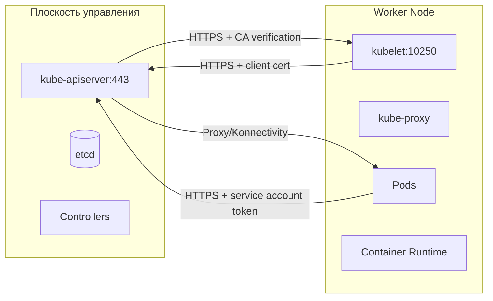

>Взаимодействие между узлами и плоскостью управления — критически важная тема для безопасности и надёжности кластера, особенно в облачных или ненадёжных сетях.

# Взаимодействие узлов и плоскости управления (Network Security)

> 📌 Все коммуникации в K8s строятся по принципу **центр-периферия**: 
> всё сходится на `kube-apiserver`. 
> Направление **узел → контроль** защищено по умолчанию (TLS + токены). Направление **контроль → узел** требует дополнительной настройки (сертификаты, Konnectivity) для работы в ненадёжных сетях.

---

## 🔹 Архитектура коммуникаций: центр-периферия



### 🎯 Ключевой принцип
> **Все запросы заканчиваются на `kube-apiserver`**. Ни `etcd`, ни контроллеры, ни `kubelet` не должны быть доступны извне напрямую.

---

## 🔹 Направление 1: Узел → Плоскость управления ✅ Защищено по умолчанию

### Кто инициирует соединение
| Источник | Цель | Для чего | Как аутентифицируется |
|----------|------|----------|---------------------|
| **`kubelet`** | `kube-apiserver:443` | Отчёт о статусе, получение spec подов, события | Клиентский сертификат (`--kubeconfig`) |
| **Поды (приложения)** | `kube-apiserver:443` | Watch за ресурсами, кастомные контроллеры | ServiceAccount token (монтируется в `/var/run/secrets/kubernetes.io/serviceaccount`) |
| **`kube-proxy`** | `kube-apiserver:443` | Получение правил для сервисов (Endpoints, Services) | Клиентский сертификат или токен |

### 🔐 Механизмы защиты (работают из коробки)

```yaml
# 1. TLS-шифрование
# • API Server слушает только HTTPS (порт 443)
# • Узлы должны доверять корневому сертификату кластера

# 2. Аутентификация клиентов
# • kubelet: клиентский сертификат (X.509)
# • Поды: ServiceAccount JWT-токен

# 3. Авторизация
# • RBAC: kubelet имеет право только на свои объекты
# • NodeRestriction admission: kubelet может менять только свой собственный объект Node

# 4. Автоматическая инъекция доверия в поды
# При создании пода Kubernetes автоматически монтирует:
spec:
  volumes:
  - name: kube-api-access
    projected:
      sources:
      - serviceAccountToken: { path: "token", expirationSeconds: 3607 }
      - configMap: { name: "kube-root-ca.crt", items: [{ key: "ca.crt", path: "ca.crt" }] }
      - downwardAPI: { items: [{ path: "namespace", fieldRef: { fieldPath: "metadata.namespace" } }] }
```

### 🔧 Настройка kubelet для безопасного подключения
```bash
# Обязательные флаги (обычно задаются при установке)
--kubeconfig=/var/lib/kubelet/kubeconfig    # Путь к учетным данным
--cert-dir=/var/lib/kubelet/pki             # Где хранить сертификаты
--rotate-certificates=true                  # Авто-ротация клиентских сертификатов
--server-ca-file=/etc/kubernetes/pki/ca.crt # Доверенный корневой сертификат

# Рекомендуемые флаги безопасности
--authorization-mode=Webhook                # Авторизация через API Server (не всегда Allow)
--anonymous-auth=false                      # Запретить анонимные запросы к kubelet API
--client-ca-file=/etc/kubernetes/pki/ca.crt # CA для проверки клиентских сертификатов
```

> 💡 **TLS Bootstrap**: для автоматической выдачи сертификатов новым нодам используй [kubelet TLS bootstrap](https://kubernetes.io/docs/reference/access-authn-authz/kubelet-tls-bootstrapping/) — не нужно вручную генерировать сертификаты для каждой ноды.

---

## 🔹 Направление 2: Плоскость управления → Узел ⚠️ Требует настройки

Здесь возможны уязвимости, если кластер работает в публичной или ненадёжной сети.

### 📡 Канал 1: API Server → kubelet

#### Для чего используется
| Функция | Пример команды | Зачем нужно |
|---------|---------------|-------------|
| **Логи подов** | `kubectl logs my-pod` | Чтение stdout/stderr контейнеров |
| **Attach к контейнеру** | `kubectl exec -it my-pod -- /bin/bash` | Интерактивная отладка |
| **Port-forward** | `kubectl port-forward my-pod 8080:80` | Доступ к порту пода через localhost |
| **Метрики kubelet** | `GET /metrics/cadvisor` | Сбор метрик ресурсов (через Metrics Server) |

#### 🔐 Проблема по умолчанию
```
Без дополнительной настройки:
• API Server подключается к kubelet:10250 по HTTPS
• Но НЕ проверяет сертификат kubelet (InsecureSkipVerify)
→ Уязвимость к MITM-атаке в публичной сети!
```

#### ✅ Решение: проверка сертификата kubelet
```bash
# На API Server (kube-apiserver флаг):
--kubelet-certificate-authority=/etc/kubernetes/pki/ca.crt

# Что это даёт:
# • API Server будет проверять, что сертификат kubelet подписан доверенным CA
# • Проверяет CN/O: сертификат должен быть выдан на имя узла
# • Защита от поддельных нод в публичной сети
```

#### 🔧 Дополнительно: аутентификация и авторизация на kubelet
```bash
# На каждой ноде (kubelet флаги или конфиг):
--authentication-token-webhook=true    # Проверка токенов через API Server
--authorization-mode=Webhook           # Авторизация через RBAC

# Пример RBAC: кто может читать логи
kubectl create clusterrole pod-log-reader --verb=get --resource=pods/log
kubectl create clusterrolebinding pod-log-reader-binding \
  --clusterrole=pod-log-reader \
  --user=system:serviceaccount:monitoring:prometheus
```

---

### 📡 Канал 2: API Server → узлы/поды/сервисы через прокси

#### Как работает
```
Запрос: GET /api/v1/nodes/<node-name>/proxy/metrics
→ API Server проксирует запрос на http(s)://<node-ip>:<port>/metrics
```

#### ⚠️ Ограничения безопасности по умолчанию
| Аспект | Поведение по умолчанию | Риск |
|--------|----------------------|------|
| **Протокол** | HTTP (если не указан `https:` в префиксе) | Трафик не шифруется |
| **Проверка сертификата** | Не проверяется даже при `https:` | Возможна подмена узла |
| **Передача учетных данных** | Не передаётся | Узел не знает, кто инициировал запрос |

#### ✅ Как усилить защиту
```bash
# 1. Всегда используй https: в URL прокси
kubectl get --raw /https:node1:10250/metrics

# 2. Настрой проверку сертификатов на стороне API Server
# (через --kubelet-certificate-authority, как выше)

# 3. Ограничь доступ к прокси через RBAC
# Запрети обычным пользователям доступ к /proxy/* эндпоинтам
```

> 💡 **Практика**: избегай прямого использования `/proxy/*` в production. Используй `kubectl port-forward`, `kubectl exec` или настрой Ingress/Service для доступа к приложениям.

---

## 🔹 Защита каналов: SSH-туннели (устарело) и Konnectivity (рекомендуется)

### ❌ SSH-туннели (deprecated)

```
Как работало:
• При старте API Server устанавливал SSH-соединение к каждой ноде (порт 22)
• Весь трафик к kubelet/подам шёл через этот туннель
• Требовал: SSH-ключи на всех нодах, доступ к порту 22

Почему устарело:
• Сложность масштабирования (N туннелей от API Server)
• Управление ключами — операционная нагрузка
• Нет встроенного мониторинга/аудита туннелей
```

> ⚠️ **Не используй SSH-туннели в новых кластерах**. Поддержка может быть удалена в будущих версиях.

### ✅ Konnectivity Service (рекомендуемая замена)

> 🧩 **Статус**: beta с K8s 1.18, production-ready в большинстве дистрибутивов

#### 🏗️ Архитектура

```
Плоскость управления:
┌─────────────────┐
│ Konnectivity    │
│ Server          │ ← Слушает внутри Control Plane сети
│ (порт 8132)     │
└────────┬────────┘
         │
         ▼
Worker Nodes (через публичную/ненадёжную сеть):
┌─────────────────┐
│ Konnectivity    │
│ Agent (DaemonSet)│ ← Инициирует ИСХОДЯЩЕЕ соединение к серверу
└────────┬────────┘
         │
         ▼
    ┌──────────┐
    │ kubelet  │
    │ pods     │ ← Трафик от API Server идёт через агент
    └──────────┘
```

#### 🔑 Ключевые преимущества
| Преимущество | Описание |
|-------------|----------|
| **Исходящие соединения** | Агенты сами подключаются к серверу → не нужно открывать порты на нодах |
| **Единая точка входа** | Весь трафик Control Plane → Node идёт через один прокси |
| **Аутентификация** | mTLS между сервером и агентами |
| **Аудит** | Логи всех проксированных соединений |
| **Масштабируемость** | Поддерживает тысячи нод без линейного роста нагрузки на API Server |

#### 🔧 Базовая настройка (упрощённо)

```yaml
# 1. Установить Konnectivity Server в Control Plane
# (обычно через Helm или manifests в /etc/kubernetes/manifests)

# 2. Развернуть Konnectivity Agent как DaemonSet на нодах
apiVersion: apps/v1
kind: DaemonSet
metadata:
  name: konnectivity-agent
  namespace: kube-system
spec:
  template:
    spec:
      containers:
      - name: agent
        image: registry.k8s.io/kas-network-proxy/proxy-agent:v0.1.4
        args:
        - --logtostderr=true
        - --ca-cert=/var/run/secrets/kubernetes.io/serviceaccount/ca.crt
        - --proxy-server-host=konnectivity-server.kube-system.svc.cluster.local
        - --proxy-server-port=8132
        - --agent-identifiers=host=${NODE_NAME}
        - --sync-interval=5s
        volumeMounts:
        - name: service-account-token
          mountPath: /var/run/secrets/kubernetes.io/serviceaccount
      volumes:
      - name: service-account-token
        projected:
          sources:
          - serviceAccountToken:
              path: token
              audience: system:konnectivity-server
              expirationSeconds: 3600
          - configMap:
              name: kube-root-ca.crt
              items: [{ key: ca.crt, path: ca.crt }]

# 3. Настроить API Server использовать Konnectivity
# Флаг: --enable-aggregator-routing=true
# И конфигурация proxy-client сертификатов
```

> 📚 **Документация**: [Konnectivity Service](https://kubernetes.io/docs/tasks/extend-kubernetes/setup-konnectivity/)

---

## 🔹 Чек-лист: безопасная настройка коммуникаций

### ✅ Для направления Узел → Контроль (обычно уже настроено)
```bash
# Проверить, что kubelet использует TLS
kubectl get --raw /api/v1/nodes/<node>/proxy/metrics --insecure-skip-tls-verify 2>&1 | grep -q "certificate" && echo "⚠️ Проверка сертификатов отключена"

# Убедиться, что анонимная аутентификация на kubelet отключена
# (проверить конфиг /var/lib/kubelet/config.yaml или флаги)
grep "anonymous-auth" /var/lib/kubelet/kubelet.conf

# Проверить ротацию сертификатов
ls -la /var/lib/kubelet/pki/kubelet-client-*.pem
```

### ✅ Для направления Контроль → Узел (требует внимания)
```bash
# 1. Включить проверку сертификатов kubelet на API Server
# В манифесте kube-apiserver (обычно /etc/kubernetes/manifests/kube-apiserver.yaml):
spec:
  containers:
  - command:
    - kube-apiserver
    - --kubelet-certificate-authority=/etc/kubernetes/pki/ca.crt

# 2. Проверить, что у kubelet валидный серверный сертификат
openssl x509 -in /var/lib/kubelet/pki/kubelet.crt -text -noout | grep -E 'Subject:|Issuer:'

# 3. Если используешь публичные сети — настрой Konnectivity
# Проверить статус агентов:
kubectl get pods -n kube-system -l k8s-app=konnectivity-agent

# 4. Протестировать подключение через прокси
kubectl get --raw /api/v1/nodes/<node>/proxy/metrics | head -5
```

### ✅ Общие меры безопасности
```bash
# Ограничить доступ к портам плоскости управления (фаервол)
# Разрешить только:
# • 443 (API Server) — из доверенных сетей / балансировщика
# • 2379-2380 (etcd) — ТОЛЬКО из Control Plane нод
# • 10250 (kubelet) — ТОЛЬКО из API Server / Konnectivity

# Включить аудит API Server
--audit-log-path=/var/log/kubernetes/audit.log
--audit-policy-file=/etc/kubernetes/audit-policy.yaml

# Регулярно ротировать сертификаты
# (используй kubeadm certs renew или автоматизацию через cert-manager)
```

### ❌ Чего избегать
```bash
# ❌ Не открывай порт 10250 (kubelet) в публичный интернет
# ❌ Не отключай --anonymous-auth=false на kubelet в production
# ❌ Не используй --insecure-port на API Server (устарел и удалён в 1.20+)
# ❌ Не передавай секреты через аннотации/метки — они видны в API
# ❌ Не полагайся на "скрытность портов" как на защиту
```

---

## 🔹 Отладка проблем с коммуникациями

```bash
# 1. Проверить связность узла с API Server
# На ноде:
curl -k -v https://<api-server>:443/healthz
# Должен вернуть: ok

# 2. Проверить сертификаты kubelet
openssl s_client -connect localhost:10250 -CAfile /etc/kubernetes/pki/ca.crt

# 3. Посмотреть логи kubelet на предмет ошибок аутентификации
journalctl -u kubelet -f | grep -i "auth\|certificate\|forbidden"

# 4. Проверить, может ли API Server подключиться к kubelet
# С ноды Control Plane:
curl -k -v --cert /etc/kubernetes/pki/apiserver-kubelet-client.crt \
     --key /etc/kubernetes/pki/apiserver-kubelet-client.key \
     https://<worker-node>:10250/metrics

# 5. Если используешь Konnectivity — проверить туннели
kubectl logs -n kube-system -l k8s-app=konnectivity-agent | grep -i "connected\|error"

# 6. Проверить RBAC для сервисных аккаунтов
kubectl auth can-i get pods/log --as=system:serviceaccount:monitoring:prometheus
```

> 💡 **Совет для конспекта**:
> 1. Создай файл `00_network_security_checklist.md` с этим чек-листом — запускай перед аудитом безопасности.
> 2. Добавь блок «Контакты и доступы»: кто отвечает за сертификаты, кто имеет доступ к портам управления.
> 3. Веди заметку «Инциденты»: какие проблемы с коммуникациями возникали и как решались.

---

## 🔹 Ключевые выводы

1. **Центр-периферия**: все запросы сходятся на `kube-apiserver` — это упрощает защиту (одна точка входа).
2. **Узел → Контроль**: защищено по умолчанию (TLS + client certs + ServiceAccount tokens).
3. **Контроль → Узел**: требует явной настройки (`--kubelet-certificate-authority`, Konnectivity) для работы в ненадёжных сетях.
4. **Konnectivity > SSH-туннели**: используй современный прокси-сервис для исходящих соединений от агентов.
5. **RBAC + аудит**: даже с шифрованием, контролируй, *кто* и *что* может делать через API.
6. **Регулярная ротация**: сертификаты и токены имеют срок жизни — автоматизируй их обновление.