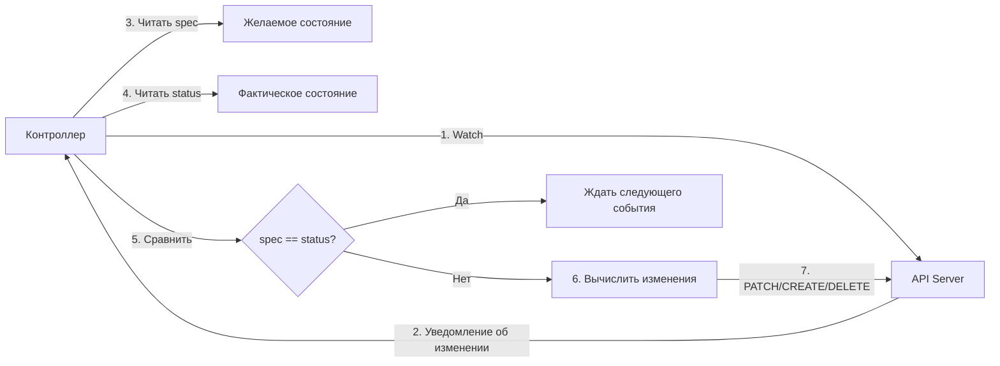

>Контроллеры — это «мозг» Kubernetes, реализующий принцип самовосстановления через бесконечные циклы согласования (reconciliation loops).


# Контроллеры в Kubernetes — Принцип самовосстановления

> 📌 **Контроллер** = бесконечный цикл «наблюдай → сравнивай → действуй». Он следит за ресурсами, сравнивает *желаемое состояние* (`spec`) с *фактическим* (`status`) и вносит минимальные изменения, чтобы сблизить их. Это основа отказоустойчивости K8s.

---

## 🔹 Аналогия: термостат

Чтобы понять контроллеры, представь **термостат в комнате**:

```
Желаемое состояние (spec):   температура = 22°C
Текущее состояние (status):  температура = 19°C

Цикл работы:
1. Наблюдает: измеряет текущую температуру
2. Сравнивает: 19°C ≠ 22°C → есть расхождение
3. Действует: включает обогрев
4. Повторяет: через 30 секунд снова проверяет

Когда 22°C достигнуто → термостат «засыпает» до следующего изменения.
```

### 🎯 Переносим на Kubernetes

| Термостат | Kubernetes |
|-----------|-----------|
| Желаемая температура | `spec.replicas: 3` в Deployment |
| Текущая температура | `status.availableReplicas: 1` |
| Включение обогрева | Создание 2 новых подов через API Server |
| Цикл проверки | **Reconciliation Loop** контроллера |

> 💡 **Ключевая идея**: контроллер не «выполняет скрипт» (сделай A → B → C). Он постоянно задаёт вопрос: *«Соответствует ли реальность желаемому? Если нет — что минимальное я могу сделать, чтобы исправить?»*

---

## 🔹 Архитектура контроллера: шаблон



### 📋 Базовый псевдокод контроллера
```go
for {
    desired := getResourceSpec()      // Что хотим?
    current := getResourceStatus()    // Что имеем?
    
    if desired != current {
        changes := calculateDiff(desired, current)
        applyChanges(changes)         // Через API Server!
    }
    
    sleep(reconcilePeriod)            // Или ждать events через watch
}
```

> ⚠️ **Важно**: контроллеры **не управляют напрямую** подами/нодами. Они отправляют запросы в **API Server**, который уже валидирует, авторизует и применяет изменения.

---

## 🔹 Как контроллеры взаимодействуют с API Server

### 🔁 Пример: Job Controller

```yaml
# Пользователь создаёт Job
apiVersion: batch/v1
kind: Job
metadata:
  name: data-processing
spec:
  completions: 3          # ← Желаемое: 3 успешно завершённых пода
  parallelism: 2          # ← Не более 2 подов одновременно
  template: { ... }       # ← Шаблон пода
```

```
Цикл работы контроллера:

1. Видит новый Job через watch-стрим
2. Читает spec: нужно 3 успешных выполнения
3. Проверяет текущие поды с label job-name=data-processing
4. Видит: запущено 0, завершено 0 → нужно создать поды
5. Отправляет в API Server: создать 2 пода (parallelism: 2)
6. Ждёт событий: поды завершили работу?
7. Когда 3 пода успешно завершены → обновляет статус Job:
   status: { succeeded: 3, completionTime: "..." }
8. Больше действий не требуется → ждёт следующих изменений
```

### 🔑 Ключевые принципы

| Принцип | Описание | Пример |
|---------|----------|--------|
| **📡 Только через API Server** | Контроллер не создаёт поды напрямую — только через `POST /api/v1/pods` | Job Controller → API Server → Scheduler → kubelet |
| **🏷️ Селекция по меткам** | Контроллеры используют `selector.matchLabels`, чтобы отличать «свои» ресурсы | Deployment управляет только подами с `pod-template-hash=abc123` |
| **✏️ Обновление статуса** | После выполнения работы контроллер обновляет `.status` объекта | `Job.status.succeeded: 3` |
| **🔁 Идемпотентность** | Повторное применение одной и той же логики не ломает систему | Если под уже создан — контроллер не создаст дубликат |

---

## 🔹 Прямой контроль: работа с внешними системами

Не все контроллеры ограничиваются внутренними ресурсами K8s.

### 🌐 Пример: Cluster Autoscaler

```
Желаемое состояние: "Достаточно узлов для всех подов"
Текущее состояние: "5 узлов, 3 пода в Pending из-за нехватки ресурсов"

Действия контроллера:
1. Видит через API Server: поды не могут быть запланированы
2. Обращается к облачному провайдеру (AWS/GCP API)
3. Создаёт новую виртуальную машину
4. Ждёт, пока нода зарегистрируется в K8s
5. Обновляет внутренний кэш: теперь есть свободные ресурсы
6. Планировщик видит ресурсы → размещает ожидающие поды
```

### 🔄 Поток данных с внешними системами

```
┌─────────────────┐
│   Контроллер    │
│ (Autoscaler)    │
└────┬────┬──────┘
     │    │
     │    ▼
     │  ┌─────────────┐
     │  │ Внешняя     │
     │  │ система     │
     │  │ (Cloud API) │
     │  └────┬────────┘
     │       │
     ▼       ▼
┌─────────────────┐
│   API Server    │
│ (обновление     │
│  статуса ноды)  │
└────┬────────────┘
     │
     ▼
┌─────────────────┐
│ Другие          │
│ контроллеры     │
│ (Scheduler)     │
└─────────────────┘
```

> 💡 **Важно**: даже при работе с внешними системами, контроллер **обязательно обновляет статус в API Server** — чтобы другие контроллеры видели изменения.

---

## 🔹 Желаемое ≠ Текущее: философия «постоянного изменения»

Kubernetes принимает, что **кластер никогда не бывает полностью стабильным**.

### 🎯 Почему это нормально

| Сценарий | Что происходит | Как реагируют контроллеры |
|----------|---------------|--------------------------|
| **🔥 Сбой ноды** | `status.conditions: Ready=False` | Node Controller эвиктит поды; Deployment пересоздаёт их на других нодах |
| **📈 Скачок нагрузки** | `status.availableReplicas < spec.replicas` | ReplicaSet создаёт новые поды; HPA может масштабировать сам Deployment |
| **🔄 Обновление образа** | `spec.template.spec.containers[0].image` изменён | RollingUpdate контроллер постепенно заменяет старые поды на новые |
| **🧹 Ручное удаление пода** | Под удалён пользователем | Контроллер видит: `desired=3, actual=2` → создаёт новый |

### 🧩 Ключевой вывод
```
Не важно, достиг ли кластер «стабильного состояния».
Важно, что контроллеры работают и способны вносить полезные изменения.
```

> 💡 **Практика**: не пытайся «зафиксировать» кластер. Проектируй приложения так, чтобы они корректно работали при постоянных изменениях (идемпотентность, готовность к рестарту, проверка зависимостей при старте).

---

## 🔹 Дизайн: множество простых контроллеров

Kubernetes избегает монолитных контроллеров в пользу **множества специализированных**.

### 🏗️ Пример: кто создаёт поды?

| Контроллер | Управляет | Создаёт поды для | Как отличает «свои» поды |
|-----------|-----------|----------------|-------------------------|
| **Deployment Controller** | `Deployment` | Реплика приложения | `pod-template-hash=<unique>` |
| **Job Controller** | `Job` | Одноразовые задачи | `job-name=<job-name>` |
| **DaemonSet Controller** | `DaemonSet` | Системные агенты на каждой ноде | `controller-uid=<daemonset-uid>` |
| **StatefulSet Controller** | `StatefulSet` | Stateful-приложения с идентичностью | `controller-revision-hash=<hash>` |

### ✅ Преимущества такого подхода

| Преимущество | Описание |
|-------------|----------|
| **🔧 Проще отлаживать** | Сбой в Job Controller не влияет на Deployment |
| **📦 Легче тестировать** | Можно запускать контроллеры изолированно |
| **🔄 Гибче расширять** | Новый контроллер = новый CRD + логика, без правки ядра |
| **🛡️ Отказоустойчивость** | Если один контроллер упал — другие продолжают работать |

> ⚠️ **Важно**: контроллеры координируются через **метки и ownerReferences**, чтобы не конфликтовать. Никогда не создавай поды вручную с метками, которые использует контроллер — это сломает логику управления.

---

## 🔹 Типы контроллеров в Kubernetes

### 🏛️ Встроенные контроллеры (в `kube-controller-manager`)

| Контроллер | Управляет | Краткое описание |
|-----------|-----------|-----------------|
| **Deployment Controller** | `Deployment` | Rolling updates, масштабирование, откаты |
| **ReplicaSet Controller** | `ReplicaSet` | Поддержание заданного количества реплик подов |
| **Job Controller** | `Job` | Запуск подов для одноразовых задач до завершения |
| **CronJob Controller** | `CronJob` | Планирование Job'ов по расписанию (как cron) |
| **DaemonSet Controller** | `DaemonSet` | Запуск пода на каждой (или выбранных) нодах |
| **StatefulSet Controller** | `StatefulSet` | Stateful-приложения с устойчивой идентичностью и порядком |
| **Node Controller** | `Node` | Мониторинг здоровья нод, эвикшн при сбоях |
| **EndpointSlice Controller** | `Service`/`EndpointSlice` | Поддержание связи «сервис → поды» для балансировки |
| **PV/PVC Controller** | `PersistentVolumeClaim` | Динамическое выделение хранилищ (через StorageClass) |
| **ServiceAccount Controller** | `Namespace` | Создание дефолтных ServiceAccount для новых неймспейсов |

### 🧩 Пользовательские контроллеры (операторы)

```yaml
# Пример: контроллер для кастомного ресурса "Database"
apiVersion: databases.example.com/v1
kind: Database
metadata:
  name: my-postgres
spec:
  version: "15.2"
  storage: "100Gi"
  replicas: 3
```

```
Как работает оператор:
1. Слушает изменения объектов Database через watch
2. При создании нового:
   • Создаёт StatefulSet для подов БД
   • Создаёт Service для доступа
   • Инициализирует кластер (настройка репликации)
3. При изменении spec.replicas:
   • Масштабирует StatefulSet
   • Перенастраивает репликацию
4. При сбое пода:
   • Пересоздаёт его с теми же данными (через PVC)
   • Восстанавливает репликацию
```

> 📚 **Фреймворки для написания операторов**: 
> - Go: [controller-runtime](https://github.com/kubernetes-sigs/controller-runtime)
> - Python: [Kopf](https://kopf.readthedocs.io/), [PyKube](https://github.com/hjacobs/pykube)
> - Java: [Java Operator SDK](https://java-operator-sdk.github.io/)

---

## 🔹 Практика: наблюдение за контроллерами

### 🔍 Проверка работы встроенных контроллеров
```bash
# Посмотреть, какие контроллеры запущены в kube-controller-manager
kubectl get pods -n kube-system -l component=kube-controller-manager -o jsonpath='{.items[0].spec.containers[0].command}'

# Проверить лидеры контроллеров (при включённом leader election)
kubectl get endpoints -n kube-system kube-controller-manager -o yaml

# Посмотреть события, связанные с контроллерами
kubectl get events -A --field-selector reason=SuccessfulRescale  # HPA
kubectl get events -A --field-selector reason=NodeNotReady       # Node Controller
```

### 🧪 Отладка кастомного контроллера
```bash
# Проверить, видит ли контроллер ваши ресурсы
# (в логах контроллера искать "Reconciling" или "Processing")
kubectl logs -n <controller-namespace> -l app=my-operator -f

# Проверить, создаёт ли контроллер зависимые ресурсы
kubectl get all -l app.kubernetes.io/managed-by=my-operator

# Убедиться, что статус обновляется
kubectl get database my-postgres -o yaml | grep -A10 'status:'

# Проверить права доступа контроллера (частая проблема!)
kubectl auth can-i create statefulsets --as=system:serviceaccount:operators:my-operator
```

### 🔄 Тестирование reconciliation loop
```bash
# 1. Создать ресурс
kubectl apply -f my-resource.yaml

# 2. Удалить зависимый ресурс вручную (например, под)
kubectl delete pod my-resource-abc123

# 3. Подождать период реконсиляции (обычно 10-60 сек)
# 4. Проверить, что контроллер пересоздал под
kubectl get pods -l app=my-resource

# 5. Проверить события
kubectl describe myresource my-resource | grep -A5 Events
```

---

## 🔹 Чек-лист: работа с контроллерами

### ✅ При использовании встроенных контроллеров
```bash
# • Не редактируй напрямую ресурсы, управляемые контроллерами
#   (например, не меняй поды, созданные Deployment — они будут перезаписаны)

# • Для изменений используй только `spec` родительского объекта
kubectl patch deployment my-app --type merge -p '{"spec":{"replicas":5}}'

# • Отслеживай события для отладки
kubectl describe deployment my-app | grep -A10 'Events:'

# • Проверяй статус: контроллеры обновляют .status, а не только .spec
kubectl get deployment my-app -o jsonpath='{.status}'
```

### ✅ При написании своего контроллера
```bash
# • Используй watch, а не polling — это эффективнее
#   (информация об изменениях приходит сразу, не нужно опрашивать)

# • Обрабатывай ошибки с повторными попытками (exponential backoff)
#   (сеть может временно отказать, API Server может быть перегружен)

# • Обновляй статус ресурса после выполнения работы
#   (это позволяет пользователям и другим контроллерам видеть прогресс)

# • Используй конечные автоматы (state machine) для сложной логики
#   (избегай «спагетти-кода» с множеством if/else)

# • Тестируй идемпотентность: повторный запуск с теми же входными данными
#   не должен ломать систему или создавать дубликаты
```

### ✅ При отладке проблем
```bash
# 1. Проверь, запущен ли контроллер
kubectl get pods -n kube-system | grep controller-manager

# 2. Посмотри логи на предмет ошибок
kubectl logs -n kube-system -l component=kube-controller-manager | grep -i error

# 3. Проверь права доступа (RBAC)
kubectl auth can-i list deployments --as=system:serviceaccount:kube-system:generic-garbage-collector

# 4. Убедись, что финализаторы не блокируют удаление
kubectl get <resource> <name> -o jsonpath='{.metadata.finalizers}'

# 5. Проверь, не «завис» ли объект в ожидающем состоянии
kubectl get <resource> <name> -o yaml | grep -E 'status:|metadata.deletionTimestamp'
```

### ❌ Чего избегать
```bash
# ❌ Не создавай поды вручную с метками контроллера
#   → контроллер может удалить их как «неправильные» или, наоборот, не управлять ими

# ❌ Не полагайся на порядок выполнения контроллеров
#   → они работают параллельно; проектируй систему без скрытых зависимостей

# ❌ Не блокируй reconciliation loop долгими операциями
#   → выноси тяжёлую логику в асинхронные задачи или воркеры

# ❌ Не игнорируй обновления статуса
#   → пользователи и другие контроллеры не узнают о прогрессе или ошибках
```

---

## 🔹 Ключевые выводы

1. **Контроллер = reconciliation loop**: наблюдай → сравнивай → действуй → повторяй.
2. **Только через API Server**: контроллеры не управляют ресурсами напрямую, а отправляют запросы в API.
3. **Множество простых > один сложный**: специализированные контроллеры надёжнее и легче в отладке.
4. **Метки и ownerReferences — координаторы**: они предотвращают конфликты между контроллерами.
5. **Желаемое ≠ Текущее — это нормально**: кластер постоянно эволюционирует, контроллеры обеспечивают устойчивость.
6. **Пиши идемпотентные контроллеры**: повторное применение одной логики не должно ломать систему.