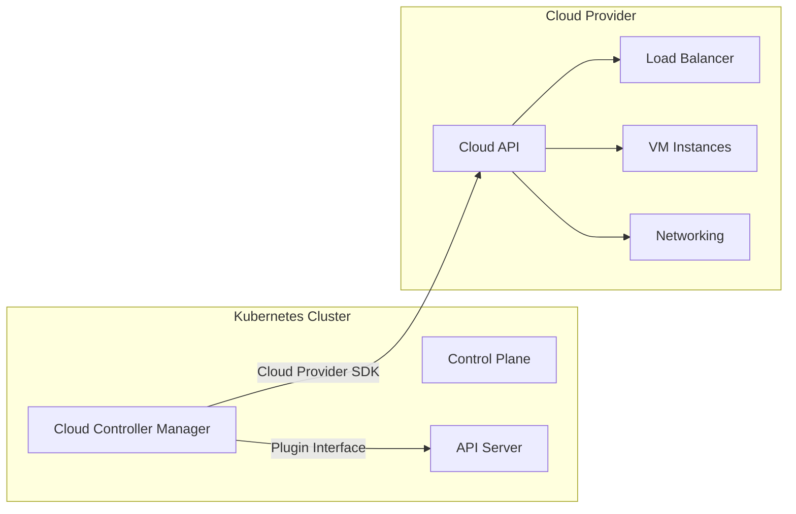

>Cloud Controller Manager (CCM) — это мост между Kubernetes и облачным провайдером, который выносит облачно-специфичную логику из ядра кластера.

# Cloud Controller Manager (CCM) — Интеграция с облаком

> 📌 **CCM** = компонент Control Plane, который содержит **только облачно-специфичную логику**. Позволяет облачным провайдерам развивать интеграцию независимо от ядра Kubernetes. Основные контроллеры: `Node`, `Route`, `Service`.

---

## 🔹 Зачем нужен CCM

| Проблема до CCM | Решение с CCM |
|----------------|-------------|
| ☁️ Облачная логика была вмонтирована в `kube-controller-manager` | 🧩 CCM вынесен в отдельный компонент с плагинами |
| 🐌 Обновления облачных функций ждали релизов K8s | 🚀 Провайдеры могут выпускать обновления CCM независимо |
| 🔗 Тесная связка: ядро + облако = сложно поддерживать | 🔌 Чёткий интерфейс: ядро ↔ CCM ↔ Cloud API |
| 🧪 Сложно тестировать облачные интеграции | 🧪 Можно запускать CCM как аддон, изолированно от плоскости управления |



> 💡 **Ключевая идея**: CCM — это «переводчик». Он превращает абстрактные запросы K8s («создай сервис типа LoadBalancer») в конкретные вызовы облачного API («создай AWS ELB с такими параметрами»).

---

## 🔹 Архитектура и дизайн

### 🏗️ Компоненты CCM

| Компонент | Где работает | Описание |
|-----------|-------------|----------|
| **🎛️ Cloud Controller Manager** | Control Plane (как реплицированный процесс) или как аддон | Запускает набор контроллеров, специфичных для облака |
| **🔌 Cloud Provider Plugin** | Внутри процесса CCM | Реализация интерфейса для конкретного провайдера (AWS, GCP, Azure, OpenStack и др.) |
| **☁️ Cloud SDK/API Client** | Внутри плагина | Библиотека для общения с облачным провайдером |

### 🔄 Режимы развёртывания

| Режим | Описание | Когда использовать |
|-------|----------|-------------------|
| **📦 Как часть Control Plane** | CCM запускается как статический под/процесс на мастер-нодах | Стандартный вариант для managed-кластеров (GKE, EKS, AKS) |
| **🧩 Как аддон в кластере** | CCM развёрнут как Deployment в `kube-system` | Для self-hosted кластеров, кастомных облаков, тестирования |
| **🔧 Внешний процесс** | CCM работает вне кластера, подключается к API Server | Для специфичных сценариев интеграции, edge-кластеров |

> ⚠️ **Важно**: если CCM не запущен — облачные функции (авто-создание балансировщиков, присвоение меток региона) **не будут работать**, но базовый K8s продолжит функционировать.

---

## 🔹 Контроллеры CCM: что они делают

### 1️⃣ 🖥️ Node Controller

> Отвечает за синхронизацию объектов `Node` в K8s с реальными виртуальными машинами в облаке.

| Задача | Как работает | Пример |
|--------|-------------|--------|
| **🆔 Идентификация узла** | При регистрации ноды: запрашивает у облака уникальный ID (instance-id) и проставляет в аннотации | `node.kubernetes.io/instance-id: i-0abc123def456` |
| **🏷️ Метки и аннотации** | Добавляет облачно-специфичные метки: регион, зона, тип инстанса, архитектура | `topology.kubernetes.io/zone=us-east-1a`, `node.kubernetes.io/instance-type=t3.medium` |
| **🌐 Сетевая информация** | Получает из облака внутренние/внешние IP, hostname | `InternalIP: 10.0.1.5`, `ExternalIP: 203.0.113.10` |
| **❤️ Проверка здоровья** | Если узел не отвечает: через Cloud API проверяет, не удалена/остановлена ли ВМ | Если ВМ удалена → удаляет объект `Node` из K8s |

```yaml
# Пример аннотаций, добавленных CCM на узел в AWS:
metadata:
  annotations:
    alpha.kubernetes.io/provided-node-ip: 10.0.1.5
    node.kubernetes.io/instance-id: i-0abc123def456
    node.kubernetes.io/instance-type: t3.medium
  labels:
    topology.kubernetes.io/region: us-east-1
    topology.kubernetes.io/zone: us-east-1a
```

### 2️⃣ 🛣️ Route Controller

> Настраивает сетевые маршруты в облаке, чтобы поды на разных нодах могли общаться.

| Задача | Как работает | Пример |
|--------|-------------|--------|
| **🗺️ Настройка маршрутов** | При добавлении ноды: создаёт маршрут в облачной сети для CIDR подов этой ноды | AWS: создаёт route в route table для `10.244.1.0/24 → i-0abc123` |
| **📦 Выделение подсетей** | В некоторых облаках: выделяет блок IP для подов на ноде | GCP: резервирует /24 из pod CIDR для новой ноды |
| **🧹 Очистка** | При удалении ноды: удаляет соответствующие маршруты в облаке | Удаляет route из AWS route table |

> 💡 **Примечание**: если используешь CNI-плагин с собственной маршрутизацией (Cilium, Calico в IPIP-режиме) — Route Controller может быть отключён.

### 3️⃣ ⚖️ Service Controller

> Интегрирует сервисы K8s с облачными балансировщиками нагрузки и сетевыми функциями.

| Задача | Как работает | Пример |
|--------|-------------|--------|
| **🔁 Создание балансировщика** | При создании `Service: type=LoadBalancer`: вызывает Cloud API для создания облачного LB | AWS: создаёт ELB/NLB, привязывает к нодам, настраивает health checks |
| **🔄 Обновление конфигурации** | При изменении сервиса (порты, annotations): обновляет конфигурацию облачного LB | Добавляет новый порт в target group AWS NLB |
| **🗑️ Удаление** | При удалении сервиса: удаляет облачный балансировщик | Удаёт ELB в AWS, освобождает статический IP |
| **🏷️ Аннотации для тонкой настройки** | Позволяет управлять параметрами LB через annotations в манифесте сервиса | `service.beta.kubernetes.io/aws-load-balancer-type: nlb` |

```yaml
# Пример сервиса с облачными аннотациями (AWS)
apiVersion: v1
kind: Service
metadata:
  name: my-service
  annotations:
    service.beta.kubernetes.io/aws-load-balancer-type: "nlb"
    service.beta.kubernetes.io/aws-load-balancer-nlb-target-type: "ip"
    service.beta.kubernetes.io/aws-load-balancer-scheme: "internet-facing"
spec:
  type: LoadBalancer
  ports:
  - port: 80
    targetPort: 8080
  selector:
    app: my-app
```

---

## 🔹 RBAC: права доступа для CCM

Для работы CCM требуются определённые права на объекты API.

### 📋 Необходимые разрешения (ClusterRole)

```yaml
apiVersion: rbac.authorization.k8s.io/v1
kind: ClusterRole
metadata:
  name: cloud-controller-manager
rules:
# === Node Controller ===
- apiGroups: [""]
  resources: ["nodes"]
  verbs: ["get", "list", "watch", "create", "update", "patch", "delete"]
- apiGroups: [""]
  resources: ["nodes/status"]
  verbs: ["patch"]

# === Route Controller ===
- apiGroups: [""]
  resources: ["nodes"]
  verbs: ["get", "list", "watch"]  # только чтение для маршрутизации

# === Service Controller ===
- apiGroups: [""]
  resources: ["services"]
  verbs: ["get", "list", "watch", "patch", "update"]
- apiGroups: [""]
  resources: ["services/status"]
  verbs: ["patch", "update"]

# === Общие: события и сервисные аккаунты ===
- apiGroups: [""]
  resources: ["events"]
  verbs: ["create", "patch", "update"]
- apiGroups: [""]
  resources: ["serviceaccounts"]
  verbs: ["create"]
- apiGroups: [""]
  resources: ["persistentvolumes"]
  verbs: ["get", "list", "watch", "update"]  # для интеграции с облачными дисками
```

### 🔐 Привязка роли к сервисному аккаунту

```yaml
apiVersion: rbac.authorization.k8s.io/v1
kind: ClusterRoleBinding
metadata:
  name: cloud-controller-manager
roleRef:
  apiGroup: rbac.authorization.k8s.io
  kind: ClusterRole
  name: cloud-controller-manager
subjects:
- kind: ServiceAccount
  name: cloud-controller-manager
  namespace: kube-system
```

> ⚠️ **Важно**: если CCM не может создать/обновить балансировщик — первым делом проверь права доступа через `kubectl auth can-i`.

---

## 🔹 Практика: развёртывание и отладка

### 🚀 Проверка, запущен ли CCM

```bash
# В managed-кластерах (EKS/GKE/AKS) CCM обычно управляется провайдером
# Проверить, есть ли под CCM в kube-system:
kubectl get pods -n kube-system | grep -i cloud-controller

# Или проверить, зарегистрирован ли cloud provider в API Server:
kubectl get --raw /apis | jq '.groups[] | select(.name | contains("cloud"))'

# Проверить, какие контроллеры активны в CCM:
kubectl logs -n kube-system -l component=cloud-controller-manager | grep -i "started"
```

### 🔧 Пример манифеста CCM (для self-hosted кластера)

```yaml
# ccm-deployment.yaml (упрощённый пример для AWS)
apiVersion: apps/v1
kind: Deployment
metadata:
  name: aws-cloud-controller-manager
  namespace: kube-system
spec:
  replicas: 1  # leader election обеспечит только один активный экземпляр
  selector:
    matchLabels:
      k8s-app: aws-cloud-controller-manager
  template:
    metadata:
      labels:
        k8s-app: aws-cloud-controller-manager
    spec:
      serviceAccountName: cloud-controller-manager
      containers:
      - name: aws-cloud-controller-manager
        image: registry.k8s.io/provider-aws/cloud-controller-manager:v1.28.0
        command:
        - /bin/aws-cloud-controller-manager
        - --cloud-provider=aws
        - --cluster-name=my-cluster
        - --leader-elect=true
        - --use-service-account-credentials=true
        env:
        - name: AWS_REGION
          value: "us-east-1"
        # AWS credentials обычно через IRSA или node IAM role
```

### 🔍 Отладка проблем с облачными функциями

```bash
# 1. Сервис типа LoadBalancer не создаёт балансировщик:
# • Проверь события сервиса
kubectl describe service my-service | grep -A10 Events

# • Проверь логи CCM на ошибки
kubectl logs -n kube-system -l component=cloud-controller-manager | grep -i "error\|my-service"

# • Убедись, что у сервисного аккаунта есть права
kubectl auth can-i update services/status --as=system:serviceaccount:kube-system:cloud-controller-manager

# 2. Узел не получает облачные метки:
# • Проверь, запущен ли Node Controller
kubectl logs -n kube-system -l component=cloud-controller-manager | grep "NodeController"

# • Проверь, может ли CCM подключиться к облачному API
# (зависит от провайдера: проверить IAM role, credentials, network policies)

# 3. Маршруты для подов не создаются:
# • Проверь, включён ли Route Controller
kubectl logs -n kube-system -l component=cloud-controller-manager | grep "RouteController"

# • Убедись, что CNI не конфликтует с Route Controller
# (некоторые CNI сами управляют маршрутизацией)
```

### 🧪 Тестирование интеграции

```bash
# Создать тестовый сервис типа LoadBalancer
kubectl apply -f - <<EOF
apiVersion: v1
kind: Service
metadata:
  name: test-lb
spec:
  type: LoadBalancer
  ports:
  - port: 80
    targetPort: 80
  selector:
    app: test
EOF

# Подождать 1-2 минуты, проверить статус
kubectl get service test-lb -w

# Когда появится EXTERNAL-IP:
# • Проверить в облачной консоли, что балансировщик создан
# • Проверить аннотации сервиса (CCM добавляет информацию о созданном ресурсе)
kubectl describe service test-lb | grep -A5 "Annotations:"

# Очистить тест
kubectl delete service test-lb
```

---

## 🔹 Поддерживаемые облачные провайдеры

| Провайдер | Репозиторий CCM | Статус | Особенности |
|-----------|----------------|--------|-------------|
| **🟠 AWS** | [kubernetes/cloud-provider-aws](https://github.com/kubernetes/cloud-provider-aws) | ✅ Stable | Поддержка NLB/ALB, IAM roles for service accounts (IRSA) |
| **🔵 Azure** | [kubernetes-sigs/cloud-provider-azure](https://github.com/kubernetes-sigs/cloud-provider-azure) | ✅ Stable | Интеграция с Azure Load Balancer, Managed Identities |
| **🔴 GCP** | [kubernetes/cloud-provider-gcp](https://github.com/kubernetes/cloud-provider-gcp) | ✅ Stable | Интеграция с GCE, GKE autoupdates |
| **🟣 OpenStack** | [kubernetes/cloud-provider-openstack](https://github.com/kubernetes/cloud-provider-openstack) | ✅ Stable | Поддержка Cinder, Octavia LB, Neutron networking |
| **🟢 VMware** | [kubernetes/cloud-provider-vsphere](https://github.com/kubernetes/cloud-provider-vsphere) | ✅ Stable | Интеграция с vSphere, CPI для приватных облаков |
| **🟡 IBM Cloud** | [kubernetes/cloud-provider-ibm](https://github.com/kubernetes/cloud-provider-ibm) | ✅ Stable | Поддержка VPC, Classic Infrastructure |
| **⚪ External** | [kubernetes/cloud-provider](https://github.com/kubernetes/cloud-provider) | 🧩 Framework | Базовый интерфейс для кастомных провайдеров |

> 💡 **External CCM**: если твоего провайдера нет в списке — можно реализовать свой плагин, следуя [интерфейсу cloud-provider](https://github.com/kubernetes/cloud-provider).

---

## 🔹 Чек-лист: работа с CCM

### ✅ При развёртывании
```bash
# • Убедись, что облачные креденшалы настроены корректно
#   (IAM role, service account, credentials file — зависит от провайдера)

# • Проверь сетевую связность: CCM должен иметь доступ к:
#   • API Server кластера
#   • Cloud Provider API (обычно публичный endpoint)

# • Настрой RBAC: используй предоставленные манифесты от провайдера
#   (не пиши права вручную, если нет веской причины)

# • Включи leader election для HA: --leader-elect=true
#   (чтобы несколько реплик CCM не конфликтовали)
```

### ✅ При отладке
```bash
# 1. Проверь, запущен ли CCM и какие контроллеры активны
kubectl get pods -n kube-system -l component=cloud-controller-manager
kubectl logs -n kube-system -l component=cloud-controller-manager | grep "Starting"

# 2. Для проблем с узлами: проверь Node Controller
kubectl describe node <node-name> | grep -E "Annotations:|Labels:"
kubectl logs -n kube-system -l component=cloud-controller-manager | grep -i "node.*error"

# 3. Для проблем с сервисами: проверь Service Controller
kubectl describe service <svc-name> | grep -A10 Events
kubectl logs -n kube-system -l component=cloud-controller-manager | grep -i "service.*error"

# 4. Проверь права доступа (частая причина!)
kubectl auth can-i <verb> <resource> --as=system:serviceaccount:kube-system:cloud-controller-manager

# 5. Проверь лимиты облачного провайдера
# (часто: квоты на балансировщики, маршруты, публичные IP)
```

### ✅ Best Practices
```bash
# • Используй аннотации сервисов для тонкой настройки облачных ресурсов
#   (вместо ручной правки в облачной консоли)

# • Мониторь события CCM: они содержат детали ошибок интеграции
kubectl get events -n kube-system --field-selector involvedObject.kind=Deployment,involvedObject.name=cloud-controller-manager

# • Настрой алерты на сбои в логах CCM
#   (особенно: "failed to update node", "error creating load balancer")

# • Регулярно обновляй CCM: облачные API меняются, появляются новые функции
#   (следуй release notes провайдера)

# • Для self-hosted кластеров: рассмотри запуск CCM как аддона
#   (проще обновлять, чем пересобирать Control Plane)
```

### ❌ Чего избегать
```bash
# ❌ Не редактируй вручную аннотации/метки, добавленные CCM
#   → они могут быть перезаписаны при следующей синхронизации

# ❌ Не отключай CCM, если используешь облачные функции
#   → балансировщики, маршруты, метки регионов перестанут обновляться

# ❌ Не игнорируй лимиты облачного провайдера
#   (например, квота на количество балансировщиков) — это частая причина «молчаливых» сбоев

# ❌ Не запускай несколько CCM без leader election
#   → конфликты при обновлении одних и тех же ресурсов

# ❌ Не храни чувствительные креденшалы в переменных окружения без необходимости
#   → используй IAM roles, service accounts, secrets с шифрованием
```

---

## 🔹 Ключевые выводы

1. **CCM = изоляция облачной логики**: позволяет развивать интеграцию независимо от ядра K8s.
2. **Три основных контроллера**: `Node` (синхронизация нод), `Route` (маршрутизация), `Service` (балансировщики).
3. **Плагин-архитектура**: каждый провайдер реализует свой плагин, соблюдая общий интерфейс.
4. **RBAC критичен**: без правильных прав облачные функции не будут работать.
5. **Аннотации — твой друг**: через них можно тонко настраивать облачные ресурсы без ручной правки в консоли.
6. **Мониторь и логируй**: события и логи CCM — первый источник информации при отладке интеграции.