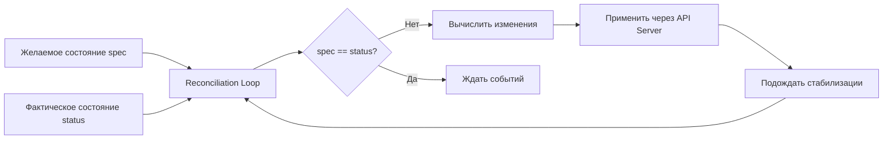

>Самовосстановление (Self-healing) — это одна из ключевых ценностей Kubernetes: система автоматически поддерживает желаемое состояние, реагируя на сбои контейнеров, подов, нод и хранилищ.

# Самовосстановление (Self-healing) в Kubernetes

> 📌 **Self-healing** = способность K8s автоматически возвращать систему к *желаемому состоянию* при сбоях. Реализуется через **контроллеры + reconciliation loop**: обнаружил расхождение → внёс минимальное исправление → повторил. Это не «магия», а детерминированная логика.

---

## 🔹 Как работает самовосстановление: общий принцип



### 🎯 Ключевые свойства

| Свойство | Описание | Пример |
|----------|----------|--------|
| **🔁 Идемпотентность** | Повторное применение одной логики не ломает систему | Если под уже создан — контроллер не создаст дубликат |
| **⚡ Асинхронность** | Контроллеры работают параллельно, без блокировок | Сбой пода не блокирует масштабирование деплоймента |
| **📡 Только через API** | Все изменения идут через `kube-apiserver` | Контроллер не убивает контейнеры напрямую — только через запросы |
| **🏷️ Селекция по меткам** | Контроллеры управляют только «своими» ресурсами | Deployment влияет только на поды с `pod-template-hash=abc123` |

> 💡 **Важно**: самовосстановление — это не «исправление багов приложения». K8s перезапустит упавший контейнер, но если приложение падает из-за ошибки в коде — это задача разработчика.

---

## 🔹 Уровни самовосстановления

### 1️⃣ 🐳 Контейнер → Перезапуск пода

| Сценарий | Механизм | Настройка |
|----------|----------|-----------|
| **Контейнер упал с кодом 0** (успешное завершение) | Зависит от `restartPolicy` | `Always` (по умолчанию в Deployment), `OnFailure`, `Never` |
| **Контейнер упал с ошибкой** (код ≠ 0) | Перезапуск, если `restartPolicy: Always/OnFailure` | Проверь `kubectl describe pod` → `Last State` |
| **Liveness probe не прошёл** | Kubelet убивает контейнер → перезапуск | `livenessProbe: { httpGet: { path: /healthz } }` |
| **Startup probe не прошёл** | Контейнер не считается готовым, но не убивается | Даёт время на «прогрев» приложения |

```yaml
# Пример probes в поде
spec:
  containers:
  - name: my-app
    image: my-app:1.0
    startupProbe:
      httpGet: { path: /startup, port: 8080 }
      failureThreshold: 30  # 30 * 10s = 5 минут на старт
      periodSeconds: 10
    livenessProbe:
      httpGet: { path: /healthz, port: 8080 }
      periodSeconds: 10
      failureThreshold: 3  # 3 провала → перезапуск
    readinessProbe:
      httpGet: { path: /ready, port: 8080 }
      periodSeconds: 5
```

> ⚠️ **Осторожно**: слишком агрессивные `livenessProbe` могут вызывать циклические перезапуски при временных задержках приложения.

---

### 2️⃣ 📦 Под → Замена реплики

| Контроллер | Когда срабатывает | Что делает |
|-----------|------------------|-----------|
| **ReplicaSet** (через Deployment) | Под удалён, упал, нода недоступна | Создаёт новый под с тем же шаблоном, чтобы достичь `spec.replicas` |
| **StatefulSet** | Под упал, но нужен с той же идентичностью | Пересоздаёт под с тем же именем (`web-0`), тем же PVC, тем же сетевым ID |
| **DaemonSet** | Под упал на конкретной ноде | Создаёт новый под **на той же ноде** (если нода вернулась в строй) |
| **Job** | Под упал до успешного завершения | Пересоздаёт под, пока не достигнет `spec.completions` |

```yaml
# Пример: Deployment с 3 репликами
apiVersion: apps/v1
kind: Deployment
metadata: { name: my-app }
spec:
  replicas: 3
  selector: { matchLabels: { app: my-app } }
  template:
    metadata: { labels: { app: my-app } }
    spec:
      containers:
      - name: app
        image: my-app:1.0
        # Если один из 3 подов упадёт → ReplicaSet создаст новый
```

```
Сценарий восстановления:
1. Под my-app-abc123 падает (сбой приложения / нода / сеть)
2. ReplicaSet видит: desired=3, actual=2 → расхождение
3. Отправляет в API Server: создать новый под с тем же template
4. Scheduler находит подходящую ноду → kubelet запускает контейнер
5. Через ~30-60 сек: desired=3, actual=3 → система стабильна
```

> 💡 **Проверка**: `kubectl rollout status deployment/my-app` — покажет прогресс восстановления.

---

### 3️⃣ 💾 Хранилище → Переподключение тома

| Сценарий | Механизм | Требования |
|----------|----------|-----------|
| **Ноде с подом и PVC упала** | PV может быть переподключен к новому поду на другой ноде | • Хранилище должно поддерживать `accessModes: ReadWriteOnce` или `ReadWriteMany`<br>• StorageClass с `allowVolumeExpansion: true` (опционально) |
| **Под пересоздан на другой ноде** | Контроллер аттачит том к новой ноде, детачит от старой | • CSI-драйвер должен поддерживать `ControllerPublish`<br>• Облачный провайдер должен разрешать перемещение дисков между зонами (если multi-zone) |
| **StatefulSet + headless Service** | Под получает тот же PVC и сетевой идентификатор | • `volumeClaimTemplates` в StatefulSet<br>• `serviceName` для стабильного DNS |

```yaml
# Пример: StatefulSet с устойчивым хранилищем
apiVersion: apps/v1
kind: StatefulSet
metadata: { name: database }
spec:
  serviceName: database-headless
  replicas: 3
  selector: { matchLabels: { app: database } }
  template:
    metadata: { labels: { app: database } }
    spec:
      containers:
      - name: postgres
        image: postgres:15
        volumeMounts:
        - name: data
          mountPath: /var/lib/postgresql/data
  volumeClaimTemplates:
  - metadata: { name: data }
    spec:
      accessModes: [ "ReadWriteOnce" ]
      storageClassName: "fast-ssd"
      resources:
        requests: { storage: 100Gi }
```

> ⚠️ **Важно**: `ReadWriteOnce` тома можно монтировать только на одну ноду одновременно. При перемещении пода сначала происходит `detach` от старой ноды, затем `attach` к новой — это может занять 1-2 минуты.

---

### 4️⃣ 🌐 Сервис → Исключение неисправных подов

| Механизм | Как работает | Когда срабатывает |
|----------|-------------|-----------------|
| **Endpoints / EndpointSlice** | Контроллер обновляет список готовых подов для сервиса | Когда `readinessProbe` пода начинает проваливаться |
| **kube-proxy (iptables/IPVS)** | Правила балансировки трафика перестраиваются автоматически | При изменении EndpointSlice |
| **Service Mesh (опционально)** | Istio/Linkerd могут делать более умную балансировку | При сбоях, задержках, ошибках 5xx |

```
Сценарий:
1. Под my-app-1 перестаёт отвечать на /ready (база данных недоступна)
2. Kubelet помечает под как !Ready
3. EndpointSlice Controller удаляет этот под из списка конечных точек сервиса
4. kube-proxy обновляет iptables/IPVS правила → трафик больше не идёт на my-app-1
5. Когда под восстанавливается → возвращается в Endpoints → трафик возобновляется
```

```yaml
# Проверка: какие поды сейчас обслуживают сервис
kubectl get endpoints my-service
# или подробнее:
kubectl get endpointslice -l kubernetes.io/service-name=my-service -o yaml
```

> 💡 **Совет**: всегда настраивай `readinessProbe` — без него сервис будет направлять трафик на ещё не готовые поды.

---

## 🔹 Компоненты, обеспечивающие самовосстановление

| Компонент | Роль в self-healing | Пример воздействия |
|-----------|-------------------|-------------------|
| **kubelet** | Мониторит контейнеры, перезапускает упавшие, обновляет статус пода | Контейнер упал → kubelet видит → перезапускает (если `restartPolicy: Always`) |
| **ReplicaSet Controller** | Поддерживает заданное количество реплик подов | Под удалён → создаёт новый |
| **Deployment Controller** | Управляет обновлениями, откатами, историей ревизий | Rolling update «завис» → можно откатить на предыдущую ревизию |
| **StatefulSet Controller** | Сохраняет идентичность подов (имя, сетевой ID, хранилище) | Под `web-0` упал → пересоздаётся с тем же именем и PVC |
| **DaemonSet Controller** | Гарантирует наличие пода на каждой (или выбранных) нодах | Новая нода добавлена → DaemonSet создаёт на ней под |
| **PV/PVC Controller** | Управляет жизненным циклом томов, аттачем/детачем | Ноде с подом упала → том переподключается к новому поду |
| **EndpointSlice Controller** | Поддерживает актуальный список готовых подов для сервисов | Под стал !Ready → удаляется из балансировки |
| **Node Controller** | Мониторит здоровье нод, эвиктит поды при сбоях | Ноде не отвечает 5 минут → поды эвиктятся, пересоздаются на других нодах |

---

## 🔹 Ограничения и «подводные камни»

### ⚠️ Сбои хранилища
```
Проблема:
• Если том (PV) физически повреждён или недоступен (сбой облачного диска)
• Контроллер не может «починить» данные — только переподключить

Решение:
• Используй реплицируемые хранилища (Ceph, EBS Multi-Attach, облачные реплики)
• Настрой бэкапы (Velero, cloud-native snapshots)
• Для критичных данных: `accessModes: ReadWriteMany` + репликация на уровне приложения
```

### ⚠️ Ошибки приложения (не инфраструктуры)
```
Проблема:
• Приложение падает из-за бага, утечки памяти, неверной конфигурации
• K8s будет бесконечно перезапускать контейнер (CrashLoopBackOff)

Решение:
• Настрой `livenessProbe` с адекватными таймингами (не слишком агрессивно)
• Используй `startupProbe` для долгих запусков
• Логируй и мониторь приложение: метрики, трейсинг, алерты
• Исправляй корневую причину, а не полагайся на перезапуски
```

### ⚠️ Сетевые разделения (split-brain)
```
Проблема:
• Ноде изолирована от Control Plane, но продолжает работать
• Контроллер считает ноду недоступной → эвиктит поды
• На изолированной ноде поды продолжают работать → дублирование

Решение:
• Настрой `--pod-eviction-timeout` и `--node-monitor-grace-period` под свою сеть
• Используй `PodDisruptionBudget` для контроля минимального доступного количества
• Для stateful-приложений: реализуй детекцию лидера на уровне приложения
```

### ⚠️ Конфликты при переподключении томов
```
Проблема:
• Том не может быть отключен от старой ноды (сбой сети, зависший kubelet)
• Новый под не может быть запущен, потому что том «занят»

Решение:
• Проверь статус ноды: `kubectl describe node <old-node>`
• При необходимости: принудительно удали объект ноды (осторожно!)
• Для облачных провайдеров: используй CSI-драйверы с поддержкой `force-detach`
```

---

## 🔹 Практика: проверка и отладка самовосстановления

### 🔍 Мониторинг состояния
```bash
# Проверить, все ли поды в нужном состоянии
kubectl get pods -l app=my-app --field-selector status.phase!=Running

# Посмотреть события, связанные с восстановлением
kubectl get events --field-selector reason=Created,reason=Started,reason=Killing | grep my-app

# Проверить, не в цикле ли перезапусков
kubectl get pods -l app=my-app -o jsonpath='{range .items[*]}{.metadata.name}{"\t"}{.status.containerStatuses[*].restartCount}{"\n"}{end}'
```

### 🧪 Тестирование восстановления (в dev-среде!)
```bash
# 1. Удалить под вручную (проверка ReplicaSet)
POD=$(kubectl get pods -l app=my-app -o jsonpath='{.items[0].metadata.name}')
kubectl delete pod $POD
# → Через 10-30 сек должен появиться новый под с тем же template

# 2. Сымитировать сбой приложения (liveness probe)
kubectl exec $POD -- touch /tmp/kill-liveness  # если приложение реагирует на этот файл
# → Kubelet должен перезапустить контейнер

# 3. Проверить восстановление сервиса (удалить готовность)
kubectl exec $POD -- curl -X POST http://localhost:8080/force-unready
# → Под должен исчезнуть из Endpoints, трафик перенаправится на другие поды

# 4. (Осторожно!) Проверить эвикшн при недоступности ноды
# → Только в тестовом кластере!
kubectl cordon test-node
kubectl drain test-node --ignore-daemonsets --delete-emptydir-data
# → Поды должны переехать на другие ноды
```

### 🔧 Настройка таймингов восстановления
```yaml
# В kube-controller-manager (для глобальных настроек):
--pod-eviction-timeout=5m0s           # Через сколько эвиктить поды с недоступной ноды
--node-monitor-grace-period=40s       # Через сколько пометить ноду как Unknown
--node-monitor-period=5s              # Как часто проверять статус нод

# В Deployment (для rolling update):
spec:
  strategy:
    type: RollingUpdate
    rollingUpdate:
      maxSurge: 1          # Сколько дополнительных подов можно создать при обновлении
      maxUnavailable: 0    # Сколько подов может быть недоступно (0 = без простоя)

# В PodDisruptionBudget (защита от массового эвикшна):
apiVersion: policy/v1
kind: PodDisruptionBudget
metadata: { name: my-app-pdb }
spec:
  minAvailable: 2          # Минимум 2 пода должны быть доступны всегда
  selector: { matchLabels: { app: my-app } }
```

---

## 🔹 Чек-лист: обеспечение надёжного самовосстановления

### ✅ Проектирование приложений
```bash
# • Реализуй graceful shutdown: обрабатывай SIGTERM, завершай соединения, освобождай ресурсы
# • Настрой probes: startup (долгий старт), liveness (перезапуск при зависании), readiness (балансировка)
# • Сделай приложение идемпотентным: перезапуск не должен ломать данные или дублировать действия
# • Логируй и экспортируй метрики: чтобы отличать сбой инфраструктуры от бага приложения
```

### ✅ Конфигурация ресурсов
```bash
# • Задавай requests/limits: чтобы планировщик корректно размещал поды, а kubelet не убивал их из-за OOM
# • Используй PodDisruptionBudget для критичных сервисов: защита от массового эвикшна при обновлении нод
# • Для stateful-приложений: StatefulSet + PVC + headless Service для стабильной идентичности
# • Настрой topologySpreadConstraints: чтобы реплики были распределены по зонам/нодам
```

### ✅ Мониторинг и алертинг
```bash
# • Алерт на CrashLoopBackOff: приложение не может запуститься
# • Алерт на повышенное количество перезапусков: возможно, утечка памяти или нестабильность
# • Алерт на недоступность подов в сервисе: балансировка работает некорректно
# • Алерт на «зависшие» тома: PV не может быть переподключен

# Пример пром-запроса для алерта на перезапуски:
sum by (pod) (rate(kube_pod_container_status_restarts_total[5m])) > 0.5
```

### ✅ Отладка проблем
```bash
# 1. Под не восстанавливается:
kubectl describe pod <pod> | grep -A10 'Events:'
kubectl logs <pod> --previous  # логи предыдущей попытки запуска

# 2. Том не переподключается:
kubectl describe pvc <pvc> | grep -A5 'Events:'
kubectl describe node <old-node> | grep -i 'taint\|condition'

# 3. Сервис направляет трафик на «мёртвые» поды:
kubectl get endpointslice -l kubernetes.io/service-name=<svc> -o yaml
kubectl describe pod <pod> | grep -A3 'Ready'

# 4. Ноде не восстанавливается после сбоя:
kubectl describe node <node> | grep -A10 'Conditions:'
journalctl -u kubelet | grep -i 'error\|failed'
```

### ❌ Чего избегать
```bash
# ❌ Не ставь `livenessProbe` слишком агрессивно (период < 10с, failureThreshold < 3)
#   → временные задержки приложения будут вызывать циклические перезапуски

# ❌ Не игнорируй `readinessProbe`
#   → сервис будет направлять трафик на ещё не готовые поды

# ❌ Не используй `restartPolicy: Never` в Deployment/StatefulSet
#   → упавший под не будет перезапущен, реплики не восстановятся

# ❌ Не полагайся только на самовосстановление инфраструктуры
#   → баги приложения, ошибки конфигурации, проблемы с данными требуют отдельного внимания

# ❌ Не тестируй восстановление в production без предварительной проверки в staging
#   → эвикшн, переподключение томов, смена нод могут иметь непредсказуемые последствия
```

---

## 🔹 Ключевые выводы

1. **Самовосстановление = reconciliation loop**: контроллеры постоянно сравнивают `spec` и `status`, внося минимальные исправления.
2. **Уровни восстановления**: контейнер → под → нода → хранилище → сервис. Каждый уровень имеет свой механизм.
3. **Probes — твой главный инструмент**: `liveness` для перезапуска, `readiness` для балансировки, `startup` для долгих запусков.
4. **Stateful-приложения требуют особого подхода**: идентичность, хранилище, сетевой адрес должны сохраняться при пересоздании.
5. **Мониторь и алерти**: самовосстановление не отменяет необходимости наблюдать за системой.
6. **Тестируй в staging**: эвикшн, переподключение томов, смена нод — сложные операции, их поведение нужно проверять до production.

> 🎯 **Финальный совет**: самовосстановление — это не «настроил и забыл». Это инструмент, который требует понимания, настройки и наблюдения. Проектируй приложения и инфраструктуру так, чтобы они *помогали* K8s восстанавливаться, а не мешали.
