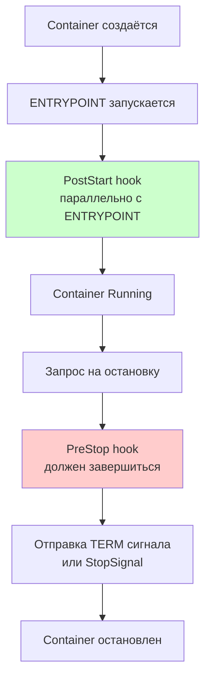

# Container Lifecycle Hooks — хуки жизненного цикла контейнеров

> 📌 **K8s** предоставляет **3 хука** для управления жизненным циклом контейнеров: (1) **PostStart** — выполняется сразу после создания контейнера (параллельно с ENTRYPOINT), (2) **PreStop** — выполняется перед остановкой контейнера (должен завершиться до отправки TERM), (3) **StopSignal** — кастомный сигнал остановки. **Типы обработчиков**: `exec` (команда), `httpGet` (HTTP-запрос), `sleep` (пауза, v1.29+). **Важно**: хуки гарантируют **at-least-once delivery** (могут вызываться несколько раз) → должны быть **идемпотентными**.

---

## Обзор хуков

### 🎯 Три хука жизненного цикла

| Хук | Когда вызывается | Что делает | Блокирует запуск? |
|-----|------------------|------------|-------------------|
| **PostStart** | Сразу после создания контейнера | Выполняет код после старта | ⚠️ Может задержать переход в `Running` |
| **PreStop** | Перед остановкой контейнера | Выполняет код перед остановкой | ✅ Да, должен завершиться до TERM |
| **StopSignal** | При остановке контейнера | Переопределяет сигнал остановки (STOPSIGNAL) | ❌ Нет |



### 🎯 Ключевые моменты

| Момент | Поведение |
|--------|-----------|
| **PostStart запускается** | **Параллельно** с ENTRYPOINT (не после!) |
| **PostStart может завершиться** | До, во время или после запуска ENTRYPOINT |
| **PreStop вызывается** | **До** отправки TERM сигнала |
| **Grace period** | Включает время PreStop + время остановки контейнера |
| **Если хук зависает** | Контейнер может остаться в `Terminating` до истечения grace period |
| **Если хук падает** | Контейнер **уничтожается** |

---

## 1. PostStart Hook

### 🎯 Назначение

Выполнить код **сразу после создания контейнера**. Типичные сценарии:
- Инициализация состояния
- Отправка уведомления о запуске
- Ожидание готовности зависимостей
- Регистрация в service discovery

### ⚠️ Важные особенности

| Особенность | Описание |
|-------------|----------|
| **Параллельный запуск** | PostStart и ENTRYPOINT запускаются **одновременно** |
| **Нет гарантий порядка** | PostStart может завершиться до, во время или после ENTRYPOINT |
| **Блокировка статуса** | Контейнер не перейдёт в `Running`, пока PostStart не завершится |
| **Нет параметров** | Обработчику не передаются параметры |
| **At-least-once** | Может вызываться несколько раз (идемпотентность!) |

### 📝 Пример: PostStart с exec

```yaml
apiVersion: v1
kind: Pod
metadata:
  name: lifecycle-demo
spec:
  containers:
  - name: lifecycle-demo-container
    image: nginx:1.25
    lifecycle:
      postStart:
        exec:
          command: ["/bin/sh", "-c", "echo 'Container started' > /usr/share/message.html"]
```

**Что произойдёт**:
1. Контейнер создаётся
2. ENTRYPOINT (nginx) запускается
3. PostStart выполняется **параллельно**
4. Команда создаёт файл `/usr/share/message.html`
5. Контейнер переходит в `Running`

### 📝 Пример: PostStart с httpGet

```yaml
apiVersion: v1
kind: Pod
metadata:
  name: lifecycle-demo
spec:
  containers:
  - name: app
    image: my-app:latest
    ports:
    - containerPort: 8080
    lifecycle:
      postStart:
        httpGet:
          host: my-service.default.svc.cluster.local
          port: 8080
          path: /register
          scheme: HTTP
          httpHeaders:
          - name: X-Startup
            value: "true"
```

**Что произойдёт**:
1. Контейнер создаётся
2. Приложение запускается на порту 8080
3. PostStart отправляет HTTP GET на `/register`
4. Приложение регистрируется в service discovery

> ⚠️ **Проблема**: HTTP-запрос может выполниться **до** того, как приложение полностью запустится! Решение: использовать `sleep` или readiness probe.

### 📝 Пример: PostStart с sleep (v1.29+)

```yaml
apiVersion: v1
kind: Pod
metadata:
  name: lifecycle-demo
spec:
  containers:
  - name: app
    image: my-app:latest
    lifecycle:
      postStart:
        sleep:
          seconds: 5    # ← подождать 5 секунд перед переходом в Running
```

**Что произойдёт**:
1. Контейнер создаётся
2. ENTRYPOINT запускается
3. PostStart ждёт 5 секунд
4. Контейнер переходит в `Running`

> 💡 **Зачем**: дать время приложению полностью инициализироваться перед тем, как принимать трафик.

---

## 2. PreStop Hook

### 🎯 Назначение

Выполнить код **перед остановкой контейнера**. Типичные сценарии:
- Graceful shutdown приложения
- Drain connection pool
- Сохранение состояния
- Отправка уведомления об остановке
- Удаление из service discovery

### ⚠️ Важные особенности

| Особенность | Описание |
|-------------|----------|
| **Последовательный запуск** | PreStop должен **завершиться** до отправки TERM |
| **Grace period** | Включает время PreStop + время остановки контейнера |
| **Не вызывается** | Если контейнер уже в `Terminated` или `Completed` |
| **Нет параметров** | Обработчику не передаются параметры |
| **At-least-once** | Может вызываться несколько раз (идемпотентность!) |

### 🎯 Взаимодействие с grace period

```
Timeline при остановке пода:
┌─────────────────────────────────────────────────────────┐
│ 0s          PreStop starts        TERM sent             60s
│ │           │                     │                     │
│ ▼           ▼                     ▼                     ▼
│ ┌───────────┬─────────────────────┬─────────────────────┐
│ │ PreStop   │                     │ Container shutdown  │
│ │ hook      │                     │ (SIGTERM → SIGKILL) │
│ │ (55s)     │                     │ (10s)               │
│ └───────────┴─────────────────────┴─────────────────────┘
│                                                           │
│         terminationGracePeriodSeconds = 60s               │
│                                                           │
│         Если PreStop (55s) + shutdown (10s) = 65s > 60s  │
│         → Контейнер будет убит через 60s (SIGKILL)       │
└─────────────────────────────────────────────────────────┘
```

### 📝 Пример: PreStop с exec (graceful shutdown)

```yaml
apiVersion: v1
kind: Pod
metadata:
  name: lifecycle-demo
spec:
  terminationGracePeriodSeconds: 60    # ← 60 секунд на остановку
  containers:
  - name: app
    image: my-app:latest
    lifecycle:
      preStop:
        exec:
          command: ["/bin/sh", "-c", "curl -X POST http://localhost:8080/shutdown"]
```

**Что произойдёт**:
1. Запрос на остановку пода
2. PreStop отправляет POST на `/shutdown`
3. Приложение начинает graceful shutdown (drain connections, save state)
4. PreStop завершается
5. Отправляется TERM сигнал
6. Приложение завершается gracefully

### 📝 Пример: PreStop с sleep (задержка перед остановкой)

```yaml
apiVersion: v1
kind: Pod
metadata:
  name: lifecycle-demo
spec:
  terminationGracePeriodSeconds: 30
  containers:
  - name: app
    image: my-app:latest
    lifecycle:
      preStop:
        sleep:
          seconds: 10    # ← подождать 10 секунд перед отправкой TERM
```

**Что произойдёт**:
1. Запрос на остановку пода
2. PreStop ждёт 10 секунд (даёт время убрать под из Service endpoints)
3. PreStop завершается
4. Отправляется TERM сигнал
5. Приложение завершается

> 💡 **Зачем**: дать время kube-proxy обновить iptables/IPVS правила и убрать под из Service endpoints.

### 📝 Пример: PreStop с httpGet

```yaml
apiVersion: v1
kind: Pod
metadata:
  name: lifecycle-demo
spec:
  terminationGracePeriodSeconds: 30
  containers:
  - name: app
    image: my-app:latest
    lifecycle:
      preStop:
        httpGet:
          port: 8080
          path: /deregister
          scheme: HTTP
```

**Что произойдёт**:
1. Запрос на остановку пода
2. PreStop отправляет HTTP GET на `/deregister`
3. Приложение удаляет себя из service discovery
4. PreStop завершается
5. Отправляется TERM сигнал
6. Приложение завершается

---

## 3. StopSignal

### 🎯 Назначение

Переопределить сигнал остановки контейнера (по умолчанию `SIGTERM`).

### 📝 Пример

```yaml
apiVersion: v1
kind: Pod
metadata:
  name: lifecycle-demo
spec:
  containers:
  - name: app
    image: my-app:latest
    stopSignal: SIGINT    # ← отправить SIGINT вместо SIGTERM
```

**Что произойдёт**:
1. Запрос на остановку пода
2. PreStop hook выполняется (если есть)
3. Отправляется **SIGINT** (вместо SIGTERM)
4. Приложение завершается

### 🎯 Когда использовать

| Сигнал | Когда использовать |
|--------|-------------------|
| **SIGTERM** (по умолчанию) | Стандартный graceful shutdown |
| **SIGINT** | Приложения, которые обрабатывают Ctrl+C |
| **SIGQUIT** | Приложения с dump core |
| **SIGUSR1** | Кастомный сигнал для приложения |

> ⚠️ **Важно**: StopSignal переопределяет `STOPSIGNAL` инструкцию в Dockerfile.

---

## Типы обработчиков хуков

### 🎯 Три типа обработчиков

| Тип | Описание | Когда использовать |
|-----|----------|-------------------|
| **`exec`** | Выполняет команду внутри контейнера | Сложная логика, работа с файлами |
| **`httpGet`** | Отправляет HTTP GET запрос | Интеграция с HTTP API |
| **`sleep`** (v1.29+) | Приостанавливает выполнение | Задержка перед стартом/остановкой |

### 📝 Сравнение обработчиков

| Характеристика | exec | httpGet | sleep |
|----------------|------|---------|-------|
| **Где выполняется** | Внутри контейнера | Kubelet → контейнер | Kubelet |
| **Ресурсы** | Учитываются в контейнере | Не учитываются | Не учитываются |
| **Timeout** | Нет (зависит от команды) | Настраивается | Фиксированный |
| **Retry** | Нет | Нет | Нет |
| **Сложность** | Высокая | Средняя | Низкая |

### 📝 Пример: exec

```yaml
lifecycle:
  postStart:
    exec:
      command: ["/bin/sh", "-c", "echo 'Started' > /tmp/status"]
  preStop:
    exec:
      command: ["/bin/sh", "-c", "nginx -s quit"]
```

### 📝 Пример: httpGet

```yaml
lifecycle:
  postStart:
    httpGet:
      host: my-service.default.svc.cluster.local
      port: 8080
      path: /register
      scheme: HTTP
      httpHeaders:
      - name: X-Custom-Header
        value: "value"
  preStop:
    httpGet:
      port: 8080
      path: /deregister
      scheme: HTTPS
```

### 📝 Пример: sleep

```yaml
lifecycle:
  postStart:
    sleep:
      seconds: 5
  preStop:
    sleep:
      seconds: 10
```

---

## Гарантии доставки

### 🎯 At-least-once delivery

> Хуки гарантируют **at-least-once delivery** — обработчик может вызываться **несколько раз**.

### 🎯 Что это значит

| Сценарий | Поведение |
|----------|-----------|
| **Обычный случай** | Хук вызывается **один раз** |
| **Kubelet перезапускается** | Хук может быть вызван **повторно** |
| **HTTP endpoint недоступен** | Retry **не выполняется** |
| **Команда падает** | Контейнер **уничтожается** |

### ⚠️ Требования к обработчикам

| Требование | Почему |
|------------|--------|
| **Идемпотентность** | Хук может вызываться несколько раз |
| **Быстрота** | Долгий хук блокирует запуск/остановку |
| **Надёжность** | Падение хука = уничтожение контейнера |
| **Простота** | Сложная логика = больше шансов на ошибку |

### 📝 Пример: идемпотентный PostStart

```yaml
# ❌ ПЛОХО: неидемпотентный
lifecycle:
  postStart:
    exec:
      command: ["/bin/sh", "-c", "echo 'Started' >> /tmp/status"]
      # ← если вызывается дважды, будет две строки

# ✅ ХОРОШО: идемпотентный
lifecycle:
  postStart:
    exec:
      command: ["/bin/sh", "-c", "echo 'Started' > /tmp/status"]
      # ← перезаписывает файл, результат одинаковый
```

### 📝 Пример: идемпотентный PreStop

```yaml
# ❌ ПЛОХО: неидемпотентный
lifecycle:
  preStop:
    exec:
      command: ["/bin/sh", "-c", "curl -X POST http://localhost:8080/deregister"]
      # ← если вызывается дважды, будет два запроса

# ✅ ХОРОШО: идемпотентный
lifecycle:
  preStop:
    exec:
      command: ["/bin/sh", "-c", "test -f /tmp/deregistered || curl -X POST http://localhost:8080/deregister && touch /tmp/deregistered"]
      # ← проверяет, был ли уже deregister
```

---

## Отладка хуков

### 🔍 Логи хуков

> ⚠️ Логи обработчиков хуков **не отображаются** в `kubectl logs`!

### 🔍 События (Events)

```bash
# Посмотреть события пода
kubectl describe pod lifecycle-demo | grep -A20 'Events:'
```

**Пример успешного запуска**:
```
Events:
  Type     Reason     Age   From               Message
  ----     ------     ----  ----               -------
  Normal   Scheduled  10s   default-scheduler  Successfully assigned default/lifecycle-demo to node-1
  Normal   Pulled     9s    kubelet            Successfully pulled image "nginx"
  Normal   Created    8s    kubelet            Created container lifecycle-demo-container
  Normal   Started    8s    kubelet            Started container lifecycle-demo-container
```

**Пример падения PostStart**:
```
Events:
  Type     Reason               Age   From               Message
  ----     ------               ----  ----               -------
  Normal   Scheduled            10s   default-scheduler  Successfully assigned default/lifecycle-demo to node-1
  Normal   Pulled               9s    kubelet            Successfully pulled image "nginx"
  Normal   Created              8s    kubelet            Created container lifecycle-demo-container
  Normal   Started              8s    kubelet            Started container lifecycle-demo-container
  Warning  FailedPostStartHook  7s    kubelet            Exec lifecycle hook ([badcommand]) for Container "lifecycle-demo-container" in Pod "lifecycle-demo_default" failed - error: command 'badcommand' exited with 126
  Normal   Killing              7s    kubelet            FailedPostStartHook
  Warning  BackOff              5s    kubelet            Back-off restarting failed container
```

### 🔍 Ключевые события

| Событие | Описание |
|---------|----------|
| **`FailedPostStartHook`** | PostStart hook упал |
| **`FailedPreStopHook`** | PreStop hook упал |
| **`Killing`** | Контейнер убивается из-за падения хука |
| **`BackOff`** | Kubelet пытается перезапустить контейнер |

### 🔍 Отладка PostStart

```bash
# 1. Проверить, что команда существует в контейнере
kubectl exec lifecycle-demo -- which /bin/sh

# 2. Проверить, что команда выполняется вручную
kubectl exec lifecycle-demo -- /bin/sh -c "echo 'test' > /tmp/status"

# 3. Проверить логи kubelet
journalctl -u kubelet | grep -i "postStart"

# 4. Проверить события пода
kubectl describe pod lifecycle-demo | grep -A10 'Events:'
```

### 🔍 Отладка PreStop

```bash
# 1. Проверить, что команда существует в контейнере
kubectl exec lifecycle-demo -- which /bin/sh

# 2. Проверить, что команда выполняется вручную
kubectl exec lifecycle-demo -- /bin/sh -c "curl -X POST http://localhost:8080/shutdown"

# 3. Проверить логи kubelet
journalctl -u kubelet | grep -i "preStop"

# 4. Проверить события пода
kubectl describe pod lifecycle-demo | grep -A10 'Events:'

# 5. Проверить grace period
kubectl get pod lifecycle-demo -o jsonpath='{.spec.terminationGracePeriodSeconds}'
```

---

## Практика: примеры использования

### 🎯 Сценарий 1: Graceful shutdown веб-сервера

```yaml
apiVersion: v1
kind: Pod
metadata:
  name: nginx-graceful
spec:
  terminationGracePeriodSeconds: 30
  containers:
  - name: nginx
    image: nginx:1.25
    lifecycle:
      preStop:
        exec:
          command: ["/bin/sh", "-c", "nginx -s quit"]
```

**Что произойдёт**:
1. Запрос на остановку пода
2. PreStop выполняет `nginx -s quit` (graceful shutdown)
3. Nginx завершает активные соединения
4. PreStop завершается
5. Отправляется TERM сигнал
6. Nginx завершается

### 🎯 Сценарий 2: Drain connection pool

```yaml
apiVersion: v1
kind: Pod
metadata:
  name: app-drain
spec:
  terminationGracePeriodSeconds: 60
  containers:
  - name: app
    image: my-app:latest
    lifecycle:
      preStop:
        exec:
          command: ["/bin/sh", "-c", "curl -X POST http://localhost:8080/drain"]
```

**Что произойдёт**:
1. Запрос на остановку пода
2. PreStop отправляет POST на `/drain`
3. Приложение перестаёт принимать новые соединения
4. Приложение завершает активные соединения
5. PreStop завершается
6. Отправляется TERM сигнал
7. Приложение завершается

### 🎯 Сценарий 3: Service discovery registration

```yaml
apiVersion: v1
kind: Pod
metadata:
  name: app-register
spec:
  containers:
  - name: app
    image: my-app:latest
    lifecycle:
      postStart:
        exec:
          command: ["/bin/sh", "-c", "curl -X POST http://consul:8500/v1/agent/service/register -d @/etc/service.json"]
      preStop:
        exec:
          command: ["/bin/sh", "-c", "curl -X PUT http://consul:8500/v1/agent/service/deregister/my-app"]
```

**Что произойдёт**:
1. Под создаётся
2. PostStart регистрирует приложение в Consul
3. Приложение работает
4. Запрос на остановку пода
5. PreStop удаляет приложение из Consul
6. Приложение завершается

### 🎯 Сценарий 4: Задержка перед остановкой (для Service endpoints)

```yaml
apiVersion: v1
kind: Pod
metadata:
  name: app-delay
spec:
  terminationGracePeriodSeconds: 30
  containers:
  - name: app
    image: my-app:latest
    lifecycle:
      preStop:
        sleep:
          seconds: 10    # ← подождать 10 секунд
```

**Что произойдёт**:
1. Запрос на остановку пода
2. Pod помечается как `Terminating`
3. kube-proxy обновляет endpoints (удаляет под из Service)
4. PreStop ждёт 10 секунд
5. PreStop завершается
6. Отправляется TERM сигнал
7. Приложение завершается

> 💡 **Зачем**: дать время kube-proxy обновить iptables/IPVS правила, чтобы новый трафик не шёл на останавливающийся под.

### 🎯 Сценарий 5: Инициализация состояния

```yaml
apiVersion: v1
kind: Pod
metadata:
  name: app-init
spec:
  containers:
  - name: app
    image: my-app:latest
    lifecycle:
      postStart:
        exec:
          command: ["/bin/sh", "-c", "mkdir -p /data && chown app:app /data"]
```

**Что произойдёт**:
1. Под создаётся
2. ENTRYPOINT запускается
3. PostStart создаёт директорию `/data` и меняет владельца
4. Под переходит в `Running`

---

## Troubleshooting

### 🔍 Проблема 1: PostStart не выполняется

```bash
# 1. Проверить, что команда существует в контейнере
kubectl exec lifecycle-demo -- which /bin/sh

# 2. Проверить, что команда выполняется вручную
kubectl exec lifecycle-demo -- /bin/sh -c "echo 'test' > /tmp/status"

# 3. Проверить события пода
kubectl describe pod lifecycle-demo | grep -A10 'Events:'
# Warning  FailedPostStartHook  ...  Exec lifecycle hook ([badcommand]) failed

# 4. Проверить логи kubelet
journalctl -u kubelet | grep -i "postStart"

# 5. Проверить, что контейнер не падает
kubectl get pod lifecycle-demo
# Если STATUS: Error → PostStart упал
```

### 🔍 Проблема 2: PreStop не выполняется

```bash
# 1. Проверить, что команда существует в контейнере
kubectl exec lifecycle-demo -- which /bin/sh

# 2. Проверить, что команда выполняется вручную
kubectl exec lifecycle-demo -- /bin/sh -c "curl -X POST http://localhost:8080/shutdown"

# 3. Проверить события пода
kubectl describe pod lifecycle-demo | grep -A10 'Events:'
# Warning  FailedPreStopHook  ...  Exec lifecycle hook ([badcommand]) failed

# 4. Проверить логи kubelet
journalctl -u kubelet | grep -i "preStop"

# 5. Проверить, что контейнер в Terminating
kubectl get pod lifecycle-demo
# Если STATUS: Terminating → PreStop выполняется или завис
```

### 🔍 Проблема 3: Контейнер не останавливается

```bash
# 1. Проверить grace period
kubectl get pod lifecycle-demo -o jsonpath='{.spec.terminationGracePeriodSeconds}'
# Если слишком маленький → увеличить

# 2. Проверить, что PreStop завершается
kubectl describe pod lifecycle-demo | grep -A10 'Events:'
# Если PreStop зависает → исправить команду

# 3. Проверить, что приложение обрабатывает TERM
kubectl exec lifecycle-demo -- ps aux | grep app
# Если приложение не завершается → добавить обработку SIGTERM

# 4. Увеличить grace period
kubectl patch pod lifecycle-demo --type='json' -p='[{"op": "replace", "path": "/spec/terminationGracePeriodSeconds", "value": 120}]'
```

### 🔍 Проблема 4: Хук вызывается несколько раз

```bash
# 1. Проверить логи kubelet
journalctl -u kubelet | grep -i "lifecycle"

# 2. Проверить, что kubelet перезапускался
systemctl status kubelet | grep -i "restart"

# 3. Сделать хук идемпотентным
# Вместо:
command: ["/bin/sh", "-c", "echo 'Started' >> /tmp/status"]
# Использовать:
command: ["/bin/sh", "-c", "echo 'Started' > /tmp/status"]
```

---

## Best Practices

### ✅ Делай

1. **Используй PreStop для graceful shutdown**:
   ```yaml
   lifecycle:
     preStop:
       exec:
         command: ["/bin/sh", "-c", "nginx -s quit"]
   ```

2. **Делай хуки идемпотентными**:
   ```yaml
   # ✅ Хорошо
   command: ["/bin/sh", "-c", "echo 'Started' > /tmp/status"]
   ```

3. **Используй sleep для задержки перед остановкой**:
   ```yaml
   lifecycle:
     preStop:
       sleep:
         seconds: 10
   ```

4. **Увеличь terminationGracePeriodSeconds** для долгих PreStop:
   ```yaml
   terminationGracePeriodSeconds: 60
   ```

5. **Тестируй хуки вручную**:
   ```bash
   kubectl exec pod -- /bin/sh -c "your-hook-command"
   ```

6. **Мониторь события**:
   ```bash
   kubectl describe pod | grep -A10 'Events:'
   ```

7. **Используй PostStart для инициализации**:
   ```yaml
   lifecycle:
     postStart:
       exec:
         command: ["/bin/sh", "-c", "mkdir -p /data"]
   ```

8. **Обрабатывай SIGTERM в приложении**:
   ```python
   import signal
   import sys
   
   def handler(signum, frame):
       print("Received SIGTERM, shutting down gracefully")
       sys.exit(0)
   
   signal.signal(signal.SIGTERM, handler)
   ```

9. **Документируй хуки**:
   - Что делает PostStart
   - Что делает PreStop
   - Почему выбран именно такой grace period

10. **Используй exec для сложной логики**:
    ```yaml
    lifecycle:
      preStop:
        exec:
          command: ["/bin/sh", "-c", "/scripts/graceful-shutdown.sh"]
    ```

### ❌ Не делай

```yaml
# ❌ НЕ делай PostStart неидемпотентным
lifecycle:
  postStart:
    exec:
      command: ["/bin/sh", "-c", "echo 'Started' >> /tmp/status"]
      # ← если вызывается дважды, будет две строки

# ❌ НЕ делай PreStop слишком долгим
lifecycle:
  preStop:
    exec:
      command: ["/bin/sh", "-c", "sleep 300"]
      # ← если grace period < 300s, контейнер будет убит

# ❌ НЕ забывай про terminationGracePeriodSeconds
# По умолчанию 30 секунд — может быть недостаточно

# ❌ НЕ используй httpGet для PostStart без проверки готовности
lifecycle:
  postStart:
    httpGet:
      port: 8080
      path: /register
      # ← приложение может быть ещё не готово

# ❌ НЕ игнорируй FailedPostStartHook / FailedPreStopHook
# Это означает, что хук упал и контейнер будет уничтожен

# ❌ НЕ делай хуки зависимыми от внешних сервисов
lifecycle:
  preStop:
    exec:
      command: ["/bin/sh", "-c", "curl http://external-service/deregister"]
      # ← если external-service недоступен, PreStop упадёт

# ❌ НЕ используй PostStart для критичной инициализации
# PostStart может выполниться до ENTRYPOINT

# ❌ НЕ забывай тестировать хуки
# Всегда проверяй, что команда существует и работает
```

---

## Чек-лист: настройка хуков

```
# ✅ 1. Определить, какие хуки нужны
#    - PostStart: инициализация, регистрация
#    - PreStop: graceful shutdown, deregistration
#    - StopSignal: кастомный сигнал остановки

# ✅ 2. Выбрать тип обработчика
#    - exec: сложная логика, работа с файлами
#    - httpGet: интеграция с HTTP API
#    - sleep: задержка перед стартом/остановкой

# ✅ 3. Сделать хуки идемпотентными
#    - Проверить, что повторный вызов не ломает состояние
#    - Использовать файлы-флаги для проверки

# ✅ 4. Настроить terminationGracePeriodSeconds
#    - Достаточно времени для PreStop + shutdown
#    - Обычно 30-120 секунд

# ✅ 5. Протестировать хуки вручную
kubectl exec <pod> -- <hook-command>

# ✅ 6. Проверить события пода
kubectl describe pod <pod> | grep -A10 'Events:'

# ✅ 7. Проверить логи kubelet
journalctl -u kubelet | grep -i "lifecycle"

# ✅ 8. Настроить мониторинг
#    - Алерт на FailedPostStartHook
#    - Алерт на FailedPreStopHook
#    - Метрики: kubelet_container_lifecycle_hook_duration_seconds

# ✅ 9. Документировать
#    - Что делает каждый хук
#    - Почему выбран именно такой grace period
#    - Кто отвечает за поддержку

# ✅ 10. Тестировать в staging
#    - Создать под с хуками
#    - Проверить, что хуки выполняются
#    - Проверить, что под останавливается gracefully
```

> 💡 **Совет для конспекта**:
> 1. Создай файл `00_lifecycle_hooks_cheatsheet.md` с шпаргалкой по синтаксису.
> 2. Добавь блок «Частые ошибки»: «неидемпотентный хук", "PreStop зависает", "grace period слишком маленький".
> 3. Веди список "Какие хуки у нас в кластере": pod, тип хука, что делает, grace period.

---

## 🔹 Ключевые выводы

1. **3 хука жизненного цикла**: PostStart (после создания), PreStop (перед остановкой), StopSignal (кастомный сигнал).
2. **PostStart** запускается **параллельно** с ENTRYPOINT (не после!). Может задержать переход в `Running`.
3. **PreStop** должен **завершиться** до отправки TERM сигнала. Grace period включает время PreStop + shutdown.
4. **StopSignal** переопределяет сигнал остановки (по умолчанию SIGTERM).
5. **3 типа обработчиков**: `exec` (команда), `httpGet` (HTTP-запрос), `sleep` (пауза, v1.29+).
6. **At-least-once delivery** — хуки могут вызываться несколько раз → должны быть **идемпотентными**.
7. **Если хук падает** → контейнер **уничтожается**.
8. **Логи хуков** не в `kubectl logs` → смотри события пода (`kubectl describe pod`).
9. **События**: `FailedPostStartHook`, `FailedPreStopHook` — индикаторы проблем.
10. **Best practices**: идемпотентность, graceful shutdown, sleep для задержки, увеличение grace period, тестирование.
11. **Troubleshooting**: проверка команды, события пода, логи kubelet, grace period.
12. **Типичные сценарии**: graceful shutdown, drain connections, service discovery registration, задержка перед остановкой, инициализация состояния.