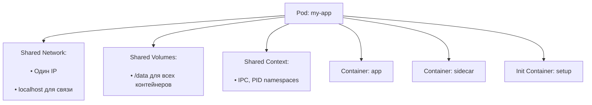

# Поды (Pods) в Kubernetes — Минимальная единица запуска

> 📌 **Pod** = наименьший объект K8s, который можно создать и запустить. Это «логический хост» для одного или нескольких тесно связанных контейнеров, которые разделяют сеть, хранилище и контекст выполнения. Поды эфемерны: их не обновляют «на месте», а заменяют через контроллеры.

---

## 🔹 Что такое Pod

| Аспект | Описание |
|--------|----------|
| **Определение** | Группа из одного или нескольких контейнеров с общими ресурсами: сеть, хранилище, спецификация запуска |
| **Аналогия** | «Логический хост» в облаке: как ВМ, но легче и быстрее |
| **Изоляция** | Контейнеры в поде разделяют Linux namespaces, cgroups; могут иметь дополнительную изоляцию через `securityContext` |
| **Эфемерность** | Поды не предназначены для долгой жизни: при сбое, обновлении или нехватке ресурсов они удаляются и создаются заново |



> 💡 **Ключевая идея**: Kubernetes управляет **подами**, а не контейнерами напрямую. Даже если в поде один контейнер — ты работаешь с абстракцией пода.

---

## 🔹 Два основных сценария использования подов

### 📦 Один контейнер на под (наиболее частый случай)

```yaml
# Простой под с одним контейнером
apiVersion: v1
kind: Pod
metadata:
  name: nginx
spec:
  containers:
  - name: nginx
    image: nginx:1.14.2
    ports:
    - containerPort: 80
```

```
Когда использовать:
• Большинство приложений (веб-серверы, микросервисы, фоновые задачи)
• Когда контейнер самодостаточен и не требует тесной связи с другими процессами

Как управлять:
• Не создавай такие поды напрямую — используй Deployment, StatefulSet, Job
• Контроллер обеспечит масштабирование, самовосстановление, обновления
```

### 🔗 Несколько контейнеров в поде (тесно связанные процессы)

```yaml
# Под с основным приложением и sidecar-контейнером для логирования
apiVersion: v1
kind: Pod
metadata:
  name: app-with-logger
spec:
  volumes:
  - name: shared-logs
    emptyDir: {}
  
  containers:
  - name: main-app
    image: my-app:1.0
    volumeMounts:
    - name: shared-logs
      mountPath: /var/log/app
  
  - name: log-shipper  # ← sidecar
    image: fluentd:latest
    volumeMounts:
    - name: shared-logs
      mountPath: /var/log/app
    command: ["fluentd", "-c", "/fluentd.conf"]
```

```
Когда использовать:
• Контейнеры тесно связаны и должны запускаться/останавливаться вместе
• Нужен общий доступ к томам, сетевому интерфейсу, процессам
• Примеры: app + log shipper, web server + cache warmer, main + helper

Когда НЕ использовать:
• Для масштабирования: если нужно 10 копий приложения — создавай 10 подов, а не 10 контейнеров в одном поде
• Для слабо связанных сервисов: используй отдельные поды + Service для связи
```

> ⚠️ **Важно**: многоконтейнерные поды сложнее отлаживать, масштабировать и обновлять. Используй этот паттерн только когда действительно нужна тесная связь.

---

## 🔹 Сетевое взаимодействие в поде

### 🌐 Общая сеть: как это работает

| Характеристика | Описание |
|---------------|----------|
| **Один IP на под** | Все контейнеры в поде используют один и тот же IP-адрес |
| **localhost для связи** | Контейнеры в поде общаются через `localhost:<port>` без сетевых задержек |
| **Общее пространство портов** | Контейнеры не могут слушать один и тот же порт; требуется координация |
| **Имя хоста** | По умолчанию равно имени пода (можно переопределить через `spec.hostname`) |

```bash
# Пример: два контейнера в одном поде
# Container A: слушает порт 8080
# Container B: может обратиться к A через http://localhost:8080

# Из контейнера B:
curl http://localhost:8080/health  # → попадёт в контейнер A

# Из другого пода (в другом сете):
curl http://<pod-ip>:8080/health   # → тоже попадёт в контейнер A
```

### 🔍 Проверка сетевых настроек пода
```bash
# Посмотреть IP пода
kubectl get pod my-pod -o jsonpath='{.status.podIP}'

# Войти в под и проверить сеть
kubectl exec -it my-pod -c main-app -- /bin/sh
# Внутри пода:
ip addr show          # → один IP на все контейнеры
netstat -tlnp         # → все слушающие порты всех контейнеров
curl localhost:8080   # → связь между контейнерами
```

> 💡 **Совет**: если контейнерам не нужна тесная сетевая связь — размещай их в разных подах. Это упростит масштабирование и отладку.

---

## 🔹 Хранилище в поде: общие тома

### 📦 Типы томов и сценарии использования

| Тип тома | Назначение | Пример |
|----------|-----------|--------|
| **`emptyDir`** | Временное хранилище, жизнь = жизнь пода | Кэш, промежуточные данные, обмен между контейнерами |
| **`hostPath`** | Доступ к файловой системе хоста (осторожно!) | Логи хоста, конфигурация агентов мониторинга |
| **`persistentVolumeClaim`** | Постоянное хранилище, переживает перезапуск пода | Базы данных, пользовательские файлы |
| **`configMap` / `secret`** | Конфигурация и секреты как файлы | Настройки приложения, пароли, сертификаты |
| **`projected`** | Комбинация нескольких источников в одном томе | ConfigMap + Secret + downward API в одной директории |

### 🔗 Пример: общий том для связи контейнеров
```yaml
spec:
  volumes:
  - name: shared-data
    emptyDir: {}  # ← временный том, удаляется при удалении пода
  
  containers:
  - name: producer
    image: my-producer:1.0
    volumeMounts:
    - name: shared-data
      mountPath: /data/out  # ← пишет файлы сюда
  
  - name: consumer
    image: my-consumer:1.0
    volumeMounts:
    - name: shared-data
      mountPath: /data/in   # ← читает файлы отсюда
```

> ⚠️ **Важно**: `emptyDir` по умолчанию хранится на диске узла. Для больших объёмов или высокой производительности используй `emptyDir.medium: Memory` (tmpfs) или подключай сетевое хранилище.

---

## 🔹 Управление подами: шаблоны и контроллеры

### 🔄 Почему не стоит создавать поды напрямую

| Причина | Объяснение |
|---------|-----------|
| **🧱 Поды эфемерны** | При сбое, обновлении или нехватке ресурсов под удаляется без предупреждения |
| **🔁 Нет самовосстановления** | Удалённый под не будет перезапущен, если не управляется контроллером |
| **📈 Нет масштабирования** | Чтобы добавить реплики, нужно вручную создавать новые поды |
| **🔄 Нет обновлений** | Нельзя обновить образ «на лету» — нужно удалять и создавать заново |

### 🎯 Используй контроллеры для управления подами

| Контроллер | Когда использовать | Особенности |
|-----------|-------------------|-------------|
| **Deployment** | Приложения без состояния, веб-сервисы, микросервисы | Rolling updates, откаты, масштабирование |
| **StatefulSet** | Stateful-приложения: БД, очереди, кластеры | Стабильные имена, сетевые идентификаторы, упорядоченные обновления |
| **DaemonSet** | Системные агенты на каждой ноде: логи, мониторинг, сеть | Один под на ноду, автоматическое добавление при расширении кластера |
| **Job / CronJob** | Одноразовые задачи, пакетная обработка, расписания | Запуск до завершения, повторные попытки, расписание |

```yaml
# Пример: Deployment вместо прямого создания пода
apiVersion: apps/v1
kind: Deployment
metadata:
  name: my-app
spec:
  replicas: 3
  selector:
    matchLabels:
      app: my-app
  template:  # ← Pod template
    metadata:
      labels:
        app: my-app
    spec:
      containers:
      - name: app
        image: my-app:1.0
        ports:
        - containerPort: 80
```

> 💡 **Правило**: если ты пишешь `kind: Pod` в продакшен-манифесте — скорее всего, это ошибка. Используй контроллеры.

---

## 🔹 Обновление и замена подов

### ⚠️ Ограничения на обновление пода «на месте»

Большинство полей пода **неизменяемы** после создания. Можно обновить только:

| Поле | Что можно менять | Ограничения |
|------|-----------------|-------------|
| `spec.containers[*].image` | Образ контейнера | Только в рамках того же имени контейнера |
| `spec.initContainers[*].image` | Образ init-контейнера | Аналогично |
| `spec.activeDeadlineSeconds` | Таймаут выполнения пода | Только увеличить или установить, если не задан |
| `spec.terminationGracePeriodSeconds` | Время на завершение перед удалением | Только уменьшить или установить |
| `spec.tolerations` | Допуски к тейнтам нод | Только добавлять новые, нельзя удалять существующие |
| `spec.schedulingGates` | Гейты планирования (alpha) | Только добавлять |

```bash
# Пример: обновить образ в поде (если это разрешено)
kubectl set image pod/my-pod app=my-app:2.0

# Но: это работает только для подов, не управляемых контроллерами!
# Для Deployment используй:
kubectl set image deployment/my-app app=my-app:2.0
```

### 🔄 Как на самом деле обновляются поды

```
Сценарий: обновление образа в Deployment

1. Ты меняешь image в spec.template.spec.containers
2. Deployment Controller создаёт новый ReplicaSet с новым шаблоном
3. RollingUpdate стратегия:
   • Создаёт новые поды с новым образом
   • Ждёт, пока они станут Ready (readinessProbe)
   • Постепенно удаляет старые поды
4. Результат: все поды запущены с новым образом, без простоя
```

> 💡 **Совет**: никогда не полагайся на «ручное» обновление подов. Всегда используй контроллеры и декларативные изменения через `kubectl apply`.

---

## 🔹 Контекст безопасности (Security Context)

### 🛡️ Базовая настройка безопасности пода

```yaml
apiVersion: v1
kind: Pod
metadata:
  name: secure-pod
spec:
  securityContext:
    runAsUser: 1000          # ← Запускать процессы от UID 1000 (не root)
    runAsGroup: 3000         # ← Основная группа
    fsGroup: 2000            # ← Группа для томов (чтение/запись)
    runAsNonRoot: true       # ← Запретить запуск от root
    seccompProfile:
      type: RuntimeDefault   # ← Использовать стандартный seccomp-профиль
  
  containers:
  - name: app
    image: my-app:1.0
    securityContext:
      allowPrivilegeEscalation: false  # ← Запретить повышение привилегий
      capabilities:
        drop: ["ALL"]                  # ← Убрать все Linux capabilities
      readOnlyRootFilesystem: true     # ← Корневая ФС только для чтения
```

### 🔍 Проверка безопасности пода
```bash
# Посмотреть, от какого пользователя запущены процессы в контейнере
kubectl exec my-pod -- ps aux

# Проверить контекст безопасности
kubectl get pod my-pod -o jsonpath='{.spec.securityContext}'
kubectl get pod my-pod -o jsonpath='{.spec.containers[*].securityContext}'

# Убедиться, что под соответствует политике (если используются PodSecurityStandards)
kubectl label namespace default pod-security.kubernetes.io/enforce=baseline
```

> ⚠️ **Важно**: запуск от root и широкие capabilities — частая причина уязвимостей. Применяй принцип наименьших привилегий.

---

## 🔹 Запросы и ограничения ресурсов

### 📊 Requests vs Limits

| Параметр | Назначение | Что происходит при превышении |
|----------|-----------|-----------------------------|
| **`requests`** | Гарантированные ресурсы для планирования | Планировщик размещает под только если на ноде есть свободные `requests` |
| **`limits`** | Максимальные ресурсы, которые может использовать контейнер | • CPU: throttling (замедление)<br>• Memory: OOMKill (контейнер убивается) |

```yaml
spec:
  containers:
  - name: app
    image: my-app:1.0
    resources:
      requests:
        memory: "256Mi"    # ← Гарантировано: 256 МБ ОЗУ
        cpu: "250m"        # ← Гарантировано: 0.25 ядра
      limits:
        memory: "512Mi"    # ← Максимум: 512 МБ ОЗУ
        cpu: "500m"        # ← Максимум: 0.5 ядра (будет throttled)
```

### ⚠️ Важные нюансы

```
• Не указывай только limits без requests: requests автоматически станут равны limits
• Не ставь слишком низкие requests: под может не получить нужные ресурсы и работать медленно
• Не ставь слишком высокие limits: «шумный сосед» может забрать ресурсы у других подов
• Память: превышение limits = мгновенное завершение контейнера (OOMKill)
• CPU: превышение limits = throttling (замедление), но не завершение
```

### 🔍 Мониторинг использования ресурсов
```bash
# Посмотреть, сколько ресурсов используют поды (требуется Metrics Server)
kubectl top pods
kubectl top pod my-pod

# Проверить, не убивается ли контейнер из-за нехватки памяти
kubectl describe pod my-pod | grep -A5 'Last State'
# Ищи: Reason: OOMKilled

# Проверить, не throttled ли CPU
kubectl describe pod my-pod | grep -i throttled
# Или через Prometheus-метрики: container_cpu_cfs_throttled_seconds_total
```

> 💡 **Совет**: начинай с `requests`, наблюдай за реальным использованием через `kubectl top` и метрики, затем настраивай `limits`.

---

## 🔹 Специальные типы контейнеров в поде

### 🚀 Init Containers: подготовка перед запуском приложения

```yaml
spec:
  initContainers:
  - name: init-db
    image: busybox:1.36
    command: ['sh', '-c', 'until nc -z database 5432; do echo waiting; sleep 2; done']
    # ← Ждёт, пока БД станет доступна, перед запуском основного контейнера
  
  containers:
  - name: app
    image: my-app:1.0
    # ← Запустится только после успешного завершения всех init-контейнеров
```

| Характеристика | Описание |
|---------------|----------|
| **Запускаются первыми** | Все init-контейнеры должны успешно завершиться перед стартом основных |
| **Могут перезапускаться** | При сбое — перезапуск в зависимости от `restartPolicy` пода |
| **Имеют доступ к тем же томам** | Могут подготовить данные для основных контейнеров |
| **Не участвуют в readiness/liveness** | Только подготовка, не часть работающего приложения |

### 🔁 Sidecar Containers: вспомогательные процессы на протяжении жизни пода

> 🧩 **Статус**: стабильно с K8s 1.33 (через `restartPolicy: Always` для init-контейнеров)

```yaml
spec:
  initContainers:
  - name: log-shipper
    image: fluentd:latest
    restartPolicy: Always  # ← Ключевое: работает как sidecar
    volumeMounts:
    - name: logs
      mountPath: /var/log/app
  
  containers:
  - name: app
    image: my-app:1.0
    volumeMounts:
    - name: logs
      mountPath: /var/log/app
```

```
Отличия от обычных init-контейнеров:
• Запускаются до основных контейнеров (как init)
• Но НЕ завершаются — работают параллельно с приложением (как sidecar)
• Перезапускаются при сбое (если restartPolicy: Always)
• Идеальны для: логирования, прокси, агентов мониторинга, service mesh
```

### 🐛 Ephemeral Containers: отладка работающих подов

```bash
# Добавить временный контейнер для отладки (не меняет спецификацию пода!)
kubectl debug -it my-pod --image=busybox:1.36 --target=app

# Внутри отладочного контейнера:
# • Доступ к процессам основного контейнера (если разрешено)
# • Возможность запустить curl, nslookup, strace и т.д.
# • Контейнер удаляется автоматически при завершении сессии
```

> ⚠️ **Важно**: ephemeral-контейнеры не могут менять спецификацию пода, не имеют readiness/liveness probes, предназначены только для отладки.

---

## 🔹 Статические поды (Static Pods)

### 🎯 Что это и когда использовать

| Характеристика | Описание |
|---------------|----------|
| **Управление** | Создаются и контролируются напрямую `kubelet` на ноде, не через API Server |
| **Источник** | Манифесты лежат на диске узла (обычно `/etc/kubernetes/manifests/`) |
| **Назначение** | Запуск компонентов плоскости управления в self-hosted кластерах (kube-apiserver, etcd, kube-controller-manager) |
| **Особенность** | Если удалить объект пода через API — он будет пересоздан kubelet'ом из файла |

```bash
# Проверить, есть ли статические поды на ноде
ssh <node> 'ls -la /etc/kubernetes/manifests/'

# Посмотреть, какие поды управляются статически
kubectl get pods -A -o json | jq '.items[] | select(.metadata.annotations."kubernetes.io/config.source" == "file") | .metadata.name'

# Обновить статический под:
# 1. Отредактировать YAML-файл на ноде
# 2. kubelet автоматически обнаружит изменение и пересоздаст под
# 3. Не используй `kubectl edit` — изменения не сохранятся!
```

> ⚠️ **Осторожно**: статические поды — низкий уровень абстракции. Используй только для инфраструктуры кластера, не для приложений.

---

## 🔹 Зонды (Probes): проверка здоровья контейнеров

### 🩺 Три типа зондов

| Тип | Назначение | Что происходит при провале |
|-----|-----------|---------------------------|
| **`startupProbe`** | Проверка, что приложение запустилось | Контейнер не считается готовым, но не убивается; даёт время на «прогрев» |
| **`livenessProbe`** | Проверка, что приложение живо и не зависло | Контейнер перезапускается (если `restartPolicy: Always`) |
| **`readinessProbe`** | Проверка, что контейнер готов принимать трафик | Контейнер исключается из балансировки сервиса (убирается из Endpoints) |

### ⚙️ Пример настройки всех трёх зондов

```yaml
spec:
  containers:
  - name: web-app
    image: my-app:1.0
    ports:
    - containerPort: 8080
    
    # Даём 60 секунд на старт (6 проверок * 10 секунд)
    startupProbe:
      httpGet:
        path: /startup
        port: 8080
      periodSeconds: 10
      failureThreshold: 6
    
    # Перезапускать, если приложение зависло (3 провала * 10 секунд)
    livenessProbe:
      httpGet:
        path: /healthz
        port: 8080
      periodSeconds: 10
      failureThreshold: 3
    
    # Исключать из балансировки, если не готов обслуживать запросы
    readinessProbe:
      httpGet:
        path: /ready
        port: 8080
      periodSeconds: 5
      failureThreshold: 2
      successThreshold: 1  # Достаточно одного успеха, чтобы вернуть в балансировку
```

### 🔍 Отладка проблем с зондами

```bash
# Посмотреть события, связанные с пробами
kubectl describe pod my-pod | grep -A10 'Events:' | grep -i probe

# Проверить, в каком состоянии контейнер
kubectl get pod my-pod -o jsonpath='{.status.containerStatuses[*]}' | jq

# Увидеть, почему контейнер перезапускается
kubectl describe pod my-pod | grep -A5 'Last State'
# Ищи: Reason: CrashLoopBackOff, Liveness probe failed и т.д.

# Протестировать эндпоинт зонда вручную
kubectl exec my-pod -- curl -f http://localhost:8080/healthz || echo "Probe would fail"
```

> 💡 **Совет**: 
> - `startupProbe` — для медленных приложений (загрузка кэша, миграции БД)
> - `livenessProbe` — не делай слишком агрессивным, чтобы временные задержки не вызывали перезапуски
> - `readinessProbe` — обязателен для сервисов, чтобы не направлять трафик на неготовые поды

---

## 🔹 Чек-лист: работа с подами

### ✅ При проектировании
```bash
# • Начинай с одного контейнера на под — добавляй вторые только при реальной необходимости
# • Используй контроллеры (Deployment, StatefulSet), а не прямое создание подов
# • Задавай requests/limits на основе реального использования, а не «на глаз»
# • Настраивай probes: startup (долгий старт), liveness (защита от зависаний), readiness (балансировка)
# • Применяй securityContext: запуск от non-root, drop capabilities, readOnly root FS
```

### ✅ При отладке
```bash
# 1. Под не запускается:
kubectl describe pod <pod> | grep -A10 'Events:'
kubectl logs <pod> --previous  # если контейнер перезапускался

# 2. Контейнер в CrashLoopBackOff:
kubectl logs <pod> -c <container>  # логи текущего запуска
kubectl describe pod <pod> | grep -A5 'Last State'  # причина предыдущего завершения

# 3. Под не получает трафик:
kubectl get endpoints <service>  # есть ли под в списке?
kubectl describe pod <pod> | grep -A3 'Ready'  # статус readiness probe

# 4. Проблемы с хранилищем:
kubectl describe pod <pod> | grep -A5 'Volumes'
kubectl describe pvc <pvc-name>  # если используется PVC

# 5. Нехватка ресурсов:
kubectl top pod <pod>  # реальное использование
kubectl describe node <node> | grep -A20 'Allocated resources'  # что выделено
```

### ✅ Для безопасности и надёжности
```bash
# • Не запускай контейнеры от root без веской причины
# • Используй `allowPrivilegeEscalation: false` и `capabilities.drop: ["ALL"]`
# • Настрой PodSecurityStandards или OPA/Gatekeeper для принудительного соблюдения политик
# • Регулярно обновляй образы: устаревшие образы = уязвимости
# • Мониторь OOMKill и throttling: это признаки неправильной настройки ресурсов
```

### ❌ Чего избегать
```bash
# ❌ Не создавай поды напрямую в production — используй контроллеры
# ❌ Не игнорируй readinessProbe: трафик будет идти на неготовые поды
# ❌ Не ставь `livenessProbe` слишком агрессивно: временные задержки вызовут циклические перезапуски
# ❌ Не указывай только limits без requests: это может привести к неоптимальному планированию
# ❌ Не обновляй поды «на месте»: это не масштабируется и не воспроизводимо
# ❌ Не храни секреты в переменных окружения без шифрования: используй Secrets + mounted volumes
```

---

## 🔹 Ключевые выводы

1. **Pod = логический хост**: минимальная единица запуска, разделяющая сеть, хранилище и контекст выполнения.
2. **Один контейнер — стандарт**: многоконтейнерные поды используй только для тесно связанных процессов.
3. **Управляй через контроллеры**: Deployment, StatefulSet, DaemonSet — не создавай поды напрямую в production.
4. **Probes — основа надёжности**: `startup` для долгого старта, `liveness` от зависаний, `readiness` для балансировки.
5. **Безопасность с самого начала**: non-root, drop capabilities, readOnly FS, securityContext.
6. **Ресурсы настраивай осознанно**: requests для планирования, limits для защиты от «шумных соседей».