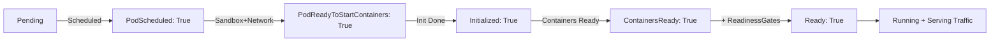

>Условия пода (Pod Conditions) — это детализированные индикаторы состояния, которые дополняют высокоуровневую фазу (`Pending`, `Running` и т.д.) и позволяют контроллерам и операторам принимать точные решения.

# Условия пода (Pod Conditions) в Kubernetes

> 📌 **Pod Conditions** = массив детализированных статусов в `status.conditions`, которые описывают конкретные аспекты состояния пода. В отличие от `phase` (высокоуровнево), условия отвечают на вопросы: «запланирован ли под?», «готовы ли контейнеры?», «идёт ли изменение размера?». Критичны для контроллеров, операторов и отладки.

---

## 🔹 Зачем нужны условия (vs Phase)

| Аспект | `status.phase` | `status.conditions` |
|--------|---------------|------------------|
| **Уровень** | Высокоуровневый (5 значений) | Детализированный (массив условий) |
| **Назначение** | Быстрая оценка: «на каком этапе под?» | Точное понимание: «что именно не так/готово?» |
| **Гибкость** | Фиксированный набор | Расширяемый: можно добавлять кастомные условия |
| **Использование** | Человек, `kubectl get pods` | Контроллеры, операторы, `kubectl describe`, автоматизация |

```
Пример: под в фазе "Running", но не готов к трафику

status:
  phase: Running          # ← высокоуровнево: «вроде работает»
  conditions:
  - type: Ready
    status: "False"       # ← детально: «но трафик принимать не может!»
    reason: ContainersNotReady
    message: "containers with unready status: [app]"
```

> 💡 **Ключевая идея**: `phase` — для человека, `conditions` — для машин и точной отладки.

---

## 🔹 Структура условия (PodCondition)

Каждый элемент в `status.conditions` имеет стандартную структуру:

| Поле | Тип | Описание | Пример |
|------|-----|----------|--------|
| **`type`** | string | Идентификатор условия | `Ready`, `PodScheduled`, `www.example.com/feature-1` |
| **`status`** | string | Значение: `"True"`, `"False"`, `"Unknown"` | `"True"` |
| **`lastProbeTime`** | timestamp | Когда последний раз проверялось условие | `null` (для большинства встроенных) |
| **`lastTransitionTime`** | timestamp | Когда условие сменило значение | `"2024-06-05T10:00:00Z"` |
| **`reason`** | string | Краткая машинно-читаемая причина изменения | `ContainersNotReady`, `NodeUnderPressure` |
| **`message`** | string | Человекочитаемое описание | `"containers with unready status: [app]"` |
| **`observedGeneration`** | integer | `.metadata.generation` на момент обновления статуса | `1` |

```yaml
# Пример условия в YAML
- type: Ready
  status: "False"
  lastProbeTime: null
  lastTransitionTime: "2024-06-05T10:00:00Z"
  reason: ContainersNotReady
  message: "containers with unready status: [app]"
  observedGeneration: 1
```

> ⚠️ **Важно**: `observedGeneration` помогает отличить «свежий» статус от устаревшего — если `generation` пода изменился, а `observedGeneration` нет → статус может быть неактуален.

---

## 🔹 Встроенные условия: жизненный цикл

Kubelet устанавливает эти условия по мере прохождения подом этапов жизни.

### 🔄 Порядок и назначение

| Условие | Когда устанавливается | Что означает |
|---------|----------------------|-------------|
| **`PodScheduled`** | После успешного планирования | Под привязан к конкретной ноде (`spec.nodeName` установлен) |
| **`PodReadyToStartContainers`** | После создания sandbox и настройки сети | Среда выполнения готова к загрузке образов и запуску контейнеров |
| **`Initialized`** | После завершения всех init-контейнеров | Подготовка завершена, можно запускать основные контейнеры |
| **`ContainersReady`** | Когда все контейнеры прошли `readinessProbe` | Контейнеры готовы обрабатывать запросы |
| **`Ready`** | Когда `ContainersReady=True` + все `readinessGates=True` | Под готов к трафику, добавлен в балансировку сервисов |



### 🔍 Пример вывода `kubectl get pod -o yaml`

```yaml
status:
  conditions:
  - type: PodScheduled
    status: "True"
    lastTransitionTime: "2024-06-05T08:52:21Z"
    
  - type: PodReadyToStartContainers
    status: "True"
    lastTransitionTime: "2024-06-05T08:52:45Z"
    
  - type: Initialized
    status: "True"
    lastTransitionTime: "2024-06-05T08:53:10Z"
    
  - type: ContainersReady
    status: "True"
    lastTransitionTime: "2024-06-05T08:53:45Z"
    
  - type: Ready
    status: "True"
    lastTransitionTime: "2024-06-05T08:53:45Z"
```

> 💡 **`PodReadyToStartContainers`** (β с 1.29, включено по умолчанию):
> - Заменяет старое название `PodHasNetwork`
> - Устанавливается в `False`, если sandbox уничтожен (перезагрузка ноды, восстановление после сбоя)
> - Позволяет контроллерам точно отслеживать, когда под действительно готов к запуску контейнеров

---

## 🔹 Встроенные условия: события и операции

Эти условия не являются частью стандартного жизненного цикла — они устанавливаются в ответ на специфические события.

### 🚨 `DisruptionTarget`: под будет удалён из-за прерывания

| `reason` | Когда устанавливается | Описание |
|----------|----------------------|----------|
| `PreemptionByScheduler` | Вытеснение по приоритету | Более важный под нуждается в ресурсах → этот будет удалён |
| `DeletionByTaintManager` | Вытеснение из-за тейнта | Нода получила `NoExecute` тейнт, под его не толерирует |
| `EvictionByEvictionAPI` | Ручное или автоматическое вытеснение | Вызов API `/eviction` (например, при дренировании ноды) |
| `DeletionByPodGC` | Удаление «осиротевшего» пода | Под привязан к несуществующей ноде → сборщик мусора удаляет |
| `TerminationByKubelet` | Локальное вытеснение на ноде | Нода перегружена (память/диск) → kubelet эвиктит поды |

```bash
# Проверить, помечен ли под на удаление
kubectl get pod my-pod -o jsonpath='{.status.conditions[?(@.type=="DisruptionTarget")]}'

# Пример вывода, если условие установлено:
{
  "type": "DisruptionTarget",
  "status": "True",
  "reason": "EvictionByEvictionAPI",
  "message": "Pod ephemeral storage usage exceeds threshold"
}
```

> ⚠️ **Важно**: `DisruptionTarget` ≠ гарантированное удаление. Плоскость управления может передумать, если причина устранена. Но это сигнал: «будь готов к удалению».

### 📏 `PodResizePending` / `PodResizeInProgress`: изменение размера ресурсов

| Условие | Когда устанавливается | `reason` значения |
|---------|----------------------|-----------------|
| **`PodResizePending`** | Запрос на resize принят, но не может быть выполнен сразу | `Infeasible` (невозможно на этой ноде), `Deferred` (попробуем позже) |
| **`PodResizeInProgress`** | Kubelet применяет изменения ресурсов к работающим контейнерам | `Error` (если что-то пошло не так) |

```yaml
# Пример: запрос на увеличение памяти отложен
- type: PodResizePending
  status: "True"
  reason: Deferred
  message: "Insufficient memory on node; waiting for other pods to terminate"
  lastTransitionTime: "2024-06-05T10:00:00Z"
```

```bash
# Отследить прогресс изменения размера
watch -n 5 'kubectl get pod my-pod -o jsonpath="{.status.conditions[?(@.type==\"PodResizeInProgress\")].status}{"\n"}"'
```

> 🧩 **Статус**: in-place resize стабилен с 1.35; условия `PodResize*` — часть этого механизма.

---

## 🔹 Пользовательские условия: Readiness Gates

Приложение может добавить свои собственные условия готовности через `spec.readinessGates`.

### 🎯 Как это работает

```yaml
spec:
  readinessGates:
  - conditionType: "www.example.com/database-connected"  # ← кастомное условие
  - conditionType: "www.example.com/cache-warmed"
  
status:
  conditions:
  - type: Ready
    status: "False"
    reason: ReadinessGatesNotReady
    message: "conditions not met: [www.example.com/database-connected]"
    
  - type: "www.example.com/database-connected"
    status: "True"   # ← приложение само обновляет это через PATCH /status
    lastTransitionTime: "2024-06-05T10:05:00Z"
    
  - type: "www.example.com/cache-warmed"
    status: "False"  # ← ещё не готово
    lastTransitionTime: "2024-06-05T10:00:00Z"
```

### 🔄 Правила оценки готовности

```
Под считается Ready ТОЛЬКО ЕСЛИ:
1. Все контейнеры готовы (ContainersReady=True)
   И
2. Все условия из readinessGates имеют status="True"

Если хотя бы одно условие из (2) = False → Ready=False, даже если контейнеры готовы.
```

### ⚙️ Как приложение обновляет условия

```bash
# Приложение внутри пода обновляет свой статус через PATCH
PATCH /api/v1/namespaces/default/pods/my-pod/status
Content-Type: application/merge-patch+json

{
  "status": {
    "conditions": [
      {
        "type": "www.example.com/cache-warmed",
        "status": "True",
        "lastTransitionTime": "2024-06-05T10:10:00Z"
      }
    ]
  }
}
```

> 💡 **Практика**: используй readiness gates, когда готовность зависит от внешних факторов (подключение к БД, загрузка конфигурации, прогрев кэша), которые не видны через стандартные зонды.

---

## 🔹 Практика: работа с условиями через kubectl

### 👁️ Просмотр условий

```bash
# Все условия пода в компактном виде
kubectl get pod my-pod -o jsonpath='{range .status.conditions[*]}{.type}{"="}{.status}{" ("}{.reason}{")\n"}{end}'

# Только условие Ready
kubectl get pod my-pod -o jsonpath='{.status.conditions[?(@.type=="Ready")].status}'

# Детальная информация по условию
kubectl get pod my-pod -o jsonpath='{.status.conditions[?(@.type=="Ready")]}{.message}'

# Условия в формате YAML (для копирования в отчёт)
kubectl get pod my-pod -o yaml | yq '.status.conditions'
```

### 🔍 Фильтрация по условиям

```bash
# Найти все поды, которые не готовы (Ready=False)
kubectl get pods -A --field-selector=status.conditions.type=Ready,status.conditions.status=False

# Найти поды, ожидающие изменения размера
kubectl get pods -A -o json | jq -r '
  .items[] | 
  select(.status.conditions[]? | select(.type=="PodResizePending" and .status=="True")) | 
  .metadata.name'

# Найти поды, помеченные на удаление (DisruptionTarget)
kubectl get pods -A -o json | jq -r '
  .items[] | 
  select(.status.conditions[]? | select(.type=="DisruptionTarget")) | 
  .metadata.name + " (" + .status.conditions[]? | select(.type=="DisruptionTarget") | .reason + ")"'
```

### 🛠️ Обновление пользовательских условий (для операторов)

```bash
# Обновить кастомное условие готовности
kubectl patch pod my-pod --subresource=status --type=merge -p '{
  "status": {
    "conditions": [
      {
        "type": "www.example.com/database-connected",
        "status": "True",
        "lastTransitionTime": "'"$(date -u +%Y-%m-%dT%H:%M:%SZ)"'"
      }
    ]
  }
}'

# Проверить, что обновление применилось
kubectl get pod my-pod -o jsonpath='{.status.conditions[?(@.type=="www.example.com/database-connected")]}'
```

> ⚠️ **Важно**: обновлять `status.conditions` можно только через `--subresource=status` или клиентские библиотеки. Обычный `kubectl apply/patch` не работает со статусом.

---

## 🔹 Отладка: интерпретация условий

### 🚨 Под не переходит в `Ready=True`

```bash
# 1. Проверить все условия
kubectl get pod my-pod -o jsonpath='{range .status.conditions[*]}{.type}{"="}{.status}{" ("}{.reason}{")\n"}{end}'

# 2. Если ContainersReady=False → проблема в readinessProbe
kubectl describe pod my-pod | grep -A10 'Readiness'

# 3. Если есть readinessGates → проверить, какие из них не выполнены
kubectl get pod my-pod -o jsonpath='{.spec.readinessGates}'
kubectl get pod my-pod -o jsonpath='{.status.conditions[?(@.type=="www.example.com/*")]}'

# 4. Проверить, не блокирует ли изменение размера
kubectl get pod my-pod -o jsonpath='{.status.conditions[?(@.type=="PodResizePending")].reason}'
```

### 🔄 Условие «мигает» (True ↔ False)

```bash
# Проверить историю переходов
kubectl get pod my-pod -o jsonpath='{range .status.conditions[*]}{.type}{" lastTransition: "}{.lastTransitionTime}{"\n"}{end}'

# Посмотреть события, связанные с изменениями
kubectl get events --field-selector involvedObject.name=my-pod --sort-by='.lastTimestamp' | tail -20

# Проверить, не перезапускается ли kubelet (может сбрасывать некоторые условия)
journalctl -u kubelet | grep -i "restarting\|condition" | tail -10
```

### 🧩 Кастомное условие не обновляется

```bash
# 1. Проверить права доступа сервисного аккаунта пода
kubectl auth can-i patch pods/status --as=system:serviceaccount:default:my-app-sa

# 2. Проверить, корректный ли формат имени условия (должен быть как ключ метки)
#    Допустимо: "example.com/my-check", недопустимо: "MyCheck", "my_check"

# 3. Проверить, что приложение действительно отправляет PATCH с правильным Content-Type
#    Логи приложения или tcpdump на стороне API Server
```

---

## 🔹 Чек-лист: работа с условиями пода

### ✅ При проектировании приложения
```bash
# • Используй readinessProbe для базовой проверки готовности
# • Добавляй readinessGates, если готовность зависит от внешних факторов (БД, кэш, конфигурация)
# • Обновляй кастомные условия через /status subresource, а не через обычные поля
# • Логируй переходы условий: это упростит отладку в production
```

### ✅ При написании оператора/контроллера
```bash
# • Читай `status.conditions`, а не только `status.phase` — это даёт больше контекста
# • Проверяй `observedGeneration`, чтобы не работать с устаревшим статусом
# • При обновлении условий: всегда устанавливай `lastTransitionTime` при смене `status`
# • Обрабатывай `DisruptionTarget`: если под помечен на удаление — не начинай долгих операций
```

### ✅ При отладке проблем
```bash
# 1. Начни с общего: kubectl describe pod <name> | grep -A20 'Conditions'
# 2. Сфокусируйся на условии, которое не в желаемом состоянии
# 3. Проверь `reason` и `message` — они часто содержат подсказку
# 4. Сравни `lastTransitionTime` с событиями: что произошло в этот момент?
# 5. Если условие кастомное — проверь логи приложения, которое должно его обновлять
```

### ✅ Для мониторинга и алертинга
```bash
# Алерт: поды, которые долго не становятся готовыми
# (Ready=False более 5 минут после создания)
kube_pod_status_ready{status="false"} * on(pod) group_right() 
  (time() - kube_pod_created) > 300

# Алерт: частые переходы условия (мигание)
# (более 3 переходов Ready за 10 минут)
changes(kube_pod_status_ready[10m]) > 3

# Алерт: поды с отложенным изменением размера
kube_pod_status_condition{condition="PodResizePending", status="true"}

# Дашборд: прогресс инициализации пода
# (визуализация перехода условий: Scheduled → Initialized → ContainersReady → Ready)
```

### ❌ Чего избегать
```bash
# ❌ Не полагайся только на `status.phase` для принятия решений в автоматизации
#   → используй `status.conditions` для точности

# ❌ Не обновляй `status.conditions` без установки `lastTransitionTime`
#   → это сломает логику отслеживания изменений

# ❌ Не игнорируй `DisruptionTarget` в долгоживущих операциях
#   → под может быть удалён в любой момент, если условие установлено

# ❌ Не создавай кастомные условия с именами, не соответствующими формату ключей меток
#   → API Server отклонит такие условия

# ❌ Не обновляй условия чаще, чем это необходимо
#   → каждое обновление — запись в etcd; избыточные обновления создают нагрузку
```

---

## 🔹 Ключевые выводы

1. **Условия = детализация фазы**: `phase` говорит «где», `conditions` — «почему и что именно».
2. **Жизненный цикл через условия**: `PodScheduled` → `PodReadyToStartContainers` → `Initialized` → `ContainersReady` → `Ready`.
3. **Readiness Gates = расширенная готовность**: приложение может добавить свои критерии готовности через кастомные условия.
4. **DisruptionTarget = предупреждение об удалении**: не игнорируй это условие в долгоживущих операциях.
5. **Resize условия = отслеживание in-place изменений**: `PodResizePending` / `InProgress` показывают прогресс масштабирования ресурсов.
6. **`observedGeneration` — защита от устаревших данных**: всегда сверяй с `metadata.generation` при принятии решений.

> 💡 **Финальный совет**: при отладке пода всегда смотри на `status.conditions` — это самый богатый источник информации о том, что на самом деле происходит с твоим приложением.
