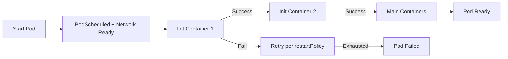

>Инициализирующие контейнеры (Init Containers) — это мощный механизм для подготовки окружения перед запуском основного приложения в поде.

# Инициализирующие контейнеры (Init Containers) в Kubernetes

> 📌 **Init Container** = специальный контейнер, который запускается **до** основных контейнеров пода и **должен успешно завершиться**. Используется для подготовки: ожидание сервисов, настройка конфигов, миграции БД, загрузка секретов. Не поддерживает зонды, работает последовательно.

---

## 🔹 Что такое Init Container

| Аспект | Описание |
|--------|----------|
| **Определение** | Контейнер, который запускается и **обязательно завершается** до старта основных контейнеров пода |
| **Назначение** | Подготовка окружения: ожидание зависимостей, генерация конфигов, миграции, загрузка данных |
| **Порядок выполнения** | Строго последовательный: каждый init-контейнер должен завершиться успешно перед запуском следующего |
| **Перезапуск** | При сбое перезапускается согласно `restartPolicy` пода; если `OnFailure`/`Never` и сбой повторяется → под переходит в `Failed` |



> 💡 **Ключевая идея**: init-контейнеры — это «подготовительный этап». Если подготовка не удалась — основное приложение не запустится, что предотвращает ошибки в рантайме.

---

## 🔹 Init Containers vs Обычные контейнеры

| Характеристика | **Init Container** | **App Container** |
|---------------|-------------------|-----------------|
| **Время запуска** | До основных контейнеров, последовательно | После всех init-контейнеров, параллельно |
| **Завершение** | Должен завершиться (успех/ошибка) | Работает постоянно (или до завершения задачи) |
| **Зонды** | ❌ Не поддерживает `livenessProbe`, `readinessProbe`, `startupProbe` | ✅ Поддерживает все типы зондов |
| **Lifecycle hooks** | ❌ Не поддерживает `postStart`, `preStop` | ✅ Поддерживает |
| **Влияние на Ready** | Под не может стать `Ready`, пока все init не завершатся | `Ready` зависит от `readinessProbe` контейнеров |
| **Ресурсы** | Эффективные = максимум из всех init-контейнеров | Сумма запросов всех app-контейнеров + максимум init |

### 🔄 Порядок выполнения нескольких init-контейнеров

```yaml
spec:
  initContainers:
  - name: init-1
    image: busybox
    command: ['sh', '-c', 'echo "Step 1" && sleep 5']  # ← Запустится первым
  - name: init-2
    image: busybox
    command: ['sh', '-c', 'echo "Step 2" && sleep 5']  # ← Запустится после успеха init-1
  - name: init-3
    image: busybox
    command: ['sh', '-c', 'echo "Step 3" && sleep 5']  # ← Запустится после успеха init-2
  
  containers:
  - name: app
    image: my-app:1.0  # ← Запустится только после успеха всех трёх init
```

> ⚠️ **Важно**: если `init-2` упадёт — `init-3` и основные контейнеры **не запустятся**, пока `init-2` не завершится успешно (или не исчерпает попытки перезапуска).

---

## 🔹 Init Containers vs Sidecar Containers

| Аспект | **Init Container** | **Sidecar Container** |
|--------|-------------------|---------------------|
| **Жизненный цикл** | Запускается → завершается → следующий | Запускается до/параллельно с основным → работает всю жизнь пода |
| **Назначение** | Подготовка, однократные задачи | Вспомогательные сервисы: логи, прокси, мониторинг |
| **restartPolicy** | Наследует политику пода (`Always`/`OnFailure`/`Never`) | Всегда `Always` (игнорирует политику пода) |
| **Зонды** | Не поддерживает | Поддерживает все типы зондов |
| **Пример** | Ожидание БД, генерация конфига, миграция | Fluentd для логирования, Envoy для service mesh |

```yaml
# Init container: подготовка
spec:
  initContainers:
  - name: wait-for-db
    image: busybox
    command: ['sh', '-c', 'until nc -z database 5432; do sleep 2; done']
    # ← Завершится, когда БД станет доступна

# Sidecar container: постоянная помощь
spec:
  initContainers:
  - name: log-shipper
    image: fluentd:latest
    restartPolicy: Always  # ← Ключевое: работает как sidecar
    volumeMounts:
    - name: logs
      mountPath: /var/log/app
  containers:
  - name: app
    image: my-app:1.0
    volumeMounts:
    - name: logs
      mountPath: /var/log/app
```

> 💡 **Правило**: если контейнер должен работать **параллельно** с приложением — это sidecar (init + `restartPolicy: Always`). Если только **подготовить** что-то перед стартом — это init container.

---

## 🔹 Сценарии использования

### 🎯 Типичные паттерны

| Сценарий | Решение через init container | Пример команды |
|----------|----------------------------|---------------|
| **⏳ Ожидание сервиса/БД** | Цикл проверки доступности | `until nslookup mydb; do sleep 2; done` |
| **🔧 Генерация конфига** | Шаблонизация с подстановкой переменных | `envsubst < config.tmpl > config.yaml` |
| **🗄️ Миграция БД** | Запуск миграций перед стартом приложения | `python manage.py migrate` |
| **📦 Загрузка данных** | Клонирование репо, скачивание артефактов | `git clone <repo> /data` |
| **🔐 Подготовка секретов** | Расшифровка, распаковка, установка прав | `decrypt-secrets.sh && chmod 600 /secrets/*` |
| **🧹 Очистка/проверка** | Валидация томов, удаление временных файлов | `find /data -name "*.tmp" -delete` |

### 💡 Преимущества подхода

```
• Изоляция инструментов: не нужно добавлять sed/awk/curl в образ приложения
• Разделение ответственности: образ приложения = только приложение, init = инфраструктура
• Безопасность: init-контейнер может иметь доступ к секретам, которых нет у app-контейнера
• Блокировка запуска: приложение не стартует, пока не выполнены все предварительные условия
• Идемпотентность: init-код можно перезапускать без побочных эффектов
```

---

## 🔹 Пример: ожидание сервисов перед запуском приложения

```yaml
# myapp-pod.yaml
apiVersion: v1
kind: Pod
metadata:
  name: myapp-pod
  labels:
    app.kubernetes.io/name: MyApp
spec:
  # Основной контейнер приложения
  containers:
  - name: myapp-container
    image: busybox:1.28
    command: ['sh', '-c', 'echo "App is running!" && sleep 3600']
  
  # Init-контейнеры: ждут доступности сервисов
  initContainers:
  - name: init-myservice
    image: busybox:1.28
    command:
    - sh
    - -c
    - |
      echo "Waiting for myservice..."
      until nslookup myservice.$(cat /var/run/secrets/kubernetes.io/serviceaccount/namespace).svc.cluster.local; do
        echo "Waiting for myservice..."
        sleep 2
      done
  
  - name: init-mydb
    image: busybox:1.28
    command:
    - sh
    - -c
    - |
      echo "Waiting for mydb..."
      until nslookup mydb.$(cat /var/run/secrets/kubernetes.io/serviceaccount/namespace).svc.cluster.local; do
        echo "Waiting for mydb..."
        sleep 2
      done
```

```bash
# Применить и проверить
kubectl apply -f myapp-pod.yaml
kubectl get pod myapp-pod
# NAME        READY   STATUS     RESTARTS   AGE
# myapp-pod   0/1     Init:0/2   0          30s

# Следить за прогрессом
watch -n 2 'kubectl get pod myapp-pod -o jsonpath="{.status.initContainerStatuses[*].state}{"\n"}"'

# Посмотреть логи init-контейнера
kubectl logs myapp-pod -c init-myservice
kubectl logs myapp-pod -c init-mydb

# Когда сервисы станут доступны:
kubectl get pod myapp-pod
# NAME        READY   STATUS    RESTARTS   AGE
# myapp-pod   1/1     Running   0          2m
```

---

## 🔹 Ресурсы и QoS: как считаются запросы/лимиты

### 📊 Правила расчёта эффективных ресурсов пода

```
Эффективный запрос/лимит пода = 
  МАКСИМУМ(
    • Сумма запросов/лимитов всех app-контейнеров,
    • Максимальный запрос/лимит среди всех init-контейнеров
  )
```

### 🧮 Пример расчёта

```yaml
spec:
  initContainers:
  - name: init-1
    resources:
      requests: { cpu: "500m", memory: "256Mi" }
      limits:   { cpu: "1",    memory: "512Mi" }
  - name: init-2
    resources:
      requests: { cpu: "200m", memory: "128Mi" }  # ← Меньше, чем init-1
      limits:   { cpu: "400m", memory: "256Mi" }
  
  containers:
  - name: app-1
    resources:
      requests: { cpu: "300m", memory: "200Mi" }
      limits:   { cpu: "600m", memory: "400Mi" }
  - name: app-2
    resources:
      requests: { cpu: "200m", memory: "150Mi" }
      limits:   { cpu: "400m", memory: "300Mi" }

# Расчёт:
# CPU requests: max(500m [init], 300m+200m=500m [app]) = 500m
# CPU limits:   max(1 [init], 600m+400m=1 [app]) = 1
# Memory requests: max(256Mi [init], 200Mi+150Mi=350Mi [app]) = 350Mi
# Memory limits:   max(512Mi [init], 400Mi+300Mi=700Mi [app]) = 700Mi

# QoS класса пода определяется по эффективным значениям:
# • Guaranteed: если у всех контейнеров запросы = лимиты
# • Burstable: если есть запросы < лимиты
# • BestEffort: если нет ни запросов, ни лимитов
```

> 💡 **Практика**: init-контейнеры могут «зарезервировать» больше ресурсов, чем нужно приложению, но только на время инициализации. Планировщик учитывает **максимум**, поэтому не завышай лимиты init-контейнеров без необходимости.

---

## 🔹 Отладка и мониторинг init-контейнеров

### 🔍 Проверка состояния

```bash
# Посмотреть статус init-контейнеров
kubectl get pod my-pod -o jsonpath='{.status.initContainerStatuses[*].name}{"\t"}{.state}{"\n"}'

# Детальная информация
kubectl describe pod my-pod | grep -A20 'Init Containers:'

# Проверить, на каком этапе инициализации под
kubectl get pod my-pod -o jsonpath='{.status.phase}{"\t"}{.status.conditions[?(@.type=="Initialized")].status}'
```

### 📋 Частые статусы и их значение

| Статус в `kubectl get pods` | Что означает | Что проверять |
|----------------------------|-------------|--------------|
| **`Init:0/3`** | Запущено 0 из 3 init-контейнеров | Логи первого init-контейнера, события пода |
| **`Init:1/3`** | Первый завершился, запускается второй | Логи второго init-контейнера |
| **`Init:Error`** | Init-контейнер упал с ошибкой | `kubectl logs <pod> -c <init-name>`, события |
| **`Init:CrashLoopBackOff`** | Init-контейнер падает и перезапускается | Причины сбоя в логах, ресурсы, зависимости |
| **`PodInitializing`** | Init-контейнеры работают, основные ждут | Нормальное состояние, следить за прогрессом |

### 🛠️ Команды для отладки

```bash
# Логи конкретного init-контейнера
kubectl logs my-pod -c init-myservice

# Логи предыдущей попытки (если контейнер перезапускался)
kubectl logs my-pod -c init-myservice --previous

# События, связанные с init-контейнерами
kubectl describe pod my-pod | grep -A10 'Events:' | grep -i init

# Проверить, не исчерпаны ли попытки перезапуска
kubectl get pod my-pod -o jsonpath='{.status.initContainerStatuses[*].restartCount}'

# Если под завис в Init: проверить сетевую связность из init-контейнера
kubectl exec -it my-pod -c init-myservice -- nslookup myservice
```

### 🧪 Тестирование init-контейнера локально

```bash
# Скопировать команду из манифеста и запустить в Docker
docker run --rm -it busybox:1.28 sh -c 'until nslookup myservice; do sleep 2; done'

# Или протестировать скрипт подготовки конфига
cat > test-init.sh <<'EOF'
#!/bin/sh
echo "Generating config..."
envsubst < config.tmpl > config.yaml
echo "Done"
EOF
chmod +x test-init.sh
docker run --rm -v $(pwd):/work -w /work busybox:1.28 ./test-init.sh
```

---

## 🔹 Лучшие практики и ограничения

### ✅ Что делать

```bash
# • Делай init-код идемпотентным: он может выполняться несколько раз
#   (перезапуск пода, сбой ноды, обновление образа)

# • Ограничивай время выполнения: используй таймауты в циклах ожидания
#   for i in {1..30}; do nslookup mydb && break || sleep 2; done

# • Логируй прогресс: echo "Waiting for DB..." поможет в отладке
#   и покажет, на каком этапе завис под

# • Используй отдельные образы для init: не раздувай образ приложения
#   init: busybox/curl/alpine, app: твой минимальный образ

# • Проверяй зависимости в init, а не в приложении:
#   приложение должно запускаться, когда окружение уже готово

# • Тестируй init-контейнеры изолированно:
#   docker run --rm my-init-image <command>
```

### ❌ Чего избегать

```bash
# ❌ Не делай init-контейнеры слишком долгими (>5-10 минут)
#   → под может быть помечен как проблемный, начнутся эвикшны

# ❌ Не полагайся на состояние файловой системы между перезапусками
#   → emptyDir очищается при пересоздании пода, hostPath — опасно

# ❌ Не используй readiness/liveness зонды в init-контейнерах
#   → они игнорируются; готовность init = успешное завершение

# ❌ Не храни чувствительные данные в логах init-контейнеров
#   → логи могут быть доступны пользователям с read-доступом к подам

# ❌ Не меняй имя или порядок init-контейнеров в уже запущенном Deployment
#   → это может привести к непредсказуемому поведению при обновлении
```

### ⚙️ Настройка таймаутов и перезапусков

```yaml
spec:
  # Ограничить общее время жизни пода (включая init)
  activeDeadlineSeconds: 600  # 10 минут максимум
  
  # Политика перезапуска (применяется к init при сбое)
  restartPolicy: OnFailure  # или Always / Never
  
  initContainers:
  - name: init-with-timeout
    image: busybox
    command:
    - sh
    - -c
    - |
      # Ждать сервис не более 60 секунд (30 попыток * 2с)
      for i in {1..30}; do
        nslookup myservice && exit 0
        echo "Waiting... ($i/30)"
        sleep 2
      done
      echo "Timeout waiting for myservice"
      exit 1  # ← Сбой после таймаута
```

---

## 🔹 Чек-лист: работа с init-контейнерами

### ✅ При проектировании
```bash
# • Определи, что действительно нужно делать до запуска приложения
#   (ожидание, конфигурация, миграции) — это кандидаты на init

# • Раздели логику: один init-контейнер = одна задача
#   → проще отлаживать, перезапускать, переиспользовать

# • Используй минимальные образы для init (busybox, alpine)
#   → быстрее скачиваются, меньше поверхность атаки

# • Проверяй идемпотентность: что будет, если init запустится дважды?
#   (файл уже создан, миграция уже применена и т.д.)
```

### ✅ При написании манифестов
```bash
# • Давай понятные имена init-контейнерам: init-wait-db, init-gen-config
# • Логируй ключевые этапы: echo "Step 1: checking DB..."
# • Обрабатывай ошибки: exit 1 при неудаче, чтобы под не запускался с плохим окружением
# • Указывай ресурсы: даже минимальные requests, чтобы планировщик корректно размещал под
```

### ✅ При отладке
```bash
# 1. Под висит в Init:0/N:
kubectl describe pod <name> | grep -A5 'Events:'
kubectl logs <name> -c <first-init-container>

# 2. Init-контейнер падает в CrashLoopBackOff:
kubectl logs <name> -c <init-name> --previous
kubectl describe pod <name> | grep -A10 'State:'

# 3. Инициализация проходит, но приложение не стартует:
#    Проверь, что все init завершены:
kubectl get pod <name> -o jsonpath='{.status.conditions[?(@.type=="Initialized")].status}'

# 4. Проблемы с сетью в init-контейнере:
kubectl exec -it <name> -c <init-name> -- nslookup <service>
kubectl exec -it <name> -c <init-name> -- cat /etc/resolv.conf
```

### ✅ Для мониторинга и алертинга
```bash
# Алерт: поды, которые долго инициализируются (>5 минут в Init)
kube_pod_status_phase{phase="Pending"} * on(pod) group_right()
  (time() - kube_pod_created) > 300

# Алерт: частые сбои init-контейнеров
sum by (pod, container) (rate(kube_pod_init_container_status_restarts_total[5m])) > 0.5

# Дашборд: прогресс инициализации по неймспейсу
# (количество подов в статусе Init:N/M)
```

---

## 🔹 Ключевые выводы

1. **Init container = подготовительный этап**: должен завершиться успешно, иначе приложение не запустится.
2. **Последовательное выполнение**: каждый init ждёт успеха предыдущего; сбой блокирует весь под.
3. **Нет зондов, нет lifecycle hooks**: готовность init = успешный выход (код 0).
4. **Ресурсы считаются по максимуму**: планировщик резервирует больше ресурсов на время инициализации.
5. **Идемпотентность критична**: init-код может выполняться несколько раз — будь к этому готов.
6. **Отделяй инфраструктуру от приложения**: init-контейнеры позволяют не раздувать образ приложения утилитами настройки.

> 💡 **Финальный совет**: используй init-контейнеры для «грязной работы» перед стартом, но не превращай их в полноценные скрипты развёртывания. Если логика становится сложной — возможно, это отдельная задача (Job) или часть CI/CD, а не init-контейнер.