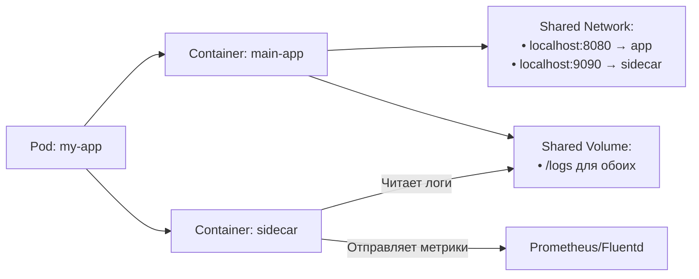

>Контейнеры-сайдкары (Sidecar Containers) — это паттерн расширения функциональности основного приложения через вспомогательные контейнеры в том же поде.

# Контейнеры-сайдкары (Sidecar Containers) в Kubernetes

> 📌 **TL;DR**: **Sidecar** = вспомогательный контейнер в том же поде, который работает **параллельно** с основным приложением. В K8s реализуется как `initContainer` с `restartPolicy: Always`. Предоставляет дополнительные функции (логи, прокси, синхронизация) без изменения кода приложения.

---

## 🔹 Что такое Sidecar Container

| Аспект | Описание |
|--------|----------|
| **Определение** | Вспомогательный контейнер в поде, работающий параллельно с основным приложением на протяжении всей его жизни |
| **Назначение** | Расширение функциональности: логирование, мониторинг, проксирование, синхронизация данных, безопасность |
| **Реализация в K8s** | `initContainers` + `restartPolicy: Always` (стабильно с 1.33) |
| **Изоляция** | Разделяет сеть, хранилище, но имеет независимый жизненный цикл (запуск/остановка/перезапуск) |



> 💡 **Аналогия**: как прицеп к мотоциклу — движется вместе с основным транспортным средством, но выполняет свою функцию (перевозит груз), не мешая водителю.

---

## 🔹 Как Kubernetes реализует сайдкары

### 🔄 Механизм: init container + `restartPolicy: Always`

```yaml
spec:
  initContainers:
  - name: log-shipper
    image: fluentd:latest
    restartPolicy: Always  # ← Ключевое: это делает контейнер сайдкаром!
    volumeMounts:
    - name: logs
      mountPath: /var/log/app
  
  containers:
  - name: main-app
    image: my-app:1.0
    volumeMounts:
    - name: logs
      mountPath: /var/log/app
```

### 🎯 Почему через `initContainers`?

| Причина | Объяснение |
|---------|-----------|
| **📋 Порядок запуска** | Sidecar запускается до основного контейнера (как init), но не завершается |
| **🔗 Зависимости** | Можно комбинировать обычные init-контейнеры и сайдкары в одном списке |
| **🧩 Гибкость** | Sidecar может иметь `readinessProbe`, `livenessProbe` — обычные init-контейнеры не могут |
| **🔄 Перезапуск** | При сбое sidecar перезапускается независимо от основного приложения |

### 📊 Статус запуска: поле `started`

```yaml
status:
  initContainerStatuses:
  - name: log-shipper
    started: true  # ← Sidecar запущен и работает
    state:
      running:
        startedAt: "2024-06-05T10:00:00Z"
```

> 💡 **Важно**: как только `started: true` для sidecar, kubelet переходит к запуску следующего init-контейнера или основных контейнеров.

---

## 🔹 Жизненный цикл сайдкара

### 🔄 Порядок запуска и завершения

```
Запуск (строго последовательный):
1. Обычные init-контейнеры (по порядку)
2. Sidecar-контейнеры (по порядку, каждый с restartPolicy: Always)
3. Основные контейнеры приложения (параллельно)

Завершение (обратный порядок для sidecar):
1. Основные контейнеры получают SIGTERM → завершаются
2. Sidecar-контейнеры получают SIGTERM в ОБРАТНОМ порядке определения
3. Если не завершили за grace period → SIGKILL
```

```mermaid
graph LR
    A[Start Pod] --> B[Init Containers (sequential)]
    B --> C[Sidecar Containers (sequential, restartPolicy: Always)]
    C --> D[App Containers (parallel)]
    
    D --> E[App receives SIGTERM]
    E --> F[Sidecars receive SIGTERM (reverse order)]
    F --> G[Cleanup complete]
```

### 🎯 Пример: почему обратный порядок завершения?

```yaml
spec:
  initContainers:
  - name: setup-config      # Обычный init: настраивает конфиг
    restartPolicy: Never    # (по умолчанию)
  - name: log-shipper      # Sidecar: отправляет логи
    restartPolicy: Always
  - name: metrics-agent    # Sidecar: собирает метрики
    restartPolicy: Always
  
  containers:
  - name: main-app
    image: my-app:1.0
```

```
При завершении пода:
1. main-app получает SIGTERM → закрывает соединения, пишет финальные логи
2. metrics-agent получает SIGTERM → отправляет финальные метрики
3. log-shipper получает SIGTERM → отправляет финальные логи
4. Все контейнеры завершены → под удалён

Почему так? Sidecar'ы должны «доставить» данные, которые основное приложение записало перед завершением.
```

---

## 🔹 Sidecar vs Init Container vs App Container

| Характеристика | **Init Container** | **Sidecar Container** | **App Container** |
|---------------|-------------------|---------------------|-----------------|
| **restartPolicy** | Наследует от пода | Всегда `Always` (игнорирует политику пода) | Наследует от пода |
| **Время жизни** | Запускается → завершается → следующий | Запускается до app → работает всю жизнь пода | Работает параллельно с sidecar |
| **Зонды** | ❌ Не поддерживает | ✅ Поддерживает все типы | ✅ Поддерживает все типы |
| **Lifecycle hooks** | ❌ Не поддерживает | ✅ Поддерживает | ✅ Поддерживает |
| **Влияние на Ready** | Под не Ready, пока все init не завершатся | `readinessProbe` sidecar влияет на `Ready` пода | `readinessProbe` app влияет на `Ready` пода |
| **Код выхода** | Должен быть 0 для успеха | Ненулевой код при завершении пода — нормально | Ненулевой код = ошибка (при `restartPolicy: Always`) |

> 💡 **Правило**: если контейнер должен работать **параллельно** с приложением и предоставлять вспомогательные функции → это sidecar (`initContainer` + `restartPolicy: Always`).

---

## 🔹 Примеры использования

### 📦 Паттерн 1: Логирование (Log Shipping)

```yaml
# main-app пишет логи в общий том, sidecar отправляет их во внешнюю систему
spec:
  volumes:
  - name: app-logs
    emptyDir: {}
  
  containers:
  - name: web-server
    image: nginx:1.25
    volumeMounts:
    - name: app-logs
      mountPath: /var/log/nginx
  
  initContainers:
  - name: fluentd-sidecar
    image: fluentd:latest
    restartPolicy: Always
    volumeMounts:
    - name: app-logs
      mountPath: /var/log/nginx
    env:
    - name: FLUENTD_CONF
      value: "nginx.conf"
```

### 🔐 Паттерн 2: Проксирование / Service Mesh

```yaml
# Sidecar-прокси обрабатывает входящий трафик, TLS, аутентификацию
spec:
  containers:
  - name: api-server
    image: my-api:1.0
    ports:
    - containerPort: 8080  # ← слушает только localhost
  
  initContainers:
  - name: envoy-proxy
    image: envoyproxy/envoy:v1.28
    restartPolicy: Always
    ports:
    - containerPort: 80    # ← внешний трафик идёт сюда
    command:
    - envoy
    - --config-path
    - /etc/envoy/envoy.yaml
    volumeMounts:
    - name: envoy-config
      mountPath: /etc/envoy
```

### 🔄 Паттерн 3: Синхронизация данных

```yaml
# Sidecar синхронизирует конфиги/секреты из внешнего источника
spec:
  volumes:
  - name: config-volume
    emptyDir: {}
  
  containers:
  - name: app
    image: my-app:1.0
    volumeMounts:
    - name: config-volume
      mountPath: /etc/app-config
      readOnly: true
  
  initContainers:
  - name: config-sync
    image: config-syncer:latest
    restartPolicy: Always
    volumeMounts:
    - name: config-volume
      mountPath: /etc/app-config
    env:
    - name: CONFIG_SOURCE
      value: "https://config-server/internal"
    - name: SYNC_INTERVAL
      value: "60s"
```

### 📊 Паттерн 4: Сбор метрик

```yaml
# Sidecar экспортирует метрики приложения в Prometheus-формате
spec:
  containers:
  - name: legacy-app
    image: legacy-app:1.0
    # Приложение не умеет экспортировать метрики
  
  initContainers:
  - name: metrics-exporter
    image: prometheus-exporter:latest
    restartPolicy: Always
    ports:
    - containerPort: 9090  # ← Prometheus скрейпит этот порт
    command:
    - /exporter
    - --app-port=8080     # ← подключается к основному приложению
    - --export-port=9090
```

---

## 🔹 Пример: полный манифест Deployment с sidecar

```yaml
# deployment-sidecar.yaml
apiVersion: apps/v1
kind: Deployment
metadata:
  name: myapp
  labels:
    app: myapp
spec:
  replicas: 3
  selector:
    matchLabels:
      app: myapp
  template:
    metadata:
      labels:
        app: myapp
    spec:
      volumes:
      - name: shared-logs
        emptyDir: {}
      
      # Основной контейнер приложения
      containers:
      - name: myapp
        image: alpine:latest
        command:
        - sh
        - -c
        - |
          while true; do
            echo "$(date): Processing request..." >> /var/log/app.log
            sleep 1
          done
        volumeMounts:
        - name: shared-logs
          mountPath: /var/log
      
      # Sidecar-контейнер: отправляет логи во внешнюю систему
      initContainers:
      - name: log-shipper
        image: alpine:latest
        restartPolicy: Always  # ← Ключевое: это sidecar!
        command:
        - sh
        - -c
        - |
          echo "Starting log shipper..."
          tail -F /var/log/app.log | while read line; do
            # В реальности: отправка в Fluentd/Cloud Logging
            echo "[SHIPPED] $line"
          done
        volumeMounts:
        - name: shared-logs
          mountPath: /var/log
        readinessProbe:
          exec:
            command:
            - sh
            - -c
            - 'test -f /var/log/app.log'
          initialDelaySeconds: 5
          periodSeconds: 10
```

```bash
# Применить и проверить
kubectl apply -f deployment-sidecar.yaml

# Проверить статус sidecar
kubectl get pod -l app=myapp -o jsonpath='{.items[*].status.initContainerStatuses[*].name}{"\t"}{.started}{"\n"}'

# Посмотреть логи sidecar
kubectl logs -l app=myapp -c log-shipper

# Проверить, что под готов (учитывает readinessProbe sidecar)
kubectl get pod -l app=myapp -o jsonpath='{.items[*].status.conditions[?(@.type=="Ready")].status}'
```

---

## 🔹 Sidecar в Job: завершение задачи

Sidecar не мешает завершению Job — когда основной контейнер завершается, Job считается выполненным.

```yaml
# job-sidecar.yaml
apiVersion: batch/v1
kind: Job
metadata:
  name: data-processor
spec:
  template:
    spec:
      volumes:
      - name: work-dir
        emptyDir: {}
      
      containers:
      - name: processor
        image: alpine:latest
        command:
        - sh
        - -c
        - |
          echo "Processing data..." > /work/result.txt
          echo "Done" >> /work/result.txt
        volumeMounts:
        - name: work-dir
          mountPath: /work
      
      initContainers:
      - name: result-uploader
        image: alpine:latest
        restartPolicy: Always  # ← sidecar
        command:
        - sh
        - -c
        - |
          echo "Watching for results..."
          tail -F /work/result.txt 2>/dev/null | while read line; do
            # В реальности: загрузка в S3/GCS
            echo "[UPLOADED] $line"
          done
        volumeMounts:
        - name: work-dir
          mountPath: /work
      
      restartPolicy: Never  # ← Job не перезапускает упавшие поды
      volumes:
      - name: work-dir
        emptyDir: {}
```

```
Жизненный цикл:
1. result-uploader (sidecar) запускается, начинает следить за файлом
2. processor запускается, пишет результат в /work/result.txt
3. processor завершается с кодом 0 → Job помечается как Successful
4. result-uploader получает SIGTERM → завершается
5. Под удаляется

Важно: sidecar не блокирует завершение Job, даже если он ещё работает.
```

---

## 🔹 Ресурсы и QoS: как считаются запросы/лимиты

### 📊 Правила расчёта эффективных ресурсов пода

```
Эффективный запрос/лимит пода = 
  СУММА(
    • Запросы/лимиты всех app-контейнеров,
    • Запросы/лимиты всех sidecar-контейнеров
  )
  +
  МАКСИМУМ(
    • Запросы/лимиты обычных init-контейнеров
  )
```

### 🧮 Пример расчёта

```yaml
spec:
  initContainers:
  - name: setup  # Обычный init (не sidecar)
    resources:
      requests: { cpu: "500m", memory: "256Mi" }
      limits:   { cpu: "1",    memory: "512Mi" }
  
  - name: log-shipper  # Sidecar
    restartPolicy: Always
    resources:
      requests: { cpu: "100m", memory: "128Mi" }
      limits:   { cpu: "200m", memory: "256Mi" }
  
  containers:
  - name: main-app
    resources:
      requests: { cpu: "300m", memory: "200Mi" }
      limits:   { cpu: "600m", memory: "400Mi" }

# Расчёт:
# • Обычные init: max(500m CPU, 256Mi memory)
# • App + Sidecar: (300m+100m=400m CPU, 200Mi+128Mi=328Mi memory)
# • Итого: CPU = max(500m, 400m) = 500m requests, 1 CPU limits
#          Memory = max(256Mi, 328Mi) = 328Mi requests, 512Mi limits

# QoS определяется по итоговым значениям:
# • Если requests == limits для всех ресурсов → Guaranteed
# • Если есть requests < limits → Burstable
# • Если нет ни requests, ни limits → BestEffort
```

> 💡 **Практика**: sidecar-контейнеры учитываются в планировании как «постоянные» потребители ресурсов — не занижай их `requests`, иначе под может не получить нужные ресурсы на ноде.

---

## 🔹 Отладка и мониторинг sidecar-контейнеров

### 🔍 Проверка состояния

```bash
# Посмотреть статус sidecar в initContainerStatuses
kubectl get pod my-pod -o jsonpath='{range .status.initContainerStatuses[*]}{.name}{"\tstarted="}{.started}{"\tstate="}{.state}{"\n"}{end}'

# Проверить, влияет ли readinessProbe sidecar на готовность пода
kubectl describe pod my-pod | grep -A10 'Conditions:' | grep Ready

# Посмотреть, в каком порядке запускались контейнеры
kubectl describe pod my-pod | grep -A5 'initContainers' -A20 'Containers'
```

### 📋 Частые проблемы и решения

| Проблема | Симптомы | Решение |
|----------|----------|---------|
| **Sidecar не запускается** | Под висит в `Init:0/N`, `kubectl describe` показывает ошибку в events | Проверить образ, права доступа к реестру, ресурсы, сетевую связность |
| **Sidecar падает в CrashLoopBackOff** | `restartCount` растёт, логи показывают ошибку | Проверить конфигурацию sidecar, зависимости, зонды, лимиты ресурсов |
| **Под не становится Ready** | `Ready: False`, но app-контейнеры работают | Проверить `readinessProbe` sidecar: возможно, он не проходит проверку |
| **Sidecar мешает завершению пода** | Под зависает в `Terminating` | Проверить, обрабатывает ли sidecar SIGTERM, не блокирует ли завершение |
| **Ресурсов не хватает** | Под не планируется, `FailedScheduling` | Увеличить `requests` для sidecar или выбрать ноду с большим количеством ресурсов |

### 🛠️ Команды для отладки

```bash
# Логи sidecar-контейнера
kubectl logs my-pod -c log-shipper

# Логи предыдущей попытки (если sidecar перезапускался)
kubectl logs my-pod -c log-shipper --previous

# Проверить, какие зонды настроены у sidecar
kubectl get pod my-pod -o jsonpath='{.spec.initContainers[?(@.restartPolicy=="Always")].readinessProbe}'

# Проверить, не блокирует ли sidecar завершение пода
kubectl describe pod my-pod | grep -A10 'Events:' | grep -i 'stopping\|terminating'

# Протестировать readinessProbe sidecar вручную
kubectl exec -it my-pod -c log-shipper -- <команда из readinessProbe.exec.command>
```

---

## 🔹 Лучшие практики

### ✅ Что делать

```bash
# • Давай понятные имена sidecar-контейнерам: log-shipper, envoy-proxy, metrics-agent
# • Настраивай readinessProbe для sidecar: под не должен считаться готовым, если sidecar не готов
# • Обрабатывай SIGTERM в sidecar: корректно завершай соединения, отправляй финальные данные
# • Используй минимальные образы для sidecar: alpine, distroless — меньше поверхность атаки
# • Логируй ключевые события в sidecar: это упростит отладку в production
# • Тестируй sidecar изолированно: docker run --rm my-sidecar-image <command>
```

### ❌ Чего избегать

```bash
# ❌ Не делай sidecar слишком «тяжёлым» по ресурсам
#   → он работает всю жизнь пода и влияет на планирование

# ❌ Не полагайся на порядок завершения без явной синхронизации
#   → если sidecar должен завершиться после app, используй preStop hook или общий файл-флаг

# ❌ Не храни чувствительные данные в логах sidecar
#   → логи могут быть доступны пользователям с read-доступом к подам

# ❌ Не обновляй образ sidecar без тестирования совместимости с app
#   → изменения в протоколе общения могут сломать взаимодействие

# ❌ Не игнорируй коды выхода sidecar при завершении пода
#   → ненулевой код при SIGTERM — нормально, но при других обстоятельствах может указывать на ошибку
```

### ⚙️ Настройка корректного завершения

```yaml
spec:
  terminationGracePeriodSeconds: 60  # ← Дать время на корректное завершение
  
  initContainers:
  - name: log-shipper
    image: fluentd:latest
    restartPolicy: Always
    lifecycle:
      preStop:
        exec:
          command:
          - sh
          - -c
          - |
            # Дождаться, пока основное приложение закроет логи
            echo "Waiting for app to finish logging..."
            sleep 10
            # Отправить финальные логи
            echo "Flushing logs..."
            kill -USR1 $(cat /var/run/fluentd.pid) 2>/dev/null || true
    readinessProbe:
      exec:
        command:
        - sh
        - -c
        - 'test -S /var/run/fluentd.sock'  # Проверка, что fluentd готов
      initialDelaySeconds: 5
      periodSeconds: 10
```

---

## 🔹 Чек-лист: работа с sidecar-контейнерами

### ✅ При проектировании
```bash
# • Определи, действительно ли нужна тесная связь: если sidecar можно вынести в отдельный под — возможно, так и стоит сделать
# • Продумай протокол взаимодействия: файлы, localhost, Unix socket — что надёжнее для твоего случая?
# • Учти порядок завершения: если sidecar должен обработать данные после app — настрой preStop или общий сигнал
# • Протестируй сценарии сбоя: что будет, если sidecar упадёт? А если app упадёт первым?
```

### ✅ При написании манифестов
```bash
# • Явно указывай `restartPolicy: Always` для sidecar в `initContainers`
# • Добавляй `readinessProbe`, если готовность sidecar критична для работы приложения
# • Указывай `resources.requests` для sidecar — планировщик должен учитывать его потребности
# • Используй `lifecycle.preStop` для корректного завершения, если sidecar должен «доставить» данные
```

### ✅ При отладке
```bash
# 1. Sidecar не запускается:
kubectl describe pod <name> | grep -A5 'Events:' | grep -i sidecar
kubectl logs <name> -c <sidecar-name>

# 2. Под не становится Ready:
kubectl get pod <name> -o jsonpath='{.status.conditions[?(@.type=="Ready")].reason}'
kubectl describe pod <name> | grep -A10 'readinessProbe'

# 3. Sidecar мешает завершению:
kubectl describe pod <name> | grep -A10 'Events:' | grep -i 'stopping\|terminating'
kubectl logs <name> -c <sidecar-name> --tail=50

# 4. Проблемы с взаимодействием app ↔ sidecar:
kubectl exec -it <name> -c app -- nc -zv localhost <port-sidecar>
kubectl exec -it <name> -c sidecar -- nc -zv localhost <port-app>
```

### ✅ Для мониторинга и алертинга
```bash
# Алерт: sidecar не готов, но app работает
kube_pod_status_ready{status="false"} * on(pod) group_right()
  kube_pod_container_status_ready{container="<sidecar-name>"} == 0

# Алерт: частые перезапуски sidecar
sum by (pod, container) (rate(kube_pod_init_container_status_restarts_total{container=~".*sidecar.*"}[5m])) > 0.5

# Алерт: sidecar не завершается после SIGTERM
# (под в Terminating дольше 2 минут)
kube_pod_status_phase{phase="Terminating"} * on(pod) group_right()
  (time() - kube_pod_deletion_timestamp) > 120

# Дашборд: статус sidecar по неймспейсу
# (сколько sidecar'ов запущено, готово, перезапускается)
```

---

## 🔹 Ключевые выводы

1. **Sidecar = вспомогательный контейнер с независимым жизненным циклом**: работает параллельно с приложением, предоставляет дополнительные функции.
2. **Реализация в K8s**: `initContainer` + `restartPolicy: Always` — простой и гибкий механизм.
3. **Порядок имеет значение**: запуск — последовательный, завершение — обратный порядок для sidecar.
4. **ReadinessProbe sidecar влияет на готовность пода**: под не считается готовым, если sidecar не готов.
5. **Ресурсы sidecar учитываются в планировании**: не занижай `requests`, иначе под может не получить нужные ресурсы.
6. **Корректное завершение критично**: обрабатывай SIGTERM, отправляй финальные данные, не блокируй shutdown.

> 💡 **Финальный совет**: используй sidecar-паттерн, когда вспомогательная функциональность должна быть тесно связана с приложением (общая сеть, файлы, быстрый старт). Если связь слабее — возможно, лучше вынести функциональность в отдельный сервис.
