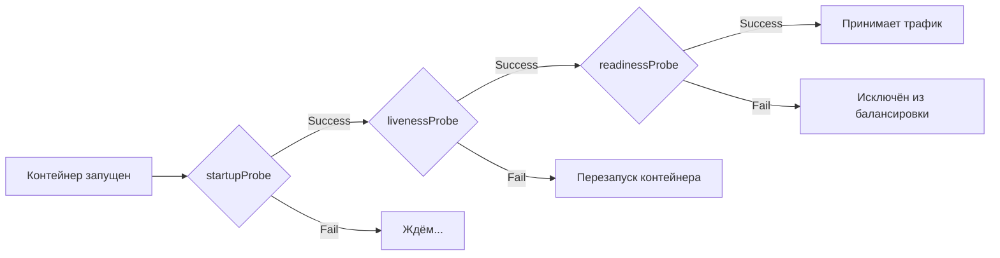

# Зонды контейнеров (Probes) в Kubernetes

> 📌 **Зонды** = периодические проверки здоровья контейнеров. `startupProbe` — запустилось ли приложение? `livenessProbe` — живо ли оно? `readinessProbe` — готово ли принимать трафик? Неправильная настройка зондов = каскадные сбои или постоянные перезапуски.

---

## 🔹 Три типа зондов: зачем и когда использовать

| Тип зонда | Назначение | Что делает при провале | Когда использовать |
|-----------|-----------|----------------------|-------------------|
| **🚀 `startupProbe`** | Проверка, что приложение **запустилось** | Ждёт, не убивает контейнер | Медленный старт (загрузка кэша, миграции БД, инициализация) |
| **💓 `livenessProbe`** | Проверка, что приложение **живо и не зависло** | Перезапускает контейнер | Deadlock, утечки памяти, зависшие потоки |
| **✅ `readinessProbe`** | Проверка, что приложение **готово принимать трафик** | Исключает под из балансировки (убирает из Endpoints) | Долгая инициализация, временная недоступность зависимостей, перегрузка |



> 💡 **Ключевая идея**: 
> - `startupProbe` запускается **только при старте** и блокирует остальные зонды до успеха
> - `livenessProbe` и `readinessProbe` работают **периодически** на протяжении всей жизни контейнера
> - Без `startupProbe` медленный старт может быть ошибочно принят за сбой → контейнер перезапускается бесконечно

---

## 🔹 Когда какой зонд использовать: практические сценарии

### 🚀 StartupProbe: для медленного старта

**Используй, если:**
- Приложение загружается дольше, чем `initialDelaySeconds + failureThreshold × periodSeconds` (по умолчанию: 0 + 3 × 10 = 30 сек)
- Есть долгая инициализация: загрузка моделей ML, прогрев кэша, миграции БД
- Нужно дать приложению время на старт без риска преждевременного перезапуска

**Пример:**
```yaml
startupProbe:
  httpGet:
    path: /healthz
    port: 8080
  failureThreshold: 30      # 30 попыток
  periodSeconds: 10         # каждые 10 сек
  # Итого: до 5 минут на старт (30 × 10с)
```

### 💓 LivenessProbe: для обнаружения зависаний

**Используй, если:**
- Приложение может зависнуть (deadlock, утечка памяти, бесконечный цикл)
- Процесс не завершается сам при критической ошибке
- Нужен автоматический перезапуск без вмешательства человека

**НЕ используй, если:**
- Приложение само корректно завершается при ошибке (лучше положиться на `restartPolicy`)
- Зонд проверяет внешние зависимости (БД, кэш) — это задача `readinessProbe`
- Приложение под нагрузкой отвечает медленно — рискуешь получить каскадные перезапуски

**Пример:**
```yaml
livenessProbe:
  httpGet:
    path: /healthz
    port: 8080
  initialDelaySeconds: 10   # Ждём 10 сек после старта
  periodSeconds: 5          # Проверяем каждые 5 сек
  failureThreshold: 3       # 3 провала подряд → перезапуск
  timeoutSeconds: 3         # Таймаут ответа 3 сек
```

### ✅ ReadinessProbe: для управления трафиком

**Используй, если:**
- Приложение не готово принимать запросы сразу после старта
- Есть временные периоды недоступности (переподключение к БД, обновление кэша)
- Нужно исключить под из балансировки при перегрузке или обслуживании
- Приложение зависит от внешних сервисов, которые могут быть недоступны

**Пример:**
```yaml
readinessProbe:
  httpGet:
    path: /ready
    port: 8080
  periodSeconds: 5
  failureThreshold: 2       # 2 провала → исключить из балансировки
  successThreshold: 1       # 1 успех → вернуть в балансировку
```

---

## 🔹 Механизмы проверки: как зонд работает

### 📋 Четыре типа проверок

| Механизм | Как работает | Когда использовать | Особенности |
|----------|-------------|-------------------|-------------|
| **`httpGet`** | HTTP GET запрос → успешен если статус 200-399 | Веб-приложения с HTTP-эндпоинтом | Самый популярный, поддерживает HTTPS, заголовки |
| **`tcpSocket`** | TCP соединение → успешен если порт открыт | Базы данных, сервисы без HTTP | Простой, но не проверяет логику приложения |
| **`exec`** | Выполнение команды внутри контейнера → успешен если exit code 0 | Кастомные проверки, нет HTTP | ⚠️ Создаёт процессы при каждом запуске — нагрузка на ноду |
| **`grpc`** | gRPC вызов с методом `Check` → успешен если статус `SERVING` | gRPC-сервисы (β с 1.24) | Требует реализации gRPC Health Checking Protocol |

### 🔍 Примеры для каждого механизма

```yaml
# HTTP-проверка
livenessProbe:
  httpGet:
    path: /healthz
    port: 8080
    scheme: HTTPS              # HTTPS вместо HTTP
    httpHeaders:               # Кастомные заголовки
    - name: Authorization
      value: "Bearer token123"

# TCP-проверка
readinessProbe:
  tcpSocket:
    port: 5432                 # Просто проверяем, что порт открыт

# Exec-проверка (осторожно с нагрузкой!)
livenessProbe:
  exec:
    command:
    - /bin/sh
    - -c
    - pg_isready -U postgres   # Проверка готовности PostgreSQL

# gRPC-проверка
livenessProbe:
  grpc:
    port: 50051
    service: liveness          # Опционально: имя сервиса для разных типов проверок
```

> ⚠️ **Важно про `exec`**: каждый запуск создаёт новый процесс в контейнере. При частых проверках (например, каждые 5 сек) и большом количестве подов на ноде — это создаёт значительную нагрузку на CPU. Предпочитай `httpGet` или `tcpSocket`, если возможно.

---

## 🔹 Параметры зондов: тонкая настройка

| Параметр | По умолчанию | Описание | Рекомендации |
|----------|-------------|----------|-------------|
| **`initialDelaySeconds`** | 0 | Задержка перед первым запуском зонда после старта контейнера | Для `liveness`/`readiness`: установи, если приложению нужно время на инициализацию. Для `startup` не нужен — он сам ждёт |
| **`periodSeconds`** | 10 | Как часто выполнять проверку | Не ставь слишком часто (<5с) — нагрузка на приложение и ноду. Не ставь слишком редко (>30с) — медленно обнаруживаются проблемы |
| **`timeoutSeconds`** | 1 | Таймаут ответа на проверку | Увеличь для медленных эндпоинтов (5-10с), но не больше, чем `periodSeconds` |
| **`successThreshold`** | 1 | Сколько успешных проверок подряд нужно для смены статуса | Для `liveness`/`startup` всегда 1. Для `readiness` можно увеличить (2-3), чтобы избежать "мигания" готовности |
| **`failureThreshold`** | 3 | Сколько провальных проверок подряд нужно для смены статуса | Для `startup`: большое значение (30+), чтобы дать время на старт. Для `liveness`: 3-5, чтобы не перезапускать из-за временных проблем. Для `readiness`: 2-3, чтобы быстро исключить при сбое |
| **`terminationGracePeriodSeconds`** | Наследуется от пода | Время на корректное завершение при провале `livenessProbe` | Можно переопределить на уровне зонда (стабильно с 1.28). Увеличь, если приложению нужно время на очистку ресурсов |

### 🧮 Формула расчёта времени до действия

```
Время до перезапуска (liveness) = initialDelaySeconds + failureThreshold × periodSeconds
Пример: 10 + 3 × 5 = 25 секунд

Время до исключения из балансировки (readiness) = failureThreshold × periodSeconds
Пример: 2 × 5 = 10 секунд

Время до успешного старта (startup) = failureThreshold × periodSeconds
Пример: 30 × 10 = 300 секунд (5 минут)
```

---

## 🔹 Практический пример: полный набор зондов

```yaml
apiVersion: v1
kind: Pod
metadata:
  name: web-app
spec:
  containers:
  - name: app
    image: my-web-app:1.0
    ports:
    - containerPort: 8080
    
    # Startup: даём 5 минут на загрузку кэша и инициализацию
    startupProbe:
      httpGet:
        path: /healthz
        port: 8080
      failureThreshold: 30      # 30 попыток
      periodSeconds: 10         # каждые 10 сек
      # Итого: до 5 минут на старт
    
    # Liveness: перезапуск при зависании (после успешного старта)
    livenessProbe:
      httpGet:
        path: /healthz
        port: 8080
      initialDelaySeconds: 0    # Не нужен, startup уже ждёт
      periodSeconds: 10         # Проверяем каждые 10 сек
      failureThreshold: 3       # 3 провала = 30 сек → перезапуск
      timeoutSeconds: 5
      terminationGracePeriodSeconds: 60  # Даём 60 сек на корректное завершение
    
    # Readiness: исключение из балансировки при проблемах
    readinessProbe:
      httpGet:
        path: /ready
        port: 8080
      periodSeconds: 5          # Проверяем чаще, чем liveness
      failureThreshold: 2       # 2 провала = 10 сек → исключить из балансировки
      successThreshold: 1       # 1 успех → вернуть в балансировку
      timeoutSeconds: 3
```

---

## 🔹 Особенности HTTP-проверок

### 🌐 Заголовки и перенаправления

```yaml
livenessProbe:
  httpGet:
    path: /healthz
    port: 8080
    scheme: HTTPS                    # HTTPS вместо HTTP
    host: myapp.example.com          # Хост (если нужно)
    httpHeaders:                     # Кастомные заголовки
    - name: Authorization
      value: "Bearer token123"
    - name: X-Custom-Header
      value: "custom-value"
```

**Важные детали:**
- Kubelet добавляет заголовки `User-Agent: kube-probe/<version>` и `Accept: */*` — можно переопределить через `httpHeaders`
- При перенаправлениях (3xx) kubelet следует только если редирект на **тот же хост**. Иначе считает проверку успешной и логирует `ProbeWarning`
- Максимум 11 редиректов — после этого проверка считается успешной с предупреждением
- Kubelet читает только первые **10 КБ** тела ответа — если эндпоинт возвращает больше, соединение обрывается (может вызвать ошибки "connection reset" в логах приложения)

> 💡 **Совет**: используй **отдельные лёгкие эндпоинты** для зондов, которые возвращают минимальное тело ответа. Не проверяй через зонды эндпоинты, которые возвращают большие JSON/XML.

---

## 🔹 Особенности gRPC-проверок

```yaml
livenessProbe:
  grpc:
    port: 50051
    service: liveness    # Опционально: имя сервиса
```

**Особенности:**
- Требуется реализация [gRPC Health Checking Protocol](https://github.com/grpc/grpc/blob/master/doc/health-checking.md) в приложении
- Нельзя указать порт по имени (только номер)
- Нельзя задать кастомный хост
- Поле `service` позволяет использовать один порт для разных типов проверок (liveness vs readiness)
- Если gRPC-сервис не реализован или порт неверный — проверка считается провальной

---

## 🔹 Частые ошибки и как их избежать

### ❌ Ошибка 1: Слишком агрессивный livenessProbe

**Симптом:** Контейнер постоянно перезапускается под нагрузкой

**Причина:** Зонд проверяет тяжёлый эндпоинт, который под нагрузкой отвечает медленно → timeout → failureThreshold → перезапуск

**Решение:**
```yaml
livenessProbe:
  httpGet:
    path: /healthz          # Лёгкий эндпоинт, не проверяет зависимости
    port: 8080
  timeoutSeconds: 5         # Увеличь таймаут
  failureThreshold: 5       # Дай больше попыток
  periodSeconds: 10         # Не проверяй слишком часто
```

### ❌ Ошибка 2: Нет startupProbe для медленного приложения

**Симптом:** Контейнер перезапускается в цикле `CrashLoopBackOff` сразу после старта

**Причина:** `livenessProbe` срабатывает до того, как приложение успело запуститься

**Решение:**
```yaml
startupProbe:
  httpGet:
    path: /healthz
    port: 8080
  failureThreshold: 30      # Дай время на старт
  periodSeconds: 10
```

### ❌ Ошибка 3: ReadinessProbe проверяет внешние зависимости

**Симптом:** Под исключается из балансировки при временной недоступности БД, но продолжает работать

**Причина:** Зонд проверяет доступность БД, но приложение может работать в деградированном режиме

**Решение:**
```yaml
readinessProbe:
  httpGet:
    path: /ready
    port: 8080
  # Эндпоинт /ready должен проверять только критичные зависимости
  # Если БД не критична — не проверяй её здесь
```

### ❌ Ошибка 4: Exec-зонд создаёт нагрузку на ноду

**Симптом:** Высокая нагрузка на CPU ноды, много процессов в контейнерах

**Причина:** `exec`-зонд создаёт новый процесс при каждом запуске

**Решение:**
```yaml
# Вместо exec:
livenessProbe:
  exec:
    command: ["/bin/sh", "-c", "curl -f http://localhost:8080/healthz || exit 1"]

# Используй httpGet:
livenessProbe:
  httpGet:
    path: /healthz
    port: 8080
```

---

## 🔹 Отладка проблем с зондами

```bash
# 1. Проверить статус зондов
kubectl describe pod my-pod | grep -A10 'Liveness\|Readiness\|Startup'

# 2. Посмотреть события, связанные с зондами
kubectl get events --field-selector involvedObject.name=my-pod | grep -i probe

# 3. Проверить, какие эндпоинты используются
kubectl get pod my-pod -o jsonpath='{.spec.containers[*].livenessProbe}'
kubectl get pod my-pod -o jsonpath='{.spec.containers[*].readinessProbe}'

# 4. Протестировать эндпоинт вручную
kubectl exec -it my-pod -- curl -v http://localhost:8080/healthz

# 5. Проверить логи kubelet (если зонд не запускается)
journalctl -u kubelet | grep -i "probe\|health"

# 6. Посмотреть, сколько раз контейнер перезапускался
kubectl get pod my-pod -o jsonpath='{.status.containerStatuses[*].restartCount}'
```

---

## 🔹 Чек-лист: настройка зондов

### ✅ При проектировании
```bash
• Определи, какие эндпоинты будут использоваться для зондов
  → /healthz для liveness, /ready для readiness, тот же /healthz для startup
• Эндпоинты должны быть лёгкими и быстрыми (<100мс)
• Не проверяй внешние зависимости в livenessProbe
• Проверяй только критичные зависимости в readinessProbe
```

### ✅ При настройке параметров
```bash
• Для startupProbe: failureThreshold × periodSeconds ≥ время старта приложения
• Для livenessProbe: не ставь слишком агрессивные параметры (periodSeconds ≥ 5с, failureThreshold ≥ 3)
• Для readinessProbe: periodSeconds меньше, чем у liveness (быстрее реагирует на изменения)
• timeoutSeconds < periodSeconds (иначе зонды будут накладываться)
```

### ✅ При отладке
```bash
• Если контейнер перезапускается: проверь livenessProbe, увеличь failureThreshold
• Если под не получает трафик: проверь readinessProbe, эндпоинт, логи приложения
• Если под долго не становится Ready: добавь startupProbe или увеличь failureThreshold
• Если зонд не работает: проверь порт, путь, схему (HTTP/HTTPS), заголовки
```

---

## 🔹 Ключевые выводы

1. **Три зонда — три задачи**: `startup` для медленного старта, `liveness` от зависаний, `readiness` для управления трафиком.
2. **StartupProbe блокирует остальные**: пока он не пройдёт, `liveness` и `readiness` не запускаются.
3. **Liveness ≠ Readiness**: первый перезапускает контейнер, второй исключает из балансировки.
4. **Не проверяй зависимости в liveness**: это задача `readiness`. Liveness должен проверять только само приложение.
5. **Exec-зонды создают нагрузку**: предпочитай `httpGet` или `tcpSocket`, если возможно.
6. **Тони настройка критична**: слишком агрессивные зонды = каскадные сбои, слишком мягкие = медленное обнаружение проблем.

> 💡 **Финальный совет**: начинай с простых зондов (`httpGet` на `/healthz` и `/ready`), наблюдай за поведением в production, затем тонко настраивай параметры под свою нагрузку и архитектуру.
