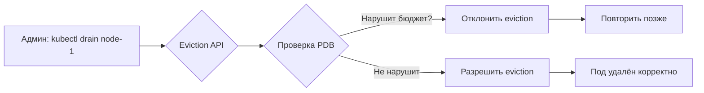

>Сбои (Disruptions) и PodDisruptionBudget — критически важная тема для production-эксплуатации, особенно при обновлении кластера и автоматическом масштабировании.

# Сбои (Disruptions) и PodDisruptionBudget в Kubernetes

> 📌 **Сбои** = ситуации, когда поды становятся недоступны. Делятся на **добровольные** (drain ноды, обновление, масштабирование) и **недобровольные** (сбой ноды, нехватка ресурсов). **PDB (PodDisruptionBudget)** ограничивает количество одновременно недоступных подов при добровольных сбоях — защищает высокодоступные приложения.

---

## 🔹 Типы сбоев: добровольные vs недобровольные

### 🚨 Недобровольные сбои (Involuntary Disruptions)

Неизбежные события, вызванные сбоями инфраструктуры или ресурсов.

| Причина | Пример | Можно ли предотвратить? |
|---------|--------|------------------------|
| **💥 Аппаратный сбой** | Поломка физического сервера, диска, RAM | ❌ Нет, но можно минимизировать репликацией |
| **☁️ Сбой облачного провайдера** | Удаление ВМ, сбой гипервизора, зональный сбой | ❌ Нет, но multi-zone/multi-region помогает |
| **🔥 Kernel panic** | Паника ядра на ноде | ❌ Нет |
| **🌐 Сетевое разделение** | Нода теряет связь с Control Plane | ❌ Нет, но настраивается через таймауты |
| **📉 Вытеснение из-за нехватки ресурсов** | Нода перегружена → kubelet эвиктит поды | ⚠️ Частично: через requests/limits, PriorityClass |

> 💡 **Важно**: PDB **не защищает** от недобровольных сбоев. Для защиты от них нужны: реплики, антиаффинити, multi-zone, корректные requests/limits.

### 🛠️ Добровольные сбои (Voluntary Disruptions)

Запланированные действия администратора или автоматизации.

| Кто инициирует | Действие | Защищается PDB? |
|---------------|----------|----------------|
| **👤 Владелец приложения** | Удаление Deployment, обновление шаблона, случайное удаление пода | ❌ Нет (прямое удаление обходит PDB) |
| **👨‍💻 Админ кластера** | `kubectl drain`, обновление нод, масштабирование кластера | ✅ Да (через API Eviction) |
| **🤖 Автоматизация** | Cluster Autoscaler (scale down), node-problem-detector | ✅ Да (если использует Eviction API) |
| **☁️ Хостинг-провайдер** | Плановое обслуживание, миграция ВМ | ✅ Да (если использует Eviction API) |

> ⚠️ **Важно**: PDB защищает только от добровольных сбоев, выполненных через **API Eviction**. Прямое `kubectl delete pod` обходит PDB!

---

## 🔹 PodDisruptionBudget (PDB)

### 🎯 Что это и зачем

**PDB** = объект, который ограничивает количество подов приложения, одновременно недоступных при добровольных сбоях.



### 📋 Два способа задать бюджет

| Параметр | Описание | Пример |
|----------|----------|--------|
| **`minAvailable`** | Минимальное количество подов, которые **должны быть доступны** | `minAvailable: 2` (всегда ≥2 пода) |
| **`maxUnavailable`** | Максимальное количество подов, которые **могут быть недоступны** | `maxUnavailable: 1` (не более 1 пода недоступно) |

```yaml
# Вариант 1: через minAvailable
apiVersion: policy/v1
kind: PodDisruptionBudget
metadata:
  name: my-app-pdb
spec:
  minAvailable: 2              # Всегда должно быть ≥2 готовых подов
  selector:
    matchLabels:
      app: my-app              # Должен совпадать с селектором Deployment/StatefulSet

# Вариант 2: через maxUnavailable
apiVersion: policy/v1
kind: PodDisruptionBudget
metadata:
  name: my-app-pdb
spec:
  maxUnavailable: 1            # Не более 1 пода может быть недоступно
  selector:
    matchLabels:
      app: my-app

# Вариант 3: проценты (для относительных значений)
apiVersion: policy/v1
kind: PodDisruptionBudget
metadata:
  name: my-app-pdb
spec:
  maxUnavailable: 25%          # Не более 25% подов могут быть недоступны
  selector:
    matchLabels:
      app: my-app
```

> 💡 **Правило**: используй **либо** `minAvailable`, **либо** `maxUnavailable` — не оба сразу.

### 🧮 Как PDB считает «предполагаемое» количество подов

```
PDB смотрит на .spec.replicas у контроллера (Deployment, StatefulSet и т.д.)
→ Это «предполагаемое» количество подов

Пример:
• Deployment: replicas=5
• PDB: minAvailable=3
• Значит: одновременно можно вывести из строя максимум 2 пода (5-3=2)

Если один под уже недоступен (сбой, обновление):
• Доступно: 4 пода
• Можно вывести ещё: 1 под (4-3=1)
• Если попробовать вывести 2-й → eviction будет отклонён
```

---

## 🔹 Пример: как PDB защищает приложение при drain

### 📊 Исходное состояние кластера

```
┌─────────┬─────────┬─────────┐
│ node-1  │ node-2  │ node-3  │
├─────────┼─────────┼─────────┤
│ pod-a ✓ │ pod-b ✓ │ pod-c ✓ │  ← Deployment (3 реплики)
│ pod-x ✓ │         │         │  ← Другой под (без PDB)
└─────────┴─────────┴─────────┘

PDB: minAvailable=2 (для Deployment)
```

### 🔄 Шаг 1: Админ делает `kubectl drain node-1`

```
1. Drain пытается эвиктить pod-a и pod-x
2. pod-x: нет PDB → эвикция разрешена → terminating
3. pod-a: PDB проверяет → доступно 3 пода, нужно ≥2 → эвикция разрешена → terminating

Состояние:
┌─────────┬─────────┬─────────┐
│ node-1  │ node-2  │ node-3  │
├─────────┼─────────┼─────────┤
│ pod-a ⏳│ pod-b ✓ │ pod-c ✓ │
│ pod-x ⏳│         │         │
└─────────┴─────────┴─────────┘
(⏳ = terminating)
```

### 🔄 Шаг 2: Deployment создаёт замены

```
Deployment видит: 1 под terminating → создаёт pod-d на node-2
Другой контроллер создаёт pod-y на node-2

Состояние:
┌─────────┬─────────┬─────────┐
│ node-1  │ node-2  │ node-3  │
├─────────┼─────────┼─────────┤
│ pod-a ⏳│ pod-b ✓ │ pod-c ✓ │
│ pod-x ⏳│ pod-d 🔄│ pod-y   │
└─────────┴─────────┴─────────┘
(🔄 = starting)
```

### 🔄 Шаг 3: pod-d становится Ready

```
Состояние:
┌─────────┬─────────┬─────────┐
│ node-1  │ node-2  │ node-3  │
├─────────┼─────────┼─────────┤
│         │ pod-b ✓ │ pod-c ✓ │
│         │ pod-d ✓ │ pod-y   │
└─────────┴─────────┴─────────┘

PDB: доступно 3 пода (pod-b, pod-c, pod-d) → бюджет восстановлен
```

### 🔄 Шаг 4: Админ пытается drain node-2

```
1. Drain пытается эвиктить pod-b и pod-d
2. pod-b: PDB проверяет → доступно 3, нужно ≥2 → эвикция разрешена → terminating
3. pod-d: PDB проверяет → доступно 2, нужно ≥2 → эвикция ОТКЛОНЕНА!

Состояние:
┌─────────┬─────────┬─────────┐
│ node-1  │ node-2  │ node-3  │
├─────────┼─────────┼─────────┤
│         │ pod-b ⏳│ pod-c ✓ │
│         │ pod-d ✓ │ pod-y   │
└─────────┴─────────┴─────────┘

Drain заблокирован! Админ должен:
• Подождать, пока pod-b завершится и создастся замена
• Или добавить новую ноду в кластер
```

> 💡 **Вывод**: PDB замедляет drain, но гарантирует, что приложение всегда имеет достаточно реплик.

---

## 🔹 Условие DisruptionTarget

> 🧩 **Статус**: стабильно с 1.31

Kubernetes добавляет условие `DisruptionTarget` к подам, которые будут удалены из-за сбоя.

### 📋 Причины установки условия

| `reason` | Описание |
|----------|----------|
| **`PreemptionByScheduler`** | Вытеснение для более приоритетного пода |
| **`DeletionByTaintManager`** | Удаление из-за `NoExecute` тейнта |
| **`EvictionByEvictionAPI`** | Удаление через Eviction API (drain, autoscaler) |
| **`DeletionByPodGC`** | Удаление сборщиком мусора (нода не существует) |
| **`TerminationByKubelet`** | Локальное вытеснение kubelet'ом (перегрузка ноды) |

```yaml
# Пример условия в статусе пода
status:
  conditions:
  - type: DisruptionTarget
    status: "True"
    reason: EvictionByEvictionAPI
    message: "Pod is being evicted"
    lastTransitionTime: "2024-06-05T10:00:00Z"
```

```bash
# Проверить, помечен ли под на удаление
kubectl get pod my-pod -o jsonpath='{.status.conditions[?(@.type=="DisruptionTarget")]}'

# Найти все поды, помеченные на удаление
kubectl get pods -A -o json | jq -r '
  .items[] | 
  select(.status.conditions[]? | select(.type=="DisruptionTarget")) | 
  .metadata.namespace + "/" + .metadata.name'
```

> ⚠️ **Важно**: `DisruptionTarget` — это **предупреждение**, а не гарантия. Плоскость управления может передумать, если проблема устранена.

---

## 🔹 Практика: работа с PDB

### 🛠️ Создание PDB

```bash
# Создать PDB через kubectl (императивно)
kubectl create pdb my-app-pdb --selector=app=my-app --min-available=2 -n production

# Или декларативно через файл
kubectl apply -f pdb.yaml

# Проверить статус PDB
kubectl get pdb my-app-pdb -o yaml
```

### 🔍 Проверка статуса PDB

```bash
# Базовая информация
kubectl get pdb my-app-pdb
# NAME         MIN AVAILABLE   MAX UNAVAILABLE   ALLOWED DISRUPTIONS   AGE
# my-app-pdb   2               N/A               1                     5m

# Детальная информация
kubectl describe pdb my-app-pdb
# Name:             my-app-pdb
# Min available:    2
# Allowed disruptions: 1
# Current healthy: 3
# Desired healthy: 3
# Disruptions allowed: 1

# Проверить, сколько подов можно вывести из строя
kubectl get pdb my-app-pdb -o jsonpath='{.status.disruptionsAllowed}'
```

### 🧪 Тестирование PDB

```bash
# 1. Создать PDB
kubectl apply -f pdb.yaml

# 2. Попробовать эвиктить под (должно сработать, если бюджет позволяет)
kubectl drain node-1 --ignore-daemonsets --delete-emptydir-data

# 3. Если drain заблокирован — посмотреть, почему
kubectl get events -n production --field-selector reason=FailedEvict

# 4. Проверить, какие поды помечены на удаление
kubectl get pods -n production -o json | jq -r '
  .items[] | 
  select(.status.conditions[]? | select(.type=="DisruptionTarget")) | 
  .metadata.name'
```

---

## 🔹 Разделение ролей: владелец приложения vs админ кластера

| Роль | Ответственность | Инструменты |
|------|----------------|-------------|
| **👤 Владелец приложения** | • Обеспечить высокую доступность приложения<br>• Создать PDB<br>• Настроить реплики, антиаффинити, multi-zone | Deployment, PDB, PodAntiAffinity, PriorityClass |
| **👨‍💻 Админ кластера** | • Обслуживание нод (обновления, drain)<br>• Масштабирование кластера<br>• Управление ресурсами | `kubectl drain`, Cluster Autoscaler, Eviction API |

```
Взаимодействие через PDB:
• Владелец приложения: "Моё приложение должно иметь ≥2 реплики всегда"
  → Создаёт PDB с minAvailable=2

• Админ кластера: "Мне нужно обновить ноду"
  → Запускает kubectl drain
  → Eviction API проверяет PDB
  → Если drain нарушит PDB → операция блокируется
  → Админ ждёт или добавляет ресурсы
```

> 💡 **Вывод**: PDB — это **контракт** между владельцем приложения и админом кластера.

---

## 🔹 Чек-лист: настройка PDB

### ✅ При проектировании приложения
```bash
# • Определи минимальное количество реплик для работы приложения
#   (кворум для БД, минимальная пропускная способность для веб-сервиса)

# • Используй PDB для всех критичных приложений
#   minAvailable для кворумных систем (БД, consensus)
#   maxUnavailable для веб-сервисов (можно потерять часть реплик)

# • Настрой антиаффинити для распределения реплик по нодам/зонам
#   → PDB защитит от drain, антиаффинити — от сбоя ноды

# • Убедись, что приложение корректно обрабатывает SIGTERM
#   → graceful shutdown в течение terminationGracePeriodSeconds
```

### ✅ При создании PDB
```bash
# • Селектор PDB должен совпадать с селектором контроллера (Deployment/StatefulSet)
# • Используй minAvailable для кворумных систем (etcd, Zookeeper, Cassandra)
# • Используй maxUnavailable для веб-сервисов (обычно 1 или 25%)
# • Не ставь minAvailable=100% — это заблокирует любые обновления!

# Пример для веб-сервиса (3 реплики):
# maxUnavailable: 1  → можно вывести 1 под, останутся 2

# Пример для кворумной БД (5 реплик):
# minAvailable: 3    → всегда должно быть ≥3 пода (кворум)
```

### ✅ При обслуживании кластера
```bash
# • Всегда используй kubectl drain (а не kubectl delete pod)
#   → drain уважает PDB, delete — нет

# • Если drain заблокирован:
#   1. Проверь PDB: kubectl get pdb -n <namespace>
#   2. Проверь, какие поды недоступны: kubectl get pods -n <namespace>
#   3. Подожди, пока контроллер создаст замены
#   4. Или добавь ресурсы в кластер

# • Для экстренных случаев (игнорировать PDB):
#   kubectl drain node-1 --disable-eviction
#   ⚠️ Опасно! Может нарушить доступность приложений
```

### ✅ Для мониторинга и алертинга
```bash
# Алерт: PDB нарушен (доступно меньше подов, чем требует бюджет)
kube_pdb_status_current_healthy < kube_pdb_status_desired_healthy

# Алерт: drain заблокирован PDB
# (нода в состоянии SchedulingDisabled > 10 минут)
kube_node_spec_unschedulable == 1 and 
  (time() - kube_node_spec_unschedulable_timestamp) > 600

# Алерт: под помечен на удаление (DisruptionTarget)
kube_pod_status_condition{condition="DisruptionTarget", status="true"}

# Дашборд: статус PDB по неймспейсу
# (сколько PDB, какие нарушены, сколько подов можно вывести)
```

---

## 🔹 Ключевые выводы

1. **Два типа сбоев**: добровольные (drain, обновление) и недобровольные (сбой ноды, нехватка ресурсов).
2. **PDB защищает только от добровольных сбоев**, выполненных через Eviction API.
3. **Два параметра PDB**: `minAvailable` (для кворумных систем) и `maxUnavailable` (для веб-сервисов).
4. **DisruptionTarget** — условие, которое предупреждает о предстоящем удалении пода.
5. **Разделение ролей**: владелец приложения создаёт PDB, админ кластера уважает его при обслуживании.
6. **PDB ≠ гарантия**: это инструмент управления частотой сбоев, а не их предотвращения.

> 💡 **Финальный совет**: PDB — это не «настроил и забыл». Регулярно проверяй, что PDB корректно настроены для всех критичных приложений, и тестируй сценарии drain в staging перед production.
