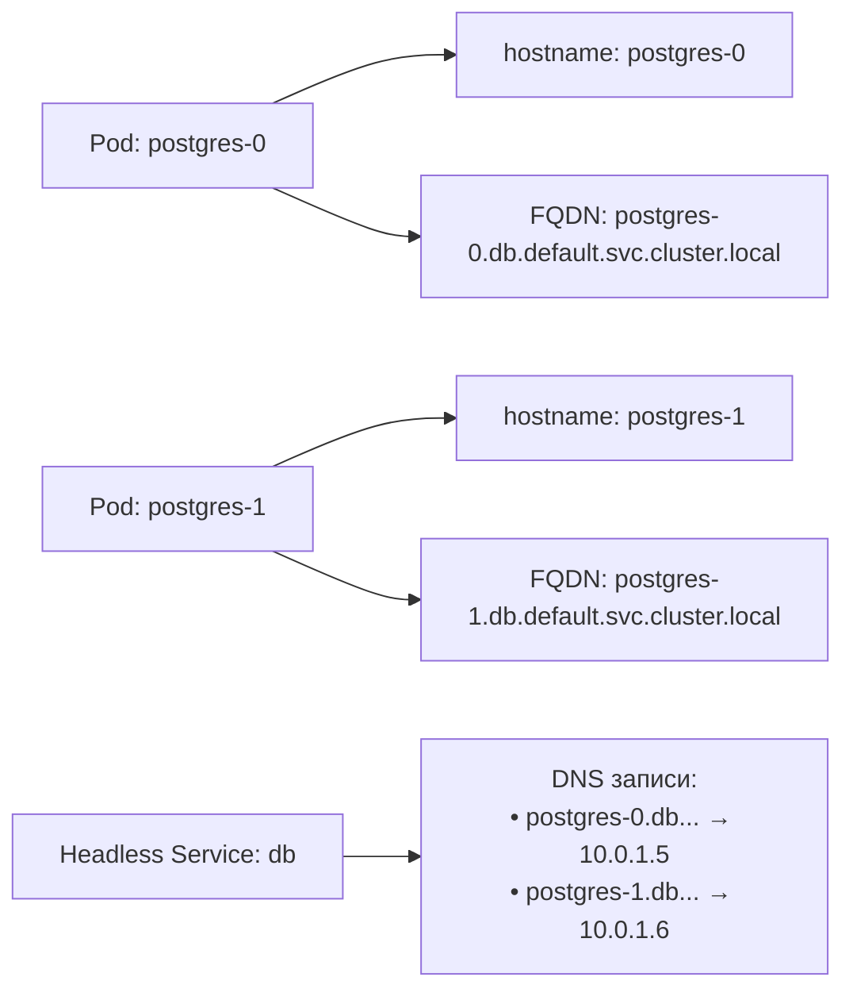

# Имя хоста пода (Pod Hostname) в Kubernetes

> 📌 По умолчанию hostname пода = `metadata.name`. Можно переопределить через `spec.hostname` + `spec.subdomain` (для DNS-записей) или `hostnameOverride` (только внутри пода, β с 1.35). Ограничение Linux: ≤64 символа. Критично для StatefulSet, headless Service и приложений, требующих FQDN.

---

## 🔹 Зачем нужен hostname в поде

| Сценарий | Почему важен hostname |
|----------|----------------------|
| **🗄️ StatefulSet** | Каждый под должен иметь стабильный, уникальный hostname (например, `postgres-0`, `postgres-1`) |
| **🌐 Headless Service** | DNS-записи для каждого пода отдельно (например, для discovery в кластере) |
| **🔗 Межподовая связь** | Приложения могут обращаться друг к другу по hostname, а не по IP |
| **📜 Legacy-приложения** | Некоторые приложения требуют определённый hostname для лицензирования или конфигурации |
| **🔐 TLS-сертификаты** | Сертификаты могут быть привязаны к hostname пода |



> 💡 **Ключевая идея**: hostname — это не просто "имя компьютера". В Kubernetes это механизм идентификации пода в DNS и для межподового взаимодействия.

---

## 🔹 Способы задания hostname: подробный разбор

### 1️⃣ По умолчанию: `metadata.name`

**Как работает:**
```yaml
apiVersion: v1
kind: Pod
metadata:
  name: my-app-1
spec:
  containers:
  - name: app
    image: busybox:1.28
    command: ["sleep", "3600"]
```

```bash
# Внутри пода:
hostname        # → my-app-1
hostname --fqdn # → my-app-1

# DNS-запись (если есть Service с selector):
nslookup my-app-1.default.svc.cluster.local
# → Name: my-app-1.default.svc.cluster.local
# → Address: 10.0.1.5
```

**Когда использовать:**
- Стандартные приложения без требований к hostname
- Когда не нужен стабильный DNS для каждого пода
- StatefulSet автоматически использует этот механизм

**Особенности:**
- ✅ Просто и предсказуемо
- ❌ Hostname может измениться при пересоздании пода (если не StatefulSet)
- ❌ Нет контроля над FQDN

---

### 2️⃣ `spec.hostname` + `spec.subdomain`: явное задание с DNS

**Как работает:**
```yaml
apiVersion: v1
kind: Pod
metadata:
  name: my-pod-abc123  # ← имя объекта (не обязательно = hostname)
spec:
  hostname: my-host           # ← hostname внутри пода
  subdomain: my-subdomain     # ← поддомен для DNS
  containers:
  - name: app
    image: busybox:1.28
    command: ["sleep", "3600"]
```

```bash
# Внутри пода:
hostname        # → my-host
hostname --fqdn # → my-host.my-subdomain.default.svc.cluster.local

# DNS-запись (автоматически создаётся, если есть headless Service):
nslookup my-host.my-subdomain.default.svc.cluster.local
# → Name: my-host.my-subdomain.default.svc.cluster.local
# → Address: 10.0.1.5
```

**Когда использовать:**
- Нужен стабильный DNS для пода (независимо от `metadata.name`)
- Headless Service для discovery (StatefulSet, базы данных)
- Приложение требует определённый hostname, но имя объекта должно быть другим

**Требования для DNS-записи:**
```yaml
# Должен быть headless Service с тем же subdomain
apiVersion: v1
kind: Service
metadata:
  name: my-subdomain  # ← должно совпадать с spec.subdomain
spec:
  clusterIP: None     # ← headless Service
  selector:
    app: my-app
  ports:
  - port: 80
```

**Особенности:**
- ✅ Полный контроль над hostname и FQDN
- ✅ Создаёт DNS-запись (A/AAAA)
- ⚠️ Требует headless Service для DNS
- ⚠️ `subdomain` должен быть валидным DNS subdomain

---

### 3️⃣ `setHostnameAsFQDN`: hostname = FQDN

> 🧩 **Статус**: стабильно с Kubernetes 1.22

**Как работает:**
```yaml
apiVersion: v1
kind: Pod
metadata:
  name: my-pod
spec:
  hostname: my-host
  subdomain: my-subdomain
  setHostnameAsFQDN: true  # ← КЛЮЧЕВОЕ: hostname = FQDN
  containers:
  - name: app
    image: busybox:1.28
    command: ["sleep", "3600"]
```

```bash
# Внутри пода:
hostname        # → my-host.my-subdomain.default.svc.cluster.local
hostname --fqdn # → my-host.my-subdomain.default.svc.cluster.local

# Обе команды возвращают FQDN!
```

**Зачем это нужно:**
```
Проблема:
• Некоторые приложения (например, старые Java-серверы) используют hostname для:
  - Генерации TLS-сертификатов
  - Регистрации в service discovery
  - Логирования

• По умолчанию: hostname = короткое имя (my-host)
• Но приложению нужен FQDN (my-host.my-subdomain.default.svc.cluster.local)

Решение: setHostnameAsFQDN: true
→ hostname внутри пода = FQDN
→ приложение видит полное имя
```

**Когда использовать:**
- Приложение требует FQDN как hostname
- TLS-сертификаты привязаны к FQDN
- Service discovery ожидает FQDN в hostname

**⚠️ Критичное ограничение:**
```
Linux kernel ограничивает nodename (struct utsname) 64 символами

Если FQDN > 64 символов:
• Под зависнет в Pending (ContainerCreating)
• Ошибка: "Failed to form FQDN from pod hostname and cluster domain"

Пример:
hostname: my-very-long-hostname-name          # 25 символов
subdomain: my-very-long-subdomain-name        # 26 символов
namespace: default                            # 7 символов
cluster domain: svc.cluster.local             # 17 символов
Точки: 3 символа
ИТОГО: 25 + 26 + 7 + 17 + 3 = 78 символов ❌ > 64

Решение: сократить hostname или subdomain
```

**Особенности:**
- ✅ hostname = FQDN (удобно для некоторых приложений)
- ⚠️ Лимит 64 символа на FQDN
- ⚠️ Требует `hostname` + `subdomain`
- ❌ Нельзя использовать с `hostNetwork: true` + `hostnameOverride`

---

### 4️⃣ `hostnameOverride`: принудительное переопределение (β 1.35)

> 🧩 **Статус**: beta с Kubernetes 1.35 (по умолчанию включено)

**Как работает:**
```yaml
apiVersion: v1
kind: Pod
metadata:
  name: my-pod-abc123
spec:
  hostnameOverride: custom-hostname.example.com  # ← принудительно
  containers:
  - name: app
    image: busybox:1.28
    command: ["sleep", "3600"]
```

```bash
# Внутри пода:
hostname        # → custom-hostname.example.com
hostname --fqdn # → custom-hostname.example.com

# DNS-запись (НЕ изменяется!):
nslookup my-pod-abc123.default.svc.cluster.local
# → Name: my-pod-abc123.default.svc.cluster.local
# → Address: 10.0.1.5
# (запись по metadata.name, а не по hostnameOverride)
```

**Зачем это нужно:**
```
Сценарий:
• У тебя есть legacy-приложение, которое требует hostname "legacy-app.prod.company.com"
• Но ты не можешь изменить metadata.name (оно используется в других местах)
• И тебе не нужна DNS-запись для этого hostname (приложение использует его только локально)

Решение: hostnameOverride
→ hostname внутри пода = "legacy-app.prod.company.com"
→ DNS-запись остаётся по metadata.name
→ приложение видит нужный hostname
```

**Когда использовать:**
- Legacy-приложения, требующие определённый hostname
- Нужно переопределить hostname без изменения DNS
- Тестирование приложений с разными hostname

**⚠️ Ограничения:**
```
1. Максимум 64 символа (RFC 1123 DNS subdomain)
2. Нельзя использовать одновременно:
   • hostnameOverride + hostNetwork: true + setHostnameAsFQDN: true
   → API Server отклонит такой манифест
3. Влияет ТОЛЬКО на hostname внутри пода
   → DNS-записи не изменяются
   → Другие поды не могут обратиться по hostnameOverride
```

**Особенности:**
- ✅ Принудительное переопределение hostname
- ✅ Не влияет на DNS
- ⚠️ Beta-фича (может измениться)
- ❌ Нельзя комбинировать с некоторыми полями

---

## 🔹 Сравнительная таблица всех способов

| Способ | Поля | hostname внутри | FQDN внутри | DNS-запись | Когда использовать |
|--------|------|----------------|-------------|-----------|-------------------|
| **По умолчанию** | `metadata.name` | `metadata.name` | `metadata.name` | `metadata.name.ns.svc...` | Стандартные приложения |
| **hostname + subdomain** | `spec.hostname`, `spec.subdomain` | `spec.hostname` | `hostname.subdomain.ns.svc...` | `hostname.subdomain.ns.svc...` | Headless Service, StatefulSet |
| **setHostnameAsFQDN** | + `setHostnameAsFQDN: true` | FQDN | FQDN | `hostname.subdomain.ns.svc...` | Приложение требует FQDN как hostname |
| **hostnameOverride** | `hostnameOverride` | `hostnameOverride` | `hostnameOverride` | `metadata.name.ns.svc...` | Legacy-приложения, тестирование |

---

## 🔹 Таблица комбинаций полей

| `hostname` | `subdomain` | `setHostnameAsFQDN` | `hostnameOverride` | hostname внутри | FQDN внутри | DNS-запись |
|-----------|-------------|--------------------|--------------------|-----------------|-------------|------------|
| — | — | — | — | `metadata.name` | `metadata.name` | `metadata.name.ns.svc...` |
| `foo` | `bar` | — | — | `foo` | `foo.bar.ns.svc...` | `foo.bar.ns.svc...` |
| `foo` | `bar` | `true` | — | `foo.bar.ns.svc...` | `foo.bar.ns.svc...` | `foo.bar.ns.svc...` |
| — | — | — | `custom` | `custom` | `custom` | `metadata.name.ns.svc...` |
| `foo` | `bar` | — | `custom` | `custom` | `custom` | `foo.bar.ns.svc...` |
| `foo` | `bar` | `true` | `custom` | ❌ Ошибка API | ❌ Ошибка API | ❌ Ошибка API |

> ⚠️ **Запрещённая комбинация**: `hostnameOverride` + `setHostnameAsFQDN: true` → API Server отклонит запрос.

---

## 🔹 Практика: примеры использования

### 📦 Пример 1: StatefulSet с headless Service

```yaml
# StatefulSet: каждый под получает стабильный hostname
apiVersion: apps/v1
kind: StatefulSet
metadata:
  name: postgres
spec:
  serviceName: postgres-headless  # ← должно совпадать с Service name
  replicas: 3
  selector:
    matchLabels:
      app: postgres
  template:
    metadata:
      labels:
        app: postgres
    spec:
      containers:
      - name: postgres
        image: postgres:15
        env:
        - name: POSTGRES_PASSWORD
          value: "secret"
---
# Headless Service: создаёт DNS-записи для каждого пода
apiVersion: v1
kind: Service
metadata:
  name: postgres-headless
spec:
  clusterIP: None  # ← headless
  selector:
    app: postgres
  ports:
  - port: 5432
```

```bash
# Результат:
# Поды: postgres-0, postgres-1, postgres-2
# DNS-записи:
#   postgres-0.postgres-headless.default.svc.cluster.local → 10.0.1.5
#   postgres-1.postgres-headless.default.svc.cluster.local → 10.0.1.6
#   postgres-2.postgres-headless.default.svc.cluster.local → 10.0.1.7

# Из другого пода:
nslookup postgres-0.postgres-headless.default.svc.cluster.local
# → Name: postgres-0.postgres-headless.default.svc.cluster.local
# → Address: 10.0.1.5
```

---

### 📦 Пример 2: Приложение с FQDN в hostname

```yaml
apiVersion: v1
kind: Pod
metadata:
  name: legacy-java-app
spec:
  hostname: myapp
  subdomain: prod
  setHostnameAsFQDN: true  # ← hostname = FQDN
  containers:
  - name: app
    image: my-java-app:1.0
    env:
    - name: APP_HOSTNAME
      value: "$(hostname)"  # → myapp.prod.default.svc.cluster.local
---
apiVersion: v1
kind: Service
metadata:
  name: prod
spec:
  clusterIP: None
  selector:
    app: legacy-java-app
  ports:
  - port: 8080
```

```bash
# Внутри пода:
hostname        # → myapp.prod.default.svc.cluster.local
echo $APP_HOSTNAME  # → myapp.prod.default.svc.cluster.local

# Приложение видит FQDN и может использовать его для:
# • Генерации TLS-сертификата
# • Регистрации в service discovery
# • Логирования
```

---

### 📦 Пример 3: Legacy-приложение с hostnameOverride

```yaml
apiVersion: v1
kind: Pod
metadata:
  name: legacy-app-abc123  # ← имя объекта (используется в DNS)
spec:
  hostnameOverride: legacy-app.prod.company.com  # ← hostname внутри пода
  containers:
  - name: app
    image: legacy-app:1.0
    # Приложение требует hostname "legacy-app.prod.company.com"
    # для лицензирования или конфигурации
```

```bash
# Внутри пода:
hostname  # → legacy-app.prod.company.com

# DNS-запись (НЕ изменилась):
nslookup legacy-app-abc123.default.svc.cluster.local
# → Name: legacy-app-abc123.default.svc.cluster.local
# → Address: 10.0.1.5

# Другие поды обращаются по DNS-имени:
curl http://legacy-app-abc123.default.svc.cluster.local:8080
```

---

## 🔹 Отладка проблем с hostname

### 🔍 Проверка hostname внутри пода

```bash
# Базовая проверка
kubectl exec my-pod -- hostname
kubectl exec my-pod -- hostname --fqdn

# Проверить переменные окружения
kubectl exec my-pod -- env | grep HOSTNAME

# Проверить /etc/hosts
kubectl exec my-pod -- cat /etc/hosts

# Проверить resolv.conf
kubectl exec my-pod -- cat /etc/resolv.conf
```

### 🔍 Проверка DNS-записей

```bash
# Проверить DNS-запись для пода
kubectl exec my-pod -- nslookup my-host.my-subdomain.default.svc.cluster.local

# Проверить все DNS-записи для headless Service
kubectl exec my-pod -- nslookup postgres-headless.default.svc.cluster.local

# Проверить DNS из другого пода
kubectl exec other-pod -- nslookup my-host.my-subdomain.default.svc.cluster.local
```

### 🔍 Частые проблемы и решения

| Проблема | Симптомы | Причина | Решение |
|----------|----------|---------|---------|
| **Под в Pending** | `ContainerCreating`, ошибка "Failed to form FQDN" | FQDN > 64 символа | Сократить `hostname` или `subdomain` |
| **DNS-запись не создаётся** | `nslookup` не находит под | Нет headless Service или `subdomain` не совпадает с Service name | Создать headless Service с `clusterIP: None`, проверить `subdomain` |
| **hostname не изменился** | `hostname` возвращает `metadata.name` | Не указаны `spec.hostname` или `hostnameOverride` | Добавить нужное поле в spec |
| **hostnameOverride не работает** | `hostname` = `metadata.name` | Фича не включена (K8s < 1.35) или конфликт полей | Проверить версию K8s, убрать конфликтующие поля |
| **setHostnameAsFQDN не работает** | `hostname` ≠ FQDN | Не указаны `hostname` + `subdomain` или конфликт с `hostnameOverride` | Добавить `hostname` + `subdomain`, убрать `hostnameOverride` |

### 🛠️ Команды для отладки

```bash
# 1. Посмотреть spec пода (какие поля заданы)
kubectl get pod my-pod -o yaml | grep -E 'hostname|subdomain|setHostnameAsFQDN|hostnameOverride'

# 2. Проверить события пода (ошибки при создании)
kubectl describe pod my-pod | grep -A10 'Events:'

# 3. Проверить, есть ли headless Service
kubectl get svc -l app=my-app -o yaml | grep clusterIP

# 4. Проверить DNS-сервер кластера
kubectl exec my-pod -- cat /etc/resolv.conf
kubectl exec my-pod -- nslookup kubernetes.default.svc.cluster.local

# 5. Если под в Pending — посмотреть логи kubelet
journalctl -u kubelet | grep -i "hostname\|fqdn" | tail -20
```

---

## 🔹 Лучшие практики

### ✅ Что делать

```bash
# • Для StatefulSet: используй serviceName + headless Service
#   → каждый под получит стабильный hostname (postgres-0, postgres-1, ...)

# • Для headless Service: убедись, что subdomain совпадает с именем Service
#   → иначе DNS-записи не создадутся

# • Для setHostnameAsFQDN: проверяй длину FQDN (≤64 символа)
#   → иначе под зависнет в Pending

# • Для hostnameOverride: используй только когда действительно нужно
#   → это beta-фича, может измениться в будущих версиях

# • Документируй, какой способ используется для каждого приложения
#   → упростит отладку и онбординг новых членов команды

# • Тестируй hostname и DNS в staging перед production
#   → особенно для legacy-приложений с жёсткими требованиями
```

### ❌ Чего избегать

```bash
# ❌ Не используй hostnameOverride для новых приложений
#   → это beta-фича, лучше использовать стандартные механизмы

# ❌ Не создавай слишком длинные hostname/subdomain
#   → FQDN не должен превышать 64 символа

# ❌ Не забывай создавать headless Service для hostname + subdomain
#   → без Service DNS-записи не создадутся

# ❌ Не комбинируй hostnameOverride + setHostnameAsFQDN + hostNetwork
#   → API Server отклонит такой манифест

# ❌ Не полагайся на hostname для идентификации пода в коде
#   → используй метаданные API (metadata.name, metadata.uid)
#   → hostname может измениться при пересоздании пода
```

---

## 🔹 Чек-лист: настройка hostname

### ✅ При проектировании
```bash
# • Определи, нужен ли стабильный hostname для пода
#   → StatefulSet? headless Service? legacy-приложение?

# • Выбери способ задания hostname:
#   • По умолчанию (metadata.name) — для стандартных приложений
#   • hostname + subdomain — для headless Service
#   • setHostnameAsFQDN — если приложение требует FQDN
#   • hostnameOverride — для legacy-приложений (beta)

# • Проверь длину FQDN (≤64 символа)
#   → особенно для setHostnameAsFQDN

# • Создай headless Service, если используешь hostname + subdomain
#   → clusterIP: None, selector совпадает с подами
```

### ✅ При написании манифестов
```bash
# • Для StatefulSet: укажи serviceName (должен совпадать с Service name)
# • Для hostname + subdomain: убедись, что subdomain валиден (RFC 1123)
# • Для setHostnameAsFQDN: добавь hostname + subdomain
# • Для hostnameOverride: проверь, что фича включена (K8s ≥ 1.35)

# • Добавь комментарии в манифест:
#   # hostname: my-host — для DNS-записи
#   # setHostnameAsFQDN: true — приложение требует FQDN как hostname
```

### ✅ При отладке
```bash
# 1. Проверь hostname внутри пода:
kubectl exec my-pod -- hostname
kubectl exec my-pod -- hostname --fqdn

# 2. Проверь DNS-записи:
kubectl exec my-pod -- nslookup <hostname>.<subdomain>.<namespace>.svc.cluster.local

# 3. Проверь spec пода:
kubectl get pod my-pod -o yaml | grep -E 'hostname|subdomain'

# 4. Проверь события (если под в Pending):
kubectl describe pod my-pod | grep -A10 'Events:'

# 5. Проверь headless Service:
kubectl get svc my-subdomain -o yaml | grep clusterIP
```

### ✅ Для мониторинга
```bash
# Алерт: поды с FQDN > 64 символа (зависнут в Pending)
# (проверять через admission webhook или CI/CD)

# Алерт: поды без DNS-записи (если ожидается headless Service)
# (проверять через периодический nslookup из другого пода)

# Дашборд: hostname и FQDN подов по неймспейсу
# (для отладки и документации)
```

---

## 🔹 Ключевые выводы

1. **По умолчанию**: hostname = `metadata.name`, FQDN = `metadata.name.ns.svc.cluster.local`.
2. **hostname + subdomain**: создаёт DNS-запись, требует headless Service.
3. **setHostnameAsFQDN**: делает hostname = FQDN (лимит 64 символа).
4. **hostnameOverride**: принудительно меняет hostname внутри пода, не влияет на DNS (β 1.35).
5. **StatefulSet**: автоматически использует hostname + subdomain для стабильных имён.
6. **Лимит Linux**: FQDN ≤64 символа — иначе под не запустится.
7. **DNS-записи**: создаются только при наличии headless Service с совпадающим `subdomain`.

> 💡 **Финальный совет**: начинай с простого (hostname по умолчанию), добавляй сложность только когда есть реальная потребность (StatefulSet, legacy-приложения, FQDN в hostname). Всегда тестируй в staging перед production.