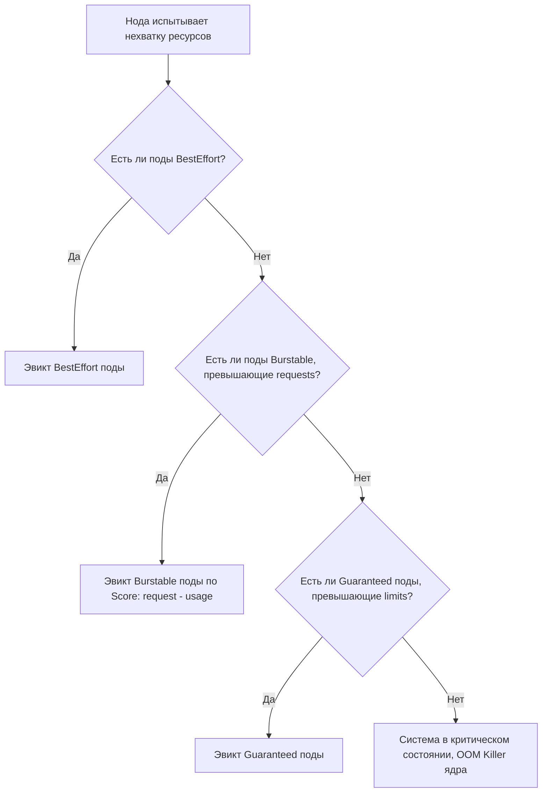

>Классы качества обслуживания (QoS) — это фундаментальный механизм, который определяет, как Kubernetes распределяет ресурсы и какие поды жертвует первыми при нехватке ресурсов на узле.

# Классы качества обслуживания (QoS) в Kubernetes

> 📌 **QoS (Quality of Service)** = классификация подов на основе `requests` и `limits`. Определяет приоритет при нехватке ресурсов на ноде. Порядок выселения (эвикшна): **BestEffort** → **Burstable** → **Guaranteed**. Класс присваивается при создании и **не может быть изменен**.

---

## 🔹 Три класса QoS: краткое сравнение

| Класс QoS          | Критерии (CPU и Memory)                                  | Приоритет при эвикшне        | Когда использовать                                      |
| ------------------ | -------------------------------------------------------- | ---------------------------- | ------------------------------------------------------- |
| **🛡️ Guaranteed** | `requests == limits` для **всех** контейнеров (и > 0)    | Последний (самый защищенный) | Критичные БД, stateful-приложения, системные компоненты |
| **⚡ Burstable**    | Есть хотя бы один `request` или `limit`, но не все равны | Средний (после BestEffort)   | Большинство веб-сервисов, фоновые задачи, dev-окружения |
| **🎈 BestEffort**  | Нет ни `requests`, ни `limits` для CPU и Memory          | Первый (жертва №1)           | Тестовые задачи, демоны, некритичные фоновые процессы   |



---

## 🔹 1. Guaranteed (Гарантированный)

Поды с самыми строгими гарантиями. Они получают запрошенные ресурсы и не могут быть выселены из-за нехватки ресурсов, пока не превысят свои `limits` (и то, только если нет подов с более низким приоритетом).

### 📋 Критерии
Для присвоения класса **Guaranteed** должны выполняться **все** условия:
1. Каждый контейнер в поде имеет `requests` и `limits` для **CPU** и **Memory** (оба > 0).
2. Для каждого контейнера: `requests.cpu == limits.cpu` и `requests.memory == limits.memory`.

> 🧩 **Новое в K8s 1.34+ (Pod-level resources)**: Если ресурсы заданы на уровне пода (`spec.resources`), то `requests` и `limits` на уровне пода также должны быть равны друг другу.

### 💻 Пример манифеста
```yaml
apiVersion: v1
kind: Pod
metadata:
  name: guaranteed-pod
spec:
  containers:
  - name: app
    image: nginx
    resources:
      requests:
        memory: "256Mi"
        cpu: "500m"
      limits:
        memory: "256Mi"  # ← Равно request
        cpu: "500m"      # ← Равно request
```

---

## 🔹 2. Burstable (Взрывной / Эластичный)

Самый распространенный класс. Поды имеют некоторые гарантии (через `requests`), но могут "взрываться" и потреблять больше ресурсов, если нода не нагружена (до `limits` или до ёмкости ноды, если `limits` не задан).

### 📋 Критерии
Под получает класс **Burstable**, если:
1. Он **не** соответствует критериям `Guaranteed`.
2. **И** у него есть хотя бы один заданный `request` или `limit` для CPU или Memory (на уровне контейнера или пода).

### 💻 Пример манифеста
```yaml
apiVersion: v1
kind: Pod
metadata:
  name: burstable-pod
spec:
  containers:
  - name: app
    image: nginx
    resources:
      requests:
        memory: "256Mi"
        cpu: "250m"
      limits:
        memory: "512Mi"  # ← Не равно request (Burstable!)
        # CPU limit не задан (тоже делает его Burstable)
```

---

## 🔹 3. BestEffort (Лучшие усилия)

Поды без каких-либо гарантий. Они могут использовать любые свободные ресурсы на ноде, но при первом же признаке нехватки ресурсов (Memory Pressure, PID Pressure) они будут выселены первыми.

### 📋 Критерии
Под получает класс **BestEffort**, если:
1. Он **не** соответствует критериям `Guaranteed` или `Burstable`.
2. **И** ни у одного контейнера (и на уровне пода) **не заданы** `requests` или `limits` для CPU и Memory.
*(Примечание: запросы других ресурсов, например, ephemeral-storage, не меняют этот класс).*

### 💻 Пример манифеста
```yaml
apiVersion: v1
kind: Pod
metadata:
  name: besteffort-pod
spec:
  containers:
  - name: app
    image: nginx
    resources: {}  # ← Пусто, или блок resources вообще отсутствует
```

---

## 🔹 Продвинутая тема: Memory QoS (cgroup v2)

> 🧩 **Статус**: Alpha с 1.22, улучшается в новых версиях. Требует Linux Kernel 5.9+.

Kubernetes может использовать возможности cgroup v2 для более тонкого управления памятью в зависимости от QoS класса.

| QoS Класс | Механизм cgroup v2 | Поведение |
|-----------|-------------------|-----------|
| **Guaranteed** | `memory.min` = `requests` | Ядро **никогда** не будет отбирать эту память (жесткая защита). |
| **Burstable** | `memory.low` = `requests` | Ядро старается сохранить эту память, но может отобрать при сильном давлении. |
| **Burstable** | `memory.high` | **Троттлинг (замедление)**. Рассчитывается как: `requests + 0.9 * (limits - requests)`. Контейнер замедляется до достижения `limits`, вместо мгновенного OOMKill. |
| **BestEffort** | Нет защиты | Память отбирается в первую очередь. |

> 💡 **Зачем это нужно**: Вместо резкого убийства контейнера (OOMKill) при достижении `limits`, `memory.high` заставляет ядро замедлять аллокацию памяти, давая приложению шанс освободить ресурсы (например, через GC).

---

## 🔹 Важные правила и ограничения

1. **QoS неизменяем**: Класс определяется в момент создания пода. Если вы попытаетесь сделать In-Place Resize, который изменит QoS-класс (например, сделает `requests != limits` у Guaranteed пода), API Server **отклонит** запрос.
2. **Превышение Limit = OOMKill**: Если контейнер превышает `limits.memory`, ядро убивает его (OOMKilled). Kubelet перезапустит его в соответствии с `restartPolicy`. Это влияет только на этот контейнер.
3. **Превышение Request + Давление на ноду = Эвикшн**: Если нода перегружена, поды, использующие больше ресурсов, чем их `requests`, становятся кандидатами на эвикшн. При эвикшне **все** контейнеры в поде завершаются, и под пересоздается на другой ноде.
4. **Суммирование ресурсов**: `requests` и `limits` на уровне пода равны сумме `requests` и `limits` всех его контейнеров.
5. **Планировщик (Scheduler) не смотрит на QoS**: Для вытеснения (preemption) планировщик использует **PriorityClass**, а не QoS. QoS влияет только на эвикшн при нехватке ресурсов на уже назначенной ноде (через Kubelet).

---

## 🔹 Практика: проверка и отладка QoS

```bash
# 1. Посмотреть QoS-класс пода
kubectl get pod my-pod -o jsonpath='{.status.qosClass}'

# 2. Посмотреть QoS-классы всех подов в неймспейсе
kubectl get pods -o custom-columns=NAME:.metadata.name,QOS:.status.qosClass

# 3. Проверить, почему под был эвиктнут
kubectl get events --field-selector reason=Evicted
kubectl describe pod my-evicted-pod | grep -A5 'QoS'

# 4. Проверить, не убивается ли контейнер из-за OOM
kubectl describe pod my-pod | grep -A5 'Last State'
# Ищи: Reason: OOMKilled, Exit Code: 137
```

---

## 🔹 Чек-лист: управление ресурсами и QoS

### ✅ При проектировании приложений
```bash
# • Всегда задавай requests и limits для production-нагрузок
#   → Это переводит под из BestEffort в Burstable или Guaranteed

# • Используй Guaranteed только для действительно критичных компонентов
#   → Это резервирует ресурсы на ноде на 100%, снижая общую плотность упаковки

# • Для большинства микросервисов используй Burstable
#   → requests = ожидаемая нагрузка, limits = пиковая нагрузка (например, limits = 2x requests)

# • Никогда не используй BestEffort в production
#   → Такие поды будут первыми убиты при любом скачке нагрузки на кластере
```

### ✅ При настройке кластера (для админов)
```bash
# • Включи Memory QoS (cgroup v2), если ядро Linux ≥ 5.9
#   → Это сгладит пики потребления памяти и снизит количество OOMKill

# • Настрой Eviction Thresholds в kubelet
#   (например, memory.available<500Mi), чтобы kubelet начинал эвикшн 
#   до того, как ядро начнет паниковать и убивать процессы (OOM Killer)

# • Используй PriorityClass вместе с QoS
#   → PriorityClass решает, КТО будет эвиктнут первым при нехватке места.
#   → QoS решает, КАК именно будет происходить эвикшн внутри одного приоритета.
```

### ❌ Чего избегать
```bash
# ❌ Не задавай requests, но не задавай limits (или наоборот) без понимания последствий
#   → Это делает под Burstable, но может привести к "шумному соседу"

# ❌ Не пытайся изменить QoS-класс работающего пода через patch
#   → Это запрещено архитектурой K8s

# ❌ Не полагайся на QoS для защиты от злонамеренного потребления ресурсов
#   → QoS защищает от нехватки ресурсов, но не от багов приложения, жрущих память до limits
```

---

## 🔹 Ключевые выводы

1. **QoS = Requests + Limits**: Kubernetes вычисляет класс математически на основе этих полей.
2. **Порядок жертв**: BestEffort умирает первым, Burstable вторым, Guaranteed защищен до последнего.
3. **Burstable — золотая середина**: Позволяет эффективно упаковывать поды (bin packing), давая им возможность использовать свободные ресурсы ноды.
4. **Guaranteed — для избранных**: Используйте только там, где предсказуемость важнее плотности размещения.
5. **QoS неизменяем**: Если нужно изменить класс, нужно пересоздать под (или обновить Deployment).