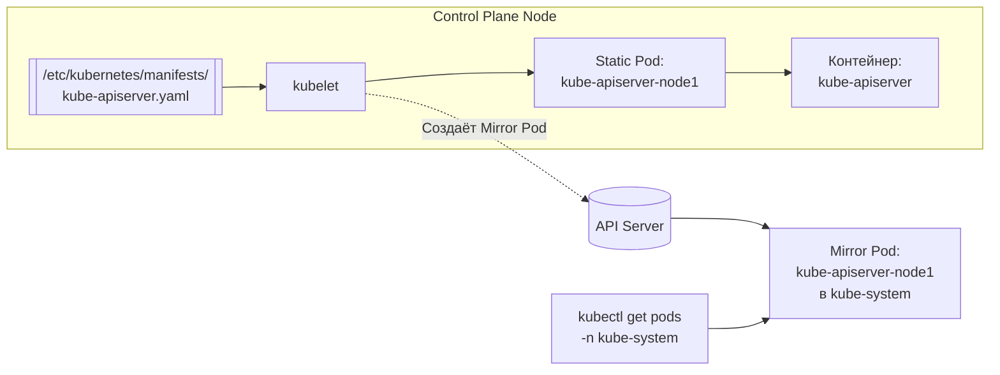

>Статические поды (Static Pods) — это особый механизм, при котором kubelet напрямую управляет подами на ноде, минуя API Server. Критично для работы Control Plane.

# Статические поды (Static Pods) в Kubernetes

> 📌 **Static Pod** = под, которым управляет **kubelet напрямую**, без участия API Server. Манифест лежит на диске ноды (обычно `/etc/kubernetes/manifests/`). Используется для запуска **Control Plane** (kube-apiserver, etcd, scheduler). Для рабочих нагрузок используй **DaemonSet**, а не статические поды.

---

## 🔹 Что такое статический под

| Аспект | Описание |
|--------|----------|
| **Управление** | Kubelet на конкретной ноде (без API Server) |
| **Источник манифеста** | Файл на диске ноды (обычно `/etc/kubernetes/manifests/*.yaml`) или URL |
| **Привязка** | Всегда к одной ноде (где лежит манифест) |
| **Основное назначение** | Запуск компонентов Control Plane (kube-apiserver, etcd, kube-scheduler, kube-controller-manager) |
| **Жизненный цикл** | Kubelet следит за файлом → если под упал, перезапускает; если файл изменился — пересоздаёт под |



> 💡 **Ключевая идея**: статические поды — это «курица, которая несёт яйцо Control Plane». Без них kubeadm не смог бы запустить кластер, потому что для работы API Server нужен сам API Server (парадокс).

---

## 🔹 Как создаётся статический под

### 📋 Шаг 1: Положить манифест на ноду

```bash
# Стандартный путь (настраивается через --pod-manifest-path или --config)
sudo mkdir -p /etc/kubernetes/manifests

# Создать манифет (например, для простого nginx)
sudo tee /etc/kubernetes/manifests/static-nginx.yaml > /dev/null <<EOF
apiVersion: v1
kind: Pod
metadata:
  name: static-nginx
  labels:
    app: static-nginx
spec:
  containers:
  - name: nginx
    image: nginx:1.25
    ports:
    - containerPort: 80
EOF
```

### 📋 Шаг 2: Kubelet автоматически подхватывает

```
Что происходит:
1. Kubelet обнаруживает новый файл в /etc/kubernetes/manifests/
2. Парсит YAML, создаёт под локально
3. Запускает контейнеры
4. Создаёт Mirror Pod в API Server (если API доступен)
```

### 🔍 Шаг 3: Проверить результат

```bash
# На ноде Control Plane:
kubectl get pods -n kube-system | grep static-nginx
# → static-nginx-node1   1/1   Running   0   1m
#   ↑ имя = <имя_файла>-<hostname>

# Проверить аннотацию (признак зеркального пода)
kubectl get pod static-nginx-node1 -n kube-system -o jsonpath='{.metadata.annotations}' | jq
# → {
#     "kubernetes.io/config.mirror": "abc123...",
#     "kubernetes.io/config.source": "file"
#   }
```

---

## 🔹 Зеркальные поды (Mirror Pods)

### 🎯 Что это и зачем

| Аспект | Описание |
|--------|----------|
| **Определение** | «Тень» статического пода в API Server |
| **Назначение** | Сделать статический под видимым для `kubectl`, мониторинга, RBAC |
| **Управление** | ❌ Нельзя управлять через API (удалить, обновить) |
| **Имя** | `<имя_из_манифеста>-<hostname_ноды>` |
| **Метки** | Копируются из статического пода |
| **Аннотации** | `kubernetes.io/config.mirror` — хэш манифеста, `kubernetes.io/config.source: file` |

### 🔄 Как работает синхронизация

```
┌─────────────────────────────────┐
│ Нода: node1                      │
│                                  │
│ /etc/kubernetes/manifests/       │
│   └── kube-apiserver.yaml        │
│         │                        │
│         ▼                        │
│   kubelet создаёт Static Pod     │
│         │                        │
│         ├──── Запускает контейнеры локально
│         │
│         └──── Создаёт Mirror Pod в API Server
│                (если API доступен)
└─────────────────────────────────┘
                │
                ▼
┌─────────────────────────────────┐
│ API Server                       │
│                                  │
│ kube-system/                     │
│   └── kube-apiserver-node1       │  ← Mirror Pod
│         (read-only для kubectl)  │
└─────────────────────────────────┘
```

### ⚠️ Важное поведение

```bash
# ❌ Попытка удалить зеркальный под через kubectl
kubectl delete pod kube-apiserver-node1 -n kube-system
# → pod "kube-apiserver-node1" deleted

# ✅ Что произошло на самом деле:
# 1. API Server удалил Mirror Pod
# 2. Kubelet увидел, что Mirror Pod исчез
# 3. Kubelet ПЕРЕСОЗДАЛ Mirror Pod (потому что статический под всё ещё есть!)

# Проверить через 5 секунд:
kubectl get pod kube-apiserver-node1 -n kube-system
# → kube-apiserver-node1   1/1   Running   0   5s  ← вернулся!
```

> 💡 **Правило**: чтобы удалить статический под, нужно **удалить файл манифеста** с ноды, а не зеркальный под через API.

---

## 🔹 Ограничения статических подов

| Ограничение | Почему | Обходной путь |
|-------------|--------|--------------|
| **❌ Нельзя ссылаться на ConfigMap** | Kubelet не имеет доступа к API при старте (или не должен зависеть от него) | Использовать файлы на диске или environment variables |
| **❌ Нельзя ссылаться на Secret** | То же самое | Файлы на диске с правильными правами |
| **❌ Нельзя ссылаться на ServiceAccount** | ServiceAccount требует API Server | Не нужен — статические поды обычно имеют привилегированный доступ |
| **❌ Нет ephemeral containers** | Нет API для их добавления | Использовать `kubectl exec` или пересоздать под |
| **❌ Нет контроллеров** | Нет Deployment/ReplicaSet | Kubelet сам перезапускает при сбое |
| **❌ Нет rolling updates** | Нет механизма обновлений | Изменить файл манифеста → kubelet пересоздаст под |
| **❌ Нет масштабирования** | Привязан к одной ноде | Использовать DaemonSet для тиражирования |

### 📋 Пример: что НЕ работает

```yaml
# ❌ ЭТО НЕ БУДЕТ РАБОТАТЬ как статический под
apiVersion: v1
kind: Pod
metadata:
  name: broken-static-pod
spec:
  serviceAccountName: my-sa          # ❌ Нельзя
  containers:
  - name: app
    image: my-app:1.0
    envFrom:
    - configMapRef:                  # ❌ Нельзя
        name: my-config
    - secretRef:                     # ❌ Нельзя
        name: my-secret
    volumeMounts:
    - name: config
      mountPath: /etc/config
  volumes:
  - name: config
    configMap:                       # ❌ Нельзя
      name: my-config
```

### ✅ Пример: что РАБОТАЕТ

```yaml
# ✅ Правильный статический под
apiVersion: v1
kind: Pod
metadata:
  name: static-nginx
  labels:
    app: static-nginx
spec:
  hostNetwork: true                  # ✅ Можно (часто нужно для Control Plane)
  containers:
  - name: nginx
    image: nginx:1.25
    ports:
    - containerPort: 80
    env:                             # ✅ Можно (hardcoded значения)
    - name: MY_VAR
      value: "static-value"
    volumeMounts:
    - name: host-config
      mountPath: /etc/nginx/conf.d
  volumes:
  - name: host-config
    hostPath:                        # ✅ Можно (файлы с ноды)
      path: /etc/nginx/conf.d
      type: Directory
```

---

## 🔹 Статические поды vs DaemonSet

| Характеристика | **Static Pod** | **DaemonSet** |
|---------------|---------------|---------------|
| **Управление** | Kubelet напрямую | API Server → Controller Manager → Kubelet |
| **Требует API Server** | ❌ Нет (работает без него) | ✅ Да (требует Control Plane) |
| **Развёртывание** | Вручную на каждой ноде | Автоматически на всех/выбранных нодах |
| **Масштабирование** | ❌ Нет (1 под = 1 нода) | ✅ Да (на все ноды с нужными метками) |
| **Обновления** | Изменить файл → пересоздание | Rolling update, canary, откаты |
| **Откаты** | ❌ Вручную (вернуть старый файл) | ✅ Автоматически через rollout undo |
| **Мониторинг** | Через Mirror Pod | Полноценно через API |
| **Назначение** | Control Plane, bootstrap | Агенты мониторинга, логи, CNI, CSI |

### 🎯 Когда что использовать

| Сценарий | Что выбрать | Почему |
|----------|-----------|--------|
| **Запуск kube-apiserver** | Static Pod | API Server не может зависеть от самого себя |
| **Запуск etcd** | Static Pod | etcd должен работать до API Server |
| **Запуск kube-scheduler** | Static Pod | Scheduler не может работать без API Server, но API Server не может работать без Scheduler (bootstrap) |
| **Агент мониторинга (Prometheus Node Exporter)** | DaemonSet | Нужен на всех нодах, требует обновлений |
| **Лог-агент (Fluentd)** | DaemonSet | Нужен на всех нодах, централизованное управление |
| **CNI-плагин (Calico, Cilium)** | DaemonSet | Нужен на всех нодах, сложные обновления |
| **CSI-драйвер** | DaemonSet | Нужен на нодах с хранилищами |

> 💡 **Правило**: если тебе нужно запустить что-то на **каждой ноде** и это **не Control Plane** — используй **DaemonSet**.

---

## 🔹 Практика: работа со статическими подами

### 🔍 Проверка статических подов

```bash
# 1. Найти все статические поды в кластере
kubectl get pods -n kube-system -o json | jq -r '
  .items[] | 
  select(.metadata.annotations."kubernetes.io/config.source" == "file") | 
  .metadata.namespace + "/" + .metadata.name'

# 2. Посмотреть, какие статические поды есть на конкретной ноде
kubectl get pods -A -o wide --field-selector spec.nodeName=node1 | grep -v Running

# 3. Проверить аннотации зеркального пода
kubectl get pod kube-apiserver-node1 -n kube-system -o jsonpath='{.metadata.annotations}' | jq

# 4. Посмотреть, какой файл манифеста используется
# (на ноде)
ls -la /etc/kubernetes/manifests/
```

### 🛠️ Создание статического пода

```bash
# 1. Подключиться к ноде
ssh node1

# 2. Создать манифест
sudo tee /etc/kubernetes/manifests/my-static-pod.yaml > /dev/null <<EOF
apiVersion: v1
kind: Pod
metadata:
  name: my-static-pod
  labels:
    app: my-static-app
spec:
  hostNetwork: true
  containers:
  - name: app
    image: nginx:1.25
    ports:
    - containerPort: 8080
EOF

# 3. Подождать 10-30 секунд (kubelet подхватит)
# 4. Проверить на ноде Control Plane
kubectl get pods -n kube-system | grep my-static-pod-node1
```

### 🔄 Обновление статического пода

```bash
# 1. Отредактировать файл манифеста на ноде
ssh node1
sudo vim /etc/kubernetes/manifests/my-static-pod.yaml
# Изменить, например, image: nginx:1.26

# 2. Kubelet обнаружит изменение (через 10-20 сек) и пересоздаст под
# 3. Проверить
kubectl get pod my-static-pod-node1 -n kube-system -o jsonpath='{.spec.containers[*].image}'
# → nginx:1.26
```

### 🗑️ Удаление статического пода

```bash
# ❌ НЕПРАВИЛЬНО: удалить через API (не сработает!)
kubectl delete pod my-static-pod-node1 -n kube-system
# → kubelet пересоздаст Mirror Pod

# ✅ ПРАВИЛЬНО: удалить файл манифеста на ноде
ssh node1
sudo rm /etc/kubernetes/manifests/my-static-pod.yaml

# Kubelet остановит под и удалит Mirror Pod из API
# Проверить:
kubectl get pods -n kube-system | grep my-static-pod
# → (пусто)
```

### 🧪 Отладка проблем

```bash
# 1. Под не появляется в API Server
# → Проверить, запущен ли kubelet
ssh node1 'systemctl status kubelet'

# → Проверить логи kubelet
ssh node1 'journalctl -u kubelet | grep -i "static\|manifest"'

# → Проверить путь к манифестам
ssh node1 'ps aux | grep kubelet | grep pod-manifest-path'

# 2. Под в CrashLoopBackOff
# → Посмотреть логи (через Mirror Pod)
kubectl logs my-static-pod-node1 -n kube-system

# → Если Mirror Pod не создан — смотреть логи на ноде
ssh node1 'crictl logs $(crictl ps -q --name my-static-pod)'

# 3. Под не обновляется после изменения файла
# → Проверить права на файл
ssh node1 'ls -la /etc/kubernetes/manifests/my-static-pod.yaml'

# → Проверить, не заблокирован ли файл
ssh node1 'lsof /etc/kubernetes/manifests/my-static-pod.yaml'

# → Перезапустить kubelet (крайняя мера)
ssh node1 'sudo systemctl restart kubelet'
```

---

## 🔹 Пример: статический под для Control Plane (kubeadm)

```bash
# После kubeadm init на Control Plane ноде:
ls -la /etc/kubernetes/manifests/
# → kube-apiserver.yaml
# → kube-controller-manager.yaml
# → kube-scheduler.yaml
# → etcd.yaml

# Все эти поды — статические!
kubectl get pods -n kube-system -o wide
# NAME                                       READY   STATUS    NODE
# etcd-node1                                 1/1     Running   node1  ← Static Pod
# kube-apiserver-node1                       1/1     Running   node1  ← Static Pod
# kube-controller-manager-node1              1/1     Running   node1  ← Static Pod
# kube-scheduler-node1                       1/1     Running   node1  ← Static Pod
# coredns-...                                2/2     Running   node2  ← Обычный под (Deployment)
# kube-proxy-...                             1/1     Running   node1  ← DaemonSet
```

### 🔍 Как kubeadm использует статические поды

```
1. kubeadm init генерирует манифесты в /etc/kubernetes/manifests/
2. Kubelet подхватывает их и запускает Control Plane
3. kube-apiserver становится доступен
4. kubeadm создаёт остальные ресурсы (CoreDNS, kube-proxy и т.д.) через API
5. Кластер готов к работе
```

> 💡 **Интересный факт**: если удалить файл `/etc/kubernetes/manifests/kube-apiserver.yaml`, то API Server остановится, и весь кластер перестанет работать (кроме уже запущенных подов).

---

## 🔹 Чек-лист: работа со статическими подами

### ✅ При создании
```bash
# • Используй статические поды ТОЛЬКО для Control Plane или bootstrap-задач
#   → Для всего остального — DaemonSet

# • Храни манифесты в /etc/kubernetes/manifests/ (стандартный путь)
#   → Или настрой --pod-manifest-path в kubelet

# • Давай понятные имена: kube-apiserver, etcd, my-bootstrap-task
#   → Имя файла = имя пода (без суффикса hostname)

# • Не ссылайся на ConfigMap, Secret, ServiceAccount
#   → Используй hostPath, environment variables, файлы на диске

# • Добавляй метки для фильтрации
#   → Они скопируются в Mirror Pod

# • Проверяй синтаксис YAML перед сохранением
#   → kubelet не валидирует манифест так строго, как API Server
```

### ✅ При обновлении
```bash
# • Изменяй файл манифеста на ноде
#   → kubelet автоматически пересоздаст под

# • Проверяй логи после обновления
#   → kubectl logs <static-pod>-<node> -n kube-system

# • Не забудь синхронизировать изменения на всех нодах (если нужно)
#   → Для этого лучше использовать DaemonSet или конфигурационное управление (Ansible, Chef)
```

### ✅ При удалении
```bash
# • Удаляй ФАЙЛ МАНИФЕСТА, а не Mirror Pod
#   → rm /etc/kubernetes/manifests/<name>.yaml

# • Подожди 10-30 секунд, пока kubelet остановит под
#   → Mirror Pod исчезнет из API автоматически

# • Проверь, что под действительно удалён
#   → kubectl get pods -n kube-system | grep <name>
```

### ✅ При отладке
```bash
# 1. Под не появляется:
ssh <node> 'journalctl -u kubelet | grep -i "static\|manifest"'
ssh <node> 'ls -la /etc/kubernetes/manifests/'

# 2. Под в CrashLoopBackOff:
kubectl logs <pod>-<node> -n kube-system --previous
ssh <node> 'crictl logs $(crictl ps -q --name <pod>)'

# 3. Под не обновляется:
ssh <node> 'stat /etc/kubernetes/manifests/<name>.yaml'
ssh <node> 'sudo systemctl restart kubelet'  # крайняя мера

# 4. Mirror Pod не создаётся:
# → Проверить связность kubelet → API Server
ssh <node> 'curl -k https://<api-server>:6443/healthz'
```

### ❌ Чего избегать
```bash
# ❌ Не используй статические поды для рабочих нагрузок
#   → Нет масштабирования, обновлений, откатов
#   → Используй DaemonSet

# ❌ Не удаляй Mirror Pod через kubectl
#   → kubelet пересоздаст его
#   → Удаляй файл манифеста на ноде

# ❌ Не ссылайся на ConfigMap/Secret в статическом поде
#   → Это не будет работать
#   → Используй файлы на диске

# ❌ Не храни секреты в манифесте статического пода
#   → Файл читается kubelet'ом, но может быть доступен другим пользователям ноды
#   → Используй файлы с правами 600, владельцем root

# ❌ Не забывай синхронизировать изменения между нодами
#   → Если нужен одинаковый под на всех нодах — используй DaemonSet
```

---

## 🔹 Ключевые выводы

1. **Static Pod = kubelet + файл на диске**: управление без API Server.
2. **Mirror Pod = тень в API**: виден для `kubectl`, но не управляется оттуда.
3. **Имя = `<manifest_name>-<hostname>`**: суффикс добавляется автоматически.
4. **Ограничения**: нет ConfigMap, Secret, ServiceAccount, ephemeral containers.
5. **Для Control Plane — да, для рабочих нагрузок — нет**: используй DaemonSet.
6. **Удаление через файл**: `rm /etc/kubernetes/manifests/<name>.yaml`, а не `kubectl delete`.
7. **Обновление через файл**: изменил YAML → kubelet пересоздал под.

> 💡 **Финальный совет**: статические поды — это мощный, но узкоспециализированный механизм. Используй их только там, где действительно нужно запустить что-то без API Server (Control Plane, bootstrap). Для всего остального — DaemonSet, который даёт полноценное управление через Kubernetes API.
