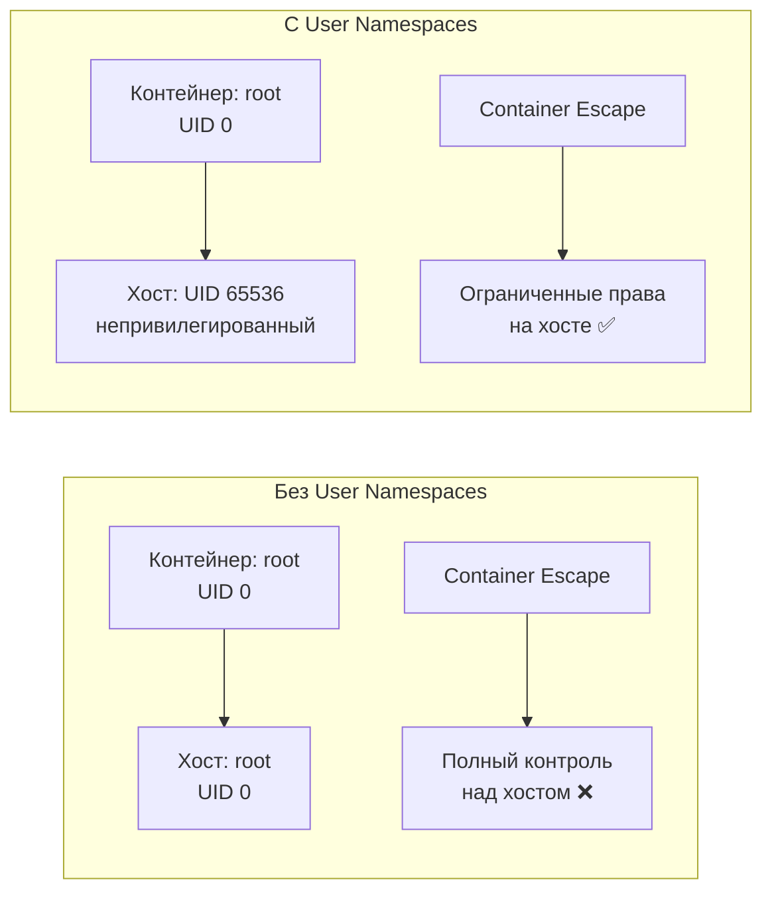

>User Namespaces — это продвинутый механизм безопасности, который изолирует пользователей внутри контейнера от пользователей на хосте. Критично для защиты от container escape-атак.

# User Namespaces (Пространства имён пользователей) в Kubernetes

> 📌 **User Namespaces** = изоляция UID/GID контейнера от UID/GID хоста. Root внутри контейнера становится непривилегированным пользователем на хосте. Включается через `spec.hostUsers: false`. Снижает риск container escape-атак. Стабильно с K8s 1.36, требует Linux 6.3+, containerd 2.0+ или CRI-O 1.25+.

---

## 🔹 Что такое User Namespaces

| Аспект | Описание |
|--------|----------|
| **Определение** | Механизм Linux, который создаёт отдельное пространство имён для UID/GID внутри контейнера |
| **Назначение** | Изоляция пользователя контейнера от пользователя хоста для повышения безопасности |
| **Как работает** | UID 0 (root) внутри контейнера → UID 65536+ (непривилегированный) на хосте |
| **Включение** | `spec.hostUsers: false` в манифесте пода |
| **Эффект** | Даже если контейнер скомпрометирован, у него нет прав root на хосте |



> 
>💡 **Ключевая идея**: User Namespaces превращает root внутри контейнера в "ненастоящего" root на хосте. Это критично для защиты от уязвимостей типа CVE-2021-25741.

---

## 🔹 Как это работает: маппинг UID/GID

### 🔄 Принцип работы

```
Внутри контейнера:
┌─────────────────────────┐
│ Процесс: UID 0 (root)   │
│ Может: apt install,     │
│        изменять файлы   │
│        от имени root    │
└──────────┬──────────────┘
           │
           │ User Namespace
           │ (idmap mount)
           ▼
На хосте:
┌─────────────────────────┐
│ Процесс: UID 65536      │
│ (непривилегированный)   │
│ Не может: изменять      │
│ системные файлы,        │
│ загружать модули ядра   │
└─────────────────────────┘
```

### 📊 Пример маппинга

```yaml
# Внутри контейнера:
runAsUser: 0          # ← root
runAsGroup: 0         # ← root

# На хосте (реально):
UID: 65536            # ← непривилегированный пользователь
GID: 65536            # ← непривилегированная группа
```

```bash
# Проверка на хосте:
ps aux | grep <container-process>
# →UID: 65536 (не root!)

# Проверка внутри контейнера:
id
# → uid=0(root) gid=0(root)  ← "думает", что root
```

> ⚠️ **Важно**: файлы, созданные контейнером на томах (включая hostPath), будут иметь UID/GID как если бы User Namespaces не использовался. Это обеспечивает совместимость с существующими томами.

---

## 🔹 Требования для использования

### 🖥️ Системные требования

| Компонент | Минимальная версия | Рекомендация |
|-----------|-------------------|--------------|
| **Linux Kernel** | 6.3+ | 6.5+ (лучшая поддержка idmap mounts) |
| **containerd** | 2.0+ | 2.0+ |
| **CRI-O** | 1.25+ | 1.28+ |
| **crun** (если используется) | 1.9+ | 1.13+ |
| **runc** (если используется) | 1.2+ | 1.1.12+ |

### 📁 Поддерживаемые файловые системы

| Файловая система | Поддержка idmap mounts | Комментарий |
|-----------------|----------------------|-------------|
| **ext4** | ✅ Да | Стандарт для большинства систем |
| **xfs** | ✅ Да | Часто используется для /var/lib/kubelet |
| **btrfs** | ✅ Да | Поддерживается с Linux 6.3 |
| **tmpfs** | ✅ Да | Критично для ServiceAccount tokens, Secrets |
| **overlayfs** | ✅ Да | Используется containerd/CRI-O |
| **NFS** | ❌ Нет | Клиент NFS не поддерживает idmap mounts |
| **CephFS** | ⚠️ Частично | Зависит от версии ядра |

```bash
# Проверить, поддерживает ли файловая система idmap mounts
mount | grep /var/lib/kubelet
# → /dev/sda1 on /var/lib/kubelet type ext4 (rw,relatime)

# Проверить версию ядра
uname -r
# → 6.5.0-35-generic  ← должно быть ≥ 6.3
```

> ⚠️ **Критично**: `/var/lib/kubelet/pods/` должна быть на файловой системе с поддержкой idmap. Иначе поды с User Namespaces не запустятся.

---

## 🔹 Как включить User Namespaces

### 📋 Базовый манифест пода

```yaml
apiVersion: v1
kind: Pod
metadata:
  name: user-ns-demo
spec:
  hostUsers: false  # ← КЛЮЧЕВОЕ: включить User Namespaces
  containers:
  - name: app
    image: nginx:1.25
    securityContext:
      runAsUser: 0      # ← Внутри контейнера: root (UID 0)
      runAsGroup: 0     # ← Внутри контейнера: root (GID 0)
    volumeMounts:
    - name: data
      mountPath: /data
  
  volumes:
  - name: data
    emptyDir: {}
```

```bash
# Применить
kubectl apply -f user-ns-pod.yaml

# Проверить, что под запущен
kubectl get pod user-ns-demo
# → user-ns-demo   1/1   Running   0   1m

# Проверить UID на хосте (нужен доступ к ноде)
ssh <node> 'crictl ps | grep user-ns-demo'
# → <container-id>  ...  Running

ssh <node> 'ps -o user,pid,cmd -p $(crictl inspect <container-id> | jq -r .info.pid)'
# → UID: 65536  (не root!)
```

---

## 🔹 Настройка kubelet для User Namespaces

### 📋 Шаг 1: Настроить subuid/subgid

```bash
# На каждой ноде отредактировать /etc/subuid и /etc/subgid

# /etc/subuid
kubelet:65536:7208960
#   ↑        ↑     ↑
#   имя      │     количество UID (110 подов × 65536)
#            первый UID (должен быть ≥ 65536)

# /etc/subgid
kubelet:65536:7208960
# Аналогично для GID
```

### 📋 Шаг 2: Настроить KubeletConfiguration

```yaml
# /var/lib/kubelet/config.yaml
apiVersion: kubelet.config.k8s.io/v1beta1
kind: KubeletConfiguration

userNamespaces:
  idsPerPod: 1048576  # ← Количество UID/GID на под (по умолчанию 65536)
  # Должно быть кратно 65536
  # Увеличь, если нужно больше UID внутри контейнера
```

### 📋 Шаг 3: Перезапустить kubelet

```bash
sudo systemctl restart kubelet

# Проверить, что kubelet запущен
systemctl status kubelet

# Проверить логи на предмет ошибок
journalctl -u kubelet | grep -i "user.*namespace\|subuid"
```

### 📊 Расчёт количества UID/GID

```
Формула:
Количество UID = maxPods × idsPerPod

Пример:
• maxPods = 110 (по умолчанию)
• idsPerPod = 65536 (по умолчанию)
• Нужно: 110 × 65536 = 7,208,960 UID

Если idsPerPod = 1048576 (1M):
• Нужно: 110 × 1048576 = 115,343,360 UID
```

> ⚠️ **Важно**: 
> - Первый UID должен быть ≥ 65536 (нельзя использовать 0-65535)
> - Количество UID должно быть кратно 65536
> - Диапазоны в /etc/subuid и /etc/subgid должны совпадать

---

## 🔹 Ограничения User Namespaces

### 🚫 Что нельзя использовать вместе с `hostUsers: false`

| Ограничение | Почему | Обходной путь |
|-------------|--------|--------------|
| **`hostNetwork: true`** | Конфликт с изоляцией сети | Использовать ClusterIP или NodePort |
| **`hostIPC: true`** | Конфликт с изоляцией IPC | Не требуется для большинства приложений |
| **`hostPID: true`** | Конфликт с изоляцией PID | Не требуется для большинства приложений |
| **`volumeDevices`** | Raw block devices не поддерживаются | Использовать файловые тома |
| **NFS volumes** | NFS клиент не поддерживает idmap mounts | Использовать ext4/xfs на NFS сервере, монтировать как файловую систему |

### 📋 Пример: что НЕ работает

```yaml
# ❌ ЭТО НЕ БУДЕТ РАБОТАТЬ
apiVersion: v1
kind: Pod
metadata:
  name: broken-user-ns
spec:
  hostUsers: false
  hostNetwork: true  # ❌ Нельзя с hostUsers: false
  containers:
  - name: app
    image: nginx
    volumeDevices:   # ❌ Нельзя с hostUsers: false
    - name: raw-disk
      devicePath: /dev/sda
```

### ✅ Пример: что РАБОТАЕТ

```yaml
# ✅ Правильный манифест
apiVersion: v1
kind: Pod
metadata:
  name: working-user-ns
spec:
  hostUsers: false
  containers:
  - name: app
    image: nginx:1.25
    securityContext:
      runAsUser: 0
      runAsGroup: 0
    volumeMounts:
    - name: data
      mountPath: /data
    - name: config
      mountPath: /etc/config
  
  volumes:
  - name: data
    emptyDir: {}
  - name: config
    configMap:
      name: my-config
```

---

## 🔹 Интеграция с Pod Security Standards (PSS)

### 🛡️ Смягчение проверок безопасности

При использовании User Namespaces некоторые проверки PSS **смягчаются**, потому что root внутри контейнера ≠ root на хосте.

| Поле | Обычно проверяется | С User Namespaces |
|------|-------------------|------------------|
| `runAsNonRoot: true` | ✅ Обязательно | ❌ Не требуется (root изолирован) |
| `runAsUser: 0` | ❌ Запрещено | ✅ Разрешено (root изолирован) |
| `procMount: Default` | ✅ Обязательно | ✅ Обязательно (даже с User NS) |

### 📋 Пример: Pod Security Standard

```yaml
# Namespace с Restricted PSS
apiVersion: v1
kind: Namespace
metadata:
  name: secure-ns
  labels:
    pod-security.kubernetes.io/enforce: restricted

---
# Под с User Namespaces (проходит Restricted PSS!)
apiVersion: v1
kind: Pod
metadata:
  name: secure-pod
  namespace: secure-ns
spec:
  hostUsers: false  # ← Включить User Namespaces
  containers:
  - name: app
    image: nginx:1.25
    securityContext:
      runAsUser: 0      # ← Обычно запрещено в Restricted, но ОК с User NS
      runAsGroup: 0
      allowPrivilegeEscalation: false
      capabilities:
        drop: ["ALL"]
```

> 💡 **Почему это безопасно**: root внутри контейнера с User Namespaces — это UID 65536 на хосте. Он не может загружать модули ядра, изменять системные файлы или влиять на другие поды.

---

## 🔹 Практика: отладка и мониторинг

### 🔍 Проверка, что User Namespaces работает

```bash
# 1. Проверить, что под запущен с hostUsers: false
kubectl get pod user-ns-demo -o jsonpath='{.spec.hostUsers}'
# → false

# 2. Проверить UID процесса на хосте (нужен доступ к ноде)
ssh <node> 'crictl ps | grep user-ns-demo'
# → <container-id>  ...  Running

ssh <node> 'ps -o user,pid,cmd -p $(crictl inspect <container-id> | jq -r .info.pid)'
# → UID: 65536  (не root!)

# 3. Проверить внутри контейнера
kubectl exec user-ns-demo -- id
# → uid=0(root) gid=0(root)  ← "думает", что root

# 4. Проверить маппинг
ssh <node> 'cat /proc/$(crictl inspect <container-id> | jq -r .info.pid)/uid_map'
# → 0  65536  65536
#   ↑     ↑       ↑
#   │     │       количество UID
#   │     UID на хосте
#   UID внутри контейнера
```

### 🚨 Частые проблемы и решения

| Проблема | Симптомы | Причина | Решение |
|----------|----------|---------|---------|
| **Под не запускается** | `FailedCreatePodSandBox`, ошибка "idmap mounts not supported" | Файловая система не поддерживает idmap | Использовать ext4/xfs для /var/lib/kubelet |
| **Ошибка "invalid argument"** | `failed to set MOUNT_ATTR_IDMAP` | Ядро < 6.3 или ФС не поддерживает | Обновить ядро до 6.3+ |
| **NFS том не монтируется** | `mount failed: unknown filesystem type` | NFS не поддерживает idmap | Использовать файловую систему поверх NFS |
| **Неправильный UID на хосте** | Процесс на хосте имеет UID из диапазона 0-65535 | Неправильная настройка /etc/subuid | Проверить, что первый UID ≥ 65536 |
| **Поды не запускаются после обновления kubelet** | Ошибки в логах kubelet про subuid/subgid | Не настроен пользователь kubelet в subuid/subgid | Добавить запись `kubelet:65536:...` в /etc/subuid |

### 🛠️ Команды для диагностики

```bash
# 1. Проверить версию ядра
uname -r
# → должно быть ≥ 6.3

# 2. Проверить файловую систему kubelet
mount | grep /var/lib/kubelet
# → должна быть ext4, xfs, btrfs, tmpfs, overlayfs

# 3. Проверить subuid/subgid
grep kubelet /etc/subuid /etc/subgid
# → kubelet:65536:7208960

# 4. Проверить KubeletConfiguration
cat /var/lib/kubelet/config.yaml | grep -A5 userNamespaces

# 5. Проверить логи kubelet
journalctl -u kubelet | grep -i "user.*namespace\|subuid\|idmap"

# 6. Проверить метрики kubelet (если включены)
curl -s http://localhost:10255/metrics | grep user_namespaced_pods
# → started_user_namespaced_pods_total 10
# → started_user_namespaced_pods_errors_total 0
```

### 📊 Мониторинг через Prometheus

```yaml
# Полезные метрики kubelet
started_user_namespaced_pods_total        # Всего попыток создать поды с User NS
started_user_namespaced_pods_errors_total # Ошибки при создании

# Пример PromQL для алерта
# Алерт, если есть ошибки при создании подов с User NS
rate(started_user_namespaced_pods_errors_total[5m]) > 0
```

---

## 🔹 Чек-лист: настройка User Namespaces

### ✅ Подготовка ноды
```bash
# • Проверить версию ядра: uname -r (должно быть ≥ 6.3)
# • Проверить файловую систему: mount | grep /var/lib/kubelet
#   → должна поддерживать idmap mounts (ext4, xfs, btrfs, tmpfs, overlayfs)

# • Настроить /etc/subuid и /etc/subgid:
#   kubelet:65536:<количество>
#   где <количество> = maxPods × idsPerPod (кратно 65536)

# • Убедиться, что пользователь kubelet существует в системе
#   id kubelet

# • Проверить, что getsubids установлен
#   which getsubids  # из пакета shadow-utils
```

### ✅ Настройка kubelet
```bash
# • Добавить в KubeletConfiguration:
#   userNamespaces:
#     idsPerPod: 65536  # или больше (кратно 65536)

# • Перезапустить kubelet:
#   sudo systemctl restart kubelet

# • Проверить логи на предмет ошибок:
#   journalctl -u kubelet | grep -i "user.*namespace"
```

### ✅ Создание подов
```bash
# • Добавить hostUsers: false в spec пода
# • Не использовать hostNetwork, hostIPC, hostPID
# • Не использовать volumeDevices (raw block)
# • Не использовать NFS тома

# • Проверить, что под запущен:
#   kubectl get pod <name>

# • Проверить UID на хосте (если есть доступ к ноде):
#   ps -o user,pid,cmd -p <pid>
```

### ✅ Интеграция с PSS
```bash
# • Если используешь Restricted PSS:
#   → Можно использовать runAsUser: 0 с hostUsers: false
#   → Не нужно runAsNonRoot: true

# • Если используешь Baseline PSS:
#   → Можно использовать runAsUser: 0 с hostUsers: false
#   → Можно использовать procMount: Default

# • Проверить, что под проходит PSS:
#   kubectl auth can-i create pod -n <namespace> --as=<user>
```

### ❌ Чего избегать
```bash
# ❌ Не используй User Namespaces на нодах с ядром < 6.3
#   → Функция не будет работать

# ❌ Не используй NFS тома с User Namespaces
#   → NFS не поддерживает idmap mounts

# ❌ Не комбинируй hostUsers: false с hostNetwork/hostIPC/hostPID
#   → Это нарушает изоляцию

# ❌ Не ставь первый UID < 65536 в /etc/subuid
#   → Это создаст конфликт с системными пользователями

# ❌ Не забывай синхронизировать /etc/subuid и /etc/subgid на всех нодах
#   → Иначе поды будут запускаться только на некоторых нодах
```

---

## 🔹 Ключевые выводы

1. **User Namespaces = изоляция UID/GID**: root в контейнере ≠ root на хосте.
2. **Включение**: `spec.hostUsers: false` в манифесте пода.
3. **Требования**: Linux 6.3+, containerd 2.0+ или CRI-O 1.25+, ФС с поддержкой idmap.
4. **Настройка kubelet**: /etc/subuid, /etc/subgid, KubeletConfiguration.idsPerPod.
5. **Ограничения**: нельзя использовать hostNetwork/hostIPC/hostPID, volumeDevices, NFS.
6. **PSS интеграция**: некоторые проверки смягчаются, потому что root изолирован.
7. **Безопасность**: критично для защиты от container escape-атак.

> 💡 **Финальный совет**: User Namespaces — это мощный механизм безопасности, но требует подготовки инфраструктуры (ядро, ФС, kubelet). Начинай с тестового кластера, убедись, что всё работает, затем внедряй в production. Для большинства приложений это значительное улучшение безопасности без изменения кода.
