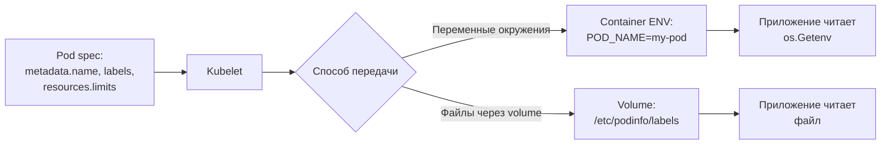

>Downward API — это удобный механизм для передачи метаданных пода и контейнера внутрь самого контейнера без обращения к API Server.

# Downward API в Kubernetes — Передача метаданных в контейнер

> 📌 Downward API** = механизм, который передаёт метаданные пода/контейнера (имя, неймспейс, метки, ресурсы) внутрь контейнера через **переменные окружения** или **файлы** (через `downwardAPI` volume). Не требует клиента Kubernetes или доступа к API Server.

---

## 1. Что такое Downward API и зачем он нужен

| Аспект | Описание |
|--------|----------|
| **Определение** | Механизм Kubernetes для предоставления контейнеру информации о самом себе |
| **Назначение** | Избежать жёсткой привязки приложения к Kubernetes API |
| **Принцип** | Kubelet заполняет переменные/файлы актуальными данными из spec пода |
| **Безопасность** | Не требует токена ServiceAccount или доступа к API Server |

### 🎯 Типичные сценарии использования

```
Проблема:
• Приложение хочет знать своё имя пода для логирования
• Нужно передать версию/метки в конфиг приложения
• Приложение должно знать лимиты памяти для настройки GC
• Нужен IP ноды для отправки метрик

Решение без Downward API:
• Обернуть приложение в shell-скрипт → сложно, хрупко
• Дать приложению доступ к API Server → избыточные привилегии
• Хардкодить значения в образ → негибко

Решение с Downward API:
• Kubelet сам inject'ит данные в env или файл
• Приложение читает как обычную переменную/конфиг
• Никаких дополнительных привилегий не нужно
```



---

## 2. Два механизма передачи

| Характеристика | **Переменные окружения** | **Файлы (downwardAPI volume)** |
|---------------|-------------------------|-------------------------------|
| **Механизм** | `env.valueFrom.fieldRef` | `volumes.downwardAPI.items` |
| **Обновление** | ❌ Только при перезапуске контейнера | ✅ Автоматически при изменении (для меток/аннотаций) |
| **In-place resize** | ❌ Не обновляется | ✅ Обновляется (для resourceFieldRef) |
| **Формат данных** | Строка | Строка или файл с несколькими строками |
| **Все метки/аннотации** | ❌ Только по одной через `['KEY']` | ✅ Все сразу в одном файле |
| **Когда использовать** | Простые значения, известные при старте | Динамические данные, конфиги, все метки |

> 💡 **Правило**: если данные могут меняться во время жизни пода (метки, аннотации, ресурсы при resize) — используй **volume**. Если значения фиксированы — можно **env**.

---

## 3. Доступные поля через `fieldRef`

### 📋 Поля уровня Pod

| Поле | Описание | Env | Volume |
|------|----------|:---:|:------:|
| `metadata.name` | Имя пода | ✅ | ✅ |
| `metadata.namespace` | Неймспейс пода | ✅ | ✅ |
| `metadata.uid` | UID пода | ✅ | ✅ |
| `metadata.labels['<KEY>']` | Конкретная метка | ✅ | ✅ |
| `metadata.annotations['<KEY>']` | Конкретная аннотация | ✅ | ✅ |
| `metadata.labels` | **Все** метки (по строке на метку) | ❌ | ✅ |
| `metadata.annotations` | **Все** аннотации (по строке) | ❌ | ✅ |
| `spec.serviceAccountName` | Имя ServiceAccount | ✅ | ❌ |
| `spec.nodeName` | Имя ноды | ✅ | ❌ |
| `status.hostIP` | IP ноды (основной) | ✅ | ❌ |
| `status.hostIPs` | Все IP ноды (dual-stack) | ✅ | ❌ |
| `status.podIP` | IP пода (основной) | ✅ | ❌ |
| `status.podIPs` | Все IP пода (dual-stack) | ✅ | ❌ |

> ⚠️ **Важно**: поля `status.*` (IP-адреса) доступны в env, но **не гарантированы** на момент старта контейнера — они появляются после планирования. Для надёжности используй readinessProbe.

---

## 4. Доступные поля через `resourceFieldRef`

### 📋 Поля уровня контейнера (ресурсы)

| Поле | Описание | Env | Volume |
|------|----------|:---:|:------:|
| `limits.cpu` | Лимит CPU | ✅ | ✅ |
| `requests.cpu` | Запрос CPU | ✅ | ✅ |
| `limits.memory` | Лимит памяти | ✅ | ✅ |
| `requests.memory` | Запрос памяти | ✅ | ✅ |
| `limits.hugepages-<size>` | Лимит hugepages | ✅ | ✅ |
| `requests.hugepages-<size>` | Запрос hugepages | ✅ | ✅ |
| `limits.ephemeral-storage` | Лимит ephemeral storage | ✅ | ✅ |
| `requests.ephemeral-storage` | Запрос ephemeral storage | ✅ | ✅ |

### 🔄 Поведение при in-place resize (стабильно с 1.35)

```
При изменении ресурсов пода на месте (In-Place Resize):

Volume (downwardAPI):
• resourceFieldRef автоматически обновляется
• Приложение может перечитать файл и получить новые значения
• Перезапуск контейнера НЕ требуется

Переменные окружения:
• НЕ обновляются
• Для применения новых значений нужен перезапуск контейнера
```

> 💡 **Практика**: если используешь in-place resize и приложению нужно знать актуальные ресурсы — используй **volume**, а не env.

---

## 5. Практика: примеры использования

### 📦 Пример 1: Передача метаданных через env

```yaml
apiVersion: v1
kind: Pod
metadata:
  name: downward-api-demo
  namespace: production
  labels:
    app: my-app
    version: v1.2.3
  annotations:
    build-url: "https://ci.example.com/build/123"
spec:
  serviceAccountName: my-sa
  containers:
  - name: app
    image: my-app:1.0
    env:
    - name: POD_NAME
      valueFrom:
        fieldRef:
          fieldPath: metadata.name
    - name: POD_NAMESPACE
      valueFrom:
        fieldRef:
          fieldPath: metadata.namespace
    - name: POD_UID
      valueFrom:
        fieldRef:
          fieldPath: metadata.uid
    - name: APP_VERSION
      valueFrom:
        fieldRef:
          fieldPath: metadata.labels['version']
    - name: NODE_NAME
      valueFrom:
        fieldRef:
          fieldPath: spec.nodeName
    - name: POD_IP
      valueFrom:
        fieldRef:
          fieldPath: status.podIP
    - name: SERVICE_ACCOUNT
      valueFrom:
        fieldRef:
          fieldPath: spec.serviceAccountName
    resources:
      requests:
        memory: "256Mi"
        cpu: "250m"
      limits:
        memory: "512Mi"
        cpu: "500m"
```

```bash
# Проверить, что env установлены
kubectl exec downward-api-demo -- env | grep -E 'POD_|APP_|NODE_|SERVICE_'
# POD_NAME=downward-api-demo
# POD_NAMESPACE=production
# POD_UID=a1b2c3d4-e5f6-7890-abcd-ef1234567890
# APP_VERSION=v1.2.3
# NODE_NAME=node-1
# POD_IP=10.244.1.5
# SERVICE_ACCOUNT=my-sa
```

---

### 📦 Пример 2: Передача всех меток через volume

```yaml
apiVersion: v1
kind: Pod
metadata:
  name: downward-api-volume
  labels:
    app: my-app
    version: v1.2.3
    team: platform
  annotations:
    build-url: "https://ci.example.com/build/123"
    deploy-time: "2024-06-05T10:00:00Z"
spec:
  containers:
  - name: app
    image: my-app:1.0
    volumeMounts:
    - name: podinfo
      mountPath: /etc/podinfo
      readOnly: true
    resources:
      requests:
        memory: "256Mi"
        cpu: "250m"
      limits:
        memory: "512Mi"
        cpu: "500m"
  
  volumes:
  - name: podinfo
    downwardAPI:
      items:
      - path: "labels"
        fieldRef:
          fieldPath: metadata.labels
      - path: "annotations"
        fieldRef:
          fieldPath: metadata.annotations
      - path: "cpu_limit"
        resourceFieldRef:
          containerName: app
          resource: limits.cpu
          divisor: 1m        # ← в милли-CPU
      - path: "memory_limit"
        resourceFieldRef:
          containerName: app
          resource: limits.memory
          divisor: 1Mi       # ← в MiB
```

```bash
# Проверить содержимое файлов
kubectl exec downward-api-volume -- cat /etc/podinfo/labels
# app="my-app"
# team="platform"
# version="v1.2.3"

kubectl exec downward-api-volume -- cat /etc/podinfo/annotations
# build-url="https://ci.example.com/build/123"
# deploy-time="2024-06-05T10:00:00Z"

kubectl exec downward-api-volume -- cat /etc/podinfo/cpu_limit
# 500

kubectl exec downward-api-volume -- cat /etc/podinfo/memory_limit
# 512
```

> 💡 **Формат файлов**: метки и аннотации записываются в формате `key="value"` (по одной на строку). Значения экранируются (кавычки, переносы строк).

---

### 📦 Пример 3: Использование в приложении

```python
# Python: чтение из env
import os

pod_name = os.environ.get('POD_NAME', 'unknown')
namespace = os.environ.get('POD_NAMESPACE', 'default')
version = os.environ.get('APP_VERSION', 'dev')

print(f"Starting {pod_name} in {namespace}, version {version}")
```

```python
# Python: чтение из файлов (для динамических данных)
def read_file(path):
    try:
        with open(path, 'r') as f:
            return f.read().strip()
    except FileNotFoundError:
        return None

# Прочитать все метки
labels_content = read_file('/etc/podinfo/labels')
# Парсинг: app="my-app"\nteam="platform"\n...
labels = {}
for line in labels_content.split('\n'):
    if '=' in line:
        key, value = line.split('=', 1)
        labels[key] = value.strip('"')

# Прочитать лимит памяти (для настройки GC)
memory_limit_mb = int(read_file('/etc/podinfo/memory_limit'))
# Использовать для настройки JVM: -Xmx${memory_limit_mb}m
```

```go
// Go: чтение из env
podName := os.Getenv("POD_NAME")
namespace := os.Getenv("POD_NAMESPACE")

// Go: чтение из файлов
labelsData, err := os.ReadFile("/etc/podinfo/labels")
if err != nil {
    log.Printf("Failed to read labels: %v", err)
}
```

---

## 6. Fallback для ресурсов: если limits не заданы

### 📊 Поведение по умолчанию

```
Если в spec контейнера НЕ указаны limits.cpu или limits.memory,
а ты используешь resourceFieldRef для их получения:

Kubelet использует fallback:
• limits.cpu → allocatable CPU ноды
• limits.memory → allocatable memory ноды

Это может привести к неожиданным значениям!
```

### 🧮 Пример fallback

```yaml
# Контейнер БЕЗ limits
spec:
  containers:
  - name: app
    image: my-app:1.0
    resources:
      requests:
        memory: "256Mi"
        cpu: "250m"
      # limits НЕ заданы!
    env:
    - name: MEMORY_LIMIT
      valueFrom:
        resourceFieldRef:
          resource: limits.memory
```

```bash
# На ноде с allocatable memory = 16Gi
kubectl exec my-pod -- printenv MEMORY_LIMIT
# → 17179869184  (16 GiB в байтах!)

# Это НЕ то, что ожидалось!
# Приложение может решить, что у него 16 GiB памяти
# и попытаться использовать её, что приведёт к OOMKill
```

### ✅ Рекомендация

```yaml
# Всегда явно указывай limits, если используешь resourceFieldRef
spec:
  containers:
  - name: app
    resources:
      requests:
        memory: "256Mi"
        cpu: "250m"
      limits:
        memory: "512Mi"    # ← Явно задано
        cpu: "500m"        # ← Явно задано
```

> ⚠️ **Важно**: fallback может сильно исказить логику приложения. Всегда задавай limits явно, особенно если приложение использует эти значения для настройки (JVM GC, connection pools и т.д.).

---

## 7. Делитель (divisor): формат значений ресурсов

### 📏 Как контролировать единицы измерения

```yaml
resourceFieldRef:
  containerName: app
  resource: limits.memory
  divisor: 1Mi    # ← Значение будет в MiB

# Примеры divisor:
# 1      → в байтах (1073741824 для 1 GiB)
# 1Ki    → в KiB
# 1Mi    → в MiB (512 для 512 MiB)
# 1Gi    → в GiB
# 1m     → в милли-CPU (500 для 500m)
# 1      → в CPU (1 для 1 CPU, 0 для 500m)
```

### 📊 Примеры значений

| Ресурс | Задано | divisor | Значение в файле |
|--------|--------|---------|-----------------|
| `limits.memory` | `512Mi` | `1` (байты) | `536870912` |
| `limits.memory` | `512Mi` | `1Mi` | `512` |
| `limits.memory` | `1Gi` | `1Gi` | `1` |
| `limits.cpu` | `500m` | `1` (CPU) | `0` (округление!) |
| `limits.cpu` | `500m` | `1m` | `500` |
| `limits.cpu` | `2` | `1` | `2` |

> ⚠️ **Важно**: для CPU используй `divisor: 1m`, иначе дробные значения (500m) округлятся до 0.

---

## 8. Отладка и мониторинг

### 🔍 Проверка работы Downward API

```bash
# 1. Проверить, что env установлены
kubectl exec my-pod -- env | grep -E 'POD_|APP_|NODE_'

# 2. Проверить содержимое файлов volume
kubectl exec my-pod -- ls -la /etc/podinfo/
kubectl exec my-pod -- cat /etc/podinfo/labels
kubectl exec my-pod -- cat /etc/podinfo/annotations

# 3. Проверить, что volume смонтирован
kubectl describe pod my-pod | grep -A10 'Mounts:'

# 4. Проверить, обновляются ли метки в файле (для volume)
kubectl label pod my-pod new-label=test
kubectl exec my-pod -- cat /etc/podinfo/labels | grep new-label
# → new-label="test"  ← обновилось автоматически!

# 5. Проверить env (НЕ обновится без перезапуска)
kubectl exec my-pod -- printenv | grep new-label
# → (пусто)  ← env не обновился
```

### 🚨 Частые проблемы

| Проблема | Симптомы | Причина | Решение |
|----------|----------|---------|---------|
| **Env не обновляется** | После `kubectl label` env не меняется | Env обновляется только при перезапуске | Использовать volume для динамических данных |
| **CPU = 0 в файле** | `cat /etc/podinfo/cpu_limit` → `0` | Не указан `divisor: 1m` | Добавить `divisor: 1m` в resourceFieldRef |
| **Memory = огромное число** | `cat /etc/podinfo/memory_limit` → `17179869184` | Не заданы limits, сработал fallback | Явно задать `limits.memory` в spec |
| **Файл пустой** | `cat /etc/podinfo/labels` → (пусто) | У пода нет меток | Добавить метки в metadata.labels |
| **Volume не монтируется** | `No such file or directory` | Ошибка в spec volume | Проверить синтаксис downwardAPI volume |
| **status.podIP пустой** | `POD_IP=` (пусто) | Под ещё не запланирован | Использовать readinessProbe, не читать IP при старте |

### 🛠️ Команды для диагностики

```bash
# Посмотреть, какие поля доступны через Downward API
kubectl explain pod.spec.containers.env.valueFrom.fieldRef
kubectl explain pod.spec.volumes.downwardAPI

# Проверить spec пода (какие поля используются)
kubectl get pod my-pod -o yaml | grep -A20 'downwardAPI'

# Проверить, какие env установлены контейнером
kubectl get pod my-pod -o jsonpath='{.spec.containers[*].env[*]}' | jq

# Посмотреть, как выглядит volume изнутри
kubectl exec my-pod -- find /etc/podinfo -type f -exec echo "=== {} ===" \; -exec cat {} \;
```

---

## 9. Чек-лист: использование Downward API

### ✅ При проектировании
```bash
# • Определи, какие метаданные нужны приложению
#   → Имя пода? Метки? Лимиты ресурсов? IP?

# • Выбери способ передачи:
#   • Env — для фиксированных значений (имя, неймспейс, UID)
#   • Volume — для динамических данных (метки, аннотации, ресурсы при resize)

# • Для ресурсов всегда явно задавай limits
#   → Иначе сработает fallback на allocatable ноды

# • Для CPU используй divisor: 1m
#   → Иначе дробные значения округлятся до 0

# • Для памяти используй divisor: 1Mi или 1Gi
#   → Удобнее для чтения и настройки приложения
```

### ✅ При написании манифестов
```bash
# • Для env: используй valueFrom.fieldRef или resourceFieldRef
# • Для volume: создай downwardAPI volume с items
# • Укажи containerName в resourceFieldRef (обязательно!)
# • Смонтируй volume как readOnly: true (безопасность)

# • Добавь комментарии в манифест:
#   # Downward API: передаём имя пода для логирования
#   - name: POD_NAME
#     valueFrom:
#       fieldRef:
#         fieldPath: metadata.name
```

### ✅ При отладке
```bash
# 1. Env не работает:
kubectl exec my-pod -- env | grep <VAR_NAME>
kubectl describe pod my-pod | grep -A5 'Environment:'

# 2. Volume не работает:
kubectl exec my-pod -- ls -la /etc/podinfo/
kubectl describe pod my-pod | grep -A10 'Mounts:'

# 3. Неправильные значения:
kubectl exec my-pod -- cat /etc/podinfo/<file>
kubectl get pod my-pod -o yaml | grep -A20 'downwardAPI'

# 4. Проверить, обновляется ли volume:
kubectl label pod my-pod test=value
kubectl exec my-pod -- cat /etc/podinfo/labels | grep test
```

### ❌ Чего избегать
```bash
# ❌ Не используй env для динамических данных (метки, аннотации)
#   → Env не обновляется без перезапуска контейнера

# ❌ Не полагайся на fallback для limits
#   → Значения могут быть неожиданными (allocatable ноды)

# ❌ Не забывай divisor для CPU
#   → Без 1m дробные значения (500m) станут 0

# ❌ Не монтируй downwardAPI volume как read-write
#   → Это не имеет смысла и может запутать

# ❌ Не читай status.podIP при старте приложения
#   → IP может быть ещё не назначен
#   → Используй readinessProbe или retry-логику

# ❌ Не используй Downward API для секретов
#   → Для секретов используй Secret volume или env из Secret
```

---

## 10. Ключевые выводы

1. **Downward API = метаданные в контейнер**: без доступа к API Server, без лишних привилегий.
2. **Два механизма**: env (фиксированные данные) и volume (динамические данные).
3. **Env не обновляется**: при изменении меток/аннотаций/ресурсов нужен перезапуск контейнера.
4. **Volume обновляется автоматически**: метки, аннотации, ресурсы при in-place resize.
5. **Всегда задавай limits явно**: иначе сработает fallback на allocatable ноды.
6. **Используй divisor**: для CPU — `1m`, для памяти — `1Mi`/`1Gi`.
7. **Не для секретов**: Downward API не заменяет Secret, используй соответствующие механизмы.

> 💡 **Финальный совет**: Downward API — это мощный механизм для создания "self-aware" приложений. Используй его для логирования (имя пода), настройки (лимиты ресурсов), service discovery (метки). Но помни про ограничения: env не обновляется, fallback может исказить значения, status-поля могут быть недоступны при старте.