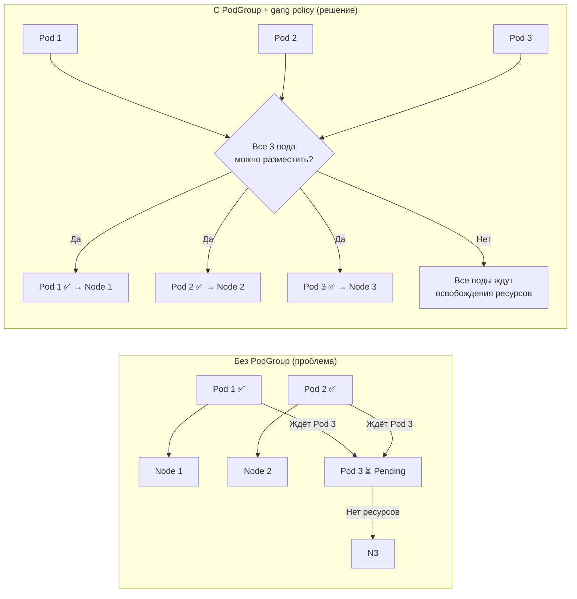

>Группы планирования (Scheduling Groups / PodGroup) — это alpha-фича (K8s 1.35), которая позволяет планировать группу подов как единое целое. Критично для ML-тренировок, распределённых БД и batch-задач.


# Группы планирования (PodGroup / Scheduling Groups) в Kubernetes

> 📌 **PodGroup** = механизм для совместного планирования группы подов. Позволяет применять политики на уровне группы: например, **gang scheduling** («всё или ничего») — либо все поды группы запускаются одновременно, либо ни один. Alpha-фича с K8s 1.35, требует фича-гейта `GenericWorkload`.

---

## 🔹 Зачем нужны группы планирования

### 🎯 Проблема, которую решает PodGroup

| Сценарий | Проблема без PodGroup | Решение с PodGroup |
|----------|----------------------|-------------------|
| **🧠 ML-тренировка** | 8 GPU-воркеров должны стартовать одновременно. Если запустятся 7 — тренировка зависнет, ресурсы будут потрачены впустую | **Gang scheduling**: все 8 подов запускаются одновременно или ни один |
| **🗄️ Распределённая БД (etcd, Cassandra)** | Кворум из 3 нод. Если запустится 1 нода — она будет в бесконечном цикле ожидания кворума | **Gang scheduling**: все 3 ноды стартуют вместе, формируют кластер |
| **📦 Batch-задачи (Spark, MPI)** | Driver и 100 executor'ов. Если запустится только driver — будет ждать executor'ов | **Gang scheduling**: driver + все executor'ы стартуют одновременно |
| **🔗 Связанные микросервисы** | Frontend + backend + cache должны стартовать вместе для smoke-теста | **Gang scheduling** или просто группировка для единой политики |



> 💡 **Ключевая идея**: PodGroup превращает планировщик из «индивидуалиста» (каждый под сам по себе) в «командного игрока» (группа подов планируется как единое целое).

---

## 🔹 Как указать группу планирования

### 📋 Базовый манифест

```yaml
apiVersion: v1
kind: Pod
metadata:
  name: worker-0
  namespace: ml-training
spec:
  schedulingGroup:
    podGroupName: training-workers  # ← ссылка на PodGroup в том же неймспейсе
  containers:
  - name: ml-worker
    image: training:v1
    resources:
      requests:
        nvidia.com/gpu: 1
      limits:
        nvidia.com/gpu: 1
```

### 🔑 Ключевые правила

| Правило | Описание |
|---------|----------|
| **🔗 Ссылка по имени** | `podGroupName` — имя объекта `PodGroup` в **том же неймспейсе** |
| **🔒 Неизменяемость** | После создания пода `schedulingGroup` **нельзя изменить** |
| **⚙️ Фича-гейт** | Требуется включённый `GenericWorkload` (alpha в 1.35) |
| **📦 PodGroup обязателен** | Если `PodGroup` не существует — под остаётся в `Pending` до его создания |

### 🧩 Создание PodGroup

```yaml
apiVersion: scheduling.x-k8s.io/v1alpha1  # ← API-группа может меняться
kind: PodGroup
metadata:
  name: training-workers
  namespace: ml-training
spec:
  policy: gang           # ← "всё или ничего"
  minCount: 8            # ← минимум 8 подов для запуска
  # Другие поля политики зависят от типа
```

> ⚠️ **Важно**: точная структура `PodGroup` зависит от версии K8s и реализации (в upstream K8s это alpha, в Volcano/Scheduler-plugins — другие API).

---

## 🔹 Политики планирования: basic vs gang

### 📊 Сравнение политик

| Характеристика | **`basic`** | **`gang`** |
|---------------|------------|-----------|
| **Поведение** | Каждый под планируется **независимо** | **«Всё или ничего»**: либо все `minCount` подов, либо ни один |
| **Роль PodGroup** | Метка на уровне группы (для статистики, квот) | Активный участник планирования |
| **minCount** | Игнорируется | Обязателен: минимальное количество подов для запуска |
| **Когда использовать** | Когда нужна просто группировка для управления/квот | Когда поды функционально связаны и не могут работать по отдельности |
| **Пример** | Группа микросервисов для единой ResourceQuota | ML-тренировка, распределённая БД, batch-задачи |

### 🎯 Gang Scheduling: как это работает

```
1. Пользователь создаёт PodGroup с policy: gang, minCount: 8
2. Создаёт 8 подов со schedulingGroup.podGroupName: <имя PodGroup>
3. Планировщик видит:
   • Все 8 подов в одной группе
   • Политика: gang
   • minCount: 8
4. Планировщик пытается найти место для ВСЕХ 8 подов одновременно
5. Если находит → все 8 подов привязываются к нодам
6. Если не находит → ВСЕ 8 подов остаются Pending
   (никто не запускается, чтобы не тратить ресурсы впустую)
```

### ⚠️ Риски gang scheduling

| Риск | Последствие | Как избежать |
|------|-------------|-------------|
| **Deadlock** | Если `minCount` больше, чем реально можно разместить → группа никогда не запустится | Ставь `minCount` с запасом, мониторь Pending поды |
| **Голодание (Starvation)** | Большая gang-группа может заблокировать ресурсы для других подов | Используй PriorityClass, ResourceQuota |
| **Долгое ожидание** | Пока не освободятся ресурсы для всех подов — никто не стартует | Увеличь cluster capacity, используй Cluster Autoscaler |

---

## 🔹 Поведение при отсутствии PodGroup

### 🔄 Что происходит, если PodGroup ещё не создан

```yaml
# Под создан, но PodGroup ещё нет
spec:
  schedulingGroup:
    podGroupName: training-workers  # ← этого объекта ещё нет
```

```
Состояние:
• Под остаётся в статусе Pending
• Планировщик НЕ пытается его разместить
• Ждёт появления PodGroup

Когда PodGroup создан:
• Планировщик автоматически пересматривает Pending поды
• Применяет политику из PodGroup
• Если всё ок → поды запускаются
```

```bash
# Проверить, почему под в Pending
kubectl describe pod worker-0 -n ml-training | grep -A10 'Events:'
# Ищи: "waiting for PodGroup training-workers"

# Проверить, существует ли PodGroup
kubectl get podgroup training-workers -n ml-training

# Посмотреть, какие поды ждут PodGroup
kubectl get pods -n ml-training --field-selector=status.phase=Pending
```

> 💡 **Важно**: это работает для **любой** политики (`basic` и `gang`). Планировщик требует наличия `PodGroup` для определения политики.

---

## 🔹 Практика: примеры использования

### 🧪 Пример 1: ML-тренировка с gang scheduling

```yaml
# 1. Создаём PodGroup
apiVersion: scheduling.x-k8s.io/v1alpha1
kind: PodGroup
metadata:
  name: training-job-123
  namespace: ml
spec:
  policy: gang
  minCount: 8  # 8 GPU-воркеров

---
# 2. Создаём 8 подов (обычно через Job/StatefulSet)
apiVersion: batch/v1
kind: Job
metadata:
  name: training-job-123
  namespace: ml
spec:
  completions: 8
  parallelism: 8
  template:
    metadata:
      labels:
        job: training-123
    spec:
      schedulingGroup:
        podGroupName: training-job-123  # ← ссылка на PodGroup
      containers:
      - name: trainer
        image: pytorch:2.0
        resources:
          requests:
            nvidia.com/gpu: 1
          limits:
            nvidia.com/gpu: 1
        command: ["python", "train.py", "--world-size=8"]
      restartPolicy: Never
```

```bash
# Применить
kubectl apply -f training-job.yaml

# Проверить статус
kubectl get pods -n ml -l job=training-123
# Все 8 подов должны быть либо все Running, либо все Pending

# Если все Pending — проверить, есть ли ресурсы
kubectl describe podgroup training-job-123 -n ml
```

### 🧪 Пример 2: Распределённая БД (etcd) с gang scheduling

```yaml
apiVersion: scheduling.x-k8s.io/v1alpha1
kind: PodGroup
metadata:
  name: etcd-cluster
  namespace: database
spec:
  policy: gang
  minCount: 3  # Кворум из 3 нод

---
apiVersion: apps/v1
kind: StatefulSet
metadata:
  name: etcd
  namespace: database
spec:
  serviceName: etcd-headless
  replicas: 3
  selector:
    matchLabels:
      app: etcd
  template:
    metadata:
      labels:
        app: etcd
    spec:
      schedulingGroup:
        podGroupName: etcd-cluster
      containers:
      - name: etcd
        image: quay.io/coreos/etcd:v3.5.0
        command:
        - etcd
        - --initial-cluster-state=new
        - --initial-cluster=etcd-0=http://etcd-0:2380,etcd-1=http://etcd-1:2380,etcd-2=http://etcd-2:2380
```

> 💡 **Зачем здесь gang**: etcd не может сформировать кворум из 1-2 нод. Без gang scheduling поды будут в бесконечном цикле перезапусков, пытаясь подключиться к несуществующим пирам.

### 🧪 Пример 3: Basic policy (просто группировка)

```yaml
apiVersion: scheduling.x-k8s.io/v1alpha1
kind: PodGroup
metadata:
  name: web-app-group
  namespace: production
spec:
  policy: basic  # ← просто группировка, без gang
  # minCount игнорируется

---
# Все поды приложения ссылаются на эту группу
apiVersion: apps/v1
kind: Deployment
metadata:
  name: web-app
  namespace: production
spec:
  replicas: 5
  template:
    spec:
      schedulingGroup:
        podGroupName: web-app-group
      containers:
      - name: app
        image: web-app:1.0
```

> 💡 **Зачем basic**: для применения групповых политик (квоты, приоритеты, статистика) без gang-логики.

---

## 🔹 Отладка и мониторинг

### 🔍 Проверка состояния

```bash
# 1. Посмотреть, к какой группе принадлежит под
kubectl get pod worker-0 -n ml -o jsonpath='{.spec.schedulingGroup}'

# 2. Проверить статус PodGroup
kubectl get podgroup training-job-123 -n ml -o yaml

# 3. Посмотреть, сколько подов в группе готовы к запуску
kubectl get pods -n ml -l job=training-123 --field-selector=status.phase=Pending

# 4. Проверить события планировщика
kubectl get events -n ml --field-selector reason=FailedScheduling | grep training

# 5. Посмотреть логи планировщика (если есть доступ)
kubectl logs -n kube-system -l component=kube-scheduler | grep -i "podgroup\|gang"
```

### 🚨 Частые проблемы

| Проблема | Симптомы | Причина | Решение |
|----------|----------|---------|---------|
| **Поды вечно в Pending** | Все поды группы Pending, события: "waiting for PodGroup" | PodGroup не создан или в другом неймспейсе | Создать PodGroup в том же неймспейсе |
| **Deadlock** | Поды Pending, ресурсов вроде хватает | `minCount` больше, чем реально можно разместить | Уменьшить `minCount`, добавить ноды |
| **Частичный запуск** | Некоторые поды Running, другие Pending | Используется `basic` вместо `gang` | Проверить `policy` в PodGroup |
| **Фича не включена** | API отклоняет `schedulingGroup` | Фича-гейт `GenericWorkload` не включён | Включить фича-гейт на API Server и Scheduler |

### 🛠️ Команды для диагностики

```bash
# Проверить, включена ли фича
kubectl get --raw /apis/scheduling.x-k8s.io/v1alpha1 2>&1 | grep -q "the server could not find" && echo "❌ API не доступен" || echo "✅ API доступен"

# Найти все поды, ждущие PodGroup
kubectl get pods -A -o json | jq -r '
  .items[] | 
  select(.spec.schedulingGroup != null) | 
  select(.status.phase == "Pending") | 
  .metadata.namespace + "/" + .metadata.name + " → " + .spec.schedulingGroup.podGroupName'

# Посмотреть, какие PodGroup существуют
kubectl get podgroup -A

# Проверить, сколько подов в каждой группе
kubectl get podgroup -A -o json | jq -r '
  .items[] | 
  .metadata.namespace + "/" + .metadata.name + ": " + 
  (.spec.minCount | tostring) + " min, policy: " + .spec.policy'
```

---

## 🔹 Сравнение с альтернативами

| Механизм | Назначение | Когда использовать |
|----------|-----------|-------------------|
| **PodGroup (gang)** | Совместное планирование «всё или ничего» | ML-тренировки, распределённые БД, batch-задачи |
| **PodGroup (basic)** | Группировка для управления/квот | Когда нужна просто метка на уровне группы |
| **Pod Affinity/Anti-Affinity** | Размещение подов рядом/далеко друг от друга | Когда важна локальность данных или отказоустойчивость |
| **TopologySpreadConstraints** | Равномерное распределение по зонам/нодам | Высокая доступность, балансировка нагрузки |
| **PriorityClass** | Приоритет при нехватке ресурсов | Когда нужно вытеснять менее важные поды |
| **Volcano / Scheduler-plugins** | Продвинутые политики планирования (gang, fair-share, backlog) | Когда встроенного PodGroup недостаточно |

> 💡 **Совет**: если тебе нужен **только** gang scheduling — попробуй встроенный PodGroup (alpha). Если нужны сложные политики (fair-share, preempt, queue) — смотри в сторону [Volcano](https://volcano.sh/) или [scheduler-plugins](https://github.com/kubernetes-sigs/scheduler-plugins).

---

## 🔹 Чек-лист: работа с PodGroup

### ✅ При проектировании
```bash
# • Определи, действительно ли нужно совместное планирование
#   → Если поды могут работать по отдельности — используй обычные поды

# • Для gang scheduling: правильно рассчитай minCount
#   → minCount = минимальное количество подов для работы приложения
#   → Не ставь minCount больше, чем реально нужно

# • Учитывай ресурсы кластера
#   → Gang-группа может заблокировать ресурсы, если нет свободных нод
#   → Используй Cluster Autoscaler для динамического добавления нод

# • Документируй, какие приложения используют gang scheduling
#   → Это важно для планирования capacity
```

### ✅ При написании манифестов
```bash
# • Создавай PodGroup ДО подов (или одновременно)
#   → Иначе поды будут в Pending до создания PodGroup

# • Указывай schedulingGroup во всех подах группы
#   → Иначе часть подов будет планироваться отдельно

# • Помни: schedulingGroup неизменяем
#   → Если нужно изменить группу — пересоздай поды

# • Для gang: добавь комментарии в манифест
#   # policy: gang — все 8 воркеров должны стартовать одновременно
#   # minCount: 8 — кворум для ML-тренировки
```

### ✅ При отладке
```bash
# 1. Поды в Pending:
kubectl describe pod <name> | grep -A10 'Events:'
kubectl get podgroup <name> -n <namespace>

# 2. Deadlock:
kubectl get pods -n <namespace> --field-selector=status.phase=Pending
kubectl top nodes  # проверить, есть ли свободные ресурсы

# 3. Фича не включена:
kubectl get --raw /apis/scheduling.x-k8s.io/v1alpha1

# 4. Частичный запуск:
kubectl get podgroup <name> -o yaml | grep policy
# Должно быть: policy: gang
```

### ✅ Для мониторинга и алертинга
```bash
# Алерт: gang-группа в Pending > 10 минут
kube_pod_status_phase{phase="Pending"} * on(pod) group_right()
  kube_pod_spec_scheduling_group != "" and
  (time() - kube_pod_created) > 600

# Алерт: PodGroup с minCount > доступных ресурсов
# (через кастомную метрику от планировщика)

# Дашборд: статус PodGroup по неймспейсу
# (сколько групп, какие Pending, какие Running)
```

---

## 🔹 Ключевые выводы

1. **PodGroup = групповое планирование**: позволяет применять политики на уровне группы подов.
2. **Две политики**: `basic` (просто группировка) и `gang` («всё или ничего»).
3. **Gang scheduling**: критичен для ML-тренировок, распределённых БД, batch-задач.
4. **Неизменяемость**: `schedulingGroup` нельзя изменить после создания пода.
5. **Alpha-фича**: требует фича-гейта `GenericWorkload`, API может меняться.
6. **PodGroup обязателен**: без него поды будут в Pending.
7. **Риски**: deadlock, starvation, долгое ожидание — планируй capacity заранее.

> 💡 **Финальный совет**: используй PodGroup (gang scheduling) только там, где это действительно необходимо — для функционально связанных подов, которые не могут работать по отдельности. Для большинства микросервисов достаточно обычных подов с affinity/anti-affinity.
