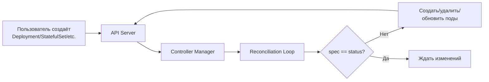

# Управление рабочими нагрузками в Kubernetes — Обзор

> *📌* Kubernetes предоставляет **5 основных типов workload-контроллеров** для управления подами: 
> **Deployment** (stateless приложения), 
> **StatefulSet** (stateful приложения с идентичностью), 
> **DaemonSet** (агенты на каждой ноде), **
> Job** (одноразовые задачи), 
> **CronJob** (задачи по расписанию). 
> Каждый контроллер решает свою задачу — от масштабирования веб-сервисов до запуска batch-обработки.

---

## 1. Зачем нужны workload-контроллеры

### 🎯 Проблема управления подами напрямую

```
Если создавать поды напрямую (kind: Pod):
• Под упал → нужно вручную создать новый
• Нужно масштабировать → нужно вручную создать N подов
• Нужно обновить образ → нужно вручную удалить старые поды и создать новые
• Нода упала → поды не переедут на другую ноду автоматически

Решение: использовать контроллеры рабочих нагрузок
• Контроллер следит за желаемым состоянием (spec)
• Автоматически создаёт/удаляет/обновляет поды
• Обеспечивает самовосстановление, масштабирование, обновления
```

### 🔄 Принцип работы



> 💡 **Ключевая идея**: ты описываешь **желаемое состояние** (сколько реплик, какой образ, какие ресурсы), а контроллер **автоматически приводит фактическое состояние к желаемому**.

---

## 🔹 Сравнение типов workload-контроллеров

| Контроллер | Назначение | Тип приложения | Идентичность подов | Хранилище | Обновления | Масштабирование |
|-----------|-----------|---------------|-------------------|-----------|-----------|----------------|
| **Deployment** | Stateless приложения | Веб-сервисы, микросервисы, API | ❌ Взаимозаменяемы | ❌ Не привязано | ✅ Rolling update, откаты | ✅ Ручное, HPA |
| **StatefulSet** | Stateful приложения | БД, очереди, кластеры | ✅ Уникальные имена, порядок | ✅ Привязано к подам | ✅ Rolling update (упорядоченный) | ✅ Ручное |
| **DaemonSet** | Агенты на нодах | Логи, мониторинг, CNI, CSI | ❌ Один под на ноду | ⚪ Опционально | ✅ Rolling update | ✅ Автоматически при добавлении нод |
| **Job** | Одноразовые задачи | Миграции, batch-обработка, ETL | ❌ Взаимозаменяемы | ⚪ Опционально | ❌ Не применимо | ⚪ Parallelism |
| **CronJob** | Задачи по расписанию | Бэкапы, отчёты, очистка | ❌ Взаимозаменяемы | ⚪ Опционально | ❌ Не применимо | ⚪ Parallelism |

---

## 2. Deployment: stateless приложения

### 🎯 Когда использовать

| Сценарий | Пример |
|----------|--------|
| **Веб-сервисы** | Nginx, Apache, Node.js, Go API |
| **Микросервисы** | Микросервисная архитектура, API gateway |
| **Stateless приложения** | Любое приложение, которое не хранит состояние между запросами |
| **Горизонтальное масштабирование** | Когда нужно быстро масштабировать количество реплик |

### 📋 Ключевые особенности

```
• Поды взаимозаменяемы (нет уникальной идентичности)
• Использует ReplicaSet для управления репликами
• Поддерживает rolling updates и откаты
• Хранилище общее для всех подов (или не используется)
• При сбое пода создаётся новый с новым именем
```

### 💻 Пример (базовый)

```yaml
apiVersion: apps/v1
kind: Deployment
metadata:
  name: nginx-deployment
spec:
  replicas: 3
  selector:
    matchLabels:
      app: nginx
  template:
    metadata:
      labels:
        app: nginx
    spec:
      containers:
      - name: nginx
        image: nginx:1.25
        ports:
        - containerPort: 80
```

> 🔄 **Детальный разбор**: в следующем материале `36_k8s_deployment.md`

---

## 3. StatefulSet: stateful приложения

### 🎯 Когда использовать

| Сценарий | Пример |
|----------|--------|
| **Базы данных** | PostgreSQL, MySQL, MongoDB, Cassandra |
| **Очереди сообщений** | Kafka, RabbitMQ |
| **Распределённые хранилища** | etcd, Zookeeper |
| **Приложения с уникальной идентичностью** | Когда каждый под должен иметь стабильное имя, сетевой ID, хранилище |

### 📋 Ключевые особенности

```
• Поды имеют уникальные имена: <name>-0, <name>-1, <name>-2
• Порядок запуска/остановки: 0 → 1 → 2 (запуск), 2 → 1 → 0 (остановка)
• Каждый под привязан к своему PersistentVolumeClaim
• При пересоздании пода он получает тот же PVC и сетевой ID
• Требует headless Service для стабильных DNS-имён
```

### 💻 Пример (базовый)

```yaml
apiVersion: apps/v1
kind: StatefulSet
metadata:
  name: postgres
spec:
  serviceName: postgres-headless  # ← headless Service
  replicas: 3
  selector:
    matchLabels:
      app: postgres
  template:
    metadata:
      labels:
        app: postgres
    spec:
      containers:
      - name: postgres
        image: postgres:15
        volumeMounts:
        - name: data
          mountPath: /var/lib/postgresql/data
  volumeClaimTemplates:           # ← Шаблон PVC для каждого пода
  - metadata:
      name: data
    spec:
      accessModes: ["ReadWriteOnce"]
      resources:
        requests:
          storage: 10Gi
```

> 🔄 **Детальный разбор**: в следующем материале `37_k8s_statefulset.md`

---

## 4. DaemonSet: агенты на нодах

### 🎯 Когда использовать

| Сценарий | Пример |
|----------|--------|
| **Логи** | Fluentd, Fluent Bit, Filebeat |
| **Мониторинг** | Prometheus Node Exporter, Datadog Agent |
| **Сеть** | CNI-плагины (Calico, Cilium, Flannel) |
| **Хранилище** | CSI-драйверы |
| **Системные агенты** | kube-proxy, security agents |

### 📋 Ключевые особенности

```
• Один под на каждую ноду (или выбранное подмножество нод)
• При добавлении новой ноды автоматически создаётся под
• При удалении ноды под удаляется
• Обычно используется для системных/инфраструктурных задач
• Можно ограничить запуск на определённых нодах через nodeSelector/tolerations
```

### 💻 Пример (базовый)

```yaml
apiVersion: apps/v1
kind: DaemonSet
metadata:
  name: fluent-bit
spec:
  selector:
    matchLabels:
      app: fluent-bit
  template:
    metadata:
      labels:
        app: fluent-bit
    spec:
      containers:
      - name: fluent-bit
        image: fluent/fluent-bit:2.1
        volumeMounts:
        - name: varlog
          mountPath: /var/log
      volumes:
      - name: varlog
        hostPath:
          path: /var/log
```

> 🔄 **Детальный разбор**: в следующем материале `38_k8s_daemonset.md`

---

## 5. Job: одноразовые задачи

### 🎯 Когда использовать

| Сценарий | Пример |
|----------|--------|
| **Миграции БД** | Применение миграций перед обновлением приложения |
| **Batch-обработка** | Обработка больших объёмов данных |
| **ETL-задачи** | Extract, Transform, Load |
| **Инициализация** | Первоначальная настройка, создание данных |
| **Тестовые задачи** | Запуск тестов, бенчмарков |

### 📋 Ключевые особенности

```
• Задача выполняется до успешного завершения (или до исчерпания попыток)
• После завершения поды остаются в статусе Completed/Failed (для просмотра логов)
• Поддерживает параллельное выполнение (parallelism)
• Поддерживает повторные попытки при сбоях (backoffLimit)
• Можно настроить автоматическую очистку завершённых Job (ttlSecondsAfterFinished)
```

### 💻 Пример (базовый)

```yaml
apiVersion: batch/v1
kind: Job
metadata:
  name: db-migration
spec:
  completions: 1              # ← Сколько подов должно успешно завершиться
  parallelism: 1              # ← Сколько подов могут работать параллельно
  backoffLimit: 3             # ← Максимум попыток при сбое
  ttlSecondsAfterFinished: 3600  # ← Удалить Job через 1 час после завершения
  template:
    spec:
      containers:
      - name: migrate
        image: my-app:1.0
        command: ["python", "manage.py", "migrate"]
      restartPolicy: Never    # ← Не перезапускать при сбое (Job сам управляет)
```

> 🔄 **Детальный разбор**: в следующем материале `39_k8s_job.md`

---

## 6. CronJob: задачи по расписанию

### 🎯 Когда использовать

| Сценарий | Пример |
|----------|--------|
| **Бэкапы** | Ежедневный бэкап базы данных |
| **Отчёты** | Еженедельная генерация отчётов |
| **Очистка** | Удаление старых логов, временных файлов |
| **Синхронизация** | Периодическая синхронизация данных |
| **Мониторинг** | Периодические проверки здоровья |

### 📋 Ключевые особенности

```
• Запускает Job по расписанию (cron-синтаксис)
• Поддерживает все параметры Job (parallelism, backoffLimit и т.д.)
• Можно настроить политику при пропуске запуска (concurrencyPolicy)
• Можно ограничить историю успешных/неуспешных запусков
• Расписание в формате cron: "минута час день месяц день_недели"
```

### 💻 Пример (базовый)

```yaml
apiVersion: batch/v1
kind: CronJob
metadata:
  name: daily-backup
spec:
  schedule: "0 2 * * *"       # ← Каждый день в 2:00
  concurrencyPolicy: Forbid   # ← Не запускать новый, если предыдущий ещё работает
  successfulJobsHistoryLimit: 3  # ← Хранить последние 3 успешных запуска
  failedJobsHistoryLimit: 1      # ← Хранить последний неуспешный запуск
  jobTemplate:
    spec:
      template:
        spec:
          containers:
          - name: backup
            image: backup-tool:1.0
            command: ["/backup.sh"]
          restartPolicy: OnFailure
```

> 🔄 **Детальный разбор**: в следующем материале `40_k8s_cronjob.md`

---

## 7. Как выбрать правильный контроллер

### 🎯 Дерево решений

```
Нужно запустить приложение?
│
├─ Это stateless приложение (веб-сервис, API, микросервис)?
│  └─ ✅ Deployment
│
├─ Это stateful приложение (БД, очередь, кластер)?
│  └─ ✅ StatefulSet
│
├─ Нужно запустить агент на каждой ноде (логи, мониторинг, CNI)?
│  └─ ✅ DaemonSet
│
├─ Это одноразовая задача (миграция, batch-обработка)?
│  └─ ✅ Job
│
└─ Это периодическая задача (бэкап, отчёт, очистка)?
   └─ ✅ CronJob
```

### 📊 Сравнительная таблица для выбора

| Вопрос | Ответ | Контроллер |
|--------|-------|-----------|
| Приложение хранит состояние между запросами? | Да | StatefulSet |
| Приложение хранит состояние между запросами? | Нет | Deployment |
| Нужен агент на каждой ноде? | Да | DaemonSet |
| Задача выполняется один раз и завершается? | Да | Job |
| Задача выполняется периодически? | Да | CronJob |
| Нужна уникальная идентичность подов (имя, хранилище)? | Да | StatefulSet |
| Поды взаимозаменяемы? | Да | Deployment / Job / CronJob |
| Нужно масштабировать горизонтально? | Да | Deployment |
| Нужно запускать на всех нодах? | Да | DaemonSet |

---

## 8. Общие принципы для всех контроллеров

### ✅ Best Practices

```bash
# • Всегда используй контроллеры, а не прямое создание подов
#   → Контроллеры обеспечивают самовосстановление, масштабирование, обновления

# • Задавай requests/limits для всех контейнеров
#   → Планировщик сможет корректно размещать поды, kubelet не убьёт их из-за OOM

# • Настраивай probes (liveness, readiness, startup)
#   → Kubernetes будет корректно обрабатывать сбои и готовность

# • Используй метки для группировки
#   → Упрощает фильтрацию, мониторинг, управление

# • Храни манифесты в Git
#   → Контроль версий, ревью, воспроизводимость

# • Применяй через kubectl apply -f (декларативно)
#   → Идемпотентность, отслеживание изменений
```

### ❌ Чего избегать

```bash
# ❌ Не создавай поды напрямую в production
#   → Нет самовосстановления, масштабирования, обновлений

# ❌ Не используй StatefulSet для stateless приложений
#   → StatefulSet сложнее, требует headless Service, PVC

# ❌ Не используй Deployment для БД
#   → Deployment не гарантирует стабильную идентичность и хранилище

# ❌ Не запускай DaemonSet для приложений
#   → DaemonSet для агентов, Deployment для приложений

# ❌ Не игнорируй Job/CronJob для периодических задач
#   → Не запускай долгоживущий под с cron внутри — это антипаттерн
```

---

## 9. Чек-лист: начало работы с workload-контроллерами

### ✅ При выборе контроллера
```bash
# 1. Определи тип приложения:
#    • Stateless → Deployment
#    • Stateful → StatefulSet
#    • Агент на ноде → DaemonSet
#    • Одноразовая задача → Job
#    • Периодическая задача → CronJob

# 2. Проверь требования:
#    • Нужна уникальная идентичность? → StatefulSet
#    • Нужно общее хранилище? → Deployment + PVC
#    • Нужно запускать на всех нодах? → DaemonSet
#    • Нужно масштабировать? → Deployment + HPA

# 3. Выбери стратегию обновлений:
#    • Rolling update (без простоя) → Deployment, StatefulSet
#    • Recreate (с простоем) → Deployment (если допустимо)
#    • Без обновлений → Job, CronJob
```

### ✅ При создании манифеста
```bash
# • Укажи replicas (для Deployment, StatefulSet)
# • Настрой selector.matchLabels (должен совпадать с template.metadata.labels)
# • Задай resources.requests/limits
# • Добавь probes (liveness, readiness)
# • Используй метки для группировки
# • Для StatefulSet: укажи serviceName (headless Service)
# • Для Job/CronJob: укажи restartPolicy: Never или OnFailure
```

### ✅ При отладке
```bash
# 1. Проверить статус контроллера:
kubectl get deployment/statefulset/daemonset/job/cronjob <name>

# 2. Проверить поды, созданные контроллером:
kubectl get pods -l app=<label>

# 3. Проверить события:
kubectl describe <controller-type> <name> | grep -A10 'Events:'

# 4. Проверить логи подов:
kubectl logs -l app=<label> --tail=100

# 5. Проверить rollout status (для Deployment, StatefulSet):
kubectl rollout status deployment/<name>
```

---

## 10. Ключевые выводы

1. **5 типов контроллеров**: Deployment (stateless), StatefulSet (stateful), DaemonSet (агенты), Job (одноразовые задачи), CronJob (периодические задачи).
2. **Каждый контроллер решает свою задачу**: не используй Deployment для БД, StatefulSet для веб-сервисов, DaemonSet для приложений.
3. **Контроллеры = автоматизация**: самовосстановление, масштабирование, обновления — всё автоматически.
4. **Декларативный подход**: описываешь желаемое состояние, контроллер приводит фактическое к желаемому.
5. **Выбор зависит от типа приложения**: stateless/stateful, агент/приложение, одноразовая/периодическая задача.

> 💡 **Финальный совет**: начинай с Deployment для большинства приложений. Добавляй сложность (StatefulSet, DaemonSet) только когда есть реальная потребность. Для задач используй Job/CronJob — не запускай cron внутри долгоживущего пода.
