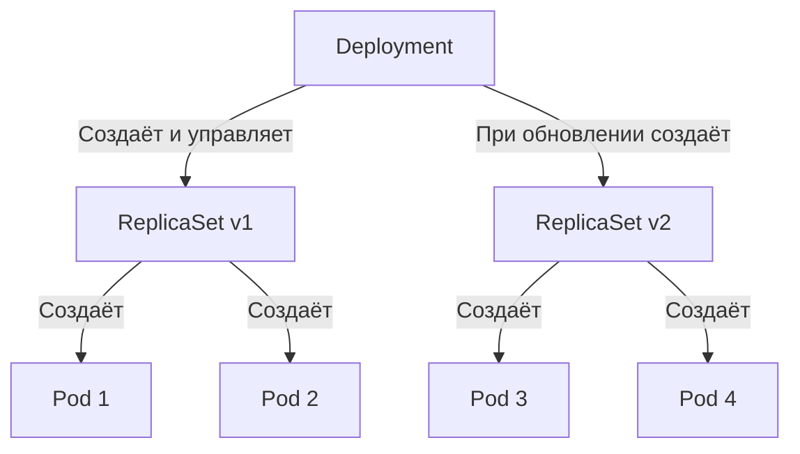

>Deployment — это фундамент работы с stateless-приложениями в Kubernetes. 
# Deployment в Kubernetes — Управление stateless-приложениями

> 📌 **Deployment** — контроллер высшего уровня для управления stateless-приложениями. Он создаёт **[[03.replica_set]]**, который управляет **Pod'ами**. Обеспечивает декларативные обновления (Rolling Update), откаты (Rollback), масштабирование и самовосстановление. **Никогда не управляй ReplicaSet'ами, принадлежащими Deployment, напрямую.**

---

## 🔹 Иерархия управления



> 💡 **Ключевая идея**: Ты общаешься только с **Deployment**. Kubernetes сам создаёт новые ReplicaSet'ы при обновлениях и плавно переводит трафик со старых на новые.

---

## 🔹 Анатомия манифеста Deployment

```yaml
apiVersion: apps/v1
kind: Deployment
metadata:
  name: nginx-deployment
  labels:
    app: nginx
spec:
  replicas: 3                  # Желаемое количество подов
  selector:                    # Как Deployment находит "свои" поды
    matchLabels:
      app: nginx               # ДОЛЖНО совпадать с template.metadata.labels!
  strategy:                    # Стратегия обновлений (по умолчанию RollingUpdate)
    type: RollingUpdate
    rollingUpdate:
      maxSurge: 25%
      maxUnavailable: 25%
  progressDeadlineSeconds: 600 # Таймаут для зависших обновлений
  revisionHistoryLimit: 10     # Сколько старых ReplicaSet хранить для откатов
  template:                    # Шаблон пода (PodTemplate)
    metadata:
      labels:
        app: nginx
    spec:
      containers:
      - name: nginx
        image: nginx:1.25
        ports:
        - containerPort: 80
```

### ⚠️ Критические правила
1. **`selector` и `template.labels` должны совпадать.** Иначе API Server отклонит манифест.
2. **Не пересекай селекторы.** Если два разных Deployment будут выбирать поды по одним и тем же меткам — они будут конфликтовать и "перетягивать" поды друг у друга.
3. **Метка `pod-template-hash`** генерируется автоматически. **Никогда не изменяй и не используй её вручную** — она нужна Kubernetes для различения ReplicaSet'ов.

---

## 🔹 Стратегии обновлений (`.spec.strategy`)

| Стратегия | Как работает | Когда использовать |
|-----------|-------------|-------------------|
| **`RollingUpdate`** *(по умолчанию)* | Новые поды создаются постепенно, старые удаляются постепенно. **Zero downtime**. | 99% случаев (веб-сервисы, API, микросервисы). |
| **`Recreate`** | Сначала удаляются **все** старые поды, затем создаются новые. **Есть downtime**. | Когда приложение не умеет работать в разных версиях одновременно (например, некоторые БД или миграции). |

### ⚙️ Тонкая настройка RollingUpdate

| Параметр | Значение по умолчанию | Описание |
|----------|---------------------|----------|
| **`maxUnavailable`** | `25%` | Макс. количество подов, которые могут быть **недоступны** во время обновления. |
| **`maxSurge`** | `25%` | Макс. количество подов, которые могут быть созданы **сверх** желаемого количества (`replicas`). |

**Пример расчёта (replicas=10, maxSurge=25%, maxUnavailable=25%):**
* Во время обновления в кластере может быть максимум `10 + 3 = 13` подов (округление в большую сторону).
* В любой момент времени должно быть доступно минимум `10 - 2 = 8` подов (округление в меньшую сторону).

---

## 🔹 Обновление и откат (Rollouts & Rollbacks)

### 🚀 Как запустить обновление
Обновление триггерится **только** при изменении `.spec.template` (образ, переменные окружения, метки пода). Изменение `replicas` обновлением не считается!

```bash
# Способ 1: Изменить образ (императивно)
kubectl set image deployment/nginx-deployment nginx=nginx:1.26

# Способ 2: Отредактировать манифест
kubectl edit deployment/nginx-deployment

# Способ 3: Декларативно (рекомендуется)
kubectl apply -f deployment.yaml

# Следить за прогрессом
kubectl rollout status deployment/nginx-deployment
```

### ⏸️ Пауза и возобновление (Pause / Resume)
Полезно, если нужно внести **несколько изменений** (образ + ресурсы + env), но не хочешь запускать промежуточные rolling update.

```bash
# 1. Приостановить
kubectl rollout pause deployment/nginx-deployment

# 2. Внести любые изменения (они НЕ триггернут обновление)
kubectl set image deployment/nginx-deployment nginx=nginx:1.26
kubectl set resources deployment/nginx-deployment --limits=cpu=200m,memory=512Mi

# 3. Возобновить (запустится ОДИН rolling update со всеми изменениями)
kubectl rollout resume deployment/nginx-deployment
```

### ⏪ Откат (Rollback)
Kubernetes хранит историю ReplicaSet'ов (по умолчанию 10 последних).

```bash
# Посмотреть историю
kubectl rollout history deployment/nginx-deployment

# Посмотреть детали конкретной ревизии
kubectl rollout history deployment/nginx-deployment --revision=3

# Откатиться к предыдущей версии
kubectl rollout undo deployment/nginx-deployment

# Откатиться к конкретной версии
kubectl rollout undo deployment/nginx-deployment --to-revision=2
```

> 💡 **Совет**: Чтобы в истории было видно, *почему* было сделано обновление, добавляй аннотацию:
> `kubectl annotate deployment/nginx-deployment kubernetes.io/change-cause="Update nginx to 1.26"`

---

## 🔹 Масштабирование

```bash
# Ручное масштабирование
kubectl scale deployment/nginx-deployment --replicas=10

# Автоматическое масштабирование (HPA)
kubectl autoscale deployment/nginx-deployment --min=5 --max=20 --cpu-percent=80
```

> ⚠️ **Важно**: Если ты используешь **HPA**, **никогда** не указывай `.spec.replicas` в манифесте Deployment. Иначе `kubectl apply` будет перезаписывать количество реплик, выставленное HPA.

### 📊 Proportional Scaling (Пропорциональное масштабирование)
Если ты масштабируешь Deployment **во время** идущего Rolling Update, новые реплики распределяются пропорционально между старым и новым ReplicaSet'ами, чтобы не нарушить баланс `maxSurge`/`maxUnavailable`.

---

## 🔹 Статус и условия (Conditions)

Deployment имеет три основных условия в `.status.conditions`:

| Условие | `status: "True"` означает |
|---------|-------------------------|
| **`Available`** | Минимально необходимое количество подов доступно (минимум 75% при дефолтных настройках). |
| **`Progressing`** | Обновление идёт (создаются/удаляются ReplicaSet'ы) ИЛИ обновление успешно завершено. |
| **`ReplicaFailure`** | Не удалось создать поды (квоты, ошибки образов, нехватка ресурсов). |

### ⏱️ Таймаут зависшего обновления (`progressDeadlineSeconds`)
По умолчанию: **600 секунд (10 минут)**.
Если обновление не может завершиться (например, образ не тянется, поды в CrashLoopBackOff), через 10 минут Deployment получит условие:
`type: Progressing, status: "False", reason: ProgressDeadlineExceeded`.

> ⚠️ **Важно**: Kubernetes **не откатывает** сам себя при `ProgressDeadlineExceeded`. Он только меняет статус. Откатывать нужно вручную (`kubectl rollout undo`) или через внешнюю систему (ArgoCD, Flux).

---

## 🔹 Важные параметры спецификации

| Поле | Описание | Рекомендация |
|------|----------|-------------|
| **`minReadySeconds`** | Сколько секунд под должен быть "Ready" (без падений), чтобы считаться доступным. | Увеличь до 10-30 сек, если приложение долго инициализируется, чтобы избежать преждевременного убийства старых подов. |
| **`revisionHistoryLimit`** | Сколько старых ReplicaSet хранить в etcd для возможности отката. | По умолчанию 10. Ставь `0` только если точно знаешь, что откаты не нужны (экономит etcd). |
| **`terminatingReplicas`** *(beta 1.35)* | Показывает количество подов, которые сейчас в процессе завершения (Terminating). | Полезно для точного учёта ресурсов, так как Terminating поды всё ещё потребляют CPU/RAM. |

---

## 🔹 Чек-лист: работа с Deployment

### ✅ При создании
```
# • Убедись, что selector.matchLabels совпадает с template.metadata.labels
# • Задай resources.requests/limits для всех контейнеров
# • Настрой livenessProbe и readinessProbe
# • Укажи strategy.type (обычно RollingUpdate) и адекватные maxSurge/maxUnavailable
# • Если используешь HPA — убери replicas из манифеста
```

### ✅ При обновлении
```
# • Всегда проверяй, что новый образ существует и доступен (ImagePullBackOff — частая причина зависания)
# • Используй kubectl rollout status для ожидания завершения
# • Для пакетных изменений используй pause -> edit -> resume
```

### ✅ При отладке
```bash
# 1. Обновление зависло:
kubectl rollout status deployment/<name>
kubectl describe deployment <name> | grep -A5 'Conditions:'
kubectl get pods -l app=<label>  # Посмотреть, на каком этапе застряли поды

# 2. Поды в CrashLoopBackOff после обновления:
kubectl logs <new-pod-name> --previous
kubectl rollout undo deployment/<name>  # Быстрый откат

# 3. Посмотреть, какие ReplicaSet сейчас активны:
kubectl get rs -l app=<label>
# Новый будет с ненулевым DESIRED/CURRENT, старые будут с 0 (если обновление завершено)
```

### ❌ Чего избегать
```bash
# ❌ Не редактируй ReplicaSet'ы напрямую (kubectl edit rs <name>)
#   → Deployment перезапишет твои изменения при следующем обновлении

# ❌ Не используй Recreate для критичных production-сервисов
#   → Это гарантирует downtime

# ❌ Не ставь maxUnavailable: 0 и maxSurge: 0 одновременно
#   → API Server отклонит такой манифест (обновление будет невозможно)

# ❌ Не удаляй поды вручную (kubectl delete pod) для "перезапуска"
#   → Используй kubectl rollout restart deployment/<name>
```

---

## 🔹 Ключевые выводы

1. **Deployment = Declarative Manager**: ты говоришь "хочу 3 пода с образом v2", K8s сам делает rolling update.
2. **Связка с ReplicaSet**: Deployment создаёт новый RS при каждом изменении `template`. Старые RS хранятся для откатов.
3. **Rolling Update**: настраивается через `maxSurge` и `maxUnavailable`. Позволяет обновляться без простоя.
4. **Откаты**: встроены "из коробки" через `kubectl rollout undo`. Работают благодаря хранению истории RS.
5. **Пауза**: мощный инструмент для внесения нескольких изменений без запуска промежуточных обновлений.
6. **Статус**: следи за `ProgressDeadlineExceeded` — это сигнал, что обновление застряло и требует вмешательства.
