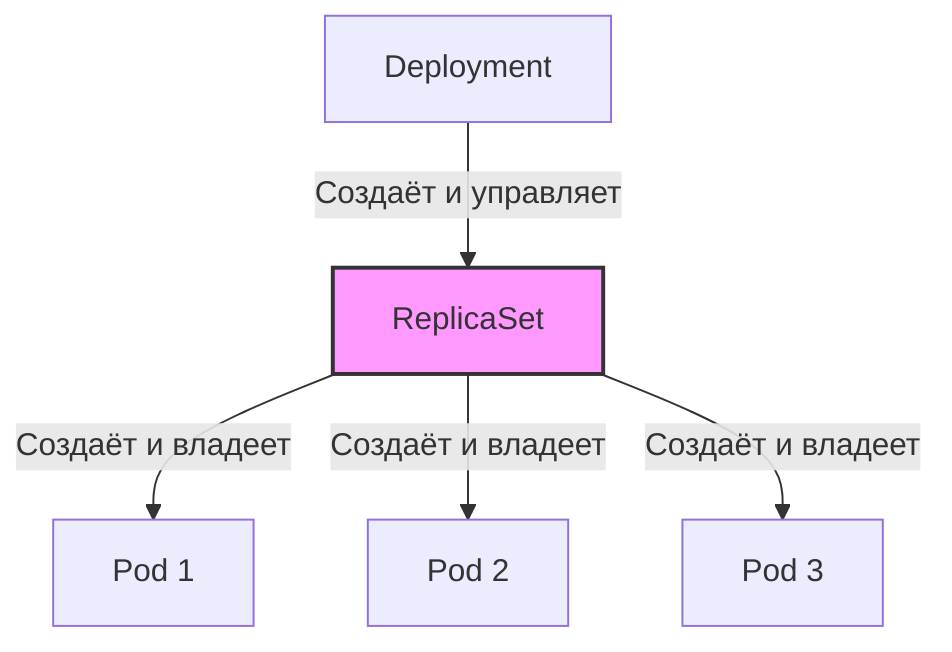

>ReplicaSet — это "рабочая лошадка" под капотом Deployment. Хотя напрямую его используют редко, понимание механики критично для отладки и понимания того, как K8s управляет подами.

# ReplicaSet в Kubernetes — Механизм управления репликами

> 📌 **ReplicaSet** — контроллер, который поддерживает заданное количество идентичных подов. **Почти никогда не используется напрямую** — вместо него используй **Deployment**, который управляет ReplicaSet'ами и добавляет rolling updates. ReplicaSet — это "внутренний" механизм, который создаётся Deployment автоматически.

---

## 1. Место ReplicaSet в иерархии Kubernetes



> 💡 **Ключевая идея**: ReplicaSet — это "мотор" Deployment. Deployment говорит "хочу 3 пода с образом v2", ReplicaSet делает "создаю/удаляю поды, чтобы их было ровно 3".

---

## 2. Как работает ReplicaSet

### 📋 Три ключевых поля

```yaml
apiVersion: apps/v1
kind: ReplicaSet
metadata:
  name: frontend
spec:
  replicas: 3              # Сколько подов должно быть
  selector:                # Как находить "свои" поды
    matchLabels:
      tier: frontend
  template:                # Шаблон для создания новых подов
    metadata:
      labels:
        tier: frontend
    spec:
      containers:
      - name: nginx
        image: nginx:1.25
```

| Поле | Назначение |
|------|-----------|
| **`replicas`** | Желаемое количество подов |
| **`selector`** | Метки для поиска подов, которыми ReplicaSet должен управлять |
| **`template`** | Шаблон пода для создания новых реплик |

### 🔗 Связь с подами через `ownerReferences`

Когда ReplicaSet создаёт под, он добавляет в `metadata.ownerReferences` ссылку на себя:

```yaml
# Pod, созданный ReplicaSet
apiVersion: v1
kind: Pod
metadata:
  name: frontend-abc123
  ownerReferences:
  - apiVersion: apps/v1
    kind: ReplicaSet
    name: frontend
    uid: e129deca-f864-481b-bb16-b27abfd92292
    controller: true
    blockOwnerDeletion: true
```

> 💡 **Зачем это нужно**: 
> - ReplicaSet знает, какие поды "его"
> - При удалении ReplicaSet поды удаляются автоматически (garbage collection)
> - Kubernetes понимает иерархию объектов

---

## 3. Опасность: "захват" подов (Pod Adoption)

### 🚨 Как это работает

ReplicaSet ищет поды по **селектору** (`matchLabels`). Если находит под **без владельца** (`ownerReferences` пуст) и его метки совпадают с селектором — ReplicaSet **немедленно "захватывает"** этот под.

### 📊 Пример опасной ситуации

```yaml
# ReplicaSet с селектором tier: frontend
apiVersion: apps/v1
kind: ReplicaSet
metadata:
  name: frontend
spec:
  replicas: 3
  selector:
    matchLabels:
      tier: frontend
  template:
    metadata:
      labels:
        tier: frontend
    spec:
      containers:
      - name: nginx
        image: nginx:1.25
```

```yaml
# "Голый" под с меткой tier: frontend (БЕЗ владельца)
apiVersion: v1
kind: Pod
metadata:
  name: my-manual-pod
  labels:
    tier: frontend        # ← Совпадает с селектором ReplicaSet!
spec:
  containers:
  - name: custom-app
    image: my-custom-app:1.0
```

**Что произойдёт:**
1. Ты создаёшь "голый" под `my-manual-pod`
2. ReplicaSet `frontend` видит его (метки совпадают, владельца нет)
3. ReplicaSet "захватывает" под
4. Если у ReplicaSet уже есть 3 пода → `my-manual-pod` будет **немедленно удалён**
5. Если у ReplicaSet не хватает подов → `my-manual-pod` станет одним из его подов (но с другим образом!)

### ✅ Как избежать

```bash
# • Никогда не создавай "голые" поды с метками, которые используются селекторами
# • Всегда используй уникальные метки для каждого ReplicaSet/Deployment
# • Если нужен "голый" под для отладки — добавь уникальную метку:
#   labels:
#     tier: frontend
#     debug: "true"  # ← ReplicaSet не захватит, если в селекторе нет debug=true
```

> ⚠️ **Важно**: это одна из самых частых ошибок новичков. "Почему мой под удалился сам по себе?" — ответ: его захватил ReplicaSet.

---

## 4. Когда использовать ReplicaSet напрямую?

### ✅ Редкие случаи

| Сценарий | Почему ReplicaSet, а не Deployment |
|----------|-----------------------------------|
| **Кастомная логика обновлений** | Нужен контроль, который не даёт Deployment (например, A/B тестирование с ручным переключением) |
| **Без обновлений** | Приложение никогда не обновляется, нужна просто гарантия количества реплик |
| **Обучение/отладка** | Понимание того, как работает "внутренняя кухня" K8s |

### ❌ Когда НЕ использовать

| Сценарий | Что использовать вместо |
|----------|------------------------|
| **Обычное stateless-приложение** | ✅ **Deployment** (даёт rolling updates, откаты) |
| **Stateful-приложение (БД)** | ✅ **StatefulSet** (стабильные имена, хранилище) |
| **Агент на каждой ноде** | ✅ **DaemonSet** (один под на ноду) |
| **Одноразовая задача** | ✅ **Job** (выполнить и завершиться) |

> 💡 **Правило**: если ты не уверен — используй **Deployment**. Он создаст ReplicaSet за тебя и добавит все нужные фичи.

---

## 5. Pod Deletion Cost — тонкая настройка scale down

### 🎯 Что это

Аннотация `controller.kubernetes.io/pod-deletion-cost`, которая указывает ReplicaSet, **какие поды удалять первыми** при уменьшении масштаба.

### 📊 Как работает

```yaml
apiVersion: v1
kind: Pod
metadata:
  name: frontend-abc123
  annotations:
    controller.kubernetes.io/pod-deletion-cost: "100"  # ← Высокая стоимость удаления
spec:
  # ...
```

| Значение аннотации | Приоритет удаления |
|-------------------|-------------------|
| **Отрицательное** (например, `-100`) | Удаляется **первым** |
| **0** (по умолчанию) | Средний приоритет |
| **Положительное** (например, `100`) | Удаляется **последним** |

### 🔄 Алгоритм выбора подов для удаления (scale down)

При уменьшении `replicas` ReplicaSet удаляет поды в следующем порядке:

1. **Pending поды** (которые не могут быть запланированы)
2. **Поды с меньшей `pod-deletion-cost`** (если аннотация задана)
3. **Поды на нодах с большим количеством реплик** (для балансировки)
4. **Более новые поды** (созданные позже)
5. **Случайный выбор** (если всё остальное равно)

### 💡 Практический пример

```bash
# Сценарий: у тебя 10 подов, нужно уменьшить до 5
# Ты хочешь сохранить поды, которые обработали больше запросов

# 1. Приложение обновляет аннотацию перед scale down
kubectl annotate pod frontend-abc123 controller.kubernetes.io/pod-deletion-cost=100
kubectl annotate pod frontend-def456 controller.kubernetes.io/pod-deletion-cost=-100

# 2. Уменьшаешь масштаб
kubectl scale rs frontend --replicas=5

# Результат:
# • Поды с cost=-100 будут удалены первыми
# • Поды с cost=100 будут сохранены
```

> ⚠️ **Важно**: 
> - Не обновляй аннотацию слишком часто (каждую секунду) — это создаёт нагрузку на API Server
> - Аннотация — это **подсказка**, а не гарантия. K8s старается учесть её, но может игнорировать при конфликтах

---

## 6. Практика: работа с ReplicaSet

### 🔍 Просмотр ReplicaSet'ов

```bash
# Список всех ReplicaSet'ов
kubectl get rs

# Детальная информация
kubectl describe rs frontend

# Посмотреть, какие поды принадлежат ReplicaSet
kubectl get pods -l tier=frontend

# Посмотреть ownerReferences пода
kubectl get pod frontend-abc123 -o jsonpath='{.metadata.ownerReferences}'
```

### 📊 Мониторинг "захвата" подов

```bash
# Найти "голые" поды (без владельца), которые могут быть захвачены
kubectl get pods -o json | jq -r '
  .items[] | 
  select(.metadata.ownerReferences == null) | 
  .metadata.name + " (" + (.metadata.labels | to_entries | map(.key + "=" + .value) | join(",")) + ")"'

# Найти поды, которые были захвачены ReplicaSet (подозрительные случаи)
kubectl get pods -o json | jq -r '
  .items[] | 
  select(.metadata.ownerReferences[]?.kind == "ReplicaSet") | 
  select(.metadata.labels | keys | length == 1) |  # Только одна метка — подозрительно
  .metadata.name'
```

### 🛠️ Масштабирование

```bash
# Ручное масштабирование
kubectl scale rs frontend --replicas=5

# Автоматическое масштабирование (HPA)
kubectl autoscale rs frontend --min=3 --max=10 --cpu-percent=50
```

### 🗑️ Удаление

```bash
# Удалить ReplicaSet И все его поды (по умолчанию)
kubectl delete rs frontend

# Удалить ReplicaSet, но ОСТАВИТЬ поды (orphan)
kubectl delete rs frontend --cascade=orphan
# ⚠️ Поды станут "голыми" и могут быть захвачены другим ReplicaSet!

# Удалить только поды, но ОСТАВИТЬ ReplicaSet (он создаст новые)
kubectl delete pods -l tier=frontend
# ReplicaSet сразу создаст новые поды взамен удалённых
```

---

## 7. Отладка проблем с ReplicaSet

### 🚨 Частые проблемы

| Проблема | Симптомы | Причина | Решение |
|----------|----------|---------|---------|
| **Поды "исчезают"** | Ты создал под, но он удалился | ReplicaSet "захватил" его и удалил (лишние реплики) | Проверь метки пода, добавь уникальную метку |
| **ReplicaSet не создаёт поды** | `DESIRED=3, CURRENT=0` | Ошибка в шаблоне (образ не существует, квоты) | `kubectl describe rs <name>` → смотри Events |
| **Поды в Pending** | `CURRENT=3, READY=0` | Не хватает ресурсов, нет нод с нужными метками | `kubectl describe pod <name>` → смотри Events |
| **Два ReplicaSet конфликтуют** | Поды "перескакивают" между RS | Пересекающиеся селекторы | Исправь селекторы, чтобы они не пересекались |

### 🛠️ Команды для диагностики

```bash
# 1. Посмотреть события ReplicaSet
kubectl describe rs <name> | grep -A10 'Events:'

# 2. Проверить, какие поды принадлежат ReplicaSet
kubectl get pods -l <selector> --show-labels

# 3. Посмотреть ownerReferences подов
kubectl get pods -l <selector> -o jsonpath='{range .items[*]}{.metadata.name}{"\t"}{.metadata.ownerReferences[*].name}{"\n"}{end}'

# 4. Найти "голые" поды (без владельца)
kubectl get pods -o json | jq '.items[] | select(.metadata.ownerReferences == null) | .metadata.name'

# 5. Проверить, не пересекаются ли селекторы
kubectl get rs -o json | jq -r '.items[] | .metadata.name + ": " + (.spec.selector.matchLabels | to_entries | map(.key + "=" + .value) | join(","))'
```

---

## 8. Чек-лист: работа с ReplicaSet

### ✅ При использовании (редко!)
```bash
# • Убедись, что селектор УНИКАЛЕН и не пересекается с другими контроллерами
# • Никогда не создавай "голые" поды с метками, которые используются в селекторах
# • Используй ReplicaSet только если Deployment не подходит (очень редко)
# • Помни: у ReplicaSet НЕТ rolling updates — только create/delete
```

### ✅ При отладке
```bash
# 1. Поды "исчезают":
kubectl get pods -o json | jq '.items[] | select(.metadata.ownerReferences[]?.kind == "ReplicaSet") | .metadata.name'
# → Найди, какой ReplicaSet захватил поды

# 2. ReplicaSet не создаёт поды:
kubectl describe rs <name> | grep -A5 'Events:'
# → Ищи ошибки: ImagePullBackOff, FailedCreate, QuotaExceeded

# 3. Два ReplicaSet конфликтуют:
kubectl get rs -o json | jq '.items[] | {name: .metadata.name, selector: .spec.selector.matchLabels}'
# → Проверь, не пересекаются ли селекторы
```

### ✅ Для pod-deletion-cost
```bash
# • Используй для тонкой настройки scale down
# • Не обновляй аннотацию слишком часто
# • Значения: отрицательные = удалить первыми, положительные = сохранить

# Пример: пометить поды для сохранения
kubectl annotate pod frontend-abc123 controller.kubernetes.io/pod-deletion-cost=100

# Пример: пометить поды для удаления
kubectl annotate pod frontend-def456 controller.kubernetes.io/pod-deletion-cost=-100
```

### ❌ Чего избегать
```bash
# ❌ Не используй ReplicaSet напрямую для обычных приложений
#   → Используй Deployment (даёт rolling updates, откаты)

# ❌ Не создавай "голые" поды с метками, которые используются в селекторах
#   → Они будут захвачены ReplicaSet и могут быть удалены

# ❌ Не используй пересекающиеся селекторы для разных ReplicaSet
#   → Они будут конфликтовать и "перетягивать" поды

# ❌ Не удаляй ReplicaSet с --cascade=orphan без понимания последствий
#   → Поды станут "голыми" и могут быть захвачены другим контроллером

# ❌ Не обновляй pod-deletion-cost каждую секунду
#   → Это создаёт нагрузку на API Server
```

---

## 9. Ключевые выводы

1. **ReplicaSet = "мотор" Deployment**: поддерживает заданное количество подов, но не умеет делать rolling updates.
2. **Почти никогда не используется напрямую**: вместо него используй Deployment.
3. **Связь через `ownerReferences`**: ReplicaSet знает, какие поды "его", и удаляет их при своём удалении.
4. **Опасность "захвата"**: ReplicaSet может захватить "голые" поды с подходящими метками — будь осторожен.
5. **Pod Deletion Cost**: аннотация для тонкой настройки порядка удаления подов при scale down.
6. **Альтернативы**: Deployment (для stateless), StatefulSet (для stateful), DaemonSet (для агентов), Job (для задач).

> 💡 **Финальный совет**: ReplicaSet — это важный "внутренний" механизм, но для 99% задач используй **Deployment**. Понимание ReplicaSet нужно для отладки и понимания того, как K8s работает "под капотом".
