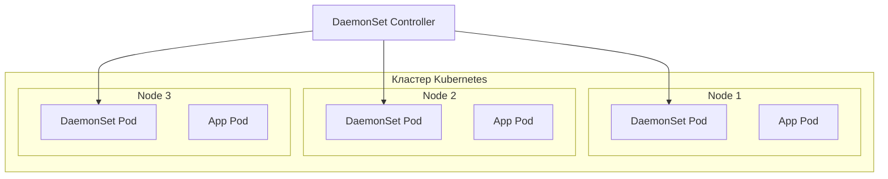

>DaemonSet — важный контроллер для инфраструктурных задач.

# DaemonSet — Запуск подов на каждом узле

> 📌 `DaemonSet` гарантирует, что **копия пода работает на каждом (или выбранных) узлах кластера**. Используется для инфраструктурных задач: логи, мониторинг, сеть, хранилище. При добавлении узла — под создаётся автоматически, при удалении — удаляется.

---

## 🔹 Что такое DaemonSet

| Аспект | Описание |
|--------|----------|
| **Назначение** | Запуск одной копии пода на каждом узле (или на подмножестве узлов) |
| **Типичные задачи** | Сбор логов, мониторинг, сетевые плагины, хранилища, агенты безопасности |
| **Жизненный цикл** | Автоматический: добавился узел → создался под, удалился узел → удалился под |
| **Отличие от Deployment** | Deployment масштабирует по количеству реплик, DaemonSet — по количеству узлов |



---

## 🔹 Типичные сценарии использования

### ✅ Когда использовать DaemonSet:

| Сценарий | Пример | Почему DaemonSet |
|----------|--------|------------------|
| **📊 Сбор логов** | `fluentd`, `fluent-bit`, `filebeat` | Логи собираются с каждого узла, нужны на всех нодах |
| **📈 Мониторинг** | `prometheus-node-exporter`, `datadog-agent` | Метрики узлов собираются локально на каждой ноде |
| **🌐 Сетевые плагины** | `calico`, `cilium`, `weave-net` | Сеть должна работать на каждом узле для коммуникации подов |
| **💾 Хранилища** | `ceph`, `rook`, `longhorn` | Агенты хранилища должны быть на всех нодах |
| **🔐 Безопасность** | `falco`, `aqua-security` | Агенты безопасности работают на уровне узла |

### ❌ Когда НЕ использовать DaemonSet:

| Сценарий | Что использовать вместо | Почему |
|----------|------------------------|--------|
| Веб-приложения, API | `Deployment` + `Service` | Нужно масштабирование по нагрузке, а не по узлам |
| Базы данных | `StatefulSet` | Нужна стабильная идентификация, персистентное хранилище |
| Фоновые задачи | `Job` / `CronJob` | Задачи выполняются один раз или по расписанию |

---

## 🔹 Структура манифеста DaemonSet

### 📋 Минимальный пример с разбором полей

```yaml
apiVersion: apps/v1              # 1. Версия API
kind: DaemonSet                  # 2. Тип объекта
metadata:                        # 3. Метаданные
  name: fluentd-elasticsearch
  namespace: kube-system         # ← часто в kube-system для инфраструктурных задач
  labels:
    k8s-app: fluentd-logging
spec:
  selector:                      # 4. Селектор подов (неизменяемый после создания!)
    matchLabels:
      name: fluentd-elasticsearch
  template:                      # 5. Шаблон пода (как у Deployment)
    metadata:
      labels:
        name: fluentd-elasticsearch  # ← должно совпадать с selector
    spec:
      tolerations:               # 6. Допуски для запуска на master-нодах
      - key: node-role.kubernetes.io/control-plane
        operator: Exists
        effect: NoSchedule
      - key: node-role.kubernetes.io/master
        operator: Exists
        effect: NoSchedule
      containers:
      - name: fluentd-elasticsearch
        image: quay.io/fluentd_elasticsearch/fluentd:v5.0.1
        resources:
          limits:
            memory: 200Mi
          requests:
            cpu: 100m
            memory: 200Mi
        volumeMounts:            # 7. Монтирование логов с хоста
        - name: varlog
          mountPath: /var/log
      terminationGracePeriodSeconds: 30
      volumes:
      - name: varlog
        hostPath:                # ← доступ к файловой системе узла
          path: /var/log
```

### 🔑 Обязательные поля

| Поле | Назначение | Особенности |
|------|------------|-------------|
| **`apiVersion`** | Версия API | Обычно `apps/v1` |
| **`kind`** | Тип объекта | `DaemonSet` |
| **`metadata`** | Имя, неймспейс, лейблы | Имя должно быть валидным DNS-поддоменом |
| **`spec.selector`** | Селектор подов | **Неизменяемый** после создания! Должен совпадать с `template.metadata.labels` |
| **`spec.template`** | Шаблон пода | Как у `Deployment`, но без `apiVersion`/`kind` |
| **`spec.template.spec.restartPolicy`** | Политика перезапуска | По умолчанию `Always` (другие значения не поддерживаются) |

---

## 🔹 Планирование подов: nodeSelector и affinity

### 🎯 Запуск на подмножестве узлов

```yaml
spec:
  template:
    spec:
      # Вариант 1: nodeSelector (простой, по лейблам)
      nodeSelector:
        disktype: ssd
        environment: production
      
      # Вариант 2: nodeAffinity (гибкий, с операторами)
      affinity:
        nodeAffinity:
          requiredDuringSchedulingIgnoredDuringExecution:
            nodeSelectorTerms:
            - matchExpressions:
              - key: disktype
                operator: In
                values: [ssd, nvme]
              - key: environment
                operator: NotIn
                values: [test]
```

| Механизм | Когда использовать | Пример |
|----------|-------------------|--------|
| **`nodeSelector`** | Простая фильтрация по лейблам | «Запускать только на SSD-нодах» |
| **`nodeAffinity`** | Сложные условия (In, NotIn, Exists, Gt, Lt) | «Запускать на нодах с CPU > 8 И memory > 32Gi» |
| **Не указывать** | Запуск на всех узлах | Стандартный сценарий для DaemonSet |

> 💡 **Важно**: если не указан ни `nodeSelector`, ни `affinity` — DaemonSet создаст поды на **всех** узлах кластера.

---

## 🔹 Tolerations: автоматические допуски DaemonSet

### 🛡️ Ключевая особенность

DaemonSet **автоматически добавляет tolerations** для запуска на проблемных узлах. Это критично для инфраструктурных компонентов (например, сетевой плагин должен работать даже если узел не готов).

### 📋 Автоматические tolerations

| Toleration | Эффект | Когда применяется | Зачем нужно |
|------------|--------|-------------------|-------------|
| **`node.kubernetes.io/not-ready`** | `NoExecute` | Всегда | Поды DaemonSet не вытесняются с неисправных узлов |
| **`node.kubernetes.io/unreachable`** | `NoExecute` | Всегда | Поды DaemonSet не вытесняются с недоступных узлов |
| **`node.kubernetes.io/disk-pressure`** | `NoSchedule` | Всегда | Запуск на нодах с нехваткой диска |
| **`node.kubernetes.io/memory-pressure`** | `NoSchedule` | Всегда | Запуск на нодах с нехваткой памяти |
| **`node.kubernetes.io/pid-pressure`** | `NoSchedule` | Всегда | Запуск на нодах с нехваткой PID |
| **`node.kubernetes.io/unschedulable`** | `NoSchedule` | Всегда | Запуск на нодах с `kubectl cordon` |
| **`node.kubernetes.io/network-unavailable`** | `NoSchedule` | Только если `hostNetwork: true` | Для сетевых плагинов на нодах без сети |

### 🎯 Практический пример: сетевой плагин

```yaml
# Проблема: узел не готов → сетевой плагин не запущен → узел не может стать готовым
# Решение: DaemonSet с автоматическими tolerations запускается на неготовых узлах

apiVersion: apps/v1
kind: DaemonSet
metadata:
  name: calico-node
spec:
  template:
    spec:
      hostNetwork: true  # ← доступ к сети хоста
      tolerations:
      # Автоматические tolerations уже добавлены контроллером
      # Можно добавить свои:
      - key: CriticalAddonsOnly
        operator: Exists
      containers:
      - name: calico-node
        image: calico/node:v3.26.1
```

> 💡 **Совет**: если DaemonSet предоставляет критичную функциональность (сеть, хранилище), установи высокий `priorityClassName`, чтобы поды могли вытеснять обычные приложения при нехватке ресурсов.

---

## 🔹 Взаимодействие с подами DaemonSet

### 🔌 4 способа доступа к подам DaemonSet

| Способ | Как работает | Когда использовать | Пример |
|--------|-------------|-------------------|--------|
| **📤 Push** | Поды отправляют данные в центральный сервис | Логи, метрики | `fluentd` → `elasticsearch` |
| **🌐 NodeIP + Port** | Поды используют `hostPort`, доступны по IP узла | Простые сценарии, клиенты знают IP узлов | `node-exporter:9100` |
| **🔍 DNS** | Создаётся headless `Service`, клиенты получают список IP через DNS | Когда нужно знать все эндпоинты | `my-daemonset.default.svc.cluster.local` |
| **⚖️ Service** | Создаётся обычный `Service`, трафик балансируется | Когда не важно, на какой узел попасть | `my-daemonset` → случайный под |

### 📝 Пример: Service для DaemonSet

```yaml
# DaemonSet
apiVersion: apps/v1
kind: DaemonSet
metadata:
  name: my-monitoring-agent
spec:
  selector:
    matchLabels:
      app: monitoring-agent
  template:
    metadata:
      labels:
        app: monitoring-agent
    spec:
      containers:
      - name: agent
        image: my-monitoring:latest
        ports:
        - containerPort: 8080
---
# Service для доступа
apiVersion: v1
kind: Service
metadata:
  name: my-monitoring-agent
spec:
  selector:
    app: monitoring-agent  # ← тот же селектор, что у DaemonSet
  ports:
  - port: 8080
    targetPort: 8080
  # internalTrafficPolicy: Local  # ← опционально: трафик только на поды того же узла
```

---

## 🔹 Обновление и удаление DaemonSet

### 🔄 Обновление

```bash
# Стратегии обновления (spec.updateStrategy):
# 1. RollingUpdate (по умолчанию) — постепенное обновление подов
# 2. OnDelete — обновление только при ручном удалении подов

# Проверить статус обновления
kubectl rollout status daemonset/my-daemonset

# История обновлений
kubectl rollout history daemonset/my-daemonset

# Откатить к предыдущей версии
kubectl rollout undo daemonset/my-daemonset

# Откатить к конкретной ревизии
kubectl rollout undo daemonset/my-daemonset --to-revision=2
```

### 🗑️ Удаление

```bash
# Удалить DaemonSet И все его поды (по умолчанию)
kubectl delete daemonset my-daemonset

# Удалить DaemonSet, но ОСТАВИТЬ поды (orphan)
kubectl delete daemonset my-daemonset --cascade=orphan

# Если потом создать новый DaemonSet с тем же селектором — 
# он подхватит существующие поды
```

> ⚠️ **Важно**: при удалении DaemonSet все его поды удаляются. Если нужно сохранить поды — используй `--cascade=orphan`.

---

## 🔹 Сравнение с альтернативами

| Подход | Плюсы | Минусы | Когда использовать |
|--------|-------|--------|-------------------|
| **DaemonSet** ✅ | Управление через API, автоматическое восстановление, единый инструмент с приложениями | Требует API Server | **Стандарт для инфраструктурных задач** |
| **Init-скрипты** (systemd, upstart) | Простота, не зависит от K8s | Нет централизованного управления, сложно масштабировать | Legacy-системы, bootstrap кластера |
| **Bare Pods** (с указанием nodeName) | Прямой контроль | Нет автоматического восстановления при сбое узла | **Не рекомендуется** |
| **Static Pods** | Работают без API Server (bootstrap) | Не управляются через `kubectl`, устаревший подход | Bootstrap Control Plane |
| **Deployment** | Масштабирование по нагрузке, rolling updates | Не гарантирует запуск на каждом узле | Приложения, веб-сервисы, API |

> 💡 **Правило**: если под должен работать на каждом узле и предоставлять инфраструктурную функциональность — используй **DaemonSet**. Если нужно масштабирование по нагрузке — **Deployment**.

---

## 🔹 Практика: работа с DaemonSet

### 🚀 Создание и проверка

```bash
# Создать DaemonSet из файла
kubectl apply -f daemonset.yaml

# Проверить статус
kubectl get daemonset -n kube-system
# NAME                    DESIRED   CURRENT   READY   UP-TO-DATE   AVAILABLE   NODE SELECTOR
# fluentd-elasticsearch   3         3         3       3            3           <none>

# Посмотреть поды DaemonSet
kubectl get pods -n kube-system -l name=fluentd-elasticsearch -o wide
# NAME                          READY   STATUS    RESTARTS   AGE   IP           NODE
# fluentd-elasticsearch-abc12   1/1     Running   0          10m   10.244.1.5   node-1
# fluentd-elasticsearch-def34   1/1     Running   0          10m   10.244.2.7   node-2
# fluentd-elasticsearch-ghi56   1/1     Running   0          10m   10.244.3.9   node-3

# Детальная информация
kubectl describe daemonset fluentd-elasticsearch -n kube-system
```

### 🔍 Отладка

```bash
# Посмотреть логи пода DaemonSet на конкретном узле
kubectl logs -n kube-system -l name=fluentd-elasticsearch --field-selector spec.nodeName=node-1

# Проверить, на каких узлах запущены поды
kubectl get pods -n kube-system -l name=fluentd-elasticsearch -o jsonpath='{.items[*].spec.nodeName}'

# Найти узлы, где под НЕ запущен (если должен быть)
kubectl get nodes -o name | while read node; do
  kubectl get pods -n kube-system -l name=fluentd-elasticsearch --field-selector spec.nodeName=${node#node/} -o name | grep -q . || echo "❌ Нет пода на $node"
done

# Проверить tolerations и affinity
kubectl get daemonset fluentd-elasticsearch -n kube-system -o yaml | grep -A10 'tolerations:\|affinity:'
```

### 🧪 Тестирование на подмножестве узлов

```bash
# 1. Добавить лейбл к узлам
kubectl label nodes node-1 node-2 daemonset-test=true

# 2. Создать DaemonSet с nodeSelector
kubectl apply -f - <<EOF
apiVersion: apps/v1
kind: DaemonSet
metadata:
  name: test-daemonset
spec:
  selector:
    matchLabels:
      app: test
  template:
    metadata:
      labels:
        app: test
    spec:
      nodeSelector:
        daemonset-test: "true"
      containers:
      - name: test
        image: nginx:1.25
EOF

# 3. Проверить, что поды только на node-1 и node-2
kubectl get pods -l app=test -o wide

# 4. Очистить тест
kubectl delete daemonset test-daemonset
kubectl label nodes node-1 node-2 daemonset-test-
```

---

## 🔹 Чек-лист: создание DaemonSet

```bash
# ✅ 1. Определить, нужен ли DaemonSet (инфраструктурная задача на каждом узле?)
# ✅ 2. Выбрать namespace (обычно kube-system для системных компонентов)
# ✅ 3. Указать селектор и лейблы (должны совпадать!)
# ✅ 4. Настроить tolerations (автоматические + свои, если нужно)
# ✅ 5. Указать resources (requests/limits) — важно для планирования
# ✅ 6. Если нужен доступ к хосту: hostNetwork, hostPID, hostPath volumes
# ✅ 7. Для критичных компонентов: priorityClassName: system-node-critical
# ✅ 8. Проверить dry-run перед применением
kubectl apply -f daemonset.yaml --dry-run=server -o yaml

# ✅ 9. Применить и проверить статус
kubectl apply -f daemonset.yaml
kubectl get daemonset <name> -n <namespace>
kubectl get pods -l <selector> -o wide

# ✅ 10. Настроить мониторинг и алертинг для подов DaemonSet
```

> 💡 **Совет для конспекта**:
> 1. Создай файл `00_daemonset_templates.md` с готовыми манифестами для частых задач (логи, мониторинг, сеть).
> 2. Добавь блок «Частые ошибки»: например, «забыл tolerations для master-нод», «селектор не совпадает с лейблами».
> 3. Веди список «Какие DaemonSet у нас в кластере»: имя, назначение, namespace, образ.

---

## 🔹 Ключевые выводы

1. **DaemonSet = один под на узел** (или на подмножестве узлов). Используется для инфраструктурных задач.
2. **Автоматические tolerations** — ключевая фича: поды DaemonSet запускаются даже на проблемных узлах.
3. **Селектор неизменяем**: после создания DaemonSet нельзя изменить `.spec.selector`.
4. **4 способа взаимодействия**: push, hostPort, DNS, Service — выбирай в зависимости от сценария.
5. **Не путай с Deployment**: DaemonSet для инфраструктуры на каждом узле, Deployment для приложений с масштабированием.