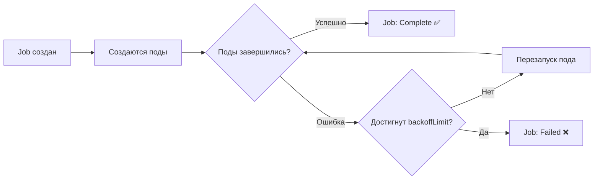

# Job — Разовые задачи в Kubernetes

> 📌 `Job` создаёт один или несколько подов и гарантирует, что указанное количество из них **успешно завершится**. Используется для пакетных задач: миграции БД, расчёты, ETL, бэкапы. В отличие от `Deployment`, поды Job **завершаются**, а не работают постоянно.

---

## 🔹 Что такое Job

| Аспект | Описание |
|--------|----------|
| **Назначение** | Выполнение разовых задач до успешного завершения |
| **Типичные задачи** | Миграции БД, расчёты, ETL, бэкапы, генерация отчётов, обучение моделей |
| **Жизненный цикл** | Создал поды → поды отработали → Job считается завершённым |
| **Отличие от Deployment** | Deployment — для постоянно работающих сервисов, Job — для задач с концом |
| **Отличие от CronJob** | Job — разовая задача, CronJob — по расписанию |



---

## 🔹 Минимальный пример

```yaml
apiVersion: batch/v1
kind: Job
metadata:
  name: pi
spec:
  backoffLimit: 4              # ← макс. количество повторных попыток
  template:
    spec:
      containers:
      - name: pi
        image: perl:5.34.0
        command: ["perl", "-Mbignum=bpi", "-wle", "print bpi(2000)"]
      restartPolicy: Never     # ← обязательно: Never или OnFailure
```

```bash
# Создать
kubectl apply -f job.yaml

# Проверить статус
kubectl get jobs
# NAME   COMPLETIONS   DURATION   AGE
# pi     1/1           10s        15s

# Посмотреть логи
kubectl logs job/pi

# Удалить (вместе с подами)
kubectl delete job pi
```

---

## 🔹 Обязательные поля и ограничения

| Поле | Требование | Пояснение |
|------|------------|-----------|
| **`apiVersion`** | `batch/v1` | Стандартная версия |
| **`kind`** | `Job` | Тип объекта |
| **`metadata.name`** | DNS-поддомен, ≤63 символа | Рекомендуется RFC 1123 Label (строже, чем поддомен) |
| **`spec.template`** | Шаблон пода | Как у Deployment, но без `apiVersion`/`kind` |
| **`spec.template.spec.restartPolicy`** | `Never` или `OnFailure` | **Нельзя** `Always` (иначе под никогда не завершится) |

> ⚠️ **Важно**: имя Job используется как префикс для имён подов. Если имя слишком длинное или содержит недопустимые символы — поды не создадутся.

---

## 🔹 Типы задач: 3 основных паттерна

### 1️⃣ Непараллельная задача (по умолчанию)

```yaml
spec:
  completions: 1      # ← по умолчанию
  parallelism: 1      # ← по умолчанию
```

- Запускается **один под**
- Если под упал — создаётся новый (до `backoffLimit`)
- Job завершается, когда один под успешно отработал

**Когда использовать**: миграция БД, разовый расчёт, бэкап.

### 2️⃣ Параллельная задача с фиксированным количеством завершений

```yaml
spec:
  completions: 5      # ← нужно 5 успешных подов
  parallelism: 2      # ← одновременно работают 2 пода
```

- Создаётся ровно `completions` подов
- Одновременно работают не более `parallelism` подов
- Job завершается, когда `completions` подов успешно завершились

**Когда использовать**: обработка N файлов, рендеринг N кадров, отправка N писем.

### 3️⃣ Задача с очередью (work queue)

```yaml
spec:
  parallelism: 3      # ← 3 пода работают параллельно
  # completions не указан!
```

- Поды сами берут задачи из очереди (Redis, RabbitMQ, БД)
- Поды сами определяют, когда вся работа сделана
- Job завершается, когда хотя бы один под успешно завершился и все поды остановились

**Когда использовать**: распределённая обработка очереди, когда количество задач неизвестно заранее.

### 📊 Сравнение типов

| Тип | `completions` | `parallelism` | Поды идентичны? | Нужна очередь? |
|-----|---------------|---------------|-----------------|----------------|
| **Непараллельная** | 1 (или null) | 1 (или null) | Да | Нет |
| **Фиксированное количество** | N > 0 | Любое | Да | Нет |
| **Очередь** | null | N > 0 | Да | **Да** |

---

## 🔹 Режимы завершения: NonIndexed vs Indexed

### 📌 NonIndexed (по умолчанию)

```yaml
spec:
  completions: 5
  completionMode: NonIndexed  # ← можно не указывать
```

- Все поды **идентичны** (одинаковый hostname, env, команды)
- Поды взаимозаменяемы
- Job завершается, когда N подов успешно отработали

### 📌 Indexed (стабильно с v1.24)

```yaml
spec:
  completions: 5
  completionMode: Indexed
  template:
    spec:
      containers:
      - name: worker
        image: my-worker:latest
        # Каждый под получает свой индекс!
```

Каждый под получает **уникальный индекс** от `0` до `completions-1`. Доступ к индексу:

| Способ | Пример | Где использовать |
|--------|--------|------------------|
| **Переменная окружения** | `JOB_COMPLETION_INDEX=2` | В коде приложения |
| **Hostname** | `myjob-2` | Для DNS-взаимодействия между подами |
| **Лейбл** | `batch.kubernetes.io/job-completion-index: "2"` | Для селекторов, метрик |
| **Аннотация** | `batch.kubernetes.io/job-completion-index: "2"` | Для отладки |

**Когда использовать**:
- Когда каждый под обрабатывает **свою часть** работы (например, индекс 0 → файл 0, индекс 1 → файл 1)
- Когда нужна связь между подами через DNS (MPI, PyTorch distributed)
- Когда важна идемпотентность: под с индексом 2 всегда делает одну и ту же работу

> 💡 **Важно**: для Indexed Job `restartPolicy` должен быть `Never` (не `OnFailure`).

---

## 🔹 Обработка сбоев

### 🔁 `backoffLimit` — лимит повторных попыток

```yaml
spec:
  backoffLimit: 4  # ← по умолчанию 6
```

- Максимальное количество **неудачных подов** перед тем, как Job считается проваленным
- Повторные попытки с **экспоненциальной задержкой**: 10с, 20с, 40с... (макс. 6 минут)
- Считаются поды с `status.phase: Failed`

### 🎯 `backoffLimitPerIndex` — лимит на индекс (Indexed Job)

```yaml
spec:
  completions: 10
  backoffLimitPerIndex: 1  # ← макс. 1 неудача на индекс
  maxFailedIndexes: 5      # ← если 5 индексов провалились — остановить Job
```

- Каждый индекс имеет **свой** лимит повторных попыток
- Если индекс провалился — он помечается как failed, но другие индексы продолжаются
- Если `maxFailedIndexes` превышен — Job останавливается целиком

**Когда использовать**: когда некоторые индексы могут быть «токсичными» (например, битые данные), но остальные должны продолжаться.

### 🛡️ `podFailurePolicy` — умная политика сбоев (стабильно с v1.31)

```yaml
spec:
  backoffLimit: 6
  podFailurePolicy:
    rules:
    # Правило 1: если код выхода 42 — сразу провалить Job (баг в коде)
    - action: FailJob
      onExitCodes:
        containerName: main
        operator: In
        values: [42]
    
    # Правило 2: если под вытеснен (DisruptionTarget) — не считать за ошибку
    - action: Ignore
      onPodConditions:
      - type: DisruptionTarget
```

| Действие | Что делает | Когда использовать |
|----------|------------|-------------------|
| **`FailJob`** | Немедленно провалить Job, остановить все поды | Критическая ошибка (баг, неверные данные) |
| **`Ignore`** | Не считать сбой за ошибку, создать заменяющий под | Временные сбои (вытеснение, проблемы с узлом) |
| **`Count`** | Считать как обычную ошибку (увеличить backoffLimit) | По умолчанию |
| **`FailIndex`** | Провалить только текущий индекс (для Indexed Job) | Токсичные данные для конкретного индекса |

> 💡 **Важно**: `podFailurePolicy` требует `restartPolicy: Never`.

### ✅ `successPolicy` — политика успеха (Indexed Job)

```yaml
spec:
  completions: 10
  completionMode: Indexed
  successPolicy:
    rules:
    # Job успешен, если хотя бы 1 под из индексов 0, 2, 3 отработал
    - succeededIndexes: 0,2-3
      succeededCount: 1
```

**Когда использовать**:
- Моделирование: не все симуляции обязательны, достаточно части
- Leader-worker паттерн: успех определяется только лидером (MPI, PyTorch)

---

## 🔹 Завершение и очистка

### ⏱️ `activeDeadlineSeconds` — таймаут выполнения

```yaml
spec:
  activeDeadlineSeconds: 100  # ← 100 секунд на весь Job
  backoffLimit: 5
```

- Если Job не завершился за N секунд — **принудительно провалить**
- Приоритет выше, чем `backoffLimit`
- Все поды.terminateруются с `reason: DeadlineExceeded`

### 🧹 `ttlSecondsAfterFinished` — автоудаление (стабильно с v1.23)

```yaml
spec:
  ttlSecondsAfterFinished: 100  # ← удалить через 100 секунд после завершения
```

- После завершения (Complete или Failed) Job автоматически удаляется через N секунд
- Удаляются и все поды Job
- Если `0` — удаляется сразу после завершения
- Если не указано — Job остаётся навсегда

> ⚠️ **Важно**: всегда указывай `ttlSecondsAfterFinished` для Job, созданных вручную. Иначе API Server будет засорён завершёнными Job.

### 🗑️ Ручное удаление

```bash
# Удалить Job И все его поды (по умолчанию)
kubectl delete job my-job

# Удалить Job, но ОСТАВИТЬ поды (orphan)
kubectl delete job my-job --cascade=orphan

# Удалить все завершённые Job в неймспейсе
kubectl delete jobs --field-selector status.successful=1
```

---

## 🔹 Приостановка и возобновление

### ⏸️ Приостановка Job

```yaml
spec:
  suspend: true  # ← приостановить выполнение
```

```bash
# Приостановить
kubectl patch job/my-job --type=strategic --patch '{"spec":{"suspend":true}}'

# Возобновить
kubectl patch job/my-job --type=strategic --patch '{"spec":{"suspend":false}}'
```

**Что происходит**:
- Все активные поды.terminateруются с `SIGTERM`
- `status.startTime` сбрасывается (таймер `activeDeadlineSeconds` останавливается)
- При возобновлении поды создаются заново

**Когда использовать**:
- Пауза для отладки
- Ожидание внешних ресурсов
- Интеграция с внешними контроллерами очередей

---

## 🔹 Практика: работа с Job

### 🚀 Создание и проверка

```bash
# Создать Job
kubectl apply -f job.yaml

# Проверить статус
kubectl get jobs
# NAME   COMPLETIONS   DURATION   AGE
# pi     1/1           10s        15s

# Детальная информация
kubectl describe job pi

# Посмотреть поды Job
kubectl get pods --selector=job-name=pi

# Посмотреть логи
kubectl logs job/pi

# Или через под
POD=$(kubectl get pods --selector=job-name=pi -o jsonpath='{.items[0].metadata.name}')
kubectl logs $POD
```

### 🔍 Отладка сбоев

```bash
# Посмотреть статус Job
kubectl get job my-job -o yaml | grep -A10 'status:'

# Найти упавшие поды
kubectl get pods --selector=job-name=my-job --field-selector=status.phase=Failed

# Посмотреть логи упавшего пода
kubectl logs <failed-pod-name> --previous  # ← логи предыдущего запуска

# Проверить события Job
kubectl describe job my-job | grep -A20 'Events:'

# Проверить, почему под не запустился
kubectl describe pod <pod-name> | grep -A10 'Events:'
```

### 🧪 Тестирование Indexed Job

```bash
# Создать Indexed Job
kubectl apply -f - <<EOF
apiVersion: batch/v1
kind: Job
metadata:
  name: indexed-job
spec:
  completions: 5
  parallelism: 2
  completionMode: Indexed
  template:
    spec:
      restartPolicy: Never
      containers:
      - name: worker
        image: busybox
        command: ["sh", "-c", "echo Processing index \$JOB_COMPLETION_INDEX && sleep 5"]
EOF

# Проверить, что каждый под получил свой индекс
kubectl logs job/indexed-job --all-containers --prefix
# [indexed-job-0] Processing index 0
# [indexed-job-1] Processing index 1
# [indexed-job-2] Processing index 2
# ...
```

---

## 🔹 Чек-лист: создание Job

```bash
# ✅ 1. Определить тип задачи: разовая (Job) или по расписанию (CronJob)?
# ✅ 2. Выбрать тип Job: непараллельный, параллельный с фиксированным количеством, или очередь?
# ✅ 3. Указать restartPolicy: Never (рекомендуется) или OnFailure
# ✅ 4. Настроить backoffLimit: сколько повторных попыток допустимо?
# ✅ 5. Для длительных задач: указать activeDeadlineSeconds (таймаут)
# ✅ 6. Для Indexed Job: использовать JOB_COMPLETION_INDEX в коде
# ✅ 7. Для критичных ошибок: настроить podFailurePolicy (FailJob для багов)
# ✅ 8. Для автоочистки: указать ttlSecondsAfterFinished
# ✅ 9. Проверить dry-run перед применением
kubectl apply -f job.yaml --dry-run=server -o yaml

# ✅ 10. Применить и проверить статус
kubectl apply -f job.yaml
kubectl get jobs
kubectl logs job/<name>
```

> 💡 **Совет для конспекта**:
> 1. Создай файл `00_job_templates.md` с готовыми манифестами для частых задач (миграция, бэкап, расчёт).
> 2. Добавь блок «Частые ошибки»: например, «забыл `restartPolicy: Never`», «не указал `ttlSecondsAfterFinished`», «использовал `OnFailure` с Indexed Job».
> 3. Веди список «Какие Job у нас в кластере»: имя, тип, расписание (если CronJob), последний статус.

---

## 🔹 Сравнение с альтернативами

| Подход | Плюсы | Минусы | Когда использовать |
|--------|-------|--------|-------------------|
| **Job** ✅ | Автоматическое восстановление, управление через API, интеграция с CronJob | Требует API Server | **Стандарт для пакетных задач** |
| **Bare Pod** | Простота | Нет автоматического восстановления при сбое узла | **Не рекомендуется** |
| **Deployment** | Постоянная работа, масштабирование | Не подходит для задач с концом | Веб-сервисы, API |
| **Init-скрипты** | Не зависит от K8s | Нет централизованного управления | Legacy-системы |

---

## 🔹 Ключевые выводы

1. **Job = задача с концом**: поды выполняются и завершаются, в отличие от Deployment.
2. **3 типа задач**: непараллельная (1 под), параллельная с фиксированным количеством (N подов), очередь (поды сами берут задачи).
3. **Indexed Job**: каждый под получает уникальный индекс — идеально для распределённой обработки.
4. **Обработка сбоев**: `backoffLimit` (общий лимит), `podFailurePolicy` (умные правила), `backoffLimitPerIndex` (для Indexed).
5. **Автоочистка**: всегда указывай `ttlSecondsAfterFinished`, иначе API Server засорится.
6. **`restartPolicy`**: используй `Never` для простоты и отладки, `OnFailure` — если нужно перезапускать контейнер внутри того же пода.