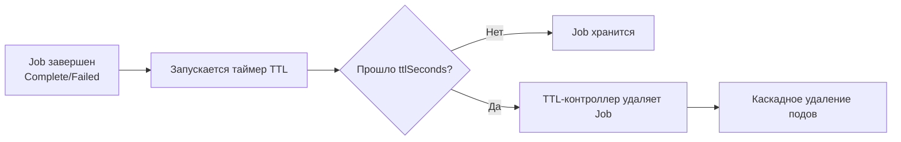

# TTL для Job — Автоматическая очистка завершенных задач

> 📌 Поле `.spec.ttlSecondsAfterFinished` автоматически удаляет завершенные Job (Complete или Failed) через N секунд вместе с их подами. **Стабильно с v1.23**. Критично для предотвращения засорения API Server.

---

## 🔹 Зачем нужен TTL-контроллер

| Проблема | Решение |
|----------|---------|
| Завершенные Job накапливаются в API Server | Автоматическое удаление через TTL |
| Поды завершенных Job занимают ресурсы etcd | Каскадное удаление Job + поды |
| Нужно хранить логи завершенных задач для отладки | Гибкая настройка TTL (от 0 до ∞) |
| Разные требования к хранению для разных Job | Динамическая установка TTL через webhook |



---

## 🔹 Как работает механизм

### 📋 Базовый принцип

```yaml
apiVersion: batch/v1
kind: Job
metadata:
  name: my-job
spec:
  ttlSecondsAfterFinished: 100  # ← удалить через 100 секунд после завершения
  template:
    spec:
      containers:
      - name: worker
        image: busybox
        command: ["echo", "Hello"]
      restartPolicy: Never
```

### ⏱️ Когда запускается таймер

Таймер TTL запускается, когда Job переходит в одно из терминальных состояний:

| Состояние Job | Что означает | TTL запускается? |
|---------------|--------------|------------------|
| **`Complete`** | Все поды успешно завершились | ✅ Да |
| **`Failed`** | Job провален (backoffLimit, deadline, podFailurePolicy) | ✅ Да |
| **`Suspended`** | Job приостановлен | ❌ Нет |
| **Running** | Поды еще работают | ❌ Нет |

### 🗑️ Каскадное удаление

Когда TTL истекает, TTL-контроллер удаляет Job **каскадно**:

```
Job удалён
  └─→ Поды Job удалены
      └─→ Контейнеры остановлены
          └─→ Ресурсы освобождены
```

> ⚠️ **Важно**: Kubernetes соблюдает гарантии жизненного цикла:
> - Ожидает завершения **финализаторов** (например, `batch.kubernetes.io/job-tracking`)
> - Ждёт, пока поды перейдут в терминальную фазу (`Failed` или `Succeeded`)
> - Только после этого удаляет Job

---

## 🔹 Способы установки TTL

### 1️⃣ В манифесте Job (статический TTL)

```yaml
apiVersion: batch/v1
kind: Job
metadata:
  name: cleanup-job
spec:
  ttlSecondsAfterFinished: 3600  # ← 1 час после завершения
  template:
    spec:
      containers:
      - name: worker
        image: busybox
        command: ["sh", "-c", "echo 'Processing...' && sleep 10"]
      restartPolicy: Never
```

**Когда использовать**: когда знаешь заранее, сколько хранить логи.

### 2️⃣ Для уже завершенного Job (ручная установка)

```bash
# Job уже завершился, но TTL не был указан
kubectl get job my-job -o yaml | grep -A5 'status:'
# status:
#   conditions:
#   - type: Complete
#     status: "True"

# Установить TTL вручную (Job будет удалён через 60 секунд)
kubectl patch job my-job --type=strategic --patch '{"spec":{"ttlSecondsAfterFinished":60}}'

# Проверить, что TTL установлен
kubectl get job my-job -o jsonpath='{.spec.ttlSecondsAfterFinished}'
# 60
```

**Когда использовать**: забыл указать TTL, нужно срочно очистить старые Job.

### 3️⃣ Через mutating webhook (динамический TTL при создании)

```yaml
# Пример webhook-конфигурации (упрощённо)
apiVersion: admissionregistration.k8s.io/v1
kind: MutatingWebhookConfiguration
metadata:
  name: job-ttl-webhook
webhooks:
- name: job-ttl.example.com
  rules:
  - apiGroups: ["batch"]
    apiVersions: ["v1"]
    operations: ["CREATE"]
    resources: ["jobs"]
  clientConfig:
    service:
      name: ttl-webhook-service
      namespace: kube-system
      path: "/mutate-jobs"
```

```go
// Пример логики webhook (Go)
func mutateJob(job *batchv1.Job) {
    // Если TTL не указан — установить по умолчанию
    if job.Spec.TTLSecondsAfterFinished == nil {
        ttl := int32(86400) // 24 часа
        job.Spec.TTLSecondsAfterFinished = &ttl
    }
}
```

**Когда использовать**: администраторы кластера хотят **гарантировать**, что все Job имеют TTL (политика кластера).

### 4️⃣ Через mutating webhook (динамический TTL после завершения)

```go
// Webhook реагирует на изменения .status
func mutateJobStatus(job *batchv1.Job) {
    // Если Job завершен и TTL не установлен
    if isJobFinished(job) && job.Spec.TTLSecondsAfterFinished == nil {
        // Разный TTL в зависимости от статуса
        if isJobSuccessful(job) {
            ttl := int32(3600) // 1 час для успешных
            job.Spec.TTLSecondsAfterFinished = &ttl
        } else {
            ttl := int32(86400) // 24 часа для проваленных (нужна отладка)
            job.Spec.TTLSecondsAfterFinished = &ttl
        }
    }
}

func isJobFinished(job *batchv1.Job) bool {
    for _, condition := range job.Status.Conditions {
        if (condition.Type == batchv1.JobComplete || condition.Type == batchv1.JobFailed) && 
           condition.Status == v1.ConditionTrue {
            return true
        }
    }
    return false
}
```

**Когда использовать**: разная политика хранения для успешных и проваленных Job.

### 5️⃣ Собственный контроллер

```go
// Пример: контроллер, который устанавливает TTL для Job с определённым лейблом
func reconcileJob(job *batchv1.Job) {
    // Если Job имеет лейбл cleanup=auto и TTL не установлен
    if job.Labels["cleanup"] == "auto" && job.Spec.TTLSecondsAfterFinished == nil {
        ttl := int32(7200) // 2 часа
        patch := []byte(fmt.Sprintf(`{"spec":{"ttlSecondsAfterFinished":%d}}`, ttl))
        kubeClient.BatchV1().Jobs(job.Namespace).Patch(
            context.TODO(), job.Name, types.StrategicMergePatchType, patch, metav1.PatchOptions{},
        )
    }
}
```

**Когда использовать**: сложная логика (например, TTL зависит от размера Job, неймспейса, лейблов).

---

## 🔹 Специальные значения TTL

| Значение | Поведение | Когда использовать |
|----------|-----------|-------------------|
| **`0`** | Удалить **немедленно** после завершения | Временные задачи, не нужны логи |
| **`> 0`** | Удалить через N секунд | Стандартный сценарий |
| **Не указано** | Job хранится **бессрочно** | Критичные задачи, нужна долгая история |

### ⚠️ Пример с `ttlSecondsAfterFinished: 0`

```yaml
apiVersion: batch/v1
kind: Job
metadata:
  name: instant-cleanup
spec:
  ttlSecondsAfterFinished: 0  # ← удалить сразу после завершения
  template:
    spec:
      containers:
      - name: worker
        image: busybox
        command: ["echo", "Quick task"]
      restartPolicy: Never
```

> ⚠️ **Важно**: при `ttlSecondsAfterFinished: 0` Job может быть удалён **до того**, как ты успеешь посмотреть логи. Используй только если логи не нужны или отправляются в централизованное хранилище.

---

## 🔹 Предостережения и подводные камни

### ⚠️ 1. Обновление TTL для завершенного Job

```bash
# Job завершился, TTL = 100 секунд
# Через 50 секунд ты решаешь продлить TTL до 200 секунд

kubectl patch job my-job --type=strategic --patch '{"spec":{"ttlSecondsAfterFinished":200}}'
# Ответ API: 200 OK ✅

# НО: нет гарантии, что Job не будет удалён!
# TTL-контроллер мог уже пометить Job на удаление, и обновление пришло слишком поздно.
```

**Вывод**: не полагайся на обновление TTL после завершения Job. Указывай TTL сразу.

### ⚠️ 2. Временная асимметрия (clock skew)

```
Проблема:
- TTL-контроллер использует метки времени из .status Job
- Если часы на разных нодах рассинхронизированы → Job может быть удалён раньше/позже

Пример:
- Job завершился в 12:00:00 (по часам API Server)
- TTL = 100 секунд → должен быть удалён в 12:01:40
- Но если часы TTL-контроллера спешат на 10 секунд → удалится в 12:01:30

Решение:
- Используй NTP для синхронизации часов в кластере
- Учитывай небольшой разброс при установке TTL (например, +10%)
```

**Вывод**: TTL чувствителен к точности часов. Для критичных задач добавляй запас.

### ⚠️ 3. TTL не работает для незавершенных Job

```yaml
# Ты установил TTL для работающего Job
spec:
  ttlSecondsAfterFinished: 100
  activeDeadlineSeconds: 50  # ← Job провалится через 50 секунд

# Что произойдёт:
# 1. Job проваливается по activeDeadlineSeconds
# 2. Запускается таймер TTL (100 секунд)
# 3. Job удаляется через 100 секунд после провала

# НО: если Job не завершается (висит в Running) — TTL не запускается!
```

**Вывод**: TTL запускается **только после завершения** Job. Для зависших Job используй `activeDeadlineSeconds`.

### ⚠️ 4. Каскадное удаление может быть медленным

```
Сценарий:
- Job создал 1000 подов
- TTL истёк
- TTL-контроллер начинает каскадное удаление

Что происходит:
1. Job помечается на удаление (deletionTimestamp)
2. Garbage Collector удаляет поды (может занять время)
3. Поды.terminateруются (terminationGracePeriodSeconds)
4. Только после этого Job удаляется полностью

Время удаления: O(N), где N — количество подов
```

**Вывод**: для Job с большим количеством подов удаление может занять минуты. Учитывай это при планировании очистки.

---

## 🔹 Практика: работа с TTL

### 🔍 Проверка TTL

```bash
# Посмотреть TTL для всех Job
kubectl get jobs -o custom-columns='NAME:.metadata.name,TTL:.spec.ttlSecondsAfterFinished'

# Найти Job без TTL (потенциальные засорители)
kubectl get jobs -o json | jq -r '.items[] | select(.spec.ttlSecondsAfterFinished == null) | .metadata.name'

# Посмотреть, когда Job завершился и сколько осталось до удаления
kubectl get job my-job -o jsonpath='{.status.conditions[?(@.type=="Complete")].lastTransitionTime}'
# 2024-06-05T12:00:00Z

# Рассчитать время удаления (TTL = 3600 секунд)
# Удалится в: 2024-06-05T13:00:00Z
```

### 🧪 Тестирование TTL

```bash
# Создать Job с коротким TTL (10 секунд)
kubectl apply -f - <<EOF
apiVersion: batch/v1
kind: Job
metadata:
  name: ttl-test
spec:
  ttlSecondsAfterFinished: 10
  template:
    spec:
      containers:
      - name: worker
        image: busybox
        command: ["echo", "Test"]
      restartPolicy: Never
EOF

# Проверить, что Job создан
kubectl get job ttl-test
# NAME       COMPLETIONS   DURATION   AGE
# ttl-test   0/1           5s         5s

# Подождать 15 секунд
sleep 15

# Проверить, что Job удалён
kubectl get job ttl-test
# Error from server (NotFound): jobs.batch "ttl-test" not found ✅

# Проверить, что поды тоже удалены
kubectl get pods --selector=job-name=ttl-test
# No resources found ✅
```

### 🧹 Ручная очистка старых Job

```bash
# Удалить все Job старше 7 дней
kubectl delete jobs --field-selector=status.successful=true --field-selector=metadata.creationTimestamp<$(date -d '7 days ago' -u +%Y-%m-%dT%H:%M:%SZ)

# Или через jq (более гибко)
kubectl get jobs -o json | jq -r '.items[] | select(.status.completionTime != null) | select(.status.completionTime | fromdateiso8601 < (now - 604800)) | .metadata.name' | xargs -r kubectl delete job

# Установить TTL для всех Job без TTL (массовая очистка)
kubectl get jobs -o json | jq -r '.items[] | select(.spec.ttlSecondsAfterFinished == null) | .metadata.name' | while read job; do
  kubectl patch job $job --type=strategic --patch '{"spec":{"ttlSecondsAfterFinished":86400}}'
done
```

---

## 🔹 Чек-лист: настройка TTL

```bash
# ✅ 1. Определить политику хранения: сколько дней хранить логи?
#    - Критичные задачи: 7-30 дней
#    - Обычные задачи: 1-7 дней
#    - Временные задачи: 0-1 час

# ✅ 2. Указать ttlSecondsAfterFinished в манифесте Job
#    - Не полагаться на ручную установку после завершения

# ✅ 3. Для массового применения: настроить mutating webhook
#    - Гарантировать, что все Job имеют TTL
#    - Разный TTL для успешных/проваленных Job

# ✅ 4. Синхронизировать часы в кластере (NTP)
#    - Избежать временной асимметрии

# ✅ 5. Мониторить количество завершенных Job
#    - Алерт, если слишком много Job без TTL
#    - kubectl get jobs --field-selector=status.successful=true | wc -l

# ✅ 6. Тестировать TTL в dev-окружении
#    - Убедиться, что Job удаляются как ожидается
#    - Проверить, что логи доступны до удаления

# ✅ 7. Для Job с большим количеством подов: учитывать время каскадного удаления
#    - Не устанавливать слишком короткий TTL (иначе поды не успеют завершиться)
```

> 💡 **Совет для конспекта**:
> 1. Создай файл `00_job_ttl_policy.md` с политикой TTL для твоего кластера: «Какие Job храним 1 день, какие 7 дней, какие бессрочно».
> 2. Добавь блок «Частые ошибки»: например, «забыл TTL для CronJob», «установил TTL=0 и потерял логи».
> 3. Веди список «Webhook для TTL»: если используешь webhook, документируй его логику.

---

## 🔹 Сравнение с альтернативами

| Подход | Плюсы | Минусы | Когда использовать |
|--------|-------|--------|-------------------|
| **TTL-контроллер** ✅ | Автоматический, встроенный в K8s, каскадное удаление | Чувствителен к часам, не работает для незавершенных Job | **Стандарт для очистки Job** |
| **CronJob cleanup** | Гибкая логика, можно фильтровать по лейблам | Требует написания CronJob, дополнительная нагрузка | Сложные сценарии очистки |
| **Ручная очистка** | Полный контроль | Забывчивость, засорение API Server | **Не рекомендуется** |
| **Собственный контроллер** | Максимальная гибкость | Сложность разработки и поддержки | Уникальные требования |

---

## 🔹 Ключевые выводы

1. **TTL-контроллер** автоматически удаляет завершенные Job через N секунд. **Стабильно с v1.23**.
2. **Таймер запускается** только после завершения Job (Complete или Failed).
3. **Каскадное удаление**: Job + поды + контейнеры.
4. **Способы установки**: в манифесте, вручную, через webhook, собственный контроллер.
5. **Специальные значения**: `0` — немедленное удаление, не указано — бессрочное хранение.
6. **Предостережения**: не обновляй TTL после завершения, синхронизируй часы, учитывай время каскадного удаления.
7. **Мониторинг**: следи за количеством Job без TTL, настраивай алерты.