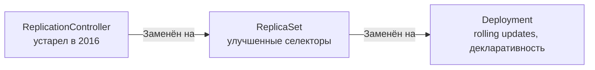

# ReplicationController — Устаревший контроллер репликации

> 📌 ReplicationController` (RC) — **устаревший** объект для управления репликами подов. **НЕ ИСПОЛЬЗУЙ** в новых проектах. Вместо него используй `Deployment` (рекомендуется) или `ReplicaSet`. RC встречается только в legacy-кластерах.

---

## 🔹 Что такое ReplicationController

| Аспект | Описание |
|--------|----------|
| **Статус** | ⚠️ **Устаревший (Legacy)** |
| **Назначение** | Гарантия, что указанное количество реплик подов всегда запущено |
| **Замена** | `Deployment` (рекомендуется) или `ReplicaSet` |
| **Аббревиатура** | `rc` |
| **Когда использовался** | Kubernetes 1.0–1.2 (2015–2016) |



---

## 🔹 Почему ReplicationController устарел

### ❌ Проблемы ReplicationController

| Проблема | Описание | Как решено в новых API |
|----------|----------|------------------------|
| **Ограниченные селекторы** | Поддерживает только `matchLabels` (равенство) | `ReplicaSet` и `Deployment` поддерживают `matchExpressions` (In, NotIn, Exists, Gt, Lt) |
| **Нет rolling updates** | Обновление подов — ручное (создать новый RC, масштабировать старый/новый) | `Deployment` имеет встроенный rolling update с контролем недоступности |
| **Нет отката** | Невозможно откатиться к предыдущей версии | `Deployment` хранит историю ревизий и поддерживает `rollout undo` |
| **Нет декларативности** | Императивное управление через `kubectl scale` | `Deployment` полностью декларативный (`apply -f`) |
| **Нет pause/resume** | Невозможно приостановить обновление | `Deployment` поддерживает `spec.paused` |
| **Нет стратегии обновления** | Только ручное масштабирование | `Deployment` имеет `RollingUpdate` и `Recreate` стратегии |

### 📊 Эволюция контроллеров репликации

```
2015: ReplicationController (v1)
      ↓ Проблемы: ограниченные селекторы, нет rolling updates
2016: ReplicaSet (apps/v1beta2)
      ↓ Проблемы: нет управления обновлениями
2017: Deployment (apps/v1beta1 → apps/v1 в 1.9)
      ✅ Решение: декларативность, rolling updates, rollback, pause/resume
```

---

## 🔹 Сравнение: RC vs ReplicaSet vs Deployment

| Характеристика | ReplicationController | ReplicaSet | Deployment |
|----------------|----------------------|------------|------------|
| **Статус** | ❌ Устарел | ✅ Стабилен, но не рекомендуется использовать напрямую | ✅ **Рекомендуется** |
| **API Group** | `v1` (core) | `apps/v1` | `apps/v1` |
| **Селекторы** | Только `matchLabels` | `matchLabels` + `matchExpressions` | `matchLabels` + `matchExpressions` |
| **Rolling updates** | ❌ Ручное | ❌ Нет | ✅ Встроенные |
| **Rollback** | ❌ Нет | ❌ Нет | ✅ `rollout undo` |
| **Пауза/возобновление** | ❌ Нет | ❌ Нет | ✅ `spec.paused` |
| **Стратегия обновления** | ❌ Нет | ❌ Нет | ✅ `RollingUpdate`, `Recreate` |
| **История ревизий** | ❌ Нет | ❌ Нет | ✅ Да |
| **Декларативность** | ⚠️ Частичная | ⚠️ Частичная | ✅ Полная |
| **Когда использовать** | Только в legacy-кластерах | Только если нужен кастомный контроллер обновлений | **Всегда** (для stateless-приложений) |

---

## 🔹 Если встретил ReplicationController в legacy-кластере

### 🔍 Как распознать

```bash
# Найти все ReplicationController в кластере
kubectl get rc --all-namespaces

# Пример вывода
# NAMESPACE   NAME      DESIRED   CURRENT   READY   AGE
# default     nginx-rc  3         3         3       2y
```

### 📋 Структура манифеста (для понимания)

```yaml
apiVersion: v1                    # ← core API, не apps/v1
kind: ReplicationController       # ← устаревший тип
metadata:
  name: nginx-rc
spec:
  replicas: 3
  selector:                       # ← только matchLabels (нет matchExpressions)
    app: nginx
  template:
    metadata:
      labels:
        app: nginx
    spec:
      containers:
      - name: nginx
        image: nginx:1.14
        ports:
        - containerPort: 80
      restartPolicy: Always       # ← только Always (в отличие от Job)
```

### 🛠️ Базовые команды

```bash
# Проверить статус
kubectl describe rc nginx-rc

# Масштабировать
kubectl scale rc nginx-rc --replicas=5

# Удалить RC И поды
kubectl delete rc nginx-rc

# Удалить RC, но ОСТАВИТЬ поды (orphan)
kubectl delete rc nginx-rc --cascade=orphan

# Найти поды, управляемые RC
kubectl get pods --selector=app=nginx
```

---

## 🔹 Миграция с ReplicationController на Deployment

### 🎯 План миграции

```bash
# 1. Экспортировать текущий RC
kubectl get rc nginx-rc -o yaml > nginx-rc-backup.yaml

# 2. Создать Deployment на основе RC (вручную или через конвертер)
kubectl convert -f nginx-rc-backup.yaml -o yaml > nginx-deployment.yaml
# ⚠️ kubectl convert удалён в K8s 1.26+, используй ручную конвертацию или инструменты

# 3. Проверить, что Deployment создан
kubectl get deployment nginx-deployment

# 4. Убедиться, что поды работают
kubectl get pods --selector=app=nginx

# 5. Удалить старый RC (orphan, чтобы не удалить поды)
kubectl delete rc nginx-rc --cascade=orphan

# 6. Проверить, что Deployment управляет подами
kubectl describe deployment nginx-deployment | grep -A5 'ReplicaSet'
```

### 📝 Ручная конвертация (пример)

```yaml
# Было (ReplicationController)
apiVersion: v1
kind: ReplicationController
metadata:
  name: nginx-rc
spec:
  replicas: 3
  selector:
    app: nginx
  template:
    metadata:
      labels:
        app: nginx
    spec:
      containers:
      - name: nginx
        image: nginx:1.14
---
# Стало (Deployment)
apiVersion: apps/v1
kind: Deployment
metadata:
  name: nginx-deployment
spec:
  replicas: 3
  selector:
    matchLabels:
      app: nginx
  template:
    metadata:
      labels:
        app: nginx
    spec:
      containers:
      - name: nginx
        image: nginx:1.14
```

### ✅ Преимущества миграции

| Что получишь | Как использовать |
|--------------|------------------|
| **Rolling updates** | `kubectl set image deployment/nginx-deployment nginx=nginx:1.15` |
| **Rollback** | `kubectl rollout undo deployment/nginx-deployment` |
| **Пауза обновлений** | `kubectl rollout pause deployment/nginx-deployment` |
| **История ревизий** | `kubectl rollout history deployment/nginx-deployment` |
| **Декларативность** | `kubectl apply -f nginx-deployment.yaml` |

---

## 🔹 Когда ReplicationController всё ещё встречается

### 📊 Сценарии legacy

| Сценарий | Почему не мигрировали | Рекомендация |
|----------|----------------------|--------------|
| **Старые кластеры (K8s < 1.9)** | Нет поддержки Deployment | Мигрировать при обновлении кластера |
| **Критичные production-системы** | Боятся менять работающее | Мигрировать в тестовом окружении, потом в prod |
| **Отсутствие документации** | Никто не знает, как работает | Сначала экспортировать, изучить, потом мигрировать |
| **Кастомные контроллеры** | Зависят от RC API | Переписать контроллеры под Deployment/ReplicaSet |

> ⚠️ **Важно**: если кластер обновлён до K8s 1.16+, ReplicationController всё ещё поддерживается, но **не рекомендуется** для использования. В будущих версиях может быть удалён.

---

## 🔹 Чек-лист: что делать, если встретил ReplicationController

```bash
# ✅ 1. Найти все RC в кластере
kubectl get rc --all-namespaces

# ✅ 2. Оценить критичность: какие RC управляют production-нагрузками?
kubectl get rc --all-namespaces -o custom-columns='NAMESPACE:.metadata.namespace,NAME:.metadata.name,REPLICAS:.spec.replicas'

# ✅ 3. Экспортировать конфигурацию RC
kubectl get rc <name> -n <namespace> -o yaml > rc-backup.yaml

# ✅ 4. Создать Deployment на основе RC (ручная конвертация или инструменты)
# См. раздел "Миграция с ReplicationController на Deployment"

# ✅ 5. Протестировать Deployment в dev/staging окружении
kubectl apply -f deployment.yaml --dry-run=server -o yaml
kubectl apply -f deployment.yaml

# ✅ 6. Убедиться, что Deployment управляет подами
kubectl get pods --selector=<selector> -o wide

# ✅ 7. Удалить старый RC (orphan, чтобы не удалить поды)
kubectl delete rc <name> -n <namespace> --cascade=orphan

# ✅ 8. Проверить, что всё работает
kubectl get deployment <name> -n <namespace>
kubectl rollout status deployment/<name>

# ✅ 9. Настроить мониторинг для нового Deployment
# ✅ 10. Обновить документацию: заменить RC на Deployment
```

> 💡 **Совет для конспекта**:
> 1. Создай файл `00_legacy_migration.md` с планом миграции legacy-объектов (RC → Deployment, PetSet → StatefulSet).
> 2. Добавь блок «Частые ошибки миграции»: например, «забыл `--cascade=orphan` и удалил поды», «не протестировал в staging».
> 3. Веди список «Legacy-объекты в кластере»: тип, имя, неймспейс, статус миграции.

---

## 🔹 Ключевые выводы

1. **ReplicationController — устаревший**: НЕ используй в новых проектах. Вместо него — `Deployment`.
2. **Проблемы RC**: ограниченные селекторы, нет rolling updates, нет rollback, нет декларативности.
3. **Эволюция**: RC → ReplicaSet → Deployment. Каждый шаг добавлял новые возможности.
4. **Встречается в legacy**: если нашёл RC в кластере — планируй миграцию на Deployment.
5. **Миграция**: экспортируй RC → создай Deployment → протестируй → удали RC с `--cascade=orphan`.
6. **Deployment даёт**: rolling updates, rollback, pause/resume, историю ревизий, декларативность.
7. **ReplicaSet**: промежуточный этап, используется внутри Deployment, но напрямую не рекомендуется.