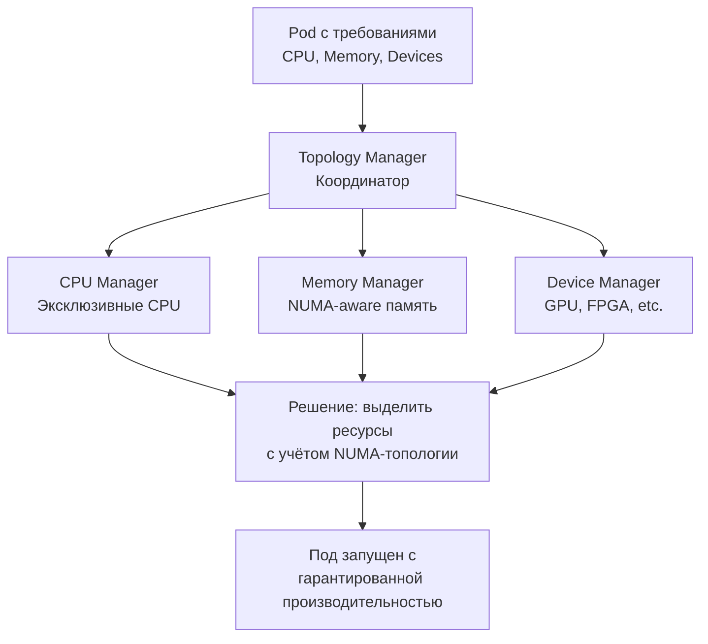

Принято. Переработал материал про Resource Managers в формат «золотой
# Resource Managers — Менеджеры ресурсов в Kubernetes

> 📌  Для высокопроизводительных и low-latency нагрузок K8s предлагает **4 менеджера ресурсов**: Topology Manager (координация), CPU Manager (эксклюзивные CPU), Memory Manager (NUMA-aware память), Device Manager (GPU, FPGA и др.). По умолчанию используются политики `none` — для production с высокими требованиями к производительности включай `static`.

---

## 🔹 Зачем нужны Resource Managers

| Проблема | Решение |
|----------|---------|
| **Шумные соседи**: поды делят CPU, кэш, память → непредсказуемая производительность | CPU Manager: эксклюзивное выделение CPU |
| **NUMA-узлы**: доступ к памяти с другого NUMA-узла медленнее | Memory Manager + Topology Manager: привязка к одному NUMA |
| **Специальное оборудование**: GPU, FPGA, SR-IOV | Device Manager: эксклюзивное выделение устройств |
| **Координация**: нужно согласовать CPU + память + устройства | Topology Manager: единая точка принятия решений |



---

## 🔹 Topology Manager — координатор (стабильно с v1.27)

> **Роль**: координирует CPU Manager, Memory Manager и Device Manager. Принимает решение, можно ли разместить под на узле с учётом NUMA-топологии.

### 🎯 Политики Topology Manager

| Политика | Поведение | Когда использовать |
|----------|-----------|-------------------|
| **`none`** (по умолчанию) | Игнорирует NUMA-топологию | Обычные нагрузки, не чувствительные к задержкам |
| **`best-effort`** | Пытается выровнять по NUMA, но если не получается — всё равно запускает под | Компромисс: оптимизация без жёстких требований |
| **`restricted`** | Требует выравнивания по NUMA. Если не получается — под отклоняется | Критичные нагрузки, где важна предсказуемость |
| **`single-numa-node`** | Все ресурсы пода должны быть на одном NUMA-узле | Максимальная производительность, low-latency |

### ⚙️ Настройка в kubelet

```yaml
# kubelet-config.yaml
apiVersion: kubelet.config.k8s.io/v1beta1
kind: KubeletConfiguration
topologyManagerPolicy: "single-numa-node"
topologyManagerScope: "container"  # или "pod" (alpha)
```

---

## 🔹 CPU Manager — управление CPU (стабильно с v1.26)

> **Роль**: распределяет CPU между подами. Может выделять эксклюзивные CPU для Guaranteed-подов.

### 🎯 Политики CPU Manager

| Политика | Поведение | Когда использовать |
|----------|-----------|-------------------|
| **`none`** (по умолчанию) | Использует CFS quota (стандартный Linux scheduler) | Обычные нагрузки |
| **`static`** | Выделяет эксклюзивные CPU для Guaranteed-подов с целочисленными requests | High-performance, low-latency |

### 📊 Как работает `static` политика

```
1. Kubelet создаёт "общий пул" CPU: все CPU минус reservedSystemCPUs
2. Для Guaranteed-пода с целочисленным CPU request:
   - Выделяет эксклюзивные CPU из общего пула
   - Устанавливает cpuset cgroup (под использует только свои CPU)
   - Отключает CFS quota (нет throttling)
3. Для BestEffort/Burstable подов:
   - Используют оставшийся общий пул
   - Работают с CFS quota
```

### ✅ Требования для эксклюзивного выделения CPU

| Условие | Пример | Класс QoS | Эксклюзивные CPU? |
|---------|--------|-----------|-------------------|
| `requests == limits` для CPU и memory | `cpu: "2", memory: "1Gi"` | **Guaranteed** | ✅ Да (если CPU целое) |
| Только `limits` (requests = limits автоматически) | `limits: {cpu: "2"}` | **Guaranteed** | ✅ Да |
| `requests != limits` | `requests: {cpu: "1"}, limits: {cpu: "2"}` | **Burstable** | ❌ Нет |
| Дробный CPU | `cpu: "1.5"` | **Guaranteed** | ❌ Нет (дробный) |
| Нет `requests` и `limits` | — | **BestEffort** | ❌ Нет |

### 📝 Пример: Guaranteed-под с эксклюзивными CPU

```yaml
apiVersion: v1
kind: Pod
metadata:
  name: high-performance-app
spec:
  containers:
  - name: app
    image: my-app:latest
    resources:
      requests:
        cpu: "4"        # ← целое число
        memory: "4Gi"
      limits:
        cpu: "4"        # ← requests == limits
        memory: "4Gi"
```

**Что произойдёт**:
- Под получит класс QoS `Guaranteed`
- CPU Manager выделит 4 эксклюзивных CPU
- Под будет использовать только эти 4 CPU (cpuset)
- CFS quota отключена → нет throttling

### ⚙️ Опции `static` политики

| Опция | Статус | Описание |
|-------|--------|----------|
| **`full-pcpus-only`** | GA (v1.33) | Выделять только полные физические ядра (не hyperthreading) |
| **`distribute-cpus-across-numa`** | Beta (v1.23) | Равномерно распределять CPU по NUMA-узлам |
| **`align-by-socket`** | Alpha (v1.25) | Выравнивать по физическим сокетам, а не NUMA |
| **`strict-cpu-reservation`** | GA (v1.35) | Запретить всем подам (включая Burstable/BestEffort) использовать reservedSystemCPUs |
| **`distribute-cpus-across-cores`** | Alpha (v1.31) | Распределять hyperthreads по разным физическим ядрам |
| **`prefer-align-cpus-by-uncorecache`** | GA (v1.32) | Выравнивать по кэшу последнего уровня (LLC) |

### ⚙️ Настройка в kubelet

```yaml
# kubelet-config.yaml
apiVersion: kubelet.config.k8s.io/v1beta1
kind: KubeletConfiguration
cpuManagerPolicy: "static"
cpuManagerReconcilePeriod: "10s"
reservedSystemCPUs: "0,1"  # ← зарезервировать CPU 0 и 1 для системы
cpuManagerPolicyOptions:
  full-pcpus-only: "true"
  distribute-cpus-across-numa: "true"
```

---

## 🔹 Memory Manager — управление памятью (стабильно с v1.32)

> **Роль**: выделяет память с учётом NUMA-топологии для Guaranteed-подов.

### 🎯 Политики Memory Manager

| Политика | Поведение | Когда использовать |
|----------|-----------|-------------------|
| **`None`** (по умолчанию) | Игнорирует NUMA-топологию | Обычные нагрузки |
| **`Static`** | Выделяет память с учётом NUMA, консультируется с Topology Manager | High-performance, low-latency |

### 📊 Как работает `Static` политика

```
1. Memory Manager получает запросы памяти от пода
2. Определяет оптимальный NUMA-узел (или несколько)
3. Передаёт "подсказку" в Topology Manager
4. Topology Manager решает: принять или отклонить под
5. Если принято — память выделяется из выбранных NUMA-узлов
6. Устанавливается cpuset для памяти (аналогично CPU)
```

### ⚙️ Настройка в kubelet

```yaml
# kubelet-config.yaml
apiVersion: kubelet.config.k8s.io/v1beta1
kind: KubeletConfiguration
memoryManagerPolicy: "Static"
reservedMemory:
  - numaNode: 0
    limits:
      memory: "1Gi"
      hugepages-2Mi: "128Mi"
  - numaNode: 1
    limits:
      memory: "1Gi"
      hugepages-2Mi: "128Mi"
```

---

## 🔹 Device Manager — управление устройствами (стабильно с v1.26)

> **Роль**: распределяет аппаратные устройства (GPU, FPGA, SR-IOV NIC) между подами через Device Plugins.

### 🎯 Как работает

```
1. Device Plugin регистрирует устройства в kubelet (через gRPC)
2. Kubelet создаёт extended resource (например, nvidia.com/gpu)
3. Под запрашивает устройство в resources.requests
4. Device Manager выделяет эксклюзивное устройство
5. Передаёт информацию в Topology Manager (для NUMA-aware выделения)
```

### 📝 Пример: запрос GPU

```yaml
apiVersion: v1
kind: Pod
metadata:
  name: gpu-app
spec:
  containers:
  - name: ml-training
    image: tensorflow/tensorflow:latest-gpu
    resources:
      requests:
        nvidia.com/gpu: 1    # ← запрос 1 GPU
        cpu: "4"
        memory: "8Gi"
      limits:
        nvidia.com/gpu: 1
        cpu: "4"
        memory: "8Gi"
```

**Требования**:
- Установлен **NVIDIA Device Plugin** (или аналогичный для других устройств)
- Kubelet настроен с `--feature-gates=DevicePlugins=true` (включено по умолчанию)

---

## 🔹 Pod-level Resource Managers — ресурсы на уровне пода (alpha с v1.36)

> **Новая фича**: позволяет управлять ресурсами на уровне **пода**, а не контейнера. Даёт более гибкую модель: часть контейнеров получают эксклюзивные ресурсы, остальные делят общий пул пода.

### 🎯 Зачем нужно

| Сценарий | Проблема с container scope | Решение с pod scope |
|----------|---------------------------|---------------------|
| **Main app + sidecars** | Sidecar может получить эксклюзивные CPU, хотя не нужен | Main app получает эксклюзивные CPU, sidecars делят остаток |
| **Init containers** | Ресурсы освобождаются после завершения init | Ресурсы возвращаются в пул пода и переиспользуются |
| **Смешанные нагрузки** | Каждый контейнер оценивается отдельно | Под оценивается как единое целое |

### 📊 Scope: pod vs container

| Scope | Поведение | Когда использовать |
|-------|-----------|-------------------|
| **`container`** (по умолчанию) | Каждый контейнер оценивается отдельно для эксклюзивного выделения | Стандартный подход, обратная совместимость |
| **`pod`** (alpha) | Под оценивается как единое целое, ресурсы делятся на эксклюзивные и общий пул | Смешанные нагрузки, оптимизация NUMA |

### 📝 Пример: pod scope с эксклюзивным main app

```yaml
apiVersion: v1
kind: Pod
metadata:
  name: pod-scope-mixed
spec:
  # Ресурсы на уровне ПОДА (alpha)
  resources:
    requests:
      cpu: "4"
      memory: "4Gi"
    limits:
      cpu: "4"
      memory: "4Gi"
  
  initContainers:
  - name: metrics-sidecar
    image: prom/statsd-exporter:latest
    restartPolicy: Always    # ← persistent sidecar
    # Не указывает resources → использует общий пул пода
  
  containers:
  - name: main-app
    image: my-app:latest
    resources:
      requests:
        cpu: "2"        # ← целое число
        memory: "2Gi"
      limits:
        cpu: "2"
        memory: "2Gi"
    # → получит 2 эксклюзивных CPU
```

**Что произойдёт**:
- Под получит 4 CPU (согласно `spec.resources`)
- `main-app` получит 2 эксклюзивных CPU (Guaranteed)
- `metrics-sidecar` будет использовать оставшиеся 2 CPU из общего пула пода
- Все ресурсы выровнены по NUMA (если включён Topology Manager)

### ⚠️ Ограничения pod scope

| Ограничение | Описание |
|-------------|----------|
| **Пустой общий пул** | Если все Guaranteed-контейнеры заберут весь бюджет пода, а есть non-Guaranteed → под отклонится |
| **Неэффективное использование** | Если Guaranteed-контейнеры не используют весь бюджет, а non-Guaranteed нет → ресурсы простаивают |
| **Постоянный пул** | Общий пул пода не освобождается при перезапуске контейнеров (только при удалении пода) |
| **Только Linux** | Не поддерживается на Windows-нодах |
| **Только static policy** | Работает только с `static` политикой CPU Manager и Memory Manager |

### ⚙️ Включение фичи

```yaml
# kubelet-config.yaml
apiVersion: kubelet.config.k8s.io/v1beta1
kind: KubeletConfiguration
featureGates:
  PodLevelResources: true
  PodLevelResourceManagers: true
topologyManagerScope: "pod"  # ← переключить scope на pod
```

---

## 🔹 Практика: настройка high-performance узла

### 🚀 Пошаговая настройка

```bash
# 1. Определить NUMA-топологию узла
numactl --hardware
# available: 2 nodes (0-1)
# node 0 cpus: 0 1 2 3 4 5 6 7
# node 0 size: 16384 MB
# node 1 cpus: 8 9 10 11 12 13 14 15
# node 1 size: 16384 MB

# 2. Настроить kubelet
cat > /etc/kubernetes/kubelet-config.yaml <<EOF
apiVersion: kubelet.config.k8s.io/v1beta1
kind: KubeletConfiguration
cpuManagerPolicy: "static"
cpuManagerReconcilePeriod: "10s"
reservedSystemCPUs: "0,8"  # ← зарезервировать по 1 CPU на каждый NUMA-узел
memoryManagerPolicy: "Static"
reservedMemory:
  - numaNode: 0
    limits:
      memory: "2Gi"
  - numaNode: 1
    limits:
      memory: "2Gi"
topologyManagerPolicy: "single-numa-node"
topologyManagerScope: "container"
cpuManagerPolicyOptions:
  full-pcpus-only: "true"
  distribute-cpus-across-numa: "true"
EOF

# 3. Перезапустить kubelet
systemctl restart kubelet

# 4. Проверить, что политики применены
kubectl get node <node-name> -o jsonpath='{.status.allocatable}'
# {"cpu":"6","memory":"28Gi","nvidia.com/gpu":"2"}

# 5. Проверить состояние CPU Manager
ssh <node-name> cat /var/lib/kubelet/cpu_manager_state
# {"policyName":"static","defaultCpuSet":"0-1,8-9","entries":{...}}
```

### 📝 Пример: high-performance под

```yaml
apiVersion: v1
kind: Pod
metadata:
  name: high-perf-app
  annotations:
    # Опционально: указать предпочтительный NUMA-узел
    kubernetes.io/preferred-numa-node: "0"
spec:
  containers:
  - name: app
    image: my-app:latest
    resources:
      requests:
        cpu: "4"              # ← целое число
        memory: "8Gi"
        nvidia.com/gpu: "1"   # ← если нужен GPU
      limits:
        cpu: "4"              # ← requests == limits
        memory: "8Gi"
        nvidia.com/gpu: "1"
    # → получит 4 эксклюзивных CPU на одном NUMA-узле
    # → получит 8Gi памяти с того же NUMA-узла
    # → получит 1 эксклюзивный GPU
```

### 🔍 Отладка

```bash
# Проверить, какие CPU выделены поду
kubectl exec -it high-perf-app -- cat /sys/fs/cgroup/cpuset/cpuset.cpus
# 2-5  (или 10-13, в зависимости от NUMA)

# Проверить, какая память выделена
kubectl exec -it high-perf-app -- cat /sys/fs/cgroup/cpuset/cpuset.mems
# 0  (или 1)

# Проверить, что CFS quota отключена
kubectl exec -it high-perf-app -- cat /sys/fs/cgroup/cpu/cpu.cfs_quota_us
# -1  (означает, что quota отключена)

# Посмотреть состояние CPU Manager на узле
ssh <node-name> cat /var/lib/kubelet/cpu_manager_state | jq

# Посмотреть состояние Memory Manager
ssh <node-name> cat /var/lib/kubelet/memory_manager_state | jq

# Проверить метрики kubelet
kubectl get --raw /api/v1/nodes/<node-name>/proxy/metrics | grep resource_manager
# resource_manager_allocations_total{source="node"} 5
# resource_manager_allocation_errors_total{source="node"} 0
```

---

## 🔹 Чек-лист: настройка Resource Managers

```bash
# ✅ 1. Определить требования нагрузки
#    - Обычная веб-нагрузка → оставить политики по умолчанию (none)
#    - High-performance, low-latency → включить static политики

# ✅ 2. Настроить kubelet
#    - cpuManagerPolicy: "static"
#    - memoryManagerPolicy: "Static"
#    - topologyManagerPolicy: "single-numa-node" (или "restricted")
#    - reservedSystemCPUs: указать CPU для системы
#    - reservedMemory: указать память для системы

# ✅ 3. Настроить опции static политики
#    - full-pcpus-only: "true" (избежать hyperthreading)
#    - distribute-cpus-across-numa: "true" (равномерное распределение)

# ✅ 4. Установить Device Plugins (если нужно GPU/FPGA)
#    - NVIDIA Device Plugin: kubectl apply -f https://raw.githubusercontent.com/NVIDIA/k8s-device-plugin/v0.14.1/nvidia-device-plugin.yml

# ✅ 5. Создать Guaranteed-поды
#    - requests == limits для CPU и memory
#    - CPU — целое число (1, 2, 4, не 1.5)

# ✅ 6. Проверить выделение ресурсов
#    - kubectl exec <pod> -- cat /sys/fs/cgroup/cpuset/cpuset.cpus
#    - kubectl exec <pod> -- cat /sys/fs/cgroup/cpuset/cpuset.mems

# ✅ 7. Мониторинг
#    - Метрики kubelet: resource_manager_allocations_total
#    - Алерт на resource_manager_allocation_errors_total > 0
#    - Проверять, что поды получают ожидаемое количество CPU
```

> 💡 **Совет для конспекта**:
> 1. Создай файл `00_resource_managers_cheatsheet.md` с шпаргалкой по политикам и опциям.
> 2. Добавь блок «Частые ошибки»: например, «забыл `reservedSystemCPUs`», «использовал дробный CPU для Guaranteed», «не установил Device Plugin».
> 3. Веди список «Какие узлы настроены для high-performance»: имя узла, политики, зарезервированные ресурсы.

---

## 🔹 Ключевые выводы

1. **4 менеджера ресурсов**: Topology (координация), CPU (эксклюзивные CPU), Memory (NUMA-aware), Device (GPU/FPGA).
2. **Политики по умолчанию** (`none`) подходят для обычных нагрузок. Для high-performance включай `static`.
3. **Guaranteed QoS** — обязательное условие для эксклюзивного выделения: `requests == limits`, CPU — целое число.
4. **Topology Manager** координирует все менеджеры и принимает решение о размещении пода с учётом NUMA.
5. **Pod-level resources** (alpha с v1.36) — новая фича для более гибкого управления ресурсами на уровне пода.
6. **reservedSystemCPUs** — обязательно указывай, иначе системные процессы будут конкурировать с подами.
7. **Мониторинг**: используй метрики kubelet (`resource_manager_*`) для отслеживания выделения ресурсов.
