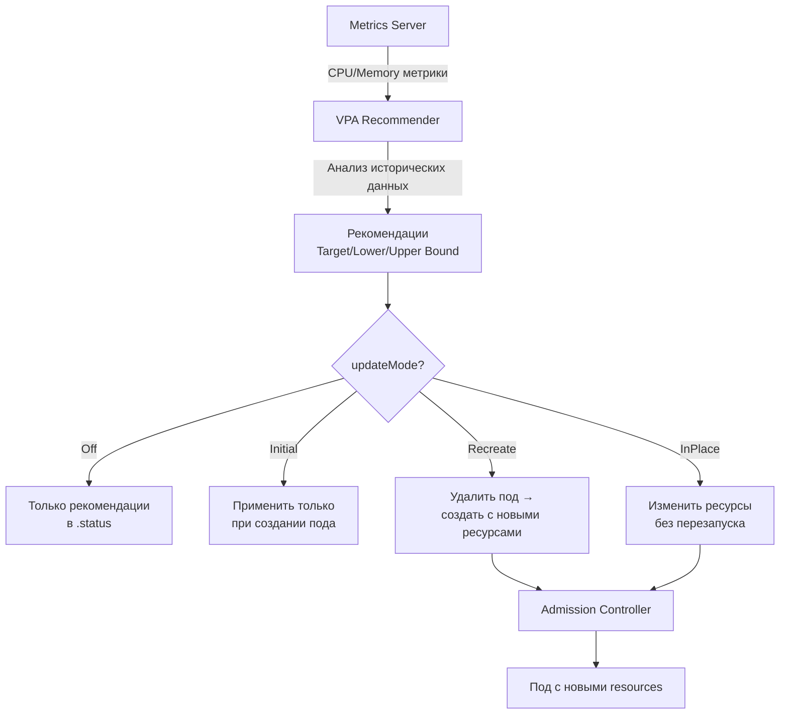

# VerticalPodAutoscaler (VPA) — Вертикальное автомасштабирование

> 📌 `VPA` автоматически корректирует `requests` и `limits` CPU/memory для уже запущенных подов на основе фактического использования. **Не встроен в K8s** — нужно устанавливать отдельно. В отличие от HPA (добавляет/удаляет поды), VPA меняет **размер ресурсов** у существующих подов. **Не работает с HPA** для одного ресурса.

---

## 🔹 Что такое VPA

| Аспект | Описание |
|--------|----------|
| **Назначение** | Автоматическая корректировка `requests`/`limits` CPU и memory |
| **Тип масштабирования** | Вертикальное (изменяет размер ресурсов у существующих подов) |
| **API версия** | `autoscaling.k8s.io/v1` (CRD, не часть core API) |
| **Установка** | ❌ Не встроен — нужно устанавливать отдельно |
| **Требования** | `Metrics Server`, контроллер допуска (Admission Controller) |
| **Совместимость** | ❌ Нельзя использовать с HPA для одного ресурса |

### 🆚 VPA vs HPA

| Характеристика | VPA | HPA |
|----------------|-----|-----|
| **Что меняет** | `requests`/`limits` у подов | Количество реплик подов |
| **Тип** | Вертикальный | Горизонтальный |
| **Downtime** | ⚠️ Есть (при `Recreate`) / Нет (при `InPlace`) | Нет (rolling update) |
| **Встроен в K8s** | ❌ Нет | ✅ Да |
| **Работает с StatefulSet** | ⚠️ С ограничениями | ✅ Да |
| **Можно комбинировать** | ❌ Не с HPA для одного ресурса | ❌ Не с VPA для одного ресурса |



---

## 🔹 Архитектура VPA

VPA состоит из **3 компонентов**:

| Компонент | Роль | Как работает |
|-----------|------|--------------|
| **🧠 Recommender** | Анализирует использование ресурсов и выдаёт рекомендации | Периодически запрашивает метрики из `metrics.k8s.io`, изучает исторические паттерны, пиковые нагрузки, OOM-события. Выдаёт 3 типа рекомендаций: `target` (оптимум), `lowerBound` (минимум), `upperBound` (максимум) |
| **🔄 Updater** | Применяет рекомендации к подам | Сравнивает текущие `requests` с рекомендациями. Если разница превышает порог — либо удаляет под (для пересоздания), либо обновляет ресурсы на месте (если поддерживается) |
| **🛡️ Admission Controller** | Перехватывает создание подов | Mutating webhook, который перехватывает запросы на создание подов и применяет рекомендации VPA **до** создания пода. Гарантирует, что новые поды сразу запускаются с правильными ресурсами |

> ⚠️ **Важно**: все 3 компонента должны быть установлены для полноценной работы VPA. Без Admission Controller рекомендации будут применяться только к **уже запущенным** подам (при их пересоздании).

---

## 🔹 Режимы обновления (`updateMode`)

> Определяет, **как и когда** VPA применяет рекомендации к подам.

| Режим | Поведение | Downtime | Когда использовать |
|-------|-----------|----------|-------------------|
| **`Off`** | Только анализ и рекомендации, без применения | ❌ Нет | Анализ, планирование ресурсов, тестирование |
| **`Initial`** | Применяет рекомендации только при **первом создании** пода | ❌ Нет | Когда можно контролировать создание подов |
| **`Recreate`** | Удаляет под, если ресурсы не совпадают с рекомендациями → контроллер создаёт новый | ⚠️ **Да** (короткий) | Стандартный режим для большинства случаев |
| **`InPlaceOrRecreate`** | Пытается изменить ресурсы без перезапуска. Если не получается — удаляет под | ⚠️ Иногда | Компромисс: минимум downtime |
| **`InPlace`** (alpha) | Только изменение ресурсов на месте. Никогда не удаляет под | ❌ Нет | Когда downtime недопустим (требует K8s 1.33+) |

### 📋 Детальный разбор режимов

#### 🔴 `Off` — только рекомендации

```yaml
apiVersion: autoscaling.k8s.io/v1
kind: VerticalPodAutoscaler
metadata:
  name: my-app-vpa
spec:
  targetRef:
    apiVersion: apps/v1
    kind: Deployment
    name: my-app
  updatePolicy:
    updateMode: "Off"    # ← только анализ
```

```bash
# Посмотреть рекомендации
kubectl describe vpa my-app-vpa
# Recommendation:
#   Container Recommendations:
#     Container Name:  my-app
#     Lower Bound:
#       Cpu:     150m
#       Memory:  256Mi
#     Target:
#       Cpu:     300m      # ← рекомендуемое значение
#       Memory:  512Mi
#     Upper Bound:
#       Cpu:     500m
#       Memory:  1Gi
```

**Когда использовать**:
- Первый запуск VPA — посмотреть, что рекомендует
- Анализ перед переходом в `Recreate` или `InPlace`
- Production, где нельзя рисковать downtime

#### 🟡 `Initial` — только при создании

```yaml
updatePolicy:
  updateMode: "Initial"
```

**Что происходит**:
- При создании нового пода — VPA применяет рекомендации
- Уже запущенные поды **не трогаются**, даже если рекомендации изменились
- Поды, созданные до включения VPA, остаются со старыми ресурсами

**Когда использовать**:
- Новые деплои, где поды часто пересоздаются (rolling updates)
- Когда можно контролировать, когда поды пересоздаются

#### 🟠 `Recreate` — стандартный режим

```yaml
updatePolicy:
  updateMode: "Recreate"
```

**Что происходит**:
```
1. VPA Recommender видит, что текущие resources ≠ рекомендациям
2. Updater удаляет под (graceful termination)
3. Deployment/StatefulSet создаёт новый под
4. Admission Controller перехватывает создание и применяет рекомендации
5. Новый под запускается с новыми resources
```

**Когда использовать**:
- Большинство случаев, когда допустим короткий downtime
- Stateless-приложения с несколькими репликами

**⚠️ Ограничения**:
- Короткий downtime при удалении пода
- Учитывает `PodDisruptionBudgets` (PDB) — не удалит больше подов, чем разрешено
- Для StatefulSet может быть проблематично (пересоздание пода = потеря данных, если нет PV)

#### 🟢 `InPlaceOrRecreate` — умный режим (рекомендуется)

```yaml
updatePolicy:
  updateMode: "InPlaceOrRecreate"
```

**Что происходит**:
```
1. VPA пытается изменить ресурсы на месте (InPlacePodVerticalScaling)
2. Если успешно → под продолжает работать с новыми resources (без downtime)
3. Если не удалось (например, узел не имеет достаточно ресурсов) → удаляет под (fallback на Recreate)
```

**Требования**:
- Kubernetes 1.27+ с `InPlacePodVerticalScaling` feature gate
- Поддержка со стороны Container Runtime (containerd 1.7+)

**Когда использовать**:
- Когда нужен минимум downtime
- Production-нагрузки с высокими требованиями к доступности

#### 🔵 `InPlace` — только на месте (alpha)

```yaml
updatePolicy:
  updateMode: "InPlace"
```

**Что происходит**:
- VPA пытается изменить ресурсы на месте
- Если не получилось → **ждёт и повторяет попытку** (никогда не удаляет под)
- Может привести к тому, что под долго работает с неоптимальными ресурсами

**Требования**:
- Kubernetes 1.33+
- Feature gates: `InPlacePodVerticalScaling`, `InPlace` (в VPA)
- Включить в VPA Updater и Admission Controller: `--feature-gates=InPlace=true`

**Когда использовать**:
- Критичные нагрузки, где downtime абсолютно недопустим
- Готов мириться с тем, что под может долго работать с неоптимальными ресурсами

---

## 🔹 Resource Policy — тонкая настройка

> Позволяет задать границы для рекомендаций, указать, какие ресурсы управлять, и настроить политику для отдельных контейнеров.

### 📋 Структура resourcePolicy

```yaml
apiVersion: autoscaling.k8s.io/v1
kind: VerticalPodAutoscaler
metadata:
  name: my-app-vpa
spec:
  targetRef:
    apiVersion: apps/v1
    kind: Deployment
    name: my-app
  updatePolicy:
    updateMode: "Recreate"
  resourcePolicy:
    containerPolicies:
    - containerName: "application"
      minAllowed:
        cpu: 100m
        memory: 128Mi
      maxAllowed:
        cpu: 2
        memory: 2Gi
      controlledResources:
      - cpu
      - memory
      controlledValues: "RequestsAndLimits"
```

### 🎯 Поля resourcePolicy

| Поле | Описание | Пример |
|------|----------|--------|
| **`containerName`** | Имя контейнера (или `*` для всех) | `"application"`, `"*"` |
| **`minAllowed`** | Минимальные ресурсы, которые VPA может рекомендовать | `cpu: 100m, memory: 128Mi` |
| **`maxAllowed`** | Максимальные ресурсы, которые VPA может рекомендовать | `cpu: 2, memory: 2Gi` |
| **`controlledResources`** | Какие ресурсы управлять (по умолчанию: cpu, memory) | `[cpu]`, `[memory]`, `[cpu, memory]` |
| **`controlledValues`** | Что контролировать: requests, limits или оба | `RequestsAndLimits` (по умолчанию), `RequestsOnly` |

### 📊 Примеры использования

#### Пример 1: Ограничить максимальные ресурсы

```yaml
resourcePolicy:
  containerPolicies:
  - containerName: "*"
    maxAllowed:
      cpu: 4
      memory: 8Gi
```

**Зачем**: VPA никогда не порекомендует больше 4 CPU и 8Gi memory, даже если фактическое использование выше.

#### Пример 2: Управлять только CPU

```yaml
resourcePolicy:
  containerPolicies:
  - containerName: "*"
    controlledResources:
    - cpu
    # memory не управляется VPA
```

**Зачем**: хочешь, чтобы VPA оптимизировал только CPU, а memory оставался фиксированным.

#### Пример 3: Управлять только requests (limits не трогать)

```yaml
resourcePolicy:
  containerPolicies:
  - containerName: "*"
    controlledValues: "RequestsOnly"
```

**Зачем**:
- VPA меняет только `requests` (гарантированные ресурсы)
- `limits` остаются такими, как указаны в манифесте
- Полезно, если limits заданы вручную и не должны меняться

**⚠️ Осторожно**: если VPA увеличит `requests` выше `limits` → под не запустится. VPA учитывает это и не будет рекомендовать `requests > limits`.

#### Пример 4: Разные политики для разных контейнеров

```yaml
resourcePolicy:
  containerPolicies:
  - containerName: "main-app"
    minAllowed:
      cpu: 500m
      memory: 512Mi
    maxAllowed:
      cpu: 4
      memory: 4Gi
  - containerName: "sidecar"
    minAllowed:
      cpu: 50m
      memory: 64Mi
    maxAllowed:
      cpu: 500m
      memory: 512Mi
  - containerName: "*"    # ← для всех остальных контейнеров
    mode: "Off"           # ← не управлять
```

**Зачем**: main-app — критичный, требует больше ресурсов; sidecar — вспомогательный, достаточно мало.

---

## 🔹 Интеграция с LimitRange

> VPA учитывает `LimitRange` в неймспейсе. Если рекомендация VPA превышает `max` из LimitRange — VPA уменьшит рекомендацию.

### 📋 Пример

```yaml
# LimitRange в неймспейсе
apiVersion: v1
kind: LimitRange
metadata:
  name: default-limits
  namespace: default
spec:
  limits:
  - type: Container
    max:
      cpu: 2
      memory: 2Gi
    min:
      cpu: 100m
      memory: 128Mi
---
# VPA
apiVersion: autoscaling.k8s.io/v1
kind: VerticalPodAutoscaler
metadata:
  name: my-app-vpa
spec:
  targetRef:
    apiVersion: apps/v1
    kind: Deployment
    name: my-app
  updatePolicy:
    updateMode: "Recreate"
  resourcePolicy:
    containerPolicies:
    - containerName: "*"
      maxAllowed:
        cpu: 4          # ← VPA может рекомендовать до 4 CPU
        memory: 4Gi
```

**Что произойдёт**:
- VPA Recommender может порекомендовать до 4 CPU (согласно `maxAllowed`)
- Но LimitRange ограничивает максимум 2 CPU
- Admission Controller уменьшит рекомендацию до 2 CPU (максимум из LimitRange)
- `requests` пропорционально уменьшится, чтобы сохранить соотношение `requests/limits`

> 💡 **Совет**: всегда проверяй, что `LimitRange` в неймспейсе совместим с `maxAllowed` в VPA. Иначе рекомендации будут обрезаться.

---

## 🔹 Практика: установка и настройка VPA

### 🚀 Установка VPA

```bash
# 1. Клонировать репозиторий VPA
git clone https://github.com/kubernetes/autoscaler.git
cd autoscaler/vertical-pod-autoscaler

# 2. Установить VPA (все компоненты)
./hack/vpa-up.sh

# 3. Проверить, что все компоненты запущены
kubectl get pods -n kube-system | grep vpa
# vpa-admission-controller-...   1/1     Running   0          1m
# vpa-recommender-...            1/1     Running   0          1m
# vpa-updater-...                1/1     Running   0          1m

# 4. Проверить, что CRD создан
kubectl get crd | grep vpa
# verticalpodautoscalers.autoscaling.k8s.io
```

### 📝 Создание VPA

```bash
# 1. Создать Deployment (если ещё нет)
kubectl apply -f - <<EOF
apiVersion: apps/v1
kind: Deployment
metadata:
  name: my-app
spec:
  replicas: 3
  selector:
    matchLabels:
      app: my-app
  template:
    metadata:
      labels:
        app: my-app
    spec:
      containers:
      - name: my-app
        image: nginx:1.25
        resources:
          requests:
            cpu: 100m
            memory: 128Mi
          limits:
            cpu: 500m
            memory: 512Mi
EOF

# 2. Создать VPA в режиме Off (для анализа)
kubectl apply -f - <<EOF
apiVersion: autoscaling.k8s.io/v1
kind: VerticalPodAutoscaler
metadata:
  name: my-app-vpa
spec:
  targetRef:
    apiVersion: apps/v1
    kind: Deployment
    name: my-app
  updatePolicy:
    updateMode: "Off"
  resourcePolicy:
    containerPolicies:
    - containerName: "*"
      minAllowed:
        cpu: 50m
        memory: 64Mi
      maxAllowed:
        cpu: 2
        memory: 2Gi
EOF

# 3. Подождать 10-15 минут (VPA собирает метрики)
sleep 600

# 4. Посмотреть рекомендации
kubectl describe vpa my-app-vpa
# Recommendation:
#   Container Recommendations:
#     Container Name:  my-app
#     Lower Bound:
#       Cpu:     80m
#       Memory:  100Mi
#     Target:
#       Cpu:     150m
#       Memory:  200Mi
#     Upper Bound:
#       Cpu:     300m
#       Memory:  400Mi

# 5. Если рекомендации устраивают — переключить в Recreate
kubectl patch vpa my-app-vpa --type='merge' -p '{"spec":{"updatePolicy":{"updateMode":"Recreate"}}}'

# 6. Проверить, что поды пересоздались с новыми ресурсами
kubectl get pods -l app=my-app -o jsonpath='{.items[*].spec.containers[*].resources.requests}'
# map[cpu:150m memory:200Mi] map[cpu:150m memory:200Mi] map[cpu:150m memory:200Mi]
```

### 🔍 Отладка VPA

```bash
# Посмотреть статус VPA
kubectl describe vpa my-app-vpa

# Посмотреть логи Recommender
kubectl logs -n kube-system deployment/vpa-recommender

# Посмотреть логи Updater
kubectl logs -n kube-system deployment/vpa-updater

# Посмотреть логи Admission Controller
kubectl logs -n kube-system deployment/vpa-admission-controller

# Проверить, что VPA управляет подами
kubectl get vpa
# NAME         MODE   CPU   MEM    PROVIDED   AGE
# my-app-vpa   Auto   150m  200Mi  True       10m

# Проверить события VPA
kubectl get events --field-selector involvedObject.name=my-app-vpa --sort-by='.lastTimestamp'

# Проверить, что Admission Controller работает
kubectl get mutatingwebhookconfigurations | grep vpa
# vpa-webhook-config
```

### ⚠️ Частые проблемы

| Проблема | Причина | Решение |
|----------|---------|---------|
| **VPA не выдаёт рекомендации** | Metrics Server не установлен или не работает | Установить Metrics Server, проверить `kubectl top pods` |
| **VPA не применяет рекомендации** | `updateMode: "Off"` | Изменить на `Recreate` или `Initial` |
| **Поды не пересоздаются** | Разница между текущими и рекомендуемыми ресурсами < порог | Подождать, пока разница станет значительной |
| **VPA рекомендует слишком много** | Нет `maxAllowed` в resourcePolicy | Указать `maxAllowed` |
| **VPA рекомендует слишком мало** | Нет `minAllowed` в resourcePolicy | Указать `minAllowed` |
| **Конфликт с HPA** | HPA и VPA управляют одним ресурсом | Убрать HPA или VPA для этого ресурса |
| **OOM после применения VPA** | VPA уменьшил memory ниже необходимого | Увеличить `minAllowed.memory` или переключить в `Off` для анализа |

---

## 🔹 Чек-лист: настройка VPA

```bash
# ✅ 1. Установить VPA
#    - Клонировать репозиторий autoscaler
#    - Запустить ./hack/vpa-up.sh
#    - Проверить, что все 3 компонента запущены

# ✅ 2. Установить Metrics Server (если ещё не установлен)
kubectl apply -f https://github.com/kubernetes-sigs/metrics-server/releases/latest/download/components.yaml

# ✅ 3. Создать VPA в режиме Off (для анализа)
#    - Указать targetRef (Deployment/StatefulSet)
#    - Настроить resourcePolicy (minAllowed, maxAllowed)
#    - Подождать 10-15 минут для сбора метрик

# ✅ 4. Проанализировать рекомендации
kubectl describe vpa <name>
#    - Проверить Target, Lower Bound, Upper Bound
#    - Убедиться, что рекомендации разумны

# ✅ 5. Переключить в нужный режим
#    - Initial: если поды часто пересоздаются
#    - Recreate: стандартный режим для большинства случаев
#    - InPlaceOrRecreate: если нужен минимум downtime (требует K8s 1.27+)

# ✅ 6. Настроить resourcePolicy
#    - minAllowed: защитить от слишком маленьких ресурсов
#    - maxAllowed: защитить от слишком больших ресурсов
#    - controlledResources: управлять только нужными ресурсами
#    - controlledValues: RequestsAndLimits или RequestsOnly

# ✅ 7. Проверить интеграцию с LimitRange
#    - Убедиться, что maxAllowed ≤ max из LimitRange
#    - Иначе рекомендации будут обрезаться

# ✅ 8. Мониторинг
#    - Метрики VPA: vpa_recommendation_values, vpa_status_recommendation
#    - Алерт на OOM-события
#    - Алерт, если VPA не выдаёт рекомендации
```

> 💡 **Совет для конспекта**:
> 1. Создай файл `00_vpa_cheatsheet.md` с шпаргалкой по командам и примерам YAML.
> 2. Добавь блок «Частые ошибки»: например, «использовал VPA и HPA одновременно», «забыл `maxAllowed`», «не установил Metrics Server».
> 3. Веди список «Какие VPA у нас в кластере»: имя, целевой ресурс, режим, min/max ресурсы.

---

## 🔹 Ключевые выводы

1. **VPA** автоматически корректирует `requests`/`limits` CPU/memory на основе фактического использования. **Не встроен в K8s** — нужно устанавливать отдельно.
2. **3 компонента**: Recommender (анализ), Updater (применение), Admission Controller (перехват создания подов).
3. **Режимы обновления**: `Off` (анализ), `Initial` (только при создании), `Recreate` (стандартный), `InPlaceOrRecreate` (умный), `InPlace` (без downtime, alpha).
4. **Resource Policy**: `minAllowed`/`maxAllowed` (границы), `controlledResources` (что управлять), `controlledValues` (requests/limits/оба).
5. **Не работает с HPA** для одного ресурса — они конфликтуют.
6. **Интеграция с LimitRange**: VPA учитывает ограничения неймспейса.
7. **Начинай с `Off`**: сначала анализируй рекомендации, потом переключай в `Recreate` или `InPlaceOrRecreate`.
8. **Downtime**: `Recreate` вызывает короткий downtime, `InPlace` — нет (но требует K8s 1.33+).