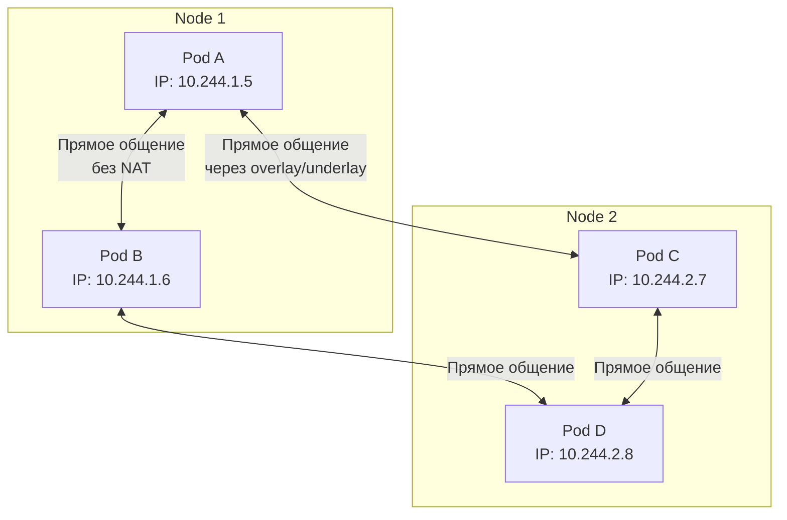

# Сеть в Kubernetes — Обзор сетевой модели

> 📌 Сеть K8s строится на 4 принципах: (1) каждый под — свой IP, (2) все поды общаются напрямую без NAT, (3) `Service` даёт стабильный IP/имя группе подов, (4) `NetworkPolicy` управляет трафиком. Сам K8s реализует только API — остальное делают **CNI-плагины** (Calico, Cilium) и **kube-proxy**.

---

## 🔹 4 фундаментальных правила сетевой модели K8s

| # | Правило | Что это значит |
|---|---------|----------------|
| 1️⃣ | **Каждый под получает уникальный IP** | IP пода уникален во всём кластере. Не зависит от узла. |
| 2️⃣ | **Все поды могут общаться друг с другом** | Без NAT, без прокси. Под на node-1 напрямую стучится в под на node-2 по его IP. |
| 3️⃣ | **Агенты узла видят все поды на нём** | `kubelet`, системные демоны общаются с подами на своей ноде напрямую. |
| 4️⃣ | **Контейнеры внутри одного пода — на localhost** | Все контейнеры пода делят одно сетевое пространство. Общаются через `127.0.0.1`. |



> 💡 **Ключевая идея**: с точки зрения сети, поды в K8s — это как виртуальные машины или физические хосты. Не нужно думать о пробросе портов или явных связях между контейнерами на разных нодах.

---

## 🔹 Ключевые компоненты сети K8s

| Компонент | Роль | Встроен в K8s? |
|-----------|------|----------------|
| **Pod IP** | Уникальный IP каждого пода в кластере | ✅ Да (назначается CNI) |
| **Service** | Стабильный ClusterIP + DNS-имя для группы подов | ✅ Да |
| **EndpointSlice** | Список реальных IP подов, обслуживающих Service | ✅ Да (автоматически) |
| **kube-proxy** | Проксирует трафик Service → поды (iptables/IPVS) | ✅ Да (по умолчанию) |
| **CoreDNS** | DNS-разрешение имён сервисов внутри кластера | ✅ Да (add-on) |
| **Ingress** | L7-маршрутизация HTTP/HTTPS извне в кластер | ⚠️ API встроен, контроллер — нет |
| **Gateway API** | Современная замена Ingress (L4-L7) | ⚠️ API встроен, контроллер — нет |
| **NetworkPolicy** | Правила firewall между подами | ✅ Да (реализация — CNI) |
| **CNI-плагин** | Реализует сеть подов (overlay, underlay, eBPF) | ❌ Нет (Calico, Cilium, Flannel) |

---

## 🔹 1. Взаимодействие внутри пода (Pod-to-Pod на одной ноде)

Все контейнеры в одном поде **делят сетевое пространство имён**:
- Один IP на весь под
- Один порт — один контейнер (нельзя, чтобы два контейнера слушали порт 8080)
- Общение через `localhost` / `127.0.0.1`

```yaml
apiVersion: v1
kind: Pod
metadata:
  name: multi-container-pod
spec:
  containers:
  - name: app
    image: nginx:1.25
    ports:
    - containerPort: 80
  - name: sidecar
    image: busybox
    command: ["sh", "-c", "while true; do wget -qO- http://localhost:80; sleep 5; done"]
    # ← sidecar обращается к nginx через localhost:80
```

> 💡 **Практика**: sidecar-контейнеры (логгеры, прокси, агенты) часто общаются с main-контейнером через `localhost`.

---

## 🔹 2. Взаимодействие между подами (Pod-to-Pod через кластер)

Поды общаются напрямую по IP, **без NAT и прокси**. CNI-плагин обеспечивает связность между нодами.

```bash
# Из пода на node-1 стучимся в под на node-2
kubectl exec -it pod-on-node-1 -- wget -qO- http://10.244.2.7:8080
# ← прямое обращение по IP пода, без Service
```

### 🎯 Зачем тогда Service?

IP пода **эфемерный** — при пересоздании пода IP меняется. Service даёт:
- **Стабильный ClusterIP** (не меняется)
- **DNS-имя** (`my-service.my-namespace.svc.cluster.local`)
- **Балансировку нагрузки** между подами

---

## 🔹 3. Service — стабильная точка входа

### 📊 Типы Service

| Тип | Доступность | Когда использовать |
|-----|-------------|-------------------|
| **`ClusterIP`** (по умолчанию) | Только внутри кластера | Внутренние сервисы (БД, API) |
| **`NodePort`** | Извне через порт на каждой ноде (30000-32767) | Простой доступ извне, dev/test |
| **`LoadBalancer`** | Внешний балансировщик от облака | Production в облаке |
| **`ExternalName`** | CNAME на внешний DNS | Доступ к внешним сервисам по имени |

### 📝 Пример: ClusterIP Service

```yaml
apiVersion: v1
kind: Service
metadata:
  name: my-app
spec:
  type: ClusterIP          # ← по умолчанию
  selector:
    app: my-app            # ← выбирает поды с лейблом app=my-app
  ports:
  - port: 80               # ← порт Service
    targetPort: 8080       # ← порт в контейнере пода
```

**Как работает**:
```
Клиент в кластере
    ↓
my-app.default.svc.cluster.local:80  (DNS)
    ↓
ClusterIP: 10.96.0.15:80             (стабильный IP Service)
    ↓ kube-proxy (iptables/IPVS)
EndpointSlice: [10.244.1.5:8080, 10.244.2.7:8080, ...]  (реальные IP подов)
    ↓
Конкретный под
```

### 🔗 EndpointSlice — автоматический список бэкендов

Kubernetes автоматически создаёт `EndpointSlice` для каждого Service, отслеживая поды по селектору.

```bash
# Посмотреть EndpointSlice для Service
kubectl get endpointslices -l kubernetes.io/service-name=my-app
# NAME             ADDRESSTYPE   PORTS   ENDPOINTS          AGE
# my-app-abc12     IPv4          8080    10.244.1.5:8080    5m
#                                      + 10.244.2.7:8080
```

> 💡 **EndpointSlice заменил Endpoints** в K8s 1.21+. Решает проблему масштабирования: один `Endpoints` мог содержать тысячи IP, `EndpointSlice` разбивает их на чанки по 100.

---

## 🔹 4. Внешний доступ к сервисам

### 🚪 Ingress (L7, HTTP/HTTPS)

```yaml
apiVersion: networking.k8s.io/v1
kind: Ingress
metadata:
  name: my-app
spec:
  rules:
  - host: myapp.example.com
    http:
      paths:
      - path: /
        pathType: Prefix
        backend:
          service:
            name: my-app
            port:
              number: 80
```

**Требует**: Ingress Controller (nginx-ingress, Traefik, HAProxy).

### 🌐 Gateway API (современная замена Ingress)

```yaml
apiVersion: gateway.networking.k8s.io/v1
kind: HTTPRoute
metadata:
  name: my-app
spec:
  parentRefs:
  - name: my-gateway
  hostnames: ["myapp.example.com"]
  rules:
  - matches:
    - path:
        type: PathPrefix
        value: /
    backendRefs:
    - name: my-app
      port: 80
```

**Требует**: Gateway Controller (nginx-gateway-fabric, Envoy Gateway, Istio).

### ⚖️ Service type: LoadBalancer

```yaml
apiVersion: v1
kind: Service
metadata:
  name: my-app
spec:
  type: LoadBalancer       # ← облако создаст внешний LB
  selector:
    app: my-app
  ports:
  - port: 80
    targetPort: 8080
```

**Требует**: Облачный провайдер (AWS, GCP, Azure, Yandex Cloud) или MetalLB для on-premise.

---

## 🔹 5. NetworkPolicy — firewall для подов

Позволяет управлять трафиком на уровне подов (по лейблам, namespace, IP).

### 📝 Пример: разрешить трафик только от определённых подов

```yaml
apiVersion: networking.k8s.io/v1
kind: NetworkPolicy
metadata:
  name: allow-frontend-only
  namespace: default
spec:
  podSelector:
    matchLabels:
      app: backend         # ← политика применяется к подам backend
  policyTypes:
  - Ingress
  ingress:
  - from:
    - podSelector:
        matchLabels:
          app: frontend    # ← разрешить только от подов frontend
    ports:
    - port: 8080
```

**Требует**: CNI-плагин с поддержкой NetworkPolicy (Calico, Cilium). **Flannel не поддерживает!**

---

## 🔹 6. Роль внешних компонентов

K8s реализует **только API**. Реальная работа сети — на внешних компонентах:

| Задача | Кто реализует |
|--------|---------------|
| **Назначение IP подам** | CNI-плагин (Calico, Cilium, Flannel) |
| **Связность между нодами** | CNI-плагин (overlay: VXLAN, Geneve; или underlay: BGP, eBPF) |
| **Проксирование Service → Pod** | `kube-proxy` (iptables/IPVS) **ИЛИ** CNI-плагин (Cilium в eBPF-режиме) |
| **NetworkPolicy** | CNI-плагин (Calico, Cilium). Без него — API работает, но правил нет |
| **DNS внутри кластера** | CoreDNS (add-on) |
| **Внешний L7-трафик** | Ingress Controller / Gateway Controller |
| **Внешний L4-трафик** | Cloud LoadBalancer / MetalLB |

### 🎯 Популярные CNI-плагины

| Плагин | Особенности | Когда выбирать |
|--------|-------------|----------------|
| **Calico** | BGP, NetworkPolicy, eBPF (опционально) | Production, on-premise, нужна сетевая политика |
| **Cilium** | eBPF-native, Observability, Service Mesh | Modern stacks, нужна глубокая наблюдаемость |
| **Flannel** | Простой overlay (VXLAN) | Dev/test, минимализм, **нет NetworkPolicy** |
| **Weave Net** | Простая установка, encryption | Быстрый старт, простое шифрование |
| **Antrea** | От VMware, OVS-based | vSphere, enterprise |

---

## 🔹 Схема: как трафик идёт от клиента к поду

```
Внешний клиент
    ↓
[Cloud LoadBalancer / MetalLB]
    ↓
[Ingress Controller / Gateway]  ← L7 маршрутизация (host, path)
    ↓
[Service ClusterIP]             ← стабильный IP + DNS
    ↓
[kube-proxy / CNI-proxy]        ← iptables/IPVS/eBPF правила
    ↓
[EndpointSlice]                 ← список IP подов
    ↓
[Выбранный под]                 ← реально обрабатывает запрос
```

---

## 🔹 Сравнение с «традиционными» контейнерными системами

| Аспект | Старые системы (Docker Compose, Swarm) | Kubernetes |
|--------|----------------------------------------|------------|
| **Связь между контейнерами на разных хостах** | Нужно явно настраивать (links, overlay networks) | Автоматическая, все поды видят друг друга |
| **Проброс портов** | Нужно явно мапить host:container | Не нужно, у каждого пода свой IP |
| **Обнаружение сервисов** | Вручную или через DNS-консул | Встроено: DNS + Service |
| **Балансировка нагрузки** | Отдельный инструмент (HAProxy, nginx) | Встроено: Service + kube-proxy |
| **Миграция подов** | Нужно обновлять конфиги | Автоматически: IP пода меняется, Service остаётся |

---

## 🔹 Чек-лист: понимание сети K8s

```bash
# ✅ 1. Проверить, что поды имеют уникальные IP
kubectl get pods -o wide
# NAME     READY   STATUS    IP            NODE
# pod-1    1/1     Running   10.244.1.5    node-1
# pod-2    1/1     Running   10.244.2.7    node-2

# ✅ 2. Проверить связность между подами
kubectl exec pod-1 -- ping 10.244.2.7
# PING 10.244.2.7: 56 data bytes, 3 replies

# ✅ 3. Проверить, что Service имеет ClusterIP
kubectl get svc my-app
# NAME     TYPE        CLUSTER-IP   EXTERNAL-IP   PORT(S)   AGE
# my-app   ClusterIP   10.96.0.15   <none>        80/TCP    5m

# ✅ 4. Проверить EndpointSlice
kubectl get endpointslices -l kubernetes.io/service-name=my-app

# ✅ 5. Проверить DNS-разрешение из пода
kubectl exec pod-1 -- nslookup my-app.default.svc.cluster.local

# ✅ 6. Проверить, какой CNI установлен
kubectl get pods -n kube-system | grep -E 'calico|cilium|flannel|weave'

# ✅ 7. Проверить, что kube-proxy работает
kubectl get pods -n kube-system | grep kube-proxy

# ✅ 8. Проверить NetworkPolicy (если используются)
kubectl get networkpolicies
```

> 💡 **Совет для конспекта**:
> 1. Нарисуй свою схему сети кластера: какие IP-диапазоны используются для подов, сервисов, нод.
> 2. Добавь блок «Какой CNI у нас стоит»: название, режим (overlay/BGP/eBPF), поддерживает ли NetworkPolicy.
> 3. Веди список «Внешние сервисы»: какие Ingress Controller'ы, LoadBalancer'ы используются.

---

## 🔹 Ключевые выводы

1. **Сетевая модель K8s** — «плоская»: каждый под имеет уникальный IP, все поды могут общаться напрямую.
2. **Внутри пода** — контейнеры на `localhost`, делят один IP и порты.
3. **Service** даёт стабильный ClusterIP + DNS для группы подов. `EndpointSlice` хранит реальные IP подов.
4. **kube-proxy** (или CNI-прокси) реализует балансировку трафика Service → поды.
5. **Внешний доступ**: `NodePort` (просто), `LoadBalancer` (облако), `Ingress`/`Gateway API` (L7, HTTP).
6. **NetworkPolicy** — firewall для подов. Работает только с CNI, который это поддерживает.
7. **K8s даёт API, реализацию — внешние компоненты**: CNI для сети подов, CoreDNS для DNS, Ingress/Gateway контроллеры для внешнего трафика.