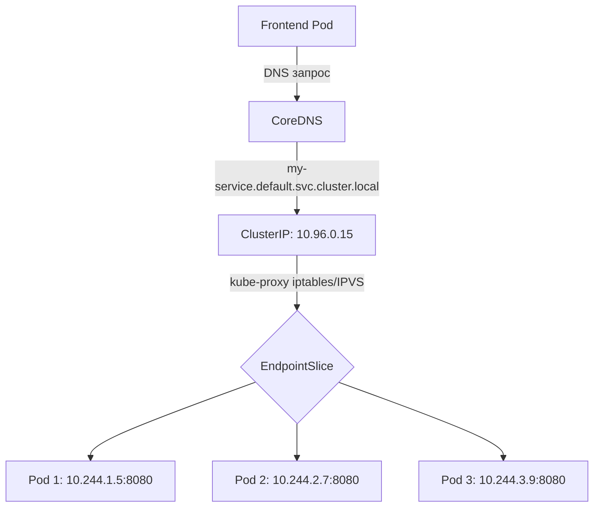

# Service — Сетевая абстракция для доступа к подам

> 📌 `Service` — это стабильная точка входа (IP + DNS) для группы подов. Поды эфемерны (IP меняется при пересоздании), Service — нет. 
> **4 основных типа**: 
> `ClusterIP` (внутри кластера), 
> `NodePort` (порт на ноде), 
> `LoadBalancer` (внешний LB), 
> `ExternalName` (CNAME на внешний DNS).

---

## 🔹 Зачем нужен Service

### Проблема: поды эфемерны

```
Deployment создаёт/удаляет поды динамически:
- Под упал → создался новый с другим IP
- Rolling update → старые поды удалились, новые создались
- Масштабирование → количество подов меняется

Как фронтенду узнать, к какому IP бэкенда подключаться?
```

### Решение: Service как абстракция

```
Service:
- Даёт стабильный ClusterIP (не меняется)
- Даёт DNS-имя (my-service.my-namespace.svc.cluster.local)
- Автоматически отслеживает поды через селектор
- Балансирует трафик между подами
```



---

## 🔹 4 основных типа Service

| Тип | Доступность | Когда использовать | Пример |
|-----|-------------|-------------------|--------|
| **`ClusterIP`** (по умолчанию) | Только внутри кластера | Внутренние сервисы (БД, API между микросервисами) | PostgreSQL, внутренний API |
| **`NodePort`** | Извне через порт на каждой ноде (30000-32767) | Dev/test, простой доступ без LB | Локальная разработка, on-premise |
| **`LoadBalancer`** | Внешний балансировщик от облака | Production в облаке | Публичные веб-приложения |
| **`ExternalName`** | CNAME на внешний DNS | Доступ к внешним сервисам по имени | Внешняя БД, SaaS-сервисы |

---

## 🔹 1. ClusterIP — внутренний сервис

### 📝 Базовый пример

```yaml
apiVersion: v1
kind: Service
metadata:
  name: my-service
spec:
  type: ClusterIP              # ← по умолчанию, можно не указывать
  selector:
    app.kubernetes.io/name: MyApp   # ← выбирает поды с этим лейблом
  ports:
  - protocol: TCP
    port: 80                   # ← порт Service (ClusterIP)
    targetPort: 9376           # ← порт в контейнере пода
```

**Что произойдёт**:
1. Kubernetes назначит Service ClusterIP из пула `service-cluster-ip-range` (например, `10.96.0.15`)
2. Контроллер Service найдёт все поды с лейблом `app.kubernetes.io/name: MyApp`
3. Создаст `EndpointSlice` со списком IP:port этих подов
4. `kube-proxy` настроит правила iptables/IPVS для балансировки трафика

### 🎯 port vs targetPort

| Поле | Назначение | Пример |
|------|------------|--------|
| **`port`** | Порт Service (ClusterIP), к которому обращаются клиенты | `80` |
| **`targetPort`** | Порт в контейнере пода, куда перенаправляется трафик | `9376` или имя порта `http-web-svc` |

> 💡 **По умолчанию** `targetPort` = `port`, если не указан явно.

### 📝 Пример с именованным портом

```yaml
apiVersion: v1
kind: Service
metadata:
  name: nginx-service
spec:
  selector:
    app: nginx
  ports:
  - name: http
    protocol: TCP
    port: 80
    targetPort: http-web-svc    # ← имя порта в поде (гибкость!)
---
apiVersion: v1
kind: Pod
metadata:
  name: nginx
  labels:
    app: nginx
spec:
  containers:
  - name: nginx
    image: nginx:stable
    ports:
    - containerPort: 80
      name: http-web-svc        # ← имя порта в контейнере
```

> 💡 **Зачем**: можно менять номер порта в поде, не меняя Service. Service ссылается на имя, а не на номер.

---

## 🔹 2. NodePort — доступ через порт на ноде

### 📝 Пример

```yaml
apiVersion: v1
kind: Service
metadata:
  name: my-service
spec:
  type: NodePort
  selector:
    app: MyApp
  ports:
  - port: 80
    targetPort: 80
    nodePort: 30007              # ← опционально, по умолчанию выделяется автоматически
```

**Что произойдёт**:
1. Kubernetes выделит порт из диапазона `--service-node-port-range` (по умолчанию `30000-32767`)
2. Каждая нода кластера начнёт слушать этот порт
3. Трафик на `<NodeIP>:30007` → перенаправляется на Service → на поды

### 🎯 Диапазоны портов NodePort

| Диапазон | Назначение |
|----------|------------|
| **30000-30085** | Статический (для ручного указания `nodePort`) |
| **30086-32767** | Динамический (автоматическое выделение) |

> 💡 **Совет**: указывай `nodePort` вручную только если действительно нужно. Иначе доверь автоматике.

### 🌐 Доступ к NodePort

```bash
# Извне кластера
curl http://<NodeIP>:30007

# Если несколько нод — нужен внешний LB или DNS round-robin
```

---

## 🔹 3. LoadBalancer — внешний балансировщик

### 📝 Пример

```yaml
apiVersion: v1
kind: Service
metadata:
  name: my-service
spec:
  type: LoadBalancer
  selector:
    app: MyApp
  ports:
  - protocol: TCP
    port: 80
    targetPort: 9376
```

**Что произойдёт**:
1. Kubernetes создаст Service типа `NodePort` (внутри)
2. `cloud-controller-manager` запросит у облака создание внешнего LoadBalancer
3. Облако выделит внешний IP и настроит LB
4. IP появится в `.status.loadBalancer.ingress[0].ip`

```bash
# Проверить внешний IP
kubectl get svc my-service
# NAME         TYPE           CLUSTER-IP      EXTERNAL-IP     PORT(S)        AGE
# my-service   LoadBalancer   10.96.0.15      203.0.113.50    80:31234/TCP   2m
```

### ⚙️ Настройки LoadBalancer

```yaml
spec:
  type: LoadBalancer
  loadBalancerClass: "example.com/internal-vip"    # ← класс реализации LB (v1.24+)
  allocateLoadBalancerNodePorts: false              # ← не выделять NodePort (v1.24+)
  # loadBalancerIP: "203.0.113.50"                  # ← УСТАРЕЛО с v1.24, используй аннотации
```

### 🏢 Внутренний LoadBalancer

Для приватного LB (без публичного IP) используй аннотации провайдера:

```yaml
metadata:
  annotations:
    # AWS
    service.beta.kubernetes.io/aws-load-balancer-internal: "true"
    # GCP
    cloud.google.com/load-balancer-type: "Internal"
    # Azure
    service.beta.kubernetes.io/azure-load-balancer-internal: "true"
```

---

## 🔹 4. ExternalName — CNAME на внешний DNS

### 📝 Пример

```yaml
apiVersion: v1
kind: Service
metadata:
  name: my-database
  namespace: prod
spec:
  type: ExternalName
  externalName: my.database.example.com
```

**Что произойдёт**:
- DNS-запрос `my-database.prod.svc.cluster.local` → вернёт CNAME на `my.database.example.com`
- **Нет проксирования**, только DNS-перенаправление

### ⚠️ Ограничения

| Проблема | Описание |
|----------|----------|
| **HTTP/HTTPS** | Клиент отправляет `Host: my-database.prod.svc.cluster.local`, сервер может не распознать |
| **TLS** | Сертификат сервера не совпадает с именем хоста клиента |
| **Решение** | Использовать для TCP-протоколов (БД, SMTP) или настраивать клиент |

---

## 🔹 EndpointSlice — список бэкендов

> **Стабильно с v1.21**. Заменил устаревший `Endpoints`.

### 🎯 Зачем нужен

| Проблема Endpoints | Решение EndpointSlice |
|--------------------|----------------------|
| Один объект на Service → при 1000+ подов слишком большой | Разбивает на чанки по 100 эндпоинтов |
| Нет поддержки dual-stack | Поддерживает IPv4 и IPv6 |
| Нет метаданных для новых фич | Есть `trafficDistribution`, `appProtocol` |

### 📝 Автоматический EndpointSlice

```yaml
# Kubernetes создаёт автоматически для Service с селектором
apiVersion: discovery.k8s.io/v1
kind: EndpointSlice
metadata:
  name: my-service-abc12
  labels:
    kubernetes.io/service-name: my-service
addressType: IPv4
ports:
  - name: http
    port: 8080
    protocol: TCP
endpoints:
  - addresses: ["10.244.1.5"]
    conditions:
      ready: true
  - addresses: ["10.244.2.7"]
    conditions:
      ready: true
```

```bash
# Посмотреть EndpointSlice
kubectl get endpointslices -l kubernetes.io/service-name=my-service
```

---

## 🔹 Service без селектора

> Для случаев, когда бэкенд — не поды в K8s (внешняя БД, другой кластер, миграция).

### 📝 Пример

```yaml
# Service без селектора
apiVersion: v1
kind: Service
metadata:
  name: external-db
spec:
  ports:
  - name: postgres
    protocol: TCP
    port: 5432
    targetPort: 5432
---
# EndpointSlice вручную
apiVersion: discovery.k8s.io/v1
kind: EndpointSlice
metadata:
  name: external-db-1
  labels:
    kubernetes.io/service-name: external-db
addressType: IPv4
ports:
  - name: postgres
    port: 5432
    protocol: TCP
endpoints:
  - addresses: ["10.4.5.6"]      # ← внешний IP БД
  - addresses: ["10.1.2.3"]
```

### 🎯 Когда использовать

| Сценарий | Пример |
|----------|--------|
| **Внешняя БД** | Production — внешняя БД, dev — внутренняя |
| **Другой namespace/кластер** | Сервис в другом кластере |
| **Миграция** | Часть бэкендов ещё не в K8s |

---

## 🔹 Headless Service (clusterIP: None)

> Когда не нужна балансировка — клиент сам выбирает, к какому поду подключаться.

### 📝 Пример

```yaml
apiVersion: v1
kind: Service
metadata:
  name: headless-svc
spec:
  clusterIP: None              # ← ключевое поле
  selector:
    app: my-app
  ports:
  - port: 8080
```

**Что произойдёт**:
- **Не выделяется** ClusterIP
- **Не работает** kube-proxy (нет балансировки)
- DNS возвращает **все IP подов** (A/AAAA записи)

```bash
# DNS-запрос
nslookup headless-svc.default.svc.cluster.local
# Name: headless-svc.default.svc.cluster.local
# Address: 10.244.1.5
# Address: 10.244.2.7
# Address: 10.244.3.9
```

### 🎯 Когда использовать

| Сценарий | Пример |
|----------|--------|
| **StatefulSet** | БД (PostgreSQL, Cassandra) — каждый под имеет стабильное DNS-имя |
| **Service Discovery** | Клиент сам реализует discovery (gRPC, Consul) |
| **Direct pod access** | Нужно подключаться к конкретному поду |

---

## 🔹 Обнаружение сервисов

### 1️⃣ Переменные окружения (устаревший подход)

```bash
# Kubelet добавляет переменные при создании пода
REDIS_PRIMARY_SERVICE_HOST=10.0.0.11
REDIS_PRIMARY_SERVICE_PORT=6379
REDIS_PRIMARY_PORT=tcp://10.0.0.11:6379
```

**⚠️ Ограничение**: Service должен быть создан **ДО** пода, иначе переменные не заполнятся.

### 2️⃣ DNS (рекомендуемый подход)

```bash
# Внутри пода
nslookup my-service.my-namespace.svc.cluster.local
# Address: 10.96.0.15

# Короткое имя (в том же namespace)
nslookup my-service
# Address: 10.96.0.15
```

**Формат DNS**:
```
<service-name>.<namespace>.svc.cluster.local

Примеры:
- my-service.default.svc.cluster.local
- redis-primary.kube-system.svc.cluster.local
```

**SRV-записи** (для именованных портов):
```bash
# Если порт называется "http" и протокол TCP
dig SRV _http._tcp.my-service.my-namespace.svc.cluster.local
```

---

## 🔹 Многопортовые сервисы

```yaml
apiVersion: v1
kind: Service
metadata:
  name: my-service
spec:
  selector:
    app: MyApp
  ports:
  - name: http               # ← обязательно имя для многопортовых
    protocol: TCP
    port: 80
    targetPort: 8080
  - name: https
    protocol: TCP
    port: 443
    targetPort: 8443
  - name: metrics
    protocol: TCP
    port: 9090
    targetPort: 9090
```

> ⚠️ **Важно**: если портов > 1 — **все порты должны иметь имена**.

---

## 🔹 Traffic Policy — управление трафиком

### 🎯 internalTrafficPolicy / externalTrafficPolicy

| Значение | Поведение |
|----------|-----------|
| **`Cluster`** (по умолчанию) | Трафик балансируется по всем подам в кластере (может быть cross-node) |
| **`Local`** | Трафик идёт только к подам на **той же ноде**, где принят (сохраняет source IP) |

### 📝 Пример

```yaml
apiVersion: v1
kind: Service
metadata:
  name: my-service
spec:
  type: LoadBalancer
  externalTrafficPolicy: Local    # ← сохранить source IP для внешнего трафика
  internalTrafficPolicy: Cluster  # ← балансировать внутренний трафик по всему кластеру
  selector:
    app: my-app
  ports:
  - port: 80
```

**Когда использовать `Local`**:
- Нужен **source IP** клиента (для логирования, firewall)
- Избежать дополнительного hop между нодами
- ⚠️ Но: если на ноде нет готовых подов — трафик не будет балансироваться

---

## 🔹 Traffic Distribution — предпочтения маршрутизации

> **Alpha в v1.36**. Позволяет выразить предпочтения (не строгие правила).

```yaml
apiVersion: v1
kind: Service
metadata:
  name: my-service
spec:
  trafficDistribution: PreferSameZone    # ← предпочитать поды в той же зоне
  selector:
    app: my-app
  ports:
  - port: 80
```

| Значение | Описание |
|----------|----------|
| **`PreferSameZone`** | Предпочитать поды в той же зоне доступности (AZ) |
| **`PreferSameNode`** | Предпочитать поды на той же ноде |
| ~~`PreferClose`~~ | Устарело, используй `PreferSameZone` |

> 💡 **Зачем**: оптимизация стоимости (межзоновый трафик дороже), снижение задержки.

---

## 🔹 Session Affinity (sticky sessions)

> Чтобы клиент всегда попадал на один и тот же под.

```yaml
apiVersion: v1
kind: Service
metadata:
  name: my-service
spec:
  sessionAffinity: ClientIP    # ← по IP клиента
  sessionAffinityConfig:
    clientIP:
      timeoutSeconds: 10800    # ← 3 часа (по умолчанию 10800, макс 86400)
  selector:
    app: my-app
  ports:
  - port: 80
```

**Когда использовать**:
- Stateful-приложения без внешнего session store
- WebSocket-соединения
- ⚠️ Но: лучше использовать внешнее хранилище сессий (Redis) и избегать sticky sessions

---

## 🔹 appProtocol — подсказка для протокола

```yaml
apiVersion: v1
kind: Service
metadata:
  name: my-service
spec:
  selector:
    app: my-app
  ports:
  - name: http
    port: 80
    appProtocol: http                    # ← стандартный IANA
  - name: ws
    port: 8080
    appProtocol: kubernetes.io/ws        # ← WebSocket
  - name: custom
    port: 9090
    appProtocol: mycompany.com/grpc      # ← кастомный
```

**Стандартные значения**:
- `http`, `https`, `tcp`, `udp`
- `kubernetes.io/h2c` (HTTP/2 cleartext)
- `kubernetes.io/ws` (WebSocket)
- `kubernetes.io/wss` (WebSocket over TLS)

---

## 🔹 Практика: работа с Service

### 🚀 Создание и проверка

```bash
# Создать Service
kubectl apply -f service.yaml

# Проверить статус
kubectl get svc
# NAME         TYPE        CLUSTER-IP   EXTERNAL-IP   PORT(S)   AGE
# my-service   ClusterIP   10.96.0.15   <none>        80/TCP    1m

# Детальная информация
kubectl describe svc my-service

# Посмотреть EndpointSlice
kubectl get endpointslices -l kubernetes.io/service-name=my-service

# Проверить DNS из пода
kubectl exec -it my-pod -- nslookup my-service.default.svc.cluster.local

# Проверить доступность из пода
kubectl exec -it my-pod -- curl http://my-service:80
```

### 🔍 Отладка

```bash
# Service не имеет эндпоинтов?
kubectl get endpointslices -l kubernetes.io/service-name=my-service
# Если пусто — проверь селектор!

kubectl get pods --show-labels | grep <selector-key>
# Поды должны иметь лейблы, соответствующие селектору Service

# Проверить, что kube-proxy работает
kubectl get pods -n kube-system | grep kube-proxy

# Посмотреть правила iptables (на ноде)
iptables-save | grep <ClusterIP>

# Проверить DNS-разрешение
kubectl exec -it my-pod -- nslookup my-service
kubectl exec -it my-pod -- dig my-service.default.svc.cluster.local

# Проверить, что порт открыт в поде
kubectl exec -it my-pod -- netstat -tlnp | grep <port>
```

### 🧪 Тестирование разных типов

```bash
# ClusterIP — только изнутри кластера
kubectl run test --rm -it --image=busybox -- wget -qO- http://my-service:80

# NodePort — извне через IP ноды
curl http://<NodeIP>:<NodePort>

# LoadBalancer — через внешний IP
curl http://<ExternalIP>:80

# ExternalName — DNS-перенаправление
kubectl exec -it my-pod -- nslookup external-service.default.svc.cluster.local
```

---

## 🔹 Чек-лист: создание Service

```bash
# ✅ 1. Определить тип Service
#    - ClusterIP: внутренний сервис
#    - NodePort: простой доступ извне (dev/test)
#    - LoadBalancer: production в облаке
#    - ExternalName: CNAME на внешний DNS

# ✅ 2. Указать селектор (должен совпадать с лейблами подов!)
kubectl get pods --show-labels

# ✅ 3. Настроить порты
#    - port: порт Service
#    - targetPort: порт в контейнере (или имя порта)
#    - nodePort: опционально для NodePort (30000-32767)

# ✅ 4. Для многопортовых сервисов: указать имена для всех портов

# ✅ 5. Проверить dry-run
kubectl apply -f service.yaml --dry-run=server -o yaml

# ✅ 6. Применить и проверить
kubectl apply -f service.yaml
kubectl get svc <name>
kubectl get endpointslices -l kubernetes.io/service-name=<name>

# ✅ 7. Протестировать доступ
kubectl exec -it <pod> -- curl http://<service-name>:<port>

# ✅ 8. Для LoadBalancer: проверить внешний IP
kubectl get svc <name> -o jsonpath='{.status.loadBalancer.ingress[0].ip}'
```

> 💡 **Совет для конспекта**:
> 1. Создай файл `00_service_cheatsheet.md` с шпаргалкой по типам Service и примерами YAML.
> 2. Добавь блок «Частые ошибки»: например, «селектор не совпадает с лейблами подов», «забыл имя порта для многопортового сервиса», «использовал ExternalName для HTTP».
> 3. Веди список «Какие Service у нас в кластере»: имя, тип, порт, внешние IP (если есть).

---

## 🔹 Ключевые выводы

1. **Service** — стабильная точка входа (IP + DNS) для группы подов. Поды эфемерны, Service — нет.
2. **4 типа**: `ClusterIP` (внутри), `NodePort` (порт на ноде), `LoadBalancer` (внешний LB), `ExternalName` (CNAME).
3. **EndpointSlice** (v1.21+) заменил `Endpoints` — лучше масштабируется, поддерживает dual-stack.
4. **Service без селектора** — для внешних бэкендов (БД, другие кластеры).
5. **Headless Service** (`clusterIP: None`) — для StatefulSet, когда нужна прямая связь с подами.
6. **Обнаружение**: DNS (рекомендуется) или переменные окружения (устарело).
7. **Traffic Policy**: `Cluster` (балансировка по кластеру) vs `Local` (только на своей ноде, сохраняет source IP).
8. **Session Affinity**: sticky sessions по IP клиента (но лучше использовать внешнее хранилище сессий).