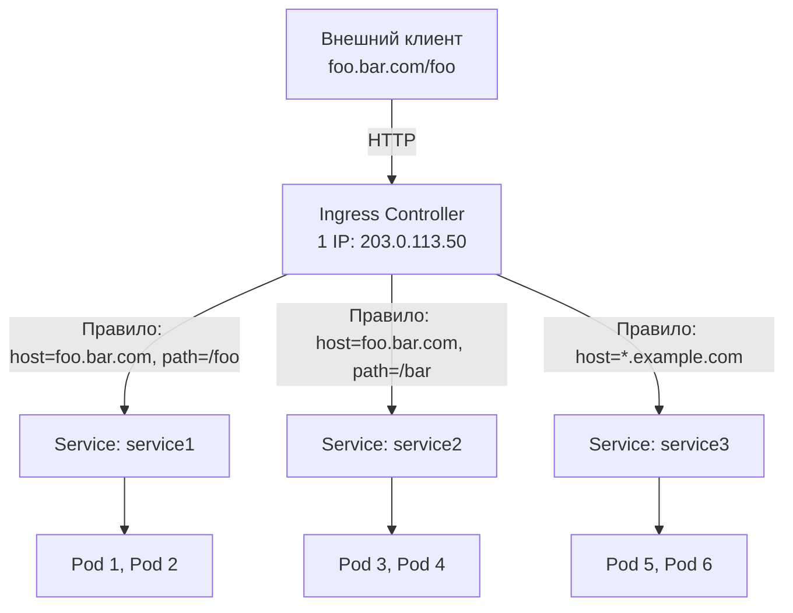

# Ingress — L7-маршрутизация HTTP/HTTPS

> 📌 `Ingress` — декларативная конфигурация L7-маршрутизации (HTTP/HTTPS) для внешних запросов. Работает по правилам: host + path → backend Service. **Требует Ingress Controller** (nginx, Traefik, HAProxy). **Статус**: stable с v1.19, но разработка приостановлена — рекомендуется **Gateway API** (современная замена).

---

## 🔹 Что такое Ingress

| Аспект | Описание |
|--------|----------|
| **Назначение** | L7-маршрутизация HTTP/HTTPS трафика извне в кластер |
| **Уровень OSI** | L7 (Application) — понимает HTTP-концепции: host, path, headers |
| **Статус** | ✅ Stable с v1.19, но **разработка приостановлена** |
| **Рекомендация** | Использовать **Gateway API** для новых проектов |
| **Требование** | Ingress Controller (nginx-ingress, Traefik, HAProxy и др.) |

### 🆚 Ingress vs Service

| Характеристика | Service (LoadBalancer) | Ingress |
|----------------|------------------------|---------|
| **Уровень** | L4 (TCP/UDP) | L7 (HTTP/HTTPS) |
| **Маршрутизация** | По порту | По host, path, headers |
| **TLS-терминация** | Нет (нужен LB) | ✅ Да |
| **Виртуальный хостинг** | Нет (1 IP = 1 сервис) | ✅ Да (1 IP = много сервисов) |
| **Стоимость** | 1 LB на сервис | 1 LB на много сервисов |



---

## 🔹 Базовая структура Ingress

```yaml
apiVersion: networking.k8s.io/v1
kind: Ingress
metadata:
  name: my-ingress
  annotations:
    nginx.ingress.kubernetes.io/rewrite-target: /    # ← аннотации специфичны для контроллера
spec:
  ingressClassName: nginx              # ← какой IngressClass использовать
  rules:
  - host: foo.bar.com                  # ← опционально, если не указан — применяется ко всем host
    http:
      paths:
      - path: /foo                     # ← путь
        pathType: Prefix               # ← тип匹配: Prefix, Exact, ImplementationSpecific
        backend:
          service:
            name: service1             # ← имя Service
            port:
              number: 80               # ← порт Service
  - host: bar.baz.com
    http:
      paths:
      - path: /bar
        pathType: Prefix
        backend:
          service:
            name: service2
            port:
              number: 8080
```

### 🎯 Ключевые поля

| Поле | Назначение | Пример |
|------|------------|--------|
| **`ingressClassName`** | Ссылка на IngressClass (какой контроллер обрабатывает) | `nginx`, `traefik` |
| **`rules[].host`** | HTTP Host header (опционально) | `foo.bar.com`, `*.example.com` |
| **`rules[].http.paths[].path`** | URL-путь | `/foo`, `/api/v1` |
| **`rules[].http.paths[].pathType`** | Тип matching | `Prefix`, `Exact`, `ImplementationSpecific` |
| **`rules[].http.paths[].backend.service`** | Backend Service | `name: service1, port: 80` |
| **`defaultBackend`** | Бэкенд по умолчанию (если ничего не совпало) | `service: name: default-backend` |

---

## 🔹 Типы путей (pathType)

| Тип | Поведение | Примеры |
|-----|-----------|---------|
| **`Exact`** | Точное совпадение (case-sensitive) | `/foo` matches `/foo`, но НЕ `/foo/` или `/foobar` |
| **`Prefix`** | Совпадение по префиксу (разделение по `/`) | `/foo` matches `/foo`, `/foo/`, `/foo/bar`, но НЕ `/foobar` |
| **`ImplementationSpecific`** | Зависит от контроллера | Может работать как `Prefix` или `Exact` |

### 📊 Примеры matching

| Path | PathType | Request | Match? |
|------|----------|---------|--------|
| `/foo` | Exact | `/foo` | ✅ Да |
| `/foo` | Exact | `/foo/` | ❌ Нет |
| `/foo` | Exact | `/foobar` | ❌ Нет |
| `/foo` | Prefix | `/foo` | ✅ Да |
| `/foo` | Prefix | `/foo/` | ✅ Да |
| `/foo` | Prefix | `/foo/bar` | ✅ Да |
| `/foo` | Prefix | `/foobar` | ❌ Нет |
| `/` | Prefix | `/anything` | ✅ Да |

### 🎯 Приоритет matching

Если несколько путей подходят:
1. **Наиболее длинный путь** имеет приоритет
2. Если длина одинакова — **Exact** > **Prefix**
3. Если всё равно — первое правило в списке

---

## 🔹 IngressClass — какой контроллер обрабатывает

> Позволяет использовать несколько Ingress Controllers в одном кластере.

### 📝 Создание IngressClass

```yaml
apiVersion: networking.k8s.io/v1
kind: IngressClass
metadata:
  name: nginx
  annotations:
    ingressclass.kubernetes.io/is-default-class: "true"    # ← сделать default
spec:
  controller: k8s.io/ingress-nginx              # ← какой контроллер
  parameters:                                   # ← опционально: кастомные параметры
    apiGroup: k8s.example.com
    kind: IngressParameters
    name: external-lb
```

### 📝 Использование в Ingress

```yaml
apiVersion: networking.k8s.io/v1
kind: Ingress
metadata:
  name: my-ingress
spec:
  ingressClassName: nginx    # ← ссылка на IngressClass
  rules:
  - http:
      paths:
      - path: /
        pathType: Prefix
        backend:
          service:
            name: my-service
            port:
              number: 80
```

### 🎯 Default IngressClass

```yaml
# Сделать IngressClass дефолтным
metadata:
  annotations:
    ingressclass.kubernetes.io/is-default-class: "true"
```

> ⚠️ **Важно**: может быть только **один** default IngressClass в кластере. Иначе Ingress без `ingressClassName` не создадутся.

---

## 🔹 TLS-терминация

> Ingress может.terminateровать TLS, передавая трафик к backend в открытом виде.

### 📝 Пример

```yaml
apiVersion: v1
kind: Secret
metadata:
  name: tls-secret
type: kubernetes.io/tls
data:
  tls.crt: <base64-encoded-cert>
  tls.key: <base64-encoded-key>
---
apiVersion: networking.k8s.io/v1
kind: Ingress
metadata:
  name: tls-ingress
spec:
  tls:
  - hosts:
    - foo.bar.com              # ← хосты, для которых действует сертификат
    secretName: tls-secret     # ← Secret с сертификатом
  rules:
  - host: foo.bar.com
    http:
      paths:
      - path: /
        pathType: Prefix
        backend:
          service:
            name: my-service
            port:
              number: 80
```

### ⚙️ Как работает

```
Клиент (HTTPS)
    ↓ TLS handshake (SNI)
Ingress Controller
    ↓ TLS termination (расшифровка)
Backend Service (HTTP, без TLS)
    ↓
Pod
```

### 🎯 Особенности

- **SNI**: несколько хостов с разными сертификатами на одном IP
- **Требование**: `hosts` в `tls` должны совпадать с `host` в `rules`
- **Wildcard**: нельзя использовать wildcard в `tls.hosts` (нужен сертификат для всех поддоменов)

---

## 🔹 Wildcard хосты

```yaml
spec:
  rules:
  - host: "*.foo.com"          # ← wildcard
    http:
      paths:
      - path: /
        pathType: Prefix
        backend:
          service:
            name: wildcard-service
            port:
              number: 80
```

### 📊 Matching

| Host | Request Host | Match? |
|------|--------------|--------|
| `*.foo.com` | `bar.foo.com` | ✅ Да |
| `*.foo.com` | `baz.bar.foo.com` | ❌ Нет (wildcard покрывает только одну DNS-метку) |
| `*.foo.com` | `foo.com` | ❌ Нет |

---

## 🔹 Паттерны использования

### 1️⃣ Single Service (один backend)

```yaml
spec:
  defaultBackend:
    service:
      name: my-service
      port:
        number: 80
  # Нет rules — весь трафик идёт в один backend
```

### 2️⃣ Fanout (один IP, много сервисов по path)

```yaml
spec:
  rules:
  - host: foo.bar.com
    http:
      paths:
      - path: /foo
        pathType: Prefix
        backend:
          service:
            name: service1
            port:
              number: 4200
      - path: /bar
        pathType: Prefix
        backend:
          service:
            name: service2
            port:
              number: 8080
```

**Экономия**: 1 LoadBalancer вместо 2.

### 3️⃣ Name-based virtual hosting (один IP, много хостов)

```yaml
spec:
  rules:
  - host: foo.bar.com
    http:
      paths:
      - path: /
        pathType: Prefix
        backend:
          service:
            name: service1
            port:
              number: 80
  - host: bar.baz.com
    http:
      paths:
      - path: /
        pathType: Prefix
        backend:
          service:
            name: service2
            port:
              number: 80
```

**Экономия**: 1 LoadBalancer вместо 2.

### 4️⃣ Комбинация (хосты + пути)

```yaml
spec:
  rules:
  - host: app.example.com
    http:
      paths:
      - path: /api
        pathType: Prefix
        backend:
          service:
            name: api-service
            port:
              number: 8080
      - path: /
        pathType: Prefix
        backend:
          service:
            name: frontend-service
            port:
              number: 80
  - host: admin.example.com
    http:
      paths:
      - path: /
        pathType: Prefix
        backend:
          service:
            name: admin-service
            port:
              number: 80
```

---

## 🔹 Resource backend (нестандартный backend)

> Можно указать не Service, а другой ресурс K8s (например, Object Storage).

```yaml
spec:
  defaultBackend:
    resource:
      apiGroup: k8s.example.com
      kind: StorageBucket
      name: static-assets
  rules:
  - http:
      paths:
      - path: /icons
        pathType: ImplementationSpecific
        backend:
          resource:
            apiGroup: k8s.example.com
            kind: StorageBucket
            name: icon-assets
```

**Когда использовать**: статические файлы из S3/GCS, внешние хранилища.

---

## 🔹 Популярные Ingress Controllers

| Контроллер | Особенности | Когда выбирать |
|------------|-------------|----------------|
| **NGINX Ingress** | Самый популярный, богатая функциональность, аннотации | Production, нужна гибкость |
| **Traefik** | Простая настройка, автоматический Let's Encrypt | Быстрый старт, автоматизация TLS |
| **HAProxy Ingress** | Высокая производительность, enterprise-фичи | High-load, enterprise |
| **Kong** | API Gateway, плагины, rate limiting | API management |
| **Contour** | От VMware, Envoy-based | Envoy ecosystem |
| **AWS ALB Ingress** | Интеграция с AWS ALB | AWS EKS |

### 📝 Установка NGINX Ingress Controller

```bash
# Helm
helm repo add ingress-nginx https://kubernetes.github.io/ingress-nginx
helm install nginx-ingress ingress-nginx/ingress-nginx \
  --set controller.publishService.enabled=true

# Проверить
kubectl get pods -n default -l app.kubernetes.io/name=ingress-nginx
kubectl get svc nginx-ingress-ingress-nginx-controller
# NAME                               TYPE           CLUSTER-IP      EXTERNAL-IP     PORT(S)
# nginx-ingress-ingress-nginx-controller   LoadBalancer   10.96.0.15      203.0.113.50    80:31234/TCP,443:31235/TCP
```

---

## 🔹 Аннотации (специфичны для контроллера)

> Каждый контроллер поддерживает свои аннотации для тонкой настройки.

### 📝 Примеры для NGINX Ingress

```yaml
metadata:
  annotations:
    # Rewrite URL
    nginx.ingress.kubernetes.io/rewrite-target: /$2
    
    # Rate limiting
    nginx.ingress.kubernetes.io/limit-rps: "10"
    
    # CORS
    nginx.ingress.kubernetes.io/enable-cors: "true"
    nginx.ingress.kubernetes.io/cors-allow-origin: "*"
    
    # SSL redirect
    nginx.ingress.kubernetes.io/ssl-redirect: "true"
    
    # Backend protocol
    nginx.ingress.kubernetes.io/backend-protocol: "HTTPS"
    
    # Affinity (sticky sessions)
    nginx.ingress.kubernetes.io/affinity: "cookie"
    nginx.ingress.kubernetes.io/session-cookie-name: "route"
```

> ⚠️ **Важно**: аннотации **не стандартизированы**. При смене контроллера нужно переписывать аннотации.

---

## 🔹 Практика: создание Ingress

### 🚀 Пошаговая настройка

```bash
# 1. Установить Ingress Controller (пример: NGINX)
helm install nginx-ingress ingress-nginx/ingress-nginx

# 2. Подождать, пока LoadBalancer получит внешний IP
kubectl get svc nginx-ingress-ingress-nginx-controller -w
# NAME                               TYPE           EXTERNAL-IP
# nginx-ingress-ingress-nginx-controller   LoadBalancer   203.0.113.50

# 3. Создать Service (если ещё нет)
kubectl apply -f service.yaml

# 4. Создать Ingress
kubectl apply -f - <<EOF
apiVersion: networking.k8s.io/v1
kind: Ingress
metadata:
  name: my-ingress
spec:
  ingressClassName: nginx
  rules:
  - host: myapp.example.com
    http:
      paths:
      - path: /
        pathType: Prefix
        backend:
          service:
            name: my-service
            port:
              number: 80
EOF

# 5. Проверить статус
kubectl get ingress
# NAME         CLASS   HOSTS                ADDRESS         PORTS   AGE
# my-ingress   nginx   myapp.example.com    203.0.113.50    80      1m

# 6. Детальная информация
kubectl describe ingress my-ingress

# 7. Протестировать
curl -H "Host: myapp.example.com" http://203.0.113.50
# Или настроить DNS: myapp.example.com → 203.0.113.50
```

### 🔍 Отладка

```bash
# Ingress не получил ADDRESS?
kubectl describe ingress my-ingress | grep -A10 'Events:'
# Проверить, что Ingress Controller запущен
kubectl get pods -n ingress-nginx

# Backend не работает?
kubectl get endpointslices -l kubernetes.io/service-name=my-service
# Проверить, что поды готовы

# TLS не работает?
kubectl get secret tls-secret -o yaml
# Проверить, что tls.crt и tls.key корректны

# Проверить логи Ingress Controller
kubectl logs -n ingress-nginx deployment/nginx-ingress-ingress-nginx-controller

# Проверить конфигурацию NGINX (для NGINX Ingress)
kubectl exec -n ingress-nginx -it deployment/nginx-ingress-ingress-nginx-controller -- cat /etc/nginx/nginx.conf
```

### ⚠️ Частые проблемы

| Проблема | Причина | Решение |
|----------|---------|---------|
| **Ingress не получил IP** | Ingress Controller не запущен | Проверить `kubectl get pods -n ingress-nginx` |
| **503 Service Unavailable** | Backend Service не существует или поды не готовы | Проверить `kubectl get endpointslices` |
| **404 Not Found** | Path не совпадает | Проверить `pathType` и путь в запросе |
| **TLS не работает** | Secret не существует или некорректен | Проверить `kubectl get secret tls-secret` |
| **Host не match** | Host header не совпадает с правилом | Проверить `curl -H "Host: ..."` |
| **Rewrite не работает** | Аннотация не поддерживается контроллером | Проверить документацию контроллера |

---

## 🔹 Ingress vs Gateway API

| Характеристика | Ingress | Gateway API |
|----------------|---------|-------------|
| **Статус** | Stable, но **разработка приостановлена** | GA (v1.0+) — **рекомендуется** |
| **Уровни** | Только L7 (HTTP/HTTPS) | L4-L7 (TCP, UDP, HTTP, gRPC, TLS) |
| **Роли** | Один объект (Ingress) | Разделение: GatewayClass, Gateway, HTTPRoute |
| **Расширяемость** | Аннотации (не стандартизированы) | CRD (стандартизированы) |
| **TLS** | Базовая поддержка | Продвинутая (TLS termination, passthrough) |
| **Мульти-кластер** | Нет | ✅ Да |
| **Expressiveness** | Ограниченная | Богатая (headers, query params, weights) |

### 📝 Пример: Gateway API (для сравнения)

```yaml
# GatewayClass (аналог IngressClass)
apiVersion: gateway.networking.k8s.io/v1
kind: GatewayClass
metadata:
  name: nginx
spec:
  controllerName: k8s.io/ingress-nginx
---
# Gateway (аналог LoadBalancer)
apiVersion: gateway.networking.k8s.io/v1
kind: Gateway
metadata:
  name: my-gateway
spec:
  gatewayClassName: nginx
  listeners:
  - name: http
    port: 80
    protocol: HTTP
---
# HTTPRoute (аналог Ingress rules)
apiVersion: gateway.networking.k8s.io/v1
kind: HTTPRoute
metadata:
  name: my-route
spec:
  parentRefs:
  - name: my-gateway
  hostnames: ["myapp.example.com"]
  rules:
  - matches:
    - path:
        type: PathPrefix
        value: /
    backendRefs:
    - name: my-service
      port: 80
```

> 💡 **Рекомендация**: для новых проектов используй **Gateway API**. Ingress всё ещё поддерживается, но не будет развиваться.

---

## 🔹 Чек-лист: создание Ingress

```bash
# ✅ 1. Установить Ingress Controller
#    - Выбрать контроллер (nginx, traefik, haproxy)
#    - Установить через Helm или манифест
#    - Проверить, что LoadBalancer получил внешний IP

# ✅ 2. Создать IngressClass (если нужно несколько контроллеров)
kubectl apply -f ingressclass.yaml

# ✅ 3. Создать Backend Service
kubectl apply -f service.yaml

# ✅ 4. Создать Ingress
#    - Указать ingressClassName
#    - Настроить rules (host, path, backend)
#    - Добавить TLS (если нужно)

# ✅ 5. Проверить статус
kubectl get ingress
kubectl describe ingress <name>

# ✅ 6. Настроить DNS
#    - Создать A-запись: myapp.example.com → <EXTERNAL-IP>
#    - Или использовать /etc/hosts для тестирования

# ✅ 7. Протестировать
curl -H "Host: myapp.example.com" http://<EXTERNAL-IP>

# ✅ 8. Для TLS: создать Secret с сертификатом
kubectl create secret tls tls-secret --cert=tls.crt --key=tls.key

# ✅ 9. Добавить TLS в Ingress
#    - Указать tls.hosts и tls.secretName

# ✅ 10. Мониторинг
#    - Логи Ingress Controller
#    - Метрики: requests, latency, errors
#    - Алерт на 5xx ошибки
```

> 💡 **Совет для конспекта**:
> 1. Создай файл `00_ingress_cheatsheet.md` с шпаргалкой по аннотациям твоего контроллера.
> 2. Добавь блок «Частые ошибки»: например, «забыл `ingressClassName`», «путь не совпадает с `pathType`», «TLS Secret не существует».
> 3. Веди список «Какие Ingress у нас в кластере»: имя, host, path, backend, TLS.

---

## 🔹 Ключевые выводы

1. **Ingress** — L7-маршрутизация HTTP/HTTPS по правилам host + path → backend Service.
2. **Требует Ingress Controller** (nginx, Traefik, HAProxy). Без него Ingress не работает.
3. **Статус**: stable с v1.19, но **разработка приостановлена**. Рекомендуется **Gateway API** для новых проектов.
4. **Типы путей**: `Exact` (точное совпадение), `Prefix` (по префиксу), `ImplementationSpecific` (зависит от контроллера).
5. **IngressClass** — способ указать, какой контроллер обрабатывает Ingress. Может быть default.
6. **TLS-терминация**: Ingress.terminateрует TLS, передаёт трафик к backend в открытом виде.
7. **Паттерны**: single service, fanout (один IP, много paths), name-based virtual hosting (один IP, много хостов).
8. **Аннотации**: специфичны для контроллера, не стандартизированы. При смене контроллера нужно переписывать.
9. **Wildcard хосты**: `*.foo.com` покрывает только одну DNS-метку (не `baz.bar.foo.com`).
10. **Gateway API** — современная замена Ingress с richer функциональностью и стандартизированным API.