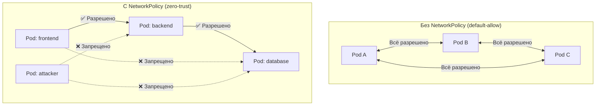
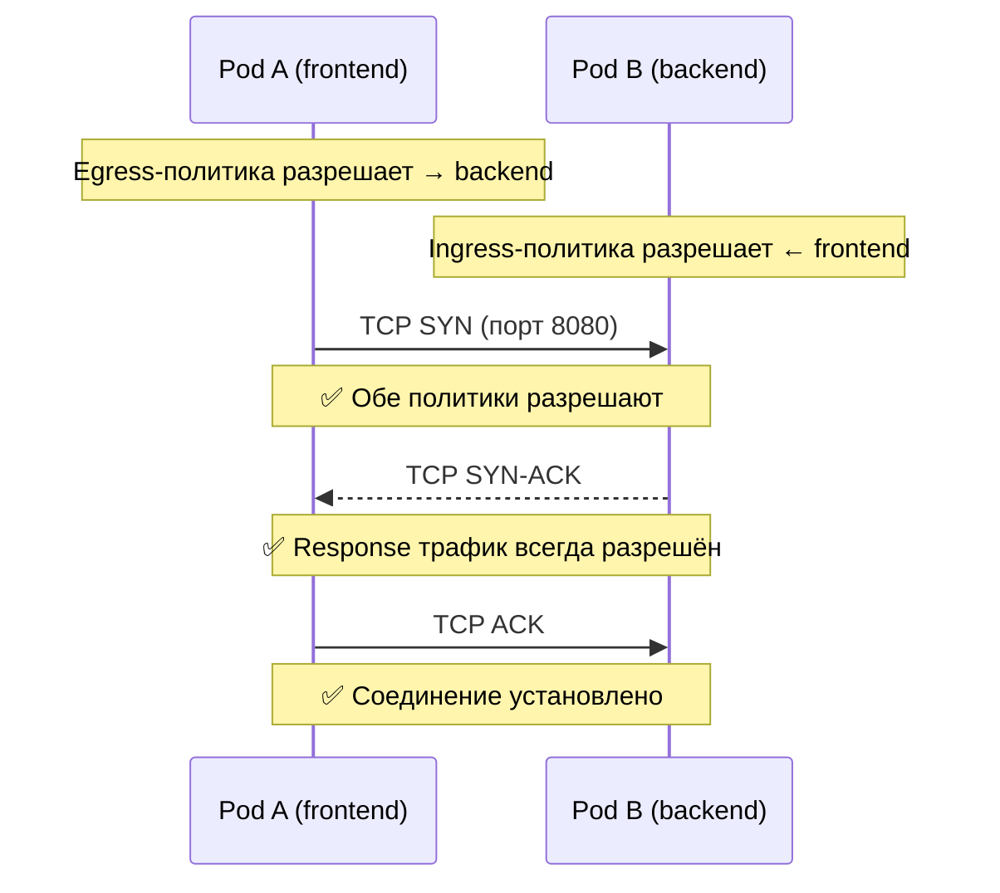

# NetworkPolicy — Сетевой firewall для подов

> 📌 `NetworkPolicy` — декларативный firewall на уровне **L3/L4** (IP, порт, протокол TCP/UDP/SCTP). Позволяет контролировать трафик **между подами** и **с внешним миром**. По умолчанию в K8s **всё разрешено** — NetworkPolicy переключает модель на **default-deny** для выбранных подов.
> 
> ⚠️ **Критично**: NetworkPolicy **не работает** без CNI, который её поддерживает (Calico, Cilium, Weave). **Flannel не поддерживает!**

---

## 🔹 Зачем нужен NetworkPolicy

| Проблема | Решение |
|----------|---------|
| Все поды видят друг друга (flat network) | NetworkPolicy изолирует поды по namespace/лейблам |
| Под может стучаться куда угодно | Egress-политики ограничивают исходящий трафик |
| Любой может подключиться к БД | Ingress-политики разрешают только frontend |
| Compliance (PCI-DSS, HIPAA) | Сегментация сети на уровне K8s API |
| Защита от lateral movement при компрометации | Zero-trust модель: deny-all по умолчанию |



---

## 🔹 Требования

| Компонент | Обязательность | Описание |
|-----------|----------------|----------|
| **CNI с поддержкой NetworkPolicy** | ✅ Обязательно | Calico, Cilium, Weave Net, Antrea |
| **Flannel** | ❌ Не поддерживает | NetworkPolicy будут игнорироваться! |
| **kube-proxy** | ⚠️ Частично | Сам по себе не реализует NetworkPolicy |

### Проверка поддержки

```bash
# 1. Узнать, какой CNI установлен
kubectl get pods -n kube-system | grep -E 'calico|cilium|weave|flannel|antrea'

# 2. Проверить, что CNI поддерживает NetworkPolicy
kubectl get pods -n kube-system -l k8s-app=calico-node   # Calico
kubectl get pods -n kube-system -l k8s-app=cilium-agent  # Cilium
```

> ⚠️ **Если у тебя Flannel** — NetworkPolicy создадутся в API, но **не будут применяться**. Миграция на Calico/Cilium обязательна.

---

## 🔹 Модель изоляции

### Два независимых типа изоляции

| Тип | Что контролирует | По умолчанию |
|-----|------------------|--------------|
| **Ingress** | Входящий трафик к поду | ✅ Всё разрешено |
| **Egress** | Исходящий трафик из пода | ✅ Всё разрешено |

### Ключевые принципы

```text
1. Default-allow: без NetworkPolicy весь трафик разрешён
2. Default-deny включается автоматически, если есть ХОТЯ БЫ ОДНА политика,
   выбирающая этот под и содержащая policyTypes: Ingress/Egress
3. Политики АДДИТИВНЫ: несколько политик объединяются (OR между правилами)
4. Для соединения нужны ОБЕ стороны:
   - Egress-политика на источнике разрешает
   - Ingress-политика на получателе разрешает
5. Response-трафик разрешён автоматически (stateful)
```



---

## 🔹 Структура NetworkPolicy

```yaml
apiVersion: networking.k8s.io/v1
kind: NetworkPolicy
metadata:
  name: allow-frontend-to-backend
  namespace: default
spec:
  podSelector:                      # ← К КАКИМ ПОДАМ применяется политика
    matchLabels:
      role: backend
  policyTypes:                      # ← Типы изоляции
  - Ingress
  - Egress
  ingress:                          # ← Правила ВХОДЯЩЕГО трафика
  - from:                           # ← Источники (OR между элементами)
    - podSelector:                  # ← Поды в том же namespace
        matchLabels:
          role: frontend
    - namespaceSelector:            # ← Все поды из namespace
        matchLabels:
          name: monitoring
    - ipBlock:                      # ← Внешние IP
        cidr: 10.0.0.0/24
        except:
        - 10.0.0.5/32
    ports:                          # ← Порты (AND с from)
    - protocol: TCP
      port: 8080
    - protocol: TCP
      port: 443
  egress:                           # ← Правила ИСХОДЯЩЕГО трафика
  - to:
    - podSelector:
        matchLabels:
          role: database
    ports:
    - protocol: TCP
      port: 5432
```

### Разбор полей

| Поле | Назначение | Обязательное |
|------|------------|--------------|
| **`podSelector`** | Выбирает поды, к которым применяется политика | ✅ Да (может быть `{}` = все поды) |
| **`policyTypes`** | `[Ingress]`, `[Egress]` или `[Ingress, Egress]` | ⚠️ Авто: Ingress всегда, Egress если есть egress-правила |
| **`ingress`** | Список правил для входящего трафика | ❌ Если нет — входящий трафик запрещён (при policyTypes: Ingress) |
| **`egress`** | Список правил для исходящего трафика | ❌ Если нет — исходящий трафик запрещён (при policyTypes: Egress) |
| **`from` / `to`** | Источники/назначения (OR между элементами) | ❌ Если нет — весь трафик разрешён (для этого направления) |
| **`ports`** | Порты и протоколы (AND с from/to) | ❌ Если нет — все порты разрешены |

---

## 🔹 ⚠️ YAML-ловушка: AND vs OR

> **Самая частая ошибка** при написании NetworkPolicy!

### AND (один элемент с обоими селекторами)

```yaml
ingress:
- from:
  - namespaceSelector:              # ← ОДИН элемент
      matchLabels:
        user: alice
    podSelector:                    # ← в том же элементе = AND
      matchLabels:
        role: client
```

**Что означает**: поды с `role=client` **И** в namespace с `user=alice`

### OR (два разных элемента)

```yaml
ingress:
- from:
  - namespaceSelector:              # ← ПЕРВЫЙ элемент
      matchLabels:
        user: alice
  - podSelector:                    # ← ВТОРОЙ элемент (отдельно!)
      matchLabels:
        role: client
```

**Что означает**: (все поды в namespace с `user=alice`) **ИЛИ** (поды с `role=client` в текущем namespace)

### Визуальное сравнение

```text
┌─────────────────────────────────────────────────────────────┐
│ AND (один элемент):                                         │
│   namespace: user=alice                                     │
│   ┌─────────────────────┐                                   │
│   │ pod: role=client    │ ← Пересечение                     │
│   └─────────────────────┘                                   │
└─────────────────────────────────────────────────────────────┘

┌─────────────────────────────────────────────────────────────┐
│ OR (два элемента):                                          │
│   namespace: user=alice         pod: role=client            │
│   ┌──────────────┐              ┌──────────────┐            │
│   │ все поды     │              │ все поды     │            │
│   └──────────────┘              └──────────────┘            │
│        Объединение (Union)                                  │
└─────────────────────────────────────────────────────────────┘
```

> 💡 **Совет**: всегда проверяй через `kubectl describe networkpolicy <name>` — K8s покажет, как он интерпретировал политику.

---

## 🔹 Default policies (шаблоны)

### 1. Запретить весь входящий трафик (default-deny-ingress)

```yaml
apiVersion: networking.k8s.io/v1
kind: NetworkPolicy
metadata:
  name: default-deny-ingress
  namespace: default
spec:
  podSelector: {}          # ← все поды в namespace
  policyTypes:
  - Ingress
  # ingress: [] ← пусто = ничего не разрешено
```

### 2. Запретить весь исходящий трафик (default-deny-egress)

```yaml
apiVersion: networking.k8s.io/v1
kind: NetworkPolicy
metadata:
  name: default-deny-egress
  namespace: default
spec:
  podSelector: {}
  policyTypes:
  - Egress
```

> ⚠️ **ОСТОРОЖНО**: это **блокирует DNS**! Пода не смогут резолвить имена. Нужна отдельная политика для DNS (см. ниже).

### 3. Запретить весь трафик (default-deny-all)

```yaml
apiVersion: networking.k8s.io/v1
kind: NetworkPolicy
metadata:
  name: default-deny-all
  namespace: default
spec:
  podSelector: {}
  policyTypes:
  - Ingress
  - Egress
```

### 4. Разрешить весь входящий трафик (default-allow-ingress)

```yaml
apiVersion: networking.k8s.io/v1
kind: NetworkPolicy
metadata:
  name: allow-all-ingress
  namespace: default
spec:
  podSelector: {}
  policyTypes:
  - Ingress
  ingress:
  - {}                   # ← пустое правило = всё разрешено
```

### 5. Разрешить весь исходящий трафик (default-allow-egress)

```yaml
apiVersion: networking.k8s.io/v1
kind: NetworkPolicy
metadata:
  name: allow-all-egress
  namespace: default
spec:
  podSelector: {}
  policyTypes:
  - Egress
  egress:
  - {}
```

---

## 🔹 Практические паттерны

### Паттерн 1: Разрешить DNS (критично при deny-all egress!)

```yaml
apiVersion: networking.k8s.io/v1
kind: NetworkPolicy
metadata:
  name: allow-dns
  namespace: default
spec:
  podSelector: {}        # ← для всех подов
  policyTypes:
  - Egress
  egress:
  - to:
    - namespaceSelector:
        matchLabels:
          kubernetes.io/metadata.name: kube-system
    ports:
    - protocol: UDP
      port: 53
    - protocol: TCP
      port: 53
```

> 💡 **Альтернатива по IP** (если CoreDNS имеет статический IP):
> ```yaml
> - to:
>   - ipBlock:
>       cidr: 10.96.0.10/32   # ← ClusterIP CoreDNS
>   ports:
>   - protocol: UDP
>     port: 53
> ```

### Паттерн 2: Frontend → Backend → Database

```yaml
# Backend: принимает только от frontend
apiVersion: networking.k8s.io/v1
kind: NetworkPolicy
metadata:
  name: backend-allow-frontend
  namespace: default
spec:
  podSelector:
    matchLabels:
      app: backend
  policyTypes:
  - Ingress
  ingress:
  - from:
    - podSelector:
        matchLabels:
          app: frontend
    ports:
    - protocol: TCP
      port: 8080
---
# Database: принимает только от backend
apiVersion: networking.k8s.io/v1
kind: NetworkPolicy
metadata:
  name: database-allow-backend
  namespace: default
spec:
  podSelector:
    matchLabels:
      app: database
  policyTypes:
  - Ingress
  ingress:
  - from:
    - podSelector:
        matchLabels:
          app: backend
    ports:
    - protocol: TCP
      port: 5432
```

### Паттерн 3: Изоляция namespace

```yaml
# Запретить весь трафик из других namespace
apiVersion: networking.k8s.io/v1
kind: NetworkPolicy
metadata:
  name: isolate-namespace
  namespace: production
spec:
  podSelector: {}
  policyTypes:
  - Ingress
  - Egress
  ingress:
  - from:
    - namespaceSelector:
        matchLabels:
          kubernetes.io/metadata.name: production
  egress:
  - to:
    - namespaceSelector:
        matchLabels:
          kubernetes.io/metadata.name: production
  # Разрешить DNS отдельно
  - to:
    - namespaceSelector:
        matchLabels:
          kubernetes.io/metadata.name: kube-system
    ports:
    - protocol: UDP
      port: 53
```

### Паттерн 4: Разрешить трафик извне (LoadBalancer/Ingress)

```yaml
apiVersion: networking.k8s.io/v1
kind: NetworkPolicy
metadata:
  name: allow-external
  namespace: default
spec:
  podSelector:
    matchLabels:
      app: frontend
  policyTypes:
  - Ingress
  ingress:
  - from:
    - ipBlock:
        cidr: 0.0.0.0/0      # ← весь интернет
        except:
        - 10.0.0.0/8         # ← кроме приватных сетей
        - 172.16.0.0/12
        - 192.168.0.0/16
    ports:
    - protocol: TCP
      port: 80
    - protocol: TCP
      port: 443
```

### Паттерн 5: Мониторинг (Prometheus может скрейбить все поды)

```yaml
apiVersion: networking.k8s.io/v1
kind: NetworkPolicy
metadata:
  name: allow-prometheus-scrape
  namespace: default
spec:
  podSelector: {}            # ← все поды в namespace
  policyTypes:
  - Ingress
  ingress:
  - from:
    - namespaceSelector:
        matchLabels:
          kubernetes.io/metadata.name: monitoring
      podSelector:
        matchLabels:
          app: prometheus
    ports:
    - protocol: TCP
      port: 9090             # ← метрики
```

### Паттерн 6: Диапазоны портов (endPort)

```yaml
apiVersion: networking.k8s.io/v1
kind: NetworkPolicy
metadata:
  name: allow-port-range
spec:
  podSelector:
    matchLabels:
      app: myapp
  policyTypes:
  - Egress
  egress:
  - to:
    - ipBlock:
        cidr: 10.0.0.0/24
    ports:
    - protocol: TCP
      port: 32000
      endPort: 32768         # ← диапазон портов (v1.25+)
```

---

## 🔹 Выбор namespace по имени

> **Важно**: NetworkPolicy **не может** выбирать namespace по имени напрямую. Нужно использовать метку `kubernetes.io/metadata.name`, которая автоматически добавляется ко всем namespace.

```yaml
egress:
- to:
  - namespaceSelector:
      matchLabels:
        kubernetes.io/metadata.name: production   # ← namespace "production"
```

**Несколько namespace:**
```yaml
egress:
- to:
  - namespaceSelector:
      matchExpressions:
      - key: kubernetes.io/metadata.name
        operator: In
        values: ["production", "staging"]
```

---

## 🔹 hostNetwork pods

> ⚠️ **Поведение не определено** в спецификации NetworkPolicy!

| Сценарий | Поведение |
|----------|-----------|
| hostNetwork pod выбран `podSelector` | Зависит от CNI: может применяться, может игнорироваться |
| hostNetwork pod в `from`/`to` правиле | Обычно трафик хоста не фильтруется |
| Трафик к/от хоста | **Всегда разрешён** (исключение в спецификации) |

**Практика**: избегай NetworkPolicy для hostNetwork подов. Используй `iptables` на ноде или host-level firewall.

---

## 🔹 Что НЕЛЬЗЯ сделать с NetworkPolicy

| Ограничение | Обходное решение |
|-------------|------------------|
| ❌ Фильтрация по имени Service | Использовать podSelector + лейблы |
| ❌ TLS-терминация / mTLS | Service Mesh (Istio, Linkerd) |
| ❌ L7-фильтрация (HTTP headers, URL) | Ingress Controller / Service Mesh |
| ❌ Логирование заблокированных соединений | Cilium Hubble, Calico flow logs |
| ❌ Explicit deny (явный запрет) | Модель только default-deny + allow |
| ❌ Блокировка localhost / loopback | Нельзя (под всегда может стучаться в себя) |
| ❌ Блокировка трафика со своего узла | Нельзя (трафик узла всегда разрешён) |
| ❌ Политики по конкретным нодам | Использовать ipBlock с IP узлов |
| ❌ Глобальные политики (все namespace) | Calico GlobalNetworkPolicy, Cilium CiliumClusterwideNetworkPolicy |
| ❌ Принудительный прокси-трафик | Service Mesh |

---

## 🔹 Влияние на существующие соединения

> ⚠️ **Важно**: поведение при изменении политик **зависит от CNI**!

| Ситуация | Поведение |
|----------|-----------|
| Политика изменилась, соединение установлено | Зависит от CNI: может разорваться сразу, может продолжать работать |
| Добавлена новая политика | Новые соединения — по новой политике, существующие — как было |
| Удалена политика | Обычно сразу применяется |

**Best practice**:
- Не полагайся на то, что существующие соединения будут разорваны
- Используй **readiness probes** для проверки доступности
- Тестируй изменения политик в staging

---

## 🔹 Troubleshooting

### Проблема 1: NetworkPolicy не применяется

```bash
# 1. Проверить, что CNI поддерживает NetworkPolicy
kubectl get pods -n kube-system | grep -E 'calico|cilium|weave|antrea'
# Если flannel — мигрируй на Calico/Cilium!

# 2. Проверить, что политика создана
kubectl get networkpolicy -n default
kubectl describe networkpolicy <name>

# 3. Проверить, что под выбран политикой
kubectl get pod <pod-name> --show-labels
# Лейблы должны совпадать с podSelector
```

### Проблема 2: Поды не могут резолвить DNS после deny-all egress

```bash
# Проверить события пода
kubectl describe pod <pod-name> | grep -A 10 'Events:'

# Решение: добавить политику для DNS (см. Паттерн 1)
kubectl apply -f allow-dns.yaml
```

### Проблема 3: Ingress/LB не может достучаться до пода

```bash
# Проверить, что Ingress-трафик разрешён
kubectl describe networkpolicy -n default | grep -A 20 'ingress:'

# Решение: добавить ipBlock 0.0.0.0/0 или IP LoadBalancer
# (см. Паттерн 4)
```

### Проблема 4: Под не может подключиться к Service другого namespace

```bash
# Проверить, что namespace разрешён
kubectl get networkpolicy -n <source-ns>

# Решение: добавить namespaceSelector с меткой kubernetes.io/metadata.name
```

### Диагностика через CNI

```bash
# Calico: проверить политики
kubectl exec -n kube-system <calico-node-pod> -- calicoctl get networkpolicy --all-namespaces

# Cilium: проверить политики и flow
kubectl exec -n kube-system <cilium-pod> -- cilium policy get
kubectl exec -n kube-system <cilium-pod> -- hubble observe --namespace default

# Проверить iptables правила на ноде (Calico)
ssh <node> sudo iptables-save | grep cali
```

---

## 🔹 Шпаргалка kubectl

```bash
# 1. Список всех NetworkPolicy
kubectl get networkpolicy -A
kubectl get netpol -A   # короткий алиас

# 2. Детальная информация
kubectl describe networkpolicy <name> -n <namespace>

# 3. Посмотреть, какие поды выбраны политикой
kubectl get pods -n default -l role=backend

# 4. Найти политики, применяемые к конкретному поду
kubectl get networkpolicy -n default -o json | \
  jq -r '.items[] | select(.spec.podSelector.matchLabels | to_entries | map("\(.key)=\(.value)") | .[] as $label | "test-pod" | select(. == $label)) | .metadata.name'

# 5. Экспорт политики в YAML
kubectl get networkpolicy <name> -n <namespace> -o yaml > policy-backup.yaml

# 6. Удалить все политики в namespace
kubectl delete networkpolicy --all -n default

# 7. Создать default-deny-all
kubectl apply -f - <<EOF
apiVersion: networking.k8s.io/v1
kind: NetworkPolicy
metadata:
  name: default-deny-all
  namespace: default
spec:
  podSelector: {}
  policyTypes: [Ingress, Egress]
EOF

# 8. Проверить, какие namespace имеют метку kubernetes.io/metadata.name
kubectl get namespace --show-labels | grep kubernetes.io/metadata.name

# 9. Посмотреть IP подов (для ipBlock)
kubectl get pods -o wide -n default

# 10. Проверить, что CoreDNS работает
kubectl get pods -n kube-system -l k8s-app=kube-dns
kubectl get svc -n kube-system kube-dns
```

---

## 🔹 Чек-лист: Best Practices

```text
[ ] Убедись, что CNI поддерживает NetworkPolicy (Calico/Cilium, НЕ Flannel)
[ ] Добавь метки на namespace: kubernetes.io/metadata.name (автоматически) + кастомные
[ ] Добавь метки на поды: app, role, tier — для podSelector
[ ] Начинай с default-deny-all, потом добавляй allow-правила
[ ] ВСЕГДА добавляй политику для DNS при deny-all egress!
[ ] Проверяй YAML-ловушку AND vs OR через kubectl describe
[ ] Для L7-фильтрации используй Service Mesh, а не NetworkPolicy
[ ] Для логирования заблокированных соединений используй Cilium Hubble / Calico flow logs
[ ] Тестируй политики в staging перед production
[ ] Документируй каждую политику (зачем нужна, что разрешает)
[ ] Используй GitOps (ArgoCD/Flux) для управления политиками
[ ] Регулярно аудитируй политики: нет ли лишнего, нет ли слишком широких правил
[ ] Для глобальных политик используй Calico GlobalNetworkPolicy или Cilium CCNP
[ ] Не забывай про response-трафик — он разрешён автоматически
[ ] Учитывай, что трафик узла всегда разрешён
```

> 💡 **Совет для Obsidian**:
> - Сделай перекрёстные ссылки: `[[02.service]]`, `[[03.ingress]]`, `[[01.networking_overview]]`.
> - Добавь блок «Наши NetworkPolicy»: список политик в вашем кластере с описанием.
> - Добавь блок «Метки для селекторов»: какие лейблы используете (app, role, tier, environment).
> - Добавь блок «Troubleshooting cheatsheet»: команды для Calico/Cilium.

---

## 🔹 Сравнение CNI и поддержка NetworkPolicy

| CNI | NetworkPolicy | Расширенные возможности | Когда выбирать |
|-----|---------------|------------------------|----------------|
| **Calico** | ✅ Да | GlobalNetworkPolicy, StagedNetworkPolicy, L7 (Enterprise) | Production, on-premise, нужна гибкость |
| **Cilium** | ✅ Да | CiliumClusterwideNetworkPolicy, L7, Hubble (observability), eBPF | Modern stacks, observability важна |
| **Weave Net** | ✅ Да | Базовая поддержка | Простые сценарии, быстрая установка |
| **Antrea** | ✅ Да | OVS-based, интеграция с NSX | vSphere, enterprise |
| **Flannel** | ❌ **НЕТ** | Только overlay-сеть | **Не используй для production!** |

---

## 🔹 Ключевые выводы

1. **NetworkPolicy** — L3/L4 firewall для подов. Работает **только с CNI**, который её поддерживает.
2. **Default-allow**: без политик весь трафик разрешён. NetworkPolicy переключает на **default-deny** для выбранных подов.
3. **Два типа изоляции**: Ingress (входящий) и Egress (исходящий) — **независимые**.
4. **Аддитивность**: несколько политик объединяются через OR, не конфликтуют.
5. **Двусторонняя проверка**: для соединения нужны **оба** — Egress на источнике + Ingress на получателе.
6. **YAML-ловушка**: `namespaceSelector + podSelector` в **одном** элементе = AND, в **разных** = OR.
7. **DNS блокируется** при deny-all egress — всегда добавляй политику для DNS!
8. **endPort** (v1.25+) — диапазоны портов.
9. **hostNetwork pods** — поведение не определено, избегай.
10. **Ограничения**: нет L7, нет TLS, нет логирования, нет explicit deny — используй Service Mesh для этих задач.
11. **Default policies**: deny-all, allow-all, deny-ingress, deny-egress — готовые шаблоны.
12. **Выбор namespace**: используй метку `kubernetes.io/metadata.name`, а не имя напрямую.