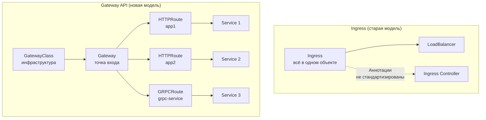

# Gateway API — Современная замена Ingress

> 📌 `Gateway API` — это **набор CRD** для L4-L7 маршрутизации, пришедший на смену Ingress. Главное отличие: **разделение ответственности** между ролями (инфраструктура vs приложение) и **богатая функциональность** из коробки (header matching, traffic splitting, weight-based routing).
> 
> **4 стабильных ресурса**:
> - `GatewayClass` — какой контроллер реализует (аналог IngressClass)
> - `Gateway` — точка входа (LoadBalancer, proxy)
> - `HTTPRoute` — правила маршрутизации HTTP
> - `GRPCRoute` — правила маршрутизации gRPC

---

## 🔹 Зачем нужен Gateway API (вместо Ingress)

| Проблема Ingress | Решение Gateway API |
|------------------|---------------------|
| Ограниченная функциональность (только host/path) | Header matching, query params, traffic splitting, request mirroring |
| Аннотации — не стандартизированы | Нативные поля в API (не нужны аннотации) |
| Один объект для всего (монолит) | Разделение: инфраструктура (Gateway) vs приложение (HTTPRoute) |
| Только HTTP/HTTPS | HTTP, HTTPS, TLS, TCP, UDP, gRPC |
| Нет cross-namespace routing | Нативная поддержка через ReferenceGrant |
| Нет weight-based routing | Встроенная поддержка canary, A/B тестов |



---

## 🔹 Ролевая модель

> **Ключевая идея**: Gateway API разделяет ответственность между ролями в организации.

| Роль | Отвечает за | Ресурсы |
|------|-------------|---------|
| **Infrastructure Provider** | Реализация контроллера (NGINX, Envoy, Istio, Traefik) | `GatewayClass` |
| **Cluster Operator** | Точки входа, TLS-сертификаты, политики доступа | `Gateway`, `ReferenceGrant` |
| **Application Developer** | Маршрутизация для своего приложения | `HTTPRoute`, `GRPCRoute`, `TLSRoute` |

```text
Пример разделения:
┌─────────────────────────────────────────────────────────────┐
│ Infrastructure Provider (NGINX, Envoy, etc.)                │
│   └─ GatewayClass: "nginx"                                  │
└─────────────────────────────────────────────────────────────┘
                            ↓
┌─────────────────────────────────────────────────────────────┐
│ Cluster Operator                                            │
│   └─ Gateway: "prod-gateway" (LoadBalancer, TLS certs)      │
│   └─ ReferenceGrant: разрешить cross-namespace              │
└─────────────────────────────────────────────────────────────┘
                            ↓
┌─────────────────────────────────────────────────────────────┐
│ Application Developer                                       │
│   └─ HTTPRoute: "my-app-route" (правила для своего app)     │
└─────────────────────────────────────────────────────────────┘
```

---

## 🔹 4 стабильных ресурса

### 1. GatewayClass (инфраструктурный уровень)

> Определяет, **какой контроллер** реализует Gateway API. Создаётся **один раз** админом кластера.

```yaml
apiVersion: gateway.networking.k8s.io/v1
kind: GatewayClass
metadata:
  name: nginx
spec:
  controllerName: gateway.nginx.org/nginx-gateway-controller
  # Опционально: параметры для контроллера
  parametersRef:
    group: gateway.nginx.org
    kind: NginxProxy
    name: nginx-proxy-config
```

**Аналог в Ingress**: `IngressClass`

### 2. Gateway (точка входа)

> Определяет **LoadBalancer / proxy**, который будет принимать трафик. Создаётся **оператором кластера**.

```yaml
apiVersion: gateway.networking.k8s.io/v1
kind: Gateway
metadata:
  name: prod-gateway
  namespace: gateway-system
spec:
  gatewayClassName: nginx              # ← какой контроллер
  listeners:                           # ← на чём слушаем
  - name: http
    hostname: "*.example.com"
    protocol: HTTP
    port: 80
    allowedRoutes:                     # ← какие маршруты принимаем
      namespaces:
        from: All                      # ← из всех namespace
  - name: https
    hostname: "*.example.com"
    protocol: HTTPS
    port: 443
    tls:
      mode: Terminate
      certificateRefs:
      - name: wildcard-tls-cert        # ← TLS-сертификат
    allowedRoutes:
      namespaces:
        from: Selector
        selector:
          matchLabels:
            environment: production
```

**Ключевые поля:**
- `listeners` — порты, протоколы, hostnames
- `allowedRoutes` — какие namespace могут прикреплять маршруты
- `tls` — TLS-терминация

**Аналог в Ingress**: сам Ingress Controller (но в Gateway API это явный ресурс)

### 3. HTTPRoute (уровень приложения)

> Определяет **правила маршрутизации HTTP**. Создаётся **разработчиком приложения**.

```yaml
apiVersion: gateway.networking.k8s.io/v1
kind: HTTPRoute
metadata:
  name: my-app-route
  namespace: my-app
spec:
  parentRefs:                          # ← к какому Gateway прикрепляемся
  - name: prod-gateway
    namespace: gateway-system
  hostnames:
  - "api.example.com"
  rules:
  - matches:                           # ← условия matching
    - path:
        type: PathPrefix
        value: /api/v1
      headers:
      - name: X-Environment
        value: production
    backendRefs:                       # ← куда направляем
    - name: api-service
      port: 8080
      weight: 90                       # ← 90% трафика
    - name: api-service-canary
      port: 8080
      weight: 10                       # ← 10% трафика (canary)
```

**Аналог в Ingress**: сам Ingress (но с гораздо большей функциональностью)

### 4. GRPCRoute (уровень приложения)

> Определяет **правила маршрутизации gRPC**. Требует HTTP/2.

```yaml
apiVersion: gateway.networking.k8s.io/v1
kind: GRPCRoute
metadata:
  name: grpc-service-route
  namespace: my-app
spec:
  parentRefs:
  - name: prod-gateway
    namespace: gateway-system
  hostnames:
  - "grpc.example.com"
  rules:
  - matches:                           # ← matching по gRPC методу
    - method:
        service: com.example.UserService
        method: Login
    backendRefs:
    - name: auth-service
      port: 50051
  - matches:
    - method:
        service: com.example.UserService
        method: GetProfile
    backendRefs:
    - name: profile-service
      port: 50051
```

---

## 🔹 Продвинутые возможности HTTPRoute

### 1. Header-based routing

```yaml
rules:
- matches:
  - headers:
    - name: X-Environment
      value: production
    - name: X-User-Type
      value: premium
  backendRefs:
  - name: premium-api
    port: 8080
```

### 2. Query parameter matching

```yaml
rules:
- matches:
  - queryParams:
    - name: version
      value: v2
  backendRefs:
  - name: api-v2
    port: 8080
```

### 3. Traffic splitting (canary / A-B тесты)

```yaml
rules:
- backendRefs:
  - name: api-stable
    port: 8080
    weight: 90
  - name: api-canary
    port: 8080
    weight: 10
```

### 4. Request header modification

```yaml
rules:
- matches:
  - path:
      type: PathPrefix
      value: /api
  filters:
  - type: RequestHeaderModifier
    requestHeaderModifier:
      add:
      - name: X-Forwarded-For
        value: "%CLIENT_IP%"
      set:
      - name: X-Environment
        value: "production"
      remove:
      - "X-Internal-Header"
  backendRefs:
  - name: api-service
    port: 8080
```

### 5. URL rewrite

```yaml
rules:
- matches:
  - path:
      type: PathPrefix
      value: /old-api
  filters:
  - type: URLRewrite
    urlRewrite:
      path:
        type: ReplacePrefixMatch
        replacePrefixMatch: /new-api
  backendRefs:
  - name: api-service
    port: 8080
```

### 6. Request redirect

```yaml
rules:
- matches:
  - path:
      type: PathPrefix
      value: /old-path
  filters:
  - type: RequestRedirect
    requestRedirect:
      scheme: https
      hostname: new.example.com
      statusCode: 301
```

### 7. Request mirroring (shadow traffic)

```yaml
rules:
- matches:
  - path:
      type: PathPrefix
      value: /api
  filters:
  - type: RequestMirror
    requestMirror:
      backendRef:
        name: api-shadow
        port: 8080
  backendRefs:
  - name: api-primary
    port: 8080
```

---

## 🔹 Cross-namespace routing

> **Проблема**: HTTPRoute в namespace `app1` хочет использовать Gateway из namespace `gateway-system`.

### Решение: ReferenceGrant

```yaml
# В namespace gateway-system
apiVersion: gateway.networking.k8s.io/v1beta1
kind: ReferenceGrant
metadata:
  name: allow-app1-to-use-gateway
  namespace: gateway-system
spec:
  from:
  - group: gateway.networking.k8s.io
    kind: HTTPRoute
    namespace: app1
  to:
  - group: ""
    kind: Gateway
    name: prod-gateway
```

**HTTPRoute в app1:**
```yaml
apiVersion: gateway.networking.k8s.io/v1
kind: HTTPRoute
metadata:
  name: app1-route
  namespace: app1
spec:
  parentRefs:
  - name: prod-gateway
    namespace: gateway-system          # ← cross-namespace!
  hostnames:
  - "app1.example.com"
  rules:
  - backendRefs:
    - name: app1-service
      port: 8080
```

---

## 🔹 Полный пример: production setup

### Шаг 1: GatewayClass (создаёт админ)

```yaml
apiVersion: gateway.networking.k8s.io/v1
kind: GatewayClass
metadata:
  name: nginx
spec:
  controllerName: gateway.nginx.org/nginx-gateway-controller
```

### Шаг 2: Gateway (создаёт оператор)

```yaml
apiVersion: gateway.networking.k8s.io/v1
kind: Gateway
metadata:
  name: prod-gateway
  namespace: gateway-system
spec:
  gatewayClassName: nginx
  listeners:
  - name: https
    hostname: "*.example.com"
    protocol: HTTPS
    port: 443
    tls:
      mode: Terminate
      certificateRefs:
      - name: wildcard-tls-cert
    allowedRoutes:
      namespaces:
        from: Selector
        selector:
          matchLabels:
            environment: production
```

### Шаг 3: HTTPRoute для frontend (создаёт разработчик)

```yaml
apiVersion: gateway.networking.k8s.io/v1
kind: HTTPRoute
metadata:
  name: frontend-route
  namespace: frontend
spec:
  parentRefs:
  - name: prod-gateway
    namespace: gateway-system
  hostnames:
  - "www.example.com"
  rules:
  - matches:
    - path:
        type: PathPrefix
        value: /
    backendRefs:
    - name: frontend-service
      port: 80
```

### Шаг 4: HTTPRoute для API с canary (создаёт разработчик)

```yaml
apiVersion: gateway.networking.k8s.io/v1
kind: HTTPRoute
metadata:
  name: api-route
  namespace: backend
spec:
  parentRefs:
  - name: prod-gateway
    namespace: gateway-system
  hostnames:
  - "api.example.com"
  rules:
  - matches:
    - path:
        type: PathPrefix
        value: /api/v1
    backendRefs:
    - name: api-stable
      port: 8080
      weight: 90
    - name: api-canary
      port: 8080
      weight: 10
```

---

## 🔹 Сравнение: Ingress vs Gateway API

| Характеристика | Ingress | Gateway API |
|----------------|---------|-------------|
| **Статус** | Stable, но **заморожен** | Stable (GA), **активно развивается** |
| **Уровни** | Только L7 (HTTP/HTTPS) | L4-L7 (TCP, UDP, HTTP, gRPC, TLS) |
| **Роли** | Один объект для всего | Разделение: GatewayClass, Gateway, Route |
| **Header matching** | Через аннотации (не стандартизировано) | Нативно в API |
| **Traffic splitting** | Через аннотации | Нативно (`weight` в backendRefs) |
| **Cross-namespace** | Нет | ✅ Через ReferenceGrant |
| **Request modification** | Через аннотации | Нативно (filters) |
| **gRPC** | ❌ Нет | ✅ GRPCRoute |
| **TCP/UDP** | ❌ Нет | ✅ TCPRoute, UDPRoute |
| **TLS** | Только termination | Termination, Passthrough, ClientCertificate |
| **Расширяемость** | Аннотации (не стандартизированы) | CRD, filters |
| **Портируемость** | Зависит от контроллера | Стандартизированный API |

---

## 🔹 Популярные реализации Gateway API

| Контроллер | Особенности | Когда выбирать |
|------------|-------------|----------------|
| **NGINX Gateway Fabric** | От F5/NGINX, production-ready | Production, NGINX ecosystem |
| **Envoy Gateway** | На базе Envoy proxy | Modern stacks, service mesh |
| **Istio** | Service mesh + Gateway API | Service mesh уже используется |
| **Traefik** | Простая установка, auto-discovery | Быстрый старт, small teams |
| **HAProxy Ingress** | Высокая производительность | High-load, enterprise |
| **Contour** | От VMware, Envoy-based | vSphere, enterprise |
| **Emissary-Ingress** | API Gateway, OpenAPI | API management |
| **GKE Gateway Controller** | Встроен в GKE | GCP GKE |
| **AWS Gateway API Controller** | Интеграция с AWS ALB/NLB | AWS EKS |

---

## 🔹 Установка Gateway API

### Шаг 1: Установить CRD

```bash
# Стандартные CRD (stable + experimental)
kubectl apply -k "github.com/kubernetes-sigs/gateway-api/config/crd?ref=v1.2.0"

# Или только stable
kubectl apply -k "github.com/kubernetes-sigs/gateway-api/config/crd/standard?ref=v1.2.0"
```

### Шаг 2: Установить контроллер (пример: NGINX)

```bash
# Helm
helm install nginx-gateway-fabric oci://ghcr.io/nginxinc/charts/nginx-gateway-fabric \
  --create-namespace \
  --namespace nginx-gateway

# Проверить
kubectl get pods -n nginx-gateway
kubectl get gatewayclass
```

### Шаг 3: Проверить установку

```bash
# Проверить CRD
kubectl get crd | grep gateway

# Проверить GatewayClass
kubectl get gatewayclass

# Проверить контроллер
kubectl get pods -n nginx-gateway
```

---

## 🔹 Troubleshooting

### Проблема 1: Gateway не получает адрес

```bash
# Проверить статус Gateway
kubectl describe gateway prod-gateway -n gateway-system
# Conditions:
# - type: Accepted
#   status: "True"
# - type: Programmed
#   status: "False"              ← проблема!
#   reason: AddressNotAssigned

# Проверить, что GatewayClass существует
kubectl get gatewayclass

# Проверить логи контроллера
kubectl logs -n nginx-gateway deployment/nginx-gateway-fabric
```

### Проблема 2: HTTPRoute не прикрепляется к Gateway

```bash
# Проверить статус HTTPRoute
kubectl describe httproute my-route -n my-app
# Parents:
# - parentRef:
#     name: prod-gateway
#     namespace: gateway-system
#   conditions:
#   - type: Accepted
#     status: "False"            ← не принят!
#     reason: NotAllowedByListener

# Проверить allowedRoutes в Gateway
kubectl get gateway prod-gateway -n gateway-system -o yaml | grep -A 10 allowedRoutes

# Решение:
# 1. Добавить namespace в allowedRoutes
# 2. Или создать ReferenceGrant для cross-namespace
```

### Проблема 3: Трафик не идёт к backend

```bash
# Проверить, что backendRefs существуют
kubectl get svc api-service -n my-app

# Проверить, что порты совпадают
kubectl get httproute my-route -o yaml | grep -A 5 backendRefs

# Проверить логи контроллера
kubectl logs -n nginx-gateway deployment/nginx-gateway-fabric

# Проверить конфигурацию NGINX (если используется NGINX)
kubectl exec -n nginx-gateway <nginx-pod> -- cat /etc/nginx/conf.d/gateway.conf
```

---

## 🔹 Шпаргалка kubectl

```bash
# 1. Список всех GatewayClass
kubectl get gatewayclass
kubectl get gc   # короткий алиас

# 2. Список всех Gateway
kubectl get gateway -A
kubectl get gtw -A

# 3. Список всех HTTPRoute
kubectl get httproute -A
kubectl get httpr

# 4. Список всех GRPCRoute
kubectl get grpcroute -A

# 5. Детальная информация о Gateway
kubectl describe gateway prod-gateway -n gateway-system

# 6. Детальная информация о HTTPRoute
kubectl describe httproute my-route -n my-app

# 7. Проверить статус Gateway (адрес, listeners)
kubectl get gateway prod-gateway -n gateway-system -o jsonpath='{.status}'

# 8. Проверить, какие HTTPRoute прикреплены к Gateway
kubectl get httproute -A -o json | \
  jq -r '.items[] | select(.spec.parentRefs[]?.name == "prod-gateway") | "\(.metadata.namespace)/\(.metadata.name)"'

# 9. Создать ReferenceGrant для cross-namespace
kubectl apply -f - <<EOF
apiVersion: gateway.networking.k8s.io/v1beta1
kind: ReferenceGrant
metadata:
  name: allow-app1
  namespace: gateway-system
spec:
  from:
  - group: gateway.networking.k8s.io
    kind: HTTPRoute
    namespace: app1
  to:
  - group: ""
    kind: Gateway
    name: prod-gateway
EOF

# 10. Экспорт Gateway API ресурсов
kubectl get gatewayclass,gateway,httproute,grpcroute -A -o yaml > gateway-api-backup.yaml

# 11. Проверить, какие контроллеры поддерживают Gateway API
kubectl get gatewayclass -o json | jq -r '.items[] | "\(.metadata.name): \(.spec.controllerName)"'

# 12. Посмотреть события Gateway
kubectl get events -n gateway-system --field-selector involvedObject.name=prod-gateway
```

---

## 🔹 Миграция с Ingress на Gateway API

### Пример: простой Ingress

```yaml
# Было (Ingress)
apiVersion: networking.k8s.io/v1
kind: Ingress
metadata:
  name: my-app
  annotations:
    nginx.ingress.kubernetes.io/rewrite-target: /
spec:
  rules:
  - host: myapp.example.com
    http:
      paths:
      - path: /api
        pathType: Prefix
        backend:
          service:
            name: api-service
            port:
              number: 8080
```

```yaml
# Стало (Gateway API)
apiVersion: gateway.networking.k8s.io/v1
kind: HTTPRoute
metadata:
  name: my-app-route
spec:
  parentRefs:
  - name: prod-gateway
    namespace: gateway-system
  hostnames:
  - "myapp.example.com"
  rules:
  - matches:
    - path:
        type: PathPrefix
        value: /api
    filters:
    - type: URLRewrite
      urlRewrite:
        path:
          type: ReplacePrefixMatch
          replacePrefixMatch: /
    backendRefs:
    - name: api-service
      port: 8080
```

### Чек-лист миграции

```text
[ ] Установить Gateway API CRD
[ ] Установить Gateway Controller (NGINX, Envoy, etc.)
[ ] Создать GatewayClass
[ ] Создать Gateway (перенести TLS-сертификаты из Ingress)
[ ] Для каждого Ingress создать HTTPRoute
[ ] Перенести аннотации в нативные поля Gateway API (filters)
[ ] Протестировать маршрутизацию
[ ] Переключить DNS на новый Gateway (если изменился IP)
[ ] Удалить старые Ingress ресурсы
[ ] Обновить документацию
```

---

## 🔹 Чек-лист: Best Practices

```text
[ ] Используй Gateway API для новых проектов (вместо Ingress)
[ ] Разделяй роли: GatewayClass (админ), Gateway (оператор), HTTPRoute (разработчик)
[ ] Для production используй HTTPS (TLS termination в Gateway)
[ ] Для canary/A-B тестов используй weight в backendRefs
[ ] Для cross-namespace routing используй ReferenceGrant
[ ] Для header-based routing используй matches.headers
[ ] Для URL rewrite используй filters.urlRewrite
[ ] Для request mirroring (shadow traffic) используй filters.requestMirror
[ ] Для gRPC используй GRPCRoute (не HTTPRoute)
[ ] Мониторь статус Gateway и HTTPRoute (conditions)
[ ] Используй GitOps (ArgoCD/Flux) для управления Gateway API ресурсами
[ ] Тестируй миграцию с Ingress в staging перед production
[ ] Документируй, какой Gateway Controller используется и его особенности
```

> 💡 **Совет для Obsidian**:
> - Сделай перекрёстные ссылки: `[[03.ingress]]`, `[[02.service]]`.
> - Добавь блок «Наш Gateway Controller»: какой контроллер используется (NGINX, Envoy, Istio).
> - Добавь блок «Наши Gateway»: список Gateway в вашем кластере с описанием.
> - Добавь блок «Миграция с Ingress»: статус миграции для каждого приложения.

---

## 🔹 Ключевые выводы

1. **Gateway API** — современная замена Ingress с **богатой функциональностью** и **ролевой моделью**.
2. **4 стабильных ресурса**: GatewayClass (инфраструктура), Gateway (точка входа), HTTPRoute (HTTP), GRPCRoute (gRPC).
3. **Ролевая модель**: Infrastructure Provider → Cluster Operator → Application Developer.
4. **Преимущества перед Ingress**: нативный header matching, traffic splitting, cross-namespace, request modification.
5. **Cross-namespace routing**: через `ReferenceGrant` (безопасный механизм).
6. **Traffic splitting**: нативная поддержка через `weight` в `backendRefs` (canary, A-B тесты).
7. **Filters**: header modification, URL rewrite, redirect, request mirroring.
8. **Уровни**: L4 (TCP, UDP) + L7 (HTTP, HTTPS, gRPC, TLS).
9. **Портируемость**: стандартизированный API, работает с разными контроллерами.
10. **Миграция с Ingress**: не автоматическая, нужно вручную конвертировать Ingress → HTTPRoute.
11. **Ingress заморожен**: разработка остановлена, Gateway API — будущее.
12. **Установка**: CRD + Gateway Controller (NGINX, Envoy, Istio, Traefik и др.).