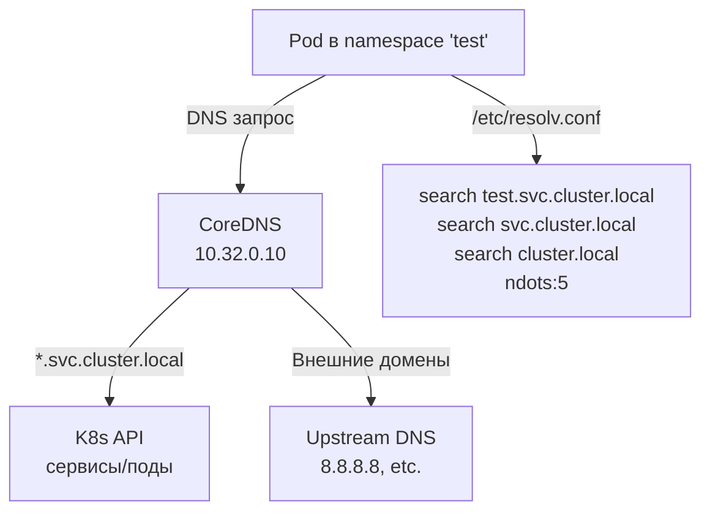

# DNS в Kubernetes — Обнаружение сервисов и подов

> 📌 Kubernetes автоматически создаёт DNS-записи для **сервисов** и **подов**. По умолчанию используется `ClusterFirst` политика — все запросы к `*.svc.cluster.local` идут в CoreDNS, остальное — во внешний DNS.
> 
> **Формат DNS-имён**:
> - Сервис: `<service-name>.<namespace>.svc.cluster.local`
> - Под (с hostname/subdomain): `<hostname>.<subdomain>.<namespace>.svc.cluster.local`
> - Под (без hostname): `<pod-ip-dashed>.<namespace>.pod.cluster.local`

---

## 🔹 Базовые концепции

### Как работает DNS в K8s



### resolv.conf в поде

```bash
# Внутри пода
cat /etc/resolv.conf
# nameserver 10.32.0.10
# search test.svc.cluster.local svc.cluster.local cluster.local
# options ndots:5
```

**Что это значит:**
- `nameserver 10.32.0.10` — CoreDNS (кластерный DNS)
- `search ...` — суффиксы для коротких имён (если запросишь `my-svc`, попробует `my-svc.test.svc.cluster.local`, потом `my-svc.svc.cluster.local` и т.д.)
- `ndots:5` — если в имени меньше 5 точек, попробуй search-суффиксы

---

## 🔹 DNS для сервисов

### Обычные сервисы (ClusterIP)

**Формат DNS-имени:**
```
<service-name>.<namespace>.svc.cluster.local
```

**Пример:**
```yaml
apiVersion: v1
kind: Service
metadata:
  name: my-service
  namespace: default
spec:
  selector:
    app: my-app
  ports:
  - port: 80
```

**DNS-записи:**
```bash
# A/AAAA запись (ClusterIP)
nslookup my-service.default.svc.cluster.local
# Name: my-service.default.svc.cluster.local
# Address: 10.96.0.15

# Короткое имя (в том же namespace)
nslookup my-service
# Name: my-service.default.svc.cluster.local
# Address: 10.96.0.15

# Cross-namespace
nslookup my-service.default
# Name: my-service.default.svc.cluster.local
# Address: 10.96.0.15
```

### Headless сервисы (clusterIP: None)

**Формат DNS-имени:** тот же, но возвращает **все IP подов**, а не ClusterIP.

```yaml
apiVersion: v1
kind: Service
metadata:
  name: headless-svc
  namespace: default
spec:
  clusterIP: None              # ← ключевое поле!
  selector:
    app: my-app
  ports:
  - port: 80
```

**DNS-записи:**
```bash
# A/AAAA записи (все IP подов)
nslookup headless-svc.default.svc.cluster.local
# Name: headless-svc.default.svc.cluster.local
# Address: 10.244.1.5
# Address: 10.244.2.7
# Address: 10.244.3.9
```

**Когда использовать:**
- StatefulSet (каждый под имеет стабильное DNS-имя)
- Client-side load balancing (клиент сам выбирает, к какому поду подключиться)
- Service discovery через DNS (без kube-proxy)

### SRV записи (для именованных портов)

**Формат:**
```
_<port-name>._<protocol>.<service-name>.<namespace>.svc.cluster.local
```

**Пример:**
```yaml
apiVersion: v1
kind: Service
metadata:
  name: my-service
spec:
  selector:
    app: my-app
  ports:
  - name: http              # ← имя порта
    port: 80
    protocol: TCP
  - name: https
    port: 443
    protocol: TCP
```

**DNS-записи:**
```bash
# SRV запись для порта "http"
nslookup -type=SRV _http._tcp.my-service.default.svc.cluster.local
# _http._tcp.my-service.default.svc.cluster.local  SRV  0 100 80 my-service.default.svc.cluster.local

# Для headless сервиса — SRV для каждого пода
nslookup -type=SRV _http._tcp.headless-svc.default.svc.cluster.local
# _http._tcp.headless-svc.default.svc.cluster.local  SRV  0 33 80 pod-1.headless-svc.default.svc.cluster.local
# _http._tcp.headless-svc.default.svc.cluster.local  SRV  0 33 80 pod-2.headless-svc.default.svc.cluster.local
```

---

## 🔹 DNS для подов

### Базовый формат (без hostname/subdomain)

**Формат:**
```
<pod-ip-dashed>.<namespace>.pod.cluster.local
```

**Пример:**
```bash
# Под с IP 10.244.1.5 в namespace default
nslookup 10-244-1-5.default.pod.cluster.local
# Name: 10-244-1-5.default.pod.cluster.local
# Address: 10.244.1.5
```

> ⚠️ **Важно**: точки в IP заменяются на дефисы (`10.244.1.5` → `10-244-1-5`).

### С hostname и subdomain

**Формат:**
```
<hostname>.<subdomain>.<namespace>.svc.cluster.local
```

**Пример:**
```yaml
apiVersion: v1
kind: Service
metadata:
  name: my-subdomain
spec:
  clusterIP: None              # ← headless сервис обязателен!
  selector:
    app: my-app
  ports:
  - port: 80
---
apiVersion: v1
kind: Pod
metadata:
  name: my-pod
  labels:
    app: my-app
spec:
  hostname: my-host            # ← кастомное имя хоста
  subdomain: my-subdomain      # ← должно совпадать с именем headless сервиса
  containers:
  - name: app
    image: nginx
```

**DNS-записи:**
```bash
# FQDN пода
nslookup my-host.my-subdomain.default.svc.cluster.local
# Name: my-host.my-subdomain.default.svc.cluster.local
# Address: 10.244.1.5

# Внутри пода
hostname
# my-host

hostname --fqdn
# my-host.my-subdomain.default.svc.cluster.local
```

### setHostnameAsFQDN (v1.22+)

> **Фича**: установить FQDN как hostname (вместо короткого имени).

```yaml
apiVersion: v1
kind: Pod
metadata:
  name: my-pod
spec:
  hostname: my-host
  subdomain: my-subdomain
  setHostnameAsFQDN: true      # ← FQDN как hostname
  containers:
  - name: app
    image: nginx
```

**Что изменится:**
```bash
# Внутри пода
hostname
# my-host.my-subdomain.default.svc.cluster.local  ← FQDN!

hostname --fqdn
# my-host.my-subdomain.default.svc.cluster.local
```

**Ограничение:**
- FQDN не должен превышать **64 символа** (лимит Linux kernel)
- Если длиннее → под не запустится (ошибка `ContainerCreating`)

---

## 🔹 Namespaces и DNS

### Поиск в пределах namespace

```bash
# Под в namespace "test"
nslookup my-service
# Пробует: my-service.test.svc.cluster.local ✅

# Cross-namespace
nslookup my-service.default
# Пробует: my-service.default.svc.cluster.local ✅
```

### Полное имя (FQDN)

```bash
# Всегда работает, независимо от namespace
nslookup my-service.default.svc.cluster.local
# ✅
```

**Правило:**
- Короткое имя (`my-service`) — ищет в **текущем namespace**
- С namespace (`my-service.default`) — ищет в **указанном namespace**
- FQDN (`my-service.default.svc.cluster.local`) — **всегда работает**

---

## 🔹 dnsPolicy — политика DNS

| Политика | Поведение | Когда использовать |
|----------|-----------|-------------------|
| **`ClusterFirst`** (по умолчанию) | Запросы к `*.cluster.local` → CoreDNS, остальное → upstream DNS | 99% случаев |
| **`Default`** | Наследует DNS от ноды (игнорирует CoreDNS) | Редко, для специфичных сценариев |
| **`ClusterFirstWithHostNet`** | Как ClusterFirst, но для подов с `hostNetwork: true` | Поды с `hostNetwork: true` |
| **`None`** | Игнорирует K8s DNS, использует только `dnsConfig` | Кастомная DNS конфигурация |

### Пример: ClusterFirstWithHostNet

```yaml
apiVersion: v1
kind: Pod
metadata:
  name: hostnet-pod
spec:
  hostNetwork: true            # ← под использует сеть ноды
  dnsPolicy: ClusterFirstWithHostNet  # ← обязательно для hostNetwork!
  containers:
  - name: app
    image: nginx
```

**Почему важно:**
- Без `ClusterFirstWithHostNet` под с `hostNetwork: true` будет использовать `Default` политику
- Это значит, что он **не сможет резолвить сервисы K8s** (`my-service.default.svc.cluster.local`)

---

## 🔹 dnsConfig — кастомная DNS конфигурация

> Позволяет полностью контролировать DNS-настройки пода.

### Пример: кастомные nameservers и search domains

```yaml
apiVersion: v1
kind: Pod
metadata:
  name: custom-dns-pod
spec:
  dnsPolicy: "None"            # ← обязательно для dnsConfig!
  dnsConfig:
    nameservers:
    - 192.0.2.1                # ← кастомный DNS-сервер
    - 8.8.8.8                  # ← Google DNS
    searches:
    - ns1.svc.cluster.local
    - my.dns.search.suffix
    options:
    - name: ndots
      value: "2"
    - name: edns0
  containers:
  - name: app
    image: nginx
```

**Результат в `/etc/resolv.conf`:**
```bash
nameserver 192.0.2.1
nameserver 8.8.8.8
search ns1.svc.cluster.local my.dns.search.suffix
options ndots:2 edns0
```

### Пример: добавить upstream DNS к ClusterFirst

```yaml
apiVersion: v1
kind: Pod
metadata:
  name: hybrid-dns-pod
spec:
  dnsPolicy: ClusterFirst      # ← используем CoreDNS
  dnsConfig:
    nameservers:
    - 8.8.8.8                  # ← добавляем Google DNS
    searches:
    - external.example.com     # ← добавляем search domain
  containers:
  - name: app
    image: nginx
```

**Результат:**
```bash
nameserver 10.32.0.10          # ← CoreDNS (от ClusterFirst)
nameserver 8.8.8.8             # ← Google DNS (от dnsConfig)
search default.svc.cluster.local svc.cluster.local cluster.local external.example.com
options ndots:5
```

---

## 🔹 Ограничения

| Ограничение | Значение | Примечания |
|-------------|----------|------------|
| **Длина FQDN** | ≤ 64 символа | Лимит Linux kernel (`nodename`) |
| **Количество search domains** | ≤ 32 | Лимит resolv.conf |
| **Общая длина search domains** | ≤ 2048 символов | Лимит resolv.conf |
| **Количество nameservers** | ≤ 3 | Лимит resolv.conf |
| **Поды с hostNetwork** | Нужен `ClusterFirstWithHostNet` | Иначе не будет резолвить сервисы K8s |

### Ошибка: FQDN слишком длинный

```bash
kubectl describe pod my-pod
# Events:
#   Warning  FailedCreatePodSandBox  23s  kubelet
#   Failed to create pod sandbox: rpc error: code = Unknown desc = 
#   failed to setup network for sandbox: FQDN too long (max 64, got 70)
```

**Решение:**
- Сократить имя пода, namespace или cluster domain
- Или не использовать `setHostnameAsFQDN: true`

---

## 🔹 Troubleshooting

### Проблема 1: Под не может резолвить сервис

```bash
# 1. Проверить, что CoreDNS работает
kubectl get pods -n kube-system -l k8s-app=kube-dns
# NAME                       READY   STATUS    RESTARTS   AGE
# coredns-5d78c9869d-abc12   1/1     Running   0          10d

# 2. Проверить resolv.conf в поде
kubectl exec -it my-pod -- cat /etc/resolv.conf
# nameserver 10.32.0.10
# search default.svc.cluster.local svc.cluster.local cluster.local
# options ndots:5

# 3. Проверить DNS из пода
kubectl exec -it my-pod -- nslookup my-service.default.svc.cluster.local
# Server:    10.32.0.10
# Address 1: 10.32.0.10 kube-dns.kube-system.svc.cluster.local
# Name:      my-service.default.svc.cluster.local
# Address 1: 10.96.0.15 my-service.default.svc.cluster.local

# 4. Проверить, что сервис существует
kubectl get svc my-service -n default

# 5. Проверить логи CoreDNS
kubectl logs -n kube-system deployment/coredns
```

### Проблема 2: Под с hostNetwork не резолвит сервисы K8s

```bash
# Проверить dnsPolicy
kubectl get pod my-pod -o jsonpath='{.spec.dnsPolicy}'
# Default  ← проблема!

# Решение: изменить на ClusterFirstWithHostNet
kubectl patch pod my-pod --type='merge' -p '{"spec":{"dnsPolicy":"ClusterFirstWithHostNet"}}'
# Или пересоздать под с правильной политикой
```

### Проблема 3: Cross-namespace DNS не работает

```bash
# Проверить, что используешь полное имя
kubectl exec -it my-pod -- nslookup my-service.other-namespace.svc.cluster.local

# Если не работает — проверить, что сервис существует в другом namespace
kubectl get svc my-service -n other-namespace

# Проверить NetworkPolicy (если используется)
kubectl get networkpolicy -n other-namespace
# Возможно, трафик заблокирован
```

### Проблема 4: DNS работает медленно

```bash
# Проверить ndots в resolv.conf
kubectl exec -it my-pod -- cat /etc/resolv.conf | grep ndots
# options ndots:5  ← по умолчанию

# Проблема: ndots:5 означает, что для коротких имён (например, "google.com")
# CoreDNS попробует 5 search-суффиксов, прежде чем отправить во внешний DNS

# Решение: уменьшить ndots через dnsConfig
kubectl patch pod my-pod --type='merge' -p '{
  "spec": {
    "dnsConfig": {
      "options": [
        {"name": "ndots", "value": "2"}
      ]
    }
  }
}'
```

### Диагностика через CoreDNS

```bash
# Посмотреть конфигурацию CoreDNS
kubectl get configmap coredns -n kube-system -o yaml

# Проверить, какие записи есть в CoreDNS
kubectl exec -n kube-system deployment/coredns -- nslookup my-service.default.svc.cluster.local

# Проверить логи CoreDNS на ошибки
kubectl logs -n kube-system deployment/coredns | grep -i error
```

---

## 🔹 Шпаргалка kubectl

```bash
# 1. Проверить, что CoreDNS работает
kubectl get pods -n kube-system -l k8s-app=kube-dns

# 2. Посмотреть resolv.conf в поде
kubectl exec -it <pod-name> -- cat /etc/resolv.conf

# 3. Проверить DNS из пода
kubectl exec -it <pod-name> -- nslookup <service-name>
kubectl exec -it <pod-name> -- nslookup <service-name>.<namespace>.svc.cluster.local

# 4. Проверить SRV записи
kubectl exec -it <pod-name> -- nslookup -type=SRV _<port-name>._tcp.<service-name>.<namespace>.svc.cluster.local

# 5. Проверить конфигурацию CoreDNS
kubectl get configmap coredns -n kube-system -o yaml

# 6. Посмотреть логи CoreDNS
kubectl logs -n kube-system deployment/coredns

# 7. Перезапустить CoreDNS (если нужно)
kubectl rollout restart deployment/coredns -n kube-system

# 8. Проверить dnsPolicy пода
kubectl get pod <pod-name> -o jsonpath='{.spec.dnsPolicy}'

# 9. Проверить dnsConfig пода
kubectl get pod <pod-name> -o jsonpath='{.spec.dnsConfig}'

# 10. Найти поды с кастомной DNS конфигурацией
kubectl get pods -A -o json | jq -r '.items[] | select(.spec.dnsConfig != null) | "\(.metadata.namespace)/\(.metadata.name)"'

# 11. Найти поды с hostNetwork
kubectl get pods -A -o json | jq -r '.items[] | select(.spec.hostNetwork == true) | "\(.metadata.namespace)/\(.metadata.name)"'

# 12. Проверить, какие сервисы есть в namespace
kubectl get svc -n <namespace>

# 13. Проверить endpoints сервиса (IP подов)
kubectl get endpoints <service-name> -n <namespace>

# 14. Проверить DNS-записи для headless сервиса
kubectl exec -it <pod-name> -- nslookup <headless-service-name>.<namespace>.svc.cluster.local

# 15. Тест DNS из пода (через nslookup)
kubectl run dns-test --rm -it --image=busybox -- nslookup kubernetes.default.svc.cluster.local
```

---

## 🔹 Чек-лист: Best Practices

```text
[ ] Используй FQDN для cross-namespace запросов (<service>.<namespace>.svc.cluster.local)
[ ] Для подов с hostNetwork: true → dnsPolicy: ClusterFirstWithHostNet
[ ] Для StatefulSet → используй headless сервис + hostname/subdomain
[ ] Для client-side load balancing → headless сервис (clusterIP: None)
[ ] Для кастомной DNS → dnsPolicy: None + dnsConfig
[ ] Не используй IP-адреса подов напрямую — используй DNS
[ ] Для оптимизации DNS → уменьши ndots (если много внешних запросов)
[ ] Мониторь CoreDNS (метрики, логи)
[ ] Для production → настрой CoreDNS с репликами (HA)
[ ] Для кастомных доменов → настрой CoreDNS с custom zones
[ ] Проверяй длину FQDN (≤ 64 символа) при использовании setHostnameAsFQDN
[ ] Для Windows подов → учитывай ограничения (нет ClusterFirstWithHostNet, один search domain)
```

> 💡 **Совет для Obsidian**:
> - Сделай перекрёстные ссылки: `[[02.service]]`, `[[04.network_policy]]`, `[[01.networking_overview]]`.
> - Добавь блок «Наш cluster domain»: какой домен используется (обычно `cluster.local`).
> - Добавь блок «CoreDNS конфигурация»: кастомные zones, forward rules.
> - Добавь блок «Частые DNS-имена»: список сервисов и их FQDN, которые часто используются.

---

## 🔹 Windows особенности

| Ограничение | Описание |
|-------------|----------|
| **Нет `ClusterFirstWithHostNet`** | Windows не поддерживает эту политику |
| **Один search domain** | Windows может использовать только один search domain (namespace) |
| **FQDN resolution** | Windows резолвит только полные имена (с точкой в конце) или короткие имена |
| **Частичные имена** | `my-service.default` может не работать, используй FQDN |

**Рекомендация:**
- Всегда используй **FQDN** в Windows подах
- Используй `Resolve-DnsName` (PowerShell) вместо `nslookup` для диагностики

---

## 🔹 Ключевые выводы

1. **DNS для сервисов**: `<service>.<namespace>.svc.cluster.local` → ClusterIP (обычный) или все IP подов (headless).
2. **DNS для подов**: `<hostname>.<subdomain>.<namespace>.svc.cluster.local` (если есть hostname/subdomain) или `<pod-ip-dashed>.<namespace>.pod.cluster.local`.
3. **Headless сервисы** (`clusterIP: None`) — возвращают все IP подов, используются для StatefulSet и client-side load balancing.
4. **SRV записи** — для именованных портов, формат: `_<port>._<proto>.<service>.<namespace>.svc.cluster.local`.
5. **dnsPolicy**: `ClusterFirst` (по умолчанию), `ClusterFirstWithHostNet` (для hostNetwork), `Default` (от ноды), `None` (кастомная).
6. **dnsConfig** — кастомная DNS конфигурация (nameservers, searches, options).
7. **Namespaces**: короткие имена ищутся в текущем namespace, cross-namespace — через `<service>.<namespace>` или FQDN.
8. **Ограничения**: FQDN ≤ 64 символа, search domains ≤ 32, nameservers ≤ 3.
9. **Troubleshooting**: проверка CoreDNS, resolv.conf, nslookup из пода, логи CoreDNS.
10. **Windows**: ограничения на dnsPolicy, один search domain, используй FQDN.