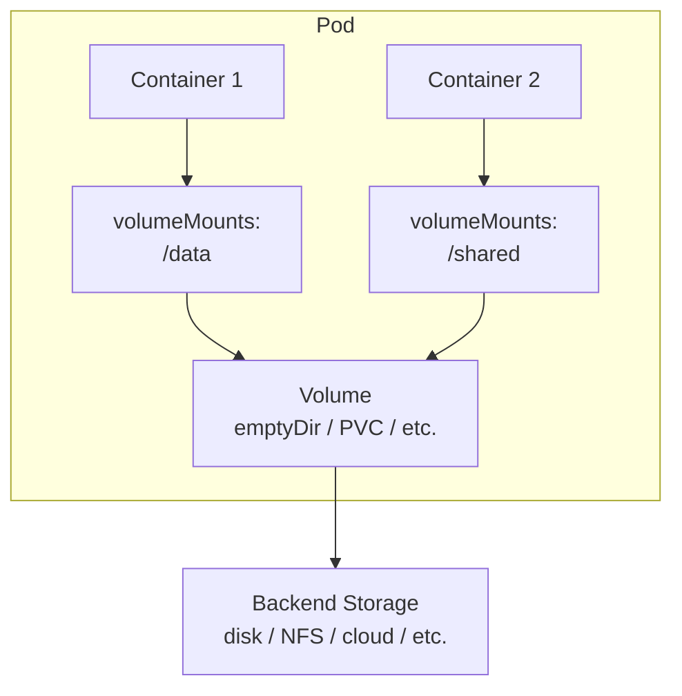

# Volumes — Тома в Kubernetes

> 📌 `Volume` — абстракция для доступа к файловой системе из контейнеров. Решает 2 проблемы: (1) **сохранение данных** при перезапуске контейнера, (2) **общее хранилище** между контейнерами в поде. Типы томов: `emptyDir` (временный), `hostPath` (файлы ноды), `configMap`/`secret` (конфиги), `persistentVolumeClaim` (постоянное хранилище), `nfs`/`iscsi`/`csi` (сетевые хранилища).

---

## 🔹 Зачем нужны тома

| Проблема в контейнерах | Решение через Volume |
|------------------------|---------------------|
| Файлы в контейнере **эфемерны** — при перезапуске всё теряется | Volume сохраняет данные вне контейнера |
| Несколько контейнеров в Pod не могут обмениваться файлами | Volume монтируется в несколько контейнеров |
| Нужен доступ к ConfigMap/Secret как к файлам | `configMap`/`secret` volume |
| Нужно постоянное хранилище (БД, логи) | `persistentVolumeClaim` volume |
| Нужен доступ к файлам ноды (логи, конфиги) | `hostPath` volume (⚠️ опасно!) |



---

## 🔹 Как работают тома

**Базовая структура:**
```yaml
apiVersion: v1
kind: Pod
metadata:
  name: my-pod
spec:
  containers:
  - name: app
    image: nginx
    volumeMounts:                    # ← куда монтировать в контейнере
    - name: my-volume
      mountPath: /data
      readOnly: true                 # ← опционально
  volumes:                           # ← что монтировать
  - name: my-volume
    emptyDir: {}                     # ← тип тома и его параметры
```

**Ключевые правила:**
1. **Volume монтируется в каждый контейнер отдельно** через `volumeMounts`
2. **Тома не могут монтироваться внутрь других томов** (используй `subPath`)
3. **Жизненный цикл**:
   - Эфемерные тома (`emptyDir`, `configMap`) — живут пока жив Pod
   - Постоянные тома (`persistentVolumeClaim`) — живут дольше Pod

---

## 🔹 Классификация томов

| Категория | Типы томов | Жизненный цикл | Пример использования |
|-----------|------------|----------------|---------------------|
| **Эфемерные (временные)** | `emptyDir`, `configMap`, `secret`, `downwardAPI`, `projected`, `image` | Пока жив Pod | Кэш, временные файлы, конфиги |
| **Постоянные** | `persistentVolumeClaim`, `local`, `nfs`, `iscsi`, `csi` | Переживает Pod | БД, логи, пользовательские данные |
| **Хостовые** | `hostPath` | Зависит от ноды | Системные логи, конфиги ноды |

---

## 🔹 1. emptyDir — временное хранилище

> Создаётся при назначении Pod на ноду. **Удаляется при удалении Pod**. Контейнеры в Pod могут читать/писать в него.

### Базовый пример

```yaml
apiVersion: v1
kind: Pod
metadata:
  name: emptydir-demo
spec:
  containers:
  - name: app
    image: nginx
    volumeMounts:
    - name: cache-volume
      mountPath: /cache
  - name: sidecar
    image: busybox
    command: ["sh", "-c", "while true; do echo $(date) >> /cache/timestamps.txt; sleep 5; done"]
    volumeMounts:
    - name: cache-volume
      mountPath: /cache
  volumes:
  - name: cache-volume
    emptyDir: {}
```

**Что произойдёт:**
- Оба контейнера видят `/cache` как общую папку
- Sidecar пишет в `/cache/timestamps.txt`, app может читать
- При удалении Pod — всё удаляется

### emptyDir с лимитом размера

```yaml
volumes:
- name: cache-volume
  emptyDir:
    sizeLimit: 500Mi    # ← ограничить размер (рекомендуется!)
```

### emptyDir в памяти (tmpfs)

```yaml
volumes:
- name: cache-volume
  emptyDir:
    medium: Memory      # ← использовать RAM вместо диска
    sizeLimit: 500Mi    # ← обязательно указать лимит!
```

**Особенности:**
- ✅ Очень быстро (RAM)
- ⚠️ Считается в `limits.memory` контейнера
- ⚠️ При перезапуске ноды — данные теряются

**Когда использовать:**
- Кэш, временные файлы
- Сортировка больших файлов (merge sort)
- Чекпоинты для долгих вычислений

---

## 🔹 2. hostPath — доступ к файловой системе ноды

> Монтирует файл/каталог с хост-машины (ноды) в Pod.

### ⚠️ Предупреждения по безопасности

```text
❌ НЕ используй hostPath без крайней необходимости!
❌ Контейнер получает доступ к файловой системе ноды
❌ Может раскрыть креды kubelet, socket контейнерного runtime
❌ Pod с одинаковым манифестом ведёт себя по-разному на разных нодах
❌ Не считается в ephemeral-storage — может заполнить диск ноды

✅ Альтернативы:
- Для логов → DaemonSet + emptyDir + sidecar
- Для конфигов → ConfigMap/Secret
- Для постоянного хранилища → PersistentVolume (local или CSI)
```

### Пример: доступ к логам ноды (read-only)

```yaml
apiVersion: v1
kind: Pod
metadata:
  name: log-collector
spec:
  containers:
  - name: fluentd
    image: fluentd:v1.14
    volumeMounts:
    - name: varlog
      mountPath: /var/log
      readOnly: true
  volumes:
  - name: varlog
    hostPath:
      path: /var/log
      type: Directory    # ← обязательная проверка: путь должен быть директорией
```

### Типы hostPath

| Тип | Поведение | Когда использовать |
|-----|-----------|-------------------|
| `""` (пусто) | Нет проверок (по умолчанию) | Legacy, не рекомендуется |
| **`DirectoryOrCreate`** | Создаёт пустую директорию, если не существует | Когда нужна гарантия существования |
| **`Directory`** | Путь должен быть директорией (иначе ошибка) | Когда важна строгая проверка |
| `FileOrCreate` | Создаёт пустой файл, если не существует | Для лог-файлов |
| `File` | Путь должен быть файлом | Для конфигов |
| `Socket` | Путь должен быть UNIX-сокетом | Для Docker socket (⚠️ опасно!) |
| `CharDevice` | Путь должен быть символьным устройством | Только Linux |
| `BlockDevice` | Путь должен быть блочным устройством | Только Linux |

### Пример: FileOrCreate

```yaml
volumes:
- name: mydir
  hostPath:
    path: /var/local/aaa
    type: DirectoryOrCreate    # ← создаст директорию, если нет
- name: myfile
  hostPath:
    path: /var/local/aaa/1.txt
    type: FileOrCreate         # ← создаст файл, если нет
```

> ⚠️ **Важно**: `FileOrCreate` не создаёт родительскую директорию! Если `/var/local/aaa` нет — Pod не запустится.

---

## 🔹 3. configMap / secret — конфиги и секреты как файлы

> Монтирует данные из ConfigMap/Secret как файлы в контейнере.

### Пример: ConfigMap как файлы

```yaml
volumes:
- name: config-volume
  configMap:
    name: log-config
    items:                    # ← опционально: монтировать только конкретные ключи
    - key: log_level
      path: log_level.conf    # ← имя файла в контейнере
    - key: app.properties
      path: config/app.properties
```

**Особенности:**
- ✅ Всегда **read-only**
- ✅ Автоматически обновляется при изменении ConfigMap (кроме `subPath`)
- ⚠️ Текстовые данные — UTF-8, для бинарных используй `binaryData`

### Пример: Secret как файлы

```yaml
volumes:
- name: secret-volume
  secret:
    secretName: tls-secret
    defaultMode: 0400         # ← права доступа к файлам
```

**Особенности:**
- ✅ Хранится в `tmpfs` (RAM), не на диске
- ✅ Всегда **read-only**
- ✅ Автоматически удаляется при удалении Pod

---

## 🔹 4. downwardAPI — метаданные пода как файлы

> Передаёт информацию о Pod (имя, namespace, лейблы, аннотации) в контейнер как файлы.

### Пример

```yaml
apiVersion: v1
kind: Pod
metadata:
  name: downwardapi-demo
  labels:
    app: myapp
    tier: frontend
  annotations:
    build: "123"
spec:
  containers:
  - name: app
    image: nginx
    volumeMounts:
    - name: podinfo
      mountPath: /etc/podinfo
  volumes:
  - name: podinfo
    downwardAPI:
      items:
      - path: "name"
        fieldRef:
          fieldPath: metadata.name
      - path: "namespace"
        fieldRef:
          fieldPath: metadata.namespace
      - path: "labels"
        fieldRef:
          fieldPath: metadata.labels
      - path: "annotations"
        fieldRef:
          fieldPath: metadata.annotations
      - path: "cpu-limit"
        resourceFieldRef:
          containerName: app
          resource: limits.cpu
```

**Что будет в `/etc/podinfo/`:**
```
/etc/podinfo/
├── name           # "downwardapi-demo"
├── namespace      # "default"
├── labels         # "app=myapp\ntier=frontend"
├── annotations    # "build=123"
└── cpu-limit      # "500m"
```

**Когда использовать:**
- Sidecar-контейнерам нужно знать, в каком namespace они работают
- Приложению нужна информация о себе (имя, лейблы)
- Отладка и логирование

---

## 🔹 5. projected — объединение нескольких источников

> Объединяет несколько типов томов (`secret`, `configMap`, `downwardAPI`, `serviceAccountToken`) в одну директорию.

### Пример

```yaml
volumes:
- name: projected-volume
  projected:
    sources:
    - configMap:
        name: my-config
        items:
        - key: config.yaml
          path: config.yaml
    - secret:
        name: my-secret
        items:
        - key: password
          path: secret/password
    - downwardAPI:
        items:
        - path: "labels"
          fieldRef:
            fieldPath: metadata.labels
    - serviceAccountToken:
        path: token
        expirationSeconds: 3600
```

**Преимущества:**
- ✅ Все данные в одной директории
- ✅ Меньше volumeMounts в контейнере
- ✅ Можно комбинировать разные источники

---

## 🔹 6. persistentVolumeClaim — постоянное хранилище

> Ссылка на PersistentVolume (PV). **Данные переживают Pod**.

### Пример

```yaml
apiVersion: v1
kind: Pod
metadata:
  name: pvc-demo
spec:
  containers:
  - name: app
    image: postgres:15
    volumeMounts:
    - name: postgres-data
      mountPath: /var/lib/postgresql/data
  volumes:
  - name: postgres-data
    persistentVolumeClaim:
      claimName: my-pvc    # ← имя PersistentVolumeClaim
```

> 💡 **Подробнее**: PV/PVC/StorageClass — в следующем материале.

---

## 🔹 7. local — локальное хранилище ноды

> Монтирует локальный диск/директорию ноды. Используется только как **статический PersistentVolume**.

### Пример

```yaml
apiVersion: v1
kind: PersistentVolume
metadata:
  name: local-pv
spec:
  capacity:
    storage: 100Gi
  volumeMode: Filesystem
  accessModes:
  - ReadWriteOnce
  persistentVolumeReclaimPolicy: Delete
  storageClassName: local-storage
  local:
    path: /mnt/disks/ssd1    # ← путь на ноде
  nodeAffinity:              # ← обязательно! привязка к ноде
    required:
      nodeSelectorTerms:
      - matchExpressions:
        - key: kubernetes.io/hostname
          operator: In
          values:
          - example-node
```

**Особенности:**
- ✅ Высокая производительность (локальный диск)
- ⚠️ Привязан к конкретной ноде (если нода упадёт — данные недоступны)
- ⚠️ Нет динамического provision (только статический)
- ⚠️ Требует ручной очистки данных

**Когда использовать:**
- Высокопроизводительные БД (Cassandra, Elasticsearch)
- Распределённые хранилища (Ceph, GlusterFS)
- Когда нужна максимальная скорость I/O

---

## 🔹 8. nfs / iscsi — сетевые хранилища

### NFS (Network File System)

```yaml
volumes:
- name: nfs-volume
  nfs:
    server: my-nfs-server.example.com
    path: /my-nfs-volume
    readOnly: true
```

**Особенности:**
- ✅ Поддерживает **множественную запись** (ReadWriteMany)
- ⚠️ Нельзя указать mount options в Pod spec (только на сервере или через PV)
- ⚠️ Требует запущенный NFS-сервер

### iSCSI

```yaml
volumes:
- name: iscsi-volume
  iscsi:
    targetPortal: 10.0.0.1:3260
    portals: ['10.0.0.2:3260']    # ← multi-path
    iqn: iqn.2024-01.com.example:storage
    lun: 0
    fsType: ext4
    readOnly: false
```

**Особенности:**
- ✅ Поддерживает **read-only** множественное монтирование
- ⚠️ **read-write** — только один consumer
- ⚠️ Требует запущенный iSCSI-сервер

---

## 🔹 9. image — монтирование OCI-образов (v1.36+)

> **Новая фича**: монтирует содержимое OCI-образа (контейнера или артефакта) как read-only том.

### Пример

```yaml
apiVersion: v1
kind: Pod
metadata:
  name: image-volume-demo
spec:
  containers:
  - name: app
    image: debian
    volumeMounts:
    - name: artifact-volume
      mountPath: /artifact
  volumes:
  - name: artifact-volume
    image:
      reference: quay.io/myorg/artifact:v2    # ← OCI-образ
      pullPolicy: IfNotPresent
```

**Особенности:**
- ✅ Read-only (нельзя изменить содержимое)
- ✅ Использует те же credentials, что и для pull контейнеров
- ✅ Поддерживает `pullPolicy`: `Always`, `Never`, `IfNotPresent`
- ⚠️ `subPath` поддерживается только с v1.33+

**Когда использовать:**
- Распространение статических артефактов (конфиги, бинарники, модели ML)
- Sidecar-контейнеры с инструментами
- Когда нужно "упаковать" данные в образ и монтировать в Pod

---

## 🔹 10. CSI (Container Storage Interface) — современный стандарт

> Стандартный интерфейс для подключения внешних хранилищ. **Заменяет все встроенные плагины** (gcePersistentDisk, awsElasticBlockStore и т.д.).

### Пример использования через PVC

```yaml
# PersistentVolumeClaim
apiVersion: v1
kind: PersistentVolumeClaim
metadata:
  name: csi-pvc
spec:
  accessModes:
  - ReadWriteOnce
  resources:
    requests:
      storage: 10Gi
  storageClassName: csi-storage-class    # ← StorageClass с CSI-драйвером
---
# Pod
apiVersion: v1
kind: Pod
metadata:
  name: csi-demo
spec:
  containers:
  - name: app
    image: nginx
    volumeMounts:
    - name: csi-volume
      mountPath: /data
  volumes:
  - name: csi-volume
    persistentVolumeClaim:
      claimName: csi-pvc
```

### Популярные CSI-драйверы

| Провайдер | CSI-драйвер | Когда использовать |
|-----------|-------------|-------------------|
| **AWS** | `ebs.csi.aws.com` | EBS volumes в EKS |
| **GCP** | `pd.csi.storage.gke.io` | Persistent Disks в GKE |
| **Azure** | `disk.csi.azure.com` | Managed Disks в AKS |
| **Ceph** | `rbd.csi.ceph.com` | RBD volumes |
| **NetApp** | `csi.trident.netapp.io` | Trident |
| **Portworx** | `pxd.portworx.com` | Portworx |
| **Longhorn** | `driver.longhorn.io` | Longhorn |

**Преимущества CSI:**
- ✅ Независимость от версии Kubernetes
- ✅ Расширяемость (можно написать свой драйвер)
- ✅ Поддержка snapshot, clone, resize
- ✅ Raw block volumes

---

## 🔹 subPath и subPathExpr — монтирование подпути

> Позволяет монтировать **часть** тома, а не весь том целиком.

### subPath — статический подпуть

```yaml
apiVersion: v1
kind: Pod
metadata:
  name: subpath-demo
spec:
  containers:
  - name: mysql
    image: mysql
    volumeMounts:
    - name: site-data
      mountPath: /var/lib/mysql
      subPath: mysql              # ← монтировать только /mysql из тома
  - name: php
    image: php:7.0-apache
    volumeMounts:
    - name: site-data
      mountPath: /var/www/html
      subPath: html               # ← монтировать только /html из тома
  volumes:
  - name: site-data
    persistentVolumeClaim:
      claimName: my-site-data
```

**Структура на PVC:**
```
my-site-data/
├── mysql/       # ← видно только в mysql контейнере как /var/lib/mysql
│   └── ...
└── html/        # ← видно только в php контейнере как /var/www/html
    └── index.php
```

### ⚠️ Важное ограничение

```text
❌ Контейнеры, использующие subPath, НЕ получают автоматические обновления
   при изменении ConfigMap/Secret!

✅ Решение: монтировать весь том, а не subPath
```

### subPathExpr — динамический подпуть с переменными

> Использует переменные окружения для построения пути.

```yaml
apiVersion: v1
kind: Pod
metadata:
  name: pod1
spec:
  containers:
  - name: app
    image: busybox
    env:
    - name: POD_NAME
      valueFrom:
        fieldRef:
          fieldPath: metadata.name
    command: ["sh", "-c", "echo 'Hello' > /logs/hello.txt"]
    volumeMounts:
    - name: workdir
      mountPath: /logs
      subPathExpr: $(POD_NAME)    # ← создаст директорию с именем пода
  volumes:
  - name: workdir
    hostPath:
      path: /var/log/pods
```

**Результат на хосте:**
```
/var/log/pods/
└── pod1/           # ← директория создана динамически
    └── hello.txt
```

> 💡 **Синтаксис**: Используй круглые скобки `$(VAR)`, а не фигурные `${VAR}`.

---

## 🔹 mountPropagation — распространение монтирования

> Контролирует, видны ли монтирования, созданные контейнером, на хосте и в других контейнерах.

| Режим | Поведение | Когда использовать |
|-------|-----------|-------------------|
| **`None`** (по умолчанию) | Монтирования контейнера **не видны** на хосте | Большинство случаев |
| **`HostToContainer`** | Монтирования хоста **видны** в контейнере | Когда хост монтирует что-то в том |
| **`Bidirectional`** | Монтирования контейнера **видны** на хосте и в других Pod | CSI/FlexVolume драйверы, ⚠️ опасно! |

### Пример: Bidirectional (для CSI-драйвера)

```yaml
containers:
- name: csi-driver
  image: csi-driver:latest
  securityContext:
    privileged: true              # ← обязательно для Bidirectional!
  volumeMounts:
  - name: mountpoint-dir
    mountPath: /var/lib/kubelet/pods
    mountPropagation: Bidirectional
```

> ⚠️ **Важно**: `Bidirectional` требует `privileged: true` и может повредить хостовую ОС. Используй только для CSI/FlexVolume драйверов.

---

## 🔹 readOnly и recursiveReadOnly

### readOnly — монтирование только для чтения

```yaml
volumeMounts:
- name: config-volume
  mountPath: /etc/config
  readOnly: true    # ← контейнер не может писать в этот mount
```

> ⚠️ **Важно**: `readOnly` делает **read-only только этот mount**, а не весь том. Другие контейнеры могут монтировать тот же том в read-write.

### recursiveReadOnly — рекурсивное read-only (v1.33+)

> **Новая фича**: делает монтирование рекурсивно read-only (включая submounts).

```yaml
apiVersion: v1
kind: Pod
metadata:
  name: rro-demo
spec:
  volumes:
  - name: mnt
    hostPath:
      path: /mnt    # ← на хосте в /mnt смонтирован tmpfs
  containers:
  - name: app
    image: busybox
    volumeMounts:
    # Рекурсивно read-only (включая /mnt/tmpfs)
    - name: mnt
      mountPath: /mnt-rro
      readOnly: true
      mountPropagation: None
      recursiveReadOnly: Enabled    # ← новая фича!
    
    # Обычное read-only (НЕ рекурсивно, /mnt/tmpfs будет writable!)
    - name: mnt
      mountPath: /mnt-ro
      readOnly: true
```

**Значения `recursiveReadOnly`:**
- **`Disabled`** (по умолчанию) — нет эффекта
- **`Enabled`** — рекурсивно read-only (требует Linux 5.12+, containerd 2.0+ или CRI-O 1.30+)
- **`IfPossible`** — пытается включить, если поддерживается, иначе fallback на `Disabled`

---

## 🔹 Чек-лист: Выбор типа тома

```text
[ ] Нужно временное хранилище для кэша/сортировки?
    → emptyDir (с sizeLimit!)

[ ] Нужно временное хранилище в RAM (быстро)?
    → emptyDir с medium: Memory (с sizeLimit!)

[ ] Нужно передать конфиг/секрет как файл?
    → configMap / secret volume

[ ] Нужно передать метаданные пода (имя, namespace)?
    → downwardAPI volume

[ ] Нужно объединить несколько источников?
    → projected volume

[ ] Нужно постоянное хранилище (БД, логи)?
    → persistentVolumeClaim (через CSI-драйвер)

[ ] Нужно высокопроизводительное локальное хранилище?
    → local volume (как статический PV)

[ ] Нужно общее хранилище для нескольких Pod (ReadWriteMany)?
    → nfs / csi (с поддержкой RWX)

[ ] Нужно смонтировать OCI-образ как файлы?
    → image volume (v1.36+)

[ ] Нужен доступ к файлам ноды?
    → hostPath (⚠️ только если абсолютно необходимо, read-only!)
```

---

## 🔹 Troubleshooting

### Проблема 1: Pod не запускается (MountVolume.SetUp failed)

```bash
# Проверить события пода
kubectl describe pod my-pod | grep -A 10 'Events:'

# Пример ошибки:
# Warning  FailedMount  23s  kubelet  MountVolume.SetUp failed for volume "my-volume" :
#   configmap "my-config" not found
```

**Причины:**
- ❌ ConfigMap/Secret не существует
- ❌ PVC не bound (нет подходящего PV)
- ❌ hostPath не существует (если type: Directory/File)

**Решения:**
1. Создать недостающий ConfigMap/Secret
2. Проверить статус PVC: `kubectl get pvc`
3. Проверить, что путь на ноде существует

### Проблема 2: Контейнер не видит обновления ConfigMap

```bash
# Проверить, используется ли subPath
kubectl get pod my-pod -o jsonpath='{.spec.containers[*].volumeMounts[*].subPath}'

# Если subPath указан — обновления НЕ работают!
# Решение: монтировать весь том, а не subPath
```

### Проблема 3: emptyDir заполнил диск ноды

```bash
# Проверить использование ephemeral-storage
kubectl describe node <node-name> | grep -A 10 'Allocated resources:'

# Решение:
# 1. Указать sizeLimit для emptyDir
# 2. Настроить ResourceQuota для ephemeral-storage
# 3. Использовать LimitRange
```

### Проблема 4: hostPath не работает

```bash
# Проверить, что путь существует на ноде
kubectl debug node/<node-name> -it --image=busybox
# Внутри debug-пода:
ls -la /host/<path>

# Проверить права доступа
# Если файл принадлежит root — нужен privileged контейнер или изменить права
```

---

## 🔹 Шпаргалка: Полезные команды kubectl

```bash
# 1. Посмотреть volumes в Pod
kubectl get pod <pod-name> -o jsonpath='{.spec.volumes[*].name}'

# 2. Посмотреть volumeMounts в контейнере
kubectl get pod <pod-name> -o jsonpath='{.spec.containers[*].volumeMounts}'

# 3. Проверить, какой тип volume используется
kubectl get pod <pod-name> -o jsonpath='{.spec.volumes[*].*}'

# 4. Посмотреть PVC, используемые в Pod
kubectl get pod <pod-name> -o jsonpath='{.spec.volumes[*].persistentVolumeClaim.claimName}'

# 5. Проверить статус PVC
kubectl get pvc <pvc-name>
kubectl describe pvc <pvc-name>

# 6. Посмотреть, какие CSI-драйверы установлены
kubectl get csidrivers

# 7. Проверить StorageClass
kubectl get storageclass
kubectl describe storageclass <sc-name>

# 8. Посмотреть PV, привязанные к PVC
kubectl get pv | grep <pvc-name>

# 9. Проверить использование ephemeral-storage
kubectl top pod <pod-name>
kubectl describe node <node-name> | grep -A 10 'Allocated resources:'

# 10. Войти в контейнер и проверить содержимое volume
kubectl exec -it <pod-name> -- ls -la /path/to/volume
```

---

## 🔹 Ключевые выводы

1. **Volume** — абстракция для доступа к файловой системе из контейнеров. Решает проблемы сохранения данных и общего хранилища.
2. **Типы томов**:
   - **Эфемерные**: `emptyDir`, `configMap`, `secret`, `downwardAPI`, `projected`, `image`
   - **Постоянные**: `persistentVolumeClaim`, `local`, `nfs`, `iscsi`, `csi`
   - **Хостовые**: `hostPath` (⚠️ опасно!)
3. **emptyDir**: временное хранилище, живёт пока жив Pod. Можно использовать RAM (`medium: Memory`).
4. **hostPath**: доступ к файлам ноды. **Не используй без крайней необходимости!**
5. **configMap/secret**: монтируются как read-only файлы. Обновляются автоматически (кроме `subPath`).
6. **downwardAPI**: передаёт метаданные пода (имя, namespace, лейблы) как файлы.
7. **projected**: объединяет несколько источников в одну директорию.
8. **persistentVolumeClaim**: ссылка на постоянное хранилище (PV). **Данные переживают Pod**.
9. **CSI**: современный стандарт для внешних хранилищ. **Заменяет все встроенные плагины**.
10. **subPath**: монтирует часть тома. **Не получает обновления ConfigMap/Secret!**
11. **subPathExpr**: динамический подпуть с переменными окружения.
12. **mountPropagation**: контролирует видимость монтирований. `Bidirectional` требует `privileged: true`.
13. **recursiveReadOnly** (v1.33+): рекурсивное read-only монтирование (включая submounts).