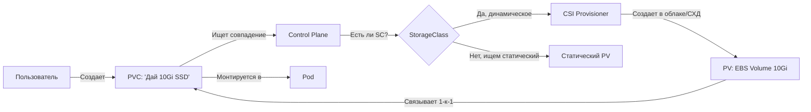

# Persistent Volumes (PV), PVC и StorageClass — Постоянное хранилище

> 📌 В K8s управление хранилищем отделено от вычислений. 
> - **PV (PersistentVolume)** — это само хранилище (ресурс кластера).
> - **PVC (PersistentVolumeClaim)** — это «заявка» пользователя на хранилище (ресурс namespace).
> - **StorageClass (SC)** — это «способ» динамического создания PV (профиль диска: SSD, HDD, скорость, тип).

---

## 🔹 Святая троица хранилища K8s

| Объект | Роль | Аналогия | Кто создает |
|--------|------|----------|-------------|
| **PersistentVolume (PV)** | Фактический кусок диска (NFS, EBS, Ceph) | Физический сервер / Диск | Админ кластера (статически) или Provisioner (динамически) |
| **PersistentVolumeClaim (PVC)** | Запрос на ресурсы (размер, режим доступа) | Заявка в IT-отдел | Пользователь (разработчик) |
| **StorageClass (SC)** | Параметры динамического создания (тип диска, IOPS) | Прайс-лист / Каталог товаров | Админ кластера |



---

## 🔹 Жизненный цикл PV и PVC

1. **Provisioning (Предоставление)**
   - **Статическое**: Админ вручную создает PV в API.
   - **Динамическое**: Пользователь создает PVC с указанием `storageClassName`. Если подходящего PV нет, CSI-драйвер автоматически создает том в облаке/СХД и соответствующий PV.
2. **Binding (Связывание)**
   - Control Plane находит свободный PV, который подходит под требования PVC (размер, режим доступа, SC) и связывает их 1-к-1.
   - Если PV не найден → PVC зависает в статусе `Pending`.
3. **Using (Использование)**
   - Pod монтирует PVC как том. PVC и Pod должны быть в **одном namespace**.
4. **Reclaiming (Освобождение)**
   - При удалении PVC срабатывает политика `persistentVolumeReclaimPolicy`.

---

## 🔹 Ключевые атрибуты томов

### 1. Режимы доступа (Access Modes)

| Режим | Аббр. | Описание | Поддержка (примеры) |
|-------|-------|----------|---------------------|
| **ReadWriteOnce** | **RWO** | Чтение/Запись **одним узлом** (но несколькими подами на этом узле) | EBS, Local, Ceph RBD |
| **ReadOnlyMany** | **ROX** | Только чтение **многими узлами** | NFS, CephFS |
| **ReadWriteMany** | **RWX** | Чтение/Запись **многими узлами** | NFS, CephFS, EFS, AzureFile |
| **ReadWriteOncePod** | **RWOP** | Чтение/Запись **строго одним Pod** во всем кластере (v1.29+) | CSI (требует новых версий csi-attacher) |

> ⚠️ **Важно**: Режим доступа **не гарантирует** защиту от записи на уровне файловой системы! Это лишь указание планировщику K8s, как монтировать том. Исключение — `RWOP`, который жестко блокирует доступ для других подов.

### 2. Режимы тома (Volume Modes)

| Режим | Описание | Когда использовать |
|-------|----------|-------------------|
| **`Filesystem`** (по умолчанию) | Том форматируется в ФС (ext4/xfs) и монтируется как директория | 99% приложений (БД, веб, логи) |
| **`Block`** | Том предоставляется как **сырое блочное устройство** (`/dev/xvda`) без ФС | Высоконагруженные БД, которые сами управляют ФС (Oracle, Cassandra) |

### 3. Политики возврата (Reclaim Policies)

| Политика | Что происходит при удалении PVC | Когда использовать |
|----------|---------------------------------|-------------------|
| **`Retain`** | PV переходит в статус `Released`. Данные **сохраняются**. Требует ручной очистки и удаления админом. | Production, критичные данные, бэкапы |
| **`Delete`** | PV и **физический том в облаке/СХД удаляются**. Данные теряются навсегда. | Dev/Test, динамические PVC (по умолчанию) |
| ~~`Recycle`~~ | ~~Выполнялся `rm -rf`~~ | **УСТАРЕЛО. Не используется.** |

---

## 🔹 Практика: YAML-манифесты

### Сценарий 1: Статический PV + PVC (NFS)

```yaml
# 1. Админ создает PV
apiVersion: v1
kind: PersistentVolume
metadata:
  name: nfs-pv
  labels:
    type: nfs
spec:
  capacity:
    storage: 10Gi
  volumeMode: Filesystem
  accessModes:
    - ReadWriteMany         # ← NFS поддерживает RWX
  persistentVolumeReclaimPolicy: Retain
  storageClassName: nfs-sc  # ← должен совпасть с PVC
  nfs:
    server: 192.168.1.100
    path: /exports/data
---
# 2. Пользователь создает PVC
apiVersion: v1
kind: PersistentVolumeClaim
metadata:
  name: nfs-pvc
spec:
  accessModes:
    - ReadWriteMany
  resources:
    requests:
      storage: 5Gi          # ← PV (10Gi) >= PVC (5Gi) -> СВЯЖЕТСЯ
  storageClassName: nfs-sc
  selector:                 # ← опционально: точный выбор по лейблам
    matchLabels:
      type: nfs
```

### Сценарий 2: Динамический PVC (Cloud Disk)

```yaml
# Пользователь НЕ создает PV. Он просто просит хранилище.
apiVersion: v1
kind: PersistentVolumeClaim
metadata:
  name: dynamic-pvc
spec:
  accessModes:
    - ReadWriteOnce         # ← EBS/GCP PD поддерживают только RWO
  resources:
    requests:
      storage: 20Gi
  storageClassName: fast-ssd  # ← CSI-драйвер сам создаст PV и диск в облаке
```

### Сценарий 3: Raw Block Volume (Сырое блочное устройство)

```yaml
apiVersion: v1
kind: PersistentVolumeClaim
metadata:
  name: block-pvc
spec:
  accessModes: [ReadWriteOnce]
  volumeMode: Block               # ← Ключевое отличие!
  resources:
    requests:
      storage: 50Gi
  storageClassName: fast-ssd
---
apiVersion: v1
kind: Pod
metadata:
  name: block-pod
spec:
  containers:
  - name: db
    image: postgres
    volumeDevices:                # ← volumeDevices, а НЕ volumeMounts!
    - name: data
      devicePath: /dev/xvda       # ← путь к сырому диску внутри контейнера
  volumes:
  - name: data
    persistentVolumeClaim:
      claimName: block-pvc
```

---

## 🔹 Продвинутые фичи

### 📈 Расширение томов (Volume Expansion)

> **Золотое правило**: **Всегда изменяй размер только в PVC!** Никогда не меняй `capacity` в PV вручную (это сломает автоматическое расширение).

```yaml
# 1. StorageClass должен разрешать расширение
apiVersion: storage.k8s.io/v1
kind: StorageClass
metadata:
  name: expandable-sc
provisioner: ebs.csi.aws.com
allowVolumeExpansion: true    # ← Обязательно!
---
# 2. Просто увеличь размер в PVC и примени
kubectl patch pvc my-pvc -p '{"spec":{"resources":{"requests":{"storage":"50Gi"}}}}'
```
**Нюансы:**
- Файловая система (ext4/xfs) расширится **только при следующем монтировании** (перезапуск пода) или на лету, если CSI и ядро поддерживают online resize.
- Уменьшить том **нельзя** (только удалить и создать заново).

### 📸 Снимки (Snapshots) и Клонирование

Требуют установленного CSI-драйвера и контроллеров snapshot'ов.

```yaml
# Клонирование PVC (создание нового PVC из существующего)
apiVersion: v1
kind: PersistentVolumeClaim
metadata:
  name: cloned-pvc
spec:
  storageClassName: fast-ssd
  accessModes: [ReadWriteOnce]
  resources:
    requests:
      storage: 10Gi
  dataSource:                   # ← Указываем источник
    name: original-pvc
    kind: PersistentVolumeClaim
```
> 💡 Для восстановления из снапшота используй `kind: VolumeSnapshot` и `apiGroup: snapshot.storage.k8s.io` в поле `dataSource`.

### 🔗 Pre-binding (Жесткая привязка)

Если нужно, чтобы конкретный PVC забрал конкретный PV (например, при миграции):
1. В PVC укажи `volumeName: <pv-name>` и `storageClassName: ""`.
2. В PV укажи `claimRef: { name: <pvc-name>, namespace: <ns> }`.

---

## 🔹 Фазы и Защита объектов (Finalizers)

### Фазы PV
| Фаза | Описание |
|------|----------|
| **Available** | Свободен, ждет PVC. |
| **Bound** | Связан с PVC. |
| **Released** | PVC удален, но том еще не очищен (политика `Retain`). **Не может быть повторно использован!** |
| **Failed** | Ошибка автоматической очистки. |

### Защита от случайного удаления
K8s использует **финализаторы**, чтобы не удалить PV/PVC, пока они используются:
- `kubernetes.io/pvc-protection` — не дает удалить PVC, пока есть Pod, который его монтирует. (PVC зависнет в `Terminating`).
- `kubernetes.io/pv-protection` — не дает удалить PV, пока он связан с PVC.
- `external-provisioner.volume.kubernetes.io/finalizer` — гарантирует, что физический том в облаке удалится только после удаления объекта PV в K8s.

---

## 🔹 Troubleshooting и шпаргалка kubectl

### Проблема 1: PVC в статусе `Pending`
```bash
# 1. Посмотреть, почему не bind'ится
kubectl describe pvc my-pvc | grep -A 10 'Events:'
# Частые причины:
# - Нет PV подходящего размера (для статического)
# - Не совпадает accessModes (например, просим RWX, а есть только RWO)
# - Не указан storageClassName, а дефолтного нет
# - CSI-драйвер упал и не может создать том (для динамического)

# 2. Проверить доступные PV
kubectl get pv
```

### Проблема 2: PVC завис в `Terminating`
```bash
# Причина: Pod все еще использует PVC, либо работает финализатор.
# 1. Найти Pod, который держит PVC
kubectl get pods --all-namespaces -o json | jq -r '.items[] | select(.spec.volumes[]?.persistentVolumeClaim.claimName == "my-pvc") | .metadata.name'

# 2. Если Pod в состоянии Terminating/Unknown — удалить принудительно
kubectl delete pod <pod-name> --force --grace-period=0

# 3. Если Pod удален, но PVC висит — снять финализатор (ОПАСНО!)
kubectl patch pvc my-pvc -p '{"metadata":{"finalizers":null}}'
```

### Шпаргалка команд
```bash
# 1. Список PVC и их статусов
kubectl get pvc -A

# 2. Список PV с привязкой и политикой возврата
kubectl get pv -o wide

# 3. Посмотреть StorageClass и параметры
kubectl get sc
kubectl describe sc <sc-name>

# 4. Проверить, используется ли PVC (требует v1.36+ alpha или внешних инструментов)
# В старых версиях ищем через Pod'ы:
kubectl get pods -A -o json | jq -r '.items[] | select(.spec.volumes[]?.persistentVolumeClaim != null) | {pod: .metadata.name, pvc: .spec.volumes[]?.persistentVolumeClaim.claimName}'

# 5. Расширить PVC (если SC позволяет)
kubectl patch pvc my-pvc -p '{"spec":{"resources":{"requests":{"storage":"100Gi"}}}}'

# 6. Посмотреть события CSI-драйвера (если PVC Pending при динамическом создании)
kubectl get events --field-selector reason=ProvisioningFailed
```

---

## 🔹 Чек-лист: Best Practices

```text
[ ] В манифестах приложений (Helm, Kustomize) создавай ТОЛЬКО PVC. Никогда не включай PV (это зона ответственности админа).
[ ] Не указывай `storageClassName` в шаблонах, если хочешь использовать дефолтный SC кластера.
[ ] Если указываешь `storageClassName`, убедись, что она существует в целевом кластере.
[ ] Для БД всегда используй `Retain` политику возврата (настраивается в StorageClass), чтобы не потерять данные при случайном удалении PVC.
[ ] Никогда не меняй `spec.capacity` в объекте PV вручную. Меняй только в PVC.
[ ] Если нужно гарантировать, что том читает/пишет только один Pod — используй `ReadWriteOncePod` (RWOP).
[ ] Для сырых блочных устройств (Block) помни, что приложение само должно уметь форматировать диск.
[ ] Проверяй, поддерживает ли твой CSI-драйвер Snapshots и Expansion (читай документацию вендора).
```

> 💡 **Совет для Obsidian**: 
> - Сделай перекрестные ссылки `[[04.volumes]]` (базовые тома) и `[[03.resource_management]]` (лимиты ephemeral-storage).
> - Добавь блок «Наши StorageClass»: какие классы есть в вашем кластере (например, `gp3`, `io2`, `nfs-default`), их параметры и где они используются.

---

## 🔹 Ключевые выводы

1. **PV/PVC/SC** разделяют ответственность: админ дает ресурсы, пользователь их потребляет, SC автоматизирует процесс.
2. **Динамическое provisioning** (через StorageClass) — стандарт для production. Статическое — только для legacy или специфичных NFS.
3. **Access Modes** (RWO, RWX) диктуют, как том можно монтировать. RWX нужен для общих файлов (NFS), RWO — для дисков (EBS).
4. **Защита**: Финализаторы не дают удалить PVC/PV, пока они используются подами или связаны друг с другом.
5. **Расширение**: Только через PVC! Требует `allowVolumeExpansion: true` в StorageClass. Уменьшение невозможно.
6. **Portable config**: Пиши манифесты так, чтобы они работали в любом кластере (не хардкодь PV, полагайся на дефолтный SC).