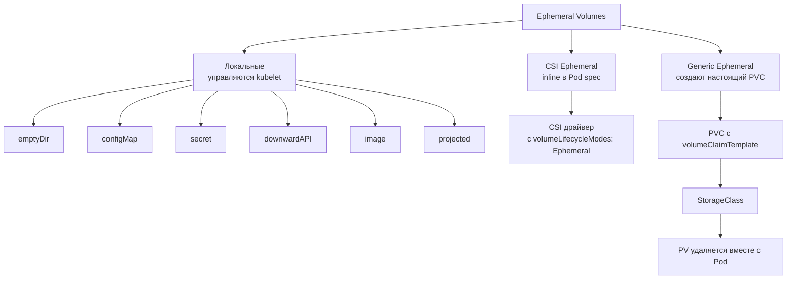
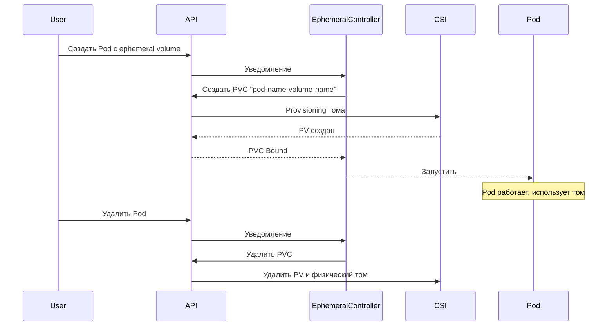

# Ephemeral Volumes — Эфемерные (временные) тома

> 📌 Эфемерные тома живут ровно столько, сколько Pod. Используются для кэша, scratch-данных, временных конфигов. 
> - **Локальные**: `emptyDir`, `configMap`, `secret`, `downwardAPI`, `image` (управляются kubelet).
> - **CSI Ephemeral**: создаются CSI-драйвером inline в Pod spec (для специфичных задач).
> - **Generic Ephemeral** ⭐: создают **настоящий PVC** автоматически (с поддержкой snapshot, clone, resize), но удаляют вместе с Podом.

---

## 🔹 Зачем нужны эфемерные тома

| Сценарий | Почему не подходит обычный PVC | Решение |
|----------|-------------------------------|---------|
| Кэш, scratch-файлы, temp-данные | Не нужно сохранять после перезапуска Pod | `emptyDir` или Generic Ephemeral |
| Нужен том с квотой размера, но без persistence | `emptyDir` не имеет жёсткого лимита на уровне хранилища | Generic Ephemeral с `storageClassName` |
| Нужны snapshot/clone/resize для временных данных | `emptyDir` этого не умеет | Generic Ephemeral |
| Конфиги, секреты, метаданные | Не нужно хранилище как таковое | `configMap`, `secret`, `downwardAPI` |
| Специфичные возможности CSI-драйвера (in-memory FS, шифрование) | Стандартные типы не поддерживают | CSI Ephemeral |

---

## 🔹 Классификация эфемерных томов



| Тип | Где указывается | Кто управляет | Persistence | Особенности |
|-----|-----------------|---------------|-------------|-------------|
| `emptyDir` | `volumes` в Pod | kubelet | ❌ Нет | Быстро, но нет квот на уровне хранилища |
| `configMap` / `secret` / `downwardAPI` | `volumes` в Pod | kubelet | ❌ Нет | Read-only, автообновление |
| `image` (v1.36+) | `volumes` в Pod | kubelet | ❌ Нет | Монтирует OCI-образ |
| **CSI Ephemeral** | `volumes.csi` в Pod | CSI-драйвер | ❌ Нет | Специфичные фичи драйвера |
| **Generic Ephemeral** ⭐ | `volumes.ephemeral` в Pod | CSI-драйвер + kubelet | ❌ Нет (но создаёт PVC) | Snapshot, clone, resize, квоты |

---

## 🔹 CSI Ephemeral Volumes (inline)

> **Стабильно с v1.25**. Позволяют CSI-драйверу создать том **прямо в Pod spec**, без PVC.

### Пример

```yaml
apiVersion: v1
kind: Pod
metadata:
  name: csi-ephemeral-pod
spec:
  containers:
  - name: app
    image: busybox
    volumeMounts:
    - name: csi-vol
      mountPath: /data
  volumes:
  - name: csi-vol
    csi:
      driver: inline.storage.kubernetes.io   # ← CSI-драйвер
      volumeAttributes:                       # ← параметры для драйвера
        foo: bar
        size: "1Gi"
```

### Когда использовать

- Драйвер предоставляет **специфичные возможности**: in-memory FS, шифрование на лету, специфичные типы носителей.
- Не нужно использовать стандартные операции (snapshot, clone).
- Админ доверяет пользователям передавать параметры драйверу.

### ⚠️ Ограничения и безопасность

```text
❌ volumeAttributes передаются НАПРЯМУЮ драйверу!
   Пользователь может указать параметры, которые обычно задаёт админ в StorageClass.

✅ Решения для админов:
1. Убрать "Ephemeral" из volumeLifecycleModes в CSIDriver
   → драйвер нельзя будет использовать inline
2. Использовать ValidatingAdmissionPolicy / webhook
   → ограничить допустимые volumeAttributes
```

### Пример CSIDriver с отключённым ephemeral

```yaml
apiVersion: storage.k8s.io/v1
kind: CSIDriver
metadata:
  name: my-driver
spec:
  volumeLifecycleModes:
  - Persistent        # ← только PVC, inline запрещено
  # - Ephemeral       # ← закомментировано
```

---

## 🔹 Generic Ephemeral Volumes ⭐ (рекомендуется)

> **Стабильно с v1.23**. **Самая мощная фича**: создаёт **настоящий PVC** автоматически, но удаляет его вместе с Pod.

### Ключевая идея

```yaml
volumes:
- name: scratch
  ephemeral:                    # ← ключевое слово!
    volumeClaimTemplate:        # ← шаблон PVC
      metadata:
        labels:
          app: my-app
      spec:
        accessModes: ["ReadWriteOnce"]
        storageClassName: "fast-ssd"
        resources:
          requests:
            storage: 5Gi
```

### Что происходит под капотом



### Преимущества перед `emptyDir`

| Характеристика | `emptyDir` | Generic Ephemeral |
|----------------|------------|-------------------|
| Квота размера | ⚠️ Только `sizeLimit` (soft limit) | ✅ Жёсткий лимит на уровне хранилища |
| Snapshot | ❌ | ✅ (если CSI поддерживает) |
| Clone | ❌ | ✅ |
| Resize | ❌ | ✅ (если SC позволяет) |
| Capacity tracking | ❌ | ✅ (через PVC status) |
| ResourceQuota | ⚠️ Только ephemeral-storage | ✅ Считается как PVC |
| Сетевое хранилище | ❌ Только локально | ✅ Любое (NFS, EBS, Ceph) |
| WaitForFirstConsumer | ❌ | ✅ (рекомендуется!) |

### Полный пример

```yaml
apiVersion: v1
kind: Pod
metadata:
  name: my-app
spec:
  containers:
  - name: app
    image: busybox
    command: ["sleep", "infinity"]
    volumeMounts:
    - name: scratch
      mountPath: /scratch
  volumes:
  - name: scratch
    ephemeral:
      volumeClaimTemplate:
        metadata:
          labels:
            app: my-app
            type: scratch
          annotations:
            description: "Temporary scratch space"
        spec:
          accessModes: ["ReadWriteOnce"]
          storageClassName: "scratch-storage-class"  # ← рекомендуется WaitForFirstConsumer
          resources:
            requests:
              storage: 5Gi
```

---

## 🔹 Жизненный цикл PVC

### Автоматическое создание и удаление

```text
1. Pod создан → Ephemeral Volume Controller создаёт PVC
   Имя PVC = "<pod-name>-<volume-name>"
   Пример: my-app-scratch

2. PVC связывается с PV (динамически или статически)

3. Pod запущен, использует PVC как обычный том

4. Pod удалён → Ephemeral Volume Controller удаляет PVC

5. PV удаляется согласно Reclaim Policy (обычно Delete)
```

### Именование PVC и конфликты

**Формула**: `<pod-name>-<volume-name>`

⚠️ **Опасность конфликтов**:
```text
Pod "pod-a" + volume "scratch"  → PVC "pod-a-scratch"
Pod "pod"    + volume "a-scratch" → PVC "pod-a-scratch"  ← КОНФЛИКТ!
```

**Как K8s разрешает конфликты:**
- Проверяет **ownerReferences** PVC
- Если PVC принадлежит другому Pod → новый Pod **не запустится**
- Существующий PVC **не перезаписывается**

**Best practice**: избегай таких имён Pod и volume, которые могут дать коллизию.

### Owner References

Автоматически созданный PVC имеет `ownerReferences` на Pod:
```yaml
apiVersion: v1
kind: PersistentVolumeClaim
metadata:
  name: my-app-scratch
  ownerReferences:
  - apiVersion: v1
    kind: Pod
    name: my-app
    uid: <pod-uid>
    controller: true
    blockOwnerDeletion: true
```

Это гарантирует, что PVC удалится **только вместе с Pod**.

---

## 🔹 WaitForFirstConsumer — критично для Generic Ephemeral

> **Рекомендуется** использовать StorageClass с `volumeBindingMode: WaitForFirstConsumer`.

### Почему?

```text
❌ Immediate binding (по умолчанию):
   1. PVC создан → том создаётся СРАЗУ
   2. Планировщик ищет ноду, к которой привязан том
   3. Если том в зоне A, а поды не могут там работать → Pod в Pending

✅ WaitForFirstConsumer:
   1. PVC создан → том НЕ создаётся
   2. Планировщик выбирает ноду для Pod
   3. Том создаётся в той же зоне/на той же ноде
   4. Всё работает!
```

### Пример StorageClass

```yaml
apiVersion: storage.k8s.io/v1
kind: StorageClass
metadata:
  name: scratch-storage-class
provisioner: ebs.csi.aws.com
volumeBindingMode: WaitForFirstConsumer   # ← обязательно для generic ephemeral!
allowVolumeExpansion: true
```

---

## 🔹 Quasi-ephemeral: Retain + Generic Ephemeral

> **Хак**: можно сделать том, который переживает Pod, но создаётся как эфемерный.

```yaml
# StorageClass с Retain
apiVersion: storage.k8s.io/v1
kind: StorageClass
metadata:
  name: retain-scratch
provisioner: ebs.csi.aws.com
reclaimPolicy: Retain              # ← ключевое!
volumeBindingMode: WaitForFirstConsumer
---
# Pod с generic ephemeral
apiVersion: v1
kind: Pod
metadata:
  name: my-app
spec:
  containers:
  - name: app
    image: busybox
    volumeMounts:
    - name: data
      mountPath: /data
  volumes:
  - name: data
    ephemeral:
      volumeClaimTemplate:
        spec:
          storageClassName: retain-scratch
          accessModes: [ReadWriteOnce]
          resources:
            requests:
              storage: 10Gi
```

**Что произойдёт:**
1. Pod удалён → PVC удалён (т.к. generic ephemeral)
2. PV переходит в статус `Released` (т.к. `reclaimPolicy: Retain`)
3. Физический том **сохраняется** в облаке
4. Админ может вручную привязать его к новому PV и восстановить данные

**Когда использовать**: отладка, миграция данных, "страховка" от случайного удаления.

---

## 🔹 Snapshot и Clone для Generic Ephemeral

> Generic Ephemeral PVC — **полноценный PVC**, поэтому поддерживает все операции.

### Snapshot

```yaml
apiVersion: snapshot.storage.k8s.io/v1
kind: VolumeSnapshot
metadata:
  name: scratch-snapshot
spec:
  source:
    persistentVolumeClaimName: my-app-scratch   # ← имя PVC = pod-volume
```

### Clone

```yaml
apiVersion: v1
kind: PersistentVolumeClaim
metadata:
  name: cloned-scratch
spec:
  storageClassName: scratch-storage-class
  accessModes: [ReadWriteOnce]
  resources:
    requests:
      storage: 5Gi
  dataSource:
    name: my-app-scratch
    kind: PersistentVolumeClaim
```

> 💡 Это позволяет делать бэкапы временных данных или клонировать их для отладки.

---

## 🔹 Безопасность

### Проблема

```text
⚠️ Generic Ephemeral позволяет пользователям СОЗДАВАТЬ PVC косвенно!
   Даже если у них нет права на прямое создание PVC (через RBAC).
```

### Решения для админов

| Метод | Описание |
|-------|----------|
| **ResourceQuota** | Лимит на количество PVC и объём storage в namespace **работает** для generic ephemeral |
| **LimitRange** | Дефолтные requests/limits для PVC тоже применяются |
| **ValidatingAdmissionPolicy** | Запретить Pod с `ephemeral` volume, если не соответствует политике |
| **Webhook** | Отклонять Pod с определёнными `storageClassName` или размером |

### Пример ValidatingAdmissionPolicy

```yaml
apiVersion: admissionregistration.k8s.io/v1
kind: ValidatingAdmissionPolicy
metadata:
  name: restrict-ephemeral-storage
spec:
  failurePolicy: Fail
  matchConstraints:
    resourceRules:
    - apiGroups: [""]
      apiVersions: ["v1"]
      operations: ["CREATE", "UPDATE"]
      resources: ["pods"]
  validations:
  - expression: |
      !object.spec.volumes.exists(v, 
        has(v.ephemeral) && 
        v.ephemeral.volumeClaimTemplate.spec.resources.requests.storage.quantity() > quantity("10Gi")
      )
    message: "Ephemeral volume cannot exceed 10Gi"
```

---

## 🔹 Практика: примеры использования

### Пример 1: Кэш для ML-модели

```yaml
apiVersion: v1
kind: Pod
metadata:
  name: ml-inference
spec:
  containers:
  - name: model
    image: tensorflow/serving
    volumeMounts:
    - name: model-cache
      mountPath: /models
  - name: downloader
    image: busybox
    command: ["sh", "-c", "wget -O /models/model.pb https://...; sleep infinity"]
    volumeMounts:
    - name: model-cache
      mountPath: /models
  volumes:
  - name: model-cache
    ephemeral:
      volumeClaimTemplate:
        spec:
          accessModes: [ReadWriteOnce]
          storageClassName: fast-ssd
          resources:
            requests:
              storage: 20Gi
```

**Почему generic ephemeral, а не emptyDir:**
- Нужен жёсткий лимит 20Gi (emptyDir может съесть всю ноду)
- Можно сделать snapshot модели для отладки
- Быстрый SSD через StorageClass

### Пример 2: Scratch-пространство для batch-job

```yaml
apiVersion: batch/v1
kind: Job
metadata:
  name: data-processing
spec:
  template:
    spec:
      containers:
      - name: processor
        image: data-processor:latest
        volumeMounts:
        - name: scratch
          mountPath: /scratch
      volumes:
      - name: scratch
        ephemeral:
          volumeClaimTemplate:
            spec:
              accessModes: [ReadWriteOnce]
              storageClassName: scratch-sc
              resources:
                requests:
                  storage: 100Gi
      restartPolicy: Never
  backoffLimit: 3
```

### Пример 3: CSI Ephemeral для in-memory FS

```yaml
apiVersion: v1
kind: Pod
metadata:
  name: in-memory-pod
spec:
  containers:
  - name: app
    image: myapp
    volumeMounts:
    - name: ramdisk
      mountPath: /tmp/fast
  volumes:
  - name: ramdisk
    csi:
      driver: ramdisk.csi.example.com
      volumeAttributes:
        size: "2Gi"
        encrypted: "true"
```

---

## 🔹 Troubleshooting

### Проблема 1: Pod в Pending, PVC создан, но не Bound

```bash
# 1. Проверить статус PVC
kubectl get pvc my-app-scratch
# STATUS: Pending

# 2. Посмотреть события PVC
kubectl describe pvc my-app-scratch | grep -A 10 'Events:'
# Частые причины:
# - Нет StorageClass с таким именем
# - CSI-драйвер не установлен
# - WaitForFirstConsumer, но Pod не может быть запланирован (нет ноды)

# 3. Проверить CSIDriver
kubectl get csidriver
kubectl describe csidriver <driver-name>
```

### Проблема 2: PVC не удаляется после удаления Pod

```bash
# Причина: кто-то держит finalizer на PVC
kubectl describe pvc my-app-scratch | grep -A 5 'Finalizers'

# Проверить, есть ли Pod, который использует PVC
kubectl get pods --all-namespaces -o json | \
  jq -r '.items[] | select(.spec.volumes[]?.persistentVolumeClaim.claimName == "my-app-scratch") | .metadata.name'

# Если Pod в Terminating — удалить принудительно
kubectl delete pod <pod-name> --force --grace-period=0

# Если PVC всё равно висит — снять finalizer (ОПАСНО!)
kubectl patch pvc my-app-scratch -p '{"metadata":{"finalizers":null}}'
```

### Проблема 3: Конфликт имён PVC

```bash
# Проверить ownerReferences
kubectl get pvc my-app-scratch -o jsonpath='{.metadata.ownerReferences}'

# Если PVC принадлежит другому Pod — новый Pod не запустится
# Решение: переименовать Pod или volume
```

### Проблема 4: Generic ephemeral создаёт слишком много PVC

```bash
# Найти все PVC, созданные generic ephemeral
kubectl get pvc -A -o json | \
  jq -r '.items[] | select(.metadata.ownerReferences[]?.kind == "Pod") | "\(.metadata.namespace)/\(.metadata.name)"'

# Проверить ResourceQuota
kubectl describe resourcequota -n <namespace>

# Решение: настроить LimitRange или ValidatingAdmissionPolicy
```

---

## 🔹 Шпаргалка kubectl

```bash
# 1. Найти все generic ephemeral PVC (по ownerReferences)
kubectl get pvc -A -o json | \
  jq -r '.items[] | select(.metadata.ownerReferences[]?.kind == "Pod") | "\(.metadata.namespace)/\(.metadata.name) → \(.metadata.ownerReferences[0].name)"'

# 2. Найти Pod по имени ephemeral PVC
kubectl get pvc my-app-scratch -o jsonpath='{.metadata.ownerReferences[0].name}'

# 3. Посмотреть, какие CSI-драйверы поддерживают ephemeral
kubectl get csidriver -o json | \
  jq -r '.items[] | select(.spec.volumeLifecycleModes[] == "Ephemeral") | .metadata.name'

# 4. Проверить, есть ли у StorageClass WaitForFirstConsumer
kubectl get sc -o json | \
  jq -r '.items[] | select(.volumeBindingMode == "WaitForFirstConsumer") | .metadata.name'

# 5. Посмотреть, сколько ephemeral PVC в namespace
kubectl get pvc -n <namespace> -o json | \
  jq '[.items[] | select(.metadata.ownerReferences[]?.kind == "Pod")] | length'

# 6. Сделать snapshot ephemeral PVC (пока Pod жив!)
kubectl apply -f - <<EOF
apiVersion: snapshot.storage.k8s.io/v1
kind: VolumeSnapshot
metadata:
  name: my-app-scratch-snapshot
spec:
  source:
    persistentVolumeClaimName: my-app-scratch
EOF
```

---

## 🔹 Чек-лист: Best Practices

```text
[ ] Для scratch-данных с квотой размера → используй Generic Ephemeral (не emptyDir)
[ ] Для StorageClass в generic ephemeral → всегда WaitForFirstConsumer
[ ] Для CSI Ephemeral → проверяй, что драйвер поддерживает volumeLifecycleModes: Ephemeral
[ ] Избегай конфликтов имён: не создавай Pod "pod-a" + volume "scratch" и Pod "pod" + volume "a-scratch" в одном namespace
[ ] Для безопасности → настрой ResourceQuota на PVC в namespace
[ ] Для production → используй ValidatingAdmissionPolicy для ограничения параметров ephemeral томов
[ ] Для отладки → делай snapshot generic ephemeral PVC (пока Pod жив)
[ ] Не используй CSI Ephemeral с параметрами, которые должны контролироваться админом (используй StorageClass)
[ ] Для batch-job → generic ephemeral идеален (данные удаляются вместе с Job)
[ ] Для ML-кэша → generic ephemeral + быстрый StorageClass (SSD/NVMe)
```

> 💡 **Совет для Obsidian**:
> - Сделай перекрёстные ссылки: `[[04.volumes]]` (база), `[[05.persistent_volumes]]` (PVC/PV), `[[03.resource_management]]` (лимиты).
> - Добавь блок «Наши StorageClass для ephemeral»: какие классы используете для scratch-данных (например, `gp3-ephemeral`, `io2-fast`).
> - Добавь блок «CSI-драйверы с ephemeral support»: какие драйверы в вашем кластере поддерживают inline ephemeral.

---

## 🔹 Сравнительная таблица: когда что использовать

| Сценарий | Рекомендуемый тип | Почему |
|----------|-------------------|--------|
| Простой кэш, temp-файлы | `emptyDir` | Просто, быстро, не нужно хранилище |
| Конфиги, секреты | `configMap` / `secret` | Read-only, автообновление |
| Метаданные пода | `downwardAPI` | Специализированный механизм |
| Scratch с квотой размера | **Generic Ephemeral** | Жёсткий лимит, snapshot, resize |
| Batch-job с большими данными | **Generic Ephemeral** | Данные удаляются с Job, можно snapshot |
| ML-кэш на быстром SSD | **Generic Ephemeral** | StorageClass с нужными характеристиками |
| In-memory FS, шифрование | CSI Ephemeral | Специфичные фичи драйвера |
| OCI-артефакты как файлы | `image` (v1.36+) | Read-only, кэшируется kubelet |

---

## 🔹 Ключевые выводы

1. **Эфемерные тома** живут ровно столько, сколько Pod. Удаляются автоматически.
2. **Локальные** (`emptyDir`, `configMap`, `secret`) — управляются kubelet, быстрые, но без фич хранилища.
3. **CSI Ephemeral** — inline в Pod spec, для специфичных фич драйвера. ⚠️ Безопасность: `volumeAttributes` передаются напрямую.
4. **Generic Ephemeral** ⭐ — создаёт **настоящий PVC** автоматически. Поддерживает snapshot, clone, resize, квоты. **Рекомендуется** для scratch-данных с требованиями.
5. **Именование PVC**: `<pod-name>-<volume-name>`. Остерегайся конфликтов!
6. **WaitForFirstConsumer** — критично для generic ephemeral, иначе том может создаться в неправильной зоне.
7. **Owner References** — PVC удаляется только вместе с Pod.
8. **Безопасность**: ResourceQuota на PVC работает для generic ephemeral. Для CSI ephemeral используй ValidatingAdmissionPolicy.
9. **Quasi-ephemeral**: `reclaimPolicy: Retain` + generic ephemeral = данные переживают Pod (для миграции/отладки).
10. **Snapshot/Clone**: работают для generic ephemeral, т.к. это полноценный PVC.