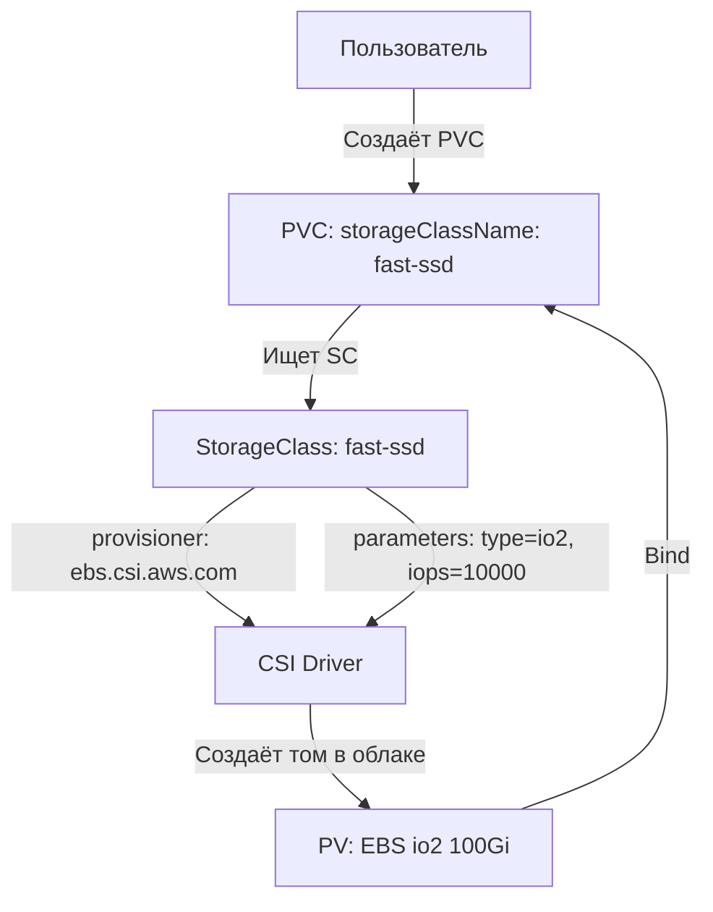

# StorageClass — Профили хранилища в Kubernetes

> 📌 `StorageClass` — это "профиль" или "категория" хранилища. Определяет:
> - **Кто создаёт том** (`provisioner` — CSI-драйвер)
> - **Как создаётся** (`parameters` — тип диска, IOPS, шифрование)
> - **Когда привязывается** (`volumeBindingMode` — сразу или при создании Pod)
> - **Что происходит при удалении** (`reclaimPolicy` — Delete или Retain)
> - **Можно ли расширять** (`allowVolumeExpansion`)

---

## 🔹 Зачем нужен StorageClass

| Проблема | Решение через StorageClass |
|----------|---------------------------|
| Пользователю нужен "быстрый SSD" или "дешёвый HDD" | Админ создаёт SC `fast-ssd` и `cheap-hdd` |
| Разные требования к производительности | Разные SC с разными `parameters` (IOPS, throughput) |
| Нужно контролировать, где создаётся том | `allowedTopologies` ограничивает зоны/ноды |
| Нужно расширять тома на лету | `allowVolumeExpansion: true` |
| Нужно сохранить данные при удалении PVC | `reclaimPolicy: Retain` |



---

## 🔹 Структура StorageClass

```yaml
apiVersion: storage.k8s.io/v1
kind: StorageClass
metadata:
  name: fast-ssd
  annotations:
    storageclass.kubernetes.io/is-default-class: "false"  # ← дефолтный SC
provisioner: ebs.csi.aws.com           # ← CSI-драйвер (обязательно!)
reclaimPolicy: Retain                   # ← Delete (по умолчанию) или Retain
allowVolumeExpansion: true              # ← можно ли расширять том
volumeBindingMode: WaitForFirstConsumer # ← Immediate (по умолчанию) или WaitForFirstConsumer
mountOptions:                           # ← опции монтирования
  - discard
  - nobarrier
parameters:                             # ← параметры для CSI-драйвера
  type: io2
  iopsPerGB: "50"
  encrypted: "true"
allowedTopologies:                      # ← ограничение топологии
- matchLabelExpressions:
  - key: topology.ebs.csi.aws.com/zone
    values:
    - us-east-1a
    - us-east-1b
```

---

## 🔹 Ключевые поля StorageClass

| Поле | Обязательное | По умолчанию | Описание |
|------|--------------|--------------|----------|
| **`provisioner`** | ✅ | — | CSI-драйвер, который создаёт том (например, `ebs.csi.aws.com`) |
| **`parameters`** | ❌ | `{}` | Параметры для CSI-драйвера (тип диска, IOPS, шифрование) |
| **`reclaimPolicy`** | ❌ | `Delete` | Что делать с PV при удалении PVC: `Delete` (удалить том) или `Retain` (сохранить) |
| **`allowVolumeExpansion`** | ❌ | `false` | Можно ли расширять PVC (увеличивать размер) |
| **`volumeBindingMode`** | ❌ | `Immediate` | Когда привязывать PV: `Immediate` (сразу) или `WaitForFirstConsumer` (при создании Pod) |
| **`mountOptions`** | ❌ | `[]` | Опции монтирования (например, `discard`, `nobarrier`) |
| **`allowedTopologies`** | ❌ | — | Ограничение топологии (зоны, ноды) для создания тома |

---

## 🔹 volumeBindingMode — когда привязывать том

> **Критически важное поле!** Определяет, когда создаётся и привязывается PV.

### Immediate (по умолчанию)

```text
1. Пользователь создаёт PVC
2. PV создаётся СРАЗУ (в любой зоне, на любой ноде)
3. Планировщик ищет ноду, к которой привязан PV
4. Если PV в зоне A, а поды не могут там работать → Pod в Pending ❌
```

**Когда использовать:**
- Хранилище **глобально доступно** (NFS, CephFS, EFS)
- Нет топологических ограничений

### WaitForFirstConsumer (рекомендуется!)

```text
1. Пользователь создаёт PVC
2. PV НЕ создаётся (ждёт Pod)
3. Планировщик выбирает ноду для Pod (учитывает affinity, taints, resources)
4. PV создаётся в той же зоне/на той же ноде, что и Pod ✅
```

**Когда использовать:**
- Хранилище **привязано к зоне/ноде** (EBS, local storage, vSphere)
- Есть топологические ограничения (zone, node affinity)
- **Всегда используй для generic ephemeral volumes!**

### Сравнение

| Характеристика | Immediate | WaitForFirstConsumer |
|----------------|-----------|----------------------|
| Когда создаётся PV | При создании PVC | При создании Pod |
| Учитывает topology Pod | ❌ Нет | ✅ Да |
| Риск Pending Pod | ⚠️ Высокий (если PV в неправильной зоне) | ✅ Низкий |
| Подходит для NFS/EFS | ✅ Да | ✅ Да |
| Подходит для EBS/local | ⚠️ Только если одна зона | ✅ Рекомендуется |
| Подходит для generic ephemeral | ❌ Нет | ✅ Обязательно |

### Пример проблемы с Immediate

```yaml
# StorageClass с Immediate (по умолчанию)
apiVersion: storage.k8s.io/v1
kind: StorageClass
metadata:
  name: ebs-sc
provisioner: ebs.csi.aws.com
# volumeBindingMode: Immediate (по умолчанию)
---
# PVC
apiVersion: v1
kind: PersistentVolumeClaim
metadata:
  name: my-pvc
spec:
  storageClassName: ebs-sc
  accessModes: [ReadWriteOnce]
  resources:
    requests:
      storage: 10Gi
---
# Pod с nodeSelector в зоне us-east-1b
apiVersion: v1
kind: Pod
metadata:
  name: my-pod
spec:
  nodeSelector:
    topology.kubernetes.io/zone: us-east-1b
  containers:
  - name: app
    image: nginx
    volumeMounts:
    - name: data
      mountPath: /data
  volumes:
  - name: data
    persistentVolumeClaim:
      claimName: my-pvc
```

**Что произойдёт:**
1. PVC создан → PV создан **сразу** (может быть в зоне `us-east-1a`)
2. Pod создан → планировщик ищет ноду в `us-east-1b`
3. PV в `us-east-1a`, Pod в `us-east-1b` → **Pod в Pending** ❌

**Решение:** использовать `volumeBindingMode: WaitForFirstConsumer`.

---

## 🔹 allowedTopologies — ограничение топологии

> Ограничивает, в каких зонах/нодах может быть создан том.

### Пример: ограничение по зонам

```yaml
apiVersion: storage.k8s.io/v1
kind: StorageClass
metadata:
  name: ebs-sc
provisioner: ebs.csi.aws.com
volumeBindingMode: WaitForFirstConsumer
parameters:
  type: gp3
allowedTopologies:
- matchLabelExpressions:
  - key: topology.ebs.csi.aws.com/zone
    values:
    - us-east-1a
    - us-east-1b
    # ← том будет создан только в этих зонах
```

### Когда использовать

- Хранилище доступно только в определённых зонах
- Нужно контролировать, где создаются данные (compliance)
- Локальное хранилище (local storage) привязано к конкретным нодам

---

## 🔹 reclaimPolicy — что делать при удалении PVC

| Политика | Поведение | Когда использовать |
|----------|-----------|-------------------|
| **`Delete`** (по умолчанию) | PV и физический том удаляются | Dev/Test, временные данные |
| **`Retain`** | PV переходит в `Released`, том сохраняется | Production, критичные данные |

### Пример: Retain для production

```yaml
apiVersion: storage.k8s.io/v1
kind: StorageClass
metadata:
  name: production-db
provisioner: ebs.csi.aws.com
reclaimPolicy: Retain              # ← данные сохраняются!
volumeBindingMode: WaitForFirstConsumer
parameters:
  type: io2
  iopsPerGB: "100"
  encrypted: "true"
```

**Что произойдёт при удалении PVC:**
1. PVC удалён
2. PV переходит в статус `Released`
3. Физический том (EBS volume) **сохраняется** в AWS
4. Админ может вручную:
   - Сделать snapshot
   - Привязать к новому PV
   - Удалить том через AWS Console

---

## 🔹 allowVolumeExpansion — расширение томов

```yaml
apiVersion: storage.k8s.io/v1
kind: StorageClass
metadata:
  name: expandable-sc
provisioner: ebs.csi.aws.com
allowVolumeExpansion: true         # ← обязательно!
volumeBindingMode: WaitForFirstConsumer
parameters:
  type: gp3
```

**Как расширить PVC:**
```bash
kubectl patch pvc my-pvc -p '{"spec":{"resources":{"requests":{"storage":"50Gi"}}}}'
```

**Ограничения:**
- ✅ Можно **увеличить** размер
- ❌ Нельзя **уменьшить** размер
- ⚠️ Файловая система расширится при следующем монтировании (перезапуск Pod) или на лету (если CSI поддерживает online resize)

---

## 🔹 mountOptions — опции монтирования

```yaml
apiVersion: storage.k8s.io/v1
kind: StorageClass
metadata:
  name: optimized-nfs
provisioner: nfs.csi.k8s.io
mountOptions:
  - nfsvers=4.1
  - hard
  - timeo=600
  - retrans=2
  - noresvport
parameters:
  server: nfs.example.com
  path: /exports/data
```

**Популярные опции:**
- `discard` — TRIM/UNMAP для SSD (освобождает неиспользуемые блоки)
- `nobarrier` — отключить барьеры записи (быстрее, но риск потери данных при сбое питания)
- `nfsvers=4.1` — версия NFS
- `hard` — жёсткий режим NFS (повторять запросы при ошибке)

---

## 🔹 StorageClass по умолчанию

> Если PVC не указывает `storageClassName`, используется дефолтный SC.

### Как установить дефолтный SC

```yaml
apiVersion: storage.k8s.io/v1
kind: StorageClass
metadata:
  name: default-sc
  annotations:
    storageclass.kubernetes.io/is-default-class: "true"   # ← ключевая аннотация
provisioner: ebs.csi.aws.com
volumeBindingMode: WaitForFirstConsumer
parameters:
  type: gp3
```

### Правила

```text
✅ В кластере должен быть ТОЛЬКО ОДИН дефолтный SC
⚠️ Если несколько SC с is-default-class: "true" → используется самый новый
✅ PVC без storageClassName → использует дефолтный SC
✅ PVC с storageClassName: "" → НЕ использует дефолтный SC (ищет PV без класса)
```

### Ретроактивное назначение

```text
1. PVC создан без storageClassName (и нет дефолтного SC)
2. Админ создал дефолтный SC
3. Control Plane автоматически обновляет существующие PVC → добавляет storageClassName
```

---

## 🔹 Примеры для популярных CSI-драйверов

### AWS EBS (Block Storage)

```yaml
apiVersion: storage.k8s.io/v1
kind: StorageClass
metadata:
  name: ebs-gp3
provisioner: ebs.csi.aws.com
volumeBindingMode: WaitForFirstConsumer
allowVolumeExpansion: true
reclaimPolicy: Delete
parameters:
  type: gp3                    # ← gp2, gp3, io1, io2, sc1, st1
  fsType: ext4                 # ← ext4, xfs
  encrypted: "true"            # ← шифрование
  # Для io1/io2:
  # iopsPerGB: "50"
  # Для gp3:
  iops: "3000"                 # ← базовые IOPS
  throughput: "125"            # ← MB/s
allowedTopologies:
- matchLabelExpressions:
  - key: topology.ebs.csi.aws.com/zone
    values:
    - us-east-1a
    - us-east-1b
```

### AWS EFS (File Storage, RWX)

```yaml
apiVersion: storage.k8s.io/v1
kind: StorageClass
metadata:
  name: efs-sc
provisioner: efs.csi.aws.com
parameters:
  provisioningMode: efs-ap     # ← efs-ap (Access Points)
  fileSystemId: fs-12345678    # ← ID файловой системы EFS
  directoryPerms: "700"
  # gidRangeStart: "1000"      # ← диапазон GID для Access Points
  # gidRangeEnd: "2000"
  # basePath: "/dynamic_provisioning"
```

### NFS (File Storage, RWX)

```yaml
apiVersion: storage.k8s.io/v1
kind: StorageClass
metadata:
  name: nfs-sc
provisioner: nfs.csi.k8s.io
parameters:
  server: nfs.example.com
  path: /exports/data
  mountOptions: "nfsvers=4.1,hard,timeo=600,retrans=2"
mountOptions:
  - nfsvers=4.1
  - hard
```

### Local Storage (локальные диски нод)

```yaml
apiVersion: storage.k8s.io/v1
kind: StorageClass
metadata:
  name: local-storage
provisioner: kubernetes.io/no-provisioner   # ← нет динамического provisioning!
volumeBindingMode: WaitForFirstConsumer     # ← обязательно!
reclaimPolicy: Delete
# Local storage требует статических PV
```

### GCP Persistent Disk

```yaml
apiVersion: storage.k8s.io/v1
kind: StorageClass
metadata:
  name: pd-ssd
provisioner: pd.csi.storage.gke.io
volumeBindingMode: WaitForFirstConsumer
allowVolumeExpansion: true
parameters:
  type: pd-ssd               # ← pd-standard, pd-ssd, pd-balanced, pd-extreme
  # replication-type: none   # ← none или regional-pd
```

### Azure Disk

```yaml
apiVersion: storage.k8s.io/v1
kind: StorageClass
metadata:
  name: managed-premium
provisioner: disk.csi.azure.com
volumeBindingMode: WaitForFirstConsumer
allowVolumeExpansion: true
parameters:
  skuName: Premium_LRS       # ← Standard_LRS, Premium_LRS, StandardSSD_LRS
  kind: Managed              # ← Managed или Shared
  cachingMode: ReadOnly      # ← None, ReadOnly, ReadWrite
```

---

## 🔹 Troubleshooting

### Проблема 1: PVC в Pending, нет дефолтного SC

```bash
# Проверить статус PVC
kubectl describe pvc my-pvc | grep -A 10 'Events:'
# Warning  FailedBinding  23s  persistentvolume-controller
#   storageclass.storage.k8s.io "fast-ssd" not found

# Проверить доступные SC
kubectl get sc
# NAME      PROVISIONER             RECLAIMPOLICY   VOLUMEBINDINGMODE
# fast-ssd  ebs.csi.aws.com         Delete          WaitForFirstConsumer

# Решение: указать правильный storageClassName в PVC
```

### Проблема 2: Pod в Pending после создания PVC (Immediate binding)

```bash
# Проверить, где создан PV
kubectl get pv -o wide
# NAME    STATUS  ZONE
# pv-123  Bound   us-east-1a

# Проверить nodeSelector/affinity Pod
kubectl get pod my-pod -o jsonpath='{.spec.nodeSelector}'
# {"topology.kubernetes.io/zone":"us-east-1b"}

# Проблема: PV в us-east-1a, Pod хочет us-east-1b
# Решение:
# 1. Удалить PVC и PV
# 2. Изменить SC: volumeBindingMode: WaitForFirstConsumer
# 3. Создать PVC заново
```

### Проблема 3: Нельзя расширить PVC

```bash
# Проверить, разрешено ли расширение в SC
kubectl get sc my-sc -o jsonpath='{.allowVolumeExpansion}'
# false

# Решение:
# 1. Отредактировать SC
kubectl edit sc my-sc
# Изменить: allowVolumeExpansion: true

# 2. Попробовать расширить PVC снова
kubectl patch pvc my-pvc -p '{"spec":{"resources":{"requests":{"storage":"50Gi"}}}}'
```

### Проблема 4: PV не удаляется после удаления PVC (Retain policy)

```bash
# Проверить reclaimPolicy
kubectl get pv my-pv -o jsonpath='{.spec.persistentVolumeReclaimPolicy}'
# Retain

# PV в статусе Released, но не удаляется
kubectl get pv my-pv
# NAME    STATUS     CLAIM
# my-pv   Released   default/my-pvc

# Решение:
# 1. Сделать snapshot (если нужно сохранить данные)
# 2. Удалить PV вручную
kubectl delete pv my-pv
# 3. Удалить физический том в облаке (AWS Console, gcloud, az)
```

---

## 🔹 Шпаргалка kubectl

```bash
# 1. Список всех StorageClass
kubectl get sc
kubectl get sc -o wide

# 2. Детальная информация о SC
kubectl describe sc fast-ssd

# 3. Найти дефолтный SC
kubectl get sc -o json | jq -r '.items[] | select(.metadata.annotations["storageclass.kubernetes.io/is-default-class"] == "true") | .metadata.name'

# 4. Посмотреть параметры SC
kubectl get sc fast-ssd -o jsonpath='{.parameters}'

# 5. Проверить, какие PVC используют какой SC
kubectl get pvc -A -o custom-columns='NAMESPACE:.metadata.namespace,NAME:.metadata.name,STORAGECLASS:.spec.storageClassName'

# 6. Найти PVC без storageClassName
kubectl get pvc -A -o json | jq -r '.items[] | select(.spec.storageClassName == null or .spec.storageClassName == "") | "\(.metadata.namespace)/\(.metadata.name)"'

# 7. Создать дефолтный SC
kubectl annotate sc my-sc storageclass.kubernetes.io/is-default-class=true

# 8. Убрать статус дефолтного SC
kubectl annotate sc my-sc storageclass.kubernetes.io/is-default-class-

# 9. Проверить volumeBindingMode
kubectl get sc -o custom-columns='NAME:.metadata.name,BINDING_MODE:.volumeBindingMode'

# 10. Проверить, какие CSI-драйверы установлены
kubectl get csidriver
kubectl get csinode
```

---

## 🔹 Чек-лист: Best Practices

```text
[ ] Для хранилищ с топологическими ограничениями (EBS, local) → volumeBindingMode: WaitForFirstConsumer
[ ] Для production БД → reclaimPolicy: Retain (сохраняет данные при удалении PVC)
[ ] Для dev/test → reclaimPolicy: Delete (автоматическая очистка)
[ ] Для томов, которые нужно расширять → allowVolumeExpansion: true
[ ] В кластере должен быть ТОЛЬКО ОДИН дефолтный SC
[ ] Для NFS/EFS (глобальное хранилище) → можно использовать Immediate
[ ] Для generic ephemeral volumes → обязательно WaitForFirstConsumer
[ ] Параметры CSI-драйвера документируй (читай документацию вендора!)
[ ] Для локального хранилища → используй local-static-provisioner
[ ] Для compliance → используй allowedTopologies для ограничения зон
[ ] Для оптимизации производительности → настрой mountOptions (discard, nobarrier)
[ ] Для шифрования → добавь encrypted: "true" в parameters (если CSI поддерживает)
```

> 💡 **Совет для Obsidian**:
> - Сделай перекрёстные ссылки: `[[05.persistent_volumes]]`, `[[06.ephemeral_volumes]]`.
> - Добавь блок «Наши StorageClass»: список SC в вашем кластере с описанием (например, `gp3-default`, `io2-fast`, `efs-shared`, `local-nvme`).
> - Добавь блок «CSI-драйверы»: какие драйверы установлены, их версии, ссылки на документацию.

---

## 🔹 Сравнительная таблица: популярные CSI-драйверы

| Провайдер | CSI-драйвер | Тип хранилища | Access Modes | WaitForFirstConsumer | Expansion |
|-----------|-------------|---------------|--------------|----------------------|-----------|
| **AWS** | `ebs.csi.aws.com` | Block (EBS) | RWO | ✅ | ✅ |
| **AWS** | `efs.csi.aws.com` | File (EFS) | RWX | ✅ | ❌ |
| **GCP** | `pd.csi.storage.gke.io` | Block (PD) | RWO | ✅ | ✅ |
| **GCP** | `filestore.csi.storage.gke.io` | File (Filestore) | RWX | ✅ | ✅ |
| **Azure** | `disk.csi.azure.com` | Block (Managed Disk) | RWO | ✅ | ✅ |
| **Azure** | `file.csi.azure.com` | File (Azure Files) | RWX | ✅ | ✅ |
| **NFS** | `nfs.csi.k8s.io` | File (NFS) | RWX | ✅ | ❌ |
| **Ceph** | `rbd.csi.ceph.com` | Block (RBD) | RWO | ✅ | ✅ |
| **Ceph** | `cephfs.csi.ceph.com` | File (CephFS) | RWX | ✅ | ✅ |
| **Local** | `kubernetes.io/no-provisioner` | Local | RWO | ✅ (обязательно) | ❌ |

---

## 🔹 Ключевые выводы

1. **StorageClass** — это "профиль" хранилища. Определяет, как создаются и управляются PV.
2. **provisioner** — CSI-драйвер, который создаёт том. Все in-tree драйверы устарели, используй CSI.
3. **volumeBindingMode**:
   - `Immediate` — PV создаётся сразу (для NFS/EFS)
   - `WaitForFirstConsumer` — PV создаётся при создании Pod (для EBS/local) **рекомендуется!**
4. **reclaimPolicy**: `Delete` (удалить том) или `Retain` (сохранить для production).
5. **allowVolumeExpansion**: `true` позволяет расширять PVC (увеличивать размер).
6. **allowedTopologies**: ограничивает зоны/ноды для создания тома.
7. **mountOptions**: опции монтирования (discard, nobarrier, nfsvers).
8. **parameters**: специфичные для CSI-драйвера параметры (тип диска, IOPS, шифрование).
9. **Дефолтный SC**: аннотация `storageclass.kubernetes.io/is-default-class: "true"`. Должен быть только один.
10. **Troubleshooting**: Pod в Pending → проверь volumeBindingMode и topology. PVC не расширяется → проверь allowVolumeExpansion.