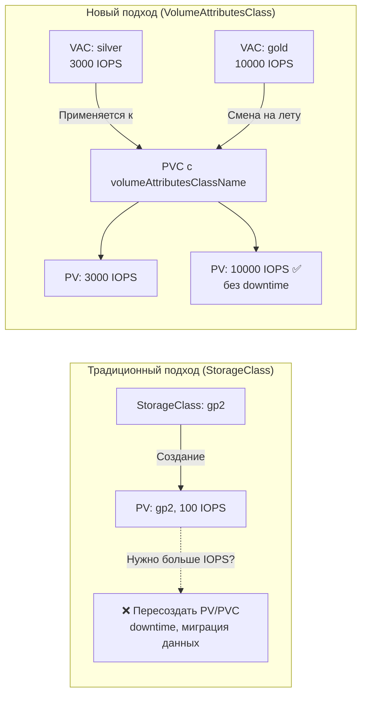
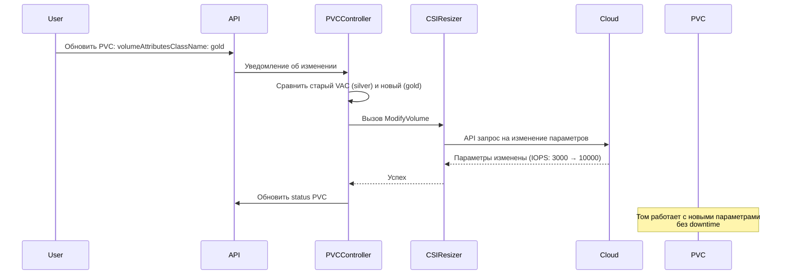

# VolumeAttributesClass — Динамическое изменение параметров тома

> 📌 `VolumeAttributesClass` (VAC) — **новая фича (GA с v1.34)**, позволяющая **менять параметры тома на лету** (IOPS, throughput, тип диска) **без изменения размера** и **без пересоздания PV**. Работает только с CSI-драйверами, поддерживающими `ModifyVolume` API.
> 
> **Ключевое отличие от StorageClass**: StorageClass определяет параметры **при создании** тома и **неизменяем** для существующих PV. VolumeAttributesClass можно **менять на лету** для уже работающих томов.

---

## 🔹 Зачем нужен VolumeAttributesClass

| Проблема | Решение через StorageClass | Решение через VolumeAttributesClass |
|----------|---------------------------|-------------------------------------|
| Нужно создать том с определёнными параметрами | ✅ `parameters` в SC | ✅ `parameters` в VAC |
| Нужно изменить IOPS/throughput **после создания тома** | ❌ Нужно пересоздать PV/PVC | ✅ Просто сменить VAC в PVC |
| Нужно изменить тип диска (gp2 → gp3) | ❌ Только миграция | ✅ Смена VAC |
| Нужно изменить параметры **без downtime** | ❌ | ✅ (если CSI поддерживает) |



---

## 🔹 Структура VolumeAttributesClass

```yaml
apiVersion: storage.k8s.io/v1
kind: VolumeAttributesClass
metadata:
  name: silver                    # ← имя класса (используется в PVC)
driverName: ebs.csi.aws.com       # ← CSI-драйвер (обязательно!)
parameters:                       # ← параметры для CSI-драйвера
  iops: "3000"
  throughput: "125"
  type: gp3
```

### Ключевые поля

| Поле | Обязательное | Описание |
|------|--------------|----------|
| **`driverName`** | ✅ | CSI-драйвер, который обрабатывает этот класс (должен поддерживать `ModifyVolume` API) |
| **`parameters`** | ❌ | Параметры для CSI-драйвера (IOPS, throughput, тип диска и т.д.) |
| **`metadata.name`** | ✅ | Имя класса, которое указывается в PVC (`volumeAttributesClassName`) |

### Ограничения

- Максимум **512 параметров** в одном VAC
- Общий размер `parameters` ≤ **256 КиБ**
- Работает **только с CSI-драйверами** (не с in-tree плагинами)
- CSI-драйвер должен поддерживать **ModifyVolume API**

---

## 🔹 Как использовать VolumeAttributesClass

### Шаг 1: Админ создаёт VolumeAttributesClass

```yaml
# silver-class.yaml
apiVersion: storage.k8s.io/v1
kind: VolumeAttributesClass
metadata:
  name: silver
driverName: ebs.csi.aws.com
parameters:
  type: gp3
  iops: "3000"
  throughput: "125"
---
# gold-class.yaml
apiVersion: storage.k8s.io/v1
kind: VolumeAttributesClass
metadata:
  name: gold
driverName: ebs.csi.aws.com
parameters:
  type: io2
  iops: "10000"
  throughput: "500"
```

```bash
kubectl apply -f silver-class.yaml
kubectl apply -f gold-class.yaml
```

### Шаг 2: Пользователь создаёт PVC с VAC

```yaml
apiVersion: v1
kind: PersistentVolumeClaim
metadata:
  name: my-db-pvc
spec:
  accessModes: [ReadWriteOnce]
  storageClassName: fast-ssd              # ← StorageClass (для создания тома)
  volumeAttributesClassName: silver       # ← VolumeAttributesClass (для параметров)
  resources:
    requests:
      storage: 100Gi
```

### Шаг 3: Изменение параметров на лету

```yaml
# Обновить PVC: сменить silver → gold
apiVersion: v1
kind: PersistentVolumeClaim
metadata:
  name: my-db-pvc
spec:
  accessModes: [ReadWriteOnce]
  storageClassName: fast-ssd
  volumeAttributesClassName: gold         # ← изменили с silver на gold
  resources:
    requests:
      storage: 100Gi                      # ← размер НЕ изменился
```

```bash
kubectl apply -f updated-pvc.yaml
```

**Что произойдёт:**
1. CSI-драйвер получит запрос на изменение параметров
2. Том в облаке изменит IOPS/throughput/type **без изменения размера**
3. **Без downtime** (если CSI поддерживает online modification)
4. PVC обновит статус, отразив новые параметры

---

## 🔹 Отличие от StorageClass

| Характеристика | StorageClass | VolumeAttributesClass |
|----------------|--------------|----------------------|
| **Когда применяется** | При создании PV | В любой момент жизни PV |
| **Можно менять для существующего PV** | ❌ Нет | ✅ Да |
| **Влияет на создание тома** | ✅ Да (provisioner, parameters) | ❌ Нет |
| **Влияет на параметры тома** | ✅ Да (при создании) | ✅ Да (в любое время) |
| **Влияет на размер тома** | ✅ Да | ❌ Нет (для размера — `allowVolumeExpansion`) |
| **Требует CSI** | ❌ Нет (есть in-tree) | ✅ Да (только CSI) |
| **Поддерживается всеми CSI** | ✅ Да | ⚠️ Только если CSI поддерживает ModifyVolume |

### Когда что использовать

```text
📌 StorageClass:
   - Определяет, КТО создаёт том (provisioner)
   - Определяет, ГДЕ создаётся том (topology, allowedTopologies)
   - Определяет, ЧТО происходит при удалении (reclaimPolicy)
   - Определяет, МОЖНО ли расширять (allowVolumeExpansion)

📌 VolumeAttributesClass:
   - Определяет ПАРАМЕТРЫ тома (IOPS, throughput, type)
   - Можно менять НА ЛЕТУ для существующих томов
   - Не влияет на создание, удаление, расширение

📌 Вместе:
   StorageClass = "как создать том" (неизменяемо)
   VolumeAttributesClass = "какие параметры у тома" (изменяемо)
```

---

## 🔹 Практика: примеры для популярных CSI

### AWS EBS (gp3, io2)

```yaml
# Silver: gp3, базовые IOPS
apiVersion: storage.k8s.io/v1
kind: VolumeAttributesClass
metadata:
  name: ebs-gp3-silver
driverName: ebs.csi.aws.com
parameters:
  type: gp3
  iops: "3000"
  throughput: "125"
---
# Gold: io2, высокие IOPS
apiVersion: storage.k8s.io/v1
kind: VolumeAttributesClass
metadata:
  name: ebs-io2-gold
driverName: ebs.csi.aws.com
parameters:
  type: io2
  iops: "10000"
```

### GCP Persistent Disk

```yaml
apiVersion: storage.k8s.io/v1
kind: VolumeAttributesClass
metadata:
  name: pd-balanced
driverName: pd.csi.storage.gke.io
parameters:
  type: pd-balanced
  provisioned-iops: "6000"
  provisioned-throughput: "200"
```

### Azure Disk

```yaml
apiVersion: storage.k8s.io/v1
kind: VolumeAttributesClass
metadata:
  name: azure-premium-v2
driverName: disk.csi.azure.com
parameters:
  skuName: PremiumV2_LRS
  iops: "5000"
  throughput-mbps: "200"
```

---

## 🔹 Как это работает под капотом



### Компоненты

| Компонент | Роль |
|-----------|------|
| **`external-provisioner`** | Создаёт PV с начальными параметрами из VAC |
| **`external-resizer`** | Обрабатывает изменение VAC в PVC, вызывает ModifyVolume API |
| **CSI-драйвер** | Реализует ModifyVolume API (должен поддерживать эту фичу) |

---

## 🔹 Проверка поддержки CSI-драйвером

### Как узнать, поддерживает ли драйвер ModifyVolume

```bash
# 1. Проверить CSIDriver
kubectl get csidriver ebs.csi.aws.com -o yaml | grep -A 10 'volumeLifecycleModes'

# 2. Проверить CSINode (поддерживает ли нода ModifyVolume)
kubectl get csinode -o yaml | grep -A 20 'ebs.csi.aws.com'

# 3. Проверить документацию CSI-драйвера
# Ищи: "ModifyVolume", "VolumeAttributesClass", "dynamic parameter modification"
```

### Популярные CSI-драйверы и поддержка VAC

| CSI-драйвер | Поддержка VAC | Минимальная версия |
|-------------|---------------|-------------------|
| **AWS EBS CSI** | ✅ Да | v1.25.0+ |
| **GCP PD CSI** | ✅ Да | v1.9.0+ |
| **Azure Disk CSI** | ✅ Да | v1.26.0+ |
| **Ceph RBD CSI** | ⚠️ Частично | Зависит от версии |
| **NFS CSI** | ❌ Нет | NFS не поддерживает изменение параметров |
| **Local storage** | ❌ Нет | Локальные диски не поддерживают online modification |

> ⚠️ **Важно**: Даже если CSI-драйвер поддерживает VAC, не все параметры могут быть изменяемы на лету. Например, изменение `type` (gp2 → gp3) может требовать downtime. Читай документацию вендора!

---

## 🔹 Troubleshooting

### Проблема 1: PVC не обновляется после смены VAC

```bash
# 1. Проверить события PVC
kubectl describe pvc my-pvc | grep -A 20 'Events:'
# Warning  VolumeAttributesClassNotSupported  23s  volumeattributesclass-controller
#   CSI driver ebs.csi.aws.com does not support ModifyVolume API

# 2. Проверить версию CSI-драйвера
kubectl get pods -n kube-system -l app=ebs-csi-controller -o jsonpath='{.items[*].spec.containers[*].image}'
# Обновить драйвер до версии с поддержкой VAC

# 3. Проверить, что VAC существует
kubectl get volumeattributesclass silver
```

### Проблема 2: PVC в статусе Resizing бесконечно

```bash
# Проверить статус PVC
kubectl get pvc my-pvc -o yaml | grep -A 10 'conditions:'
# - type: Resizing
#   status: "True"

# Проверить логи external-resizer
kubectl logs -n kube-system deployment/ebs-csi-controller -c csi-resizer

# Частые причины:
# - CSI-драйвер не может изменить параметры (например, тип диска нельзя изменить online)
# - Облачный API вернул ошибку (квоты, лимиты)
# - Параметр не поддерживается для данного типа диска

# Решение:
# 1. Проверить документацию CSI-драйвера
# 2. Проверить квоты в облаке
# 3. Откатить VAC на предыдущее значение
kubectl patch pvc my-pvc --type='merge' -p '{"spec":{"volumeAttributesClassName":"silver"}}'
```

### Проблема 3: После смены VAC параметры не изменились

```bash
# 1. Проверить, что PVC обновлён
kubectl get pvc my-pvc -o jsonpath='{.spec.volumeAttributesClassName}'
# gold

# 2. Проверить статус PVC
kubectl get pvc my-pvc -o yaml | grep -A 5 'currentVolumeAttributesClassName:'
# currentVolumeAttributesClassName: silver  ← ещё не применилось

# 3. Подождать (изменение может занять несколько минут)
# 4. Проверить в облаке (AWS Console, gcloud, az)
aws ec2 describe-volumes --volume-ids vol-1234567890abcdef0
# Проверить IOPS, Throughput, Type

# 5. Если не изменилось — проверить логи CSI-драйвера
kubectl logs -n kube-system deployment/ebs-csi-controller -c ebs-plugin
```

---

## 🔹 Шпаргалка kubectl

```bash
# 1. Список всех VolumeAttributesClass
kubectl get volumeattributesclass
kubectl get vac   # ← короткий алиас (если настроен)

# 2. Детальная информация о VAC
kubectl describe volumeattributesclass silver

# 3. Посмотреть параметры VAC
kubectl get vac silver -o jsonpath='{.parameters}'

# 4. Найти PVC с определённым VAC
kubectl get pvc -A -o custom-columns='NAMESPACE:.metadata.namespace,NAME:.metadata.name,VAC:.spec.volumeAttributesClassName'

# 5. Найти PVC, у которых VAC отличается от текущего (идёт модификация)
kubectl get pvc -A -o json | jq -r '.items[] | select(.spec.volumeAttributesClassName != .status.currentVolumeAttributesClassName) | "\(.metadata.namespace)/\(.metadata.name): \(.spec.volumeAttributesClassName) → \(.status.currentVolumeAttributesClassName)"'

# 6. Создать VAC
kubectl apply -f - <<EOF
apiVersion: storage.k8s.io/v1
kind: VolumeAttributesClass
metadata:
  name: gold
driverName: ebs.csi.aws.com
parameters:
  type: io2
  iops: "10000"
EOF

# 7. Сменить VAC для PVC
kubectl patch pvc my-pvc --type='merge' -p '{"spec":{"volumeAttributesClassName":"gold"}}'

# 8. Удалить VAC (нельзя, если используется PVC)
kubectl delete volumeattributesclass silver
# Error: volumeattributesclass is in use

# 9. Проверить, какие CSI-драйверы поддерживают ModifyVolume
kubectl get csidriver -o json | jq -r '.items[] | select(.spec.volumeAttributesClass != null) | .metadata.name'

# 10. Посмотреть события, связанные с VAC
kubectl get events --field-selector reason=VolumeAttributesClassModifyFailed
```

---

## 🔹 Чек-лист: Best Practices

```text
[ ] Убедись, что CSI-драйвер поддерживает ModifyVolume API (читай документацию вендора!)
[ ] Создай несколько VAC для разных сценариев (silver/gold/platinum)
[ ] Для production БД → используй VAC с высокими IOPS (io2, Premium_LRS)
[ ] Для dev/test → используй VAC с базовыми параметрами (gp3, Standard_LRS)
[ ] Документируй параметры VAC (что означает каждый параметр)
[ ] Тестируй смену VAC в staging перед production
[ ] Мониторь события PVC на ошибки VolumeAttributesClassModifyFailed
[ ] Для критичных изменений (смена типа диска) → планируй maintenance window
[ ] Не используй VAC для NFS/local storage (не поддерживается)
[ ] Для изменения размера → используй allowVolumeExpansion в StorageClass (не VAC)
[ ] Для изменения параметров → используй VAC (не пересоздавай PV)
```

> 💡 **Совет для Obsidian**:
> - Сделай перекрёстные ссылки: `[[07.storage_class]]`, `[[05.persistent_volumes]]`.
> - Добавь блок «Наши VolumeAttributesClass»: список VAC в вашем кластере (например, `ebs-gp3-silver`, `ebs-io2-gold`, `pd-balanced`).
> - Добавь блок «CSI-драйверы с поддержкой VAC»: какие драйверы в вашем кластере поддерживают ModifyVolume.
> - Добавь блок «Матрица изменений»: какие параметры можно менять online, какие требуют downtime.

---

## 🔹 Сравнительная таблица: изменение параметров тома

| Что нужно изменить | Инструмент | Downtime | Примечания |
|--------------------|------------|----------|------------|
| **Размер тома** (увеличить) | `allowVolumeExpansion` в StorageClass | ⚠️ Может потребоваться перезапуск Pod | Только увеличение, нельзя уменьшить |
| **IOPS / Throughput** | **VolumeAttributesClass** | ✅ Нет (если CSI поддерживает) | Только для CSI с ModifyVolume API |
| **Тип диска** (gp2 → gp3) | **VolumeAttributesClass** | ⚠️ Зависит от CSI и типа | Читай документацию вендора! |
| **Шифрование** | ❌ Нельзя изменить | — | Нужно пересоздать том |
| **Зона / Нода** | ❌ Нельзя изменить | — | Нужно пересоздать том |
| **Reclaim Policy** | Изменить в PV напрямую | ✅ Нет | `kubectl patch pv <name> -p '{"spec":{"persistentVolumeReclaimPolicy":"Retain"}}'` |

---

## 🔹 Ключевые выводы

1. **VolumeAttributesClass (VAC)** — новая фича (GA с v1.34), позволяет менять параметры тома **на лету**.
2. **Отличие от StorageClass**: SC неизменяем для существующих PV, VAC можно менять в любое время.
3. **Работает только с CSI-драйверами**, поддерживающими `ModifyVolume` API.
4. **Типичные параметры**: IOPS, throughput, тип диска (gp2 → gp3, Standard → Premium).
5. **Не для изменения размера**: для расширения тома используй `allowVolumeExpansion` в StorageClass.
6. **Без downtime** (в большинстве случаев): параметры меняются online через CSI-драйвер.
7. **Компоненты**: `external-provisioner` (создание), `external-resizer` (модификация), CSI-драйвер (реализация).
8. **Troubleshooting**: PVC не обновляется → проверь поддержку CSI; PVC в Resizing → проверь логи resizer; параметры не изменились → проверь в облаке.
9. **Best practices**: создай несколько VAC (silver/gold/platinum), документируй параметры, тестируй в staging.
10. **Ограничения**: не все параметры можно менять online (например, шифрование), не все CSI поддерживают VAC.
