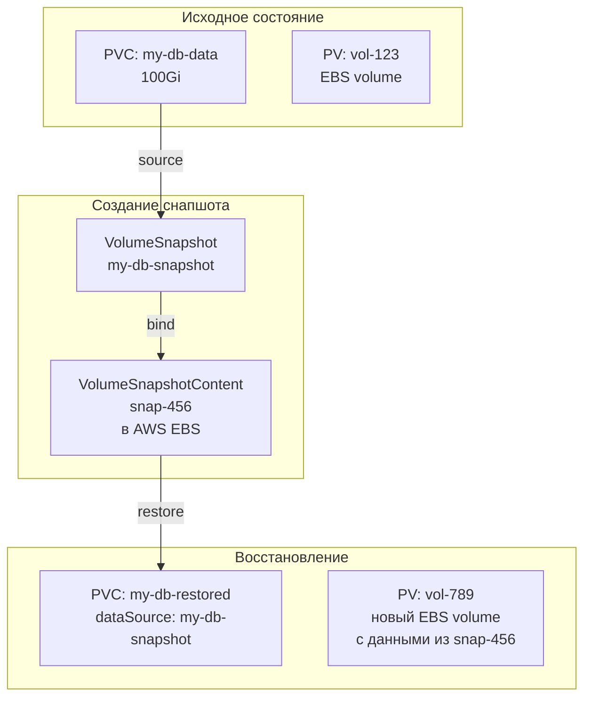

# Volume Snapshots — Снимки томов в Kubernetes

> 📌 `VolumeSnapshot` — стандартизированный способ создания **point-in-time копий** томов. Работает только с CSI-драйверами, поддерживающими снапшоты. Позволяет делать бэкапы БД, клонировать данные, откатывать изменения. Требует установки **CRD** и **snapshot-controller** (обычно устанавливается дистрибутивом K8s).
> 
> **Ключевая концепция**:
> - `VolumeSnapshot` = запрос пользователя (как PVC)
> - `VolumeSnapshotContent` = реальный снапшот в хранилище (как PV)
> - `VolumeSnapshotClass` = параметры для снапшотов (как StorageClass)

---

## 🔹 Зачем нужны снапшоты

| Сценарий | Решение через VolumeSnapshot |
|----------|------------------------------|
| Бэкап БД перед миграцией | Создать снапшот → выполнить миграцию → при ошибке восстановить из снапшота |
| Клонирование данных для dev/test | Создать снапшот prod → создать новый PVC из снапшота → использовать в dev |
| Откат изменений | Создать снапшот перед изменениями → при ошибке восстановить из снапшота |
| Анализ данных на определённый момент | Создать снапшот → создать PVC из снапшота → запустить аналитический Pod |



---

## 🔹 Архитектура: три объекта API

### 1. VolumeSnapshot (запрос пользователя)

```yaml
apiVersion: snapshot.storage.k8s.io/v1
kind: VolumeSnapshot
metadata:
  name: my-db-snapshot
  namespace: default
spec:
  volumeSnapshotClassName: csi-aws-vsc    # ← опционально, есть дефолтный
  source:
    persistentVolumeClaimName: my-db-data # ← источник снапшота (PVC)
```

**Аналог PVC**: пользователь запрашивает снапшот, не зная деталей реализации.

### 2. VolumeSnapshotContent (реальный снапшот)

```yaml
apiVersion: snapshot.storage.k8s.io/v1
kind: VolumeSnapshotContent
metadata:
  name: snapcontent-72d9a349-aacd-42d2
spec:
  deletionPolicy: Delete                  # ← Delete или Retain
  driver: ebs.csi.aws.com                 # ← CSI-драйвер
  source:
    volumeHandle: vol-1234567890abcdef0   # ← ID тома в облаке
  volumeSnapshotClassName: csi-aws-vsc
  volumeSnapshotRef:
    name: my-db-snapshot
    namespace: default
```

**Аналог PV**: реальный снапшот в хранилище (EBS snapshot, GCP snapshot и т.д.).

### 3. VolumeSnapshotClass (параметры снапшота)

```yaml
apiVersion: snapshot.storage.k8s.io/v1
kind: VolumeSnapshotClass
metadata:
  name: csi-aws-vsc
  annotations:
    snapshot.storage.kubernetes.io/is-default-class: "true"  # ← дефолтный класс
driver: ebs.csi.aws.com
deletionPolicy: Delete
parameters:
  tagSpecification_1: "backup=true"
  tagSpecification_2: "app=my-db"
```

**Аналог StorageClass**: определяет параметры для создания снапшотов.

### Сравнение с PV/PVC/SC

| Объект | Хранилище | Снапшоты |
|--------|-----------|----------|
| **Запрос пользователя** | PersistentVolumeClaim (PVC) | VolumeSnapshot (VS) |
| **Реальный ресурс** | PersistentVolume (PV) | VolumeSnapshotContent (VSC) |
| **Параметры** | StorageClass (SC) | VolumeSnapshotClass (VSC) |
| **Привязка** | PVC ↔ PV (1:1) | VS ↔ VSC (1:1) |

---

## 🔹 Создание снапшотов

### Динамическое создание (рекомендуется)

```yaml
# 1. Создать VolumeSnapshot из существующего PVC
apiVersion: snapshot.storage.k8s.io/v1
kind: VolumeSnapshot
metadata:
  name: my-db-snapshot
spec:
  volumeSnapshotClassName: csi-aws-vsc
  source:
    persistentVolumeClaimName: my-db-data   # ← источник
```

**Что произойдёт:**
1. Snapshot-controller видит новый VolumeSnapshot
2. Вызывает CSI-драйвер (через csi-snapshotter sidecar)
3. CSI-драйвер создаёт снапшот в облаке (EBS snapshot, GCP snapshot)
4. Создаётся VolumeSnapshotContent, привязывается к VolumeSnapshot
5. VolumeSnapshot переходит в статус `ReadyToUse: true`

### Предварительное создание (pre-provisioned)

```yaml
# 1. Админ создаёт VolumeSnapshotContent (реальный снапшот уже существует в облаке)
apiVersion: snapshot.storage.k8s.io/v1
kind: VolumeSnapshotContent
metadata:
  name: pre-provisioned-snap
spec:
  deletionPolicy: Retain
  driver: ebs.csi.aws.com
  source:
    snapshotHandle: snap-1234567890abcdef0   # ← ID снапшота в AWS
  volumeSnapshotRef:
    name: my-db-snapshot
    namespace: default
---
# 2. Пользователь создаёт VolumeSnapshot, ссылающийся на VolumeSnapshotContent
apiVersion: snapshot.storage.k8s.io/v1
kind: VolumeSnapshot
metadata:
  name: my-db-snapshot
spec:
  source:
    volumeSnapshotContentName: pre-provisioned-snap
```

**Когда использовать:**
- Снапшот уже существует в облаке (сделан через AWS Console, gcloud и т.д.)
- Миграция данных между кластерами
- Восстановление из внешних бэкапов

---

## 🔹 Восстановление из снапшота

> **Ключевая фича**: создать новый PVC, заполненный данными из снапшота.

```yaml
apiVersion: v1
kind: PersistentVolumeClaim
metadata:
  name: my-db-restored
spec:
  storageClassName: fast-ssd
  accessModes: [ReadWriteOnce]
  resources:
    requests:
      storage: 100Gi
  dataSource:                              # ← источник данных
    name: my-db-snapshot                   # ← имя VolumeSnapshot
    kind: VolumeSnapshot
    apiGroup: snapshot.storage.k8s.io
```

**Что произойдёт:**
1. CSI-драйвер создаёт новый том (EBS volume) из снапшота
2. Новый PVC привязывается к новому PV
3. Данные из снапшота копируются в новый том
4. Pod может монтировать новый PVC и работать с данными

### Полный пример: бэкап и восстановление БД

```yaml
# Шаг 1: Исходная БД
apiVersion: v1
kind: PersistentVolumeClaim
metadata:
  name: my-db-data
spec:
  storageClassName: fast-ssd
  accessModes: [ReadWriteOnce]
  resources:
    requests:
      storage: 100Gi
---
apiVersion: apps/v1
kind: Deployment
metadata:
  name: my-db
spec:
  replicas: 1
  selector:
    matchLabels:
      app: my-db
  template:
    metadata:
      labels:
        app: my-db
    spec:
      containers:
      - name: postgres
        image: postgres:15
        volumeMounts:
        - name: data
          mountPath: /var/lib/postgresql/data
      volumes:
      - name: data
        persistentVolumeClaim:
          claimName: my-db-data
---
# Шаг 2: Создать снапшот перед миграцией
apiVersion: snapshot.storage.k8s.io/v1
kind: VolumeSnapshot
metadata:
  name: my-db-snapshot
spec:
  volumeSnapshotClassName: csi-aws-vsc
  source:
    persistentVolumeClaimName: my-db-data
---
# Шаг 3: Восстановить из снапшота (если миграция провалилась)
apiVersion: v1
kind: PersistentVolumeClaim
metadata:
  name: my-db-restored
spec:
  storageClassName: fast-ssd
  accessModes: [ReadWriteOnce]
  resources:
    requests:
      storage: 100Gi
  dataSource:
    name: my-db-snapshot
    kind: VolumeSnapshot
    apiGroup: snapshot.storage.k8s.io
---
# Шаг 4: Запустить БД с восстановленными данными
apiVersion: apps/v1
kind: Deployment
metadata:
  name: my-db-restored
spec:
  replicas: 1
  selector:
    matchLabels:
      app: my-db-restored
  template:
    metadata:
      labels:
        app: my-db-restored
    spec:
      containers:
      - name: postgres
        image: postgres:15
        volumeMounts:
        - name: data
          mountPath: /var/lib/postgresql/data
      volumes:
      - name: data
        persistentVolumeClaim:
          claimName: my-db-restored
```

---

## 🔹 DeletionPolicy — что происходит при удалении

| Политика | Поведение | Когда использовать |
|----------|-----------|-------------------|
| **`Delete`** (по умолчанию) | Снапшот удаляется из облака вместе с VolumeSnapshotContent | Dev/test, временные снапшоты |
| **`Retain`** | Снапшот **сохраняется** в облаке, удаляется только VolumeSnapshotContent | Production, критичные бэкапы |

### Пример: Retain для production бэкапов

```yaml
apiVersion: snapshot.storage.k8s.io/v1
kind: VolumeSnapshotClass
metadata:
  name: production-backups
driver: ebs.csi.aws.com
deletionPolicy: Retain                # ← снапшоты сохраняются!
parameters:
  tagSpecification_1: "backup-type=production"
```

**Что произойдёт при удалении VolumeSnapshot:**
1. VolumeSnapshot удалён
2. VolumeSnapshotContent удалён
3. **Снапшот в AWS сохраняется** (snap-1234567890abcdef0)
4. Админ может вручную:
   - Создать новый VolumeSnapshotContent, ссылающийся на snap-1234567890abcdef0
   - Восстановить данные из снапшота через AWS Console
   - Удалить снапшот через AWS Console (если больше не нужен)

---

## 🔹 Защита PVC от удаления

> **Важная фича**: если вы удаляете PVC, который используется для создания снапшота, удаление откладывается до завершения создания снапшота.

### Как это работает

```text
1. Пользователь создаёт VolumeSnapshot из PVC
2. Snapshot-controller начинает создание снапшота
3. Пользователь удаляет PVC
4. PVC переходит в статус Terminating, но НЕ удаляется
5. Snapshot-controller завершает создание снапшота
6. PVC удаляется
```

### Проверка защиты

```bash
# Проверить finalizers на PVC
kubectl get pvc my-db-data -o jsonpath='{.metadata.finalizers}'
# ["kubernetes.io/pvc-protection"]

# Проверить статус PVC
kubectl get pvc my-db-data
# NAME          STATUS        VOLUME   CAPACITY   ACCESS MODES
# my-db-data    Terminating   pv-123   100Gi      RWO

# Подождать завершения создания снапшота
kubectl get volumesnapshot my-db-snapshot
# NAME              READYTOUSE   SOURCEPVC     VOLUMESNAPSHOTCONTENT   AGE
# my-db-snapshot    true         my-db-data    snapcontent-456         2m

# После ReadyToUse: true → PVC удалится автоматически
```

---

## 🔹 Изменение VolumeMode (Filesystem ↔ Block)

> **Продвинутая фича**: можно создать PVC с другим volumeMode, чем у исходного снапшота.

### Пример: Filesystem → Block

```yaml
# Исходный PVC (Filesystem)
apiVersion: v1
kind: PersistentVolumeClaim
metadata:
  name: my-db-data
spec:
  storageClassName: fast-ssd
  accessModes: [ReadWriteOnce]
  volumeMode: Filesystem              # ← файловая система
  resources:
    requests:
      storage: 100Gi
---
# Снапшот
apiVersion: snapshot.storage.k8s.io/v1
kind: VolumeSnapshot
metadata:
  name: my-db-snapshot
spec:
  source:
    persistentVolumeClaimName: my-db-data
---
# Новый PVC (Block)
apiVersion: v1
kind: PersistentVolumeClaim
metadata:
  name: my-db-block
spec:
  storageClassName: fast-ssd
  accessModes: [ReadWriteOnce]
  volumeMode: Block                   # ← сырое блочное устройство!
  resources:
    requests:
      storage: 100Gi
  dataSource:
    name: my-db-snapshot
    kind: VolumeSnapshot
    apiGroup: snapshot.storage.k8s.io
```

### Включение изменения volumeMode

```bash
# 1. Проверить поддержку в CRD
kubectl get crd volumesnapshotcontent -o yaml | grep sourceVolumeMode

# 2. Добавить аннотацию на VolumeSnapshotContent
kubectl annotate volumesnapshotcontent snapcontent-456 \
  snapshot.storage.kubernetes.io/allow-volume-mode-change=true
```

**Когда использовать:**
- Миграция с Filesystem на Block (или наоборот)
- Оптимизация производительности для БД (Block быстрее)
- Специфичные требования приложения

---

## 🔹 Требования для работы снапшотов

### Компоненты

| Компонент | Роль | Кто устанавливает |
|-----------|------|-------------------|
| **CRD** (VolumeSnapshot, VolumeSnapshotContent, VolumeSnapshotClass) | Определение API | Дистрибутив K8s (обычно включено) |
| **snapshot-controller** | Управление снапшотами, привязка VS ↔ VSC | Дистрибутив K8s |
| **csi-snapshotter** (sidecar) | Вызов CSI-драйвера для создания/удаления снапшотов | Устанавливается с CSI-драйвером |
| **webhook-server** | Валидация объектов снапшотов | Дистрибутив K8s |
| **CSI-драйвер с поддержкой снапшотов** | Реализация CreateSnapshot/DeleteSnapshot API | Админ кластера |

### Проверка установки

```bash
# 1. Проверить CRD
kubectl get crd | grep snapshot
# volumesnapshotclasses.snapshot.storage.k8s.io
# volumesnapshotcontents.snapshot.storage.k8s.io
# volumesnapshots.snapshot.storage.k8s.io

# 2. Проверить snapshot-controller
kubectl get pods -n kube-system | grep snapshot-controller
# snapshot-controller-6d7f8b9c8-abc12   1/1     Running   0          10d

# 3. Проверить csi-snapshotter (sidecar в CSI-драйвере)
kubectl get pods -n kube-system -l app=ebs-csi-controller -o yaml | grep csi-snapshotter
# - name: csi-snapshotter
#   image: k8s.gcr.io/sig-storage/csi-snapshotter:v6.2.0

# 4. Проверить поддержку снапшотов в CSI-драйвере
kubectl get csidriver ebs.csi.aws.com -o yaml | grep -A 5 'volumeLifecycleModes'
```

---

## 🔹 Примеры для популярных CSI-драйверов

### AWS EBS

```yaml
apiVersion: snapshot.storage.k8s.io/v1
kind: VolumeSnapshotClass
metadata:
  name: csi-aws-vsc
  annotations:
    snapshot.storage.kubernetes.io/is-default-class: "true"
driver: ebs.csi.aws.com
deletionPolicy: Delete
parameters:
  tagSpecification_1: "backup=true"
  tagSpecification_2: "app={{ .PVCName }}"
```

### GCP Persistent Disk

```yaml
apiVersion: snapshot.storage.k8s.io/v1
kind: VolumeSnapshotClass
metadata:
  name: csi-gcp-vsc
driver: pd.csi.storage.gke.io
deletionPolicy: Delete
```

### Azure Disk

```yaml
apiVersion: snapshot.storage.k8s.io/v1
kind: VolumeSnapshotClass
metadata:
  name: csi-azure-vsc
driver: disk.csi.azure.com
deletionPolicy: Delete
parameters:
  incremental: "true"              # ← инкрементальные снапшоты (экономия места)
```

### Ceph RBD

```yaml
apiVersion: snapshot.storage.k8s.io/v1
kind: VolumeSnapshotClass
metadata:
  name: csi-ceph-rbd-vsc
driver: rbd.csi.ceph.com
deletionPolicy: Delete
parameters:
  clusterID: "<cluster-id>"
  csi.storage.k8s.io/snapshotter-secret-name: "ceph-secret"
  csi.storage.k8s.io/snapshotter-secret-namespace: "kube-system"
```

---

## 🔹 Troubleshooting

### Проблема 1: VolumeSnapshot в статусе Pending

```bash
# 1. Проверить события VolumeSnapshot
kubectl describe volumesnapshot my-snapshot | grep -A 20 'Events:'
# Warning  SnapshotContentCreationFailed  23s  snapshot-controller
#   Failed to create snapshot content: CSI driver ebs.csi.aws.com does not support CreateSnapshot

# 2. Проверить, поддерживает ли CSI-драйвер снапшоты
kubectl get csidriver ebs.csi.aws.com -o yaml | grep -A 5 'volumeLifecycleModes'

# 3. Проверить логи csi-snapshotter
kubectl logs -n kube-system deployment/ebs-csi-controller -c csi-snapshotter

# Решение:
# - Установить CSI-драйвер с поддержкой снапшотов
# - Обновить CSI-драйвер до версии с поддержкой снапшотов
```

### Проблема 2: VolumeSnapshot не переходит в ReadyToUse: true

```bash
# 1. Проверить статус VolumeSnapshot
kubectl get volumesnapshot my-snapshot -o yaml | grep -A 5 'status:'
# status:
#   readyToUse: false
#   creationTime: "2024-01-15T10:00:00Z"

# 2. Проверить VolumeSnapshotContent
kubectl get volumesnapshotcontent
# NAME                    READYTOUSE   RESTORESIZE   DELETIONPOLICY   AGE
# snapcontent-456         false        100Gi         Delete           5m

# 3. Проверить события VolumeSnapshotContent
kubectl describe volumesnapshotcontent snapcontent-456 | grep -A 20 'Events:'

# Частые причины:
# - CSI-драйвер не может создать снапшот (квоты, лимиты в облаке)
# - Исходный PVC не существует или удалён
# - CSI-драйвер не поддерживает снапшоты

# Решение:
# - Проверить квоты в облаке (AWS: EBS snapshots limit)
# - Проверить, что исходный PVC существует
# - Проверить логи CSI-драйвера
```

### Проблема 3: Не удается восстановить PVC из снапшота

```bash
# 1. Проверить, что снапшот готов
kubectl get volumesnapshot my-snapshot
# NAME              READYTOUSE   SOURCEPVC     AGE
# my-snapshot       true         my-db-data    10m  ← должно быть true!

# 2. Проверить PVC
kubectl describe pvc my-db-restored | grep -A 10 'Events:'
# Warning  ProvisioningFailed  23s  ebs.csi.aws.com
#   failed to provision volume with StorageClass "fast-ssd": 
#   rpc error: code = InvalidArgument desc = volume snapshot my-snapshot not ready

# 3. Проверить VolumeSnapshotContent
kubectl get volumesnapshotcontent snapcontent-456 -o yaml | grep readyToUse
# readyToUse: true

# Решение:
# - Подождать, пока снапшот перейдёт в ReadyToUse: true
# - Проверить, что volumeSnapshotClassName в PVC совпадает с VolumeSnapshot
# - Проверить логи CSI-драйвера
```

### Проблема 4: Снапшот не удаляется (Retain policy)

```bash
# Проверить deletionPolicy
kubectl get volumesnapshotclass csi-aws-vsc -o jsonpath='{.deletionPolicy}'
# Retain

# VolumeSnapshotContent остаётся после удаления VolumeSnapshot
kubectl get volumesnapshotcontent
# NAME                    READYTOUSE   DELETIONPOLICY   AGE
# snapcontent-456         true         Retain           10m

# Решение:
# 1. Удалить VolumeSnapshotContent вручную (если снапшот больше не нужен)
kubectl delete volumesnapshotcontent snapcontent-456

# 2. Удалить снапшот в облаке (AWS Console, gcloud, az)
aws ec2 delete-snapshot --snapshot-id snap-1234567890abcdef0
```

---

## 🔹 Шпаргалка kubectl

```bash
# 1. Список всех VolumeSnapshot
kubectl get volumesnapshot -A
kubectl get vs -A   # ← короткий алиас

# 2. Детальная информация о VolumeSnapshot
kubectl describe volumesnapshot my-snapshot

# 3. Проверить статус VolumeSnapshot (готов ли)
kubectl get volumesnapshot my-snapshot -o jsonpath='{.status.readyToUse}'
# true

# 4. Список всех VolumeSnapshotContent
kubectl get volumesnapshotcontent
kubectl get vsc   # ← короткий алиас

# 5. Список всех VolumeSnapshotClass
kubectl get volumesnapshotclass
kubectl get vsc   # ← короткий алиас

# 6. Найти дефолтный VolumeSnapshotClass
kubectl get volumesnapshotclass -o json | \
  jq -r '.items[] | select(.metadata.annotations["snapshot.storage.kubernetes.io/is-default-class"] == "true") | .metadata.name'

# 7. Создать снапшот из PVC
kubectl apply -f - <<EOF
apiVersion: snapshot.storage.k8s.io/v1
kind: VolumeSnapshot
metadata:
  name: my-snapshot
spec:
  volumeSnapshotClassName: csi-aws-vsc
  source:
    persistentVolumeClaimName: my-pvc
EOF

# 8. Создать PVC из снапшота
kubectl apply -f - <<EOF
apiVersion: v1
kind: PersistentVolumeClaim
metadata:
  name: my-restored-pvc
spec:
  storageClassName: fast-ssd
  accessModes: [ReadWriteOnce]
  resources:
    requests:
      storage: 100Gi
  dataSource:
    name: my-snapshot
    kind: VolumeSnapshot
    apiGroup: snapshot.storage.k8s.io
EOF

# 9. Удалить снапшот
kubectl delete volumesnapshot my-snapshot

# 10. Проверить, какие PVC созданы из снапшотов
kubectl get pvc -A -o json | \
  jq -r '.items[] | select(.spec.dataSource?.kind == "VolumeSnapshot") | "\(.metadata.namespace)/\(.metadata.name) ← \(.spec.dataSource.name)"'

# 11. Найти все снапшоты для определённого PVC
kubectl get volumesnapshot -A -o json | \
  jq -r '.items[] | select(.spec.source.persistentVolumeClaimName == "my-pvc") | "\(.metadata.namespace)/\(.metadata.name)"'

# 12. Проверить размер снапшота (restoreSize)
kubectl get volumesnapshotcontent -o custom-columns='NAME:.metadata.name,SIZE:.status.restoreSize'

# 13. Проверить поддержку снапшотов в CSI-драйвере
kubectl get csidriver -o json | \
  jq -r '.items[] | select(.spec.volumeLifecycleModes != null) | .metadata.name'

# 14. Посмотреть логи snapshot-controller
kubectl logs -n kube-system deployment/snapshot-controller -c snapshot-controller

# 15. Посмотреть логи csi-snapshotter (sidecar)
kubectl logs -n kube-system deployment/ebs-csi-controller -c csi-snapshotter
```

---

## 🔹 Чек-лист: Best Practices

```text
[ ] Убедись, что CSI-драйвер поддерживает снапшоты (читай документацию вендора!)
[ ] Установлен snapshot-controller и CRD (обычно включено в managed K8s)
[ ] Создан VolumeSnapshotClass с подходящим deletionPolicy (Delete для dev, Retain для prod)
[ ] Для production бэкапов → используй deletionPolicy: Retain
[ ] Перед критичными операциями (миграция БД) → создай снапшот
[ ] Для dev/test → клонируй данные через снапшоты (быстрее, чем копирование)
[ ] Тестируй восстановление из снапшотов регулярно (drill exercises)
[ ] Мониторь статус VolumeSnapshot (ReadyToUse: true)
[ ] Для long-term retention → используй внешние бэкапы (Velero, Kasten)
[ ] Документируй процедуру восстановления из снапшотов
[ ] Для compliance → тегируй снапшоты (tagSpecification в VolumeSnapshotClass)
[ ] Ограничивай количество снапшотов через ResourceQuota (если нужно)
```

> 💡 **Совет для Obsidian**:
> - Сделай перекрёстные ссылки: `[[07.storage_class]]`, `[[05.persistent_volumes]]`.
> - Добавь блок «Наши VolumeSnapshotClass»: список VSC в вашем кластере (например, `csi-aws-vsc`, `csi-gcp-vsc`).
> - Добавь блок «CSI-драйверы с поддержкой снапшотов»: какие драйверы в вашем кластере поддерживают снапшоты.
> - Добавь блок «Процедура восстановления»: пошаговая инструкция для вашей команды.

---

## 🔹 Ограничения и подводные камни

| Ограничение | Описание | Решение |
|-------------|----------|---------|
| **Только CSI** | In-tree плагины не поддерживают снапшоты | Мигрируй на CSI-драйверы |
| **Не все CSI поддерживают** | Некоторые CSI-драйверы не реализуют CreateSnapshot API | Проверяй документацию вендора |
| **Квоты в облаке** | AWS: лимит 10000 EBS snapshots на аккаунт | Мониторь квоты, удаляй старые снапшоты |
| **Размер снапшота** | Снапшот может быть больше исходного тома (если том заполнен) | Планируй место для снапшотов |
| **Время создания** | Создание снапшота может занять несколько минут | Учитывай в SLA для бэкапов |
| **Нет group snapshots** | Стандартный API не поддерживает снапшоты нескольких томов одновременно | Используй GroupVolumeSnapshot (CSI feature) |
| **Нет encryption** | Снапшот наследует шифрование от исходного тома | Нельзя изменить шифрование при восстановлении |

---

## 🔹 Сравнение с альтернативами

| Инструмент | Плюсы | Минусы | Когда использовать |
|------------|-------|--------|-------------------|
| **VolumeSnapshot** | Встроен в K8s, стандартизированный API, работает с CSI | Только point-in-time, нет долгосрочного хранения | Бэкапы, клонирование, откат |
| **Velero** | Long-term retention, миграция между кластерами, бэкап всех ресурсов K8s | Дополнительная инфраструктура (S3, Restic) | Disaster recovery, миграция |
| **Kasten K10** | Enterprise-grade, policy-based, application-aware | Коммерческий продукт, стоимость | Enterprise, сложные приложения |
| **Ручные бэкапы** | Полный контроль | Нет автоматизации, человеческий фактор | Legacy, специфичные требования |

---

## 🔹 Ключевые выводы

1. **VolumeSnapshot** — стандартизированный способ создания point-in-time копий томов. **Только для CSI-драйверов**.
2. **Три объекта API**: VolumeSnapshot (запрос), VolumeSnapshotContent (реальный снапшот), VolumeSnapshotClass (параметры).
3. **Динамическое vs предварительное**: динамическое (из PVC) — рекомендуется, предварительное (из существующего снапшота в облаке) — для миграции.
4. **Восстановление**: через `dataSource` в PVC, указывает на VolumeSnapshot.
5. **DeletionPolicy**: `Delete` (удалить снапшот из облака) или `Retain` (сохранить для production бэкапов).
6. **Защита PVC**: PVC не удаляется, пока создаётся снапшот (finalizer `kubernetes.io/pvc-protection`).
7. **Изменение volumeMode**: можно создать PVC с другим volumeMode (Filesystem ↔ Block), если CRD поддерживает.
8. **Требования**: CRD, snapshot-controller, csi-snapshotter (sidecar), CSI-драйвер с поддержкой снапшотов.
9. **Troubleshooting**: VolumeSnapshot в Pending → проверь поддержку CSI; не ReadyToUse → проверь логи csi-snapshotter; не восстанавливается → подожди ReadyToUse: true.
10. **Best practices**: Retain для prod, тегируй снапшоты, тестируй восстановление, мониторь квоты в облаке.